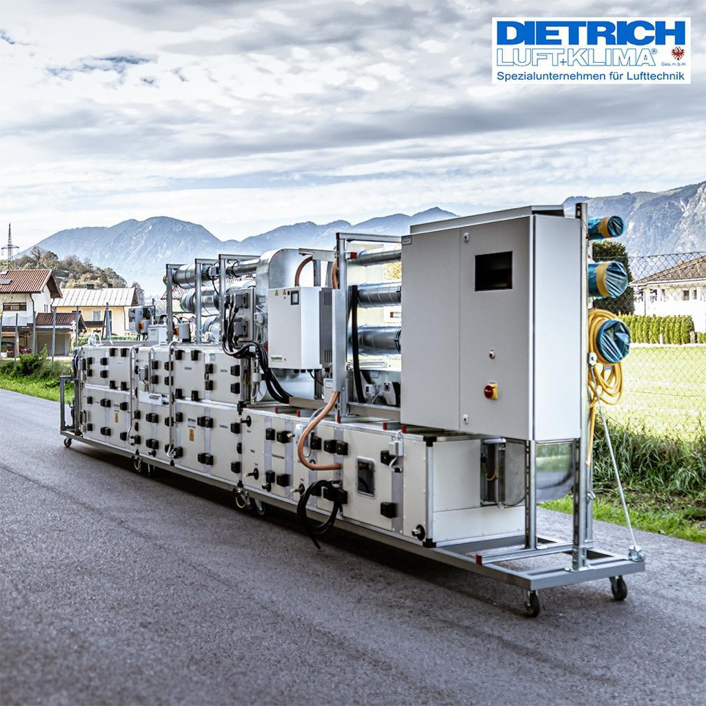
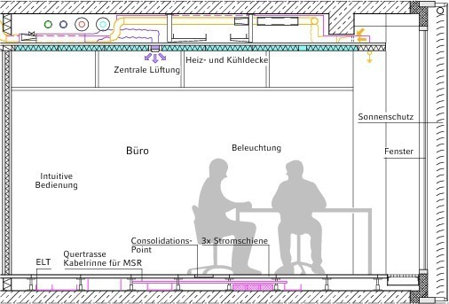
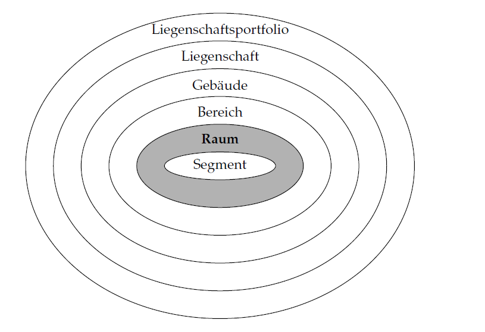
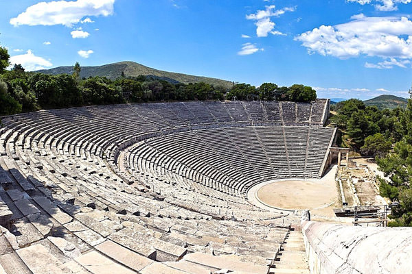
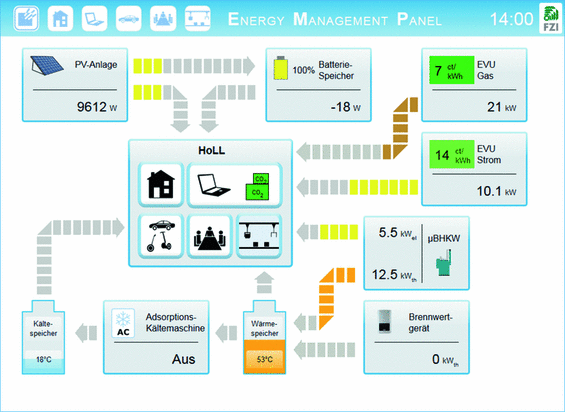
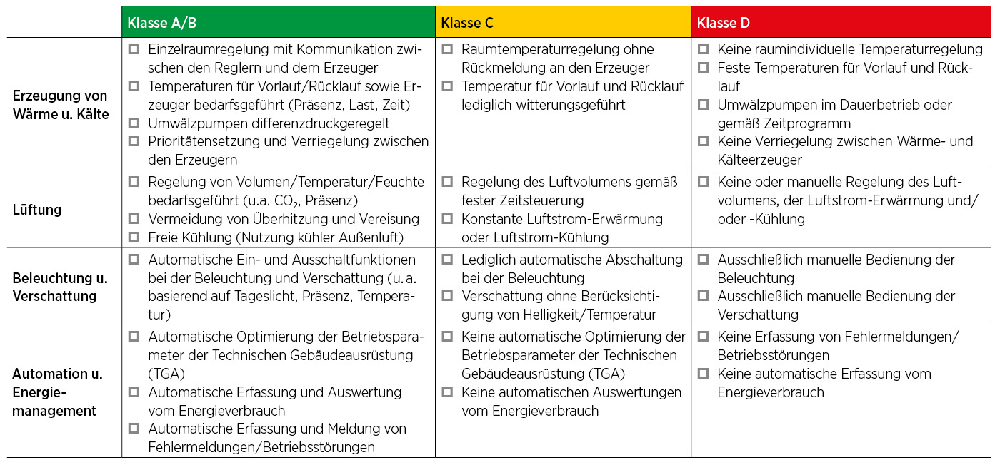
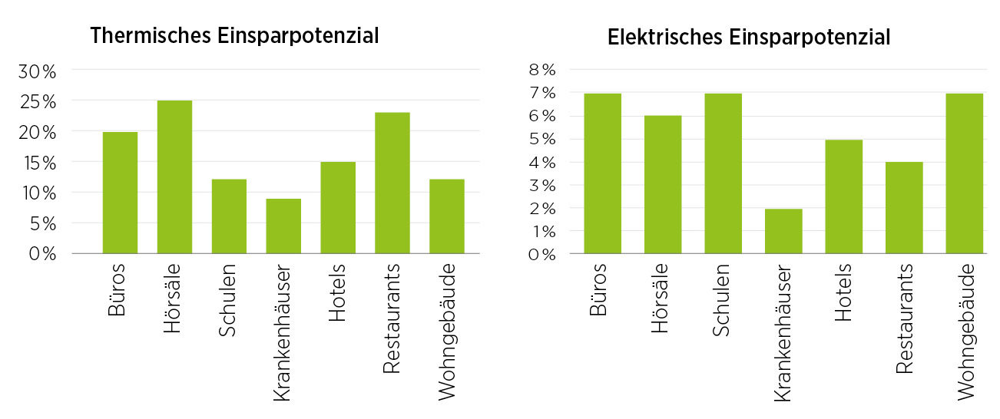

<!-- paginate: true -->

# 1.1 Gebäudeautomation

<!-- _class: title -->

---

## Orientierung – Einheit 1 von 14

<!-- _class: white -->

### Wo sind wir?

| Abgeschlossen | **Heute** | Als nächstes |
|---|---|---|
| — | **Einheit 1: Einführung GA** | Einheit 2: Planung & Funktionen |

### Was haben wir bisher gelernt?

*(Erste Einheit – Los geht's!)*

### Wo wollen wir hin?

Wir starten mit der Frage: **Warum automatisieren wir Gebäude überhaupt?** Wir lernen, wie GA in Komfort, Energieeffizienz und Betriebskosten wirkt, und strukturieren die Aufgaben nach VDI-Normen in Feld-, Automations- und Managementebene.

---

## 🎯 Lernziele – Einheit 1

* Ziele der Gebäudeautomation (Komfort, Energie, Betriebskosten) erklären
* Ebenenmodell nach VDI 3814 (Feld / Automation / Management) beschreiben
* Schalenmodell nach VDI 3813 (Segment / Raum / Bereich) beschreiben
* Raum-, Anlagen- und Management-Automation abgrenzen
* EN 15232 – Energieeffizienzklassen durch GA erklären

### Aufgaben dieser Einheit

| Aufgabe | Inhalt |
|---------|--------|
| ✍️ 1_1_1 | Energieeffizienz durch Gebäudeautomation einer Hochschule |

---

## Aufgaben der Gebäudeautomation

* Sicherstellung von Komfort und Sicherheit
* Energieeffizienz
* Betriebskostenoptimierung
* Produktiviätssteigerung

---

## Abgrenzung verschiedene Ebenen der Gebäudeautomation

>Struktur nach VDI 3814

[Lauckner und Krimmling 2020]

---

## Abgrenzung nach Aufgabe

### Anlagenautomation
die Regelung, Steuerung, Prozessführung und Überwachung von Technikzentralen im Gebäude, u. a. Heizungsanlagen, Anlagen der Lüftungs-, Klima- und Kältetechnik

---

## Abgrenzung nach Aufgabe

### Raumautomation
dezentrale Teilprozesse, zur Aufrechterhaltung eines **lokalen** Raumklimas durch Steuerungen und Bedienung der Geräte.

---

## Abgrenzung nach räumlicher Ebene

### Schalenmodell nach VDI 3813 Blatt 1

Unterteilung von Liegenschaftsportfolios in kleinere Teile. Diese spielen auch bei der Planung von Raumautomation und Anlagenautomation eine Rolle. z.B.:
- Wird die Energieversorgung eines Gebäudes zentral gesteuert?
- Wie granular soll die Raumautomation sein? Auf Segment-, Raum- oder Bereichsebene?

---
## Abgrenzung nach räumlicher Ebene

### Segment: 
* kleinste Einheit im Schalenmodell
* ein Raum kann aus mehreren Segmenten bestehen,
* die für sich selbst funktionsfähig sind

---

## Abgrenzung nach räumlicher Ebene

### Raum: 

* ein Volumen, das von sechs Bauteilen abgeschlossen wird

### Bereich:
* Zusammenschluss mehrerer Räume 
  * z.B. Flur mit Toiletten und einigen Büros, 
  * z.B. eine ganze Etage
  * z.B. ein Foyer

---

## Abgrenzung nach räumlicher Ebene

### Gebäude:

* *"Gebäude sind selbständig benutzbare überdeckte bauliche Anlagen, die von Menschen betreten werden können."*

[BayBO Art. 2 Abs. 2]

---
## Abgrenzung nach Aufgabe

### Gebäudeautomation-Management

übergeordnete Prozesse, zur Überwachung und Steuerung (Gebäudeleittechnik)

[Quelle](https://link.springer.com/chapter/10.1007/978-3-319-25876-8_9)

---

## Abgrenzung nach Hierarchie
### Automatisierungspyramide

<!-- _class: white -->

- Anlagen- und Raumautomation müssen **verknüpft** sein
    - z. B. die Anpassung der zentralen Wärmeerzeugung an den dezentralen Wärmebedarf in den Gebäudezonen
* Verknüpfung erfolgt in der **Automationsebene**  z. B. Prozessüberwachung und  Optimierung

[Lauckner und Krimmling 2020]

---

## Energieeffizienzklassen der DIN EN 1523

Teilt Gebäude in Energieeffizienzklassen von A (sehr effizient) bis E (wenig effizient) anhand der Energieeinsparung durch Gebäudeautomation ein

[DAB](https://www.dabonline.de/bautechnik/energieeffizienz-foerderung-gebaeudeautomation-pflicht-beg-smart-home/)

---

## Energieeffizienzklassen der DIN EN 1523

### Verwendung der Energieeffizienzklassen

- Teilweise vorgegeben durch Förderprogramme (z. B. KfW)
- Erlaubt erste Einschätzung der Energieeffizienz und gibt Anhaltspunkte für die Planung von GA-Maßnahmen (_um wie viel Erhöht sich die Energieeffizienz durch ein welchsel von __Klasse D auf Klasse B?__? für einen bestimmten Gebäudetyp?_)

---

## ✍️ Aufgabe 1_1_1: Energieeffizienz durch Gebäudeautomation einer Hochschule (ca. 15 Min., Dreier-Gruppe)

Diskutieren Sie in Ihrer Gruppe, welche Maßnahmen der Gebäudeautomation in einem Hochschulgebäude sinnvoll sein könnten, um die Energieeffizienz zu verbessern. Denken Sie dabei sowohl an thermische Maßnahmen (z. B. Heizung, Lüftung) als auch an elektrische Maßnahmen (z. B. Beleuchtung, Verschattung). Einigen Sie sich dann auf **eine** Maßnahme, die Sie genauer ausarbeiten.

### Maßnahme beschreiben
Beschreiben Sie kurz, was Ihre Maßnahme konkret verändert: Was wird automatisiert, und welchen Effekt erwarten Sie auf den Energieverbrauch?

---

### Einordnen
Verorten Sie Ihre Maßnahme in (Mehrfachnennung möglich):
- der **Automatisierungspyramide** (Feld- / Automations- / Managementebene) – auf welcher Ebene greift Ihre Maßnahme hauptsächlich?
- dem **Schalenmodell** (Segment / Raum / Bereich / Gebäude) – auf welcher räumlichen Ebene wirkt sie?

### Kurz bewerten
Nennen Sie eine Herausforderung, die bei der Umsetzung auftreten könnte (z. B. Kosten, Nachrüstung im Bestand, Nutzerakzeptanz).

### Ergebnisse festhalten
Halten Sie Ihre Ergebnisse stichpunktartig fest – wir besprechen sie anschließend im Plenum.

---

## Fazit

* Gebäudeautomation ist ein komplexes Thema mit verschiedenen Zielfunktionen und Nutzergruppen
* Einzelne Anlagen müssen gesteuert werden
* Räume müssen der Nutzung entsprechend gesteuert werden
* Gebäudeautomation-Management ist die übergeordnete Instanz, die die Anlagen- und Raumautomation im Besten Fall verknüpft