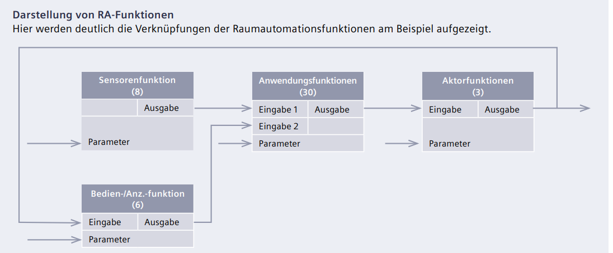
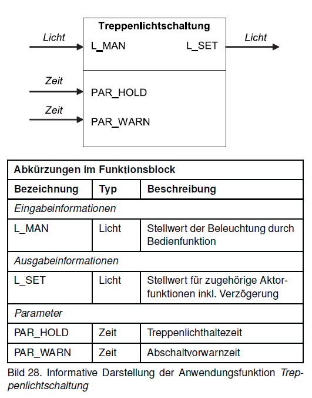
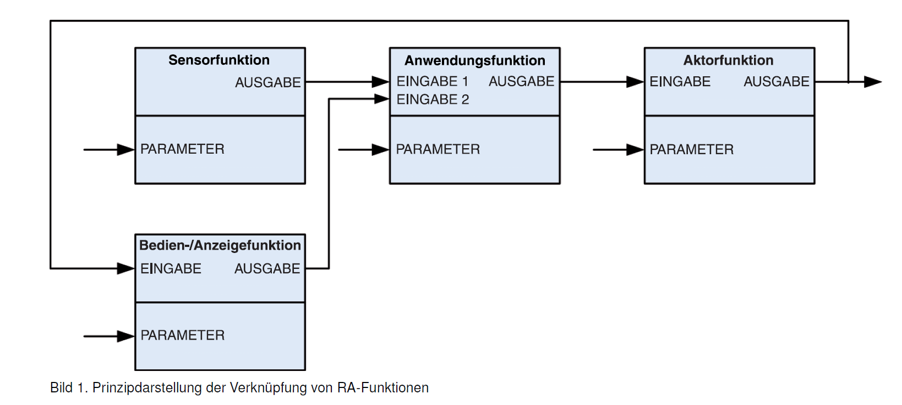
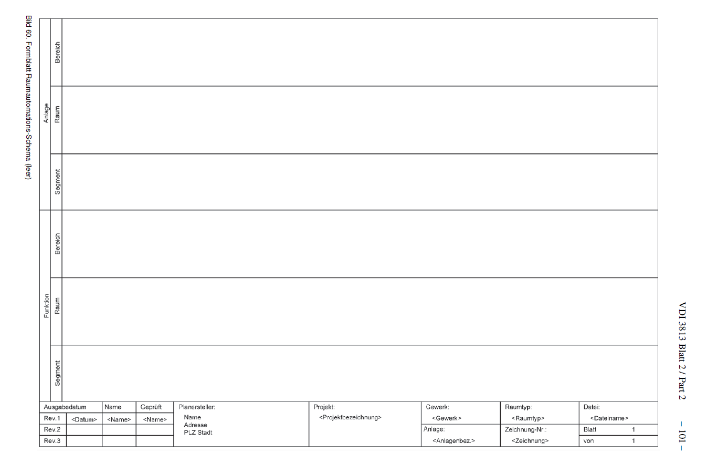
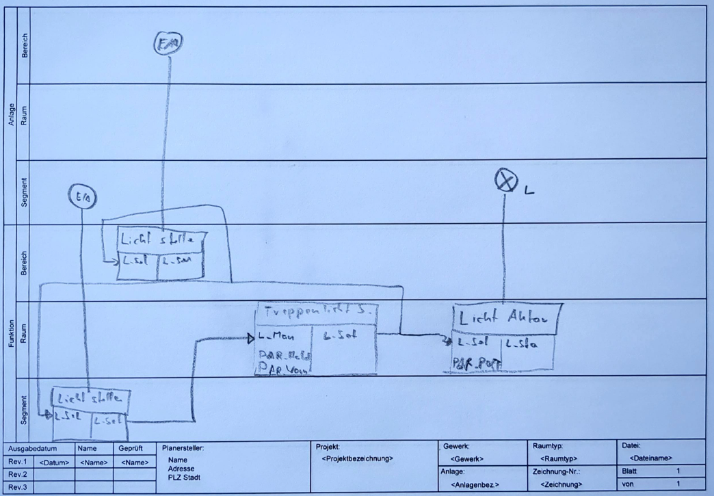

<!-- paginate: true -->


# 1.2 Planungsabläufe

* Im  folgenden wird ein Planungsablauf für die Gebäudeautomation (vereinfacht stilisiert) vorgestellt
* Hierbei wird auf das Beispiel einer Raumautomation eingegangen

---

## Planungsabläufe für die Gebäudeautomation

<!-- _class: white -->
<center>


</center>


[Quelle](Hochschule Biberach - Nachhaltiges Planen, Bauen und Betreiben durch Einsatz von Gebäudeautomation)


---

| Leistungsphase |                      Bezeichnung                     | Gebäude (§ 34) | Innenräume (§ 34) | Technische Ausrüstung (§ 55) |
|:---------------------:|:----------------------------------------------------:|:--------------:|:-----------------:|:----------------------------:|
|           1           | Grundlagenermittlung                                 |       2 %      |        2 %        |              2 %             |
|           2           | Vorplanung                                           |       7 %      |        7 %        |              9 %             |
|           3           | Entwurfsplanung                                      |      15 %      |        15 %       |             17 %             |
|           4           | Genehmigungsplanung                                  |       3 %      |        2 %        |              2 %             |
|           5           | Ausführungsplanung                                   |      25 %      |        30 %       |             22 %             |
|           6           | Vorbereitung der Vergabe                             |      10 %      |        7 %        |              7 %             |
|           7           | Mitwirkung bei der Vergabe                           |       4 %      |        3 %        |              5 %             |
|           8           | Objektüberwachung – Bauüberwachung und Dokumentation |      32 %      |        32 %       |             35 %             |
|           9           | Objektbetreuung                                      |       2 %      |        2 %        |              1 %             |
|         Summe         |                                                      |      100 %     |       100 %       |             100 %            |

[Quelle](Leistungsbild gemäß HOAI 2013 und HOAI 2021)

---

## Grundlagenermittlung und Bedarfsplanung

* Zunächst wird z.B. während der Ausschreibungsphase ein **Lastenheft** erstellt, welches beschreibt **was** erreicht werden soll
* Häufig enthält dieses eine textuelle Beschreibung des gewünschten Endzustandes
* meist formuliert durch die Kund:in / Bauherr:in ggf. unterstützt durch einen Planungsbüro
* Je nach Projekt kann hier auch auf bestehende Normen verwiesen werden bzw. diese müssen berücksichtigt werden
  * z.B. Energieeffizienzklasse A nach [EN15232](https://assets.new.siemens.com/siemens/assets/api/uuid:ada002be-3fe1-4d03-8f8c-cafbd4ed6e96/auswahlhilfe-fur-energieeffizienz-funktionen-de.pdf)
  * d.h. Heizsystem mit Einzelraumre­gelung mit Kom­munikation und Bedarfsanforde­rung 

---

### 🤓 Österreich

- Leistungsgruppen der standardisierten Bauausschreibung
- Komponenten-basiert. D.h. es werden Komponenten(typen) beschrieben, die in der Ausschreibung verwendet werden sollen und weniger auf die Erfüllung von Funktionen eingegangen

- Leistungsgruppen
  - [LG 84 - GA-System Raumautomation](http://docplayer.org/141267828-Leistungsgruppe-lg-84-ga-system-raumautomation-ra-kennung-ht-version-012-leistungsbeschreibung-haustechnik.html)
  - [LG 85 GA-System Anlagenautomation (AA)](https://www.bmaw.gv.at/dam/jcr:082b2d59-2a63-4aff-b6fa-53d9872ea4d7/LG85%20-%20GA-System%20Anlagenautomation%20(AA).pdf)
  - [LG 86 GA-Management (GA-M)](https://www.bmaw.gv.at/dam/jcr:b480f287-0f66-40c9-9f3e-1fe925deaa39/LG86%20-%20GA-Management%20(GA-M).pdf)

---

### 🤓 Schweiz

* Stärkerer Fokus auf die Funktionen (z.B. durch Funktionstests)
*  KBOB [Empfehlung Gebäudetechnik](https://www.kbob.admin.ch/dam/kbob/de/dokumente/Publikationen/gebaeudetechnik/KBOB_Empfehlung_Geb%C3%A4udetechnik_Endfassung_2020_d.pdf.download.pdf/KBOB_Empfehlung_Geb%C3%A4udetechnik_Endfassung_2020_d.pdf) dient als Definition der Anforderung an die gebäude-technischen Installationen und Anlagen
---

## Vor- bis Genehmigungsplanung 

* Fachplaner nehmen eine formale Beschreibung der Funktionen vor
* Die konzipieren **wie** die Funktionen umgesetzt werden sollen (Pflichtenheft)
* Typisch für diese Phase ist die Erstellung von **Fließbildern** und **Schemata**
    * z.B. Stromlaufpläne, Pneumatikpläne, Hydraulikpläne, etc.
    * Raumautomations-Schema und Raumautomations-Funktionschema (VDI 3813)
    * Anlagenautomations-Schema und Anlagenautomations-Funktionschema (VDI 3814)


---

### Komponenten-Sicht durch Preplanning

<center>


</center>

[Quelle](https://www.eplan.de/unternehmen/news/automatisiertes-engineering-in-der-gebaudeautomation/)

---

### Funktions-Sicht durch Raumautomations-Schema (VDI 3813)

<center>


</center>


* Zuordnung von Sensoren, Aktoren und **Funktionen** zueinander
* und zu Raum vs. Segment (keine genaue Räumliche Positionierung)
* Blockbausteine für Funktionen: Nutzen Attribute der Sensoren, um Attribute der Aktoren zu verändern

---


#### Funktionen

```Python
def f(x):
    """this function's name is f. It takes a value x and returns a value y"""
    [...]
    y = 2*x
    return y

f(2) # Funktionsaufruf, führt die Funktion mit Argument aus und gibt Rückgabe aus
```


---


* **Eingaben**: Werte, die in die Funktion eingehen und sich abhängig vom Systemzustand ändern können
* **Parameter**: unveränderliche Werte, die einmalig konfiguriert werden (z.B. in Abhängigkeit der Raumgröße)
* **Ausgaben**: Werte, welche von der Funktion abhängig von Parametern und Eingaben zurückgegeben werden
* Viele Funktionen stehen für viele Systeme standardisiert zur Verfügung (z.B. [Loxone](https://www.loxone.com/dede/produkte/loxone-config/), [Beckhoff](https://infosys.beckhoff.com/index.php?content=../content/1031/tf8040_tc3_buildingautomation/9281637003.html&id=1985937068038063516), etc.)
* oder können selbst implementiert werden



Vorsicht, das stimmt nicht ganze mit der üblichen Benennung bei Programmiersprachen überein


---

##### Sensorfunktionen


> Ziel: **Erfassen** von Zuständen

- Präsenzerkennung,
- Fensterüberwachung, 
- Taupunktüberwachung,
- Lufttemperaturmessung,
- Helligkeitsmessung,
- Luftqualitätsmessung, 
- Windgeschwindigkeit,
- Niederschlag

[Quelle](VDI 3813)

---

##### Sensorfuktionen != Sensoren / Datenpunkte

* *"künstliche"* Trennung
* erhöht Flexibilität
* Ein Datenpunkt / Sensor
  * Lufttemperaturmessung
  * Luftqualitätsmessung
  * ggf. Taupunktüberwachung


[Quelle](https://www.sensorshop24.de/raumkombifuehler-fuer-temperatur-und-feuchte-0-10v-4-20ma)

---


##### Beispiel Verschattungkorrektur

<center>


</center>


[Quelle](https://infosys.beckhoff.com/index.php?content=../content/1031/tcplclibhvac/11659363083.html&id=)

---

#### Aktorfunktionen

> Ziel: **Steuerung** von Komponenten

* binärer Schaltaktor
* Lichtaktor,
* Sonnenschutzaktor,
* Stellantriebsaktor 
  (z.B: Heizkörper)


---

#### Bedien-, Anzeige und Managementfunktionen

- Bedien- und Anzeigefunktionen (**lokal**)
  - Stellantriebsaktor, Sonnenschutzstellen, Antriebstellen, Temperatursollwertstellen, Raumnutzungsart wählen, Präsenzmelden
- **Managementfunktionen**
  - Aufzeichnung, Archivierung und statistische Analyse


---

#### Anwendungsfunktionen 

> sind Programmabläufe die meist mehrere Aktoren und Sensoren miteinbeziehen

- **Raumklima**
    - Energieniveauwahl, Energieniveauwahl mit Startoptimierung,Sollwertermittlung, Funktionswahl, Temperaturregelung, Raum‐Zulufttemperatur‐Kaskade, Ventilatorsteuerung, Sequenzsteuerung, Stellwertbegrenzung, Luftqualitätsregelung, Nachtkühlung, Volumenstromregelung

---

#### Anwendungsfunktionen 


- **Beleuchtung**
  - Lichtschaltung, **Treppenlichtschaltung**, Automatiklicht, Tageslichtschaltung, Kostantlichtregelung, Dämmerungsschaltung 

- **Sonnenschutz**
  - Prioritätssteuerung, Dämmerungsautomatik, Sonnenautomatik, Lamellennachführung, Verschattungskorrektur, Thermoautomatik, Witterungsschutz

- **Übergreifend**
  - Belegungsauswertung, Steuerung über Raumnutzung, Zeitprogramm, Trennwandsteuerung, Thermoautomatik

---

#### Beispiel Treppenlichtschaltung

> Über die Funktion Treppenlichtschaltung können Beleuchtungseinrichtungen temporär eingeschaltet werden. Nach Ablauf der Treppenlichthaltezeit kann eine Abschaltvorwarnzeit aktiv werden, die den Nutzer z. B. durch kurzzeitige Unterbrechung(„Flackern“) über die bevorstehende Abschaltung informiert. Ein erneuter Empfang einer Eingabeinformation zum Einschalten startet die Verzögerungszeit neu. Die Funktion benötigt als Eingabeinformation das Ergebnis der Bedienfunktion Licht stellen und liefert ihrerseits die Ausgabeinformation für eine oder mehrere Aktorfunktionen Lichtaktor.



---

##### Zusammenhang zwischen verschiedenen Funktionen

<center>



</center>


[Quelle](https://assets.new.siemens.com/siemens/assets/api/uuid:c107cd4a-cbd2-4b40-aeaa-a1face4c3dc7/planungshandbuch-gebaudeautomation-de.pdf)


---

#### Schritt Raumautomations-Schema

<center>


</center>


---

#### Ableitungen aus Vorplanung und Raumautomations-Schema

* Raumautomations-Schema zielt insbesondere auf die Implementierung, der gezielten Funktionalität (Funktionsbausteine werden auch in der Programmierung eingesetzt)
* Grafisches Werkzeug: Intuitive Prüfung auf Vollständigkeit möglich
* Entscheidung für Raum und Segment
  * z.b. ein vs. mehrere Bewegungsmelder pro Segment
* Für die Mengenplanung und Installationsplanung ist eine andere Darstellung hilfreicher


---

## ✍️ Aufgabe 1_2_1: Raumautomationsschema für ein Treppenhaus

- Befüllen Sie das vorliegende Raumautomations-Schema mit den entsprechenden Funktionen für die Beleuchtung eines Treppenhauses (aus den Folien zuvor)
- Alle Leuchten werden über einen Aktor für das gesamte Treppenhaus zusammengefasst
- Das Treppenhaus verbindet zwei Stockwerke, auf jedem soll ein Bedienelement für die Beleuchtung angebracht werden
- Die Anwendungsfunktion Treppenlichtschaltung soll hierüber gesteuert werden können
- zusätzlich soll die Beleuchtung auch direkt aus der Gebäudeleittechnik für den Bereich gesteuert werden können

---

<center>



</center>


---

### ✔️ Lösung

<!-- _color: black -->

??? optional-class "💡 anzeigen"
  

---

## Ausführung

* Entscheidung für Hardware und Software, um die Funktionen umzusetzen
* Erstellung von **Detailplänen** und **Dokumentationen**
* Installation der Hardware und Verkabelung
* Implementierung von Software
* Funktionstests


---

### Beispiel: Parametrisierung eines DALI-Systems


---

### Beispiel: Programmierung eine SPS 


---


### Bussysteme

* i.d.R. gibt es eine Vielzahl von möglichen Bussystemen, die für die Umsetzung der Funktionen in Frage kommen
* häufig werden mehrere Bussysteme kombiniert und müssen orchestriert werden
* neben den Kosten müssen auch Anforderungen an Erweiterbarkeit und Wartbarkeit berücksichtigt werden
* Erweiterbarkeit:
    * Wie einfach ist es, neue Komponenten hinzuzufügen?
    * Wie offen  ist das System für Veränderungen?
Wartbarkeit:
      * Sind Dienstleister oder Personal verfügbar, die das System warten können?    
      * Ist davon auszugehen, dass das System in 10 Jahren noch verfügbar ist?

---

## Betriebsphase

* Softwareupdates:
    * Wie können Softwareupdates eingespielt werden?
    * Over-the-Air vs manuell?
    * Wie werden die Updates getestet?
* Funktionstests:
    * Wie kann die Funktionalität überprüft werden?
    * Wie können Fehler identifiziert werden?

---


### Automatisierungspyramide


---

### Cloud

* Zunehmende Bedeutung von Cloud-Systemen
* Insbesondere die höheren Ebenen der Automatisierungspyramide werden zunehmend in die Cloud verlagert

---

## Appendix: Ausgewählte Anwendungsfunktionen


### Funktionen für die Raumklimaregelung II

- **Startoptimierung**
Wird dem Raumtemperaturregler über ein Zeitprogramm zusätzlich zum gegenwärtigen **Energieniveau** auch das **nächste** und der zugehörige **Zeitpunkt** mitgeteilt, ist der Regler in der Lage, den optimalen Aufheizzeitpunkt des Raums anhand zusätzlicher Informationen, wie der Raum- und der Außentemperatur, so zu bestimmen, dass die gewünschte Raumtemperatur genau zu dem gewählten Zeitpunkt zur Verfügung steht (Erweiterung der Energieniveauwahl).

- **Fensterüberwachung**
Bei geöffneten Fenstern sorgt die Fensterüberwachung für eine automatische Umschaltung auf das **Energieniveau Gebäudeschutz** um Energieverschwendung zu vermeiden. Der Zustand der Fenster wird über entsprechende Kontakte eingelesen.

---

### Funktionen für die Raumklimaregelung III

- **Sollwertermittlung**
Abhängig vom Energieniveau muss ein **Raumtemperaturregler** in der Lage sein, die korrekte Sollwertvorgabe zu ermitteln. Zusätzlich kann der Sollwert bei hohen Außentemperaturen gleitend angehoben werden (**Sommerkompensation**), um zu große Unterschiede zur Raumtemperatur zu vermeiden.

- **Temperaturregelung**
Die **eigentliche Regelung der Raumtemperatur** durch Ermittlung der korrekten Stellantriebsstellung für Heizen oder Kühlen erfolgt durch die Funktion Temperaturregelung. In den meisten Fällen kommen **PI-Regler** zum Einsatz, die in der Lage sind, statische Regelabweichungen zu eliminieren.

---

### Funktionen für die Raumklimaregelung IV

- **Ventilatorsteuerung**
Luftgestützte Anlagen, z. B. Gebläsekonvektoren, verfügen über Ventilatoren zum Lufttransport. Die Luftmenge kann dabei meist mehrstufig an die erforderliche Heiz- oder Kühlleistung angepasst werden. Die **Wahl der geeigneten Ventilatorstufe** erfolgt anhand der Differenz der Ist- zur Soll-Raumlufttemperatur oder analog zu den Stellantrieben der Heiz- oder Kühlregister.

- **Luftqualitätsregelung**
Wird die Versorgung der Räume mit Frischluft über mechanische Systeme, wie Zentral- oder Fassadenlüftungsanlagen gewährleistet, wird die **Zuluftmenge** zur Einsparung elektrischer Energie für die Ventilatoren **an die Raumluftqualität angepasst**.

---

### Funktionen für die Raumklimaregelung IV


- **Nachtkühlung**
Kühle Nachtluft lässt sich zum Herunterkühlen der Raumluft nutzen, falls **Fenster oder Fassadenklappen motorisch geöffnet** werden können oder **Gebläsekonvektoren** mit Zuluftklappen vorhanden sind. Diese Funktion sollte mit Hilfe der gemessenen lokalen Raumtemperatur und der Außentemperatur raumindividuell ausgeführt werden, um eine optimale Absenkung zu erreichen.

- **Thermoautomatik**
Durch die Fenster eintretendes Sonnenlicht sorgt für einen Wärmeeintrag in den Raum, der je nach Raumtemperatur willkommen oder unwillkommen ist. Die Thermoautomatik übernimmt **in unbelegten Räumen** nun die Kontrolle über den **Sonnenschutz** zur Unterstützung von Heiz- oder Kühlvorgängen. So kann im Sommer eine Überhitzung vermieden und im Winter die Heizung durch solare Gewinne entlastet werden.


---

### Funktionen für Beleuchtung, Blendschutz und Tageslichtnutzung

- **Konstantlichtregelung**
Ein Sensor zur Erfassung der Raumhelligkeit, z. B. innerhalb eines Multisensors, sorgt für die exakte Anpassung des **Beleuchtungsniveaus** an die Arbeitsaufgabe. Hierfür erforderlich sind **dimmfähige** Aktoren (analoger Ausgang).

- **Tageslichtschaltung**
Der "kleine Bruder" der Konstantlichtregelung ist überall dort einsetzbar, wo die Beleuchtung **nur schaltbar** ausgeführt werden kann. Zur Erfassung der Helligkeit ist ebenfalls ein Sensor im Raum erforderlich. Unterschreitet das Tageslicht die erforderliche Raumhelligkeit, wird Kunstlicht automatisch in ein oder mehreren Stufen zugeschaltet und bei Zunahme des Tageslichtanteils wieder abgeschaltet (digitaler Ausgang).


---

### Funktionen für Beleuchtung etc. II


- **Automatiklicht**
In Räumen ohne ausreichende Tageslichtversorgung, z. B. in Fluren oder Sanitärräumen, lässt sich Energie sparen, indem die Beleuchtung nur temporär eingeschaltet wird. Die **Präsenzerkennung** liefert die hierfür erforderlichen Sensordaten. Eine einstellbare **Abschaltverzögerung** sorgt für Beleuchtungskomfort.


- **Sonnenautomatik**
**Außenliegende** Jalousien und bedingt auch Markisen sorgen vor allem für einen **Wärmeschutz** des Gebäudes. **Innenliegende** Jalousien, Vertikallamellen u. ä. sorgen vor allem für **Blendfreiheit** an Arbeitsplätzen. Die Sonnenautomatik sorgt nutzt Wetterdaten, damit der außenliegende Sonnenschutz eine einstellbare Position immer dann einnimmt, wenn eine bestimmte Strahlungsintensität überschritten wird. Der innen liegende Blendschutz ist i. d. R. nicht automatisiert, da das Blendungsempfinden individuell zu bewerten ist.

---

### Funktionen für Beleuchtung etc. III


- **Lamellennachführung**
Die Lamellennachführung ist eine **Weiterentwicklung der Sonnenautomatik**. Bei hoher Strahlungsintensität fährt der Sonnenschutz dazu in eine Stellung, die **zyklisch dem Sonnenstand** angepasst wird. So wird unter Aufrechterhaltung des Blendschutzes die Tageslichtversorgung maximiert. 


- **Verschattungskorrektur**
Umliegende Gebäude oder eigene Gebäudeteile sorgen auf den Fassaden für Schattenwurf, der die Blendschutzfunktion für die **im Schatten liegenden Jalousien zeitweise unnötig** macht. Die Jalousien sollten für eine bessere Tageslichtversorgung in dieser Zeit geöffnet sein. Die Verschattungskorrektur korrigiert dies in Verbindung mit der Sonnenautomatik oder der Lamellennachführung arbeitet. Die Funktion wird gelegentlich auch Jahresverschattungsdiagramm genannt.

---

### Funktionen für Beleuchtung etc. IV


- **Dämmerungsschaltung**
Außenbeleuchtung ist nur dann erforderlich, wenn es dunkel wird. Da der Zeitpunkt jahreszeitlich variiert, sorgt die Dämmerungsschaltung selbstständig für den optimalen Einschaltmoment. 

- **Witterungsschutz**
Witterungsschutzfunktionen vermeiden Schäden an der Sonnenschutzanlage. Sensoren für Temperatur, Niederschlag, Windgeschwindigkeit und -richtung stellen die erforderlichen Wetterdaten zur Verfügung, damit der Sonnenschutz rechtzeitig vor Beschädigungen eingezogen wird (ggf. auch für Fenster).
