<!-- paginate: true -->

# 2.1 Messkette

<!-- _class: title -->

**Bussysteme** Julian Huber & Michael Renzler

------------------------------------------------------------------------

## Orientierung – Einheit 3 von 14

<!-- _class: white -->

### Wo sind wir?

| Abgeschlossen | **Heute** | Als nächstes |
|------------------------|------------------------|------------------------|
| Einheit 1: Einführung GA | **Einheit 3: Messkette I** | Einheit 4: Messkette II (analog) |
| Einheit 2: Planung & Funktionen |  |  |

------------------------------------------------------------------------

### Was haben wir bisher gelernt?

-   Ziele der Gebäudeautomation (Komfort, Energie, Betriebskosten)
-   Ebenenmodell nach VDI 3814, Schalenmodell nach VDI 3813
-   Raumautomations-Schema: Sensoren, Aktoren, Anwendungsfunktionen
-   Konzept der [Treppenlichtschaltung](https://wokwi.com/projects/456837337834711041) und [Konstantlichtregelung](https://wokwi.com/projects/457476528115988481)

------------------------------------------------------------------------

### Wo wollen wir hin?

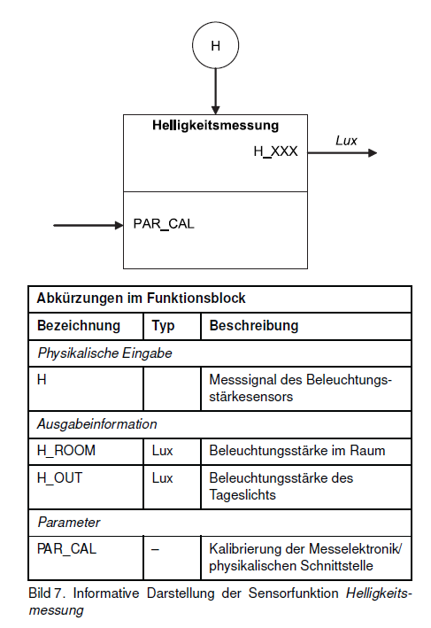

Heute erarbeiten wir das Fundament aller weiteren Kapitel: **Wie gelangen Signale aus der physikalischen Welt (Helligkeitsensor `H`) in unsere Steuerung (Sensorfunktion Helligkeitsmessung)?** Wir nehmen den Raspberry Pi Pico in Betrieb und lernen digitale Ein- und Ausgänge kennen.

------------------------------------------------------------------------

## 🎯 Lernziele – Einheit 3

-   EVA-Prinzip (Eingabe – Verarbeitung – Ausgabe) erläutern
-   Digitale Ein- und Ausgänge am Raspberry Pi Pico anschließen und programmieren
-   Pull-Up- und Pull-Down-Beschaltung von Tastern erklären und anwenden
-   CircuitPython-Code schreiben, übertragen und testen
-   LED und Taster korrekt verschalten (Vorwiderstand, GPIO-Grenzen)

---

### Aufgaben dieser Einheit

| Aufgabe  | Inhalt                                                  |
|----------|---------------------------------------------------------|
| ✍️ 2_1_1 | Raspberry Pi Pico als Mikrocontroller in Betrieb nehmen |
| ✍️ 2_1_2 | Taster mit Pull-Up-Widerstand anschließen               |
| ✍️ 2_1_3 | LED anschließen und über Taster schalten                |

------------------------------------------------------------------------

## EVA-Prinzip

<!-- _class: white -->


-   Gebäudeautomation wird durch eine Steuerungseinheit überwacht und gesteuert (,die __Funktionen__ implementiert indem Sie Signale __verarbeitet__
-   __Eingangs__-Signale der __Sensoren__ werden gemessen und __Ausgangs__-Signale erzeugt
-   Steuerungseinheiten sind heute meist frei programmierbar (z.B. Speicherprogrammierbare Steuerung) oder wurden für bestimmte Funktionen vorprogrammiert (z.B. Mikrocontroller in LED-Vorschaltgeräten)
- Er kann mittels Python programmiert werden, was den Einstieg erleichtert

---

## Motivation: Programmieren mit einem Raspberry Pi Pico

-   Ein Mikrocontroller ist ein kleiner Computer auf einem einzigen integrierten Schaltkreis, der einen Prozessor, Speicher und Ein-/Ausgangsperipherie enthält
- In der Gebäudeautomation werden Mikrocontroller überall zum Einsatz kommen, z.B. in Sensoren, Aktoren, Steuerungen, Gateways
-  Der Raspberry Pi Pico ist ein kostengünstiger Mikrocontroller, der sich ideal für für schnelle Experimente eignet (z.B. auch Versuche in der Bachelorarbeit)


---

## Raspberry Pi Pico


### Digitale Eingänge und Ausgänge (`GPIOs`)

-   `GPIOs` können nur zwei Zustände unterscheiden(0:`False` oder 1:`True`)
-   Die Zustände werden durch Spannungen repräsentiert
-   i.d.R. gibt es Spannungsbereiche, die als `0` oder `1` interpretiert werden


---

## ✍️ Aufgabe 2_1_1: Raspberry Pi Pico als Mikrocontroller

-   Beim Raspberry Pi Pico handelt es sich um einen Mikrocontroller, der mittels Python programmiert werden kann
-   Im folgenden wird folgende Hardware benötigt:
    -   Raspberry Pi Pico (WH)
    -   Breadboard
    -   3 Taster
    -   Widerstand ca. $470 \Omega$ und $10 \,\text{k}\Omega$
    -   Jumperkabel (M-M und M-F)
    -  USB-Kabel
    - 3 LEDs
-   Ziel ist es, dass der Mikrocontroller den Taster ausliest und den Zustand auf der Konsole ausgibt

------------------------------------------------------------------------

### CircuitPython installieren

-   Halten Sie den `BOOTSEL` Taster auf dem Pico gedrückt und verbinden Sie diesen über USB mit dem Rechner
-   Passende Firmware [UF2-File](https://circuitpython.org/board/raspberry_pi_pico_w/) herunterladen und in den als USB-Laufwerk erkannten Pico kopieren
-   Pico sollte jetzt neue Starten und die Firmware installieren
-   Nach dem erneuten Verbinden sollten nun einige Programme im Pico liegen

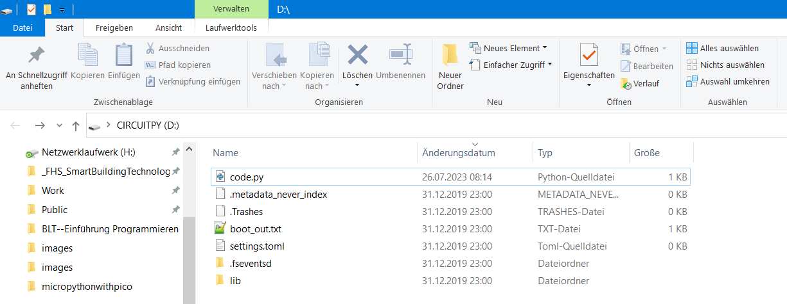

------------------------------------------------------------------------

### Programmieren des Pico mittels CircuitPython

-   Öffnen Sie im Chrome Browser die Seite des [Online Editors](https://code.circuitpython.org/) in einem Chromium-basierten Browser
-   Verbinden Sie Sich mittels USB
-   Wählen Sie die Schnittstelle `CircuitPython CDC Control` aus
-   Öffnen Sie das Verzeichnis (USB-Laufwerk) `CIRCUITPY` und wählen Sie `USE /`
-   Öffnen Sie die Datei `code.py` und fügen Sie den folgenden Inhalt ein
-   Öffnen Sie die Serielle Schnittstellen, um die Ausgabe zu sehen `Serial`, übertragen Sie den Code und starten Sie den Pico neu `Save + Run`

### Alternative

https://urfdvw.github.io/circuitpython-online-ide-2/

------------------------------------------------------------------------

### Digitaler Zwilling mit [wokwi.com](https://wokwi.com/projects/424662007489899521)

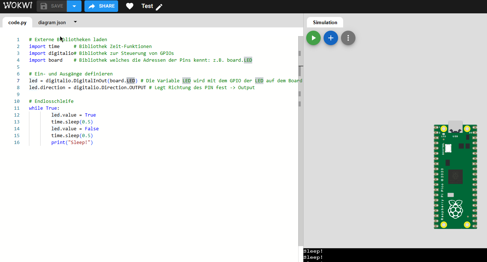

------------------------------------------------------------------------

### Hauptprogramm `code.py`

-   Dieses Programm wird automatisch ausgeführt und ist der Einsteigspunkt für alle Programme (vgl. `MAIN` bei TwinCat)
-   Passen Sie das Hauptprogramm so an, dass die LED länger hell als dunkel ist
-   Passen Sie die Ausgabe an indem Sie `"Sleep!"` ersetzen

``` python
# Externe Bibliotheken laden
import time     # Bibliothek Zeit-Funktionen
import digitalio# Bibliothek zur Steuerung von GPIOs
import board    # Bibliothek welches die Adressen der Pins kennt: z.B. board.LED

# Ein- und Ausgänge definieren
led = digitalio.DigitalInOut(board.LED) # Die Variable LED wird mit dem GPIO der LED auf dem Board verbunden
led.direction = digitalio.Direction.OUTPUT # Legt Richtung des PIN fest -> Output

# Endlosschleife
while True:
        led.value = True
        time.sleep(0.5)
        led.value = False
        time.sleep(0.5)
        print("Sleep!")
```

------------------------------------------------------------------------

### Pin-Übersicht


-   VCC Voltage Common Connector: Spannungs- Versorgung $5$ oder $3.3 \,\text{V}$
    -   Alles unter $0,8\,\text{V}$ ist __low__
    -   alles über $1,3\,\text{V}$ ist __high__
-   Ground: $0 \,\text{V}$
-   Einige GPIOs können als Busleitungen genutzt werden: UART, SPI, I2C

[Quelle](https://www.elektronik-kompendium.de/sites/raspberry-pi/2002191.htm)

------------------------------------------------------------------------

### Breadboards

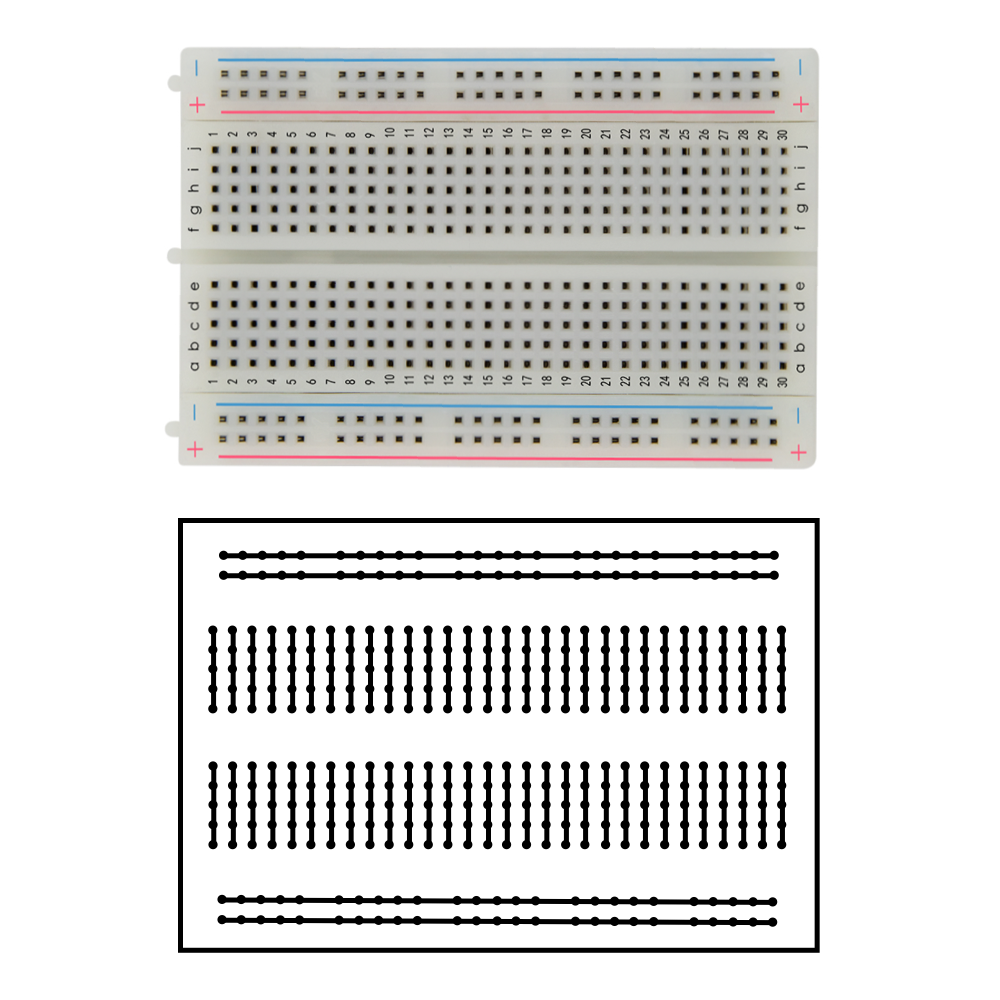 

- Steckplatine für Systemtest und Prototyping - vier Reihen für Spannungsversorgung - weitere Raster sind längs verbunden

[Quelle](https://www.elektronik-kompendium.de/sites/praxis/bauteil_steckbrett.htm)

------------------------------------------------------------------------

### General Purpose Input/Output

-   Digitale Ein- und Ausgänge
-   GPIO arbeiten von $2...16 \,\text{mA}$
-   GPIOs können binär gelesen und geschaltet werden
-   [Pin-Belegung](https://www.elektronik-kompendium.de/sites/raspberry-pi/2611051.htm)


------------------------------------------------------------------------

### [✔️ Lösung](Aufgaben\2_1_1\code.py)

<!-- _color: black -->

??? optional-class "💡 anzeigen" `python     --8<-- "Aufgaben\2_1_1\code.py"`

------------------------------------------------------------------------

## ✍️ Aufgabe 2_1_2: Anschluss eines Tasters an einen Raspberry Pi Pico

<!-- _class: white -->

-   Schließen Sie den Taster wie folgt an

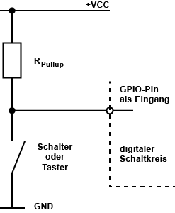

-   $R_{pullup} = 10 \,\text{k}\Omega$
-   Verbinden Sie den Taster mit dem $3.3 \text{~V}$ Pin und dem `GPIO 0`
-   Fügen Sie die folgenden Code- Teile an den richtigen Stellen ein und starten Sie das Programm

------------------------------------------------------------------------

``` python
import time
import board
import digitalio

button_pin = board.GP0  # Replace with the GPIO pin connected to your button

button = digitalio.DigitalInOut(button_pin)
button.direction = digitalio.Direction.INPUT
button.pull = digitalio.Pull.UP  # Use pull-up resistor; change if using pull-down

while True:
    if not button.value:  # Button is pressed (LOW)
        print("Button Pressed!")
    else:
        print("Button Released!")
    
    time.sleep(0.1)  # Add a small delay to debounce the button
```

------------------------------------------------------------------------

#### GPIO-Eingang mit Taster/Schalter und Pullup-Widerstand

<!-- _backgroundColor: white -->

<!-- _color: grey -->


-   Unbeschaltet oszillieren die GPIOs häufig unsauber zwischen den Zuständen
-   Grundzustand des Eingangs bei offenem Schalter: `high`
-   Durch schließen: `low`
-   $4{,}7~\text{k}\Omega$ als Standardwert
-   (RaspBerry Pis haben eingebaute Widerstände, die aktiviert werden können)

[Quelle1](https://www.elektronik-kompendium.de/sites/raspberry-pi/2110081.htm),[Quelle2](https://www.elektronik-kompendium.de/sites/raspberry-pi/2006051.htm)

------------------------------------------------------------------------

#### GPIO-Eingang mit Taster/Schalter und Pulldown-Widerstand

<!-- _backgroundColor: white -->

<!-- _color: grey -->

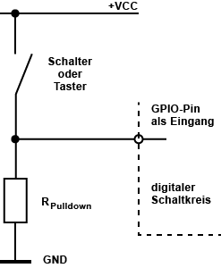

-   Grundzustand des Eingangs: `low`
-   Durch schließen: `high`
-   der Regel $10~\text{k}\Omega$

------------------------------------------------------------------------

### Zusammenfassung Schalter und Taster

-   In der Praxis tendiert man dazu, GPIO-Eingänge mit einem Pullup-Widerstand mit +VCC zu verbinden und gegen Ground (GND) zu schalten
-   Erfordert Negation in der Software
-   Werte von $10$ bis $100~\text{k}\Omega$
-   [GPIO-Eingang mit Taster/Schalter und Querwiderstand](https://www.elektronik-kompendium.de/sites/raspberry-pi/2110081.htm)
-   [Mehr zu Pull-Up vs Pull-Down](https://www.elektronik-kompendium.de/sites/raspberry-pi/2006051.htm)

------------------------------------------------------------------------

### Digitale Ausgänge

<!-- _class: white -->


-   Ausgänge können mit einer Spannung beschaltet werden
-   Bei einem Raspberry Pi Pico sind die Ausgänge auf $3.3 \,\text{V}$ begrenzt
-   Die Ausgänge können bis zu $16 \,\text{mA}$ liefern

------------------------------------------------------------------------

### [✔️ Lösung](Aufgaben\2_1_2\code.py)

<!-- _color: black -->

??? optional-class "💡 anzeigen" `python     --8<-- "Aufgaben\2_1_2\code.py"`

------------------------------------------------------------------------

## ✍️ Aufgabe 2_1_3: Anschluss einer LED an einen Raspberry Pi Pico

-   Nun wollen wir eine LED anschließen in der Folge über den Taster schalten
-   Die LED soll nach einem Druck auf den Taster ihren Zustand wechseln
-   Passen Sie den Code entsprechend an und nutzen Sie dazu die folgenden Code-Teile

``` python
import time
import board
import digitalio


led_pin = board.GP1      # Replace with the GPIO pin connected to your LED

# Define the LED as a digital output
led = digitalio.DigitalInOut(led_pin)
led.direction = digitalio.Direction.OUTPUT

while True:
    led.value = not led.value  # Toggle the LED state
    time.sleep(0.2)
```

[Quelle](https://www.elektronik-kompendium.de/sites/raspberry-pi/2612031.htm)

------------------------------------------------------------------------

### Leuchtdioden

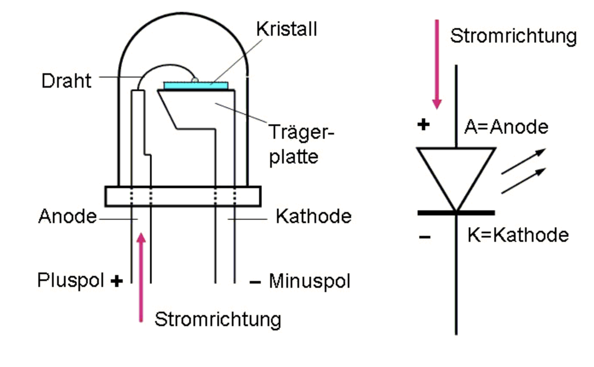

- _Merke:_ Langes Bein: Anode

[Quelle](https://nawi-werft.de/bausteine/led-ansteuern/)

------------------------------------------------------------------------

### Ausgang verschalten

<!-- _class: white -->

-   links: LED an Masse
    -   GPIO auf high \--> LED an
-   rechts: LED an VCC
    -   GPIO auf low \--> LED an
-   $R_v = 470 \,\Omega$, Vorwiderstand für LED, um Strom zu begrenzen

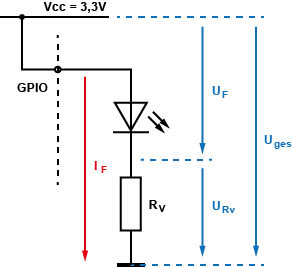 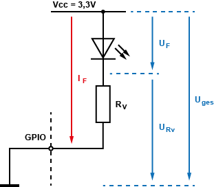

[Quelle](https://www.elektronik-kompendium.de/sites/raspberry-pi/2102181.htm)

------------------------------------------------------------------------

### Ausgang verschalten

-   Wählen Sie einen geeigneten GPIO
-   Schließen Sie die LED in Reihe an den GPIO und einen Widerstand an und verbinden Sie die andere Seite des Widerstands mit Ground ($0\text{ V}$)

------------------------------------------------------------------------

### [✔️ Lösung](Aufgaben\2_1_3\code.py)

<!-- _color: black -->

??? optional-class "💡 anzeigen" `python     --8<-- "Aufgaben\2_1_3\code.py"`

------------------------------------------------------------------------

## Ausblick 

### Pulsweitenmodulation

-   Digitale Ausgänge können nur zwei Zustände annehmen (0 /`False` oder 1 : `True`)
-   Einige Verbraucher (z.B. Motoren, LEDs) kann man über PWM quasi-analog steuern (Ausgangsleistung quasi-stetig anpassen)
-   Hierzu muss man Periodendauer $T$ und Duty Cycle $t$ (Impulsdauer) geeignet setzen
-   Die Frequenz $f = \frac{1}{T}$ ist beim Raspberry Pi Pico standardmäßig $500 \,\text{Hz}$

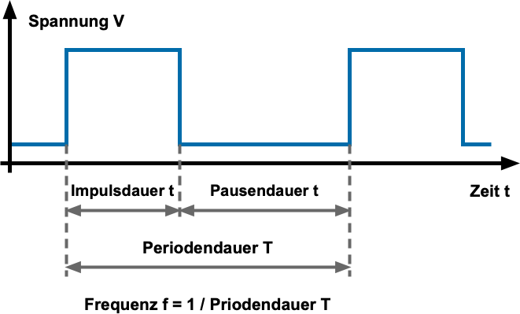

[Quelle](https://www.elektronik-kompendium.de/sites/kom/0401111.htm)


---

## Fazit


- Um Automatisierungsfunktionen zu implementieren, müssen Signale von Sensoren in die Steuerungseinheit gelangen und von dort aus Aktoren angesteuert werden
- Hierzu wird das EVA-Prinzip (Eingabe – Verarbeitung – Ausgabe) genutzt und in Steuerungseinheiten meist frei programmierbare Mikrocontroller eingesetzt
- Digitale Ein- und Ausgänge sind die Grundlage vieler Anwendungen
- Taster werden mit Pull-Up oder Pull-Down Widerständen angeschlossen, um stabile Signale zu gewährleisten


<!--
#### Relais und Schütze

-   Für viele Anwendungen ist die Leistung der GPIOs nicht ausreichend ($P=UI=3.3\text{ V} \cdot 4\text{ mA} = 13.2 \text{ mW}$)
-   Eine höhere Spannung an den Ausgängen ist nicht möglich (Sicherheit, Energieeffizienz, Bauform)
-   Relais sind elektromagnetische Schalter, die eine hohe Leistung schalten können indem sie einen Schaltkontakt öffnen oder schließen
-   heute meist nicht mehr mechanisch sondern elektronisch realisiert mit Zusatzfunktionen (Stromstoßrelais, Zeitrelais, Schütze)

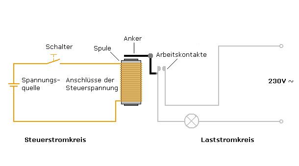

------------------------------------------------------------------------

##### 🤓 Selbsthaltefunktion

-   Hierbei wird durch das Schließen des Schalters ein Stromkreis geschlossen, der das Relais anzieht und somit ein andauerndes Schließen des Schalters ermöglicht \> Wenn der Taster S2 (Schließer) betätigt wird, zieht das Relais K1 an und schließt den Kontakt K1. Wenn der Taster S2 nun losgelassen wird, überbrückt ihn der Kontakt K1 und das Relais bleibt weiterhin angezogen. Durch Betätigung des Tasters S1 (Öffner) wird das Relais stromlos und fällt ab, K1 ist damit offen. Wenn S2 betätigt wird, würde wieder K1 anziehen und in die Selbsthaltung gehen.

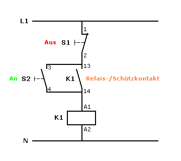

[Quelle](https://de.wikipedia.org/wiki/Selbsthaltefunktion)

------------------------------------------------------------------------


------------------------------------------------------------------------
-->