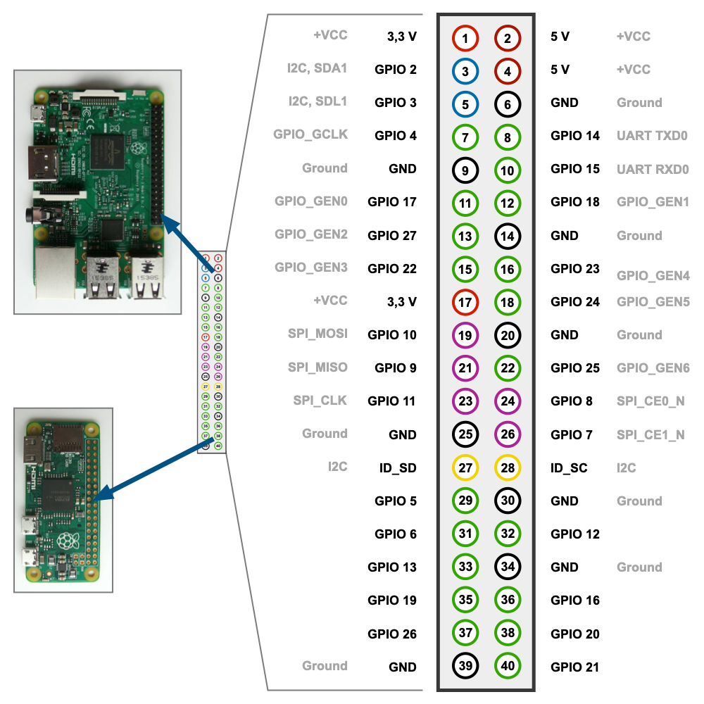
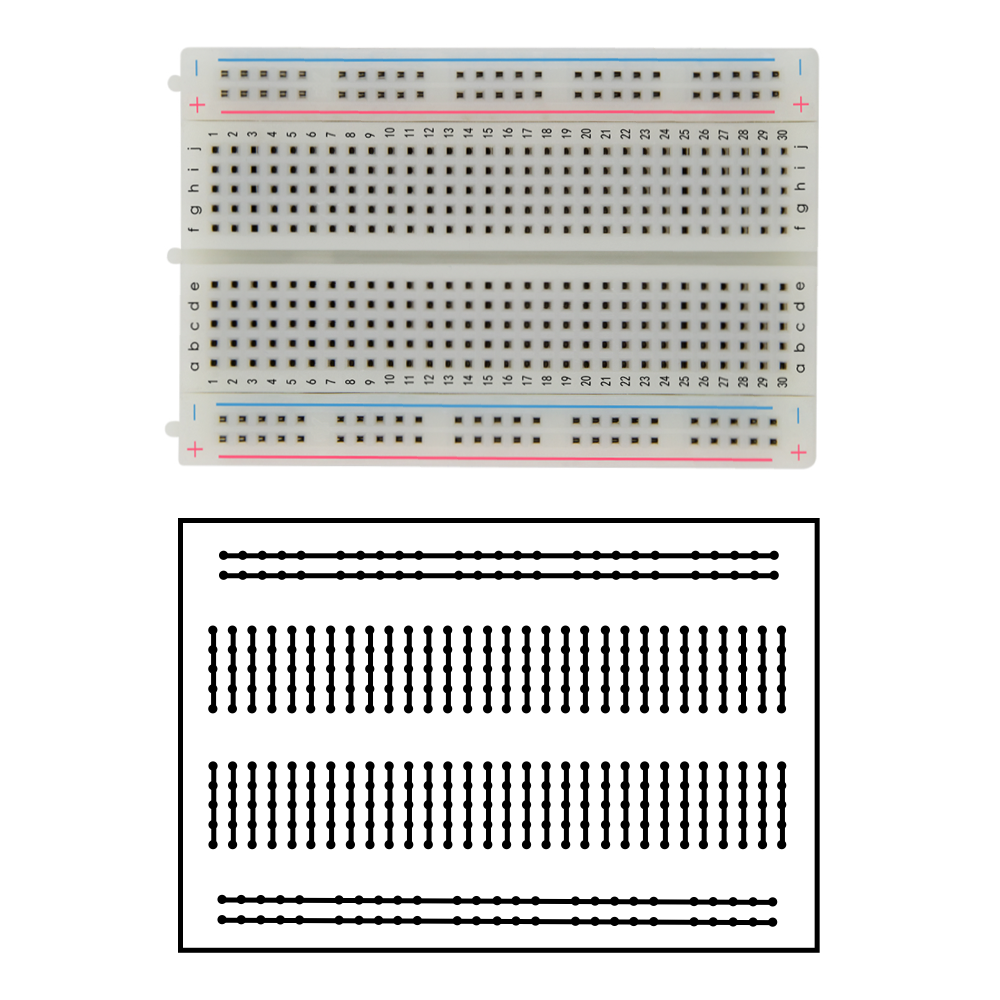
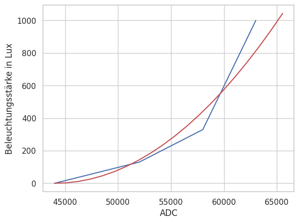

<!-- paginate: true -->

# Bussysteme

**SoSe 2023**
Dr. Julian Huber

---

# Messkette	

---
## EVA-Prinzip


* Gebäudeautomation wird durch eine Steuerungseinheit überwacht und gesteuert
* Hierzu werden Eingangssingale gemessen und Ausgangssignale erzeugt
* In der Steuerungseinheit werden Funktionen implementiert, die die Messsignale in Ausgangssignale umwandeln
* Steuerungseinheiten sind heute meist frei programmierbar (z.B. Speicherprogrammierbare Steuerung) oder wurden für bestimmte Funktionen vorprogrammiert (z.B. Mikrocontroller in LED-Vorschaltgeräten)

---

### Digitale Eingänge

* Digitale Eingänge können nur zwei Zustände annehmen (0 /`False` oder 1 : `True`)
* Die Zustände werden durch Spannungen repräsentiert
* i.d.R. gibt es Spannungsbereiche, die als 0 oder 1 interpretiert werden

---

## :writing_hand: Aufgabe 2_1_1: Raspberry Pi Pico als Mikrocontroller

* Beim Raspberry Pi Pico handelt es sich um einen Mikrocontroller, der mittels Python programmiert werden kann
* Im folgenden wird folgende Hardware benötigt:
    * Raspberry Pi Pico
    * Breadboard
    * Taster
    * Widerstand ca. $470 \Omega$ und $10 \,\text{k}\Omega$
    * Jumperkabel
* Ziel ist es, dass der Mikrocontroller den Taster ausliest und den Zustand auf der Konsole ausgibt

---

### CircuitPython installieren

* Halte den `BOOTSEL` Taster auf dem Pico gedrückt und verbinde diesen über USB mit dem Rechner
* Passende Firmware [UF2-File](https://circuitpython.org/board/raspberry_pi_pico_w/) herunterladen und in den als USB-Laufwerk erkannten Pico kopieren
* Pico sollte jetzt neue Starten und die Firmware installieren
* Nach dem erneuten Verbinden sollten nun einige Programme im Pico liegen


---

### Programmieren des Pico mittels CircuitPython

* Öffenen Sie im Chrome Browser die Seite des [Online Editors](https://code.circuitpython.org/)
* Verbinden Sie Sich mittels USB
* Wählen Sie die Schnittstelle `CircuitPython CDC Control` aus
* Öffnen Sie das Verzeichnis (USB-Laufwerk) `CIRCUITPY` und wählen Sie `USE /`
* Öffnen Sie die Datei `code.py` und fügen Sie den folgenden Inhalt ein
* Öffnen Sie die Serielle Schnittstellen, um die Ausgabe zu sehen `Serial`, übertragen Sie den Code und starten Sie den Pico neu `Save + Run`
---

### Hauptprogramm `code.py`

- Dieses Programm wird automatisch ausgeführt und ist der Einsteigspunkt für alle Programme (vgl. `MAIN` bei TwinCat)
- Passen Sie das Hauptprogramm so an, dass die LED länger hell als dunkel ist
- Passen Sie die Ausgabe an indem Sie `"Sleep!"` ersetzen
```python
# Externe Bibliotheken laden
import time     # Bibliothek Zeit-Funktionen
import digitalio# Bibliothek zur Steuerung von GPIOs
import board    # Bibliothek welches die Adressen der Pins kennt: z.B. board.LED

# Ein- und Ausgänge definieren
led = digitalio.DigitalInOut(board.LED) # Die Variable LED wird mit dem GPIO der LED auf dem Board verbunden
led.direction = digitalio.Direction.OUTPUT # Legt Richtung des PIN fest -> Output

# Endlosschleife
while True:
        led.value = True
        time.sleep(0.5)
        led.value = False
        time.sleep(0.5)
        print("Sleep!")
```

---


### Pin-Übersicht



- VCC Voltage Common Connector: Spannungs- Versorgung $5$ oder $3.3 \,\text{V}$
     - Alles unter $0,8\,\text{V}$ ist low
     - alles über $1,3\,\text{V}$ ist high
- Ground: $0 \,\text{V}$
- Einige GPIOs können als Busleitungen genutzt werden: UART, SPI, I2C


###### https://www.elektronik-kompendium.de/sites/raspberry-pi/2002191.htm

---


### Breadboards


- Steckplatine für Systemtest und Prototyping
- vier Reihen für Spannungsversorgung
- weitere Raster sind längs verbunden 

###### https://www.elektronik-kompendium.de/sites/praxis/bauteil_steckbrett.htm


--- 

###  General Purpose Input/Output

* GPIO arbeiten von $2...16 \,\text{mA}$
* GPIOs können binär gelesen und geschaltet werden


---

## :writing_hand: Aufgabe 2_1_1: Anschluss eines Tasters an einen Raspberry Pi Pico


- Schließen Sie den Taster wie folgt an

- $R_{pullup} = 10 \,\text{k}\Omega$
- Verbinden Sie den Taster mit dem 3.3V Pin und dem GPIO 0
- Fügen Sie die folgenden Code- Teile an den richtigen Stellen ein und starten Sie das Programm

---

```python
import time
import board
import digitalio

button_pin = board.GP0  # Replace with the GPIO pin connected to your button

button = digitalio.DigitalInOut(button_pin)
button.direction = digitalio.Direction.INPUT
button.pull = digitalio.Pull.UP  # Use pull-up resistor; change if using pull-down

while True:
    if not button.value:  # Button is pressed (LOW)
        print("Button Pressed!")
    else:
        print("Button Released!")
    
    time.sleep(0.1)  # Add a small delay to debounce the button
```

---

#### GPIO-Eingang mit Taster/Schalter und Pullup-Widerstand

<!-- _backgroundColor: white -->
<!-- _color: grey -->


- Unbeschaltet oszillieren die GPIOs häufig unsauber zwischen den Zuständen
- Grundzustand des Eingangs bei offenem Schalter: `high`
- Durch schließen: `low`
- $4{,}7~k\Omega$ als Standardwert
- (RaspBerry Pis haben eingebaute Widerstände, die aktiviert werden können)


###### https://www.elektronik-kompendium.de/sites/raspberry-pi/2110081.htm, https://www.elektronik-kompendium.de/sites/raspberry-pi/2006051.htm

---

#### GPIO-Eingang mit Taster/Schalter und Pulldown-Widerstand

<!-- _backgroundColor: white -->
<!-- _color: grey -->


- Grundzustand des Eingangs: `low`
- Durch schließen: `high`
-  der Regel $10~k\Omega$

---

### Zusammenfassung Schalter und Taster

- In der Praxis tendiert man dazu, GPIO-Eingänge mit einem Pullup-Widerstand mit +VCC zu verbinden und gegen Ground (GND) zu schalten
- Erfordert Negation in der Software
- Werte von $10$ bis $100~k\Omega$
- [GPIO-Eingang mit Taster/Schalter und Querwiderstand](https://www.elektronik-kompendium.de/sites/raspberry-pi/2110081.htm)
- [Mehr zu Pull-Up vs Pull-Down](https://www.elektronik-kompendium.de/sites/raspberry-pi/2006051.htm)

---

### Digitale Ausgänge

* Ausgänge können mit einer Spannung beschaltet werden
* Bei einem Raspberry Pi Pico sind die Ausgänge auf $3.3 \,\text{V}$ begrenzt
* Die Ausgänge können bis zu $16 \,\text{mA}$ liefern


---

## :writing_hand: Aufgabe 2_1_3: Anschluss einer LED an einen Raspberry Pi Pico

* Nun wollen wir eine LED anschließen in der Folge über den Taster schalten
* Sie LED soll nach einem Druck auf den Taster für $1\,\text{s}$ leuchten
* passen Sie den Code entsprechend an und nutzen Sie dazu die folgenden Code-Teile


```Python
import time
import board
import digitalio


led_pin = board.GP1      # Replace with the GPIO pin connected to your LED


led = digitalio.DigitalInOut(led_pin)
led.direction = digitalio.Direction.OUTPUT

while True:
    led.value = not led.value  # Toggle the LED state
    time.sleep(0.2)  # Add a small delay for debouncing
    time.sleep(0.1)
```


###### https://www.elektronik-kompendium.de/sites/raspberry-pi/2612031.htm

---

### Leuchtdioden


- Langes Bein: Anode

###### https://nawi-werft.de/bausteine/led-ansteuern/


---

### Ausgang verschalten

<!-- _backgroundColor: white -->
<!-- _color: black -->

* links: LED an Masse 
    * GPIO auf high > LED an
* rechts: LED an VCC
    * GPIO auf low > LED an

 


###### https://www.elektronik-kompendium.de/sites/raspberry-pi/2102181.htm


---

### Ausgang verschalten

* Wählen Sie einen geeigneten GPIO
* Schließen Sie die LED in Reihe an den GPIO und einen Widerstand an und verbinden Sie die andere Seite des Widerstands mit Ground ($0V$)


---

#### Relais und Schütze

* Für viele Anwendungen ist die Leistung der GPIOs nicht ausreichend ($P=UI=3.3V \cdot 4mA = 13.2 mW$)
* Eine höhere Spannung an den Ausgängen ist nicht möglich (Sicherheit, Energieeffizienz, Bauform)
* Relais sind elektromagnetische Schalter, die eine hohe Leistung schalten können indem sie einen Schaltkontakt öffnen oder schließen
* heute meist nicht mehr mechanisch sondern elektronisch realisiert


---

#### Pulsweitenmodulation

* Digitale Ausgänge können nur zwei Zustände annehmen (0 /`False` oder 1 : `True`)
* Einige Verbraucher (z.B. Motoren, LEDs) kann man über PWM quasi-analog steuern
* Hierzu muss man Periodendauer $T$ und Duty Cycle $t$ geeignet setzen

 

###### https://www.elektronik-kompendium.de/sites/kom/0401111.htm

---

## :nerd_face: :writing_hand: Aufgabe 2_1_4: Anschluss einer LED mit PWM an einen Raspberry Pi Pico

* Sorgen Sie nun dafür, dass die LED mit PWM angesteuert wird, so dass diese nach Betätigung des Tasters für $1\,\text{s}$ leuchtet und dann langsam über $5\,\text{s}$ ausgeht

---

```python
import pwmio
import board

pwm = pwmio.PWMOut(board.GP1)  # output on LED pin with default of 500Hz

while True:
    for cycle in range(0, 65535):  # Cycles through the full PWM range from 0 to 65535
        pwm.duty_cycle = cycle  # Cycles the LED pin duty cycle through the range of values
    for cycle in range(65534, 0, -1):  # Cycles through the PWM range backwards from 65534 to 0
        pwm.duty_cycle = cycle  # Cycles the LED pin duty cycle through the range of values
```

---

### Analoge Eingänge

* Sensoren liefern meist analoge Signale (z.B. Spannung, Strom, Widerstand)
* z.B. basieren viele Temperatur-Sensoren auf dem Widerstand von Metallen
* Damit änder sich bei gleichbleibender Spannung der Strom, welcher am Eingang gemessen werden kann

---

#### Analog-Digital-Wandler

* Der Analog-Digital-Wandler (ADC) wandelt ein analoges Signal in eine digitale Zahl um
* Dabei gibt es zwei relevante Parameter
    * Auflösung: Anzahl der möglichen Werte
    * Referenzspannung: Spannungsbereich, der in die Auflösung abgebildet wird
    * z.B. 16 Bit Auflösung und $3.3 \,\text{V}$ Referenzspannung $\Rightarrow$ $2^{16} = 65536$ Werte zwischen $0$ und $3.3 \,\text{V}$
* Zudem können sich Systeme in ihrer Abtastrate unterscheiden, d.h. wie oft Werte gelesen werden können

---

## :writing_hand: Aufgabe 2_1_4: Anschluss eines Analogen Helligkeitssensors

* Schließen Sie einen [analogen Helligkeitssensor](https://www.elektronik-kompendium.de/sites/praxis/bauteil_ky018-ldr.htm) an den Raspberry Pi Pico an
    * Links (-): GND / Masse / 0 Volt
    * Mitte: +VCC z.B. 3,3 oder 5 Volt
    * Rechts (S): Verbindungspunkt des Spannungsteilers 
* Fixwiderstand $10 \,\text{k}\Omega$ zwischen +VCC und S
* Verdunkeln Sie und beleuchten Sie den Sensor und beobachten Sie die Änderung des Eingangswertes

---

* Zum Testen können Sie den Analog-Eingang mit $3.3 \text{ Volt}$ und $0 \text{ Volt}$ verbinden
* Lesen Sie den Wert des Sensors aus und geben Sie diesen auf der Konsole aus

```Python
import board
import analogio
import time

# Initialisierung des ADC (Analog-Digital Converter)
ldr = analogio.AnalogIn(board.A2)

# Wiederholung
while True:
    # ADC als Dezimalzahl lesen
    read = ldr.value
    # Ausgabe in der Kommandozeile/Shell
    print("ADC:", read)
    # Warten
    time.sleep(1)
```

###### https://www.elektronik-kompendium.de/sites/raspberry-pi/2612221.htm

---


---

#### Mapping von Eingangswert zu physikalischer Größe

* Um sinnvoller mit den Werten arbeiten zu können, ist es sinnvoller die gelesen Werte `read` in eine Variable mit einer sinnvollen physikalischen Einheit  zu überführen
* Im Fall dieses Sensors und Aufbaus lassen sich die Werte gut mit einer Parabel anpassen
* $E= f(x) = (a(x-s))^2$
    * $a =0.0015 $ ist die Steigung der Parabel
    * $s = 44000$ ist der Verschiebung der Parabel auf der x-Achse
    * $x$ ist der Eingangswert



---


##### Übliche Beleuchtungsstärken $E$

| Umfeld | $E \text{ in lux}$ |
|--------|-------------------|
| Mondlose, klare Nacht | 0,0003 |
| Nachts bei Vollmond | 0,2 |
| Beleuchtete Strassen, Plätze | 10..20 |
| Abstellräume, Lagerräume | 50 |
| Lagerräume, Toiletten, Treppen | 100 |
| Speiseräume, Werkhallen, | 200 |
| Läden, Sitzungszimmer | 300 |
| Arbeitsplätze, Schulzimmer | 500 |
| erhöhte Ansprüche | 750 |
| Elektronikmontage, Uhrenmacher | 1.000 |
| Bedeckter Himmel im Winter | 1.000.. 2.000 |
| Bedeckter Himmel im Sommer | 5.000..20.000 |
| Sonnenlicht im Winter | 10.000 |
| Sonnenlicht im Sommer | 100.000 |


---

##### Nachverarbeitung nach ADC

* Viele (teurere) Peripherie-Geräte kommen als Transmitter (Kombination aus dem Sensor selbst und einem Messumformer)
* Diese linearisieren sie spannungs-(oder Strom) Ausgabe
* Eine Umrechnung der Spannungswerte an Eingang in die Physikalische Größen muss jedoch weiterhin stattfinden
* Informationen hierzu finden sich meinst im [Datenblatt](https://shop.bb-sensors.com/out/media/Bedienungsanleitung_Helligkeitssensor_Messumformer_0555%20300x.pdf)


###### https://shop.bb-sensors.com/Messtechnik-je-Branche/Gebaeudetechnik/Helligkeitssensor-mit-Messumformer-0-10-V.html

---

## :writing_hand: Aufgabe 2_1_5: Mapping eines Analogen Helligkeitssensors

* Oben ist die quadratische Funktion gegeben, die die gemessenen Werte in Beleuchtungsstärke in Lux umrechnet
* Implementieren Sie diese Funktion in Python und geben Sie dann eine Nachricht mit der Beleuchtungsstärke in Lux aus
* Orientieren Sie sich dabei an folgendem Code, der ein Beispiel für ein lineares Mapping zeigt


---

| Symbol | Description |
|--------|-------------|
| $E_{max}$ | maximale Beleuchtungsstärke |
| $E_{min}$ | minimale Beleuchtungsstärke |
| $z_{max}$ | maximaler Messwert des ADC |
| $z_{min}$ | minimaler Messwert des ADC |

* Annahme: Linearer Zusammenhang
    $E = f(z) = \beta_0 + \beta_1 z$
* 1: Wie groß ist der Y-Achsenabschnitt $\beta_0$?
    * Bei welchen Wert hat $E$, wenn $z=0$?
* 2: Wie groß ist die Steigung $\beta_1$?
    * Wie groß ist die Änderung von $E$ pro Änderung von $z$?
    * $\beta_1 = \frac{E_{max} - E_{min}}{z_{max} - z_{min}}$


---

* Der folgende Code übernimmt dein Eingangswert und gibt einen normalisierten Wert zwischen 1 und 0 zurück
* Erstellen Sie in einer Datei `mappings.py` (im gleichen Ordner, wie die `code.py`) eine Funktion `map_quat()`, die stattdessen die oben angegeben Formel implementiert


```Python
def map_lin(z):
    E_max = 1
    E_min = 0
    z_max = 65535
    z_min = 0
    beta_0 = E_min
    beta_1 = (E_max - E_min) / (z_max - z_min)
    return beta_0 + beta_1 * z
```

---

* :nerd_face: Im besten Fall wird `map_ln` in einer eigenen Datei `mappings.py` gespeichert und kann dann mittels `import mappings` in anderen Programmen genutzt werden	

```Python
import board
import analogio
import time
from mappings import map_lin

    
# Initialisierung des ADC (Analog-Digital Converter)
ldr = analogio.AnalogIn(board.A2)

# Wiederholung
while True:
    # ADC als Dezimalzahl lesen
    read = ldr.value
    # Ausgabe in der Kommandozeile/Shell
    print("ADC:", read)
    print("E in Lux", map_lin(read))
    # Warten
    time.sleep(1)
```


---

## :nerd_face: Verwendung von Globalen Variablen

- einige Variablen sind so grundlegend, dass wir Sie nicht im Code sondern zentral verändern wollen
- Hierzu können wird Umgebungsvariablen in der `settings.toml` verändern im Verzeichnis `CIRCUITPY` ändern

```
MY_NAME = "Julian"
```
- Im Code können diese mittels `os` aufgerufen werden

```Python
#  connect to your SSID
import os

print(os.getenv('MY_NAME'))
```

* Passen Sie den Code so an, dass die zur Umwandlung benötigten Werte als Umgebungsvariablen gesetzt werden können

---

## :nerd_face: :writing_hand: Aufgabe 2_1_6: 

* Nicht bei jedem Sensor wird die gefittete Kurve perfekt passen
* passen Sie den Code so an, dass die Parameter der Kurve in der `settings.toml` hinterlegt werden können, um diese möglichst einfach anzupassen


---

### Analoge Ausgänge

* Entsprechend gibt es auch analoge Ausgänge
* Diese können z.B. zur Ansteuerung von Motoren genutzt werden
* Dabei wird einer meist der Wert einer Integer-Variable im Speicher in einen Spannungswert umgewandelt