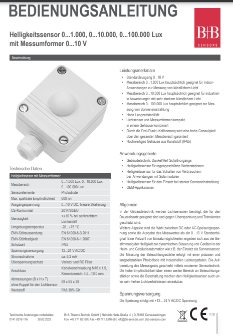

<!-- paginate: true -->


# 2.1 Messkette II – Analoge Signale & Mapping

<!-- _class: title -->

---

## Orientierung – Einheit 4 von 14

<!-- _class: white -->

### Wo sind wir?

| Abgeschlossen | **Heute** | Als nächstes |
|---|---|---|
| Einheit 3: Messkette I (digital) | **Einheit 4: Messkette II** | Einheit 5: Steuerung I (FSM) |

### Was haben wir bisher gelernt?

* EVA-Prinzip und digitale Ein-/Ausgänge am Pico
* Pull-Up/Pull-Down-Beschaltung, GPIO-Grenzen
* LED und Taster anschließen und programmieren

### Wo wollen wir hin?

Digitale Signale kennen nur 0 und 1. Viele Sensoren liefern aber **analoge Größen** (z.B. Helligkeit in Lux). Heute lernen wir, wie der ADC diese Werte erfasst und wie wir Rohwerte mit **Mapping-Funktionen** in physikalische Einheiten umrechnen. PWM ermöglicht dazu stufenlose Ausgangssteuerung – die Grundlage der Konstantlichtregelung.

---

## Lernziele – Einheit 4

* ADC-Auflösung und Referenzspannung erklären und berechnen
* PWM-Signal (Duty Cycle, Frequenz) parametrieren
* Analogen Helligkeitssensor anschließen und auslesen
* Lineares Mapping (ADC → Spannung) implementieren
* Quadratisches Mapping (ADC → Lux) implementieren und anpassen

### Aufgaben dieser Einheit

| Aufgabe | Inhalt |
|---------|--------|
| 🤓 ✍️ 2_1_4 | LED mit PWM stufenlos ansteuern |
| ✍️ 2_1_5 | Analogen Helligkeitssensor anschließen und kalibrieren |
| 🤓 ✍️ 2_1_6 | Quadratisches Mapping implementieren |

---

## 🤓 ✍️ Aufgabe 2_1_4: Anschluss einer LED mit PWM an einen Raspberry Pi Pico

> PWM ist die Grundlage für stufenlose Lichtsteuerung – und damit für die **Konstantlichtregelung** (Kapitel 3): Dort muss die Helligkeit nicht nur an/aus, sondern kontinuierlich auf einen Sollwert geregelt werden. Ein binärer Ausgang reicht dafür nicht – PWM macht es möglich.

* Sorgen Sie nun dafür, dass die LED mit PWM angesteuert wird, so dass diese nach Betätigung des Tasters für $1\,\text{s}$ leuchtet und dann langsam über $5\,\text{s}$ ausgeht

---

### Beispielcode für PWM

```Python
import pwmio
import board

pwm = pwmio.PWMOut(board.GP1)  # output on LED pin with default of 500Hz

while True:
    for cycle in range(0, 65535):  # Cycles through the full PWM range from 0 to 65535
        pwm.duty_cycle = cycle  # Cycles the LED pin duty cycle through the range of values
    for cycle in range(65534, 0, -1):  # Cycles through the PWM range backwards from 65534 to 0
        pwm.duty_cycle = cycle  # Cycles the LED pin duty cycle through the range of values
```

* Die Länge des Duty-Cycles wird durch $2^{16}=65536$ Werte abgestuft
* bei `duty_cycle = 0` der Duty-Cycle bei $0 \%$ und die LED aus
* bei `duty_cycle = 65535` der Duty-Cycle  genau so lang wie die Periodendauer

[Quelle](https://docs.circuitpython.org/en/latest/shared-bindings/pwmio/index.html)

---

### [✔️ Lösung](Aufgaben\2_1_4)

<!-- _color: black -->

??? optional-class "💡 anzeigen"
    ```python
    --8<-- "Aufgaben\2_1_4\code.py"
    ```

---

### Analoge Eingänge

<!-- _class: white -->


* Sensoren liefern meist analoge Signale (z.B. Spannung, Strom, Widerstand)
* z.B. basieren viele Temperatur-Sensoren auf dem Widerstand von Metallen
* Damit ändert sich bei gleichbleibender Spannung der Strom, welcher am Eingang gemessen werden kann

---

#### Analog-Digital-Wandler

* Der Analog-Digital-Wandler (ADC) wandelt ein analoges Signal in eine digitale Zahl um
* Dabei gibt es zwei relevante Parameter
    * Auflösung: Anzahl der möglichen Werte
    * Referenzspannung: Spannungsbereich, der in die Auflösung abgebildet wird
    * z.B. 16 Bit Auflösung und $3.3 \,\text{V}$ Referenzspannung 
    $\Rightarrow$ $2^{16} = 65536$ Werte zwischen $0$ und $3.3 \,\text{V}$
* Zudem können sich Systeme in ihrer Abtastrate unterscheiden, d.h. wie oft Werte gelesen werden können (z.B. durch den Sleep-Timer im `while`-loop)

---

## ✍️ Aufgabe 2_1_5: Anschluss eines analogen Helligkeitssensors

* Verbinden Sie die `+` und `-` Leiste des Breadboards mit $3.3 \,\text{V}$ und `GND` des Raspberry Pi Pico
* Verbinden Sie den analogen Eingang `A2` mit einem Female-to-Female-Kabel
* Fügen Sie den folgenden Code ein

---

```Python
import board
import analogio
import time

# Initialisierung des ADC (Analog-Digital Converter)
ldr = analogio.AnalogIn(board.A2)

# Wiederholung
while True:
    # ADC als Dezimalzahl lesen
    read = ldr.value
    # Ausgabe in der Kommandozeile/Shell
    print("ADC:", read)
    # Warten
    time.sleep(1)
```

- Um den Wertebereich des ADC zu testen, können Sie den Eingang direkt mit `+` und `-` verbinden

---

* Verbinden Sie den Eingang zunächst mit `+`, dann mit `-` 
* Welche Werte erhalten Sie?

---

### [✔️ Lösung](Aufgaben\2_1_5\code.py)

<!-- _color: black -->


??? optional-class "💡 anzeigen"
    * Bei einer direkten Verbindung des Eingangs mit `+` oder `-` erhalten Sie die maximalen (`2**16`) bzw. minimalen Werte (nahe `0`)


---


* Schließen Sie einen Fotowiderstand als [analogen Helligkeitssensor](https://www.elektronik-kompendium.de/sites/praxis/bauteil_ky018-ldr.htm) an den Raspberry Pi Pico an
    * Links (I): +VCC z.B. 3,3 oder 5 Volt
    * Mitte: GND / Masse / 0 Volt
    * Rechts (S): Verbindungspunkt des Spannungsteilers
* Sie können den Sensor entweder auf dem Breadboard montieren oder ihn mit Male-Female-Kabeln direkt verbinden
* Verdunkeln Sie und beleuchten Sie den Sensor und beobachten Sie die Änderung des Eingangswertes
* Je mehr Licht auf den Fotowiderstand fällt, desto kleiner wird sein Widerstand. 
* Optional können Sie auch die Beleuchtungsstärke mit einem Luxmeter messen und die Werte vergleichen

---


---

* Zum Testen können Sie den Analog-Eingang mit $3.3 \text{ Volt}$ und $0 \text{ Volt}$ verbinden
* Lesen Sie den Wert des Sensors aus und geben Sie diesen auf der Konsole aus
* Notieren Sie sich einige Werte (`ADC`) für verschiedene Hell-Dunkel-Verhältnisse (z.B. Zuhalten, Raumlicht, Taschenlampe) und notieren Sie die Werte


| Umgebung    | ADC | E in Lux | U in V |
|-------------|-----|----------|--------|
| Abgedunkelt |     |          | |
| Raumlicht   |     |          | |
| Taschenlampe|     |          | |


[Quelle](https://www.elektronik-kompendium.de/sites/raspberry-pi/2612221.htm)


---

#### Mapping von Eingangswert zu Spannung

* Die Spannung und der `ADC`- Wert sind linear zueinander
* Entsprechend kann jeder Wert des `ADC` über einer lineare Funktion in eine Spannung umgerechnet werden

---

| Symbol | Description |
|--------|-------------|
| $U_{max}$ | maximale Beleuchtungsstärke |
| $U_{min}$ | minimale Beleuchtungsstärke |
| $z_{max}$ | maximaler Messwert des ADC |
| $z_{min}$ | minimaler Messwert des ADC |

* Annahme: Linearer Zusammenhang
    $U = f(z) = \beta_0 + \beta_1 z$
* 1: Wie groß ist der Y-Achsenabschnitt $\beta_0$?
    * Bei welchen Wert hat $U$, wenn $z=0$?
* 2: Wie groß ist die Steigung $\beta_1$?
    * Wie groß ist die Änderung von $U$ pro Änderung von $z$?
    * $\beta_1 = \frac{{U_{max}} - U_{min}}{z_{max} - z_{min}}$


---

* Der folgende Code übernimmt dein Eingangswert und gibt einen Spannungs-Wert zwischen 3.3 und 0 zurück
* Fügen Sie die Funktion `map_lin` in den Code ein und geben Sie die Spannung auf der Konsole aus


```Python
def map_lin(z):
    U_max = 3.3
    U_min = 0
    z_max = 65535
    z_min = 0
    beta_0 = U_min
    beta_1 = (U_max - U_min) / (z_max - z_min)
    return beta_0 + beta_1 * z
```

* Wenn Sie Ihren Code schön aufgeräumt haben wollen können eine Datei `mappings.py` im gleiche Ordner wie `code.py` erstellen und die Funktion dort speichern
* Sie können diese dann mittels `from mappings import map_lin` ins `main.py` importieren und nutzen

---

#### Mapping von Eingangswert zu physikalischer Größe

* Um sinnvoller mit den Werten arbeiten zu können, ist es sinnvoller die gelesen `ADC`-Werte `read` in eine Variable mit einer sinnvollen physikalischen Einheit  zu überführen
* Im Fall dieses Sensors und Aufbaus lassen sich die Werte gut mit einer Parabel anpassen

---

* $E= f(x) = (a(x-s))^2$
    * $a =0.0015$ beschreibt die Steilheit der Parabel
    * $s = 44000$ ist der Verschiebung der Parabel auf der x-Achse
    * $x$ ist der Eingangswert


* Erstellen Sie in eine Datei `mappings.py` (im gleichen Ordner, wie die `code.py`) eine Funktion `map_quat()`, die stattdessen die oben angegeben Formel implementiert

---


##### Übliche Beleuchtungsstärken $E$

| Umfeld | $E \text{ in lux}$ |
|--------|-------------------|
| Mondlose, klare Nacht | 0,0003 |
| Nachts bei Vollmond | 0,2 |
| Beleuchtete Strassen, Plätze | 10..20 |
| Abstellräume, Lagerräume | 50 |
| Lagerräume, Toiletten, Treppen | 100 |
| Speiseräume, Werkhallen, | 200 |
| Läden, Sitzungszimmer | 300 |
| Arbeitsplätze, Schulzimmer | 500 |
| erhöhte Ansprüche | 750 |
| Elektronikmontage, Uhrenmacher | 1.000 |
| Bedeckter Himmel im Winter | 1.000.. 2.000 |
| Bedeckter Himmel im Sommer | 5.000..20.000 |
| Sonnenlicht im Winter | 10.000 |
| Sonnenlicht im Sommer | 100.000 |


---

##### Nachverarbeitung nach ADC

* Viele (teurere) Peripherie-Geräte kommen als Transmitter (Kombination aus dem Sensor selbst und einem Messumformer)
* Diese linearisieren sie spannungs-(oder Strom) Ausgabe
* Eine Umrechnung der Spannungswerte an Eingang in die Physikalische Größen muss jedoch weiterhin stattfinden
* Informationen hierzu finden sich meinst im [Datenblatt](https://shop.bb-sensors.com/out/media/Bedienungsanleitung_Helligkeitssensor_Messumformer_0555%20300x.pdf)




[Quelle](https://shop.bb-sensors.com/Messtechnik-je-Branche/Gebaeudetechnik/Helligkeitssensor-mit-Messumformer-0-10-V.html)


---

## 🤓✍️ Aufgabe 2_1_6: Mapping eines Analogen Helligkeitssensors

* Oben ist die quadratische Funktion gegeben, die die gemessenen Werte in Beleuchtungsstärke in Lux umrechnet
* Implementieren Sie diese Funktion in Python und geben Sie dann eine Nachricht mit der Beleuchtungsstärke in Lux aus
* Orientieren Sie sich dabei an folgendem Code, der ein Beispiel für ein lineares Mapping zeigt
* Evtl. müssen Sie die Werte an Ihren Sensor und Aufbau anpassen, um die Beleuchtungsstärke in Lux zu erhalten


---

* 🤓 Im besten Fall wird `map_ln` in einer eigenen Datei `mappings.py` gespeichert und kann dann mittels `import mappings` in anderen Programmen genutzt werden	

```Python
import board
import analogio
import time
from mappings import map_lin

    
# Initialisierung des ADC (Analog-Digital Converter)
ldr = analogio.AnalogIn(board.A2)

# Wiederholung
while True:
    # ADC als Dezimalzahl lesen
    read = ldr.value
    # Ausgabe in der Kommandozeile/Shell
    print("ADC:", read)
    print("E in Lux", map_lin(read))
    # Warten
    time.sleep(1)
```

---

### [✔️ Lösung](Aufgaben\2_1_5\code.py)

<!-- _color: black -->


??? optional-class "💡 anzeigen"
    ```python
    --8<-- "Aufgaben\2_1_5\code.py"
    ```

??? optional-class "💡 anzeigen"
    ```python
    --8<-- "Aufgaben\2_1_5\mappings.py"
    ```

---

## 🤓 Verwendung von Globalen Variablen

- einige Variablen sind so grundlegend, dass wir Sie nicht im Code sondern zentral verändern wollen
- Hierzu können wird Umgebungsvariablen in der `settings.toml` verändern im Verzeichnis `CIRCUITPY` ändern

```
MY_NAME = "Julian"
```
- Im Code können diese mittels `os` aufgerufen werden

```Python
#  connect to your SSID
import os

print(os.getenv('MY_NAME'))
```

* Passen Sie den Code so an, dass die zur Umwandlung benötigten Werte als Umgebungsvariablen gesetzt werden können

---

### Lösung 


<!-- _color: black -->


??? optional-class "💡 anzeigen"
    ```python
    --8<-- "Aufgaben\2_1_5\code.py"
    ```

??? optional-class "💡 anzeigen"
    ```python
    --8<-- "Aufgaben\2_1_5\mappings.py"
    ```


---

### Analoge Ausgänge

<!-- _class: white -->


* Entsprechend gibt es auch analoge Ausgänge
* Diese können z.B. zur Ansteuerung von Motoren genutzt werden
* Dabei wird einer meist der Wert einer Integer-Variable im Speicher in einen Spannungswert umgewandelt