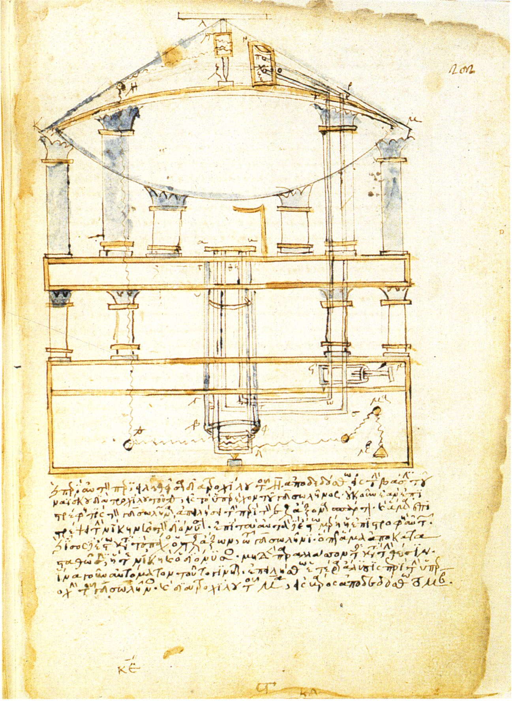
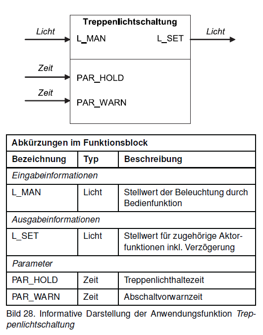
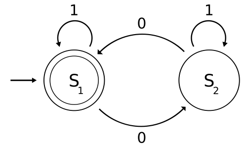

<!-- paginate: true -->


# 2.2 Steuerung

<!-- _class: title -->


---

## Ursprünge der Steuerungstechnik und Automatisierung


* **20–62** - Heron von Alexandria Automaten einer Wein und Milch spendenden Bacchus-Figur
* **1784** Webmaschinen von hölzernen Lochkarten 
* **1835** erfindet Joseph Henry das elektromechanische Relais
* **1969**  Odo J. Struger beim US-Unternehmen Allen-Bradley eine SPS (zeitgleich mit  Richard E. Morley)



---

### 🧠 Evolution zu Industrie 4.0

* **Industrie 1.0** (1784): Einsatz von mechanischen Webstühlen, die insbesondere durch **Lochkarten-Steuerungen** und später durch umlaufenden Bänder zu Webmaschinen weiterentwickelt wurden.
 
* **Industrie 2.0** (1870): erster Einsatz von Fließbändern in den USA (Schlachthöfe) unter Nutzung elektrischer Antriebe, die durch entsprechende **Schütz- und Relais-Steuerungen** geschaltet wurden.
 
* **Industrie 3.0** (1969) **Speicherprogrammierbaren Steuerungen**, Durchbruch bei der Industrieelektronik und Informationstechnik zur massenweisen Steuerung und Automatisierung der Produktion

* **Industrie 4.0** (2012) Cyber-Physikalischer Systeme mit globaler Vernetzung zur global optimierten Steuerung der international organisierten Produktion (**Internet der Dinge**). 

---

## Ablaufsteuerung

* steuert den Ablauf *ereignisdiskreter Prozesse* (Schrittkette). Beim Erreichen eines Schwellwertes einer Steuergröße (Ereignis) wir ein weiterer Prozess angestoßen.
    * z.B. Ablauf in einer Waschmaschine
    * z.B. Human Centric Lighting
    * z.B. Treppenhauslicht

---

### Beispiel Treppenlichtschaltung

> Über die Funktion Treppenlichtschaltung können Beleuchtungseinrichtungen temporär eingeschaltet werden. Nach Ablauf der Treppenlichthaltezeit kann eine Abschaltvorwarnzeit aktiv werden, die den Nutzer z. B. durch kurzzeitige Unterbrechung(„Flackern“) über die bevorstehende Abschaltung informiert. Ein erneuter Empfang einer Eingabeinformation zum Einschalten startet die Verzögerungszeit neu. Die Funktion benötigt als Eingabeinformation das Ergebnis der Bedienfunktion Licht stellen und liefert ihrerseits die Ausgabeinformation für eine oder mehrere Aktorfunktionen Lichtaktor.




---

#### Naive Lösung

```Python
import time
import board
import digitalio

PAR_HOLD = 3
PAR_WARN = 1

button_pin = board.GP0  # Replace with the GPIO pin connected to your button

button = digitalio.DigitalInOut(button_pin)
button.direction = digitalio.Direction.INPUT
button.pull = digitalio.Pull.UP  # Use pull-up resistor; change if using pull-down

led_pin = board.GP1      # Replace with the GPIO pin connected to your LED
led = digitalio.DigitalInOut(led_pin)
led.direction = digitalio.Direction.OUTPUT


while True:
    if not(button.value):  # Button is pressed (LOW)
        print("Button Pressed!")  
        led.value = True
        time.sleep(PAR_HOLD)  
        for i in range(1,5):
            led.value = False
            time.sleep(0.1)
            led.value = True
            time.sleep(0.1)
        time.sleep(PAR_WARN)
        led.value = False
```

---

#### Probleme mit der naiven Lösung

<!-- _class: white -->



* Erneutes betätigen des Taster setzt die Wartezeit nicht zurück
* Unser System hat kein Gedächtnis (über den Zustand)
* Der Ablauf sollte besser nicht nur durch einen Zeitlichen Rahmen, sondern auch durch Zustände gesteuert werden

---

```Mermaid
stateDiagram
    A : LED ein 1
    B : LED flackert
    C : LED ein 2
    E : LED aus
    [*] --> E : Systemstart
    E --> A : L_MAN
    A --> B : PAR_HOLD
    C --> E : PAR_WARN
    B --> C
```

---


### Finite State Machine (Endlicher Automat)

* In Abhängigkeit vom Systemzustand erwarten wir unterschiedliches Verhalten z.B.
    * Nach Tastendruck soll die Lampe angeschaltet werden
    * Nach Ablauf einer Wartezeit soll die Lampe ausgeschaltet werden
    * Davor gibt es ein Flackern als Warnung
    * Nach einem weiteren Tastendruck wird die Wartezeit zurückgesetzt
* Einfache Systeme lassen sich meist durch Ihre Zustände und deren Übergänge beschreiben
* Durch die Beschreibung als State-Machine können wir das Verhalten des Systems sauber trennen und die Implementierung vereinfachen

---


#### Implementierung eines Cola-Automaten

<!-- _class: white -->


* Der Automat startet im Zustand `Auswahl anfordern`
* Der Automat kann in den Zustand `Bezahlung anfordern` wechseln
* Wird die geforderte Summe erreicht, wechselt der Automat in den Zustand `Ware ausgeben`
* Ist die Ausgabe abgeschlossen, wechselt der Automat wieder in den Zustand `Auswahl anfordern`
* Wird die Bezahlung abgebrochen, wechselt der Automat in den Zustand `Rückgeld herausgeben` und dann wieder in den Zustand `Auswahl anfordern`



---

#### 🤓 (Deterministic) Finite State Machine (Endlicher Automat)

* Dieser Ansatz basiert auf der Theorie der formalen Sprachen
* Eine DFSM beschreibt ein System mit endlich vielen Zuständen beschreibt
* Eine DFSM ist ein 5-Tupel $M = (Q, \Sigma, q_0, F, \delta)$ mit
    * Endlicher Zustandsmenge $Q$
    * Endliche Eingabealphabet $\Sigma$
    * Endlicher Startzustand $q_0 \in Q$
    * Endlicher Endzustandsmenge $F \subseteq Q$
    * Übergangsfunktion $\delta: Q \times \Sigma \rightarrow Q$

---

#### 🤓 In der Theorie der formalen Sprachen

<!-- _class: white -->




* $Q = \{S_1, S_2\}$
* $\Sigma = \{0,1\}$
* $q_0 = S_1$
* $F = \{S_1\}$
* $\delta(S_1, 0) = S_2$,  $\delta(S_1, 1) = S_1$
* $\delta(S_2, 0) = S_1$,  $\delta(S_2, 1) = S_2$
* Akzeptiert (endet in $F$)
    * `1`, `11`, `01101`, `11001` 
* Akzeptiert nicht (endet nicht in $F$)
    * `0`, `10`, `10100`, `01001`
* Anwendung
    * Parser
    * [Regular Expressions](https://en.wikipedia.org/wiki/Regular_expression)

---

##### 🤓 Regular Expressions

* Eine reguläre Sprache ist eine Menge von Zeichenketten, die durch einen regulären Ausdruck beschrieben werden können
* z.B. Beider Suche nach einer Zeichenkette in einem Text
    * Alles, was `mapping` im Namen hat:
        * `.*mapping.*`
    * Alles was mit mapping beginnt und mit einer Zahl endet
        * `mapping\d+`

---

#### In der Programmierpraxis

<!-- _class: white -->


* Die Knoten stellen Systemzustände dar. Innerhalb dieser Zustände muss das Systemen nicht statisch sein (z.B. Zeit muss z.B. mitgezählt werden)
* Die gerichteten Kanten stellen Übergänge zwischen den Zuständen dar, die durch Events und Bedingungen ausgelöst werden
* Die Systemzustände können nur in festgelegten Reihenfolgen durchlaufen werden
* Ein Endzustand ist optional

---

## ✍️ Aufgabe 2_2_1: Implementierung eines Treppenhauslichts

<!-- _class: white -->


* In `code_state_machine.py` (folgende Folie) ist das auf der rechten Seite dargestellte Programm implementiert
* Beschreiben Sie verbal, was in jedem der Zustände passiert
* Berücksichtigen Sie dabei im Besonderen, warum es die beiden Zustände `LED leuchtet` und `LED flackert` gibt und diese nicht in einem zusammengefasst wurden


---

<!-- _class : white -->

```Python
import time
import board
import digitalio

PAR_HOLD = 5
PAR_WARN = 2
state = "start"

if state == "start":
    button_pin = board.GP0  # Replace with the GPIO pin connected to your button
        
    button = digitalio.DigitalInOut(button_pin)
    button.direction = digitalio.Direction.INPUT
    button.pull = digitalio.Pull.UP  # Use pull-up resistor; change if using pull-down
        
    led_pin = board.GP1      # Replace with the GPIO pin connected to your LED
    led = digitalio.DigitalInOut(led_pin)
    led.direction = digitalio.Direction.OUTPUT

    state = "LED aus"
    print("Erfolgreich gestartet")

while True:
    time.sleep(0.5)
    if state == "LED aus":
        print("State: LED aus \n  Warte auf Aktion")
        if not(button.value):  # Button is pressed (LOW)
            print("Button Pressed!")
            state = "LED an"
            led.value = True

    
    if state == "LED an":
        print("State: LED an")
        time_start = time.time()
        print("  um: ", time.time())
        state = "LED leuchtet"

    if state == "LED leuchtet":
        if not(button.value):  # Button is pressed (LOW)
            print("Button Pressed!")
            state = "LED an"

        print("LED leuchtet") 
        print(" seit: ", time.time() - time_start)
        if time.time() - time_start > PAR_HOLD:
            state = "LED flackert" 

    if state == "LED leuchtet2":
        if not(button.value):  # Button is pressed (LOW)
            print("Button Pressed!")
            state = "LED an"

        print(" seit Warnung: ", time.time() - time_warning)
        if time.time() - time_warning > PAR_WARN:
            state = "LED aus" 
            led.value = False
        
    if state == "LED flackert":
        for i in range(1,5):
            led.value = False
            time.sleep(0.1)
            led.value = True
            time.sleep(0.1)
        time_warning = time.time()
        state = "LED leuchtet2" 
        led.value = True
```


---


```Mermaid
stateDiagram
    A : Start
    C:  LED an
    D:  LED leuchtet
    E:  LED leuchtet2
    F:  LED flackert
    G : LED aus
    [*] --> A : Systemstart
    A --> C : Taster wird gedrückt
    C --> D : 
    D --> F : PAR_HOLD vergeht
    E --> G : PAR_WARN vergeht
    F --> E: 
    D --> C: Taster wird gedrückt
    E --> C: Taster wird gedrückt   
    G --> C: Taster wird gedrückt   
```

---

### [✔️ Lösung](Aufgaben\2_2_1)

<!-- _color: black -->

??? optional-class "Lösung anzeigen"
    ```python
    --8<-- "Aufgaben\2_2_1\code_state_machine.py"
    ```

---

## ✍️ Aufgabe 2_2_2: State Machine für einen Dimmschalter 

* Stellen Sie sich einen Dimmer vor, der durch Halten des Tasters die Helligkeit einer LED über die PWM steuert
* Durch ein kurzes Drücken des Tasters soll die Helligkeit auf 0% bzw. 100% gesetzt werden
* Durch einen Doppeldruck soll der Dimm-Modus gestartet werden
* in diesem wird durch Halten des Tasters die Helligkeit von 0% auf 100% hoch- bzw. heruntergefahren werden, je nach dem, wie lange der Taster gehalten wird
* Nach dem Loslassen wird die Richtung umgekehrt
* Durch einen einfachen Druck wird der Dimm-Modus und wieder in den normalen Modus gewechselt
* Zeichen Sie eine State Machine, die dieses Verhalten beschreibt
* Überlegen Sie sich dazu zunächst sinnvolle Zustände und versuchen Sie diese dann mit sinnvollen Übergängen zu verknüpfen

---

### [✔️ Lösung](Aufgaben\2_2_2)

<!-- _color: black -->

??? optional-class "💡 anzeigen"
    ```Mermaid
    stateDiagram
        A : 100%
        B : 0%
        C : aufwärts
        D : abwärts
        A --> B: kurzer Druck
        B --> A: kurzer Druck
        A --> D: langer Druck
        B --> C: langer Druck
        C --> D: loslassen
        D --> C: loslassen
    ```


---


<!-- _class: white -->


---

### [✔️ Verbesserte Lösung](Aufgaben\2_2_2)

<!-- _color: black -->

??? optional-class "💡 anzeigen"
    ```Mermaid
    stateDiagram
        A : 100%
        B : 0%
        C : aufwärts - warte auf Eingabe
        D : abwärts - warte auf Eingabe
        E : dimme abwärts
        F : dimme aufwärts
        A --> B: kurzer Druck
        B --> A: kurzer Druck
        A --> D: Doppel-Druck
        B --> C: Doppel-Druck
        D --> E: halten
        E --> C: loslassen
        C --> F: halten
        F --> D: loslassen
        D --> A: kurzer Druck
        C --> B: kurzer Druck
    ```


---

<!-- _class: white -->




---


## 🤓✍️ Aufgabe 2_2_3: Implementierung eines Dimmschalter

* Implementieren Sie einen Dimmer
* Lösung mit einer State Machine und Darstellung der State Machine gibt 5% Bonus


---

## Verknüpfungssteuerungen

* Während Ablaufsteuerungen den Ablauf eines Prozesses steuern, verknüpfen Verknüpfungssteuerungen die Eingangssignale mit den Ausgangssignalen
* Diese Trennung ist jedoch eher akademisch, da die meisten Systeme sowohl Ablauf- als auch Verknüpfungssteuerungen enthalten

---

### Beispiel: Wechselschalter

<!-- _class: white -->

* Verknüpfungssteuerungen können z.B. durch Wahreheitstabellen und Boolsche Funktionen beschrieben werden
* Später werden wir hierzu noch grafische Beschreibungen kennenlernen (Funktionsplan, Kontaktplan, ...)


---

**Wahrheitstabelle**

| Schalter 1 | Schalter 2 | Lampe |
|------------|------------|-------|
|     0      |     0      |   1   |
|     0      |     1      |   0   |
|     1      |     0      |   0   |
|     1      |     1      |   1   |

**Boolsche Funktion**
$L = (S_1 \land S_2) \lor (\lnot S_1 \land \lnot  S_2)$


---


## ✍️ Aufgabe 2_2_4: Implementierung einer vereinfachten Tageslichtschaltung


* Wir vereinfachen die Tageslichtschaltung, indem wir die Parameter für Zeit und Mindest-Beleuchtungsstärke (`PAR_SETPT`) weglassen
* Zeichen Sie zunächst eine Wahrheitstabelle für die Tageslichtschaltung
* Setzen Sie `L_MAN` zunächst im Code auf `False` 

--- 

* 🤓 schließen Sie dafür nur einen zusätzlichen Button dafür an, wenn Sie mit der restlichen Schaltung fertig sind
* Nutzen Sie einen Button, um den Anwesenheitszustand `P_ACT` zu simulieren
*H_ROOM* können Sie entweder als Beleuchtungsstärke, Spannung oder  `ADC-Wert` setzen
* `L_SET` soll das Ausgangssignal sein, das die Lampe steuert und kann zunächst auf `True` gesetzt werden. 🤓 Später können Sie diesen auch durch eine Pulsweitenmodulation setzen.

---

| `P_ACT` | `H_ROOM` `<` `PAR_SETPT` | `L_MAN` | `L_SET` |
|-------|----------------|-------|-------|
|   0   |        0       |   0   |   0   |
|   1   |        0       |   0   |   0   |
|   0   |        1       |   0   |   0   |
|   1   |        1       |   0   |   1   |
|   0   |        0       |   1   |   1   |
|   1   |        0       |   1   |   1   |
|   0   |        1       |   1   |   1   |
|   1   |        1       |   1   |   1   |

$$L_{\text{SET}} = (P_{\text{ACT}} \land (H_{\text{ROOM}} < \text{PAR}_{\text{SETPT}})) \lor  L_{\text{MAN}})$$

---

### Hinweise 

- Bauen Sie auf Aufgaben 2_1_3 und 2_1_5 auf, um die Tageslichtschaltung zu implementieren


??? optional-class "💡 anzeigen"
    ```python
    --8<-- "Aufgaben\2_1_3\code.py"
    ```
??? optional-class "💡 anzeigen"
    ```python
    --8<-- "Aufgaben\2_1_5\code.py"
    ```
??? optional-class "💡 anzeigen"
    ```python
    --8<-- "Aufgaben\2_1_5\mappings.py"
    ```

---

### [✔️ Lösung](Aufgaben\2_2_4)

<!-- _color: black -->

??? optional-class "💡 anzeigen"
    ```python
    --8<-- "Aufgaben\2_2_4\code.py"
    ```