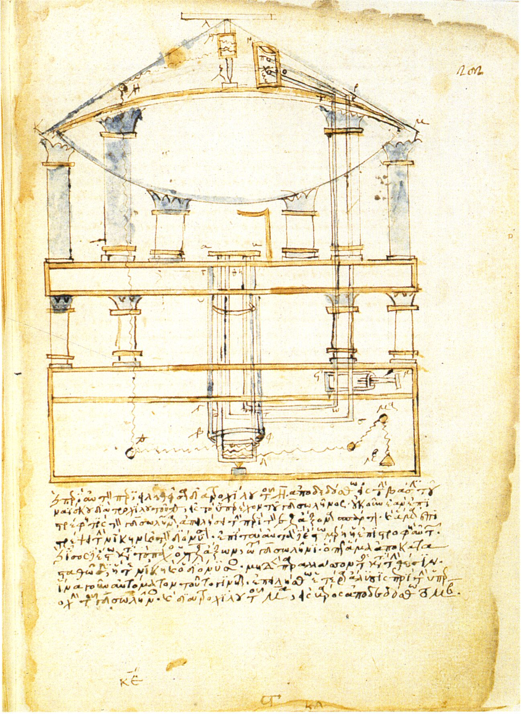
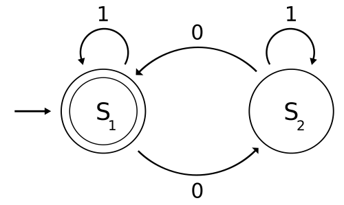
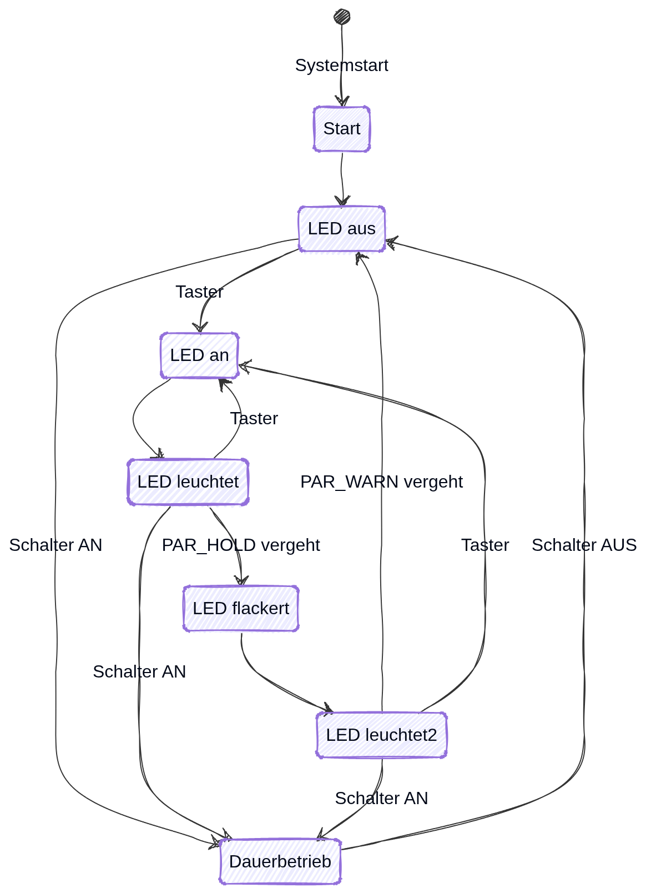

<!-- paginate: true -->


# 2.2 Steuerung: State-Machine & Ablaufsteuerung

<!-- _class: title -->


---

## Orientierung – Einheit 5 von 14

<!-- _class: white -->

### Wo sind wir?

| Abgeschlossen | **Heute** | Als nächstes |
|---|---|---|
| Einheit 4: Messkette II (analog) | **Einheit 5: Steuerung I** | Einheit 6: Steuerung II (Verknüpfungen + OOP) |

### Was haben wir bisher gelernt?

* EVA-Prinzip, digitale und analoge Ein-/Ausgänge
* PWM und ADC; Mapping von Rohwerten in physikalische Einheiten
* Raspberry Pi Pico in CircuitPython programmieren

---

### Wo wollen wir hin?

Sensoren liefern Werte – doch wie entscheidet das System, **was** es tun soll? Heute lernen wir **Ablaufsteuerungen** mit endlichen Automaten (FSM). Die Treppenlichtschaltung aus dem RA-Schema wird Schritt für Schritt zu einem lauffähigen Programm. Dazu strukturieren wir Code mit **Funktionen**, um ihn wiederverwendbar zu machen.

---

## 🎯 Lernziele – Einheit 5

* Ablaufsteuerung vs. Verknüpfungssteuerung abgrenzen
* Endlichen Automaten (FSM) mit Zuständen, Übergangsbedingungen und Ausgaben beschreiben
* Zeitbedingte Übergänge (Hold-Timer) in CircuitPython implementieren
* Treppenlichtschaltung als FSM entwerfen und implementieren
* Code in Funktionen kapseln (Eingaben, Parameter, Ausgaben)
* Lokale vs. globale Variablen erklären

---

### Aufgaben dieser Einheit

| Aufgabe | Inhalt |
|---------|--------|
| ✍️ 2_2_1 | Treppenhauslicht als FSM implementieren |
| ✍️ 2_2_2 | Treppenlicht mit zwei Tastern entwerfen (FSM auf Papier) |
| 🤓 ✍️ 2_2_3 | Treppenlicht mit zwei Tastern implementieren |
| 🤓 ✍️ 2_3_1 | Tageslichtschaltung mit Funktionen implementieren |
| ✍️ 2_3_2 | Code in Funktionen auslagern (Refactoring) |

---


## Ursprünge der Steuerungstechnik und Automatisierung


* **20–62** - Heron von Alexandria Automaten einer Wein und Milch spendenden Bacchus-Figur
* **1784** Webmaschinen von hölzernen Lochkarten 
* **1835** erfindet Joseph Henry das elektromechanische Relais
* **1969**  Odo J. Struger beim US-Unternehmen Allen-Bradley eine SPS (zeitgleich mit  Richard E. Morley)



---

### 🧠 Evolution zu Industrie 4.0

* **Industrie 1.0** (1784): Einsatz von mechanischen Webstühlen, die insbesondere durch **Lochkarten-Steuerungen** und später durch umlaufenden Bänder zu Webmaschinen weiterentwickelt wurden.
 
* **Industrie 2.0** (1870): erster Einsatz von Fließbändern in den USA (Schlachthöfe) unter Nutzung elektrischer Antriebe, die durch entsprechende **Schütz- und Relais-Steuerungen** geschaltet wurden.
 
* **Industrie 3.0** (1969) **Speicherprogrammierbaren Steuerungen**, Durchbruch bei der Industrieelektronik und Informationstechnik zur massenweisen Steuerung und Automatisierung der Produktion

* **Industrie 4.0** (2012) Cyber-Physikalischer Systeme mit globaler Vernetzung zur global optimierten Steuerung der international organisierten Produktion (**Internet der Dinge**). 

---

## Ablaufsteuerung

* steuert den Ablauf *ereignisdiskreter Prozesse* (Schrittkette). Beim Erreichen eines Schwellwertes einer Steuergröße (Ereignis) wir ein weiterer Prozess angestoßen.
    * z.B. Ablauf in einer Waschmaschine
    * z.B. Human Centric Lighting
    * z.B. Treppenhauslicht

---

### Beispiel Treppenlichtschaltung

> Über die Funktion Treppenlichtschaltung können Beleuchtungseinrichtungen temporär eingeschaltet werden. Nach Ablauf der Treppenlichthaltezeit kann eine Abschaltvorwarnzeit aktiv werden, die den Nutzer z. B. durch kurzzeitige Unterbrechung(„Flackern“) über die bevorstehende Abschaltung informiert. Ein erneuter Empfang einer Eingabeinformation zum Einschalten startet die Verzögerungszeit neu. Die Funktion benötigt als Eingabeinformation das Ergebnis der Bedienfunktion Licht stellen und liefert ihrerseits die Ausgabeinformation für eine oder mehrere Aktorfunktionen Lichtaktor.


---

#### [Naive Lösung](https://wokwi.com/projects/457731414156006401)

```Python
import time
import board
import digitalio

PAR_HOLD = 3
PAR_WARN = 1

btn1 = digitalio.DigitalInOut(board.GP2)  # Taster Unten
btn1.direction = digitalio.Direction.INPUT
btn1.pull = digitalio.Pull.UP

btn2 = digitalio.DigitalInOut(board.GP3)  # Taster Oben
btn2.direction = digitalio.Direction.INPUT
btn2.pull = digitalio.Pull.UP

led = digitalio.DigitalInOut(board.GP15)
led.direction = digitalio.Direction.OUTPUT

while True:
    if not btn1.value or not btn2.value:
        print("Taster gedrückt!")
        led.value = True
        time.sleep(PAR_HOLD)
        for i in range(5):
            led.value = False
            time.sleep(0.1)
            led.value = True
            time.sleep(0.1)
        time.sleep(PAR_WARN)
        led.value = False
```

---

#### Probleme mit der naiven Lösung

<!-- _class: white -->



* Erneutes betätigen des Taster setzt die Wartezeit nicht zurück
* Unser System hat kein Gedächtnis (über den Zustand)
* Der Ablauf sollte besser nicht nur durch einen Zeitlichen Rahmen, sondern auch durch Zustände gesteuert werden

<!-- _
```Mermaid
stateDiagram
    A : LED ein 1
    B : LED flackert
    C : LED ein 2
    E : LED aus
    [*] -.-> E : Systemstart
    E -.-> A : L_MAN
    A -.-> B : PAR_HOLD
    C -.-> E : PAR_WARN
    B -.-> C
```

-->

---


### Finite State Machine (Endlicher Automat)

* In Abhängigkeit vom Systemzustand erwarten wir unterschiedliches Verhalten z.B.
    * Nach Tastendruck soll die Lampe angeschaltet werden
    * Nach Ablauf einer Wartezeit soll die Lampe ausgeschaltet werden
    * Davor gibt es ein Flackern als Warnung
    * Nach einem weiteren Tastendruck wird die Wartezeit zurückgesetzt
* Einfache Systeme lassen sich meist durch Ihre Zustände und deren Übergänge beschreiben
* Durch die Beschreibung als State-Machine können wir das Verhalten des Systems sauber trennen und die Implementierung vereinfachen

---


#### Implementierung eines Cola-Automaten

<!-- _class: white -->


* Der Automat startet im Zustand `Auswahl anfordern`
* Der Automat kann in den Zustand `Bezahlung anfordern` wechseln
* Wird die geforderte Summe erreicht, wechselt der Automat in den Zustand `Ware ausgeben`
* Ist die Ausgabe abgeschlossen, wechselt der Automat wieder in den Zustand `Auswahl anfordern`
* Wird die Bezahlung abgebrochen, wechselt der Automat in den Zustand `Rückgeld herausgeben` und dann wieder in den Zustand `Auswahl anfordern`



---

#### 🤓 (Deterministic) Finite State Machine (Endlicher Automat)

* Dieser Ansatz basiert auf der Theorie der formalen Sprachen
* Eine DFSM beschreibt ein System mit endlich vielen Zuständen beschreibt
* Eine DFSM ist ein 5-Tupel $M = (Q, \Sigma, q_0, F, \delta)$ mit
    * Endlicher Zustandsmenge $Q$
    * Endliche Eingabealphabet $\Sigma$
    * Endlicher Startzustand $q_0 \in Q$
    * Endlicher Endzustandsmenge $F \subseteq Q$
    * Übergangsfunktion $\delta: Q \times \Sigma \rightarrow Q$

---

#### 🤓 In der Theorie der formalen Sprachen

<!-- _class: white -->




* $Q = \{S_1, S_2\}$
* $\Sigma = \{0,1\}$
* $q_0 = S_1$
* $F = \{S_1\}$
* $\delta(S_1, 0) = S_2$,  $\delta(S_1, 1) = S_1$
* $\delta(S_2, 0) = S_1$,  $\delta(S_2, 1) = S_2$
* Akzeptiert (endet in $F$)
    * `1`, `11`, `01101`, `11001` 
* Akzeptiert nicht (endet nicht in $F$)
    * `0`, `10`, `10100`, `01001`
* Anwendung
    * Parser
    * [Regular Expressions](https://en.wikipedia.org/wiki/Regular_expression)

---

##### 🤓 Regular Expressions

* Eine reguläre Sprache ist eine Menge von Zeichenketten, die durch einen regulären Ausdruck beschrieben werden können
* z.B. Beider Suche nach einer Zeichenkette in einem Text
    * Alles, was `mapping` im Namen hat:
        * `.*mapping.*`
    * Alles was mit mapping beginnt und mit einer Zahl endet
        * `mapping\d+`

---

#### In der Programmierpraxis

<!-- _class: white -->


* Die Knoten stellen Systemzustände dar. Innerhalb dieser Zustände muss das Systemen nicht statisch sein (z.B. Zeit muss z.B. mitgezählt werden)
* Die gerichteten Kanten stellen Übergänge zwischen den Zuständen dar, die durch Events und Bedingungen ausgelöst werden
* Die Systemzustände können nur in festgelegten Reihenfolgen durchlaufen werden
* Ein Endzustand ist optional

---

## ✍️ Aufgabe 2_2_1: Implementierung eines Treppenhauslichts

<!-- _class: white -->


* In `code_state_machine.py` (folgende Folie) ist das auf der rechten Seite dargestellte Programm implementiert
* Beschreiben Sie verbal, was in jedem der Zustände passiert
* Berücksichtigen Sie dabei im Besonderen, warum es die beiden Zustände `LED leuchtet` und `LED flackert` gibt und diese nicht in einem zusammengefasst wurden




---

<!-- _class : white -->

```Python
import time
import board
import digitalio

PAR_HOLD = 5
PAR_WARN = 2
state = "start"

if state == "start":
    btn1 = digitalio.DigitalInOut(board.GP2)
    btn1.direction = digitalio.Direction.INPUT
    btn1.pull = digitalio.Pull.UP

    btn2 = digitalio.DigitalInOut(board.GP3)
    btn2.direction = digitalio.Direction.INPUT
    btn2.pull = digitalio.Pull.UP

    led = digitalio.DigitalInOut(board.GP15)
    led.direction = digitalio.Direction.OUTPUT

    state = "LED aus"
    print("Erfolgreich gestartet")

while True:
    time.sleep(0.1)
    taster = not btn1.value or not btn2.value

    if state == "LED aus":
        if taster:
            print("Taster -> LED an")
            state = "LED an"

    elif state == "LED an":
        led.value = True
        time_start = time.time()
        print("LED an um:", time_start)
        state = "LED leuchtet"

    elif state == "LED leuchtet":
        if taster:
            print("Taster -> Neustart")
            state = "LED an"
        elif time.time() - time_start > PAR_HOLD:
            state = "LED flackert"

    elif state == "LED flackert":
        for i in range(5):
            led.value = False
            time.sleep(0.1)
            led.value = True
            time.sleep(0.1)
        time_warning = time.time()
        state = "LED leuchtet2"

    elif state == "LED leuchtet2":
        if taster:
            print("Taster -> Neustart")
            state = "LED an"
        elif time.time() - time_warning > PAR_WARN:
            state = "LED aus"
            led.value = False
            print("LED aus")
```


<!--


```Mermaid
stateDiagram
    A : Start
    C:  LED an
    D:  LED leuchtet
    E:  LED leuchtet2
    F:  LED flackert
    G : LED aus
    [*] -.-> A : Systemstart
    A -.-> C : Taster wird gedrückt
    C -.-> D : 
    D -.-> F : PAR_HOLD vergeht
    E -.-> G : PAR_WARN vergeht
    F -.-> E: 
    D -.-> C: Taster wird gedrückt
    E -.-> C: Taster wird gedrückt   
    G -.-> C: Taster wird gedrückt   
```
-->

---

### [✔️ Lösung](https://wokwi.com/projects/457731811963823105)


---

## ✍️ Aufgabe 2_2_2: Treppenlicht mit und Gebäudeleittechnik

- Erinnern Sie sich an __Aufgabe 1_2_1: Raumautomationsschema für ein Treppenhaus__. Hier war gefordert, dass man die Beleuchtung auch aus der Gebäudeleittechnik (GLT) manuell einschalten können soll.
- Ihre Aufgabe ist es nun, die Treppenlichtschaltung so zu erweitern, dass sie auch auf ein manuelles Einschalten durch die GLT reagiert.
- Erweitern Sie dazu zunächst die Zeichnung des endlichen Automaten um die Möglichkeit, dass die Lampe auch durch ein manuelles Signal eingeschaltet werden kann (aus den Zuständen `LED leuchtet` und `LED leuchtet2`  und `LED aus` heraus). Aus dem neuen Zustand kann man nur durch ein erneutes manuelles Signal zurück in den Zustand `LED aus` wechseln.

---

### ✔️ [Lösung](https://wokwi.com/projects/457732997390827521)


---



---

```Python
import time
import board
import digitalio

PAR_HOLD = 5
PAR_WARN = 2
state = "start"

if state == "start":
    btn1 = digitalio.DigitalInOut(board.GP2)   # Taster Unten
    btn1.direction = digitalio.Direction.INPUT
    btn1.pull = digitalio.Pull.UP

    btn2 = digitalio.DigitalInOut(board.GP3)   # Taster Oben
    btn2.direction = digitalio.Direction.INPUT
    btn2.pull = digitalio.Pull.UP

    btn3 = digitalio.DigitalInOut(board.GP4)   # GLT Dauerbetrieb
    btn3.direction = digitalio.Direction.INPUT
    btn3.pull = digitalio.Pull.UP

    led = digitalio.DigitalInOut(board.GP15)
    led.direction = digitalio.Direction.OUTPUT

    dauer_aktiv = False
    btn3_vorher = True

    state = "LED aus"
    print("Erfolgreich gestartet")

while True:
    time.sleep(0.1)
    taster = not btn1.value or not btn2.value

    # Toggle-Erkennung: nur bei fallender Flanke umschalten
    btn3_jetzt = btn3.value
    if not btn3_jetzt and btn3_vorher:
        dauer_aktiv = not dauer_aktiv
        print("GLT Dauerbetrieb:", dauer_aktiv)
    btn3_vorher = btn3_jetzt

    if state == "LED aus":
        if dauer_aktiv:
            state = "Dauerbetrieb"
            led.value = True
        elif taster:
            state = "LED an"

    elif state == "LED an":
        led.value = True
        time_start = time.time()
        state = "LED leuchtet"

    elif state == "LED leuchtet":
        if dauer_aktiv:
            state = "Dauerbetrieb"
        elif taster:
            state = "LED an"
        elif time.time() - time_start > PAR_HOLD:
            state = "LED flackert"

    elif state == "LED flackert":
        for i in range(5):
            led.value = False
            time.sleep(0.1)
            led.value = True
            time.sleep(0.1)
        time_warning = time.time()
        state = "LED leuchtet2"

    elif state == "LED leuchtet2":
        if dauer_aktiv:
            state = "Dauerbetrieb"
        elif taster:
            state = "LED an"
        elif time.time() - time_warning > PAR_WARN:
            state = "LED aus"
            led.value = False

    elif state == "Dauerbetrieb":
        if not dauer_aktiv:
            state = "LED aus"
            led.value = False
```