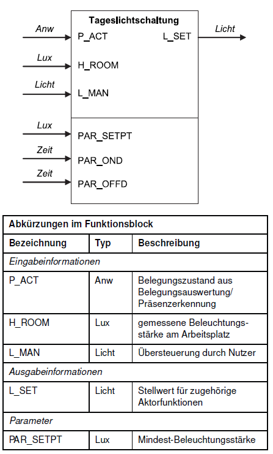

<!-- paginate: true -->


# 2.2 Steuerung II – Funktionen & Objektorientierung

<!-- _class: title -->

---

## Orientierung – Einheit 6 von 14

<!-- _class: white -->

### Wo sind wir?

| Abgeschlossen | **Heute** | Als nächstes |
|---|---|---|
| Einheit 5: Steuerung I (FSM) | **Einheit 6: Steuerung II** | Einheit 7: Regelungstechnik I |

### Was haben wir bisher gelernt?

* Analoge Sensoren auslesen und Messwerte in Lux umrechnen (ADC, Mapping)
* Ablaufsteuerungen mit FSM: Zustände, Übergänge, zeitbedingte Ausgaben
* Treppenlichtschaltung implementiert

---

### Wo wollen wir hin?

Nicht jede Steuerung folgt einem zeitlichen Ablauf – manchmal hängt der Ausgang einfach von mehreren Eingängen **gleichzeitig** ab. Heute bauen wir eine **Tageslichtschaltung** als Funktion und verbessern sie anschließend mit **Objektorientierung**.

---

## 🎯 Lernziele – Einheit 6

* Verknüpfungssteuerung durch eine Boolesche Funktion beschreiben und implementieren
* Tageslichtschaltung mit Hysterese (`PAR_OND`, `PAR_OFFD`) als Python-Funktion umsetzen
* Messrauschen als Problem erkennen und durch Mittelwertbildung lösen
* Eine Klasse mit Attributen und Methoden beschreiben und verwenden
* Sensor mit gleitendem Mittelwert als Klasse implementieren

---

### Aufgaben dieser Einheit

| Aufgabe | Inhalt |
|---------|--------|
| ✍️ 2_3_1 | Tageslichtschaltung mit `PAR_OND` / `PAR_OFFD` implementieren |
| ✍️ 2_3_2 | Sensor-Klasse mit gleitendem Mittelwert implementieren |


---

## Verknüpfungssteuerungen

* Während **Ablaufsteuerungen** einen zeitlichen Prozess steuern (FSM), verknüpfen **Verknüpfungssteuerungen** Eingangssignale direkt mit einem Ausgang
* Der Ausgang hängt ausschließlich von den **aktuellen Eingangswerten** ab

```
Eingang 1 ──┐
Eingang 2 ──┤─── [Boolesche Funktion] ──► Ausgang
Eingang 3 ──┘
```

Diese Trennung ist akademisch – die meisten Systeme enthalten beide Typen.

---

```
Taster Segment 1 ──┐
Taster Segment 2 ──┤─── [Treppenlichtschaltung] ──► Lichtaktor
GLT              ──┘
```

---

### Beispiel: Wechselschalter

<!-- _class: white -->


| Schalter 1 | Schalter 2 | Lampe |
|------------|------------|-------|
| 0 | 0 | 1 |
| 0 | 1 | 0 |
| 1 | 0 | 0 |
| 1 | 1 | 1 |

**Boolsche Funktion**
$$L = (S_1 \land S_2) \lor (\lnot S_1 \land \lnot S_2)$$

__Hinweis: Man könnte es auch als FSM betrachten, aber die Verknüpfungssteuerung ist hier natürlicher__

---

## Tageslichtschaltung

<!-- _class: white -->



Die Tageslichtschaltung steuert die Beleuchtung in Abhängigkeit von:

| Variable | Bedeutung |
|----------|-----------|
| `P_ACT` | Anwesenheit einer Person |
| `H_ROOM` | Raumhelligkeit in Lux |
| `PAR_OND` | Einschaltschwellwert in Lux |
| `PAR_OFFD` | Ausschaltschwellwert in Lux |
| `L_MAN` | Manuelle Einschaltung |
| `L_SET` | Ausgang: Lampe ein/aus |

---

### Wahrheitstabelle

| `P_ACT` | `H_ROOM < PAR_OND` | `L_MAN` | `L_SET` |
|---------|---------------------|---------|---------|
| 0 | 0 | 0 | 0 |
| 0 | 1 | 0 | 0 |
| 1 | 0 | 0 | 0 |
| 1 | 1 | 0 | 1 |
| * | * | 1 | 1 |

**Boolsche Funktion**

$$L_\text{SET} = L_\text{MAN} \lor \bigl(P_\text{ACT} \land (H_\text{ROOM} < \text{PAR\_OND})\bigr)$$

---

### Hysterese: Zwei Schwellwerte gegen Flackern

Liegt `H_ROOM` genau nahe `PAR_OND`, kann die Lampe schnell hin- und herschalten.

**Lösung: zwei Schwellwerte**

* `PAR_OND` – **Ein**schaltschwellwert (z. B. 100 Lux): unterschritten → einschalten
* `PAR_OFFD` – **Aus**schaltschwellwert (z. B. 300 Lux): überschritten → ausschalten
* Zwischen beiden Werten: **letzter Zustand beibehalten** (`L_LAST`)

```
H_ROOM:  ───────────────────────────────────────►
              PAR_OND      PAR_OFFD
                 │             │
                 ▼             ▼
  EIN ◄──────────┤             ├──────────► AUS
         (Hysterese-Zone: L_LAST)
```

---

### Implementierung als Python-Funktion

```python
def l_set(p_act, h_room, PAR_OND, PAR_OFFD, l_man, l_last):
    if l_man:
        return True          # manuelle Einschaltung hat Vorrang
    if not p_act:
        return False         # niemand anwesend → aus
    if h_room < PAR_OND:
        return True          # zu dunkel → einschalten
    if h_room > PAR_OFFD:
        return False         # hell genug → ausschalten
    return l_last            # Hysterese: letzten Zustand beibehalten
```

* Reine Funktion: gleiche Eingaben → gleicher Ausgang
* `l_last` muss vom Hauptprogramm übergeben werden

---

### Hauptprogramm

```python
from tageslichtschaltung import l_set
from mappings import map_log_log_lin

PAR_OND  = 100   # Lux: einschalten, wenn dunkler
PAR_OFFD = 300   # Lux: ausschalten, wenn heller
L_MAN    = False

l_last = False   # Startzustand

while True:
    h_room = map_log_log_lin(ldr.value)
    p_act  = not button.value

    l_last = l_set(p_act, h_room, PAR_OND, PAR_OFFD, L_MAN, l_last)
    led.value = l_last

    print(f"H_ROOM: {h_room:.1f} Lux | P_ACT: {p_act} | L_SET: {l_last}")
    time.sleep(0.5)
```

---

## ✍️ Aufgabe 2_3_1: Tageslichtschaltung implementieren


* Bauen Sie auf Aufgabe 2_1_5 auf – Helligkeitssensor, LED und Taster sind bereits angeschlossen
* Erstellen Sie `tageslichtschaltung.py` mit der Funktion `l_set()`
* Verwenden Sie `map_log_log_lin` aus Ihrer `mappings.py`
* [Wokwi-Projekt](https://wokwi.com/projects/457735322111636481) als Starter

--- 

* Steuern Sie die LED anhand der Tageslichtschaltung:
  * Taster simuliert Anwesenheit (`P_ACT`)
  * Starten Sie mit `PAR_OND = 100` und `PAR_OFFD = 300`
  * Setzen Sie `L_MAN = False`
* Beobachten Sie das Verhalten, wenn Sie den Sensor abdecken oder beleuchten

---

### Sichtbarkeit von Variablen

* Variablen innerhalb einer Funktion sind **lokal** – außerhalb nicht sichtbar

```python
def l_set(p_act, h_room, PAR_OND, PAR_OFFD, l_man, l_last):
    dunkel = h_room < PAR_OND   # lokale Variable
    ...

print(dunkel)  # NameError: name 'dunkel' is not defined
```

* Variablen außerhalb aller Funktionen sind **global** – in Python per Konvention in Großbuchstaben

```python
PAR_OND = 100   # global, überall sichtbar

def l_set(...):
    ...         # PAR_OND kann hier gelesen werden
```

---

### [✔️ Lösung 2_3_1](https://wokwi.com/projects/457736998769423361)

---

## Objektorientierung


### Problem: Messrauschen führt zu Flackern

* Lichtsensoren liefern **keine stabilen Werte** – der ADC-Rohwert schwankt von Messung zu Messung
* Bei Helligkeitswerten nahe den Schwellwerten kann die Lampe dadurch **flackern**

---

**Beispiel: aufeinanderfolgende Messungen nahe PAR_OND = 100 Lux**

| t | ADC-Wert | Lux | L_SET |
|---|---------|-----|-------|
| 0 | 32 500 | 102 | 0 (aus) |
| 1 | 33 100 | 95 | 1 (ein) |
| 2 | 32 600 | 101 | 0 (aus) |
| 3 | 33 200 | 94 | 1 (ein) |

→ Die Beleuchtung schaltet jede halbe Sekunde, obwohl sich kaum etwas ändert (trotz Hysterese!)

---

## Lösung: Gleitender Mittelwert

Anstatt den Einzelmesswert zu verwenden, berechnen wir den **Durchschnitt der letzten $n$ Messungen**:

$$\bar{x}_t = \frac{1}{n} \sum_{i=0}^{n-1} x_{t-i}$$

**Beispiel mit n = 4**

| t | Messwert | Puffer | Mittelwert | Lux |
|---|---------|--------|-----------|-----|
| 0 | 32 500 | [32500, 32500, 32500, 32500] | 32 500 | 102 |
| 1 | 33 100 | [32500, 32500, 32500, 33100] | 32 650 | 99 |
| 2 | 32 600 | [32500, 32500, 33100, 32600] | 32 675 | 98 |
| 3 | 33 200 | [32500, 33100, 32600, 33200] | 32 850 | 96 |

→ Der geglättete Wert bleibt stabil – kein Flackern mehr

---

## Erinnerung: Messkette


- Solche Verarbeitungsschritte (Mittelwertbildung) gehören zur **Messkette** – sie beeinflussen die Qualität der Messung und damit die Steuerung
- Sie Sind meist in der Sensorfunktion oder -klasse implementiert, damit der Hauptcode sich nicht darum kümmern muss
- Reine Funktionen reagieren immer mit dem gleichen Ausgang auf die gleichen Eingaben – sie haben kein Gedächtnis. Um einen gleitenden Mittelwert zu berechnen, benötigen wir jedoch einen **Puffer**, der die letzten Messwerte speichert → **Objektorientierung**.

---

## Objektorientierung (OOP)

* Bisher: Funktionen kapseln **Berechnungen** (Input → Output, kein Gedächtnis)
* **Klassen** kapseln **Daten (Attribute)** und **Operationen (Methoden)** zusammen
* Ein **Objekt** ist eine konkrete Instanz einer Klasse


---


```python
class LDRSensor:

    def __init__(self, pin, n=10):   # Konstruktor
        self.adc    = ...            # Attribut: ADC-Objekt
        self.n      = n              # Attribut: Puffergröße
        self.buffer = [...]          # Attribut: Ringpuffer

    def update(self):                # Methode: Messwert einlesen
        ...

    def get_lux(self):               # Methode: geglätteten Wert ausgeben
        ...
```

---

### Aufbau der Sensor-Klasse

```python
import analogio
import math

class LDRSensor:
    """Helligkeitssensor (LDR) mit gleitendem Mittelwert."""

    def __init__(self, pin, n=10):
        self.adc    = analogio.AnalogIn(pin)
        self.n      = n
        self.buffer = [self.adc.value] * n  # Puffer mit aktuellem Wert füllen

    def update(self):
        """Liest einen neuen ADC-Wert und fügt ihn dem Puffer hinzu."""
        self.buffer.pop(0)                  # ältesten Wert entfernen
        self.buffer.append(self.adc.value)  # neuen Wert hinzufügen

    def get_lux(self):
        """Gibt den geglätteten Helligkeitswert in Lux zurück."""
        avg = sum(self.buffer) / self.n
        return map_log_log_lin(avg)
```

* `self` verweist auf das Objekt selbst → Zugriff auf eigene Attribute und Methoden
* `__init__` ist der **Konstruktor** – wird beim Erstellen des Objekts einmalig ausgeführt

---

### Verwendung der Klasse

```python
from sensor import LDRSensor

# Objekt erstellen: Konstruktor wird aufgerufen
sensor = LDRSensor(board.A0, n=10)

while True:
    sensor.update()            # neuen Messwert einlesen
    h_room = sensor.get_lux() # geglätteten Wert abrufen

    l_last = l_set(p_act, h_room, PAR_OND, PAR_OFFD, L_MAN, l_last)
    led.value = l_last

    time.sleep(0.1)
```

**Mehrere Sensoren** – kein Problem:

```python
sensor_raum = LDRSensor(board.A0, n=10)
sensor_gang = LDRSensor(board.A1, n=5)
```

Jedes Objekt verwaltet seinen eigenen Puffer – der Hauptcode muss sich nicht darum kümmern.

---

## ✍️ Aufgabe 2_3_2: Sensor-Klasse mit gleitendem Mittelwert

* Erstellen Sie eine Datei `sensor.py` mit der Klasse `LDRSensor`
* Die Klasse soll:
  * Im Konstruktor `__init__` den ADC initialisieren und den Puffer anlegen
  * Mit `update()` einen neuen Messwert in den Puffer aufnehmen
  * Mit `get_lux()` den geglätteten Helligkeitswert in Lux zurückgeben
* Passen Sie das Hauptprogramm aus Aufgabe 2_3_1 so an, dass es die Klasse verwendet
* Beobachten Sie, wie sich das Verhalten durch die Glättung verändert
* 🤓 Experimentieren Sie mit verschiedenen Puffergrößen (`n`): Was passiert bei sehr großem `n`?

### [✔️ Lösung 2_3_2](PLATZHALTER)
