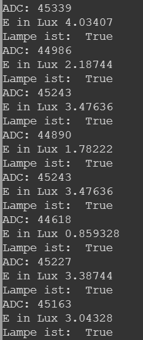

<!-- paginate: true -->


# 2.4 Objektorientierung

<!-- _class: title -->


---

## Motivation

* **Funktionen** haben wohl definierten Input und Output aber **keinen Speicher / Zustand**
* Eine **State-Machine** hat einen Zustand, aber ist **aufwendig** zu implementieren und anzupassen
* Bedarf für beides: wenn wir bei einer Messfunktionen das Signal glätten wollen, müssen wir den Zustand (letzte Messerwerte) speichern



---

## Grundkonzepte der Objektorientierung

* Programmierparadigma mit Fokus auf Objekte, deren Eigenschaften und Fähigkeiten
* z.B. Objekt der Klasse `Sensor`
  * Attribute (Eigenschaften mit Datentyp):
    * Name
    * Einheit
    * Aktueller Messerwert 
    * Liste bisheriger Messerwerte
  * Methoden (wie Funktionen):
    * Mittelwert bilden
    * Messen
    * Letzten Messwert übermitteln


---

### Klassen und Objekte

* Die Sensor-Klasse beschreibt allgemein das Verhalten jedes Sensors!
* Jeder einzelne Sensor ist ein Objekt der Klasse Sensor, bei dem die Attribute individuell ausgeprägt 

    * Beleuchtungsstärke-Sensor
    * Temperatursensor
    * ...


---


```Mermaid

classDiagram
    class Sensor{
        +string name
        +string unit
        +float measurement
        +[]float measurements
        +do_measurement()
        +calc_mean()
        +print_data()
    }
```

---

### Attribute


```python
# Definition einer Klasse
class Sensor:
    def __init__(self, name, unit):
        self.name = name
        self.unit = unit
        self.measurement = None
        self.measurements = []

# Instanziierung eines Objekts
sensor1 = Sensor("Temperatursensor", "°C")
sensor2 = Sensor("Beleuchtungsstärke", "Lux")

# Aufruf der Attribute
print(sensor1.name)
print(sensor2.name)
```

---

- Die Methode **```__init__```** wird aufgerufen, sobald ein **Objekt** einer **Klasse** instanziiert wird. Die Methode kann dafür benutzt werden, ihr Objekt auf irgendeine Weise zu initialisieren
- wichtig ist in jeder Methode als erstes Argument **```self```** zu übergeben, damit die Methode auf das Objekt zugreifen kann
- Ebenso werden Attribute mit **```self```** definiert, damit sie dem Objekt zugeordnet werden

---

### Methoden & Funktionen

* Methoden sind Funktionen, die zu einer Klasse gehören
* Funktionen sind wieder aufrufbare Code-Einheiten, denen Argumente als Parameter übergeben werden können
* Funktionen geben einen Rückgabewert aus, der weiterverarbeitet werden kann

---

```python
# Definition einer Klasse
class Sensor:
    def __init__(self, name, unit):
        self.name = name
        self.unit = unit
        self.measurement = None
        self.measurements = []
    
    def print_data(self):
        print("This " + self.name + "returns data in " + self.unit)

# Instanziierung eines Objekts
sensor1 = Sensor("Temperatursensor", "°C")

# Aufruf der Attribute
sensor1.print_data()

```

---

## ✍️ Aufgabe 2_4_1: Implementierung einer Sensor-Klasse

```Python
import board
import analogio
import time
import digitalio

# Initialisierung des ADC (Analog-Digital Converter)
ldr = analogio.AnalogIn(board.A2)

class Sensor:
    def __init__(self, name, unit):
        self.name = name
        self.unit = unit
        self.last_measurement = None
        self.measurements = []

    def do_measurement(self, ldr):
        self.last_measurement = ldr.value
        self.measurements.append(self.last_measurement)

    def print_data(self):
        print("This " + self.name + "returns data in " + self.unit)
        
beleuchtungs_sensor = Sensor("Beleuchtungsstärke", "ADC")


# Wiederholung
while True:
    
    # ADC als Dezimalzahl lesen
    beleuchtungs_sensor.do_measurement(ldr)
    print(beleuchtungs_sensor.last_measurement)    

    # Warten
    time.sleep(1)
```

---

- Passen Sie den gegeben Code so an, dass der Sensor auch über eine Methode verfügt, welche den Mittelwert der Messwerte zurückgibt
- Sie können die folgende Funktion als Ausgangspunkt verwenden
- Vergessen Sie nicht das `self`-Argument zu übergeben
- Hierdurch können sie auch die Übergabe des Parameters `list_of_measurements` vermeiden, die Sie sich im Objekt direkt auf `self.measurements` beziehen können
```Python
def bilde_mittelwert(list_of_measurements):
  """ Eine Funktion, die eine Liste von Werten übernimmt und das arithmetische Mittel zurück gibt"""

  mittelwert = sum(list_of_measurements) / len(list_of_measurements)
  return mittelwert

ergebnis = bilde_mittelwert([1,2,3])
```

---

## 🤓 ✍️ Aufgabe 2_4_2:


- Stellen Sie sicher, dass maximal die letzten 10 Messwerte gespeichert werden
- Erweitern die Methode `calc_mean` so, dass optional nur die letzten `n`  Messwerte berücksichtigt werden und `n` als Parameter übergeben werden kann 
- Integrieren Sie die `mappings.py` in Ihre Sensor-Klasse, damit diese Lux-Werte zurückgibt
- 🤓 🤓 Überlegen Sie, wie Sie dem Sensor bei der Instanziierung unterschiedliche Mapping-Funktionen übergeben können

---

### [✔️ Lösung](Aufgaben\2_4_2)

<!-- _color: black -->

??? optional-class "💡 anzeigen"
    ```python
    --8<-- "Aufgaben\2_4_2\code.py"
    ```

??? optional-class "💡 anzeigen"
    ```python
    --8<-- "Aufgaben\2_4_2\mappings.py"
    ```
??? optional-class "💡 anzeigen"
    ```python
    --8<-- "Aufgaben\2_4_2\my_classes.py"
    ```

---


## JSON-Darstellung eines Objekts

### Serialisierung von Objekten


* Zur Übertragung zwischen Systemen und Speicherung müssen Objekte unabhängig vom der Darstellung im Arbeitsspeicher gemacht werden
* Serialisierung:
  * Objekt aus dem Arbeitsspeicher wird in eine Folge von Zeichen übersetzt (letztlich eine Folge von Bits)
  * Austauschdateiformat (meist in Form einer Auszeichnungssprache)

---


### Dictionaries

* Sind die Implementierung von Hash-Tabellen in Python (ein Datentyp vergleichbar mit einer Liste)
* Anstelle einer Liste, in der Werte über eine Indexposition abgerufen werden, werden Werte über einen Schlüssel abgerufen
* Schlüssel-Wert-Paare `{<key1>:<value1>, <key2>:<value2>, <key3>:<value3}`
```python
my_dict = beleuchtungs_sensor.__dict__ 
print(my_dict)
```

--- 
```python
{'last_measurement': 43114,
 'measurements': [43130, 43034, 43066, 42666, 43370, 43114, 42426, 43114], 
 'name': 'Beleuchtungsstärke', 
 'unit': 'ADC'}
```
* Das `__dict__`-Attribut enthält alle Attribute des Objekts als Dictionary
* Auf die Werte im Dictionary kann über den Schlüssel zugegriffen werden
```python
print(my_dict["last_measurement"])
```
---

### JavaScriptObjectNotation (JSON)

- Dictionary-Objekte können in JSON-Objekte umgewandelt werden
- JSON is eine Auszeichnungssprache, die für den Datenaustausch zwischen Systemen verwendet wird
```py
import json 
with open("sample.json", "w") as outfile: 
        json.dump(my_dict, outfile)
```

```JSON
{"last_measurement": 43114, 
"measurements": [43130, 43034, 43066, 42666, 43370, 43114, 42426, 43114], 
"name": "Beleuchtungsst\u00e4rke",
 "unit": "ADC"}
```

- über eine eignete Codierung (z.B. ASCII, UTF) können auch Binärdaten übertragen werden `<stings>.encode("ascii")`
```
1111011001001110110110101100101011101000110010101110010010111110110100101100100001001110011101000100000...
```

---

## ✍️ Aufgabe 2_4_3: Datenvorbereitung für Busübertragung

> **Vorgriff auf Kapitel 5:** Bussysteme in der Gebäudeautomation haben oft sehr geringe Datenraten. Der DALI-Bus (Beleuchtungssteuerung) überträgt z.B. nur **1.200 Bit/s** – das entspricht ca. 150 Byte pro Sekunde. Jedes unnötige Feld im Datenpaket kostet wertvolle Übertragungskapazität und verlängert Reaktionszeiten.

- Nehmen wir an, wir möchten die Messwerte unseres Helligkeitssensors über ein Bussystem übertragen
- Das aktuelle Dictionary des Sensor-Objekts enthält: Messwert, Einheit, Name, Liste aller bisherigen Messwerte, Zeitstempel
- **Frage 1:** Welche dieser Felder müssen bei jeder Übertragung mitgesendet werden – und welche können weggelassen werden?
- **Frage 2:** Was würde sich ändern, wenn statt DALI (1.200 Baud) ein Ethernet-basiertes BACnet-System (10 MBit/s) verwendet würde?
- Implementieren Sie eine Methode `prepare_data()`, die ein bereinigtes Dictionary zurückgibt und es ausgibt
- `del(my_dict["unit"])` entfernt z.B. den Eintrag `unit` aus dem Dictionary

---

### ✔️ Lösung

* Ob es sinnvoll ist das gesamte Dictionary zu übertragen, hängt von der Bandbreite des Bussystems ab. Bei DALI (1.200 Baud) macht es Sinn, nur den aktuellen Messwert zu senden – Einheit, Name und Messwertverlauf sind der Gegenstelle bekannt oder werden nur bei Bedarf übertragen.
* Bei Hochband-Systemen (BACnet/IP) ist der Overhead vernachlässigbar; dort überwiegt der Vorteil vollständiger Datenpakete für Logging und Diagnose.
* Priorität hat immer der aktuelle Messwert (`last_measurement`)


---

<!-- _color: black -->

??? optional-class "💡 anzeigen"
    ```python
    --8<-- "Aufgaben\2_4_2\my_classes.py"
    ```

---

## Appendix

### 🤓 Vererbung

<!-- _class: white -->

- Durch Vererbung können die **Attribute** und **Methoden** einer (Parent-)Klasse **an andere** (Child-)**Klassen weitergegeben** werden. 
- Neu implementiert werden müssen dann nur zusätzliche Datenelemente und Methoden. 
- Im UML-Klassendiagramm wird die Vererbung mit meinem im **leeren Dreieck endenden Pfeil** dargestellt.
- Dies ermöglicht eine **hierarchische Strukturierung** von Klassen z.B. um schnell verschiedene Sensor-Klassen zu erstellen


---