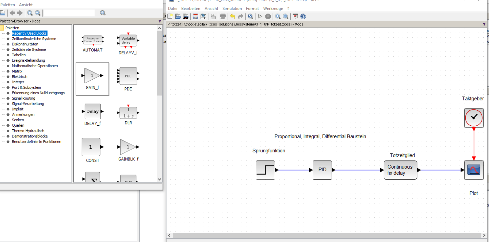
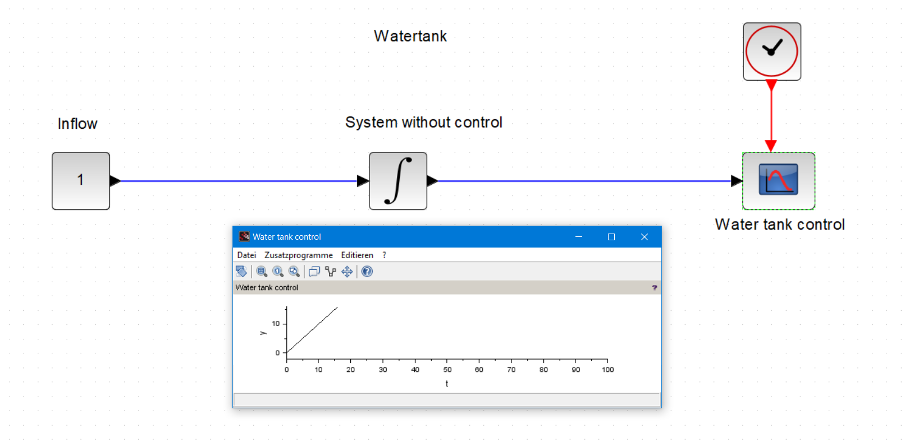
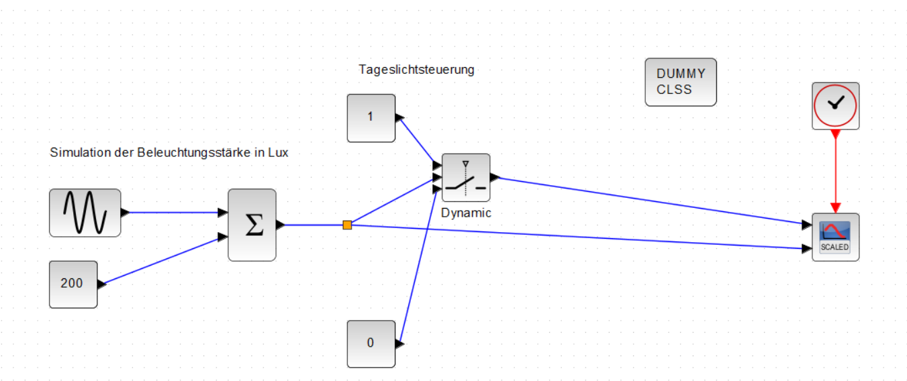
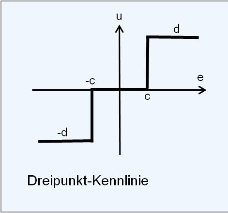
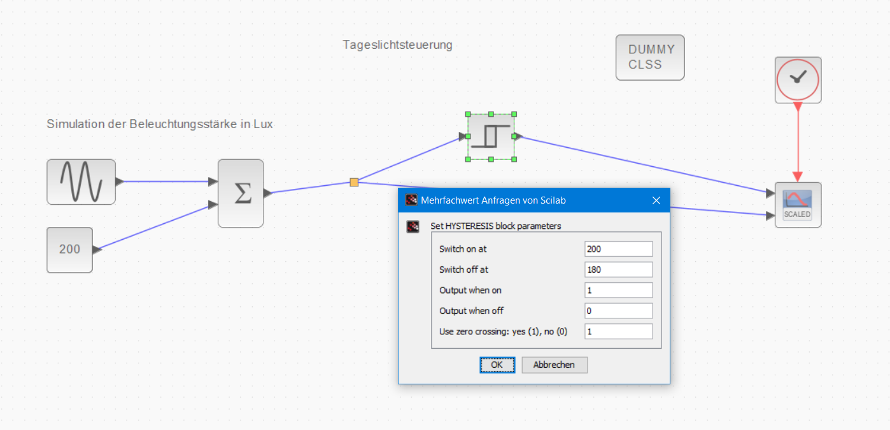

<!-- paginate: true -->


# 3.1 Blockschaltbild

<!-- _class: title -->


---

## Orientierung – Einheit 7 von 14

<!-- _class: white -->

### Wo sind wir?

| Abgeschlossen | **Heute** | Als nächstes |
|---|---|---|
| Einheit 6: Steuerung II | **Einheit 7: Regelungstechnik I** | Einheit 8: Regelungstechnik II |

### Was haben wir bisher gelernt?

* Ablauf- und Verknüpfungssteuerungen (FSM, Boolesche Logik)
* OOP: Sensor- und Aktorklassen, JSON-Serialisierung
* Tageslichtschaltung implementiert – aber: was tun bei Störungen?

---

### Wo wollen wir hin?

Eine Steuerung reagiert nicht auf Störungen (z.B. Verschattung, Reflexionen, etc.) – dafür brauchen wir Regelung. Heute lernen wir, Signalflüsse mit **Blockschaltbildern** darzustellen. Wir modellieren den offenen Regelkreis und implementieren eine erste **Zweipunktregelung** für die Konstantlichtregelung.

---

## Lernziele – Einheit 7

* Blockschaltbild-Elemente (P-, I-, D-Glied, Totzeitglied) erklären
* Tageslichtschaltung als Blockschaltbild darstellen
* Offenen Regelkreis (Steuerkette) von geschlossenem Regelkreis abgrenzen
* Zweipunktregelung mit Hysterese beschreiben und implementieren
* Simulationsparameter (Verstärkung, Zeitkonstante) identifizieren

---

### Aufgaben dieser Einheit

| Aufgabe | Inhalt |
|---------|--------|
| ✍️ 3_1_1 | Tageslichtschaltung in Blockschaltbild übersetzen (Papier) |
| ✍️ 3_1_2 | Zweipunktregelung: Blöcke und Parameter identifizieren |
| ✍️ 3_1_3 | Zweipunktregelung simulieren |
| ✍️ 3_1_4 | Zweipunktregelung für Tageslichtschaltung |

---


## Blockschaltbild


* Grafische Beschreibung von Systemen in der Regelungs- und Steuerungstechnik
* Systeme werden durch Blöcke dargestellt, die durch Pfeile verbunden sind
  * z.B. Steuerungsfunktion (z.B. in Python)
  * z.B. thermodynamisches Modell eines Raums
* Systeme werden durch Eingangsgrößen beeinflusst und verändern Ausgangsgrößen

---

* I.d.R. beschäftigen wir uns mit **dynamischen Systemen**
    * Die Ausgangsgröße hängt nicht nur  von den Eingangsgrößen ab (vgl. _Funktion_) 
    * sondern auch vom Systemzustand und damit inneren Zustandsgrößen (vgl. _Objekt_)
* Entsprechend lernen wir nun eine abstraktere Darstellung von Systemen kennen, die wird schon implementiert haben.


[Quelle](Lunze )

---

### 🤓 Dynamische Systeme

* lineare Systeme: Systemfunktion ist eine lineare Funktion
* nichtlineare Systeme: Systemfunktion ist eine nichtlineare Funktion
* zeitinvariante Systeme: Systemfunktion ist unabhängig von der Zeit
* zeitvariante Systeme: Systemfunktion ist abhängig von der Zeit

---


## Elemente eines Blockschaltbildes


* Übertragungsglieder beschreiben Systeme mit deren Eigenschaften / Funktionen
* Pfeile die Ein- und Ausgangsgrößen
* Komplexe Systeme können durch mehrere Systeme zusammengesetzt werden
* Systeme werden im Zeitbereich durch ihre Funktionsbeziehung zwischen Ausgang $y$ und Eingang $u$ unterschieden $f(u)=y$


---

### Proportionalglied (P-Glied)

* Linear und zeitinvariant (kein Gedächtnis)
* Beschreibt Systeme mit direktem proportionaler Systemfunktion $f$ für den Zusammenhang zwischen Eingang ($u$) und Ausgang ($y$)
  * $y = f(u)=K_p \cdot u$
  * $K_p$ ... Proportionalitätsfaktor
* Praktische Beispiele:
  * Lineare Verstärkung
  * Übersetzung beim Getriebe


---

#### Wirkweise eines P-Glieds

* $y = f(u)=K_p \cdot u$
* Beispiel: 
  * je höher die $\text{CO}_2$ Konzentration in einem Raum, desto schneller dreht sich ein Ventilator in einer Lüftungsanlage
  * $y$ ... Drehfrequenz der Ventilators in $\text{Hz}$
  * $u$ ... $\text{CO}_2$ Konzentration in $\text{ppm}$
  * $K_p$ ... Proportionalitätsfaktor in $\frac{\text{Hz}}{\text{ppm}}$
> Rechts grafische Darstellung im Funktionsbereich


---


* Unabhängig vom Verlauf der Eingangsgröße $u(t)$ ist der Wert der Ausgangsgröße $y(t)$ immer proportional

> Links grafische Darstellung im Zeitbereich

---

#### 🧠 Einheits-Sprungfunktion

* beliebtes Werkzeug in die Regelungstechnik: Wie reagiert ein System, wenn wir eine Sprungfunktion an den Eingang legen (auch in der E-Technik z.B. durch Rechteckspannung!)
* Eine Funktion, die am Zeitpunkt $t=0$ von $u=0$ auf $u=1$ springt und sonst konstant bleibt


---

#### 🧠 Sprungantwort (Reaktion) eines P-Glieds auf eine Sprungfunktion


---

<!-- _class: white-->


* Das Symbol repräsentiert die Sprungantwort im Zeitbereich
* weitere Beispiele:
  * Entwicklung Spannungsabfall am Ohmschen Widerstand 
  beim Anlegen einer Quellenspannung
  * Antwort eines Helligkeitssensors auf Lichteinfall

[Quelle](Lunze )


---

### Totzeitglied (T-Glied)

* beschreibt die zeitliche Verzögerung, bis ein System auf das Eingangssignal (z.B. der Sprungfunktion) reagiert. 
* Nicht die Trägheit des Systems sondern eine Leerlaufzeit $T_t$.
* z.B. in Bussystem: Weiterleitung von Signalen im fixen Takt


---

## Verknüpfung von Systemen im Blockschaltbild


---

#### 🧠 Sprungantwort eines T-Glieds auf eine Sprungfunktion


---

## Simulation von Blockschaltbildern

* Blockschaltbilder lassen sich mit grafischen Simulationswerkzeugen direkt simulieren (z.B. Scilab xcos, Matlab Simulink, Python/scipy). In den folgenden Aufgaben wird beschrieben, **welche Bausteine** verbunden werden sollen – das konkrete Werkzeug wählen Sie oder wird in der Vorlesung festgelegt.
* Dies dient z.B. der Auslegung und dem Test von Raumautomationsfunktionen, wie der Tageslichtschaltung


---

## Blockschaltbild einer Steuerung


* Die **Führungsgröße** ist die Größe, welche das Verhalten der Stellglieds bestimmt ($\rightarrow$ z.B. die aktuelle Beleuchtungsstärke gemessen am Lichtsensor  im Freien)
* Durch das Stellen eines **Stellglieds** (oder Stelleinrichtung bzw. Aktor) wird die Steuerstrecke beeinflusst ($\rightarrow$ Mikrocotroller steuert Spannung an LED an oder aus basierend auf einen Schwellenwert)


[Quelle](https://upload.wikimedia.org/wikipedia/commons/6/64/R_S_Block.svg)

---

## 🧠 Steuerung


* **Stellgröße** ist die Ausgangsgröße des Stellglieds ($\rightarrow$ Spannung an der LED)
* **Steuerstrecke** ist das System, das durch die Stellgröße und Störgrößen beeinflusst wird ($\rightarrow$ Helligkeit im Raum)
* Auf die Steuerstrecke wirken neben der Stellgröße aus **Störgrößen** 
($\rightarrow$ Lichteinfall von Außen, weitere nicht gesteuerte Lichtquellen im Raum)


[Quelle](https://upload.wikimedia.org/wikipedia/commons/6/64/R_S_Block.svg)


---

### Stellglied

* ist nun kein standardisiertes Glied,
 sondern hat eine spezielle Funktion die sich aus Hard- und Software ergibt
* diese beinhaltet Steuerungslogik
* und physikalische Umsetzung
* zeitliche Reaktion meist nicht unmittelbar, sondern verzögert 
(z.B. Rechenzeit als Totzeit)

```Python
def tageslichtschaltung(p_act, h_room, PAR_SETPT, l_man):
    L_SET = (p_act and h_room<PAR_SETPT) or l_man
    return L_SET
```

---

### Steuerstrecke

* beschreibt die echte Welt
* häufig in vereinfachten Modellen
* zeitliche Reaktion meist nicht unmittelbar (z.B. PT1-Glied)

```Python
def lichtaktor(L_SET):
  # ...
  return L_STA # Momentanwert der Beleuchtung
```

```Python
def beleuchtungsstraerke_raum_lux(lichtabgabe_led, lichteinfall_aussen, wand_farbe):
  # Größe des Raumes
  # Größe der Fenster
  # Reflexion der Wände
  <...>
  return beleuchtungsstraerke_raum_lux
```

---

## ✍️ Aufgabe 3_1_1: Tageslichtschaltung als Blockschaltbild (Papier)

> Bevor wir simulieren: Stellen Sie die Tageslichtschaltung als Blockschaltbild dar.

**Aufgabe (kein Werkzeug nötig):**

Skizzieren Sie auf Papier das Blockschaltbild der Tageslichtschaltung aus Aufgabe 2_3_1. Beantworten Sie dabei:

1. Was ist die **Führungsgröße** (gewünschter Sollwert)?
2. Welche Variable ist die **Messgröße** (tatsächlich gemessener Wert)?
3. Was ist das **Stellglied** – und dessen Ein und Ausgang? Welche Entscheidung wird hier getroffen?
4. Was ist die **Steuerstrecke** – also das System, das durch die Stellgröße beeinflusst wird?
5. Gibt es **Störgrößen**? Wenn ja: Welche?

---

### ✔️ Lösung 


- Führungsgröße: `H_ROOM` (gemessene Raumhelligkeit über LDR + ADC)
- Stellglied: RA-Funktion
- Stellgröße: `L_SET` (Steuerbefehl für die Beleuchtung)
- Steuerstrecke: Der Lichtaktor, der durch das Stellglied beeinflusst wird.
- Störgröße: In diesem Fall nicht relevant, ggf. Kurzschluss

---

## ✍️ Aufgabe 3_1_2: Proportionalglied mit Totzeitglied (Simulink Online)

### Ziel

Modellieren Sie eine Reihenschaltung aus **Proportionalglied** und **Totzeitglied** in MATLAB Simulink Online und untersuchen Sie den Einfluss der Parameter auf das Ausgangssignal.

---

### Modell-Aufbau

| # | Block | Bibliothekspfad | Parameter |
|---|-------|-----------------|-----------|
| 1 | **Step** (Sprungfunktion) | *Sources → Step* | Step time = `1`, Final value = `1` |
| 2 | **Gain** (Proportionalglied) | *Math Operations → Gain* | Gain = `2` |
| 3 | **Transport Delay** (Totzeitglied) | *Continuous → Transport Delay* | Time delay = `3` |
| 4 | **Scope** (Zeitverlauf-Plot) | *Sinks → Scope* | — |

---

### Schritt-für-Schritt-Anleitung

1. **Simulink Online öffnen**
   Melden Sie sich bei [MATLAB Online](https://matlab.mathworks.com) an und klicken Sie auf **Simulink → Blank Model**.

2. **Blöcke einfügen**
   Öffnen Sie die **Simulink Library** (Tastenkürzel: Doppelklick auf die leere Arbeitsfläche oder über das `+`-Symbol in der Toolbar). Suchen Sie die vier Blöcke aus der Tabelle oben und ziehen Sie sie auf die Arbeitsfläche.

3. **Blöcke verbinden**
   Verbinden Sie die Blöcke in Reihe, indem Sie den Ausgangsport eines Blocks auf den Eingangsport des nächsten ziehen:

   ```
   Step ──▶ Gain (Kₚ = 2) ──▶ Transport Delay (Tₜ = 3 s) ──▶ Scope
   ```

4. **Eingang zusätzlich zum Scope führen**
   Um Eingang und Ausgang **überlagert** darzustellen:
   - Fügen Sie einen **Mux**-Block ein (*Signal Routing → Mux*).
   - Verbinden Sie den Ausgang von **Step** *und* den Ausgang von **Transport Delay** jeweils mit einem Eingang des Mux.
   - Verbinden Sie den Mux-Ausgang mit dem **Scope**.
   
   Das Blockschaltbild sieht dann so aus:

   ```
                    ┌──────────────────────────────────────┐
                    │                                      ▼
   Step ──▶ Gain ──▶ Transport Delay ──▶ Mux ──▶ Scope
   ```

   > **Hinweis:** Alternativ können Sie den Step-Ausgang per Abzweigung (Rechtsklick auf die Leitung → *Branch*) direkt an den Mux führen.

5. **Simulationsparameter einstellen**
   - Klicken Sie auf das Zahnrad-Symbol oder *Simulation → Model Configuration Parameters*.
   - Setzen Sie die **Stop Time** auf `15` (Sekunden).

6. **Simulation starten**
   Klicken Sie auf den grünen **Run**-Button (▶). Öffnen Sie anschließend den **Scope** per Doppelklick.

---

### Beobachtungsaufgaben

**a) Beschreiben Sie den Zeitverlauf am Ausgang:**
- Ab welchem Zeitpunkt erscheint das Ausgangssignal?
- Welchen Wert hat das Ausgangssignal im eingeschwungenen Zustand?
- Wie unterscheidet sich das Ausgangssignal vom Eingangssignal?

**b) Parameterstudie – Verstärkung $K_P$ variieren:**

Ändern Sie den **Gain**-Wert per Doppelklick auf den Block und beobachten Sie die Auswirkung.

| $K_P$ | Erwarteter stationärer Endwert |
|-------|-------------------------------|
| 0,5   | ?                             |
| 2     | ?                             |
| 5     | ?                             |

→ Welcher Zusammenhang besteht zwischen $K_P$ und dem Endwert?

**c) Parameterstudie – Totzeit $T_t$ variieren:**

Ändern Sie den **Time delay**-Wert im Transport-Delay-Block.

| $T_t$  | Beobachtung am Ausgangssignal |
|--------|-------------------------------|
| 1 s    | ?                             |
| 3 s    | ?                             |
| 8 s    | ?                             |

→ Was verändert sich am Ausgangssignal? Verändert sich der stationäre Endwert?

---

### Reflexionsfragen

- Wo tritt eine Totzeit in der Gebäudeautomation auf? Nennen Sie ein konkretes Beispiel.
- Warum ist die Totzeit für die Regelung besonders problematisch?

---

### Ausblick: PT1-Glied (Proportionalglied mit Verzögerung 1. Ordnung)

Das PT1-Glied beschreibt **Trägheit** oder **Dämpfung** in einem System. Das Ausgangssignal nähert sich exponentiell einem stationären Endwert an.

**Beispiele aus der Gebäudeautomation:**
- Spannung am Kondensator nach dem Anlegen einer Gleichspannung
- Raumtemperatur nach dem Einschalten einer Fußbodenheizung (beschränktes Wachstum)

In Simulink: Block **Transfer Fcn** (*Continuous → Transfer Function*) mit Zähler = `[K]` und Nenner = `[T 1]`.

> Es gibt viele weitere typische Übertragungsglieder (PT2, I, D, PID, …). Aus diesen lassen sich komplexe Modelle als Blockschaltbilder zusammenstellen. Mehr dazu beim Thema *stetige Regler*.


## ✍️ Aufgabe 3_1_2: Proportional mit Totzeitglied

**Zu modellieren:**

- Eingangsquelle: Sprungfunktion (Amplitude 1, Sprungzeitpunkt $t=1\,\text{s}$)
- Glied 1: Proportionalglied (Verstärkung $K_P = 2$)
- Glied 2: Totzeitglied (Totzeit $T_t = 3\,\text{s}$)
- Ausgang: Zeitverlauf-Plot (Eingang und Ausgang überlagert)

---


https://matlab.mathworks.com/

---

**Aufgaben:**
- Beobachten Sie den Zeitverlauf am Ausgang
- Variieren Sie $K_P$ (z.B. 0,5 / 2 / 5) und $T_t$ (z.B. 1 s / 3 s / 8 s) – was verändert sich am Ausgangssignal?




---

### Proportionalglied mit Verzögerung 1. Ordnung (PT1-Glied)

* beschreibt Trägheit im System oder eine Dämpfung 
* nähert sich über die Zeit einer waagrechten Linie an
  * z.B. Spannung am Kondensator
  * z.B. Temperatur im Raum nach dem Einschalten einer Fußbodenheizung
  * Beschränktes Wachstum


---

- Es gibt noch viele weitere typische Glieder 
- Mehr dazu beim Thema stetige Regler
- aus diesen lassen sich komplexe Modelle zusammenstellen lassen 
(z.B. als Blockschaltbild)


---

## ✍️ Aufgabe 3_1_2: Wassertank ohne Steuerung

**Szenario:** Ein 100 l fassender Wassertank ist zu Beginn mit 10 l gefüllt. Es fließen konstant 5 l/min hinein.

**Zu modellieren:**

- Konstante Quelle: Zufluss $5\,\text{l/min}$ (konstanter Block)
- Integrationsglied: integriert den Zufluss über die Zeit → ergibt den Füllstand in Liter (Anfangswert = 10 l)
- Ausgang: Zeitverlauf-Plot des Füllstands



**Fragen:**
- Nach wie vielen Minuten ist der Tank voll?
- Was passiert, wenn der Zufluss auf 2 l/min sinkt?

---

### ✔️ Lösung

<!-- _color: black -->

??? optional-class "💡 anzeigen"
    Der Füllstand wächst linear: $V(t) = 10 + 5t$. Nach $t = 18\,\text{min}$ ist der Tank voll.

---

## ✍️ Aufgabe 3_1_3: Einfache Tageslichtschaltung

> Hier übersetzen wir die Tageslichtschaltung aus Aufgabe 2_3_1 erstmals in ein Blockschaltbild.

**Zu modellieren:**

- Eingangsquelle: Zeitverlauf der Außenhelligkeit (z.B. Sinuskurve: tagsüber 500 Lux, nachts 0 Lux, Periode 24 h)
- Schwellwertglied (Schalter): gibt `1` aus wenn Helligkeit < 220 Lux, sonst `0`
- Ausgang: Zeitverlauf-Plot (Helligkeit und LED-Zustand überlagert)



**Fragen:**
- Überprüfen Sie: Geht die LED bei Unterschreitung von 220 Lux an oder aus?
- Welchen Wert müsste der Schwellwert haben, damit die LED bei Raumlicht (300 Lux) gerade noch brennt?

---

### ✔️ Lösung

<!-- _color: black -->

??? optional-class "💡 anzeigen"
    Der Schalter muss so konfiguriert sein, dass er bei Werten **unterhalb** des Schwellwerts `1` ausgibt (LED an). Der Schwellwert ist auf 220 Lux einzustellen.

---


## Zwei-Punkt Regelung

- Vorteile
  - einfach zu verstehen
  - und zu implementieren

```Python
regelabweichung = soll_lux - ist_lux 

zweipunkt_regler(regelabweichung):
  if regelabweichung > 0:
    licht = True
  else:
    licht = False
  return licht
```

[Quelle](Vorsicht: Wir greifen hier zum Thema Regelung vor, setzen den Regler aber in einer Steuerung ohne Regelkreis ein!)

---


### Probleme Zwei-Punkt Regelung

* Nachteile bei zeitlich wenig trägen Systemen
  * Regler schaltet ständig zwischen den Ausgangswerten
  * kritisch insbesondere bei mechanische Belastung
  * z.B. Motor wird ständig an und aus geschaltet

---


## Hysterese

- bewirkt eine Schalttoleranz ober- und unterhalb des Sollwerts


---

```Python
def zweipunkt_hysterese(ist_lux, on_level, off_level, letzter_zustand):
    if ist_lux > off_level:
      licht = False
    elif ist_lux < on_level:
      licht = True
    else:
      licht = letzter_zustand

    return licht
```

```Python
class zweipunkt_hysterese():

    def __init__(self, on_level, off_level):
        self.on_level = on_level
        self.off_level = off_level
        self.letzter_zustand = False

    def calc_output(self, ist_lux):
        if ist_lux > self.off_level:
            self.letzter_zustand = False
        elif ist_lux < self.on_level:
            self.letzter_zustand = True
        return self.letzter_zustand

```


[Quelle](https://www.wikiwand.com/de/Methode_der_harmonischen_Balance#Media/Datei:Zweipunktkennlinie.png)


---


[Quelle](https://www.youtube.com/watch?v=nC5ZPEPtH9w)

---

### Drei-Punkt Regelung

* vermeidet ständiges Umschalten
* sinnvoll bei Neutralstellung z.B. Motoren

  ```Python
  drei_punk_regler(abstand):
    if abstand > 6:
      fahre = "vorwärts"
    elif abstand < 4:
      fahre = "rückwärts"
    else:
      fahre = "nicht"
    return fahre

  bewegung = drei_punk_regler(abstand)
  ```




---

## ✍️ Aufgabe 3_1_4: Zweipunktregelung für Tageslichtschaltung

> Erweitern Sie das Modell aus 3_1_2 um eine Hysterese, um das ständige Schalten bei Helligkeitswerten nahe am Schwellwert zu vermeiden.

**Zu modellieren:**

- Eingangsquelle: gleicher Helligkeitsverlauf wie in 3_1_2
- Schwellwertglied **mit Hysterese**: LED geht bei Helligkeit < **200 Lux** an, geht bei Helligkeit > **250 Lux** aus (Schaltband = 50 Lux)
- Ausgang: Zeitverlauf-Plot (Helligkeit + LED-Zustand)



**Fragen:**
- Vergleichen Sie den Schaltverlauf mit 3_1_2: Wie oft schaltet die LED?
- Was passiert, wenn das Schaltband (Hysterese) sehr groß (z.B. 300 Lux) oder sehr klein (z.B. 5 Lux) gewählt wird?

---

### ✔️ Lösung

<!-- _color: black -->

??? optional-class "💡 anzeigen"
    Mit Hysterese schaltet die LED deutlich seltener. Ein zu großes Schaltband führt zu langen Phasen mit falscher Beleuchtung; ein zu kleines Schaltband verhält sich fast wie ohne Hysterese (häufiges Flattern).