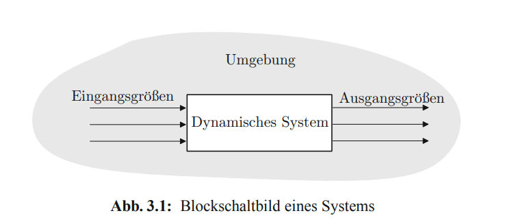
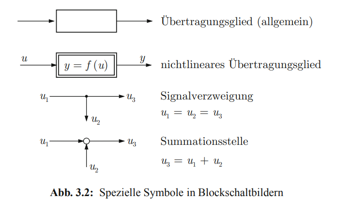
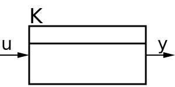
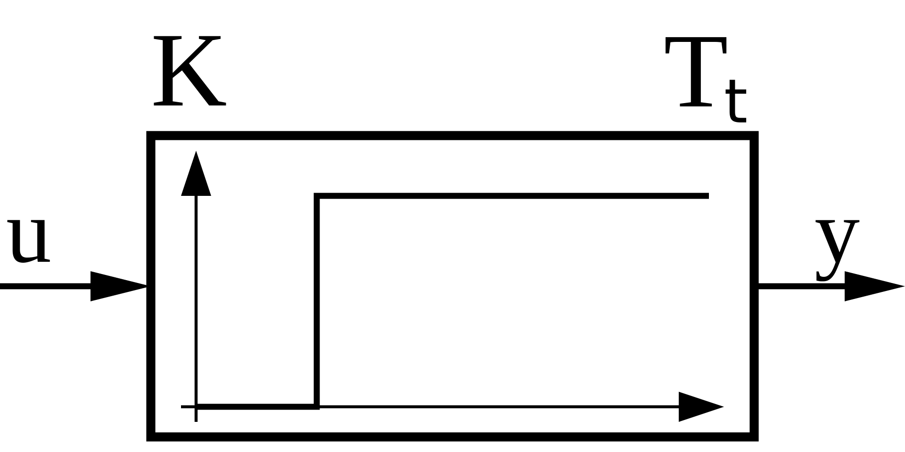
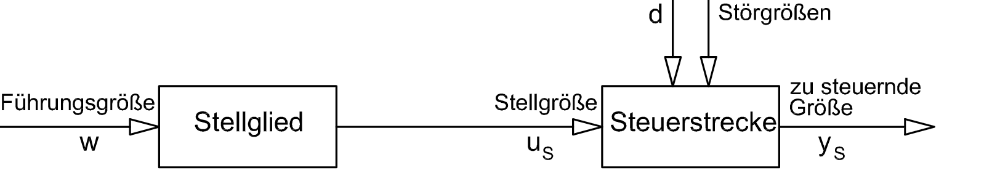
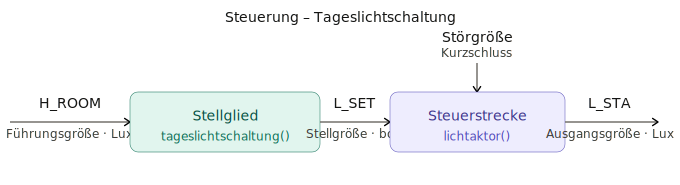
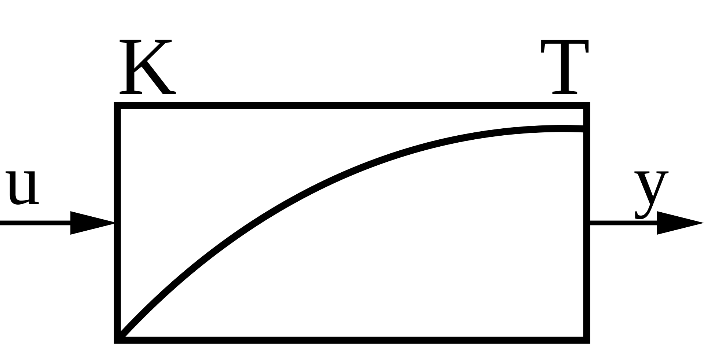
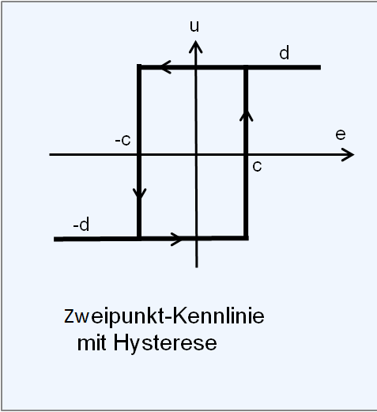

<!-- paginate: true -->


# 3.1 Blockschaltbild

<!-- _class: title -->


---

## Orientierung – Einheit 7 von 14

<!-- _class: white -->

### Wo sind wir?

| Abgeschlossen | **Heute** | Als nächstes |
|---|---|---|
| Einheit 6: Steuerung II | **Einheit 7: Regelungstechnik I** | Einheit 8: Regelungstechnik II |

### Was haben wir bisher gelernt?

* Ablauf- und Verknüpfungssteuerungen (FSM, Boolesche Logik)
* OOP: Sensor- und Aktorklassen, JSON-Serialisierung
* Tageslichtschaltung implementiert – aber: was tun bei Störungen?

---

### Wo wollen wir hin?

Eine Steuerung reagiert nicht auf Störungen (z.B. Verschattung, Reflexionen, etc.) – dafür brauchen wir Regelung. Heute lernen wir, Signalflüsse mit **Blockschaltbildern** darzustellen. Wir modellieren den offenen Regelkreis und implementieren eine erste **Zweipunktregelung** für die Konstantlichtregelung.

---

## Lernziele – Einheit 7

* Blockschaltbild-Elemente (P-, I-, D-Glied, Totzeitglied) erklären
* Tageslichtschaltung als Blockschaltbild darstellen
* Offenen Regelkreis (Steuerkette) von geschlossenem Regelkreis abgrenzen
* Zweipunktregelung mit Hysterese beschreiben und implementieren
* Simulationsparameter (Verstärkung, Zeitkonstante) identifizieren

---

### Aufgaben dieser Einheit

| Aufgabe | Inhalt |
|---------|--------|
| ✍️ 3_1_1 | Tageslichtschaltung in Blockschaltbild übersetzen (Papier) |
| ✍️ 3_1_2 | Proportionalglied + Totzeitglied simulieren (Python) |
| ✍️ 3_1_3 | Wassertank ohne Steuerung simulieren (Python) |
| ✍️ 3_1_4 | Tageslichtschaltung als Schwellwertglied simulieren (Python) |
| ✍️ 3_1_5 | Zweipunktregelung mit Hysterese für Tageslichtschaltung (Python) |

---


## Blockschaltbild





* Grafische Beschreibung von Systemen in der Regelungs- und Steuerungstechnik
* Systeme werden durch Blöcke dargestellt, die durch Pfeile verbunden sind
  * z.B. Steuerungsfunktion (z.B. in Python)
  * z.B. thermodynamisches Modell eines Raums
* Systeme werden durch Eingangsgrößen beeinflusst und verändern Ausgangsgrößen

---

* I.d.R. beschäftigen wir uns mit **dynamischen Systemen**
    * Die Ausgangsgröße hängt nicht nur  von den Eingangsgrößen ab (vgl. _Funktion_) 
    * sondern auch vom Systemzustand und damit inneren Zustandsgrößen (vgl. _Objekt_)
* Entsprechend lernen wir nun eine abstraktere Darstellung von Systemen kennen, die wird schon implementiert haben.


[Quelle](Lunze )

---

### 🤓 Dynamische Systeme

* lineare Systeme: Systemfunktion ist eine lineare Funktion
* nichtlineare Systeme: Systemfunktion ist eine nichtlineare Funktion
* zeitinvariante Systeme: Systemfunktion ist unabhängig von der Zeit
* zeitvariante Systeme: Systemfunktion ist abhängig von der Zeit

---


## Elemente eines Blockschaltbildes




* Übertragungsglieder beschreiben Systeme mit deren Eigenschaften / Funktionen
* Pfeile die Ein- und Ausgangsgrößen
* Komplexe Systeme können durch mehrere Systeme zusammengesetzt werden
* Systeme werden im Zeitbereich durch ihre Funktionsbeziehung zwischen Ausgang $y$ und Eingang $u$ unterschieden $f(u)=y$


---

### Proportionalglied (P-Glied)

* Linear und zeitinvariant (kein Gedächtnis)
* Beschreibt Systeme mit direktem proportionaler Systemfunktion $f$ für den Zusammenhang zwischen Eingang ($u$) und Ausgang ($y$)
  * $y = f(u)=K_p \cdot u$
  * $K_p$ ... Proportionalitätsfaktor
* Praktische Beispiele:
  * Lineare Verstärkung
  * Übersetzung beim Getriebe



---

#### Wirkweise eines P-Glieds

* $y = f(u)=K_p \cdot u$
* Beispiel: 
  * je höher die $\text{CO}_2$ Konzentration in einem Raum, desto schneller dreht sich ein Ventilator in einer Lüftungsanlage
  * $y$ ... Drehfrequenz der Ventilators in $\text{Hz}$
  * $u$ ... $\text{CO}_2$ Konzentration in $\text{ppm}$
  * $K_p$ ... Proportionalitätsfaktor in $\frac{\text{Hz}}{\text{ppm}}$
> Rechts grafische Darstellung im Funktionsbereich


---


* Unabhängig vom Verlauf der Eingangsgröße $u(t)$ ist der Wert der Ausgangsgröße $y(t)$ immer proportional

> Links grafische Darstellung im Zeitbereich

---

#### 🧠 Einheits-Sprungfunktion

* beliebtes Werkzeug in die Regelungstechnik: Wie reagiert ein System, wenn wir eine Sprungfunktion an den Eingang legen (auch in der E-Technik z.B. durch Rechteckspannung!)
* Eine Funktion, die am Zeitpunkt $t=0$ von $u=0$ auf $u=1$ springt und sonst konstant bleibt


---

#### 🧠 Sprungantwort (Reaktion) eines P-Glieds auf eine Sprungfunktion


---

<!-- _class: white-->


* Das Symbol repräsentiert die Sprungantwort im Zeitbereich
* weitere Beispiele:
  * Entwicklung Spannungsabfall am Ohmschen Widerstand 
  beim Anlegen einer Quellenspannung
  * Antwort eines Helligkeitssensors auf Lichteinfall

[Quelle](Lunze )


---

### Totzeitglied (T-Glied)

* beschreibt die zeitliche Verzögerung, bis ein System auf das Eingangssignal (z.B. der Sprungfunktion) reagiert. 
* Nicht die Trägheit des Systems sondern eine Leerlaufzeit $T_t$.
* z.B. in Bussystem: Weiterleitung von Signalen im fixen Takt



---

## Verknüpfung von Systemen im Blockschaltbild


---

#### 🧠 Sprungantwort eines T-Glieds auf eine Sprungfunktion


---

## Simulation von Blockschaltbildern

* Blockschaltbilder lassen sich mit grafischen Simulationswerkzeugen direkt simulieren (z.B. Scilab xcos, Matlab Simulink, Python/scipy). In den folgenden Aufgaben wird beschrieben, **welche Bausteine** verbunden werden sollen – das konkrete Werkzeug wählen Sie oder wird in der Vorlesung festgelegt.
* Dies dient z.B. der Auslegung und dem Test von Raumautomationsfunktionen, wie der Tageslichtschaltung


---

## Blockschaltbild einer Steuerung




* Die **Führungsgröße** ist die Größe, welche das Verhalten der Stellglieds bestimmt ($\rightarrow$ z.B. die aktuelle Beleuchtungsstärke gemessen am Lichtsensor  im Freien)
* Durch das Stellen eines **Stellglieds** (oder Stelleinrichtung bzw. Aktor) wird die Steuerstrecke beeinflusst ($\rightarrow$ Mikrocotroller steuert Spannung an LED an oder aus basierend auf einen Schwellenwert)


[Quelle](https://upload.wikimedia.org/wikipedia/commons/6/64/R_S_Block.svg)

---

## 🧠 Steuerung


* **Stellgröße** ist die Ausgangsgröße des Stellglieds ($\rightarrow$ Spannung an der LED)
* **Steuerstrecke** ist das System, das durch die Stellgröße und Störgrößen beeinflusst wird ($\rightarrow$ Helligkeit im Raum)
* Auf die Steuerstrecke wirken neben der Stellgröße aus **Störgrößen** 
($\rightarrow$ Lichteinfall von Außen, weitere nicht gesteuerte Lichtquellen im Raum)


[Quelle](https://upload.wikimedia.org/wikipedia/commons/6/64/R_S_Block.svg)


---

### Stellglied

* ist nun kein standardisiertes Glied,
 sondern hat eine spezielle Funktion die sich aus Hard- und Software ergibt
* diese beinhaltet Steuerungslogik
* und physikalische Umsetzung
* zeitliche Reaktion meist nicht unmittelbar, sondern verzögert 
(z.B. Rechenzeit als Totzeit)

```Python
def tageslichtschaltung(p_act, h_room, PAR_SETPT, l_man):
    L_SET = (p_act and h_room<PAR_SETPT) or l_man
    return L_SET
```

---

### Steuerstrecke

* beschreibt die echte Welt
* häufig in vereinfachten Modellen
* zeitliche Reaktion meist nicht unmittelbar (z.B. PT1-Glied)

```Python
def lichtaktor(L_SET):
  # ...
  return L_STA # Momentanwert der Beleuchtung
```

```Python
def beleuchtungsstraerke_raum_lux(lichtabgabe_led, lichteinfall_aussen, wand_farbe):
  # Größe des Raumes
  # Größe der Fenster
  # Reflexion der Wände
  <...>
  return beleuchtungsstraerke_raum_lux
```

---

## ✍️ Aufgabe 3_1_1: Tageslichtschaltung als Blockschaltbild (Papier)

> Bevor wir simulieren: Stellen Sie die Tageslichtschaltung als Blockschaltbild dar.

**Aufgabe (kein Werkzeug nötig):**

Skizzieren Sie auf Papier das Blockschaltbild der Tageslichtschaltung aus Aufgabe 2_3_1. Beantworten Sie dabei:

1. Was ist die **Führungsgröße** (gewünschter Sollwert)?
2. Welche Variable ist die **Messgröße** (tatsächlich gemessener Wert)?
3. Was ist das **Stellglied** – und dessen Ein und Ausgang? Welche Entscheidung wird hier getroffen?
4. Was ist die **Steuerstrecke** – also das System, das durch die Stellgröße beeinflusst wird?
5. Gibt es **Störgrößen**? Wenn ja: Welche?

---

### ✔️ Lösung 



- Führungsgröße: `H_ROOM` (gemessene Raumhelligkeit über LDR + ADC)
- Stellglied: RA-Funktion
- Stellgröße: `L_SET` (Steuerbefehl für die Beleuchtung)
- Steuerstrecke: Der Lichtaktor, der durch das Stellglied beeinflusst wird.
- Störgröße: In diesem Fall nicht relevant, ggf. Kurzschluss

---

## ✍️ Aufgabe 3_1_2: Proportionalglied mit Totzeitglied (Python)

### Einführung: `blockdiagram`-Bibliothek

Für die Simulation von Blockschaltbildern verwenden wir die Bibliothek `blockdiagram.py`
(liegt im `Aufgaben/`-Ordner). Blöcke werden durch Übergabe anderer Blöcke als `source`-Argument verknüpft:

```python
from blockdiagram import Step, Gain, TransportDelay, Scope

u    = Step(t_step=1, final=1)           # Quelle
gain = Gain(K=2, source=u)               # P-Glied
y    = TransportDelay(Tt=3, source=gain) # Totzeitglied

Scope(t_end=15).run(Eingang=u, Ausgang=y)  # simulieren & plotten
```

---

### Modell-Aufbau

```
Step ──▶ Gain(K=2) ──▶ TransportDelay(Tt=3) ──▶ Scope
```

| Block | Klasse | Parameter |
|-------|--------|-----------|
| Sprungfunktion | `Step` | `t_step=1`, `final=1` |
| Proportionalglied | `Gain` | `K=2` |
| Totzeitglied | `TransportDelay` | `Tt=3` |
| Plot | `Scope` | `t_end=15` |

Notebook: `Aufgaben/3_1_2/aufgabe_3_1_2_proportional_totzeit.ipynb`

---

### Beobachtungsaufgaben

**a) Beschreiben Sie den Zeitverlauf am Ausgang:**
- Ab welchem Zeitpunkt erscheint das Ausgangssignal?
- Welchen Wert hat das Ausgangssignal im eingeschwungenen Zustand?
- Wie unterscheidet sich das Ausgangssignal vom Eingangssignal?

---

**b) Parameterstudie – Verstärkung $K_P$ variieren:**

| $K_P$ | Erwarteter stationärer Endwert |
|-------|-------------------------------|
| 0,5   | ?                             |
| 2     | ?                             |
| 5     | ?                             |

→ Welcher Zusammenhang besteht zwischen $K_P$ und dem Endwert?

**c) Parameterstudie – Totzeit $T_t$ variieren:**

| $T_t$  | Beobachtung am Ausgangssignal |
|--------|-------------------------------|
| 1 s    | ?                             |
| 3 s    | ?                             |
| 8 s    | ?                             |

→ Was verändert sich am Ausgangssignal? Verändert sich der stationäre Endwert?

---

### Reflexionsfragen

- Wo tritt eine Totzeit in der Gebäudeautomation auf? Nennen Sie ein konkretes Beispiel.
- Warum ist die Totzeit für die Regelung besonders problematisch?

---

### Proportionalglied mit Verzögerung 1. Ordnung (PT1-Glied)

* beschreibt Trägheit im System oder eine Dämpfung
* nähert sich über die Zeit einer waagrechten Linie an
  * z.B. Spannung am Kondensator
  * z.B. Temperatur im Raum nach dem Einschalten einer Fußbodenheizung
  * Beschränktes Wachstum





---

- Es gibt noch viele weitere typische Glieder
- Mehr dazu beim Thema stetige Regler
- aus diesen lassen sich komplexe Modelle zusammenstellen lassen
(z.B. als Blockschaltbild)


---

## ✍️ Aufgabe 3_1_3: Wassertank ohne Steuerung

**Szenario:** Ein 100 l fassender Wassertank ist zu Beginn mit 10 l gefüllt. Es fließen konstant 5 l/min hinein.

**Zu modellieren:**
Skizzieren sie zunächst ein Blockdiagramm.

```python
from blockdiagram import Constant, Integrator, Scope

zufluss    = Constant(5)
fuellstand = Integrator(K=1, initial=10, source=zufluss)

Scope(t_end=20, ylabel="Füllstand [l]", xlabel="Zeit [min]").run(
    Fuellstand=fuellstand
)
```

---

**Fragen:**
- Nach wie vielen Minuten ist der Tank voll?
- Was passiert, wenn der Zufluss auf 2 l/min sinkt?

---

### ✔️ Lösung


Der Füllstand wächst linear: $V(t) = 10 + 5t$. Nach $t = 18\,\text{min}$ ist der Tank voll.

---

## Einpunktregler (Schwellwertschalter)

* Einfachste Form eines Schalters: **ein** Schwellwert entscheidet über Ein/Aus
* Kein Gedächtnis – der Ausgang hängt nur vom **aktuellen** Eingang ab

| Bedingung | Ausgang |
|---|---|
| Eingang **<** Schwellwert | **1** (an) |
| Eingang **≥** Schwellwert | **0** (aus) |

```python
from blockdiagram import Sine, SinglePointController, Scope

h_aussen = Sine(amplitude=250, offset=250, period=24)
led = SinglePointController(threshold=220, source=h_aussen)

Scope(t_end=48, xlabel="Zeit [h]").run(
    Helligkeit_Lux=h_aussen,
    LED_an=led
)
```

---

## ✍️ Aufgabe 3_1_4: Tageslichtschaltung als Einpunktregler (Python)

> Hier übersetzen wir die Tageslichtschaltung aus Aufgabe 2_3_1 erstmals in ein Blockschaltbild.

**Modell:** `Sine` → `SinglePointController` → `Scope`

| Block | Klasse | Parameter |
|---|---|---|
| Außenhelligkeit | `Sine` | `amplitude=250`, `offset=250`, `period=24` |
| Schwellwertschalter | `SinglePointController` | `threshold=220` |
| Zeitverlauf | `Scope` | `t_end=48`, `xlabel="Zeit [h]"` |

Notebook: `Aufgaben/3_1_4/aufgabe_3_1_4_tageslichtschaltung.ipynb`

---

**Fragen:**

**a)** Wann geht die LED an – bei Über- oder Unterschreitung des Schwellwerts?

**b)** Welchen Schwellwert müsste man wählen, damit die LED bei 300 Lux Raumlicht gerade noch brennt?

**c)** Simulieren Sie Dämmerung: Die Außenhelligkeit schwankt langsam um 220 Lux.
Ersetzen Sie dazu `h_aussen` durch:
```python
h_daemmerung = Sine(amplitude=20, offset=220, period=0.5)
```
Was beobachten Sie am LED-Signal?

---

### ✔️ Lösung

Der `SinglePointController` schaltet ein, sobald der Eingang **unter** den Schwellwert fällt.

- **a)** Bei Unterschreitung von 220 Lux geht die LED an.
- **b)** `threshold=300`
- **c)** Die LED **flattert**: weil der Eingang mehrfach pro Stunde den einzigen Schwellwert kreuzt, schaltet der Regler ständig um – ohne jeden Grund.

---

## Problem: Flattern am Schwellwert


[Quelle](https://www.youtube.com/watch?v=nC5ZPEPtH9w)

* Kleine Schwankungen um den Schwellwert → viele Schaltvorgänge
* Folgen: Verschleiß (Relais, Aktoren), Flickern der Beleuchtung, unnötige Buslasten
* Ursache: Ein einziger Schwellwert hat **kein Gedächtnis** – jede Flanke löst aus

---

## Lösung: Zweipunktregler mit Hysterese

Idee: Statt eines einzigen Schwellwerts zwei **verschiedene** Schwellen einführen:

* **Einschaltschwelle** `on_level`: LED geht **an**, wenn Helligkeit *darunter* fällt
* **Ausschaltschwelle** `off_level`: LED geht **aus**, wenn Helligkeit *darüber* steigt
* Im Bereich dazwischen: **letzter Zustand bleibt** (Gedächtnis!)

---

Das **Schaltband** = `off_level − on_level` dämpft Schwankungen in der Dämmerungszone.


---

### Schaltlogik



| Helligkeit | Ausgang |
|---|---|
| < `on_level` (200 Lux) | **1** – LED an |
| > `off_level` (250 Lux) | **0** – LED aus |
| 200–250 Lux | unveränderter letzter Zustand |

* Schwankungen **innerhalb** des 50-Lux-Bandes → **kein** Schalten
* Die LED „erinnert sich" an ihren letzten Zustand

[Quelle](https://www.wikiwand.com/de/Methode_der_harmonischen_Balance#Media/Datei:Zweipunktkennlinie.png)

---

### `TwoPointController` in `blockdiagram.py`

```python
from blockdiagram import Sine, SinglePointController, TwoPointController, Scope

h_daemmerung = Sine(amplitude=20, offset=220, period=0.5)

# Einpunktregler: kein Gedächtnis → Flattern
led_1pt = SinglePointController(threshold=220, source=h_daemmerung)

# Zweipunktregler: Schaltband 50 Lux → stabil
led_2pt = TwoPointController(on_level=200, off_level=250, source=h_daemmerung)

Scope(t_end=3, xlabel="Zeit [h]").run(
    Helligkeit_Lux=h_daemmerung,
    Einpunktregler=led_1pt,
    Zweipunktregler=led_2pt
)
```

---

## ✍️ Aufgabe 3_1_5: Zweipunktregler mit Hysterese (Python)

> Ersetzen Sie in Aufgabe 3_1_4 den `SinglePointController` durch einen `TwoPointController` mit Hysterese.

**Modell:**

| Block | Klasse | Parameter |
|---|---|---|
| Außenhelligkeit | `Sine` | `amplitude=250`, `offset=250`, `period=24` |
| Zweipunktregler | `TwoPointController` | `on_level=200`, `off_level=250` |
| Zeitverlauf | `Scope` | `t_end=48`, `xlabel="Zeit [h]"` |

Notebook: `Aufgaben/3_1_4/aufgabe_3_1_4_hysterese.ipynb`

---

**Fragen:**

**a)** Vergleichen Sie den Schaltverlauf mit Aufgabe 3_1_4 (Einpunktregler): Wie oft schaltet die LED pro Tag?

**b)** Simulieren Sie wieder die Dämmerung (`amplitude=20`, `offset=220`, `period=0.5`).
Flattern Sie die LED noch? Warum nicht?

**c)** Was passiert, wenn das Schaltband sehr groß (z.B. 300 Lux) oder sehr klein (z.B. 5 Lux) gewählt wird?

---

### ✔️ Lösung

- **a)** Mit 50 Lux Schaltband schaltet die LED **2× pro Tag** (Morgen/Abend) – statt bei jeder Schwankung.
- **b)** Kein Flattern: Die Amplitude (20 Lux) ist kleiner als das Schaltband (50 Lux) → die Helligkeit verlässt die Hysterese-Zone nie vollständig.
- **c)** Großes Band (300 Lux): LED bleibt lange im falschen Zustand. Kleines Band (5 Lux): Verhalten fast wie Einpunktregler, Flattern kehrt zurück.