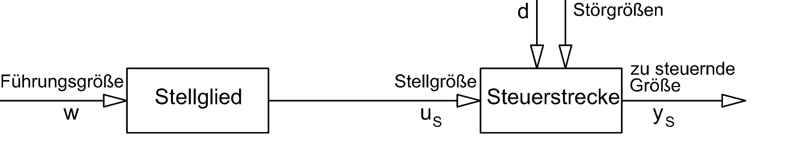

<!-- paginate: true -->


# 3.1 Blockschaltbild

---

## Blockschaltbild


* Grafische Beschreibung von Systemen in der Regelungs- und Steuerungstechnik
* Systeme werden durch Blöcke dargestellt, die durch Pfeile verbunden sind
  * z.B. Steuerungsfunktion (z.B. in Python)
  * z.B. thermodynamisches Modell eines Raums
* I.d.R. beschäftigen wir uns mit **dynamischen Systemen**
    * Die Ausgangsgröße hängt nicht nur  von den Eingangsgrößen ab (vgl. Funktion) 
    * sondern auch vom Systemzustand und damit inneren Zustandsgrößen (vgl. Objekt)


[Quelle](Lunze )

---

### Dynamische Systeme

* lineare Systeme: Systemfunktion ist eine lineare Funktion
* nichtlineare Systeme: Systemfunktion ist eine nichtlineare Funktion
* zeitinvariante Systeme: Systemfunktion ist unabhängig von der Zeit
* zeitvariante Systeme: Systemfunktion ist abhängig von der Zeit
* Totzeit: Systemfunktion ist eine Funktion der Zeit, die für $t<0$ verschwindet


---


## Elemente eines Blockschaltbildes


* Übertragungsglieder beschreiben Systeme mit deren Eigenschaften / Funktionen
* Pfeile die Ein- und Ausgangsgrößen
* Komplexe Systeme können durch mehrere Systeme zusammengesetzt werden
* Systeme werden im Zeitbereich durch ihre Funktionsbeziehung zwischen Ausgang $y$ und Eingang $u$ unterschieden $f(u)=y$


---

### Proportionalglied (P-Glied)

* Linear und zeitinvariant
* Beschreibt Systeme mit direktem proportionaler Systemfunktion $f$ für den Zusammenhang zwischen Eingang ($u$) und Ausgang ($y$)
  * $y = f(u)=K_p \cdot u$
  * $K_p$ ... Proportionalitätsfaktor


---

#### Wirkweise eines P-Glieds

* $y = f(u)=K_p \cdot u$
* Beispiel: 
  * je höher die $\text{CO}_2$ Konzentration in einem Raum, desto schneller dreht sich ein Ventilator in einer Lüftungsanlage
  * $y$ ... Drehfrequenz der Ventilators in $Hz$
  * $u$ ... $\text{CO}_2$ Konzentration in $ppm$
  * $K_p$ ... Proportionalitätsfaktor in $\frac{Hz}{ppm}$


---


* Unabhängig vom Verlauf der Eingangsgröße $u(t)$ ist der Wert der Ausgangsgröße $y(t)$ immer proportional

---

#### 🧠 Einheits-Sprungfunktion

* Eine Funktion, die am Zeitpunkt $t=0$ von $u=0$ auf $u=1$ springt und sonst konstant bleibt
* beliebtes Werkzeug in die Regelungstechnik: Wie reagiert ein System, wenn wir eine Sprungfunktion an den Eingang legen (auch in der E-Technik!)


---

#### 🧠 Sprungantwort (Reaktion) eines P-Glieds auf eine Sprungfunktion


---

<!-- _class: white-->


* Das Symbol repräsentiert die Sprungantwort
* weitere Beispiele:
  * Entwicklung Spannungsabfall am Ohmschen Widerstand 
  beim Anlegen einer Quellenspannung
  * Antwort eines Helligkeitssensors auf Lichteinfall

[Quelle](Lunze )


---

### Totzeitglied (T-Glied)

* beschreibt die zeitliche Verzögerung, bis ein System auf das Eingangssignal (z.B. der Sprungfunktion) reagiert. 
* Nicht die Trägheit des Systems sondern eine Leerlaufzeit $T_t$. 


---


---

#### 🧠 Sprungantwort eines T-Glieds auf eine Sprungfunktion


---

## Simulation mit scilab xcos

- Installieren Sie [scilab xcos](https://www.scilab.org/download/scilab-2024.0.0)
- Xcos ist ein grafischer Editor für Blockschaltbilder
- die Funktionalität entspricht in etwa matlab simulink
- allerdings ist die Software open source und kostenlos


---

## ✍️ Aufgabe 3_1_0: Proportional mit Totzeitglied


- Öffnen Sie [P_totzeit.zcos](https://github.com/jhumci/scilab_xcos_solutions/blob/main/Bussysteme/3_1_0/P_totzeit.zcos) in [scilab xcos](https://www.scilab.org/download/scilab-2024.0.0)
- Testen Sie verschiedene Werte für den P-Wert beim `PID`-Block und die Totzeit beim `Continuous fix delay`-Block
- Ersetzen Sie den `PID`-Block durch einen `GAIN_f`-Block


---

### Proportionalglied mit Verzögerung 1. Ordnung (PT1-Glied)

* beschreibt Trägheit im System oder eine Dämpfung 
* nähert sich über die Zeit einer waagrechten Linie an
  * z.B. Spannung am Kondensator
  * z.B. Temperatur im Raum nach dem Einschalten einer Fußbodenheizung
  * Beschränktes Wachstum


---

- Es gibt noch viele weitere typische Glieder 
- Mehr dazu beim Thema stetige Regler
- aus diesen lassen sich komplexe Modelle zusammenstellen lassen 
(z.B. als Blockschaltbild)

---

## Blockschaltbild einer Steuerung




* Die **Führungsgröße** ist die Größe, welche das Verhalten der Stellglieds bestimmt ($\rightarrow$ z.B. die aktuelle Beleuchtungsstärke gemessen am Lichtsensor  im Freien)
* Durch das Stellen eines **Stellglieds** (oder Stelleinrichtung bzw. Aktor) wird die Steuerstrecke beeinflusst ($\rightarrow$ Mikrocotroller steuert Spannung an LED an oder aus basierend auf einen Schwellenwert)


[Quelle](https://upload.wikimedia.org/wikipedia/commons/6/64/R_S_Block.svg)

---

## 🧠 Steuerung


* **Stellgröße** ist die Ausgangsgröße des Stellglieds ($\rightarrow$ Spannung an der LED)
* **Steuerstrecke** ist das System, das durch die Stellgröße und Störgrößen beeinflusst wird ($\rightarrow$ Helligkeit im Raum)
* Auf die Steuerstrecke wirken neben der Stellgröße aus **Störgrößen** 
($\rightarrow$ Lichteinfall von Außen, weitere nicht gesteuerte Lichtquellen im Raum)


[Quelle](https://upload.wikimedia.org/wikipedia/commons/6/64/R_S_Block.svg)


---

### Stellglied

* ist nun kein standardisiertes Glied,
 sondern hat eine spezielle Funktion die sich aus Hard- und Software ergibt
* diese beinhaltet Steuerungslogik
* und physikalische Umsetzung
* zeitliche Reaktion meist nicht unmittelbar, sondern verzögert 
(z.B. Rechenzeit als Totzeit)

```Python
def l_set(p_act, h_room, PAR_SETPT, l_man):
    return (p_act and h_room<PAR_SETPT) or l_man
```

---

### Steuerstrecke

* beschreibt die echte Welt
* häufig in vereinfachten Modellen
* zeitliche Reaktion meist nicht unmittelbar (z.B. PT1-Glied)

```Python
def beleuchtungsstraerke_raum_lux(lichtabgabe_led, lichteinfall_aussen, wand_farbe):
  # Größe des Raumes
  # Größe der Fenster
  # Reflexion der Wände
  <...>
  return beleuchtungsstraerke_raum_lux
```

```Python
def raumtemperatur(heizleistung_in_w, aussen_temp_in_c):
  # Temperatur im Zeitpunkt zuvor
  # Trägheit der Temperaturänderung
  # Größe des Raumes
  # Isolation der Raumes
  <...>
  return raum_temp_in_c
```


---

## ✍️ Aufgabe 3_1_1: Wassertank ohne Steuerung

- Bauen Sie das folgende Modell aus `CONST`, `INTEGRAL_m`, `CSCOPE` und `CLOCK_c` nach
- Modellieren Sie einen 100 l fassenden Wassertank, der zu Begin mit 10 l gefüllt ist und in den 5 l pro Minute einfließen


---

### ✔️ Lösung

<!-- _color: black -->

??? optional-class "💡 anzeigen"
    [Link](https://github.com/jhumci/scilab_xcos_solutions/blob/main/Bussysteme/3_1_1/Wassertank.zcos)

---

## ✍️ Aufgabe 3_1_2: Einfache Tageslichtschaltung


- passen Sie den Threshold in `Dynamic` in [3_1_2_Tageslichtschaltung.zcos](https://github.com/jhumci/scilab_xcos_solutions/blob/main/Bussysteme/3_1_2/3_1_2_Tageslichtschaltung.zcos) so an, dass die LED bei einer Helligkeit von 220 Lux angeht


---

### ✔️ Lösung

<!-- _color: black -->

??? optional-class "💡 anzeigen"
    [Link](https://github.com/jhumci/scilab_xcos_solutions/blob/main/Bussysteme/3_1_2/3_1_2_Tageslichtschaltung.zcos)

---


## Zwei-Punkt Regelung

- Vorteile
  - einfach zu verstehen
  - und zu implementieren

```Python
regelabweichung = soll_lux- ist_lux 

zweipunkt_regler(regelabweichung):
  if regelabweichung > 0:
    licht = True
  else:
    licht = False
  return licht
```

[Quelle](Vorsicht: Wir greifen hier zum Thema Regelung vor, setzen den Regler aber in einer Steuerung ohne Regelkreis ein!)

---


### Probleme Zwei-Punkt Regelung

* Nachteile bei zeitlich wenig trägen Systemen
  * Regler schaltet ständig zwischen den Ausgangswerten
  * kritisch insbesondere bei mechanische Belastung
  * z.B. Motor wird ständig an und aus geschaltet

---


## Hysterese

- bewirkt eine Schalttoleranz ober- und unterhalb des Sollwerts


---

```Python
def zweipunkt_hysterese(ist_lux, on_level, off_level, letzter_zustand):
    if ist_lux > off_level:
      licht = False
    elif ist_lux < on_level:
      licht = True
    else:
      licht = letzter_zustand

    return licht
```

```Python
class zweipunkt_hysterese():

    def __init__(self, on_level, off_level):
        self.on_level = on_level
        self.off_level = off_level
        self.letzter_zustand = False

    def calc_output(self, ist_lux):
        if ist_lux > self.off_level:
            self.letzter_zustand = False
        elif ist_lux < self.on_level:
            self.letzter_zustand = True
        return self.letzter_zustand

```


[Quelle](https://www.wikiwand.com/de/Methode_der_harmonischen_Balance#Media/Datei:Zweipunktkennlinie.png)


---


[Quelle](https://www.youtube.com/watch?v=nC5ZPEPtH9w)

---

### Drei-Punkt Regelung

* vermeidet ständiges Umschalten
* sinnvoll bei Neutralstellung z.B. Motoren

  ```Python
  drei_punk_regler(abstand):
    if abstand > 6:
      fahre = "vorwärts"
    elif abstand < 4:
      fahre = "rückwärts"
    else:
      fahre = "nicht"
    return fahre

  bewegung = drei_punk_regler(abstand)
  ```


---

## ✍️ Aufgabe 3_1_3: Einfache Tageslichtschaltung

- Ersetzen Sie den Schalter `Dynamic` mit einem Hystereseschalter `HYSTERESIS`


---

### ✔️ Lösung

<!-- _color: black -->

??? optional-class "💡 anzeigen"
    [Link](https://github.com/jhumci/scilab_xcos_solutions/blob/main/Bussysteme/3_1_3/3_1_3_Tageslichtschaltung_Hysterese.zcos)