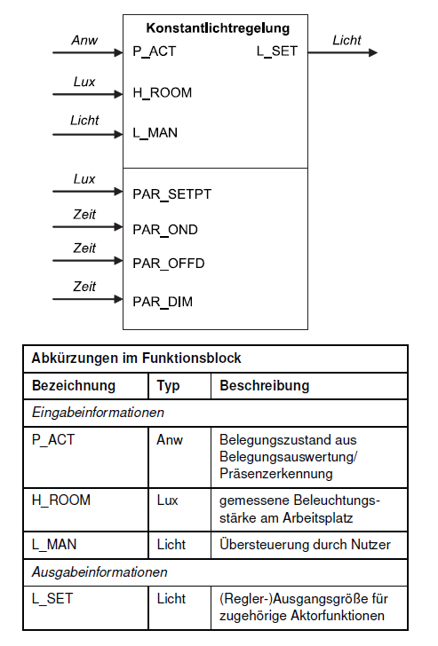
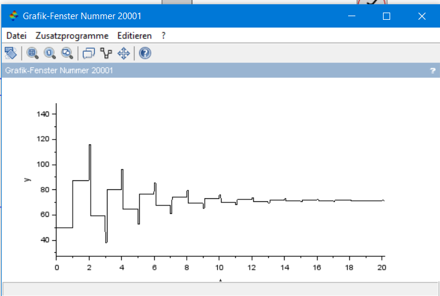
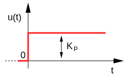
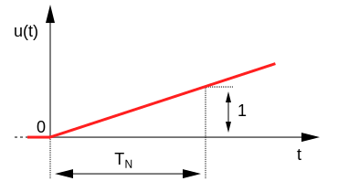
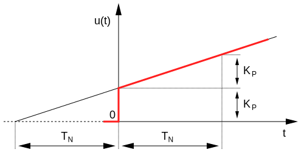
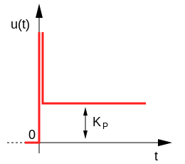

<!-- paginate: true -->


# 3.2 Regelkreise

<!-- _class: title -->


---

## Orientierung – Einheit 8 von 14

<!-- _class: white -->

### Wo sind wir?

| Abgeschlossen | **Heute** | Als nächstes |
|---|---|---|
| Einheit 7: Regelungstechnik I | **Einheit 8: Regelungstechnik II** | Einheit 9: Regelungstechnik III |

### Was haben wir bisher gelernt?

* Blockschaltbild-Elemente und Signalflüsse
* Zweipunktregelung mit Hysterese
* Simulationsmodelle: P-Glied, PT1, Totzeitglied

### Wo wollen wir hin?

Die Zweipunktregelung ist robust, aber schaltet nur an/aus. Heute schließen wir den **Regelkreis** und lernen P-, PI- und PID-Regler kennen. Was beeinflusst Stabilität, Überschwingen und Restabweichung? Die Konstantlichtregelung wird unser Leitbeispiel.

---

## Lernziele – Einheit 8

* Geschlossenen Regelkreis mit Führungs-, Regel-, Stell- und Störgröße beschreiben
* Wirkung von P-, I- und D-Anteil auf Regelverhalten erklären
* Trägheit und Totzeit eines Systems im Regelkreis berücksichtigen
* Regelkreis für Konstantlichtregelung und CO₂-Regelung modellieren

### Aufgaben dieser Einheit

| Aufgabe | Inhalt |
|---------|--------|
| ✍️ 3_2_1 | Konstantlichtregelung im Regelkreis modellieren |
| ✍️ 3_2_2 | CO₂-Regelung mit PI-Regler simulieren |
| ✍️ 3_2_3 | P, PI, PID-Regler vergleichen |

---


## Beispiel Konstantlicht-Regelung

> regelt die Raumbeleuchtung oder Teile davon bei Belegung automatisch so, dass eine eingestellte Mindestbeleuchtungsstärke nicht unterschritten wird

* Im Gegensatz zur Tageslichtschaltung, soll es aber auch nicht unnötig hell sein, wenn es draußen schon hell ist



---

### Konstantlicht-Regelung

* Lichtstärke kann (quasi) stetig gesteuert werden (z.B. über Dimmer oder Pulsweitenmodulation)


---

## ✍️ Aufgabe 3_2_1: Konstantlicht-Regelung (Python)

**Zu modellieren** (geschlossener Regelkreis):

```python
from blockdiagram import Step, Sum, Gain, TransportDelay, PT1, Scope

Kp      = 1
w       = Step(final=100)          # Sollwert: 100 Lux
e       = Sum()                    # Summationsstelle
regler  = Gain(K=Kp, source=e)
delay   = TransportDelay(Tt=0.5, source=regler)
strecke = PT1(tau=2, K=1, source=delay)

e.connect(w,       sign=+1)   # Sollwert addieren
e.connect(strecke, sign=-1)   # Istwert subtrahieren (Rückführung)

Scope(t_end=20, ylabel="Helligkeit [Lux]").run(
    Sollwert_w=w,
    Istwert_y=strecke,
    Regelabweichung_e=e
)
```

Notebook: `Aufgaben/3_2_1/aufgabe_3_2_1_konstantlicht.ipynb`

**Aufgaben:**
- Welche Komponenten aus dem RA-Schema (Kap. 1.2) werden durch welche Bausteine dargestellt?
- Variieren Sie `Kp` (z.B. 0,5 / 2 / 10): Wann wird das System instabil?

### ✔️ Lösung



* Bleibende Regelabweichung. Die 100 Lux werden nie erreicht
* Schwingen des Systems
* Sprunghaftes Verhalten (wegen Delay)

---

## Proportional-Regler

* Reaktion der Stellgröße bzw. Steuerungsgröße 
$u(t)=K_P \cdot e(t)$
* multipliziert die Regelabweichung $e_t$ mit dem Verstärkungsfaktor $K_P$ und gibt das Ergebnis aus
* je dunkler $y_m$ im Verhältnis zur Führungsgröße ($w$), desto heller die Beleuchtung ($u$)


---

* Reaktion der Stellgröße:
* $u(t)=K_P \cdot e(t)$

```Python
def p-regler(e, k_p):
  ausgang = e * k_p
  return ausgang
```


---

## ✍️ Aufgabe 3_2_2: Regelung der $\text{CO}_2$-Konzentration

> Ein weiteres typisches GA-System: In einem Besprechungsraum steuert eine SPS die Drehzahl einer Lüftungsanlage auf Basis der gemessenen CO₂-Konzentration. Dies zeigt, dass Regler nicht immer kontinuierlich arbeiten müssen.

- Ziel ist der Entwurf eines Reglers zur Steuerung einer Belüftungsanlage auf Basis der Schadstoffkonzentration im Raum in ppm
- Zeichnen Sie den Verlauf der Stellgrößen (Drehzahl der Anlage) für folgende zwei Regler:
  - stetiger Proportionalregler: $u(t) = \frac{2}{\text{min} \cdot \text{ppm}} e(t)$
  - Regelung nach Logik nächste Seite.

---

### ✔️ Lösung


```Python
def regler (e, letzte_drehzahl):
  if e == 1000:
    drehzahl = letzte_drehzahl
  else:
    if e > 1000:
      drehzahl = e
    else:
      drehzahl = 0
  return drehzahl
    
```

---

### ✔️ Lösung


---

### Zusammenfassung P-Regler



* P-Glied, welches als Regler eingesetzt wird
* Zeitverhalten: reagiert **unverzögert** 
* bleibende Regelabweichung bei Systemen mit Ausgleich (Regelstrecken welche sich nicht proportional verhalten)

---

## ✍️ Aufgabe 3_2_3: Wassertank mit PID-Regler (Python)

> Erweitern Sie das Modell aus Aufgabe 3_1_2b: Der Wassertank bekommt nun einen Regelkreis.

**Zu modellieren** (geschlossener Regelkreis):

```python
from blockdiagram import Step, Sum, PID, Integrator, Scope

w          = Step(final=60)
e          = Sum()
regler     = PID(Kp=1, Ki=0, Kd=0, source=e)   # zunächst reiner P-Regler
fuellstand = Integrator(K=1, initial=10, source=regler)

e.connect(w,          sign=+1)
e.connect(fuellstand, sign=-1)

Scope(t_end=30, ylabel="Füllstand [l]").run(
    Sollwert=w,
    Fuellstand=fuellstand
)
```

Notebook: `Aufgaben/3_2_3/aufgabe_3_2_3_wassertank_pid.ipynb`

**Aufgaben:**
- Starten Sie mit reinem P-Regler (`Ki=0`, `Kd=0`): Gibt es eine bleibende Regelabweichung?
- Aktivieren Sie den I-Anteil (`Ki > 0`): Was ändert sich?
- Was passiert, wenn Sie den D-Anteil stark erhöhen?


---

## 🧠 Integral-Regler



* Antwort $u(t)$ auf Sprung unmittelbar, jedoch nicht sofort mit voller Stärke
* Je länger ($t$) die Regelabweichung besteht und umso größer sie ist, desto stärker die Antwort
* $u(t)=\frac{1}{T_n}\int_0^te(\tau)d\tau$

[Quelle](Abbildung rechts ist Reaktion auf Sprungfunktion )

---


* $u(t)=\frac{1}{T_n}\int_0^te(\tau)d\tau$
* $u(t)=K_I \cdot \int_0^te(\tau)d\tau$
* $T_n$ ... Nachstellzeit bestimmt den Gradienten des Anstieges von $u$ 
* *summiert* die Regelabweichung über die Zeit auf
* **Regelabweichungen** werden auch bei Strecken mit Ausgleich vollständig **eliminiert**, dafür **langsamer**

---


---

## Proportional-Integral-Regler




* Sprungantwort: $u(t)=K_Pe(t) + K_I \cdot \int_0^te(\tau)d\tau$
* PI-Regler **Kombination** aus P- und I-Regler
* schnelle Reaktion (wie P-Regler)
* exakte Ausregelung ohne eine bleibende Regelabweichung (wie I-Regler) 

---

## 🧠 Proportional-Differenzial-Regler



* Sprungantwort: $u(t)=K_Pe(t)+K_d \frac{de(t)}{dt}=K_Pe(t)+T_v \frac{de(t)}{dt}$
* kombiniert P-Regler mit Differenzial-Anteil
* der D-Anteil bewertet die Änderung einer Regelabweichung (differenziert) und berechnet so deren **Änderungsgeschwindigkeit**
* reagiert schon auf *"Ankündigungen"* von Veränderungen 
* **sehr schnell**, doch bleibende **Regelabweichung**
* Unruhe im Regelkreis wird verstärkt, wenn Sensorsignal verrauscht 


---


---

## ✍️ Aufgabe 3_2_4: Reaktion D-Regler

✍️ Wie sieht die Reaktion aus?


