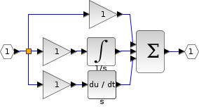

<!-- paginate: true -->


# 3.2 Regelkreise


---

## Beispiel Konstantlicht-Regelung

> regelt die Raumbeleuchtung oder Teile davon bei Belegung automatisch so, dass eine eingestellte Mindestbeleuchtungsstärke nicht unterschritten wird

* Im Gegensatz zur Tageslichtschaltung, soll es aber auch nicht unnötig hell sein, wenn es draußen schon hell ist


---

### Konstantlichtregelung

* Lichtstärke kann (quasi) stetig gesteuert werden (z.B. über Dimmer oder Pulsweitenmodulation)


---

## ✍️ Aufgabe 3_2_1: Konstantlicht-Regelung

* Laden Sie die Datei [Konstantlicht_nur_p.zcos]() und passen Sie den P-Parameter in `PID`-Baustein an und beobachten Sie die Reaktion des Systems
* Welche Komponenten werden durch welche Bausteine dargestellt?


---

## Proportional-Regler

* Reaktion der Stellgröße bzw. Steuerungsgröße 
$u(t)=K_P \cdot e(t)$
* multipliziert die Regelabweichung $e_t$ mit dem Verstärkungsfaktor $K_P$ und gibt das Ergebnis aus
* je dunkler $y_m$ im Verhältnis zur Führungsgröße ($w$), desto heller die Beleuchtung ($u$)


---

* Reaktion der Stellgröße:
* $
  u(t)=K_P \cdot e(t)$

```Python
def p-regler(e, k_p):
  ausgang = e * k_p
  return ausgang
```


---

## ✍️ Aufgabe 3_2_2: Regelung der CO2-Konzentration

- Ziel ist der Entwurf eines Reglers zur Steuerung einer Belüftungsanlage auf Basis der Schadstoffkonzentration im Raum in ppm 
- Zeichnen Sie den Verlauf der Stellgrößen (Drehzahl der Anlage) für folgende zwei Regler:
  - stetiger Proportionalregler: $u(t) = \frac{2}{min \cdot ppm} e(t)$ 
  - Regelung nach Logik nächste Seite.

---

### Lösung


---

### Lösung


```Python
def regler (e, letzte_drehzahl):
  if e ==1000:
    drehzahl = letzte_drehzahl
  else:
    if e > 1000:
      drehzahl = e
    else:
      drehzahl = 0
  return drehzahl
    
```


---

### Zusammenfassung P-Regler


* P-Glied, welches als Regler eingesetzt wird
* Zeitverhalten: reagiert **unverzögert** 
* bleibende Regelabweichung bei Systemen mit Ausgleich (Regelstrecken die bei konstantem Eingang einen konstanten Wert anstreben)

---

## ✍️ Aufgabe 3_2_3: Wassertank mit PID-Regler

Entfernen Sie den I und D-Anteil des PID-Reglers und beobachten Sie die Reaktion des Systems



[](https://help.scilab.org/PID)

---

## 🧠 Integral-Regler


* Antwort $u(t)$ auf Sprung unmittelbar, jedoch nicht sofort mit voller Stärke
* Je länger ($t$) die Regelabweichung besteht und umso größer sie ist, desto stärker die Antwort
* $u(t)=\frac{1}{T_n}\int_0^te(\tau)d\tau$

###### Abbildung rechts ist Reaktion auf Sprungfunktion 

---


* $u(t)=\frac{1}{T_n}\int_0^te(\tau)d\tau$
* $u(t)=K_I \cdot \int_0^te(\tau)d\tau$
* $T_n$ ... Nachstellzeit bestimmt den Gradienten des Anstieges von $u$ 
* *summiert* die Regelabweichung über die Zeit auf
* **Regelabweichungen** werden auch bei Strecken mit Ausgleich vollständig **eliminiert**, dafür **langsamer**

---


---

## Proportional-Integral-Regler


* Sprungantwort: $u(t)=K_Pe(t) + K_I \cdot \int_0^te(\tau)d\tau$
* PI-Regler **Kombination** aus P- und I-Regler
* schnelle Reaktion (wie P-Regler)
* exakte Ausregelung ohne eine bleibende Regelabweichung (wie I-Regler) 

---

## 🧠 Proportional-Differenzial-Regler


* Sprungantwort: $u(t)=K_Pe(t)+K_d \frac{de(t)}{dt}=K_Pe(t)+T_v \frac{de(t)}{dt}$
* kombiniert P-Regler mit Differenzial-Anteil
* der D-Anteil bewertet die Änderung einer Regelabweichung (differenziert) und berechnet so deren **Änderungsgeschwindigkeit**
* reagiert schon auf "Ankündigungen" von Veränderungen 
* **sehr schnell**, doch bleibende **Regelabweichung**
* Unruhe im Regelkreis wird verstärkt, wenn Sensorsignal verrauscht 


---


---

## ✍️ Aufgabe 3_2_4: Reaktion D-Regler

✍️ Wie sieht die Reaktion aus?


