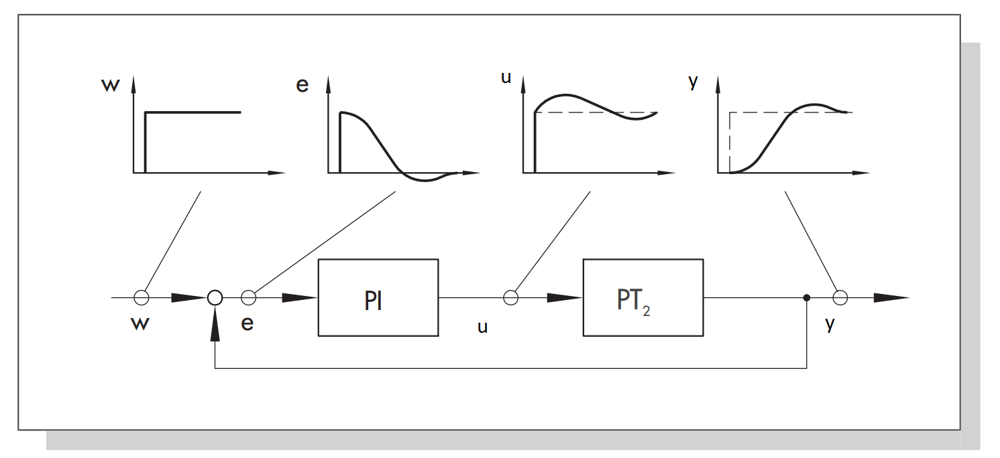
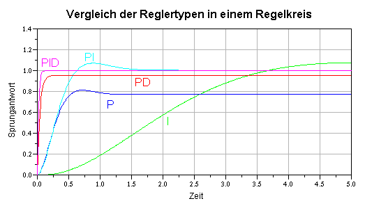
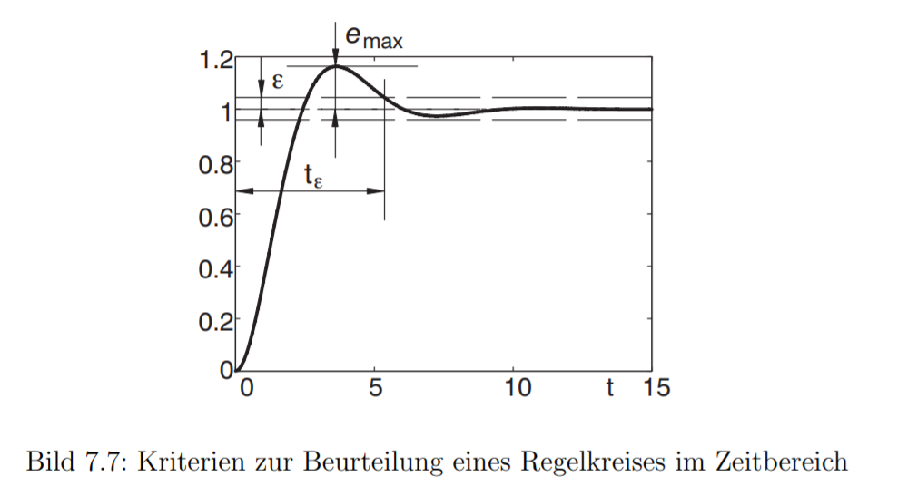
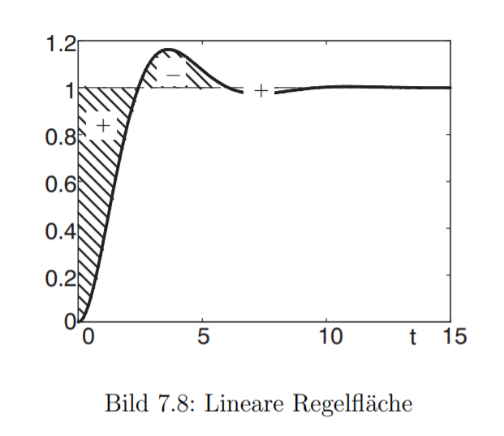
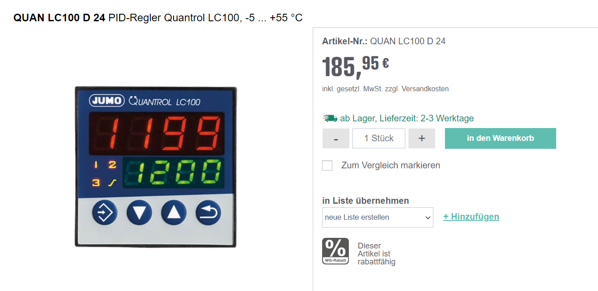
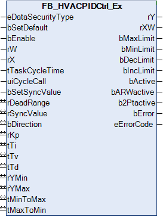
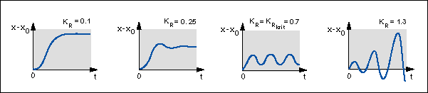
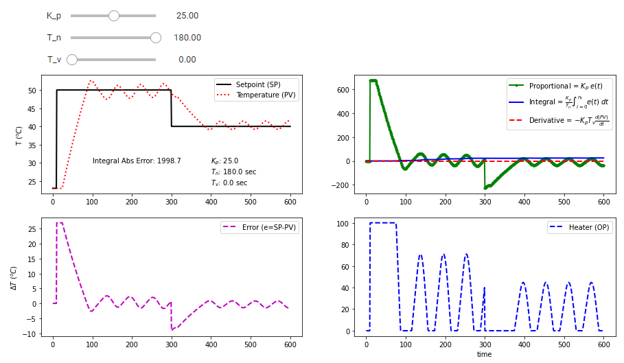

<!-- paginate: true -->


# 3.3 Regelverhalten

<!-- _class: title -->


---

## Orientierung – Einheit 9 von 14

<!-- _class: white -->

### Wo sind wir?

| Abgeschlossen | **Heute** | Als nächstes |
|---|---|---|
| Einheit 8: Regelungstechnik II | **Einheit 9: Regelungstechnik III** | Einheit 10: SPS – Grundlagen |

### Was haben wir bisher gelernt?

* Geschlossener Regelkreis; Regelkreisbegriffe
* P-, PI-, PID-Regler und ihre Wirkungen
* Konstantlichtregelung und CO₂-Regelung modelliert

### Wo wollen wir hin?

Wie gut ist unser Regler? Wir lernen Gütekriterien kennen und wenden die **Methode nach Ziegler-Nichols** zur Reglerauslegung an. Danach können wir fundiert entscheiden, welcher Regler für welche GA-Aufgabe geeignet ist.

---

## Lernziele – Einheit 9

* Gütekriterien (Überschwingen, Ausregelzeit, bleibende Abweichung) beschreiben
* Kritische Verstärkung und Periodendauer am Modell ermitteln
* Ziegler-Nichols-Methode auf einen Regelkreis anwenden
* Regler für typische GA-Aufgaben (Temperatur, CO₂, Licht) auswählen

### Aufgaben dieser Einheit

| Aufgabe | Inhalt |
|---------|--------|
| ✍️ 3_3_1 | Gütekriterien am Regelverlauf ablesen |
| ✍️ 3_3_2 | Kritische Verstärkung und Periodendauer bestimmen |
| ✍️ 3_3_3 | Ziegler-Nichols Reglerparameter berechnen |
| ✍️ 3_3_4 | P-Regler in Simulation testen |
| ✍️ 3_3_5 | Ziegler-Nichols in Simulation anwenden |
| 🤓 ✍️ 3_3_6 | Totzeit-System identifizieren |

---


## 🧠 PID-Regler


- **universellste** der klassischen Regler
-  Der PID-geregelte Kreis ist genau und sehr schnell, deshalb wird er bevorzugt in den **meisten Anwendungen** eingesetzt
* $u(t)=K_P \cdot e(t) + \frac{1}{T_N}\int_0^te(\tau)d\tau + T_v \frac{de(t)}{dt}$

---

### Umformung mit Vorhalt- und Nachstellzeit für PID-Regler:
- Neben der Darstellung mit Vorhalte- und  Nachhaltezeit findet sich auch häufig eine Darstellung mit Faktoren ($K$):
- $u(t)=K_P \cdot e(t) + \frac{1}{T_N}\int_0^te(\tau)d\tau + T_v \frac{de(t)}{dt}$

- $u(t)=K_P \cdot e(t) + K_I\int_0^te(\tau)d\tau + K_d \frac{de(t)}{dt}$

- $u(t)=K_P \cdot [e(t) + \frac{K_I}{K_P}\int_0^te(\tau)d\tau + \frac{K_D}{K_P} \frac{de(t)}{dt}]$


---

### Diskrete Implementierung als [Python-Klasse](https://colab.research.google.com/drive/1O8G7-Fn4ul-Wgq0B6-iOtqbzagVuC1Vz?usp=sharing)

```Python
class PIDRegler:
    def __init__(self, kp, ki, kd, dt):
        """
        Diskreter PID-Regler ohne Begrenzung
        :param kp: Proportionalbeiwert
        :param ki: Integralbeiwert
        :param kd: Differentialbeiwert
        :param dt: Abtastzeit
        """
        self.kp = kp
        self.ki = ki
        self.kd = kd
        self.dt = dt

        self.integral = 0
        self.last_error = 0

    def reset(self):
        """Setzt internen Zustand zurück."""
        self.integral = 0
        self.last_error = 0

    def update(self, setpoint, measurement):
        """
        Berechnet den PID-Reglerausgang
        :param setpoint: Sollwert
        :param measurement: Istwert
        :return: Steuersignal
        """
        error = setpoint - measurement

        # Integralanteil
        self.integral += error * self.dt

        # Differentialanteil
        derivative = (error - self.last_error) / self.dt

        # PID-Ausgabe
        output = self.kp * error + self.ki * self.integral + self.kd * derivative

        # Fehler für nächsten Schritt speichern
        self.last_error = error

        return output
```

---

## Systeme ohne zeitliche Verzögerung


* alle Systeme reagieren unmittelbar auf Veränderungen der Eingänge
* z.B. wird die Lichtstärke der Lampe ($u_r$) erhöht, erhöht sich die Helligkeit im Raum ($y$)


---

## Systeme mit zeitlicher Verzögerung


* z.B. mit Erhöhung des Durchfluss durch die Heizung ($u_r$) erwärmt sich der Raum nur langsam ($y$). Das Thermometer gibt die gemessene Temperatur ($y_m$) nur mit Verzögerung weiter

---

### Bestimmung des dynamischen Verhaltens





* Ziel der Regelungstechnik ist es ein erwünschtes Verhalten 
der Regelgröße $y$ zu erhalten
* Mathematische Beschreibung und Analyse
* Simulationsprogramme: z.B. [Matlab Simulink](https://de.mathworks.com/solutions/control-systems.html) oder [Scilab Xcos](https://www.scilab.org/scilab/features)

[Quelle](https://www.samsongroup.com/document/l102de.pdf)


---


### Fazit

* Zeitverhalten von Regelkreisen wird durch alle Komponenten (Zeitverhalten) und die Einstellung des Reglers (gewählte Parameter) beeinflusst
* komplexere Regelkreise müssen als Gesamtheit betrachtet werden
  * Beobachtung am echten System
  * Modellierung durch Vereinfachung (Regelungstechnik)
  * Kalibrierung am realen System

---

## ✍️ Aufgabe 3_3_1: Reaktion von PID und PT1 auf Einheitssprung

**Zu modellieren** (offener Regelkreis – kein Feedback):

- Eingang: Einheitssprung (Amplitude 1, Sprungzeitpunkt $t = 1\,\text{s}$)
- Regler: PID-Glied mit $K_P = 1$, $K_I = 0$, $K_D = 0$
- Strecke: PT1-Glied mit Zeitkonstante $\tau = 5\,\text{s}$
- Ausgang: Zeitverlauf-Plot von Eingang und Ausgang

**Aufgaben:**
- Variieren Sie $K_P$ und $\tau$: Wie beeinflusst die Zeitkonstante die Anstiegsgeschwindigkeit?
- Schalten Sie den I-Anteil zu ($K_I > 0$): Was verändert sich?

---

### 🤓 Die Transferfunktion des PT1-Gliedes ist:

  $$
  G(s) = \frac{1}{5s + 1}.
  $$

Eine Transferfunktion ist eine mathematische Beschreibung eines Systems im Frequenzbereich. Für uns ist jetzt die Form wichtig, die wir in Simulink verwenden können. Die Übertragungsfunktion eines PT1-Gliedes ist:
$$
G(s) = \frac{1}{\tau s + 1} = \frac{\text{Ausgangsgröße im Frequenzbereich}}{\text{Eingangsgröße im Frequenzbereich}}
$$

wobei wir $\tau$ als Zeitkonstante bezeichnen. Diese Zeitkonstante beschreibt, wie schnell das System auf eine Änderung reagiert. In unserem Fall ist $\tau = 5$ Sekunden. Zu diesem Zeitpunkt hat das System 63% der Endantwort erreicht. Nach 5 Zeitkonstanten ($t=5\tau$) hat das System 99% der Endantwort erreicht.


---

## ✍️ Aufgabe 3_3_2: Heizkurve einer Heizung (ohne Regelung)


---

### Situation

In einem ausgekühlten Gebäude wird die Raumtemperatur durch eine einfache **Heizkurve** gesteuert. Es gibt **keine Rückkopplung**, sondern nur eine fest definierte Beziehung zwischen der **Außentemperatur** und der **Vorlauftemperatur** der Heizung. Wir nehmen an dies passiert im Stellglied verzögert mittels PT1-Glied ($\tau=60 \text{ min}$). Die Vorlauftemperatur beeinflusst wiederum die **Raumtemperatur** in der Steuerstrecke, ebenfalls mit trägem Verhalten verzögert mittels PT1-Glied ($\tau=120 \text{ min}$ und eine proportionale Verstärkung von $0.35$).

---

### Die Zusammenhänge sind wie folgt:

Die [Heizkurve](https://de.wikipedia.org/wiki/Heizkurve) berechnet die Vorlauftemperatur $T_{\text{VL}}$ aus der Außentemperatur $T_{\text{außen}}$:

$$
T_{\text{VL}} = a \cdot (T_{\text{außen}}) + b
$$

mit:

- $a = -1{,}5$ (Steigung der Heizkurve)  
- $b = 60$ (Basisaufschlag)

Die **Raumtemperatur** $T_{\text{Raum}}$ reagiert auf die Vorlauftemperatur mit einem **PT1-Verhalten**:

$$
G(s) = \frac{1}{\tau s + 1}, \quad \tau = 120\ \text{min}
$$

---

### 🧩 Aufgabe 2a: Blockschaltbild zeichnen

Zeichnen Sie ein Blockschaltbild der Steuerkette mit folgenden Blöcken:

- Außentemperatur (Eingangsgröße)  
- Heizkurve (Stellglied)  
- Vorlauftemperatur (Stellgröße)  
- Raum (Steuerstrecke)  
- Raumtemperatur (zu steuernde Größe)  

> **Hinweis:** Es handelt sich um eine *Steuerung*, d. h. **keine Rückführung** der Raumtemperatur!

---

### ✍️ Aufgabe 3_3_2b: Simulation der Steuerkette

**Zu modellieren** (offene Steuerkette – keine Rückkopplung):

- Außentemperatur: Sprungblock, fällt nach 1000 min von $10°C$ auf $-5°C$
- Heizkurve: Proportionalglied ($a = -1{,}5$) plus Konstantblock ($b = 60$) → ergibt Vorlauftemperatur
- Stellglied: PT1-Glied mit $\tau = 60\,\text{min}$ (träge Reaktion der Heizanlage)
- Strecke: PT1-Glied mit $\tau = 120\,\text{min}$ und Verstärkung $0{,}35$ (Raumdynamik)
- Ausgang: Zeitverlauf-Plot von Außentemperatur, Vorlauftemperatur und Raumtemperatur


---

### 🔍 Beobachtung

- Visualisieren Sie die Raumtemperatur, Vorlauftemperatur und Außentemperatur im **Scope**.
- Wie entwickelt sich die Raumtemperatur über der Zeit?  
- Was passiert, wenn die Außentemperatur plötzlich sinkt?  
- Wie gut funktioniert die Steuerung?


---

## ✍️ Aufgabe 3_3_3: Temperaturregelung eines Raumes mit P-Regler

### Situation

Der Raum soll nun auf eine gewünschte Temperatur geregelt werden. Die **Regelgröße** ist die **Raumtemperatur** $T(t)$, die durch das Heizsystem geregelt wird.
Das gesamte Heizsystem wird nun als $PID$-Regler abgebildet. An dessen Eingang wird der Unterschied zwischen **Soll- und Ist-Temperatur** erfasst. Die Raum verhält sich, wie bisher (PT1 + Gain). Wir können die Raumtemperatur exakt und unmittelbar messen. 


---

### ✍️ Aufgabe 3_3_3a: Blockschaltbild zeichnen (Papier)

Zeichnen Sie ein **Blockschaltbild** des Regelkreises. Folgende Elemente sollen enthalten sein:

- Soll-Temperatur (Führungsgröße $w$)
- Summationsstelle → Regelabweichung $e(t) = w - T_{\text{Raum}}$
- Heizsystem als Regler (P-Regler zunächst)
- Strecke: Raum als PT1-Glied
- Rückführung: gemessene Raumtemperatur

---

### ✍️ Aufgabe 3_3_3b: Simulation des Regelkreises

**Zu modellieren** (geschlossener Regelkreis):

- Solltemperatur: Sprungblock von $15°C$ auf $20°C$ bei $t = 300\,\text{min}$
- Summationsstelle: $e = w - T_{\text{Raum}}$
- Regler: P-Regler mit $K_P = 3$ (I- und D-Anteil zunächst = 0)
- Strecke: PT1-Glied mit $\tau = 120\,\text{min}$, Verstärkung $0{,}35$
- Rückführung: direkter Pfad ohne Verzögerung
- Ausgang: Zeitverlauf von Sollwert $w$, Raumtemperatur und Regelabweichung $e$

**Beobachtungen:**
- Wird die Soll-Temperatur erreicht? Gibt es eine bleibende Regelabweichung?
- Was verändert sich bei größerem/kleinerem $K_P$?
- Was müsste man ändern, um die Regelabweichung vollständig zu eliminieren?

---

## Regelverlauf der verschiedenen Reglertypen im Zeitverlauf





* Reaktion auf Sprungfunktion im einfachen Regelkreis
* Deutlich wird die bleibende Regelabweichung des P-Reglers
* Das schnelle Verhalten der Regler mit D-Anteil


[Quelle](https://rn-wissen.de/wiki/index.php/Regelungstechnik)


---

## Kriterien zur Beurteilung eines Regelkreises


* Führungsverhalten bei Anregung mit Sprungfunktion:
* **Ausregelzeit** $t_\epsilon$: gibt den Zeitpunkt an, ab dem die Regelabweichung kleiner als eine vorgegebene Schranke $±\epsilon$ ist.
* Maximale **Überschwingweite** $e_{max}$: gibt den Betrag der maximalen Regelabweichung an, die nach dem erstmaligen Erreichen des Sollwertes  auftritt



[Quelle](https://srv.ifr.ing.tu-bs.de/static/files/lehre/vorlesungen/gdr/Skript_GdR.pdf)


---

### Regelfläche

- **Regelfläche**: Die Fläche zwischen Führungsgröße und Ist-Wert kann als Maß definiert werden. 
* Besonders sinnvoll ist die Beurteilung mittels der Regelfläche allerdings nur, wenn kein Überschwingen auftritt
* Alternativ z.B. Absolutwert des Integrals der Regelfläche




[Quelle](https://srv.ifr.ing.tu-bs.de/static/files/lehre/vorlesungen/gdr/Skript_GdR.pdf)

---

### Praktische Überlegungen

- Um eine gewünschtes Regelverhalten zu erreichen, muss ein geeigneter Regler mit den passenden Faktoren (z.B. Verstärkungsfaktor $K_P$) ausgewählt werden. 
- Hier lässt sich entweder ein **Modell der Regelstrecke** bilden. In der Praxis werden Regelkreise häufig durch **Ausprobieren** von Regler-Einstellungen eines PID-Regler kalibriert.

---


### 🤓 Praktische Überlegungen PID-Regler


[Quelle](https://de.wikipedia.org/wiki/Faustformelverfahren_(Automatisierungstechnik))

---


## ✍️ Aufgabe 3_3_4: Auswahl Reglerverhalten

- Welchen Reglerverlauf wünschen Sie sich für folgende Anwendungen
  - **Startoptimierung** der Raumtemperatur 
(unter Energieffizienzgesichtspunkten)
  - **Konstantlichtregelung** 
(Beleuchtung aus Komfortgesichtspunkten)
  - **Bewegungssteuerung** eines Laufroboters


[Quelle](https://de.wikipedia.org/wiki/Faustformelverfahren_(Automatisierungstechnik))

---

### Lösung

- Welchen Reglerverlauf wünschen Sie sich für folgende Anwendungen
- **Startoptimierung** der Raumtemperatur 
(unter Energieffizinzgesichtspunkten)
  * Langsam kein Überschwingen
- **Konstantlichtregelung** 
(Beleuchtung aus Komfortgesichtspunkten)
  * Langsam kein Überschwingen
- **Bewegungssteuerung** eines Laufroboters
  * Schnell, minimales Überschwingen


[Quelle](https://de.wikipedia.org/wiki/Faustformelverfahren_(Automatisierungstechnik))


---

## Beispiele

### Hardware PID-Regler



[Quelle](https://www.reichelt.at/at/de/pid-regler-quantrol-lc100-5--55-c-quan-lc100-d-24-p147710.html?PROVID=2807)


---

### Software Baustein PID-Regler





* Eingänge
  * `rW`: Sollwert
  * `rX`: Istwert
* Eingangsparameter
  * `rKp`: Proportionalfaktor Verstärkung
  * `tTi`: Integrierzeit [s]
  * `tTv`: Vorhaltezeit [s]
* Ausgänge
  * `rY`: Stellgröße
  * `rXW`: Regelabweichung


[Quelle](https://infosys.beckhoff.com/index.php?content=../content/1031/tf8000_tc3_hvac/4685059723.html&id=)

---

## Methode von Ziegler und Nichols

- **heuristisches** Verfahren zur Bestimmung von Reglerparametern
- nur für existierenden **stabile Anlagen** geeignet
- oder bei denen instabiles Verhalten keine Schäden verursachen kann

---

  

* Eigenschaft Regelstrecke und P-Regler
* dynamischen Eigenschaften hängen stark vom Verstärkungsfaktor ($K_P$ - im Bild $K_R$) des Gesamtsystems ab.
* Ab bestimmtem $K_P^{krit}$ beginnt die Regelgröße zu schwingen (Stabilitätsgrenze)


[Quelle](http://www.chemgapedia.de/vsengine/vlu/vsc/de/ch/7/tc/regelung/grundlagen/regelung_grundlagen.vlu/Page/vsc/de/ch/7/tc/regelung/grundlagen/regparam/regparam.vscml.html)

---

### Umformung mit Vorhalt- und Nachstellzeit für PID-Regler:
- Neben der Darstellung mit Vorhalte- und  Nachhaltezeit findet sich auch häufig eine Darstellung mit Faktoren ($K$):
- $u(t)=K_P \cdot e(t) + \frac{1}{T_N}\int_0^te(\tau)d\tau + T_v \frac{de(t)}{dt}$

- $u(t)=K_P \cdot e(t) + K_I\int_0^te(\tau)d\tau + K_d \frac{de(t)}{dt}$

- $u(t)=K_P \cdot [e(t) + \frac{K_I}{K_P}\int_0^te(\tau)d\tau + \frac{K_D}{K_P} \frac{de(t)}{dt}]$


---


### Vorgehen Methode von Ziegler und Nichols (I)

- **Voreinstellung** des Reglers als reiner P-Regler: 
  - $K_I=0$, $K_D=0$ 
  - bzw. $T_v=0$, $T_n=∞$

- $u(t)=K_P \cdot e(t) + K_I\int_0^te(\tau)d\tau + K_D \frac{de(t)}{dt}$
- $u(t)=K_P \cdot [e(t) + \frac{1}{T_N}\int_0^te(\tau)d\tau + T_v \frac{de(t)}{dt}]$


---

### Methode von Ziegler und Nichols (II)


* **Erhöhung von $K_P$** (beginnend mit kleinen Werten von $K_P$ ) bis zur **Stabilitätsgrenze** (die Regelgröße $x$ beginnt gleichmaßig mit konstanter Amplitude zu schwingen)
* **Ablesen von $K_P^{krit}$**
Messung der beobachtbaren Periodendauer $T^{krit}$
* **Berechnung der Reglerparameter** ($K_P$, $T_n$, $T_v$) entsprechend den folgenden Regeln:


[Quelle](Ziegler, John G., and Nathaniel B. Nichols. "Optimum settings for automatic controllers." trans. ASME 64.11 (1942))

---

### Einstellregeln nach Ziegler und Nichols (III)

 | | $K_P$         | $T_n$                | $T_v$              |                
|------------|-------------------|-----------------|-----------------|
| P-Regler   | $K_P = K_P^{krit} \cdot 0,5$  |              |             |
| PI-Regler  | $K_P$=$K_P^{krit} \cdot 0,45$ | $T_n=0,85 \cdot T^{krit}$ |              |
| PID-Regler | $K_P$=$K_P^{krit} \cdot 0,6$  | $T_n=0,5 \cdot T^{krit}$  | $T_v=0,12 \cdot T^{krit}$ |


---

## ✍️ Aufgabe 3_3_5: Ziegler-Nichols – Regler einstellen

Wenden Sie die Methode von Ziegler und Nichols an, um gute Regler-Parameter für die unten abgebildeten Systeme zu finden.

**Vorgehen:**
1. Erhöhen Sie $K_P$ schrittweise (bei $K_I = 0$, $K_D = 0$) bis das System dauerhaft schwingt → kritische Verstärkung $K_P^{krit}$
2. Lesen Sie die Schwingungsdauer $T^{krit}$ ab
3. Berechnen Sie die Regler-Parameter nach der Tabelle (vgl. Folie)



> 🤓 **Optional – Simulation:** Eine interaktive Simulation steht unter [Google Colab](https://colab.research.google.com/drive/1NHJB1KzMxQen6Ehki6Cs0nEQDZiuFb8t?usp=sharing) bereit. Nutzen Sie diese, um Ihre berechneten Parameter zu überprüfen.

---

## 🤓 ✍️ Aufgabe 3_3_6: Ziegler-Nichols auf PT1-Strecke

**Zu modellieren** (für die Simulation):

- Geschlossener Regelkreis mit PT1-Strecke ($\tau = 10\,\text{s}$, Verstärkung = 1) und Totzeit ($T_t = 2\,\text{s}$)
- Wenden Sie Ziegler-Nichols an: Erhöhen Sie $K_P$ bis zum Dauerschwingen

**Aufgabe:** Berechnen Sie die PID-Parameter und überprüfen Sie das Regelverhalten im Modell.

---

### ✔️ Lösung

<!-- _color: black -->

??? optional-class "💡 anzeigen"
    Erhöhen Sie $K_P$ schrittweise. Bei $K_P^{krit}$ beginnt das System zu schwingen. Lesen Sie $T^{krit}$ ab und berechnen Sie nach der Ziegler-Nichols-Tabelle.