<!-- paginate: true -->

# 4.1 Speicherprogrammierbare Steuerung (SPS)


---

## Schalter vs. Taster

<!-- _class: white -->

* Ein Schalter behält seine Stellung nach dem Betätigen bei.
   
* Ein Taster springt in die Ausgangslage  
  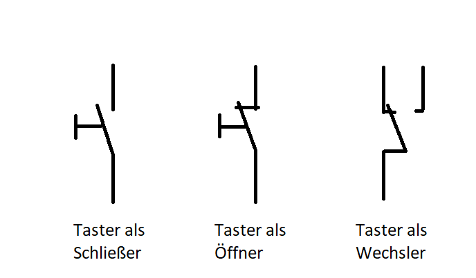

---

### Wahrheitstabelle

- Annahme: Schalter mit zwei Zuständen

  | S1 | S2 | H1 |
  |---|---|---|
  | 0 | 0 | 1 |
  | 0 | 1 | 0 |
  | 1 | 0 | 0 |
  | 1 | 1 | 1 |

- $H1 = \lnot (S1 \oplus S2)$


---

### Zustandsdiagramm einer Wechselschaltung


<!-- _class: white -->


---

```
stateDiagram-v2
    s1: Licht aus - Schalter 1 = off, Schalter = 2 off
    s2: Licht an - Schalter 1 = on, Schalter 2 = off
    s3: Licht an - Schalter 1 = off, Schalter 2 = on
    s4: Licht aus - Schalter 1 = on, Schalter 2 = on


    s1--> s2: Schalter 1 = on
    s2--> s1: Schalter 1 = off

    s1--> s3: Schalter 2 = on
    s3--> s1: Schalter 2 = off

    s4--> s3: Schalter 1 = off 
    s3--> s4: Schalter 1 = on 

    s2 --> s4: Schalter 2 = on
    s4 --> s2: Schalter 2 = off
```

[Quelle](https://mermaid.live/)


---

### Lösung "Industrie 2.0"


* S1, S2: Schalter mit zwei Zuständen
* H1: Glühlampe

---

#### Wechselschaltung im Gebäude


[Quelle](https://cdn-reichelt.de/documents/datenblatt/TIPP/Elektroinstallation(Kopp).pdf)

---


#### Direkte verbindungsprogrammierte Steuerung

* Steuerung auf Basis des Stomkreises (z.B. Wechselschaltung bei Lichtschalter)
* Überall liegt die hohe (ggf. **gefährliche**) **Spannung** an
* **Verdrahtungsaufwand** (z.B. Kreuzschaltung für mehr als 2 Schalter)
* die **Fehlersuche** sehr mühselig
* Bestimmte sicherheitsrelevante Funktionen (z. B. Not-Aus)

---


### Lösung "Industrie 2.1"

* Entkopplung von Steuerstrom und Laststromkreis durch Relais oder Schütz
* Steuerstromkreis hat i.d.R. niedrigere Spannung


---

### Verbindungsprogrammierte Steuerung mit logischen Komponenten


* In diesem Fall wird ein Stromstoßschalter verbaut: Bei jeder Betätigung eines der Taster (S) wird der Zustand von K1 gewechselt
* Zwei oder mehrere Schalter S können parallel geschaltet werden
* Verringertet Verdrahtungsaufwand, erhöhte Wartbarkeit

---

- `A1`-`A2`: Schließen des Steuerkreises löst eine Sprungfunktion in der Spannung und Strom aus (Flanke)
*  `1`-`2` wird geschlossen

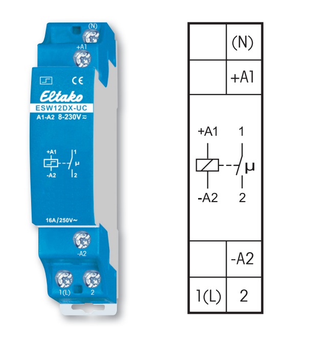

[Quelle](https://de.wikipedia.org/wiki/Liste_der_Schaltzeichen_(Elektrik/Elektronik), https://www.eltako.com/fileadmin/downloads/de/Gesamtkatalog/Eltako_Gesamtkatalog_Kap11_low_res.pdf)

---

- `A1`-`A2`: Schließen des Steuerkreises löst eine Sprungfunktion in der Spannung und Strom aus (Flanke)
*- `1`-`2` wird geschlossen

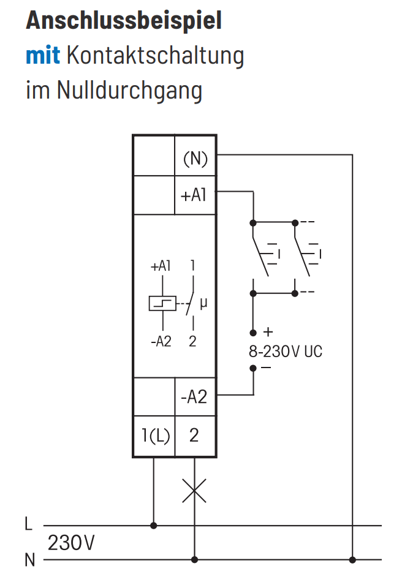

[Quelle](https://de.wikipedia.org/wiki/Liste_der_Schaltzeichen_(Elektrik/Elektronik), https://www.eltako.com/fileadmin/downloads/de/Gesamtkatalog/Eltako_Gesamtkatalog_Kap11_low_res.pdf)


---

#### Stromstoßschalter


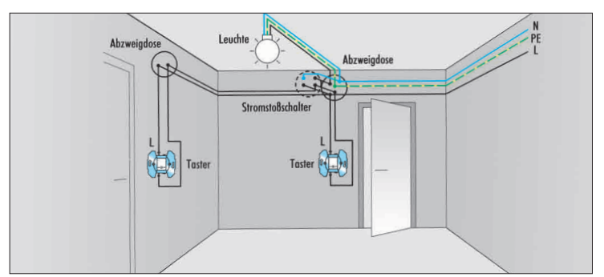

[Quelle](https://cdn-reichelt.de/documents/datenblatt/TIPP/Elektroinstallation(Kopp).pdf)


---

### Lösung Industrie 3.0


* Logikbausteine werden durch Computer mit Ein- (`bIn1`) und Ausgängen (`bOut1`) ersetzt
* Computer erfasst, ob an Eingängen eine Spannung anliegt
* Computer setzt Spannung auf Ausgänge
```Python
def taster(s1,s2,status_lampe):
  if (s1 or s1):
    return not(status_lampe)
  else:
    return status_lampe
    
bOut1 = stromstossschalter(s1,s2,status_lampe)
```

---

#### Aufbau SPS - Loxone Mini Server

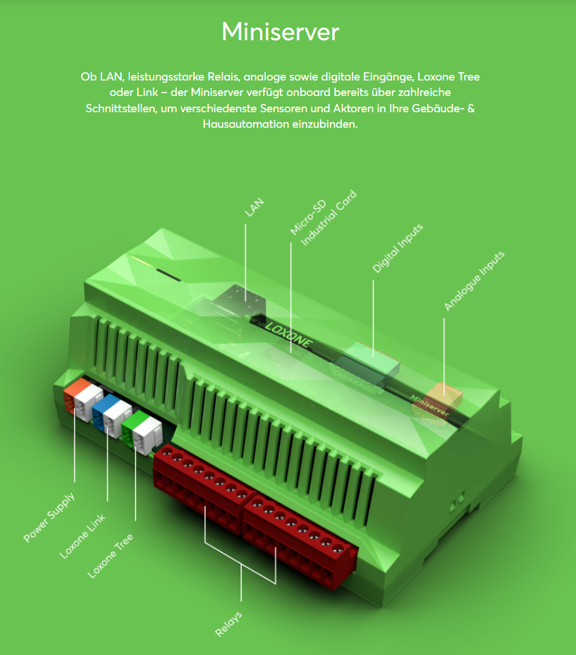

[Quelle](https://www.loxone.com/dede/produkte/gebaeude-und-hausautomation-miniserver/)

---

#### Aufbau SPS - Siemens Logo

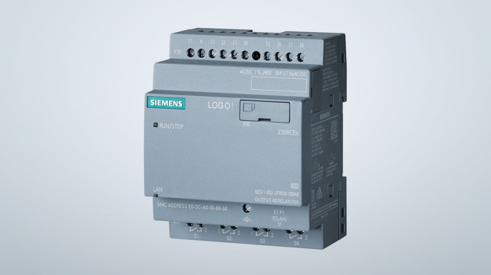


---

## Aufbau SPS - am Beispiel Beckhoff 


---

### Aufbau einer SPS

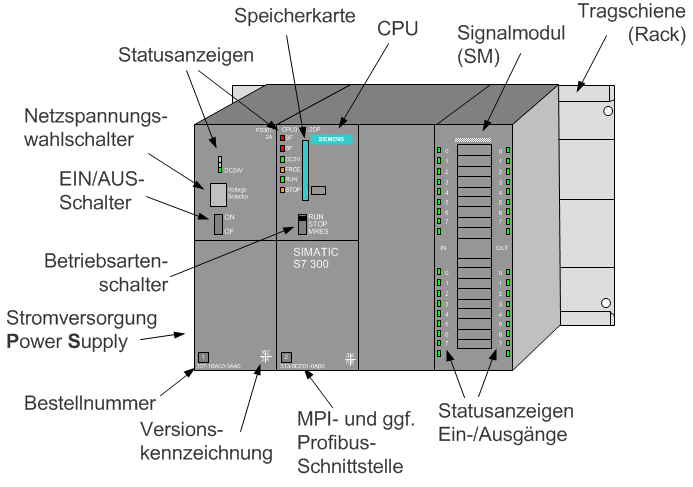

[Quelle](https://www.xplore-dna.net/mod/page/view.php?id=294)

- Anbringung meist an Hutschiene (**modular**)
- Rechen- und Speichereinheit oft Anbindung an Bus-System 
- Ein oder mehrere Signalmodule
  - Empfang Sensordaten (**Eingänge**)
  - Versand Steuerbefehle (**Ausgänge**)

---

### Aufbau SPS


- Eingang / Ausgang: Schaltende Verbindungen zwischen 0 und 24V 
- Stromversorgung
  - Powerkontakt 24V (L+): SPS arbeitet wegen Bauraum und Sicherheit mit 24V Gleichstrom
  - Powerkontakt 0V (L-): Masse als 0 Potential für die Schaltung definiert
  - Powerkontakt PE: Schutzleiter mit Potential-Erde, 0V sollte auf PE gelegt werden
- Ausgänge `+` und `-` zur weiterverteilung


---

#### Industrie 3.0 Zentrale SPS -Speicherprogrammierbare Steuerung


* die  Steuerungsfunktionen sind als **Programme** in einem Speicher enthalten
    * **Flexibilität**: Einfacher Austausch von Programmen
    * Mehrere Funktionen **auf einem Gerät**
    * Geringer **Platzbedarf**, Höhere Zuverlässigkeit, Geringere Kosten
    * **Vernetzung** mit anderen Systemen, Fernwartung
    * **Fehlerdiagnose**


[Quelle](https://www.xplore-dna.net/mod/page/view.php?id=294)

---

### Abgrenzung von SPS und Bussystemen

* ⚠️ Die folgende Darstellung vereinfacht und stilisiert 
* in der Praxis sind Mischformen üblich

---

#### SPS als zentrales System


* SPS als Single Point of Failure
* häufig sternförmige Verkabelung
* Ein- und Ausgänge der SPS sind digital (nur zwei Zustände) oder analog

[Quelle](https://de.wikipedia.org/wiki/Nervensystem#)

---

### Dezentrales System

* Viele Mikrocontroller übernehmen die Steuerungsaufgaben
* kein Single Point of Failure
* andere Topologien als Sternform möglich
* Übermittlung von Seriellen Telegrammen auf der Busleitung


[Quelle](https://quizizz.com/admin/quiz/605a064f172bf7001b1ea35d/tintenfische)

---

#### Steuerung mit Bus-System


* Zentrale SPS wird durch mehrere **dezentrale Contoller** ersetzt
* Diese kommunizieren über Telegramme in einem standardtisierten Protokoll miteinander 
* Anstelle von binären Schaltinformationen werden Bitfolgen übertragen
* Mischformen sind möglich!

---

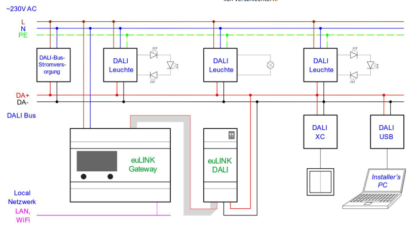

---

## Speicherprogrammierbare Steuerung (SPS)

---

### Messkette: Elektronische Sicht der Steuerung

* **Sensoren** wandeln den Zustand eines Prozesses in ein elektrisches Signal um
* Die Steuerung und Regelung erfolgt elektronisch oder digital oder in einem rechnergestützten Gerät (**Steuerungseinheit**)
* Aktoren werden zur Beeinflussung von Systemen eingesetzt

<!-- _class: white -->


[Quelle](https://mermaid.live/edit#pako:eNp1UMtqw0AM_BWj0wZsQpo-wIeAwZdCQqGGFtrtQXhle4m9a2QtpYT8Tf-kP9ZNg6GlRCdpNBpJc4DaG4Icmt6_1x2yJNtH7ZIY1qxeK3KT57ckyzaxvlJPxJN8ffKeeBExa9aqWJbZMzrTz9C1qoQCcXDtRNZ1ZOXcuFHlsvjLvf2veKeKvXhezEesV6q0rRWMQ8m9G4NcXjPPXD7ht9hDkJMapDAQD2hNtOFwktAgHQ2kIY-poQZDLxq0O0YqBvHVh6shFw6UQhgNCpUWW8YB8gb7KaJkbPxhd7b2x-EURnQv3s-c4zdLjX9a)

---

#### Steuerungseinheit: Aufbau einer SPS


[Quelle](https://www.xplore-dna.net/mod/page/view.php?id=294)

- Anbringung meist an Hutschiene (**modular**)
- Rechen- und Speichereinheit oft Anbindung an Bus-System 
- Ein oder mehrere Signalmodule
  - Empfang Sensordaten (**Eingänge**)
  - Versand Steuerbefehle (**Ausgänge**)

---

#### Aufbau SPS


---

#### Digitale Ein- und Ausgänge

* kennt nur zwei Zustände (`True`/`False`)
* Abgebildet über Spannungslevel oder Stromstärke

<!-- _class: white -->


[Quelle](https://mermaid.live/edit#pako:eNp1UMtqw0AM_BWj0wZsQpo-wIeAwZdCQqGGFtrtQXhle4m9a2QtpYT8Tf-kP9ZNg6GlRCdpNBpJc4DaG4Icmt6_1x2yJNtH7ZIY1qxeK3KT57ckyzaxvlJPxJN8ffKeeBExa9aqWJbZMzrTz9C1qoQCcXDtRNZ1ZOXcuFHlsvjLvf2veKeKvXhezEesV6q0rRWMQ8m9G4NcXjPPXD7ht9hDkJMapDAQD2hNtOFwktAgHQ2kIY-poQZDLxq0O0YqBvHVh6shFw6UQhgNCpUWW8YB8gb7KaJkbPxhd7b2x-EURnQv3s-c4zdLjX9a)

---

### Adressierung 

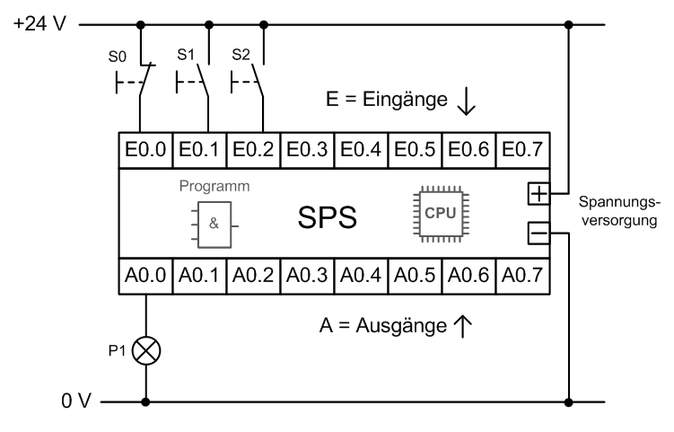
[Quelle](https://www.xplore-dna.net/mod/page/view.php?id=294)

* Digitale Ein- und Ausgänge schalten und erfassen Spannungen bis 24V (i.d.R.)
* Jeder digitale Ein- und Ausgang wird durch ein Bit repräsentiert (`True`: 24V, `False`: 0V)
* **Eingänge** werden mit **E** bzw. **I** (Input) bezeichnet (```E0.1```)
* **Ausgänge** mit **A** bzw. **O/Q** (Output) ```A0.2```

---


#### Symbolische Adressierung

- Zur besseren Verständlichkeit sollten bei der Programmierung sinnvolle Variablennamen eingeführt werden, da diese leichter zu interpretieren sind als z.B.```Q0.1```.


- z.B. für ein Automatiklicht
  - **```bInAnwesenheit```** Für Wert des digitalen Sensors für Anwesenheit an ```E0.0```
  - **```bInDunkelheit```** Für Wert des digitalen Sensors für Dunkelheit an ```E0.1```
  - **```bOutLicht```** Für digitalen Schalter für Licht an ```A0.1```
  * Das **```b```** steht für einen **binären** (digitalen) Ein- oder Ausgang
  * Das **```In```** / **```Out```** für Ein- oder Ausgänge

---


## Digitale Ein- und Ausgänge

<!-- _class: white -->


[Quelle](https://mermaid.live/edit#pako:eNp1UMtqw0AM_BWj0wZsQpo-wIeAwZdCQqGGFtrtQXhle4m9a2QtpYT8Tf-kP9ZNg6GlRCdpNBpJc4DaG4Icmt6_1x2yJNtH7ZIY1qxeK3KT57ckyzaxvlJPxJN8ffKeeBExa9aqWJbZMzrTz9C1qoQCcXDtRNZ1ZOXcuFHlsvjLvf2veKeKvXhezEesV6q0rRWMQ8m9G4NcXjPPXD7ht9hDkJMapDAQD2hNtOFwktAgHQ2kIY-poQZDLxq0O0YqBvHVh6shFw6UQhgNCpUWW8YB8gb7KaJkbPxhd7b2x-EURnQv3s-c4zdLjX9a)

---

### Digitaler Eingang


- Kennt nur Signal oder kein Signal (**Boolean**)
  - z.B. **Taster**
  - z.B. **Fensterkontakt**


---

## EVA-Prinzip
<!-- _class: white -->


[Quelle](https://upload.wikimedia.org/wikipedia/commons/f/f2/EVA-Prinzip.svg)

---

### Zyklische Verarbeitung

<!-- class: white -->


* Das EVA-Prinzip wird in regelmäßigen Zyklen durchlaufen
  * Einlesen der Eingänge
  * Durchführen der Verarbeitung
  * Ausgabe der Ausgänge
* Typische Zykluszeiten liegen zwischen einer und zehn Millisekunden

---

### Verarbeitungseinheit - CPU


[Quelle](Beckhoff Automation)

---

## Analoge Ein- und Ausgänge


[Quelle](https://mermaid.live/edit#pako:eNp1UMtqw0AM_BWj0wZsQpo-wIeAwZdCQqGGFtrtQXhle4m9a2QtpYT8Tf-kP9ZNg6GlRCdpNBpJc4DaG4Icmt6_1x2yJNtH7ZIY1qxeK3KT57ckyzaxvlJPxJN8ffKeeBExa9aqWJbZMzrTz9C1qoQCcXDtRNZ1ZOXcuFHlsvjLvf2veKeKvXhezEesV6q0rRWMQ8m9G4NcXjPPXD7ht9hDkJMapDAQD2hNtOFwktAgHQ2kIY-poQZDLxq0O0YqBvHVh6shFw6UQhgNCpUWW8YB8gb7KaJkbPxhd7b2x-EURnQv3s-c4zdLjX9a)

---

### Analog-Digital Wandler


* **Vorsicht**: Auch analoge Signale werden beim Eingang in die Verarbeitungseinheit digitalisiert
* Die Auflösung analoger Ein- und Ausgänge wird in Bit angegeben


---

### Analoger Eingang


* bei vielen Anwendungsfällen sind stetige Werte von Interesse:
* z.B. Temperatur, Helligkeit, etc.

---

#### Passive Analoge Signale

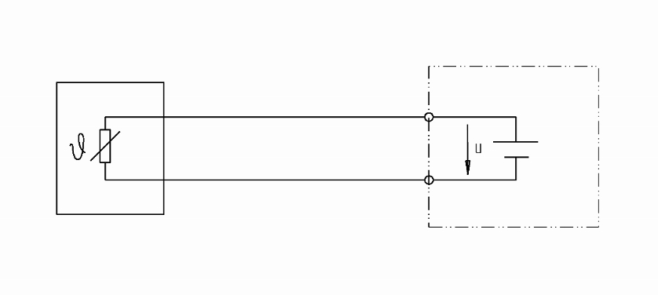


* Nutzen Temperaturabhängigkeit eines Widerstands
* und Ohmsches Gesetz: $U=RI$
* Bei gleicher angelegter Spannung, wird temperaturabhängig ein anderer Strom gemessen


[Quelle](https://blog.wika.de/know-how/pt100-in-2-3-oder-4-leiter-schaltung/)

---

##### z.B. PT-Widerstände

* Platin hat ein relativ lineares Verhalten

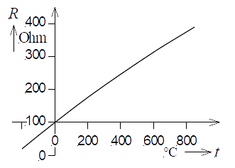

* $U = 24 V$
* $I_m=0.16 A$
* $R=\frac{U}{I_m}=150 \Omega$
* $T \approx 100°C$
* Sollten wir den PT-Widerstand direkt mit $24 V$ beaufschlagen?

[Quelle](Kennlinie eines Pt100 (100 $\Omega$ bei 0 °C))

---

### Einsatzgebiete von Verstärkern


[Quelle](https://mermaid.live/edit#pako:eNp1UMtqw0AM_BWj0wZsQpo-wIeAwZdCQqGGFtrtQXhle4m9a2QtpYT8Tf-kP9ZNg6GlRCdpNBpJc4DaG4Icmt6_1x2yJNtH7ZIY1qxeK3KT57ckyzaxvlJPxJN8ffKeeBExa9aqWJbZMzrTz9C1qoQCcXDtRNZ1ZOXcuFHlsvjLvf2veKeKvXhezEesV6q0rRWMQ8m9G4NcXjPPXD7ht9hDkJMapDAQD2hNtOFwktAgHQ2kIY-poQZDLxq0O0YqBvHVh6shFw6UQhgNCpUWW8YB8gb7KaJkbPxhd7b2x-EURnQv3s-c4zdLjX9a)

* Linearisierung des Signals
* Anpassung des Signals auf definierten Ausgangsbereich 
(z.B. 0 .. 20mA, 0 .. 10V)
* Extra Kosten
* Sensorspezifisch 

---

### Aktive Sensoren

* Integriert Sensor und Verstärker
* Sensor wird mit Spannung versorgt (i.d.R. 24V/DC)
* Sensor übersetzt physikalische Größe in ein Ausgangssignal $E$
* Skalierung häufig linear oder sogar proportional
  * $U(E_v)=E_0 + K_p \cdot E_v$
  * $U(E_v)=\frac{10 V}{100.000 Lux} \cdot E_v$


---

#### Anschluss aktiver Sensoren

* Spannungsversorgung über `GND`und `24 V`
* Ausgang `LUX` wird mit analogem Eingang der SPS verbunden


---


---

### Auswahl Analoger Eingänge

* Spannungssignal: z.B. $0...10$ bzw. $-10...10$ V
  * günstig
  * leicht zu messen (z.B. mit Multimeter)
* Stromschnittstelle: z.B. 4...20 mA
  * auch bei langen Leitungen
  * unanfälliger gegen Störungen
  * Erkennen von Drahtbruch (0 A)
* PT-Eingänge: 
  Spezielle Eingänge zum Anschluss von PT-Widerständen

[Quelle](https://www.beckhoff.com/de-at/produkte/i-o/ethercat-klemmen/el3xxx-analog-eingang/)

---

#### 🤓 Anzahl der Leiter

- Es gibt Sensoren mit 2, 3, 4 Leitern
- Zunehmende Messgenauigkeit (Einfluss des Leiterwiderstands kann herausgerechnet werden)


---

#### Signalformen


* live zero lässt Kabelbruch erkennen
[Quelle](https://download.beckhoff.com/download/document/Application_Notes/DK9221-1111-0059.pdf)

---

#### 🤓 Single-Ended vs. Differential


* Single-Ended: alle Sensoren liegen auf dem gleichen V- Potential (nur ein Kabel zurück)
* Differential: jeder Sensor hat sein eigenes V- Potential (weniger Störanfällig)

[Quelle](https://infosys.beckhoff.com/index.php?content=../content/1031/ep3356/1668832651.html&id=)

---

#### Analog-Digital-Wandlung


---

#### Analog-Digital-Wandlung


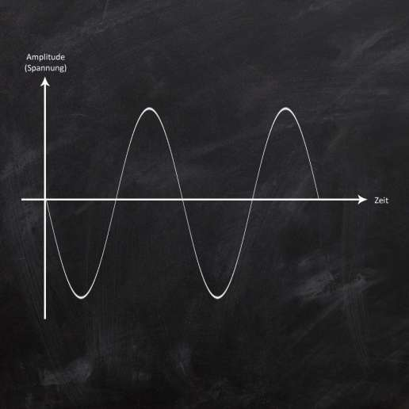

* Signalform:
  * Spannung
  * bipolar
* SPS kann nur diskrete Werte darstellen
  * Wie hoch ist die Zykluszeit der SPS?
  * Wie viel Bit stehen zur Speicherung eines Wertes zu Verfügung?

[Quelle](https://chrishoermann.at/analog-digital-wandlung-digital-analog-wandlung/)

---

#### Abtastung (Sample rate)


* i.d.R. Zykluszeit der SPS
* ein Wert pro Zyklus z.B. 10 ms


| T in ms | Beleuchtungsstärke in Lux |
|---|---|
| 0 | 0| 
| 10 | 50000 |  

[Quelle](https://chrishoermann.at/analog-digital-wandlung-digital-analog-wandlung/)

---

#### Digitalisierung (resolution)

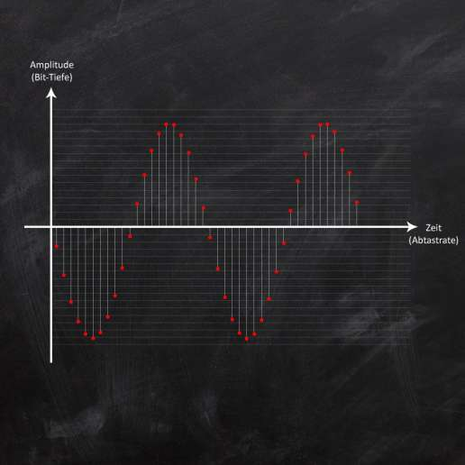

[Quelle](https://chrishoermann.at/analog-digital-wandlung-digital-analog-wandlung/)

* Wie viele Spannungswerte kann der Eingang unterscheiden (resolution)
* Angabe auf der Klemme: 12 Bit verteilt auf $-0-..10$ V
* $2^{12} = 4096$ Zustände


---


| T in ms | Beleuchtungsstärke in Lux am Sensor | Spannung in V nach Verstärker | Eingangswert als Integer am A/D-Wandler | Beleuchtungsstärke in Lux in der Steuerungseinheit |
|---|---|---|---|---|
| 0 | 0 | 0 | 0 | 0 |
| 10 | 50000 | 5 |2047 | 50000 |


[Quelle](https://mermaid.live/edit#pako:eNp1UMtqw0AM_BWj0wZsQpo-wIeAwZdCQqGGFtrtQXhle4m9a2QtpYT8Tf-kP9ZNg6GlRCdpNBpJc4DaG4Icmt6_1x2yJNtH7ZIY1qxeK3KT57ckyzaxvlJPxJN8ffKeeBExa9aqWJbZMzrTz9C1qoQCcXDtRNZ1ZOXcuFHlsvjLvf2veKeKvXhezEesV6q0rRWMQ8m9G4NcXjPPXD7ht9hDkJMapDAQD2hNtOFwktAgHQ2kIY-poQZDLxq0O0YqBvHVh6shFw6UQhgNCpUWW8YB8gb7KaJkbPxhd7b2x-EURnQv3s-c4zdLjX9a)

---


####  Digitalsignal

* Nach der Umwandlung im Speicher der SPS


[Quelle](https://chrishoermann.at/analog-digital-wandlung-digital-analog-wandlung/)


| T in ms | Beleuchtungsstärke in Lux | 
|---|---|
| 0 | 0 | 
| 10 | 50000 |


---

## ✍️ Aufgabe 4_1_1: Anbindung eines Helligkeitssensors

- Ein Helligkeitssensor bildet die gemessenen Helligkeitswerte über ein analoges Signal $0...10 \text{ V}$ ab
- Die Eingangsschnittstelle verfügt über eine Auflösung von 12 Bit
  - Wie viele diskrete Helligkeitsstufen gibt es?
  - Was ist der kleinste Spannungsunterschied, der unterschieden werden kann?


---

###  ✔️ Lösung

* $2^{12}=4096$ diskrete Helligkeitsstufen
* $\Delta U_{min}=\frac{U_{max}-U_{min}}{n}=\frac{10-0 \text{ V}}{4096}=2.44 \text{ mV}$

---

### Analoger Eingang

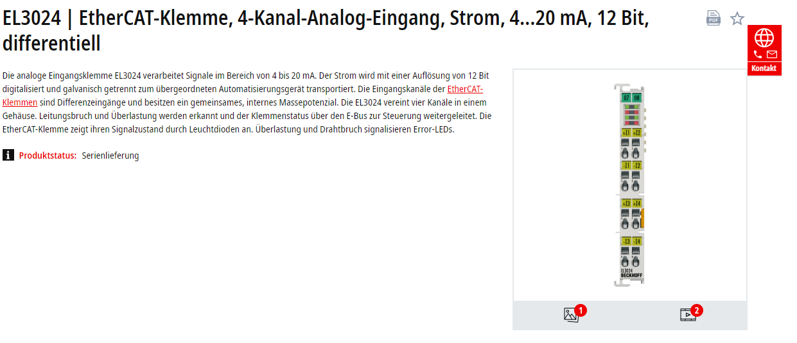

- Signal ist eine Stromstärke (**4...20mA**)
- Signal wird in **12 Bit** digitalisiert
- z.B. **Lichtsensor**


---

### Beispiele für analoge und digitale Signale

|         | Eingang          | Ausgang         |
|---------|------------------|-----------------|
| Digital | Taster, ...           | Kontrollleuchte, ... |
| Analog  | Temperaturfühler, ... | Elektromotor, ...   |


---

## ✍️ Aufgabe 4_1_2:

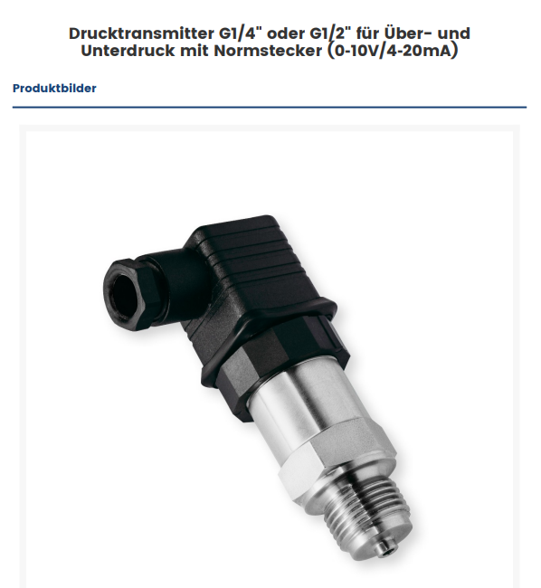

- In einer Lüftungsanlage soll ein Drucksensor (Druckbereich 0-10 bar) mit einem verbaut werden
- Wichtig ist hierbei, dass ein Drahtbruch sofort erkannt wird
* Welches Sensorsignal wählen Sie?
* Welche Klemme wählen Sie?
* Was ist die kleinste Druckdifferenz, die Sie an der SPS erfassen können?
* Zeichen Sie, wie sie den Sensor anschließen würden

[Quelle](https://www.sensorshop24.de/productpdf/download/file/id/1009/name/Drucktransmitter_G14%2522_oder_G12%2522_f%25C3%25BCr_%25C3%259Cber-_und_Unterdruck_mit_Normstecker_%25280%25E2%2580%259110V4%25E2%2580%259120mA%2529.pdf/)

---

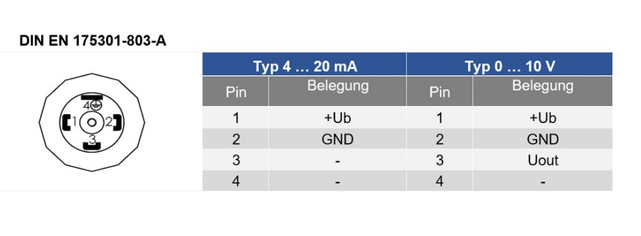

---

### Übersicht Klemmen

[Link](https://www.beckhoff.com/de-at/produkte/i-o/ethercat-klemmen/el3xxx-analog-eingang/)


---

### ✔️ Lösung

* mit einem Stromsignal (4...20mA) kann ein Drahtbruch sicher erkannt werden
* Entsprechende Klemme z.B. EL3021 | EtherCAT-Klemme, 1-Kanal-Analog-Eingang, Strom, 4…20 mA, 12 Bit, differentiell
  * Single-Ended wäre ebenfalls möglich
  * mehre Eingänge wäre ebenfalls möglich

---


* kleinster möglicher Druckunterschied
* 12 Bit sind $2^{12}=4096$ mögliche Zustände
* Der Messbereich liegt zwischen 0-10 bar
* $\Delta P_{min}=\frac{P_{max}-P_{min}}{n}=\frac{10-0 bar}{4096}=2.44 \text{ mbar}$


---

#### EL3051 

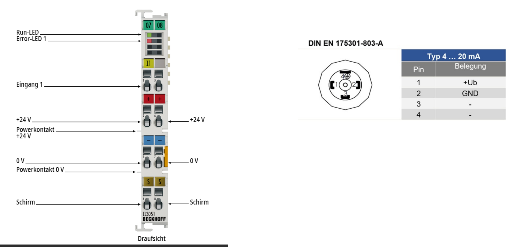

---

#### Lösung EL3051 - single-ended


---


[Quelle](https://download.beckhoff.com/download/Document/io/ethercat-terminals/el30xxde.pdf)

---


#### Lösung EL3021 - differentiell


---


[Quelle](https://download.beckhoff.com/download/Document/io/ethercat-terminals/el30xxde.pdf)

---

### Ausgänge


* Für Digitale und Analoge Ausgänge gelten sie selben Prinzipien

