<!-- paginate: true -->


# 4.2 SPS Programmier-Sprachen nach IEC 61131-3

---

## Allgemeiner Aufbau eines SPS-Projekts

- Die Folgenden Inhalte orientieren sich an der Software Twincat 3 von Beckhoff
- Die Inhalte sind aber auch auf andere SPS-Programmiersysteme übertragbar
- Da die Twincat 3 Software tief ins System eingreift, wird nicht empfohlen diese auf den privaten Rechnern zu installieren
- Die Software ist aber auf den Rechnern im Labor installiert
- Als Alternative, kann die Software [OpenPLC Editor]() empfohlen werden

---

### Projektstruktur

- Ein Projekt besteht aus einem oder mehreren Programmen, welche in einer ` POU` (Program Organization Unit) zusammengefasst werden


<!-- _class: white -->


---

#### Am Beispiel TwinCat

* **Entwicklungsumgebung** der Firma Beckhoff Automation für SPS Steuerungslogiken
* Kann auf der Steuerung oder anderem PC ausgeführt werden
* Links sieht man die Gesamtübersicht über das Projekt (**Projektexplorer**)
* Twincat bietet ein Fester für die Variablendeklaration (rechts oben) und ein Fester für den sonstigen Code an (rechts unten)
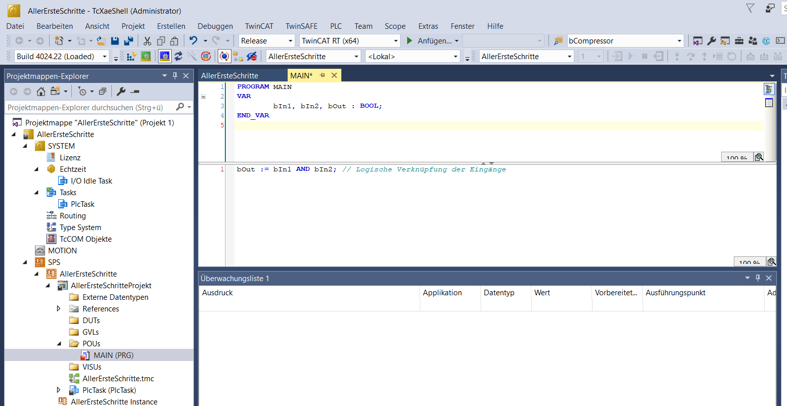


---

#### Programmablauf in Verarbeitungseinheit


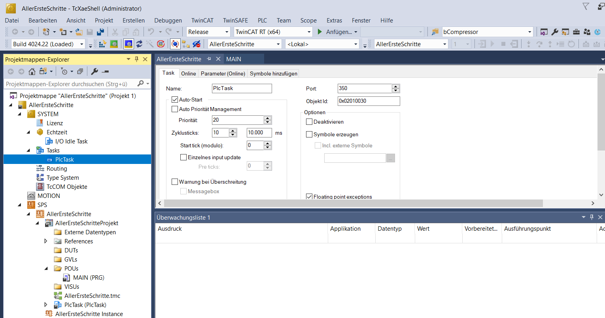

* Nach dem EVA-Prinzip überwacht die SPS in regelmäßigen Abständen (**Zykluszeit**) die Werte der Eingänge und führt das
* **Hauptprogramm** ```(.../POUs/MAIN (PRG))``` aus 

---

#### Hauptprogramm (Main-Program)

* Entsprechend der `code.py` bei Circuit Python gibt es eine `MAIN`-Programm
* Währen wir im `code.py` einen `while`-Loop erstellen mussten, wir der Inhalt der `MAIN` immer wieder automatisch in der **Zykluszeit** der SPS ausgeführt

---


- Das Hauptprogramm wird in einer **Entwicklungsumgebung** geschrieben
- Hierzu kommen **verschiedene Programmiersprachen** zum Einsatz
- Nach Prüfung und Fehlerbeseitigung erstellt der **Compiler** dann den Programmcode, der **auf die Steuerung geladen** werden kann.
- liegt dann auf dem Speicher der SPS und kann verändert werden


---

### Programmiersprachen für SPS

- fünf Programmiersprachen (nach IEC 61131)
  * **Strukturierter Text**, ST (engl. Structured Text, ST) ähnlich [Pascal](https://de.wikipedia.org/wiki/Pascal_(Programmiersprache))
  * Anweisungsliste, AWL (engl. Instruction List, IL)
  * **Kontaktplan**, KOP (engl. Ladder Diagram, LD)
  * **Funktionsbausteinsprache**, FBS oder FUP genannt (engl. Function Block Diagram, FBD)
  * Ablaufsprache, AS (engl. Sequential Function Chart, SFC)

---

### Programm

- **[Programm](https://infosys.beckhoff.com/index.php?content=../content/1031/tc3_plc_intro/2530274187.html&id=)** liefert bei der Ausführung einen oder mehrere Werte und speichert diese in Variablen 
- Alle **Werte bleiben** nach einer Ausführung des Programms bis zur nächsten Ausführung erhalten
- z.B. der Status der Lampe im Hauptprogramm bis zur Ausführung des nächsten Zyklus


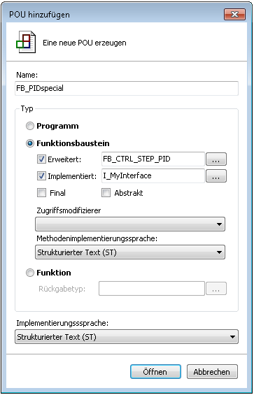


---

## ✍️ Aufgabe 4_2_1: Automatik Licht

> Anwendungsfall:  Eine smarte Lichtsteuerung soll eine Leuchte immer anschalten, wenn es dunkel ist und eine Anwesenheit erkannt wird

- Für unsere smarte Lichtsteuerung könnte das für eine Programmierung mittels **Strukturiertem Text** wie folgt aussehen, wenn wir statt analogen digitale Eingänge verwenden:

```SPS
PROGRAM MAIN // Main Programm wird definiert

VAR // Variablen werden deklariert
  bInAnwesenheit1 : BOOL; // der Variable für Anwesenheit. True = Anwesend
  bInDunkelheit2 : BOOL; // der Variable für Anwesenheit. True = Dunkel
  bOutLicht1 : BOOL; // der Variable für Licht. True = An
END_VAR

bOutLicht1 := bInAnwesenheit1 AND bInDunkelheit2; // Logische Verknüpfung (nur wenn beides erfüllt ist, geht das Licht an)
```

* Welche Unterschiede zu Python fallen Ihnen auf?

---


---

### ✔️ Lösung

```SPS
PROGRAM MAIN // Main Programm wird definiert

VAR // Variablen werden deklariert
  bInAnwesenheit1 : BOOL; // der Variable für Anwesenheit. True = Anwesend
  bInDunkelheit2 : BOOL; // der Variable für Anwesenheit. True = Dunkel
  bOutLicht1 : BOOL; // der Variable für Licht. True = An
END_VAR

bOutLicht1 := bInAnwesenheit1 AND bInDunkelheit2; // Logische Verknüpfung (nur wenn beides erfüllt ist, geht das Licht an)
```
* Kommentare mit  **```//```** eingeführt
* Zeilen werden mit **```;```** abgeschlossen
* Variablen und Ihr Typ müssen **deklariert** werden 
(Name und Datentyp werden festgelegt): ```<Variablenname>:<Typ>```
* Der Wert der Variable wird über **```:=```** gesetzt:
```<Variablenname>:=<Variablenwert>```

---

#### Wichtige Datentypen

- `BOOL`: Boolean
- `INT`: Integer (nur positiv)
  - z.B. Bit-Werte der Eingangsklemmen
- `UNIT`: Unsigned  Integer (nur positiv)
- `REAL`: Gleitkommazahl
  - z.B. Interne Darstellung der physikalischen Gößen
- [weitere](https://infosys.beckhoff.com/index.php?content=../content/1031/tc3_plc_intro/2529388939.html&id=)


---

## IF-Anweisungen 

- IF-Anweisung kann man eine Bedingung **abprüfen** und **abhängig** von dieser Bedingung ein Anweisungen **ausführen**

```
IF <Boolescher_Ausdruck1> THEN
  <IF_Anweisungen>
{ELSIF <Boolescher_Ausdruck2> THEN
  <ELSIF_Anweisungen1>
.
.
ELSIF <Boolescher_Ausdruck n> THEN
  <ELSIF_Anweisungen n-1>
ELSE
  <ELSE_Anweisungen>}
END_IF;
```

###### Ausdrücke in den ```{}``` sind optional

---

### Beispiel


```PASCAL
IF temp<17 THEN 
heizung_an := TRUE;
ELSE 
heizung_an := FALSE;
END_IF;
```

* Keine Einrückungen wie bei Python erforderlich

---

## ✍️ Aufgabe 4_2_2: Wechselschaltung


* Wie können wir dafür sorgen, dass das Licht den Zustand wechselt, wenn einer der beiden Schalter betätigt wird?

---

### ✔️ Lösung

```PASCAL
IF (bInS1 OR bInS2) THEN
  bOut1 = not(bOut1)
else:
  bOut1 = bOut1
```

---

## Funktionsbausteine

* **[Funktionsbaustein](https://infosys.beckhoff.com/index.php?content=../content/1031/tc3_plc_intro/2530279563.html&id=)** **liefert einen oder mehrere Werte**. 
* Die Werte der Ausgabevariablen und der internen Variablen bleiben bis zur nächsten Ausführung erhalten (lokalen Variablen werden nicht gelöscht)
* Vergleichbar eine Klasse, mit einer Methode, die immer wieder aufgerufen wird
* **Vorsicht**: bei mehrmaligem Aufruf mit denselben Eingabevariablen werden so nicht unbedingt dieselben Ausgabewerte geliefert vgl. Hysterese)


---

#### Funktionsbaustein

* Zunächst wird eine Blaupause (Klasse) erstellt, sie beschreibt, welche Ein-, Ausgaben, und Zwischenwerte ein Funktionsbaustein enthält (Variablen) und welche Berechnungen diese ausführt
* Im Hauptprogramm (`MAIN`) können eine oder mehrere Objekte des Bausteins instanziiert werden (als Variable deklariert werden)
* Auch bei der Arbeit mit Funktionsbausteinen gilt das EVA-Prinzip


### Warum gibt es beides - Funktionen und Funktionsbausteine?

- z.B. Anwendung von Funktionsbaustein für verschiedene Räume
- nach 100 Bewegungen soll gelüftet werden
- würde mit Funktion eine globale Variable pro Raum benötigen


---

## ✍️ Aufgabe 4_2_3: Funktionsbaustein Counter

* Schreiben Sie eine Klasse für einen Funktionsbaustein, der eine Zählervariable um eins erhöht und den aktuellen Wert zurückgibt
* Zudem soll der Zähler zurückgesetzt werden können

```Python
class Counter:
  def __init__(self):
    self.count = 0
```
    
---

### ✔️ Lösung

```Python
class Counter:
  def __init__(self):
    self.count = 0

  def increment(self):
    self.count =  self.count + 1
    return self.count

  def reset(self):
    self.count = 0
    return self.count

c = Counter()
c.increment()
c.increment()
print(c.increment())
```

---

### Verwendung von Programm-Organisationseinheiten

* **Programme**
  * Direkte Verbindung zu Ein- und Ausgabeeinheiten
  * **Grundgerüst** ist das Hauptprogramm `MAIN`, welches zyklisch ausgeführt wird und angibt welche Funktionen und Funktionsbausteine aufgerufen werden
* **Funktion** 
  * **Wiederverwendbare** Elemente
  * Es gibt viele Standardfunktionen
  * ohne internen Speicher
* **Funktionsbausteine**
  * **Komplexer** as Funktionen
  * Können Variablen erhalten
  * z.B. Zähler

---

## Strukturierter Text

---

### Anweisungen

- Wie in anderen höheren Programmiersprachen gibt es **Anweisungen** die den Text **strukturieren** 

- **Zuweisung**: Auf der linken Seite einer Zuweisung **```:=```** steht ein Operand (Variable, Adresse), dem der Wert des Ausdrucks auf der rechten Seite zugewiesen wird:

```
Var1 := Var2 * 10;
```

---

### Aufruf von Funktionen und Funktionsblöcken

- Aufruf eines Funktionsblocks: Aufruf durch Namen der Funktion oder Instanz des Funktionsblocks und in Klammer die gewünschten Werte der Parameter
  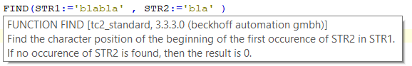
- hier wird die Funktion ```FIND``` aufgerufen, um ```STR2``` in ```STR1``` zu finden
-  Die übergebenen Parameter sind beide Zeichenketten / Strings
- Funktionen haben einen fixen Rückgabetyp (z.B. die Position als INT)


---

### Globale und lokale Variablen

- Wichtiges Prinzip in der Programmierung
- Verhindert unbeabsichtigte Eingriffe
- Nur **globale Variablen** sind von **überall** sichtbar
- **lokale Variablen**, können z.B. **innerhalb** eines Programms oder Funkion definiert werden und sind nur darin sichtbar
- Alle Variablen sind zunächst nur innerhalb der jeweiligen POU sichtbar

---

### Arrays - Datenfelder (Listen gleichen Datentyps)

```
/ Deklaration
VAR
    aCounter : ARRAY[0..9] OF INT;
END_VAR

//Deklaration mit Initialisierung:

aCounter : ARRAY[0..9] OF INT := [0, 10, 20, 30, 40, 50, 60, 70, 80, 90];

//Datenzugriff 1:

//Der lokalen Variablen wird der Wert 20 zugewiesen.

nLocalVariable := aCounter[2];
```

---

### Weitere Anweisungen

* `Return` wird genutzt, um einen Baustein zu verlassen
* `EXIT`-Anweisung** wenn diese in einer FOR-, WHILE- oder REPEAT-Schleife vorkommt, dann wird die innerste Schleife beendet, ungeachtet der Abbruchbedingung.
* **Aufruf einer Fuktion**: Analog zu Python werden der Funktionsname genannt und in Klammern die Attribute übergeben (z.B. ```SQRT(IN := 9)```)


---

## Funktionsplan

### 🎯 Lernziele

Nach dieser Einheit sind Sie in der Lage dazu
- einfache binäre Funktionspläne lesen und aufbauen
- einfache Bausteine (Vergleiche, Mathematische Operatoren) interpretieren
- die Wirkweise von Zeitbausteinen skizzieren und diese passenden Anwendungsfällen zuzuordnen

---


### (Binärer) Funktionsplan (FUP)

* Grafische Programmiersprache, nach **EVA**-Prinzip (links nach rechts)
* Jeder Baustein ist ein **Funktionsbaustein** (Funktionsblock)
* **Bausteine** mit Symbolen z.B.
  * ```&``` für *logisches und* ($\land$)
  * ```>=1``` für *logisches oder* ($\lor$)

* **Links** gehen die **Eingänge** in die Bausteine.  **Ergebnisse** werden **rechts** weitergegeben.
* **Variablen** die **gesetzt** werden stehen **über** den Bausteinen (vgl. Spule bei Kontaktplan, hier ```A0.1```) 

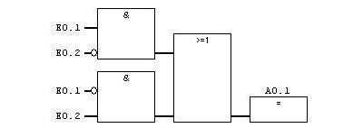

[Quelle](https://www.sps-lehrgang.de/zusammengesetzte-verknuepfungen/)


---

#### Negieren von Ein- und Ausgängen

* Bei binären Ein- und Ausgängen kann der Wert durch einen **Kreis negiert** werden
* ``` TRUE``` wird zu ``` FALSE```
* ``` FALSE``` wird zu ``` TRUE```
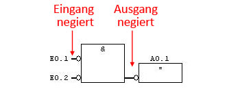

[Quelle](https://www.sps-lehrgang.de/zusammengesetzte-verknuepfungen/)

---

## ✍️ Aufgabe 4_2_4: Binärer Funktionsplan

  ```
  E0.1 = TRUE
  E0.2 = TRUE
  ```

- Was ist ```A0.1``` ?

---

### ✔️ Lösung 

* `E0.1` wird negiert
* `E0.2` wird negiert
* `not(E0.1) and not(E0.2) = False` wird negiert
* Ausgang des `&`-Bausteins wird negiert
* `A0.1 = True` 

--- 


[Quelle](https://www.sps-lehrgang.de/zusammengesetzte-verknuepfungen/)

---


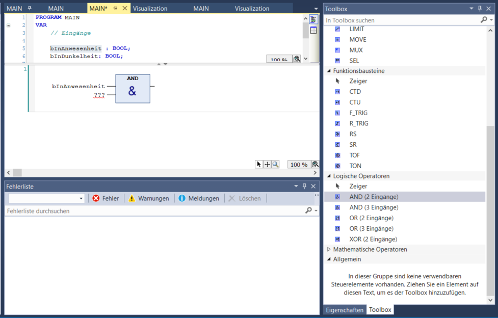

---

### Zeitbausteine

* Ein guter **Bewegungsmelder** würde nicht sofort erlöschen, wenn keine Bewegung mehr registriert wird, sondern für ein **Nachleuchten der Lampen** sorgen (Nachlauf)
* Die könnte über das Zählen der Zyklus-Zeiten gesteuert werden, hierzu müssten aber alle Zyklen auf jeder Steuerung gleich lang sein
* Stattdessen können **spezielle Bausteine**, wie z.B. TOF (Timer off), Ausschaltverzögerung eingesetzt werden.

---

#### TOF: Ausschaltverzögerung (Timer Off)

> verlängert Signal nach Wechsel auf Off (False)

- ```IN```  binärer Eingang
- ```PT```  Gesetzte Ausschaltverzögerung
- ```Q```   binärer Ausgang mit Impuls
- ```ET```  Vergangene Zeit seit Erkennen des Ende des Eingangsignals 


[Quelle](https://www.xplore-dna.net/mod/page/view.php?id=168)

---


## ✍️ Aufgabe 4_2_5 Erweiterung um Nachlauf von einer Sekunde

<!-- _class: white -->


---

### ✔️ Lösung

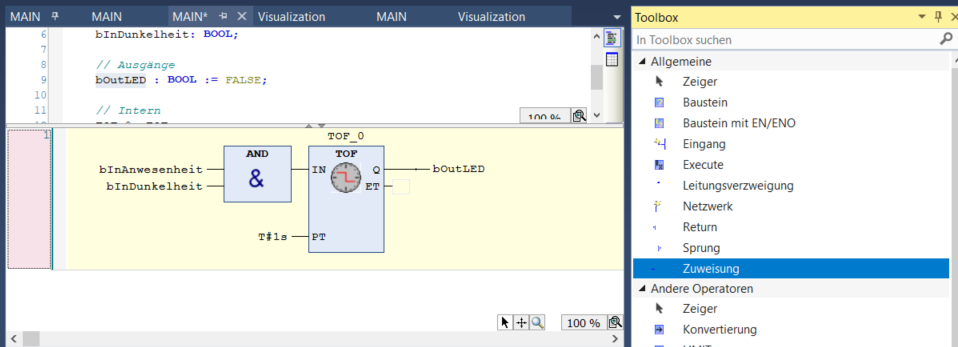

---

#### Impulsbildung

> wandelt positive Flanke in Impuls mit fixer Länge

- ```IN```  binärer Eingang
- ```PT```  Gesetzte Impulslänge
- ```Q```   binärer Ausgang mit Impuls
- ```ET```  Vergangene Zeit seit Impulsstart (Elapsed Time)

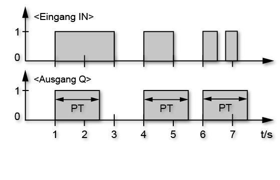

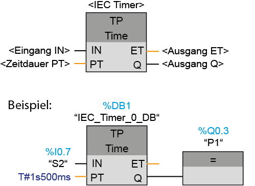


[Quelle](https://www.xplore-dna.net/mod/page/view.php?id=166)

---

#### TON: Einschaltverzögerung

> verzögerte Aktivierung, sofern Mindestdauer erreicht

- ```IN```  binärer Eingang
- ```PT```  Gesetzte Einschaltverzögerung
- ```Q```   binärer Ausgang mit Impuls
- ```ET```  Vergangene Zeit seit Erkennen des Eingangsignals 


[Quelle](https://www.xplore-dna.net/mod/page/view.php?id=167)

---

#### TONR: Zeitakkumulator

> Gibt aufsummierte Zeit sobald Mindestwert erreicht

- ```ET```  Zeit bis zur Ausgabe
- ```PT```  Maximalzeit bis Ausgabe
- ```IN```  binärer Start-Eingang
- ```R```  binärer Reset-Eingang
- ```Q```   binärer Ausgang zeigt wann ```PT``` erreicht


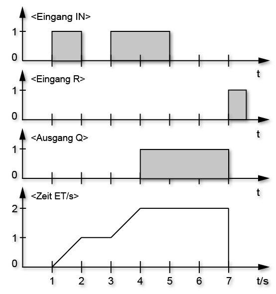


[Quelle](https://www.xplore-dna.net/mod/page/view.php?id=168)


---

## ✍️ Aufgabe 2_4_6: Zeitbausteine

- Zeichnen Sie das Ausgangssignal 
  - einer Ausschaltverzögerung TOF mit ```PT = 2s```
  - eines Impulsgenerators TP mit ```PT = 0.5s```


---

### ✔️ Lösung

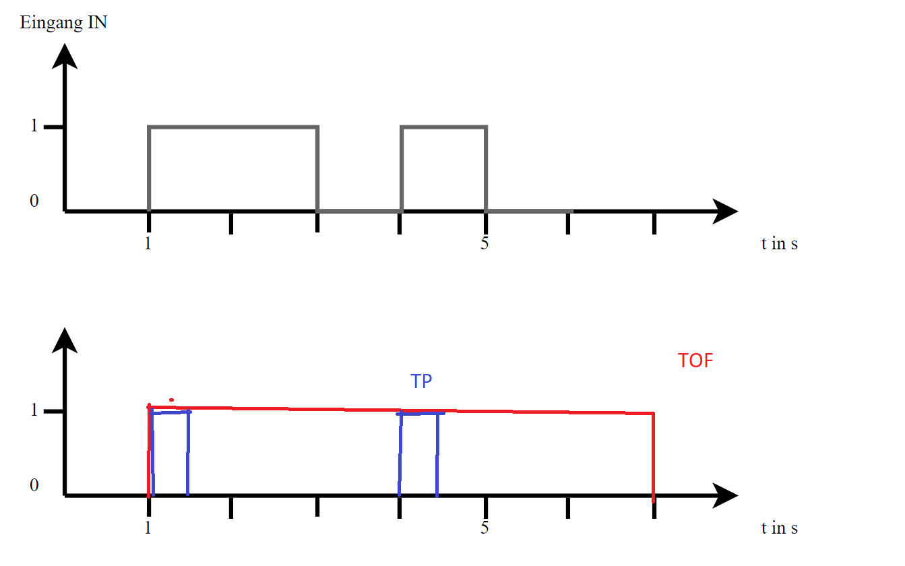

---

### Zähler

> Zählt Flanken (Änderungen `False` auf `True`)

- ```CU```  binärer Eingang an dem die Flanken  gezählt werden (Count Up)
- ```R```  Reset-Eingang um Zähler zurückzusetzen
- ```PV```   Oberer Grenzwert
- ```CV```  Ausgang der hoch zählt (Counter Value)
- ```Q```  Zählerstatus im Vergleich mit ```PV```  

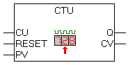


---

### Weitere Bausteine

---

#### Trigger-Bausteine

- Erkennen steigende oder fallende Flanken
- `F_TRIG` für fallende Flanken
- `R_TRIG` für steigende (rising) Flanken

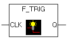


---


- Anstelle von zurücksetzen der Taster (Bild)
- Szenenwechsel wird nur bei Aktivierung eines Tasters aktiviert


---

#### Speicherbausteine

>Zuweisungen bleiben i.d.R. nur solange bestehen
wie die Eingänge auf den vorherigen Block wirken.


<!-- class: white --->
---


- Zuweisungen bleiben i.d.R. nur solange wie die Eingänge auf den vorherigen Block wirken.
- Speicherglieder und Flipflops **erhalten den Wert**, auch wenn die Setz-Bedingung nicht mehr gegeben ist.

- **Ausgang setzen im FUP**
  - Hier wird der Wert von ```A0.1``` gesetzt (S für set)


---

#### SR-Flipflop


* der Ausgang ```Q``` wird abhängig vom Signalzustand der Eingänge ```S```(et) und ```R```(eset) **dauerhaft** gesetzt
* Wenn der Signalzustand am Eingang ```S=1``` und am Eingang ```R=0```ist, wird ```Q=1``` gesetzt. 
* ```S=0``` und am Eingang ```R=1```ist, wird auf ```Q=0``` zurück gesetzt. 
* bei SR-Flipfops **dominiert** Eingang **```S```** den Eingang **```R```**. Bei ```1``` an beiden Eingängen wird der Operanden auf "1" gesetzt

| S | R | Q |
|---|---|---|
| 0 | 0 | Q |
| 1 | 0 | 1 |
| 0 | 1 | 0 |
| 1 | 1 | 1 |

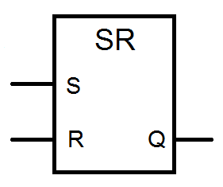


[Quelle](https://www.xplore-dna.net/mod/page/view.php?id=173)

---


#### RS-Flipflop


- Der Eingang **```R``` dominiert** den Eingang ```S```. Bei einem Signalzustand ```1``` an beiden Eingängen wird der Signalzustand des angegebenen Operanden auf "0" zurückgesetzt.

| S | R | Q |
|---|---|---|
| 0 | 0 | Q |
| 1 | 0 | 1 |
| 0 | 1 | 0 |
| 1 | 1 | **0** |


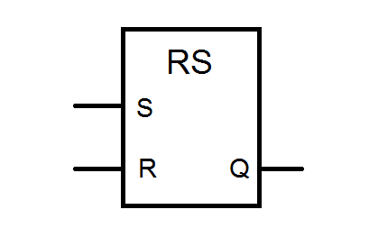

[Quelle](https://www.xplore-dna.net/mod/page/view.php?id=1038)


---

#### Speicherbausteine und Variablen

- Ist das Programm in der Lage interne Variablen zu speichern, kann der Einsatz von Speicherbausteinen durch Zuweisungen ersetzt werden


---


## Zusammenfassung und Ausblick

* komplexe neuartige Probleme lassen sich häufig am besten über strukturierten Text lösen
* für viele bestehende Anwendungsfälle stehen in verschiedenen Softwarelösungen bereits Funktionen und Funktionsblöcke bereit

---

### Automatiklicht


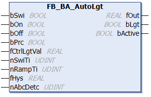

- `bSwi`: Eine steigende Flanke an diesem Eingang schaltet den Baustein und das Licht wechselweise ein und aus.
- `bOn`: Eine steigende Flanke an diesem Eingang schaltet den Baustein und das Licht gezielt ein.
- `bOff`: Eine steigende Flanke an diesem Eingang schaltet das Licht und die Gesamtfunktion des Bausteins aus.

- `fOut`: Steuerausgang für Lichtaktoren (0…100 %).


[Quelle](https://infosys.beckhoff.com/index.php?content=../content/1031/tf8040_tc3_buildingautomation/9255011851.html&id=7218420269355608175)


---

### PID-Regler


- `fSetpointValue`: Sollwert der Regelgröße
- `fActualValue`: Istwert der Regelgröße

* `fOut`: Ausgang des PID-Glieds

* Was fehlt noch?
  * `fKp`: Reglerbeiwert
  * `tTn`: Nachstellzeit
  * `tTv`: Vorhaltzeit
  * in `stParams`


[Quelle](https://infosys.beckhoff.com/index.php?content=../content/1031/tf4100_tc3_controller_toolbox/245435787.html&id=)

