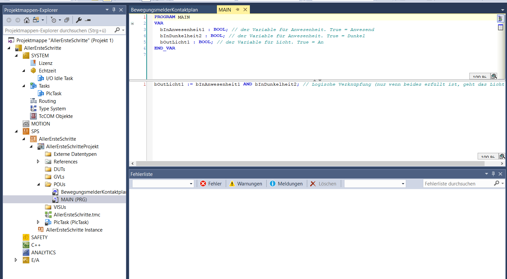
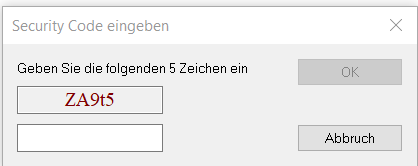
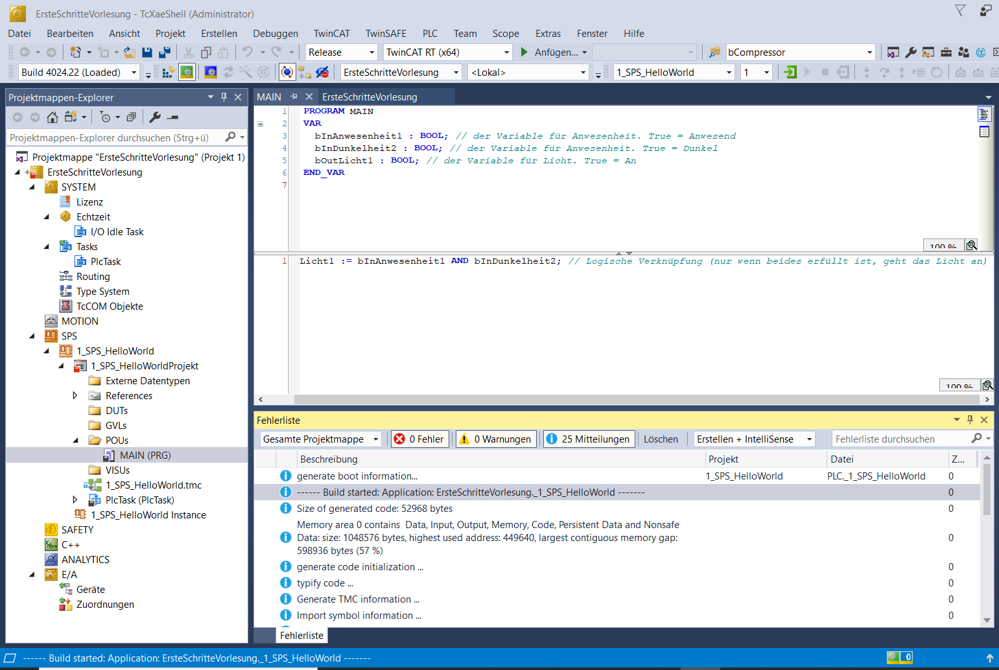
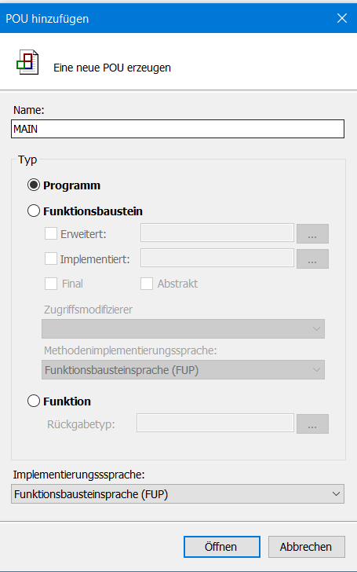
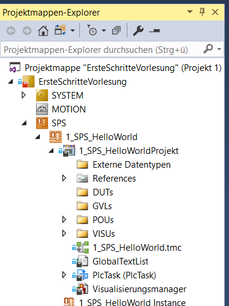
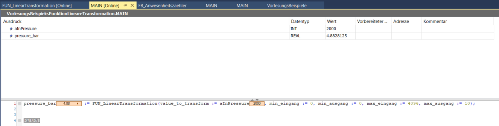

<!-- paginate: true -->


# 🤓 Appendix: 4.3 Twincat

---


## Installation Twincat und Erstes Projekt

### 🎯 Lernziele
Nach dieser Einheit sind Sie in der Lage dazu
- eine Testinstanz von TwinCat 3 auf ihrem Rechner auszuführen
- ein einfaches Hallo World Programm mit Strukturiertem Text schreiben und ausführen

---

### Installation Twincat und Erstes Projekt

- [Download](https://www.beckhoff.com/de-at/support/downloadfinder/software-und-tools/) und Installation von TwinCat
- [Handbuch](https://download.beckhoff.com/download/document/automation/twincat3/TC3_Installation_DE.pdf)
- [Quelle](https://www.youtube.com/watch?v=GOFUsWc61Hk) und gutes Video zum nachmachen
- Problemlösung, wenn Code nicht ausführbar
  - [AdsError: 4132 + "HyperV" Problem](https://www.sps-forum.de/threads/twincat-3-4024-10-visual-studio-2019-xar-adserror-4132-hyperv-problem.101584/)
  - `win8settick.bat` im TwinCat Ordner als Admin ausführen


---

### Was ist TwinCat


- Software für SPS Entwicklungen und Bertrieb
- **Entwicklungsumgebung**: Programm zum Entwickeln von Programmen
- **Laufzeitumgebung**: Überwachnung von kompilierten Programmen 
  - Code wird auf SPS geladen und dort ausgeführt
  - Alternativ kann zum Testen eine **virutelle SPS** auf dem Entwicklungs-PC gestartet werden

---

## Ausführen des Programms

- TwinCat wird in der Regel auf einem PC gestartet
- Teilweise sind auch kleine PCs direkt auf die Hutschiene mit der SPS installiert


---

### Entwicklungsumgebung


- Zunächst startet TwiNCat im Entwicklungsmodus
- Erkennbar am blauen Zahnrad

---

### Anlegen eines neuen Projektes


- Neues Projekt anlegen
- kein SPS-Projekt

---


### Anlegen eines neuen SPS-Projektes


- Innerhalb des Projektes wird ein neues SPS-Projekt angelegt
- Rechtsklick auf SPS (Neues Element hinzufügen)
- Nutzen der Vorlage (Standard PLC Project)

---

### Öffnen des Main Programms


- Relevant ist das MAIN-Programm unter /POU/ 
- Dieses besteht aus einem Variablen (oben)
- und einem Code-Editor (mitte)

---

### Variablen Deklarieren


- Variablen können in Tabellen- und Textueller Ansicht angezeigt werden (rechts oben)


---

### Wichtige Datentypen

- `BOOL`: Boolean
- `INT`: Integer (nur positiv)
  - z.B. Bit-Werte der Eingangsklemmen
- `UNIT`: Unsigned  Integer (nur positiv)
- `REAL`: Gleitkommazahl
  - z.B. Interne Darstellung der physikalischen Gößen
- [weitere](https://infosys.beckhoff.com/index.php?content=../content/1031/tc3_plc_intro/2529388939.html&id=)


---

### Zyklische Ausführung


* SPS hat eine feste Zykluszeit
* In dieser wir das Main-Programm wiederholt ausgeführt
* Variablenzustände werden erhalten

---

### Zyklische Ausführung

* Ablauf
  * Eingänge werden gelesen
  * Main-Programm wird ausgeführt
  * Ausgänge werden geschrieben
* Änderungen nach dem Einlesen, werden erst im nächsten Zyklus erfasst

---

## ✍️ Aufgabe 4_3_1: Blinker

Schreiben Sie ein Main Programm, das den Zustand einer LED alle 100 Zyklen wechselt.

Tipps:
  - `LedStatus := NOT(LedStatus)` zum wechseln (toggeln)
  - Variable, die die Zyklen zählt
  - `IF`-Anweisung


---

### Aufgabe

- Programmieren Sie einen einfachen Bewegungsmelder basierend auf drei Variablen:
	- ```bInAnwesenheit1 : BOOL;``` // der Variable für Anwesenheit. True = Anwesend
	- ```bInDunkelheit2 : BOOL;``` // der Variable für Anwesenheit. True = Dunkel
	- ```bOutLicht1 : BOOL```; // der Variable für Licht. True = An

---

### Lösung

Wir möchten einen Bewegungsmelder implementieren, 
welcher nur bei Dunkelheit und Bewegung ein Licht anschaltet.

Hierzu definieren wir die Variablen als:
```
PROGRAM MAIN        // Beschreibung an welcher Stelle die Variablen gültig sein sollen
VAR                 // Beginn der Variablen Deklaration
  bInAnwesenheit1 : BOOL; // der Variable für Anwesenheit. True = Anwesend
  bInDunkelheit2 : BOOL; // der Variable für Anwesenheit. True = Dunkel
  bOutLicht1 : BOOL; // der Variable für Licht. True = An
END_VAR
```


---

### Implementieren der Steuerungslogik

- Das Licht soll nur angehen, wenn ```bInAnwesenheit1``` und ```bInDunkelheit2``` auf ```True``` stehen.
- Standardmäßig ist das Main-Programm Strukturierter Text. 
Dies kann aber geändert werden.

* Lösung
  ```
  bOutLicht1 := bInAnwesenheit1 AND bInDunkelheit2; 
  // Logische Verknüpfung (nur wenn beides erfüllt ist, geht das Licht an)
  ```` 

---

### Befüllen des Main Programmes



- fertiges Programm, welches in jedem Zyklus ausgeführt wird

---

### Kompilieren


- Zum Ausführen muss der Code kompiliert werden
- Hierzu dient das Symbol mit der kleinen blauen Treppe

---

## Testlizenz


- Die Testlizenz läuft 7 Tage und kann immer wieder erneuert werden
- Im Produktivbetrieb wäre regelmäßiges Erneuern sehr störend

---

### Testlizenz aktivieren und SPS auswählen




---

### TwinCat startet im Laufzeitmodus



- Nun kann der Code grundlegend ausgeführt werden
- Erkennbar am grünen Zahnrad unten rechts

---

### Auf SPS einloggen und Programm in Speicher laden

- Als nächstes loggen wir uns auf eine SPS ein, um den Code dorthin zu übertragen 
- In unserem Fall ist das die virtuelle SPS auf unserem Rechner
- Meldung, das Programm bisher noch nicht besteht
  


---

### Werte in SPS schreiben

- Um nun Werte zu setzen (die nicht von außen vorgegeben sind), 
gibt es folgendes Vorgehen
  - "Vorbereiteten Wert" eingeben
  - "Wert schreiben", um den Wert zu setzen
  
 
---


### Zyklus-Schritt umsetzen

- Damit die Änderung auf im Ergebnis wirksam wird, 
können wir manuell einen Zyklusschritt durchführen (blauer Kreispfeil)
- Hierdurch wird das Main-Programm einmal mit
den neuen Werten ausgeführt
- alternativ kann die SPS auch im Echtzeitbetrieb betrieben werden (grüner Pfeil)


---

### Ausloggen

- Nach Beendigung können wir uns wieder ausloggen
- und in den Entwicklungsmodus zurückkehren
  

---

## ✍️ 4_3_1Aufgabe 4_3_2: Bewegungsmelder FUP

> Erstellen Sie für die gleiche Logik ein Funktionsbausteinplan

- Legen Sie ein neues SPS-Projekt an (Rechtsklick)
- Löschen Sie das MAIN-Programm
- Erstellen Sie in neues POU MAIN als Funktionsbausteinsprache (FUP)



---

### Variablendeklaration

- Übernehmen Sie die Variablendeklaration
- Ziehen Sie einen Baustein aus der Toolbox in das FUP-Feld


---

### Bausteine 

- Wählen sie den Typ des Bausteins (```...```)
- Benennen Sie den Baustein mit ```AND``` wird dies automatisch erkannt
- Wählen Sie die Variablen als Eingänge
- Fügen Sie eine Zuweisung am Ausgang an und vergeben Sie die Variable
- Im Gegensatz zu Funktionen (z.B. `AND`) werden Funktionsblöcke als Variablen mit eigenem Namen instanziiert


---

### Lösung


---


## Problemlösung, wenn SPS nicht ausführbar

- [AdsError: 4132 + "HyperV" Problem](https://www.sps-forum.de/threads/twincat-3-4024-10-visual-studio-2019-xar-adserror-4132-hyperv-problem.101584/)
- win8settick.bat im TwinCat Ordner als Admin ausführen


---

### Zusammenfassung TwinCat - Entwicklung

- Oberste Ebene ist das **Projekt** (ErsteSchritteVorlesung)
- Darunter gibt es **SPS**-Projekte (1_SPS_HelloWorld)
- In **POUs** liegen die Programme
- Daneben Visualisierungen (VISUs) und andere Funktionn




---

### Zusammenfassung TwinCat - Ausführung
    

- Es muss das richtige **Zielsystem** ausgewählt werden
- Ansonsten wird der Code **Lokal** auf dem aktuellen Rechner ausgeführt
- Ist ein Zielsystem mit Klemmen verbunden, so werden diese unter **E/A** angezeigt


---

### ePC Verbinden

- Wird lokal auf einem PC entwickelt, und möchte man den Code auf der SPS ausführen, muss man den PC und den embeddedPC der SPS mit einem Netzwerkkabel verbinden
- Schritte aus [Video](https://www.youtube.com/watch?v=LJUcyWCAH_Y&list=PL2LjUivoqcmUNF4wfaZdWQEZm9ptpIFuw&index=11)
  - TwinCat im Configmodus starten
  - verbinden digitale und analoge Welt
  - Dropdown <Local> / Zielsystem wählen
  - Suchen im Netzwerk: Suchen (Ethernet) / Broadcastsuche
  - ePC auswählen (MAC1-Addresse, letzte & Zeichen)

---

### Klemmen Scannen

- Schritte:
  - TwinCat im Configmodus starten
  - Menüpunkt E/A / Scannen - Nach Boxen (Klemmen) suchen - Free Run aktivieren
  - Klemmen mit Typ werden angezeigt
  - Funktion: Zeige Online-Daten aktivieren (Blaue Kugel mit roten Pfeilen)
  - Channel / Input / Öffnen
  - Datentyp der Varialben überprüfen


---

### Verbindung von Hardwaresignalen zu Variablen

- Passende Variablen in Main anlegen
- Deklarieren ob Eingangs oder Ausgangs-Variable (```AT%I*```vs ```AT%Q*```)

```
PROGRAM MAIN
VAR
  bInTaster AT%I*: BOOL;
  bInTaster AT%Q*: BOOL;  
END_VAR
```

- Button: Konfiguration Aktivieren
- Klemme und Channel auswählen
  - Reiter Variable 
  - Verknüpft mit auswählen
- Konfiguration aktivieren


---


## ✍️ Aufgabe 4_3_3: Funktion Lineare Transformation

- An einen Analog-Eingang (z.B. 0...10 V) mit einer Auflösung von 12 Bit ($2^{12}=4096$ mögliche Zustände) ist ein Drucksensor mit Messbereich von 0...10 bar angeschlossen
- Durch eine Funktion sollten die vom Eingang gemessenen Integer-Werte in einen Druck in bar umgerechnet werden

---

### Lösung: `FUN_LinearTransformation`

```
FUNCTION FUN_LinearTransformation : REAL // Funktionsname und Typ der Rückgabe
VAR_INPUT
	value_to_transform : INT;	// Wert der Transformiert werden soll
	min_eingang : REAL;	// Untere Grenze der Eingabe (z.B. 0)
	min_ausgang : REAL; // Untere Grenze der Ausgabe (z.B. 0 bar)
	max_eingang : REAL; // Obere Grenze der Eingabe (z.B. 2**12)
	max_ausgang : REAL;	// Obere Grenze der Ausgabe (z.B. 10 bar)
END_VAR
VAR
	steigung : REAL;  // Steigung als Zwischenvariable
END_VAR
```

```
steigung := (max_ausgang-min_ausgang)/(max_eingang-min_eingang); // Berechnung der Steigung der Geraden, Wird jedes mal neu berechnet

FUN_LinearTransformation := value_to_transform * steigung + min_ausgang; // Anwendungs der linearen Transformation
```

---

### Lösung: `MAIN`

```
PROGRAM MAIN
VAR
	aInPressure : INT;		// Eingangswert von Analogem Eingang
	pressure_bar : REAL;	// Umgerechneter Wert in physikalische Größe z.B. bar
END_VAR
```

```
pressure_bar := FUN_LinearTransformation(value_to_transform := aInPressure, min_eingang := 0, min_ausgang := 0, max_eingang := 4096, max_ausgang := 10);
```


---





---

## Operatoren nach Bindungsstärke


| Operation                        | Symbol                         | Bindungsstärke     |
|----------------------------------|--------------------------------|--------------------|
| Einklammern                      | `(<Ausdruck>)`            | Stärkste Bindung   |
| Funktionsaufruf                  | `<Funktionsname>(Parameterliste)` |                    |
| Potenzieren                      | `EXPT`                           |                    |
| Negieren        | `-`                           |                    |
|  Komplementbildung       |  `NOT`                          |                    |
| Multiplizieren   | `*`                         |                    |
|  Dividieren  | `/`      |                    |
|   Modulo |`MOD`                        |                    |
| Addieren             | `+`                             |                    |

---

| Operation                        | Symbol                         | Bindungsstärke     |
|----------------------------------|--------------------------------|--------------------|
|  Subtrahieren            | `-`                            |                    |
| Vergleiche                       | `<`,`>`,`<=`,`>=`                      |                    |
| Gleichheit Ungleichheit          | `=`                           |                    |
| Gleichheit Ungleichheit          | `<>`                           |                    |
| Bool AND                         | `AND`                            |                    |
| Bool XOR                         | `XOR`                            |                    |
| Bool OR                          | `OR`                             | Schwächste Bindung |

###### https://infosys.beckhoff.com/index.php?content=../content/1031/tcplccontrol/html/tcplcctrl_languages%20st.htm&id=5754912264349492758

---


## ✍️ 4_3_4 Aufgabe: Auswertung von Ausdrücken

Werten Sie die folgenden Ausdrücke aus

```
foo := (3+2) EXPT 2;    (* *) 
ba := 3 + 2 EXPT 2;     (* *) 
blub := foo + 3         (* *)
result := blub > 10    (* *)
```


---

### Lösung

```
foo := (3+2) EXPT 2;    (* 25 *) 
ba := 3 + 2 EXPT 2;     (* 7 *) 
blub := foo + 3;         (* 28 *)
result := blub > 10;     (* TRUE *)
```

---


### Zusammenfassungen Anweisungen

| Anweisungsart                                             | Beispiel                                                                                                   |
|-----------------------------------------------------------|------------------------------------------------------------------------------------------------------------|
| Zuweisung                                                 | ```A:=B; CV := CV + 1; C:=SIN(X);```                                                                             |
| Aufruf eines Funktionsblocks | ```CMD_TMR(IN := %IX5, PT := 300);A:=CMD_TMR.Q;```                                                               |
| RETURN                                                    | ```RETURN;```                                                                                                    |
| IF                                                        | ```IF D<0.0  THEN C:=A; ELSIF D=0.0  THEN C:=B; ELSE C:=D; END_IF;```                                 |
| CASE                                                      | ```CASE INT1 OF 1: BOOL1 := TRUE; 2: BOOL2 := TRUE; ELSE  BOOL1 := FALSE;  BOOL2 := FALSE; END_CASE;```          |
| FOR                                                       | ```FOR J:=101; FOR I:=1 TO 100 BY 2 DO     IF ARR[I] = 70        THEN J:=I;        EXIT;     END_IF; END_FOR;``` |
| WHILE                                                     | ```WHILE J<= 100 AND ARR[J] <> 70 DO     J:=J+2; END_WHILE;```                                                   |
| REPEAT                                                    | ```REPEAT J:=J+2; UNTIL J= 101 OR ARR[J] = 70 END_REPEAT;```                                                     |
| EXIT                                                      | ```EXIT;```                                                                                      |
| Leere Anweisung                                           | ```;```     

---

## ✍️ 4_3_5: Aufgabe Heizungsanlage

Im Falle eines Appartmenthauses haben Sie es mit einer sehr störrischen Heizungsanlage zu kämpfen. Fällt diese aus, so startet sie häufig erst nach einigen Anlaufversuchen. Um über die nächsten Wochen zu kommen, bis eine neue Heizung installiert werden kann, programmieren Sie eine Notlösung:


---

Den Heizungsstatus können Sie über die Boolesche Variable ```aInHeatingStatus``` auslesen.
. Die Heizungsanlage kann mit der Funktion ```START_HEATING_SYSTEM()``` neu gestartet. Die Funktion hat keine Parameter, gibt aber den Wert ```TRUE``` zurück, wenn der Startversuch erfolgreich war. Wenn dies nach 20 Versuchen nicht funktionieren sollte, wird es Zeit die Techniker:in zu informieren, damit diese sich dem Problem vor Ort annimmt. Hierzu wurde die Funktion ```NOTIFY_TECHNICIAN()``` bereitgestellt. Wenn es besonders kalt ist (5°C) ist das Problem besonders kritisch: anstelle des Techniker:innen, sollen in diesem Fall alle Mitarbeitenden informiert werden (```NOTIFY_ALL()```). Die Umgebungstemperatur können Sie mit der Variable ```aInTempOutside``` abrufen.

---

Schreiben Sie ein Steuerungsprogramm als Strukturierten Text, welches in jedem Zyklus die Status der Heizungsanlage überwacht, diese bei Bedarf neu startet und ggf. die Techniker:innen und anderen Mitarbeiter:innen informiert.  Nutzen Sie dazu Schleifen und IF-Anweisungen. Gehen Sie von einer sehr langsamen Zykluszeit der Steuerung aus (ca. 5 Minute). Ein Startversuch hingegen dauert nur 2 Sekunden.


---

### Hinweise:

```
// Abfrage des Status zu Beginn jedes Zyklus
IF aInHeatingStatus = False THEN
  <...>
```

```
// Mehrfacher Versuch des Starts
FOR Versuch:=1 TO 20 BY 1 DO
  <...>

END_FOR;
```

```
// Aufruf der Startfunktion und gleichzeitiges Speichern der Rückgabe
aInHeatingStatus := START_HEATING_SYSTEM()
```

---

### Lösung

In jedem Zyklus fragen wird zu Beginn den Status der Anlage ab und werden nur aktiv, wenn diese nicht läuft

```
// Abfrage des Status zu Beginn jedes Zyklus
IF aInHeatingStatus = False THEN
  <...>
```

---


Dann führen wir 20 Startversuche auf.

Dazu rufen wir die Funktion ```START_HEATING_SYSTEM```in der For-Schleife auf.

```
FOR Versuch:=1 TO 20 BY 1 DO          (* Versuch es 20 mal *)

START_HEATING_SYSTEM(); (* Rufe die Funktion zum Starten auf*)

END_FOR;
```


---

### Lösung

Da wir die Versuche stoppen können, wenn die Heizung erfolgreich gestartet ist, wollen wir das Ergebnis des Startversuches in einer neuen Variable ```aInHeatingStatus``` speichern.

```
FOR Versuch:=1 TO 20 BY 1 DO          (* Versuch es 20 mal *)

aInHeatingStatus := START_HEATING_SYSTEM(); (* Rufe die Funktion zum Starten auf*)

END_FOR;
```

---

### Lösung

Dazu überprüfen wir in jedem Schleifendurchlauf, ob das Starten geklappt hat. Wenn es geklappt hat, dann können wir die For-Schleife mit der Anweisung ```EXIT```verlasse, ohne sie 20 mal zu durchlaufen.

```
FOR Versuch:=1 TO 20 BY 1 DO          (* Versuch es 20 mal *)

aInHeatingStatus :=START_HEATING_SYSTEM();        (* Rufe die Funktion zum Starten auf und speichere ob es erfolgreich war *)

IF aInHeatingStatus THEN                       (* Wenn es erfolgreich war *)
EXIT;                                 (* Verlasse die for-Schleife *)
END_IF;

END_FOR;
```

---

### Lösung

Wenn wir beim 20. Versuch angelangt sind, und die Schleife immer noch nicht wegen Erfolgs verlassen haben, wird es Zeit den Techniker zu informieren. 
Die Funktion zur Information ```NOTIFY_TECHNICIAN``` wird ausgelöst, wenn wir den 20. Durchlauf erreichen. Das Prüfen wir über eine IF-Anweisung.
Hier rufen wir eine Funktion ohne Rückgabe auf. Deswegen steht kein neuer Variablename links der Funktion.


```
FOR Versuch:=1 TO 20 BY 1 DO          (* Versuch es 20 mal *)

aInHeatingStatus:=START_HEATING_SYSTEM();        (* Rufe die Funktion zum Starten auf und speichere ob es erfolgreich war *)

IF aInHeatingStatus THEN                       (* Wenn es erfolgreich war *)
EXIT;                                 (* Verlasse die for-Schleife *)
END_IF;

IF Versuch = 20 THEN                 (* Beim 20. Versuch*)
NOTIFY_TECHNICIAN();                    (* Benachrichtige die Techniker:in *)
END_IF;

END_FOR;
```

---

### Lösung

Um alle zu informieren, müssen wir zusätzlich die Außentemperatur überprüfen. Hierzu können eine zweite If-Abfrage mit etwas komplizierterem Booleschen Ausdruck 

```
FOR Versuch:=1 TO 20 BY 1 DO          (* Versuch es 20 mal *)

aInHeatingStatus:=START_HEATING_SYSTEM();        (* Rufe die Funktion zum Starten auf und speichere ob es erfolgreich war *)

IF aInHeatingStatus THEN                       (* Wenn es erfolgreich war *)
EXIT;                                 (* Verlasse die for-Schleife *)
END_IF;

IF Versuch = 20 THEN                  (* Beim 20. Versuch*)
NOTIFY_ALL();                           (* Benachrichtige alle *)
END_IF;

IF Versuch = 20 AND TEMP_OUTSIDE<5 THEN
NOTIFY_TECHNICIAN();                    (* Benachrichtige die Techniker:in *)
END_IF;


END_FOR;
```

---


Alternativ lassen sich auch zwei If-Anweisungen schachteln

```
FOR Versuch:=1 TO 20 BY 1 DO          (* Versuch es 20 mal *)

aInHeatingStatus:=START_HEATING_SYSTEM();        (* Rufe die Funktion zum Starten auf und speichere ob es erfolgreich war *)

IF aInHeatingStatus THEN                       (* Wenn es erfolgreich war *)
EXIT;                                 (* Verlasse die for-Schleife *)
END_IF;

IF Versuch = 20 THEN                  (* Beim 20. Versuch *)
  NOTIFY_TECHNICIAN();                  (*  Benachrichtige die Techniker:in *)

  IF TEMP_OUTSIDE<5 THEN              (* und kalter Witterung*)
    NOTIFY_ALL();                       (* Benachrichtige all *)
  END_IF;

END_IF;

END_FOR;
```

---


Gehen wir davon aus, dass der die Techniker:in sowohl auf der Liste in ```NOTIFY_TECHNICIAN```als auch in ```NOTIFY_ALL``` steht, wäre es schön, wenn er/sie nur einmal informiert wird.  Hierzu können wir die `ELSIF`Anweisung nutzen.

```
FOR Versuch:=1 TO 20 BY 1 DO          (* Versuch es 20 mal *)

aInHeatingStatus:=START_HEATING_SYSTEM();        (* Rufe die Funktion zum Starten auf und speichere ob es erfolgreich war *)

IF aInHeatingStatus THEN                       (* Wenn es erfolgreich war *)
EXIT;                                 (* Verlasse die for-Schleife *)
END_IF;

IF Versuch = 20 AND TEMP_OUTSIDE<5 THEN          (* Beim 20. Versuch und kalter Witterung*)
NOTIFY_ALL();                            (* Benachrichtige all *)

ELSIF Versuch = 20 THEN                (* Beim 20. Versuch *)
NOTIFY_TECHNICIAN();                     (*  Benachrichtige die Techniker:in *)

END_IF;


END_FOR;
```

---


- Ergänzen des äußeren `FOR`-Loops, damit der Code nur ausgeführt wird, wenn die Analge nicht läuft:

```
IF aInHeatingStatus = False THEN

FOR Versuch:=1 TO 20 BY 1 DO          (* Versuch es 20 mal *)

aInHeatingStatus:=START_HEATING_SYSTEM();        (* Rufe die Funktion zum Starten auf und speichere ob es erfolgreich war *)

IF aInHeatingStatus THEN                       (* Wenn es erfolgreich war *)
EXIT;                                 (* Verlasse die for-Schleife *)
END_IF;

IF Versuch = 20 AND TEMP_OUTSIDE<5 THEN          (* Beim 20. Versuch und kalter Witterung*)
NOTIFY_ALL();                            (* Benachrichtige all *)

ELSIF Versuch = 20 THEN                (* Beim 20. Versuch *)
NOTIFY_TECHNICIAN();                     (*  Benachrichtige die Techniker:in *)

END_IF;


END_FOR;

END_IF;
```

