# 5.1 Signalisierung und Leitungscodes


--- 

## Unterschiede SPS und Bussysteme


 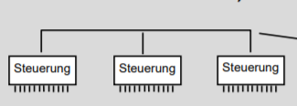

[Quelle](https://webuser.hs-furtwangen.de/~hoenig/2016/Wiki/ac_08/0_Inhalt/01_U-Han/6feldbus.pdf)


---

### Feldbus

* Bei einer konventionellen SPS sind alle Komponenten sternförmig verbunden (analoges oder digitale Signale werden übertragen)
* Beim Bus ein Datenkabel (Buskabel) 
  * Zentraler Aufbau mit SPS und steckbaren Schnittstellenkarten (**Master**) möglich


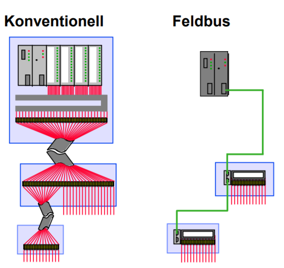

[Quelle](https://www.xplore-dna.net/pluginfile.php/623/mod_resource/content/2/Einf%C3%BChrung%20Feldbussysteme.pdf)

---

### Vielfalt an Bussystemen

<!-- _class: white -->
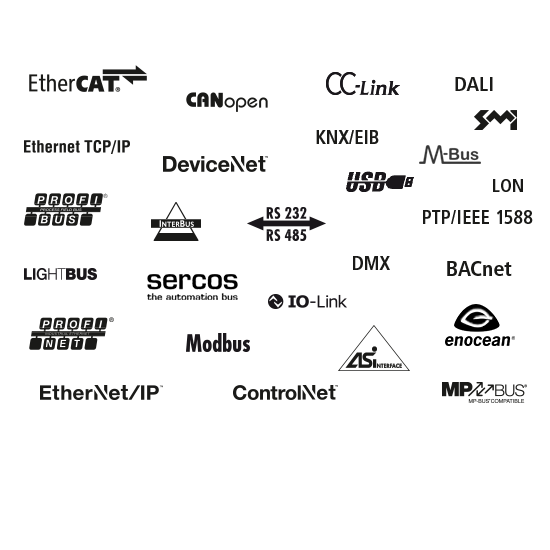 

* Spezielle Anwendungsfälle in **Gebäuden**
  * DALI, KNX, ...
* Geschwindigkeit und Zuverlässigkeit
  * CAN-Bus in **Fahrzeugen**
* **Funk** Reichweite und Energiebedarf
  * LoRaWAN, Bluetooth Low Energy 


---


### Unterscheidungsmerkmale von Bussystemen

* **Telegramminhalt**: welche Information
* **Topologie**: Verkabelung
* **Teilnehmerhierarchie**: Master, Slave, ...
* **Adressierung**: Wie erreicht man Komponenten
* **Buszugriffsverfahren**: Wer sendet wann?
* **Signalisierung**: Wie werden Telegramme übertragen
* **Übertragungsmedium**: z.B: Kabel oder Funk

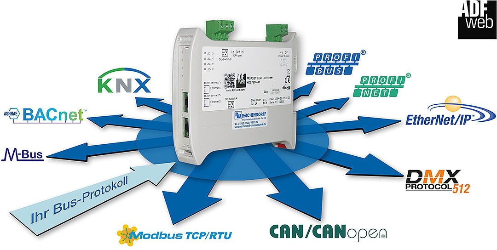

[Quelle](https://www.wachendorff-prozesstechnik.de/produktgruppen/gateways-und-protokollwandler/informationen/busprotokolle-besser-verstehen/?type=98)

---

### Unterscheidungsmerkmale von Bussystemen


- **Telegramminhalt**: welche Information
- **Topologie**: Verkabelung
- **Teilnehmerhierarchie**: Master, Slave, ...
- **Adressierung**: Wie erreicht man Komponenten
- **Buszugriffsverfahren**: Wer sendet wann?
- **Signalisierung**: Wie werden Telegramme übertragen
- **Übertragungsmedium**: z.B: Kabel oder Funk

---

## Bitübertragungsschicht /  Signalisierung von Telegrammen


- Wireless über **Wellen**
  - Frequenzmodulation
  - Amplitudenmodulation
- **Kabelgebundene** Kodierung
  - Über Spannungslevel


---


### Informationsgehalt von Telegrammen

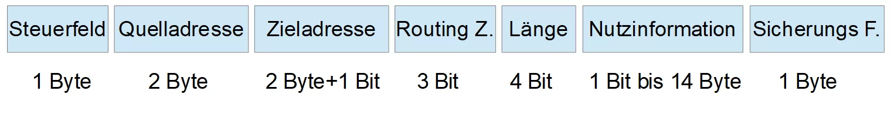

* Steuerfeld: Priorität der Nachricht
* Quelladresse: Absender (vgl. MAC-Adresse)
* Zieladresse: Empfänger (vgl. MAC-Adresse)
* Routing Zähler: Zählt wie oft über Koppler gesendet (verhindert Irrläufer)
* Nutzinformation: Eigentlich Information (z.B. Messwerte eines Sensor)
* Sicherungs-Feld: Wurden die Daten richtig übertragen (vgl. Hash)

---

## Symbolrate und Bitrate


* Anzahl der übertragenen Symbole pro Zeiteinheit
* In der Abbildung rechts gibt es ein Symbolalphabet ${\displaystyle d_{i}\in \{-1,1\}}.$
* Die Bitrate ist die Anzahl der übertragenen Bits pro Zeiteinheit (bei einem Bit pro Symbol entspricht die Bitrate der Symbolrate)
* $1 \text{ Baud} = 1 \frac{\text{Symbol}}{\text{s}}$ 
* Beispiele
  * CAN-Bus: $5 \text{ bis } 500.000 \text{ Baud}$
  * DMX: $500.000 \text{ Baud}$
  * DALI-Bus: $1.200 \text{ Baud}$

---

## ✍️ Aufgabe 5_1_1: Symbolrate

- Wie groß ist jeweils die Symbolrate und die Bitrate?


---

### Lösung

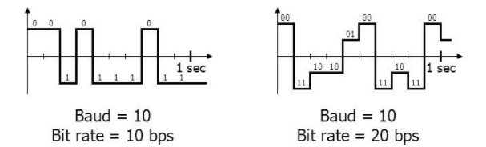

* In beiden Fällen ändert sich die Spannung zehn mal pro Sekunde $\text{Symbolrate} = 10 \text{ Baud}$
* Links: Es gibt zwei Spannungen, jedes Symbol codiert ein Bit $\text{Bitrate} = 10 \frac{\text{Bit}}{\text{s}}$
* Rechts: Es gibt vier Spannungen, jedes Symbol codiert zwei Bit $\text{Bitrate} = 20 \frac{\text{Bit}}{\text{s}}$


---

## Leitungscodes

* Wie wird die Symbolrate ausgenutzt?
* z.B. Non-Return-to-Zero High Level
  * Hohes Spannungslevel codiert `1`
  * in jedem Schritt wird ein Bit übertragen
  * dazwischen gibt es keine zurückfallen auf eine neutrale Spannung
  * Baud-Rate entspricht Bit-Rate
  * $1 \text{ Baud} \cdot \frac{\text{Bit}}{\text{Signal}}= 1 \frac{\text{Bit}}{\text{s}}$ 


---

### Weitere Leitungscodes

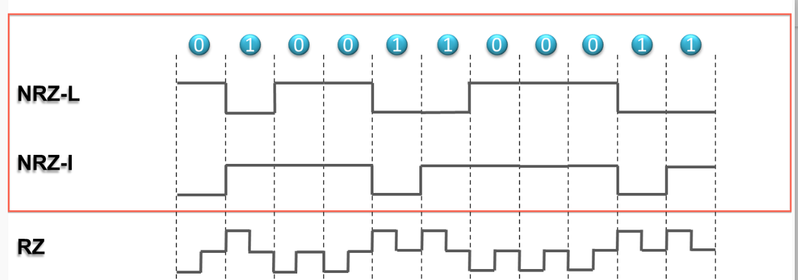

---

## ✍️ Aufgabe 5_1_2: Leitungscodes


- Erklären Sie verbal, wie die Leitungscodes funktionieren
- Non-Return-to-Zero Low Level
- Non-Return-to-Zero Inverted
- Return-to-Zero
- Welche Vor- und Nachteile haben die verschiedenen Leitungscodes?

---

### Lösung


* Non-Return-to-Zero Low Level: eine `1` wird durch eine niedrige Spannung codiert
* Non-Return-to-Zero Inverted: Bei jedem Auftreten einer `1` wird die Spannung invertiert
* Return-to-Zero: eine `1` wird durch eine hohe Spannung codiert, nach jedem Bit wird auf eine neutrale Spannung zurückgekehrt (halbiert die Bitrate bei gleicher Baud-Rate)

---

## Übermittlung der Taktrate

* Signal ohne Taktrate (z.B. Non-Return-to-Zero Low Level): 
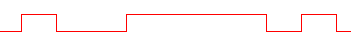
* Ohne gemeinsame Uhr nur schwer zu entschlüsseln
* Lösungen:
  * Einsatz einer Return-to-Zero-Code Kodierung
  * Pausen mit definierter Länge mit definiertem Rhythmus z.B. bei RS-232
  * Separate Leitung für Takt z.B. bei I²C-Bus

---

### Synchrone Datenübertragung

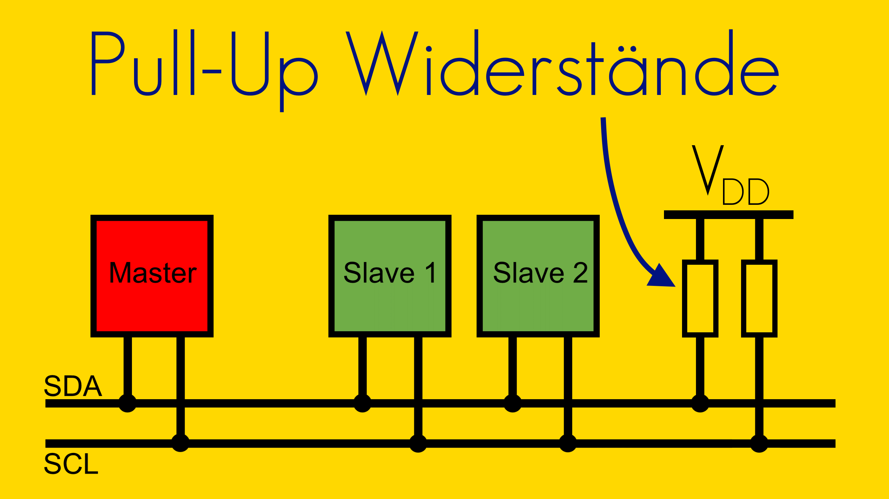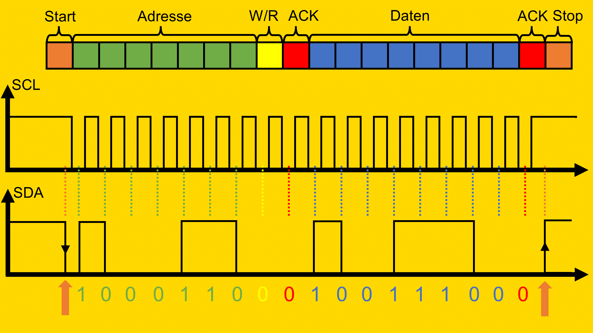

* Neben der Datenleitung `SDA` gibt es eine Taktleitung `SCL`, mit welcher der Master vorgibt, wann `SDA` gelesen wird (z.B.`I²C`-Bus)
* Probleme: 
  * Taktleitung benötigt zusätzliche Leitung
  * Bei langen Leitungen kann es zu Phasenverschiebungen kommen. D.h. bis die Spannung auf der Datenleitung ,welche vom Busteilnehmer gesendet wurde, ankommt, ist der Takt beim Master schon weitergezogen
[Quelle](http://fmh-studios.de/theorie/informationstechnik/i2c-bus/#_)


---

### Asynchrone Datenübertragung

* Jeder Busteilnehmer verfügt über eine eigene Taktquelle (`Sample Clock`), die deutlich schneller taktet als die Datenübertragung
* Durch die Übertragung eines Start- und Stop-Bits wird die Taktquelle des Senders und Empfängers synchronisiert (z.B. RS-232) 

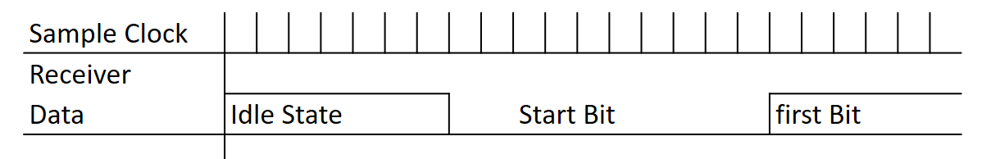

---

## Serielle und Parallele Busse

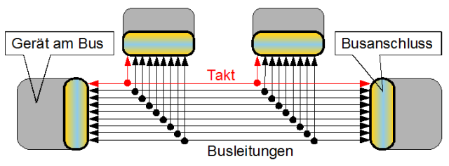

* Mit mehreren parallelen Leitungen können ebenfalls 
mehr Symbole bei gleicher Baud-Rate übertragen werden
* Kaum Einsatz in Feldbussen (welche Geräte *im Feld* verbinden), häufig jedoch in Computern ([PCI](https://de.wikipedia.org/wiki/Peripheral_Component_Interconnect), [ATA](https://de.wikipedia.org/wiki/ATA/ATAPI))

---

## Übertragungsarten

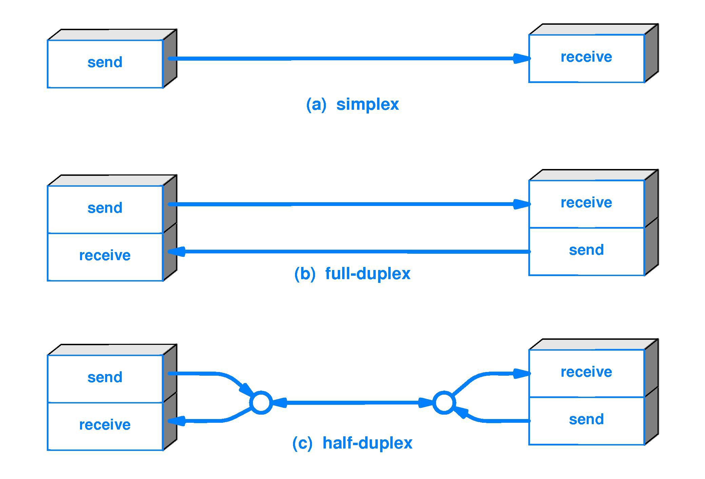

* Simplex: Eine Richtung
* Half-Duplex: Beide Richtungen, aber nicht gleichzeitig
* Full-Duplex: Beide Richtungen gleichzeitig

[Quelle](https://www.black-box.de/de-de/page/25078/Information/Technische-Ressourcen/black-box-erklaert/Glasfaserkabel/Simplex-versus-Duplex-Glasfaser-Patchkabel)

---

## Beispiel: Universal Serial Bus (USB  1.1 und 2.0) 

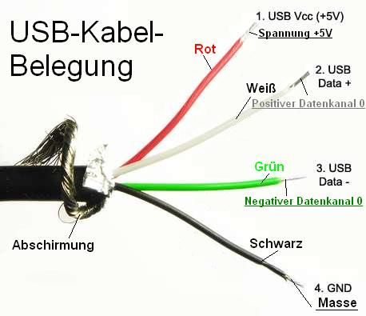

* Leitungen sind über Schirmung gegen Störungen abgesichert
* Zwei Drähte für Spannungspotentiale
* Zwei Drähte für Daten (Werte immer gegenläufig - half duplex)
* Kein Draht für Takt (spezielle NRZ-S Kodierung mit Bit Stuffing)
* $480 \text{ Baud}$
[Quelle](https://commons.wikimedia.org/wiki/File:USB_3.0_Kabel_und_Stecker.png, https://de.wikipedia.org/wiki/Non_Return_to_Zero)


---

#### 🤓 NRZ-S: Bitwechsel bei Null

Bei jeder `0` im Datenbit findet ein Wechsel statt
```
# Beispiel 1:	
Datenbits (logisch):	                  1 1 1 1 1 1 1 1
phys. Leitung bei Ausgangszustand „1“:	  1 1 1 1 1 1 1 1
phys. Leitung bei Ausgangszustand „0“:	  0 0 0 0 0 0 0 0
```

```
# Beispiel 2:	
Datenbits (logisch):	                  0 0 0 0 0 0 0 0
phys. Leitung bei Ausgangszustand „1“:	  0 1 0 1 0 1 0 1
phys. Leitung bei Ausgangszustand „0“:	  1 0 1 0 1 0 1 0
```

```
# Beispiel 3:	
Datenbits (logisch):	                1 1 1 1 1 0 1 0 1 0 1 1 0 0 0 1
phys. Leitung bei Ausgangszustand „1“:	1 1 1 1 1 0 0 1 1 0 0 0 1 0 1 1
phys. Leitung bei Ausgangszustand „0“:	0 0 0 0 0 1 1 0 0 1 1 1 0 1 0 0
```
