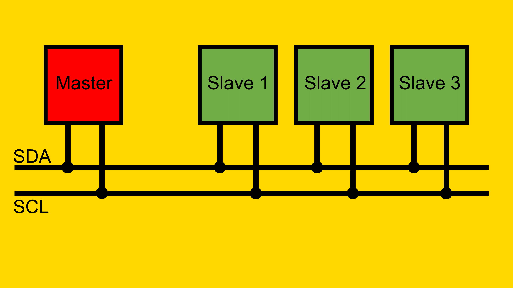
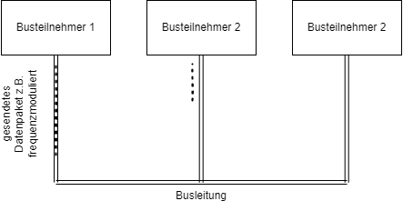

<!-- paginate: true -->


# 5.2 Buszugriffsverfahren


<!-- _class: title -->

---

## Orientierung – Einheit 12 von 14

<!-- _class: white -->

### Wo sind wir?

| Abgeschlossen | **Heute** | Als nächstes |
|---|---|---|
| Einheit 11: Bussysteme I | **Einheit 12: Bussysteme II – Zugriffsverfahren** | Einheit 13: Bussysteme III (Übertragungssicherheit) |

### Was haben wir bisher gelernt?

* Leitungscodes; Symbolrate vs. Bitrate; differentielle Busse
* Bussystem-Grundidee: gemeinsames Medium für viele Teilnehmer

### Wo wollen wir hin?

Mehrere Teilnehmer teilen sich ein Kabel – wer darf wann senden? Heute lernen wir **Buszugriffsverfahren**: Master/Slave-Polling und zufällige Verfahren (CSMA). Wie groß ist die Worst-Case-Latenz? Was eignet sich für sicherheitskritische Systeme wie Brandmeldung?

---

## Lernziele – Einheit 12

* Master/Slave-Polling erklären und Worst-Case-Latenz berechnen
* CSMA-Verfahren und Kollisionsbehandlung beschreiben
* Anforderungen an GA- und Brandmeldesysteme ableiten
* Zugriffsverfahren nach Anforderungen auswählen

### Aufgaben dieser Einheit

| Aufgabe | Inhalt |
|---------|--------|
| ✍️ 5_2_1 | Worst-Case-Latenz für Master/Slave-Polling berechnen |
| ✍️ 5_2_2 | Zugriffsverfahren für verschiedene GA-Szenarien wählen |

---


<style>
img[alt~="center"] {
  display: block;
  margin: 0 auto;
}
</style>

<!-- paginate: true -->


### 🎯 Lernziele

Nach dieser Einheit sind Sie in der Lage dazu
* das Vorgehen von Client-Server, Token, Summenrahmenprokoll- und CS-MA- Buszugriffsverfahren zu beschreiben
* deren Vor- und Nachteile zu benennen
* Laufzeiten von Nachrichten auf Buskabeln zu berechnen


---



[Quelle](http://fmh-studios.de/theorie/informationstechnik/i2c-bus/#img1)

---

## Herausforderung

<!-- _class: white -->



* Senden mehre Busteilnehmer zeitgleich, so überlagern sich die Spannungs-Pegel auf der Busleitung bzw. die Wellen
* Inhalt der Telegramme kann nicht mehr entziffert werden
* Im OSI-Modell Aufgabe der Sicherungs- und Vermittlungsschicht (Schicht 2&3)

---

## Client/Server (Master/Slave-Verfahren)

* Zentrale Bussteuereinheit (**Master**, ggf. SPS) stellt Verbindung zu den passiven Teilnehmern (Slaves) her (**Kommunikationssteuerung**)
* **Slaves** antworten auf eine Datenanforderung des Masters unmittelbar
* **Polling** (zyklische Abfrage)
  * Master mit aktivem Buszugriff geben die Ein-/Ausgabedaten an die Slaves
  * einfaches Protokoll
  * **garantierte Buszugriffszeiten** (d.h. es ist vorhersagbar, wie lange es dauert bis Information ausgetauscht werden kann)


[Quelle](https://www.xplore-dna.net/pluginfile.php/623/mod_resource/content/2/Einf%C3%BChrung%20Feldbussysteme.pdf)

---

## ✍️ Aufgabe 5_2_1: Worst Case beim Polling

* Eine zentrale SPS fragt als Master zyklisch alle Werte von Sensoren auf einer Busleitung ab und sendet Befehle
* insgesamt 255 Slaves, davon 
  * 1 Taster Türöffner
  * 1 Motor Türöffner 
* Wie lange dauert es im schlimmsten Fall bis die Tür reagiert?

---

### Annahmen

* maximale Busleitungslänge: $200 \text{ m}$
* Telegrammlänge: $2$ Byte
  * `[Adresse].[Nachricht]`
* Zykluszeit des Masters und Slaves vernachlässigbar (Antworten unmittelbar)
* Baud-Rate $9.600 \text{ Baud}$ 
* [Manchester-Code](https://en.wikipedia.org/wiki/Manchester_code)
* Zykluszeit je Master + Slave: vernachlässigbar
* Signal-Laufzeit Fortpflanzung des Signals im Leiter mit Lichtgeschwindigkeit wird ebenfalls vernachlässigt

---

### ✔️ Lösung

* Abrufen eines Slaves:
  * Übertragungszeit (wie lange belegt das Signal die Leitung):
    * 1 Bit pro 2 Baud: $4.800 \frac{\text{ Bit}}{\text{s}}$
    * In eine Richtung: $\frac{16 \text{ Bit}}{4800 \text{ Bit}}\text{s}=3.3 \text{ ms}$
* Abrufen aller Salves ($\text{Bus-Zykluszeit}$):
  * Slaves antworten, nachdem Sie die Nachricht erhalten haben
  * Zeit pro Slave: $6.6\text{ ms}$
  * Wenn Befehl direkt weitergeleitet wird, aber die Teilnehmer logisch maximal auseinander: $6.6 \text{ ms} \cdot 254 = 1.68 \text{ s}$ 
* **Langsam, aber:** es ist garantiert, dass es nicht länger dauert (Echtzeitfähiges System)!

---

### Einfluss der Bus-Zykluszeit auf Komfort

Kopieren Sie den folgenden Code in: https://jsfiddle.net/

```JS
<!DOCTYPE html>
<html>
<head>
  <title>Toggle Background Color with Time Delay</title>
  <script>
    var color = "white";
    function changeBackground() {
      var time = document.getElementById("timeInput").value;
      setTimeout(function() {
        if (color === "white") {
          color = "red";
        } else {
          color = "white";
        }
        document.body.style.backgroundColor = color;
      }, time);
    }
  </script>
</head>
<body>
  <input type="text" id="timeInput" placeholder="Enter time in ms">
  <button onclick="changeBackground()">Change Background</button>
</body>
</html>
```

---

#### Wahrnehmbare Verzögerung ab $60 \text{ ms}$

- ab $60 \text{ ms}$ nehmen Nutzer:innen eine Verzögerung war
- Diese führt zu einem negativen Nutzererleben
- Häufig kann innerhalb dieser Zeit keine Rückmeldung der geschalteten Aktoren erfolgen


---

<!-- _class: white-->


---

<!-- _class: white-->


---

<!-- >
```
sequenceDiagram
    User Interface->>Steuerung: Schalte Licht an
    Steuerung->>LED-Controller: Schalte Licht an
    Note over User Interface: Wahrnehmbare Verzögerung
    LED-Controller->>Steuerung: Licht ist an
    Steuerung->>User Interface: Licht ist an
```

```
sequenceDiagram
    User Interface->>Steuerung: Schalte Licht an
    Steuerung->>User Interface: Licht ist an
    Steuerung->>LED-Controller: Schalte Licht an
    LED-Controller->>Steuerung: Licht ist an
    Steuerung->>User Interface: Licht ist wirklich an

```


---
-->


---

## 🎯 Aufgaben von Buszugriffsverfahren

Buszugriffsverfahren regeln, wie Teilnehmer auf ein gemeinsames Übertragungsmedium zugreifen. Ihre Hauptaufgaben sind:

1. **Vermeidung oder Handhabung von Kollisionen**: Sicherstellen, dass Datenübertragungen nicht durch gleichzeitiges Senden gestört werden.
2. **Echtzeitfähigkeit**: Garantieren, dass Daten innerhalb einer definierten Zeit übertragen werden (wichtig für zeitkritische Anwendungen).


---

### 🛡️ Vermeidung von Kollisionen

Kollisionen entstehen, wenn mehrere Teilnehmer gleichzeitig senden. Es gibt zwei Ansätze:

- **Deterministische Verfahren**: Verhindern Kollisionen durch festgelegte Zugriffsregeln (z. B. Polling, Token-Systeme).
- **Zufällige Verfahren**: Lassen Kollisionen zu, erkennen und beheben sie (z. B. CSMA/CD).


---

### ⏱️ Echtzeitfähigkeit

**Echtzeitfähigkeit** bedeutet, dass Daten innerhalb einer garantierten Zeitspanne übertragen werden. 

- **Deterministische Verfahren** (z. B. Polling, Token-Systeme):
  - Langsamer, aber maximale Übertragungszeit berechenbar.
  - Geeignet für zeitkritische Anwendungen (z. B. Steuerungssysteme).
- **Zufällige Verfahren** (z. B. CSMA/CD):
  - Keine garantierte maximale Zeit, da Kollisionen Verzögerungen verursachen.
  - Nicht echtzeitfähig.


---


**Vergleich**:
- Polling: Berechenbare, aber längere Übertragungszeiten.
- CSMA/CD (z.B. Ethernet): Schnell bei niedriger Auslastung, unzuverlässig bei hoher Auslastung.

[Quelle](Schnell & Wiedemann 2019)


---

### 🧠 Deterministische Buszugriffsverfahren

Deterministische Verfahren garantieren einen geregelten Zugriff auf den Bus. Beispiele:

1. **Master-Slave-Verfahren**: Ein Master steuert alle Slaves, keine Kollisionen.
2. **Polling**: Der Master fragt Slaves zyklisch ab (langsam, aber berechenbar).
3. **Token-Systeme**: Nur der Teilnehmer mit dem „Token“ darf senden.

- **Vorteile**:
  - Keine Kollisionen.
  - Garantierte Zugriffszeiten.
- **Nachteile**:
  - Oft langsamer als zufällige Verfahren.


---

### Token-Systeme

>Als Token, Zugstab, Signalstab, Streckenstab oder Knüppel bezeichnet man im Eisen- und Straßenbahnwesen ein Objekt, dessen **Besitz zum Befahren** eines eingleisigen Streckenabschnitts **berechtigt**.

- z.B. Innsbrucker Mittelgebirgsbahn


[Quelle](Wiki)

---


[Quelle](Wiki)

---

#### Token Ring (Logischer Ring)


- Ermöglich**Multi-Master-Betrieb** 
- **Vorsicht:** Logischer Ablauf muss nicht der verbauten Topologie entsprechen

[Quelle](https://www.xplore-dna.net/pluginfile.php/623/mod_resource/content/2/Einf%C3%BChrung%20Feldbussysteme.pdf)

---

Ein **Token** ist ein digitales Berechtigungszeichen, das den Zugriff auf den Bus erlaubt. Nur der Teilnehmer mit dem Token darf senden.

**Funktionsweise**:
- Das Token wird zwischen Teilnehmern weitergegeben (logischer Ring).
- Nach einer festgelegten Zeit gibt der Sender das Token frei.
- Kombination mit Master-Slave möglich (Token-Passing).

**Vorteile**:
- Garantierte Zugriffszeiten.
- Einfache Umsetzung.

---


### 📡 Summenrahmenprotokoll

Beim **Summenrahmenprotokoll** sendet ein Master alle Daten in einem einzigen Rahmen an alle Slaves. Der Rahmen enthält Eingangs- und Ausgangsdaten für alle Teilnehmer.

**Vorteile**:
- Sehr effiziente Busauslastung.
- Garantierte Zugriffszeiten (deterministisch).
- Ideal für Echtzeitanwendungen.


[Quelle](https://www.xplore-dna.net/pluginfile.php/623/mod_resource/content/2/Einf%C3%BChrung%20Feldbussysteme.pdf)

---

#### Summenrahmenprotokoll Beispiel EtherCat


- Nutzt Ethernet-Hardware, aber mit Summenrahmenprotokoll.


[Quelle](https://www.youtube.com/watch?v=z2OagcHG-UU)


---


* Ein- und Ausgangsklemmen werden über Ethercat angesprochen
* Hardware wie Ethernet, jedoch mit Summenrahmenprotokoll

[Quelle](https://www.beckhoff.com/de-de/produkte/i-o/ethercat/)

---

### 🔄 Zusammenfassung deterministischer Verfahren

- **Merkmal**: Der Sender ist vor Sendebeginn eindeutig bestimmt.
- **Zuteilung**:
  - **Zentral**: Durch eine Leitstation (Master-Slave).
  - **Dezentral**: Durch mehrere Steuereinheiten (Token-Bus, Token-Ring).
- **Anwendung**: Sicherheitskritische Systeme, Echtzeitanwendungen.


[Quelle](Schnell & Wiedemann 2019)

---

#### Prioritäten bei Deterministischen Verfahren

- Manche Nachrichten haben höhere Priorität (z. B. Notfallmeldungen).
- **Umsetzung**:
  - **Prioritätsfelder**: Telegramme enthalten ein Feld, das die Priorität angibt (z. B. eine Brandmeldung).
  - **Polling**: Der Master fragt hochpriorisierte Geräte zuerst ab.
- **Token-Systeme**: Geräte mit höherer Priorität erhalten das Token schneller.

---

## 🎲 Zufällige Buszugriffsverfahren

Zufällige Verfahren erlauben Teilnehmern, bei Bedarf (z. B. Tasterbetätigung) auf den Bus zuzugreifen. Beispiele: CSMA/CD, CSMA/CA.

**Funktionsweise**:
- Teilnehmer prüfen, ob der Bus frei ist (**Carrier Sense**, CS).
- Bei Belegung wird der Zugriff verzögert (**Multiple Access**, MA).

**Nachteil**:
- Kollisionen möglich, keine garantierte Übertragungszeit (nicht echtzeitfähig).


---

### 🧠 Carrier Sense Multiple Access (CSMA)

**CSMA**:
- Teilnehmer prüfen, ob der Bus frei ist, bevor sie senden.
- Bei belegtem Bus wird der Zugriff auf einen späteren Zeitpunkt verschoben.
- Keine Garantie, dass der Bus beim nächsten Versuch frei ist.
- **CSMA/CD** (Collision Detection): Kollisionen werden erkannt und aufgelöst.
- **CSMA/CA** (Collision Avoidance): Kollisionen werden durch Prioritäten vermieden (Nachrichten mit Prio)

**Nachteil**: Keine Echtzeitfähigkeit.


---

#### 🧠 Bus-Kollision

* Zwei **Sender** beginnen etwa **gleichzeitig** mit der Sendung 
* Sendungen kollidieren und zerstören sich gegenseitig (**Überlagerung** der Wellen)
* Wird erkannt, wenn der Empfänger die übertragenen Daten auf Fehler überprüft (**Prüfsumme** vgl. Kapitel 5.3)
* Voraussetzung: Sender empfangen ihre eigenen Signale während der Sendung. 
* ist es zur Kollision gekommen und die Übertragung wird sofort eingestellt. (**Collision Detection**, CSMA/CD)


---

#### Kollisionserkennung 

* **a:** Sendebeginn zum Zeitpunkt $t$ , 
* **b:** Kollision zum Zeitpunkt $t+t_s$ 
mit $t_s$ Signallaufzeit, 
* **c:** Zustand zum Zeitpunkt $t + t_S + \Delta t$, 
* **d:** Zustand zum Zeitpunkt $t + 2 t_s$


---

##### Kollisionserkennung 

* der Sender $n$ erkennt die Kollision nach $t+t_s$
* Sender $1$ erst zum Zeitpunkt $t+ 2 t_s$. 
* Pakete die kürzer sind als $t + 2 t_s$ werden nicht immer durch die Kollisionserkennung erkannt


---

#### Auflösen einer Bus-Kollision

* Nach der Kollisionserkennung überträgt der Sender ein kurzes Störsignal (**jam**), mit dem er alle anderen Teilnehmer über die erkannte Kollision informiert (Broadcast). 
* Alle sende-willigen Teilnehmer stellen dann ihre Sendung für eine **zufällige Zeitdauer**, die einem ganzzahligen Vielfachen der maximalen doppelten Signallaufzeit entspricht, zurück und versuchen dann **erneut** den Zugriff.


[Quelle](Schnell & Wiedemann 2019)

---

####  Zeitverhalten

- Bei niedriger Busauslastung: Schnelle Übertragung.
- Bei hoher Busauslastung: Häufige Kollisionen, starke Verzögerungen.
- Beispiel: Ethernet (CSMA/CD) zeigt bei hoher Last unvorhersehbare Verzögerungen.


[Quelle](Schnell & Wiedemann 2019)

---

#### Prioritäten bei CSMA/CA

- Geräte mit höherer Priorität erhalten schnelleren Zugriff auf den Bus.
- **Umsetzung**:
  - **Prioritätsfelder**: Telegramme enthalten ein Feld, das die Priorität angibt (z. B. eine Brandmeldung).
  - **Arbitration**: Bei gleichzeitigem Zugriff entscheidet ein Schiedsverfahren, welches Gerät senden darf. Geräte mit höherer Priorität senden dominante Bits, andere warten.
  - **Kürzere Wartezeiten**: Hochpriorisierte Geräte versuchen früher erneut, auf den Bus zuzugreifen.

---

- **Beispiel: CAN-Bus**:
  - Jede Nachricht hat eine eindeutige ID, die die Priorität angibt (niedrigere ID = höhere Priorität).
  - Während der Arbitration gewinnt die Nachricht mit der niedrigsten ID, da sie dominante Bits (`0`) sendet, während andere Geräte mit recessiven Bits (`1`) zurücktreten.
  - Anwendung: In der Automobiltechnik haben Airbag-Signale Vorrang vor Komfortfunktionen.

---

## ✍️ Aufgabe 5_2_2: Buszugriffsverfahren für ein Brandmeldesystem

**Szenario**:
Ein Bussystem steuert ein Brandmeldesystem in einem Gebäude. Das System umfasst Rauchmelder, Alarme und Notbeleuchtung. Im Falle eines Brandes müssen die Rauchmelder sofort einen Alarm auslösen, und die Notbeleuchtung muss auf `leuchtend` geschaltet werden. Ein defekter Schalter sendet dauerhaft das Telegramm `0010001|0`, sobald er die Chance dazu hat, was andere Geräte blockieren könnte. Im Telegramm `0010001|0` steht das erste Bit für die Priorität (`1` = hoch, `0` = niedrig).


---

**Fragen**:

1. Welches Buszugriffsverfahren gewährleistet, dass Rauchmelder-Alarme Vorrang haben und trotz des defekten Geräts zuverlässig ausgelöst werden?

---

## ✔️ Lösung: Aufgabe 5_2_2

**Empfohlenes Verfahren**: **Master-Slave-Verfahren**
- **Deterministisch**: Der Master steuert alle Geräte (Slaves), wodurch Kollisionen verhindert werden.
- Das Prioritätsfeld wird in diesem Verfahren nicht benötigt, da der Master die Kontrolle hat.

---

- **Ablauf**:
1. Der Master fragt zyklisch alle Rauchmelder ab, erkennt einen Brand und sendet einen Befehl an Alarme und Notbeleuchtung (`leuchtend`).
Im besten Fall ist noch folgendes implementiert:
  1. Der defekte Schalter wird als fehlerhaft erkannt (z. B. durch unplausible Dauermeldungen).
  2. Der Master ignoriert den defekten Melder und priorisiert die Aktivierung der Alarme und Beleuchtung.

---

**Alternative**: **Token-System mit Prioritäten**
- Ein Token-System, bei dem Geräte mit Notfallmeldungen (z. B. Rauchmelder) das Token bevorzugt erhalten.
- **Vorteil**: Dezentraler Ansatz, geeignet für größere Systeme.
- **Nachteil**: Komplexere Implementierung als Master-Slave.

**Warum keine zufälligen Verfahren (z. B. CSMA/CD)?**:
- Der defekte Rauchmelder könnte den Bus durch dauerhaftes Senden blockieren, was zu unvorhersehbaren Verzögerungen führt.
- Kollisionen verhindern eine garantierte Übertragungszeit, was in einem Brandmeldesystem inakzeptabel ist.
- Evlt. CSMA/CA mit Prioritäten, aber auch hier besteht das Risiko, dass der defekte Melder den Bus blockiert oder zumindest verzögert.

**Beispiel aus der Praxis**:
- Systeme wie **KNX** oder **BACnet** verwenden deterministische Verfahren (z. B. Master-Slave oder Token-Passing), um sicherheitskritische Anwendungen wie Brandmeldungen zuverlässig zu steuern.

---

## 📚 Glossar

- **Echtzeitfähigkeit**: Garantie, dass Daten innerhalb einer definierten Zeit übertragen werden.
- **CSMA/CD**: Carrier Sense Multiple Access with Collision Detection – zufälliges Verfahren mit Kollisionserkennung.
- **Token-System**: Deterministisches Verfahren, bei dem ein Token die Sendeberechtigung vergibt.
- **Summenrahmenprotokoll**: Effiziente Datenübertragung durch einen Master in einem einzigen Rahmen.
- **Master-Slave**: Deterministisches Verfahren, bei dem ein Master die Slaves steuert.