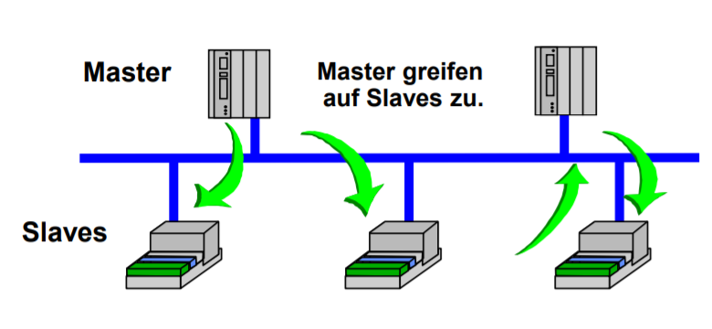
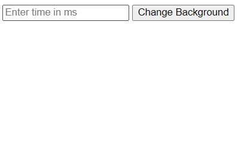
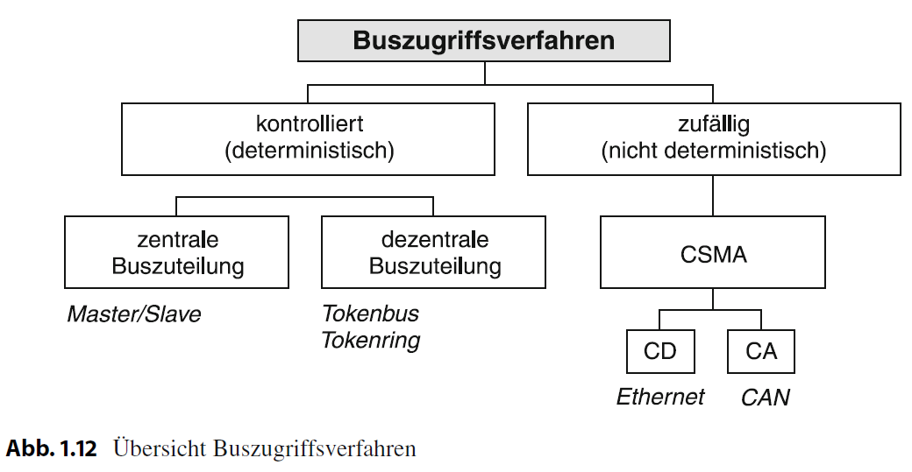
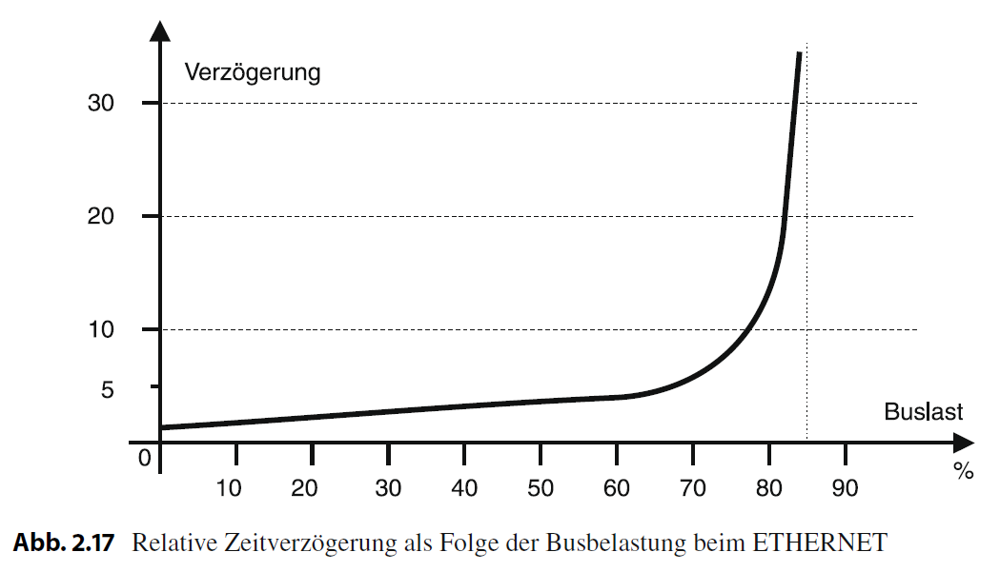
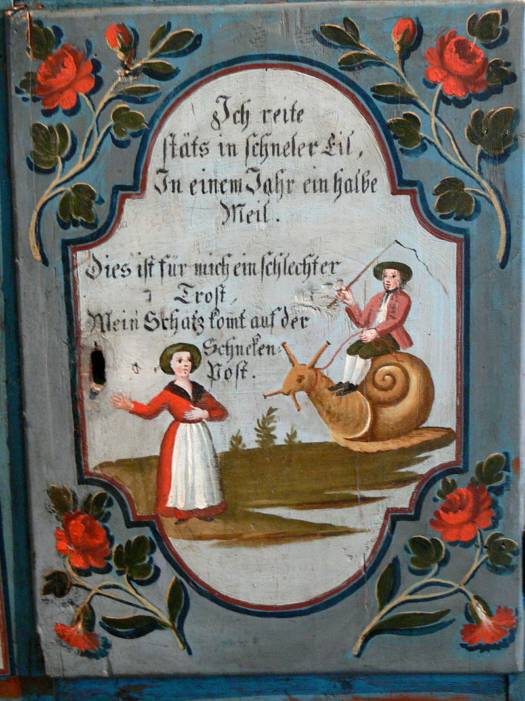
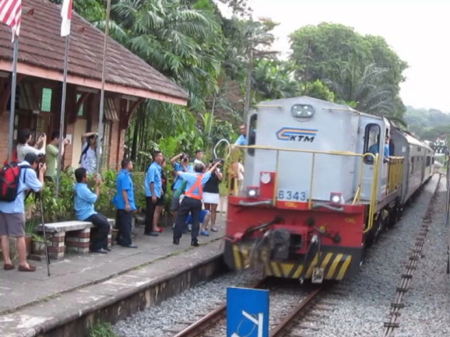
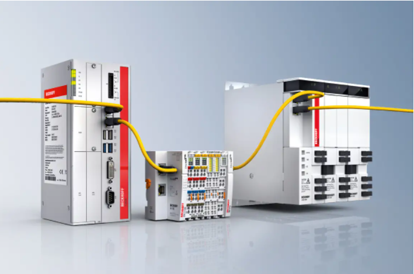

<style>
img[alt~="center"] {
  display: block;
  margin: 0 auto;
}
</style>

<!-- paginate: true -->

# 5.2 Buszugriffsverfahren

### 🎯 Lernziele

Nach dieser Einheit sind Sie in der Lage dazu
* das Vorgehen von Client-Server, Token, Summenrahmenprokoll- und CS-MA- Buszugriffsverfahren zu beschreiben
* deren Vor- und Nachteile zu benennen
* Laufzeiten von Nachrichten auf Buskabeln zu berechnen


---


[Quelle](http://fmh-studios.de/theorie/informationstechnik/i2c-bus/#img1)

---

## Herausforderung

<!-- _class: white -->


* Senden mehre Busteilnehmer zeitgleich, so überlagern sich die Spannungs-Pegel auf der Busleitung bzw. die Wellen
* Inhalt der Telegramme kann nicht mehr entziffert werden
* Im OSI-Modell Aufgabe der Sicherungs- und Vermittlungsschicht (Schicht 2&3)

---

## Client/Server (Master/Slave-Verfahren)

* Zentrale Bussteuereinheit (**Master**, ggf. SPS) stellt Verbindung zu den passiven Teilnehmern (Slaves) her (**Kommunikationssteuerung**)
* **Slaves** antworten auf eine Datenanforderung des Masters unmittelbar
* **Polling** (zyklische Abfrage)
  * Master mit aktivem Buszugriff geben die Ein-/Ausgabedaten an die Slaves
  * einfaches Protokoll
  * **garantierte Buszugriffszeiten** (d.h. es ist vorhersagbar, wie lange es dauert bis Information ausgetauscht werden kann)




[Quelle](https://www.xplore-dna.net/pluginfile.php/623/mod_resource/content/2/Einf%C3%BChrung%20Feldbussysteme.pdf)

---

## ✍️ Aufgabe 5_2_1: Worst Case beim Polling

* Eine zentrale SPS fragt als Master zyklisch alle Werte von Sensoren auf einer Busleitung ab und sendet Befehle
* insgesamt 255 Slaves, davon 
  * 1 Taster Türöffner
  * 1 Motor Türöffner 
* Wie lange dauert es im schlimmsten Fall bis die Tür reagiert?

---

### Annahmen

* maximale Busleitungslänge: $200 \text{ m}$
* Telegrammlänge: $2$ Byte
  * `[Adresse].[Nachricht]`
* Zykluszeit des Masters und Slaves vernachlässigbar (Antworten unmittelbar)
* Baud-Rate $9.600 \text{ Baud}$ (z.B. Dali)
* [Manchester-Code](https://en.wikipedia.org/wiki/Manchester_code)
* Zykluszeit je Master + Slave: vernachlässigbar
* Signal-Laufzeit Fortpflanzung des Signals im Leiter mit Lichtgeschwindigkeit wird ebenfalls vernachlässigt

---

### Lösung

* Abrufen eines Slaves:
  * Übertragungszeit (wie lange belegt das Signal die Leitung):
    * 1 Bit pro 2 Baud: $4.800 \frac{\text{ Bit}}{\text{s}}$
    * In eine Richtung: $\frac{16 \text{ Bit}}{4800 \text{ Bit}}\text{s}=3.3 \text{ ms}$
* Abrufen aller Salves ($\text{Bus-Zykluszeit}$):
  * Slaves antworten, nachdem Sie die Nachricht erhalten haben
  * Zeit pro Slave: $6.6\text{ ms}$
  * Wenn Befehl direkt weitergeleitet wird, aber die Teilnehmer logisch maximal auseinander: $6.6 \text{ ms} \cdot 254 = 1.68 \text{ s}$ 
* **Langsam, aber:** es ist garantiert, dass es nicht länger dauert (Echtzeitfähiges System)!

---

### Einfluss der Bus-Zykluszeit auf Komfort

Kopieren Sie den folgenden Code in: https://jsfiddle.net/

```JS
<!DOCTYPE html>
<html>
<head>
  <title>Toggle Background Color with Time Delay</title>
  <script>
    var color = "white";
    function changeBackground() {
      var time = document.getElementById("timeInput").value;
      setTimeout(function() {
        if (color === "white") {
          color = "red";
        } else {
          color = "white";
        }
        document.body.style.backgroundColor = color;
      }, time);
    }
  </script>
</head>
<body>
  <input type="text" id="timeInput" placeholder="Enter time in ms">
  <button onclick="changeBackground()">Change Background</button>
</body>
</html>
```

---

#### Wahrnehmbare Verzögerung ab $60 \text{ ms}$

- ab $60 \text{ ms}$ nehmen Nutzer:innen eine Verzögerung war
- Diese führt zu einem negativen Nutzererleben
- Häufig kann innerhalb dieser Zeit keine Rückmeldung der geschalteten Aktoren erfolgen





---

<!-- _class: white-->


---

<!-- _class: white-->


---

```
sequenceDiagram
    User Interface->>Steuerung: Schalte Licht an
    Steuerung->>LED-Controller: Schalte Licht an
    Note over User Interface: Wahrnehmbare Verzögerung
    LED-Controller->>Steuerung: Licht ist an
    Steuerung->>User Interface: Licht ist an
```

```
sequenceDiagram
    User Interface->>Steuerung: Schalte Licht an
    Steuerung->>User Interface: Licht ist an
    Steuerung->>LED-Controller: Schalte Licht an
    LED-Controller->>Steuerung: Licht ist an
    Steuerung->>User Interface: Licht ist wirklich an

```


---


## Aufgaben von Buszugriffsverfahren



[Quelle](Schnell & Wiedemann 2019)

---

### Vermeidung von Kollisionen

<!-- _class: white-->


- verhindern: deterministische Verfahren wie Polling sorgen dafür, das keine Kollisionen stattfinden
- erkennen: zufällige Verfahren lassen Kollisionen zu, können aber damit umgehen


---

### Ermöglichen von Echtzeitfähigkeit

- kann garantiert werden, dass die Nachrichten in benennbar Zeit ankommen?
- Polling: Langsam, aber maximale Zeit kann berechnet und garantiert
- Zufällige Buszugriffsverfahren: maximale Zeit kann nicht garantiert werden (i.d.R. nicht Echtzeitfähig)




[Quelle](Schnell & Wiedemann 2019)


---

* Zeitraum oder die Datenlänge für einen Kommunikationszyklus und damit maximale Zeitdauer, bis die Daten übertragen **ist berechenbar**
* Damit wäre auch eine Schneckenpost echtzeitfähig, sofern die die versprochene Zustellzeit garantiert einhalten kann
* **zufällige** Buszugriffsverfahren sind i. d. R. **nicht echtzeitfähig**



[Quelle](https://de.wikipedia.org/wiki/Schneckenpost)


---

## Deterministische Buszugriffsverfahren

- deterministisch:
  - Master/Slave-Verfahren
  - Polling (zyklische Abfrage der Slaves) - Nachteil: Langsam!
  - **Token Systeme**


---

### Token-Systeme

>Als Token, Zugstab, Signalstab, Streckenstab oder Knüppel bezeichnet man im Eisen- und Straßenbahnwesen ein Objekt, dessen **Besitz zum Befahren** eines eingleisigen Streckenabschnitts **berechtigt**.

- z.B. Innsbrucker Mittelgebirgsbahn


[Quelle](Wiki)

---




[Quelle](Wiki)

---

#### Token Ring (Logischer Ring)


- **Vorsicht:** Logischer Ablauf muss nicht der verbauten Topologie entsprechen

[Quelle](https://www.xplore-dna.net/pluginfile.php/623/mod_resource/content/2/Einf%C3%BChrung%20Feldbussysteme.pdf)

---

* **alle Teilnehmer** können die Kommunikationssteuerung übernehmen (Multi-Master)
* nur Teilnehmer mit **Token hat Buszugriffsrecht** und agieren dann als Master
* **garantierte Buszugriffszeiten**: Sender muss Token nach bestimmter Zeit wieder freigeben 
* einfache Realisierung
* Kombination mit Master-Slave möglich (Token Passing)


[Quelle](https://www.xplore-dna.net/pluginfile.php/623/mod_resource/content/2/Einf%C3%BChrung%20Feldbussysteme.pdf)

---

### 🧠 Summenrahmenprotokoll


* Der **Master** gibt alle Daten in einem **Summenrahmen** an alle Slaves
* Im Summenrahmen ist eine Rahmen für die Inputs und Outputs aller Slaves gegeben
* **garantierte Buszugriffszeiten** (deterministischer Prozess)
* sehr effiziente Busauslastung


[Quelle](https://www.xplore-dna.net/pluginfile.php/623/mod_resource/content/2/Einf%C3%BChrung%20Feldbussysteme.pdf)
---

##### Summenrahmenprotokoll Beispiel EtherCat


[Quelle](https://www.youtube.com/watch?v=z2OagcHG-UU)


---



* Ein- und Ausgangsklemmen werden über Ethercat angesprochen
* Hardware wie Ethernet, jedoch mit Summenrahmenprotokoll

[Quelle](https://www.beckhoff.com/de-de/produkte/i-o/ethercat/)

---

### Zusammenfassung deterministischer Buszugriffsverfahren

* Sender **vor dem Sendebeginn** eindeutig **bestimmt**
* Buszuteilung (Sendeerlaubnis) **zentral** von einer Leitstation (Master/Slave-Verfahren) oder **dezentral** durch mehrere Steuereinheiten (Tokenbus, Tokenring)


[Quelle](Schnell & Wiedemann 2019)


---

## Zufällige Buszugriffsverfahren

* die sende-willigen Teilnehmer greifen **nur bei Bedarf** (i.e., zufällig) auf das Übertragungsmedium zu
* z.B. bei Taster-Betätigung im Beleuchtungssystem
* Medium darf nicht anderweitig von einem anderen Teilnehmer belegt sein (**Carrier Sense**, CS)
* Ist dies der Fall, muss die Sendung auf einen späteren Zeitpunkt verschoben werden (**Multiple Access**, MA)


---

### 🧠 Carrier Sense Multiple Access (CS/MA)

* falls **Busleitung belegt**, **erneuter Versuch** zu späteren Zeitpunkt 
* es ist allerdings ungewiss, ob Busleitung beim nächsten Versuch frei ist
* es kann keine maximale Zeit zur Datenbereitstellung garantiert (**keine Echtzeitfähig**).


---

#### 🧠 Bus-Kollision

* Zwei **Sender** beginnen etwa **gleichzeitig** mit der Sendung 
* Sendungen kollidieren und zerstören sich gegenseitig (**Überlagerung** der Wellen)
* Wird erkannt, wenn der Empfänger die übertragenen Daten auf Fehler überprüft (**Prüfsumme**)
* Voraussetzung: Sender empfangen ihre eigenen Signale während der Sendung. 
* ist es zur Kollision gekommen und die Übertragung wird sofort eingestellt. (**Collision Detection**, CSMA/CD)


---

#### Kollisionserkennung 

* **a:** Sendebeginn zum Zeitpunkt $t$ , 
* **b:** Kollision zum Zeitpunkt $t+t_s$ 
mit $t_s$ Signallaufzeit, 
* **c:** Zustand zum Zeitpunkt $t + t_S + \Delta t$, 
* **d:** Zustand zum Zeitpunkt $t + 2 t_s$


---

##### Kollisionserkennung 

* der Sender $n$ erkennt die Kollision nach $t+t_s$
* Sender $1$ erst zum Zeitpunkt $t+ 2 t_s$. 
* Pakete die kürzer sind als $t + 2 t_s$ werden nicht immer durch die Kollisionserkennung erkannt


---

#### Auflösen einer Bus-Kollision

* Nach der Kollisionserkennung überträgt der Sender ein kurzes Störsignal (**jam**), mit dem er alle anderen Teilnehmer über die erkannte Kollision informiert (Broadcast). 
* Alle sende-willigen Teilnehmer stellen dann ihre Sendung für eine **zufällige Zeitdauer**, die einem ganzzahligen Vielfachen der maximalen doppelten Signallaufzeit entspricht, zurück und versuchen dann **erneut** den Zugriff.


[Quelle](Schnell & Wiedemann 2019)

---

####  Zeitverhalten

- mit steigender Busauslastung steigt die Wahrscheinlichkeit einer Kollision
- Verzögerung bis zum Zustellerfolg aller
 Nachrichten am Beispiel ETHERNET (CSMA/CD)


[Quelle](Schnell & Wiedemann 2019)

---

## ✍️ Aufgabe 5_2_2:  Bewertung eines Buszugriffsverfahrens für sicherheitskritische Anwendungen


* Welche Ansätze gibt es bei einem Bussystem, die Leuchten in einer Notsituation garantiert auf den Zustand `leuchtend` zuschalten?
* Annahme, der defekte Schalter sendet dauerhaft den Zustand `aus` auf den Bus, wenn er sie Chance dazu hat

---

* Wenn der defekte Schalter wirklich dauerhaft sendet, dann wird der Bus durch den defekten Schalter blockiert
* Beim Master-Slave Verfahren würde der Master den defekten Schalter erkennen und die Leuchten auf `leuchtend` schalten und in der Folge den defekten Schalter nicht mehr ansprechen

