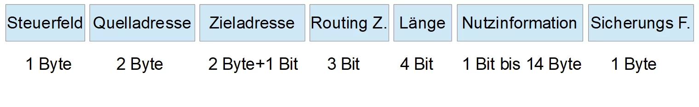
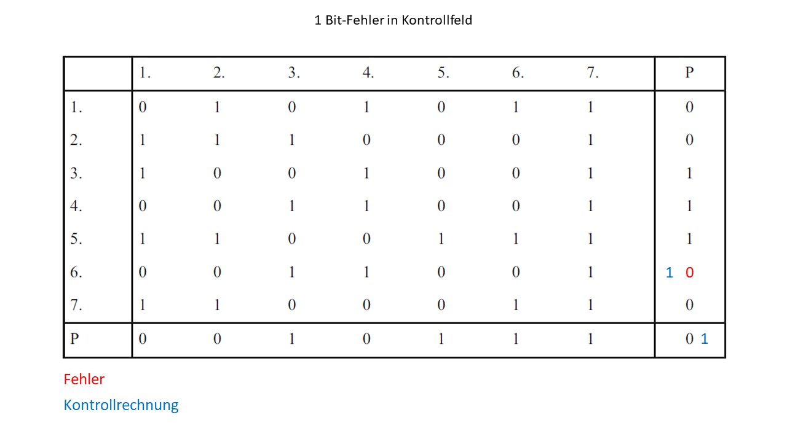

<!-- paginate: true -->


# 5.3 Übertragungssicherheit


<!-- _class: title -->

<style>
img[alt~="center"] {
  display: block;
  margin: 0 auto;
}
</style>

---

## 🎯 Lernziele

Nach dieser Einheit sind Sie in der Lage dazu
* verschiedene Fehlertypen bei der Datenübertragung unterscheiden
* Maßnahmen zur Erkennung und Behebung von Übertragungsfehlern beschreiben
* die Hamming-Distanz verschiedener Codes ermitteln


---

## 🧠 Informationsgehalt von Telegrammen



* Unterscheidet sich je nach Bussystem, üblich sind unter anderem:
  * **Steuerfeld**: Priorität der Nachricht
  * **Quelladresse**: Absender (vgl. MAC-Adresse)
  * **Zieladresse**: Empfänger (vgl. MAC-Adresse)
  * **Routing Zähler**: Zählt wie oft über Koppler gesendet
  * **Nutzinformation**: Eigentlich Information (z.B. Messwerte eines Sensor)
  * **Sicherungs-Feld**: Wurden die Daten richtig übertragen (vgl. Hash)

---

## Datensicherung

```
Gesendet:    010000010000001110000000
Empfangen 1: 010000110000001110000000
Empfangen 2: 01000010000001110000000
```
- Bit können aus verschiedenen Gründen verloren gehen (z.B. Störung durch Elektromagnetische Felder, Probleme mit der Taktung, etc.)
* wie stellt man sicher, dass keine Daten **verloren** gehen 
oder **korrumpiert** werden?
  * OSI-Schicht 1: **technische Vorkehrungen** die Wahrscheinlichkeit von Störungen, z.B. durch geschirmte Kabel, Glasfaserkabel, potentialfreie Übertragung.
  * OSI-Schicht 2: **Überwachung** der Nachricht auf Fehler und Gegenmaßnahmen

---

#### 🧠 Fehlerarten

- Wir betrachten im Folgenden meist transparente (**bitorientierte**) Codes. (d.h. jede Bitkombination ist erlaubt und sinnvoll)
- Bitfolge allein lässt nicht auf einen eventuellen Fehler schließen
- Es gibt drei Arten von Fehlern 


---

### Fehlermaße

* **Bitfehlerrate** $p$
  $p = \frac{Anzahl \ der \ fehlerhaften \ Bits}{Gesamtzahl \ der \ gesendeten \ Bits}$
* Der ungünstigste Wert $p = 0.5$. 
Jedes zweite Bit ist dann im Mittel gestört, die Nachricht also wertlos
* wäre $p=1$: 
  * ```001``` : ```110```
* realistischer Wert $p = 10^{-4}$

---


### Erkennen von Übertragungsfehlern

* Ob Fehler erkennbar sind, hängt auch davon ab, wie die Information codiert wurde
* Code: z.B. Deutsche Sprache (nicht bitorientiert)
  * Fehler ist offensichtlich: ```Mein```, ```Tein```
  * Fehler ist nicht erkennbar: ```Mein```, ```Dein```
  * Fehler ist erkennbar und korrigierbar: ```Gxbäude```, ```Gebäude```


---

* Codes können wortorientiert so definiert, werden, dass das Auftreten einzelner Übertragungsfehler offensichtlich wird.
  * ```00```: Schalter **ein**
  * ```01```: nicht definiert
  * ```10```: nicht definiert  
  * ```11```: Schalter **aus**
  * Die Schalterstellung kann nicht verwechselt werden (bei einem Ein-Bit-Fehler) 


--- 

## Hamming-Abstand

- Der **Hamming-Abstand** zwischen zwei gleich langen Wörtern ist die Anzahl der Positionen, an denen sie sich unterscheiden.
- Der **Hamming-Abstand eines Codes** ist das **kleinste** solcher Abstände zwischen **verschiedenen Wörtern** im Code.
- Beispiel:
  - $H(\{ 00,11 \}) = 2$
  - $H(\{ 00,01,10,11 \}) = 1$
  - $H(\{ 00110,00100 \}) = 1$
  - $H(\{ '12345','13349' \}) = 2$
  - $H(\{ 'Haus','Baum','Tier' \}) = 3$

[Quelle](Beachte: bei den Strings zählt nicht, wie weit die Buchstaben auseinander liegen)
 
---

### Anwendung des Hamming-Abstands zur Fehlererkennung

- Gegeben ist ein Code mit folgenden drei Wörtern:
`aus`, `ein`, `sie`
- Der **kleinste Hamming-Abstand** zwischen zwei verschiedenen Wörtern beträgt 2:
- Zum Beispiel: `"ein"` und `"sie"` unterscheiden sich an zwei Positionen.
- → **Hamming-Abstand des Codes: $h = 2$**


--- 

### Anwendung des Hamming-Abstands zur Fehlererkennung

- Ein Code mit Hamming-Abstand **$h = 2$** kann **alle 1-Bit-Fehler erkennen**:
- Wenn sich in einem Wort **ein Zeichen** verändert, entsteht **kein anderes gültiges Codewort**.
- Beispiel: Aus `"sie"` wird durch einen Fehler z. B. `"sie" → "s_e"`, `"si_"`, `"_ie"`  
  → keines dieser Wörter ist gültig im Code.

- Ein **2-Bit-Fehler** kann jedoch **nicht immer erkannt werden**:
  - Beispiel: `"ein"` → `"sie"` durch zwei fehlerhafte Zeichen
  - In diesem Fall sieht das empfangene Wort wie ein **gültiges Codewort** aus,
    obwohl es aus einem anderen stammt.
  - → Der Fehler bleibt **unbemerkt**.


---

## ✍️ Aufgabe 5_3_1: Drehschalter 

* Drehschalter **vier Einstellmöglichkeiten**
* werden als binäre Zahl (Codewort) an einen Empfänger übermittelt:  
  - ```00```, ```01```, ```10```, ```11```
* Empfänger erhält das Codewort, hat sonst keine Möglichkeit, die Schalterstellung zu überprüfen


[Quelle](https://at.rs-online.com/web/p/nockenschalter/2212822)

---

* ```00```, ```01```, ```10```, ```11```
* Hamming-Abstand zwischen den vier Worten ist jeweils 1, 
* d. h. falls durch einen Fehler nur ein Bit umgekehrt wird, erhält der Empfänger zwar ein anderes, aber ebenso gültiges Codewort
  * Angenommen es treten nur Einfachfehler auf (es wird also maximal ein Bit geflippt)
  * _Kann man einen binären Code entwickeln, der es nicht nur ermöglicht Fehler zu erkennen, sondern diese auch zu beheben?_


---

### ✔️ Lösung

- Um Einfachfehler zu korrigieren benötigt man einen Code, der einen Hamming-Abstand ≥ 3 hat: 
  * z. B. ```11000000```, ```00110000```, `00001100`,`00000011` .
* Einfachfehler können nur erkannt und behoben werden:
  * `10000000` --> `11000000`
  * `11100000` --> `11000000`
  * `10110000` --> `00110000`


---

## Paritätsbit zur Fehlererkennung

<!-- class: white -->

* Wir senden eine Zahl mit 4 Bit, z. B. ```0010``` ($2_{10}$)
* Zahl der positiven Bits im Binärcode ist ungerade 
* Paritätsbit ```E=1``` (even = True) wird hinzugefügt (Paritäts-/ Evenbit ist 1, wenn einegerade Zahl von Bit übertagen werden)
und mit übertragen

* Alle ungeraden Anzahlen an Fehlern werden erkannt:
  * Original:   ```0010``` - ```E=1``` - erwartet ```E=1```
  * 1 Fehler:   ```0011``` - ```E=1``` - erwartet ```E=0```
  * 1 Fehler:   ```0010``` - ```E=0``` - erwartet ```E=1```
  * 2 Fehler:   ```1010``` - ```E=1``` - erwartet ```E=1```


---

## Blocksicherung

- Anstelle nur nach allen X-Bits eine Paritätsbit einzufügen wird auch ein spaltenweises Paritätsbit 

<center>


</center>


[Quelle](Gerhard Schnell & Bernhard Wiedemann )

---


---



---


---


---

[▶️ 3Blue1Brown: A discovery-oriented introduction to error correction code](https://www.youtube.com/watch?v=X8jsijhllIA)