<!-- paginate: true -->


# 5.4 Bussysteme in der Gebäudeautomation


<!-- _class: title -->

<style>
img[alt~="center"] {
  display: block;
  margin: 0 auto;
}
</style>


---

## Orientierung – Einheit 14 von 14

<!-- _class: white -->

### Wo sind wir?

| Abgeschlossen | **Heute** | Als nächstes |
|---|---|---|
| Einheit 13: Bussysteme III | **Einheit 14: Bussysteme IV – GA-Systeme** | — |

### Was haben wir bisher gelernt?

* Signalisierung, Leitungscodes, Symbolrate
* Buszugriffsverfahren: Master/Slave, CSMA
* Übertragungssicherheit: Parität, Hamming-Abstand, CRC

### Wo wollen wir hin?

Jetzt verbinden wir alle gelernten Konzepte mit der **Praxis**. Welche Bussysteme gibt es wirklich in Gebäuden? Die Studierenden erarbeiten und präsentieren selbst je ein GA-Bussystem. Am Ende kehren wir zurück zu unserem RA-Schema aus Einheit 2 und wählen ein System für die Treppenlichtinstallation.

---

## Lernziele – Einheit 14

* Topologie, Übertragungsmedium und Zugriffsverfahren eines realen GA-Bussystems beschreiben
* Typische Anwendungsfälle für KNX, BACnet, DALI, Modbus, EnOcean, LON benennen
* Auswahlkriterien (Kosten, Offenheit, Erweiterbarkeit) für GA-Bussysteme anwenden
* Ein Bussystem für eine konkrete Aufgabe (Treppenlichtinstallation) begründet auswählen
* RA-Schema aus Einheit 2 mit Bussystem-Angaben ergänzen

### Aufgaben dieser Einheit

| Aufgabe | Inhalt |
|---------|--------|
| ✍️ Recherche | GA-Bussystem recherchieren und präsentieren |
| ✍️ Abschluss | Bussystem für Treppenlichtinstallation wählen und RA-Schema annotieren |

---


## Digital Addressable Lighting Interface (DALI) 


### 🎯 Lernziele

Nach dieser Einheit sind Sie in der Lage dazu
- Komponenten zum Aufbau eines DALI-Systems auswählen
- die Grundlagen von Szenen und Gruppensteuerung beschreiben
- geeigneten Leitungsdurchmesser/Länge einer DALI-Installation bestimmen


---

### DALI Grund-Komponenten

* **Stromversorgung** (DALI PS1) - Alternativ über Klemme oder Netzteil
* **Steuerkontroller** (links): Mikrocontoller mit Buszugriff mit Tastern oder anderen Schnittstellen verbunden
* **LED oder Leuchten-Treiber** (rechts): Mikrocontoller und Versorger der Leuchtmittel mit Energie
* DALI-USB: Schnittstelle zur Programmierung ggf. ersetzt durch SPS zur Steuerung des Bussystems


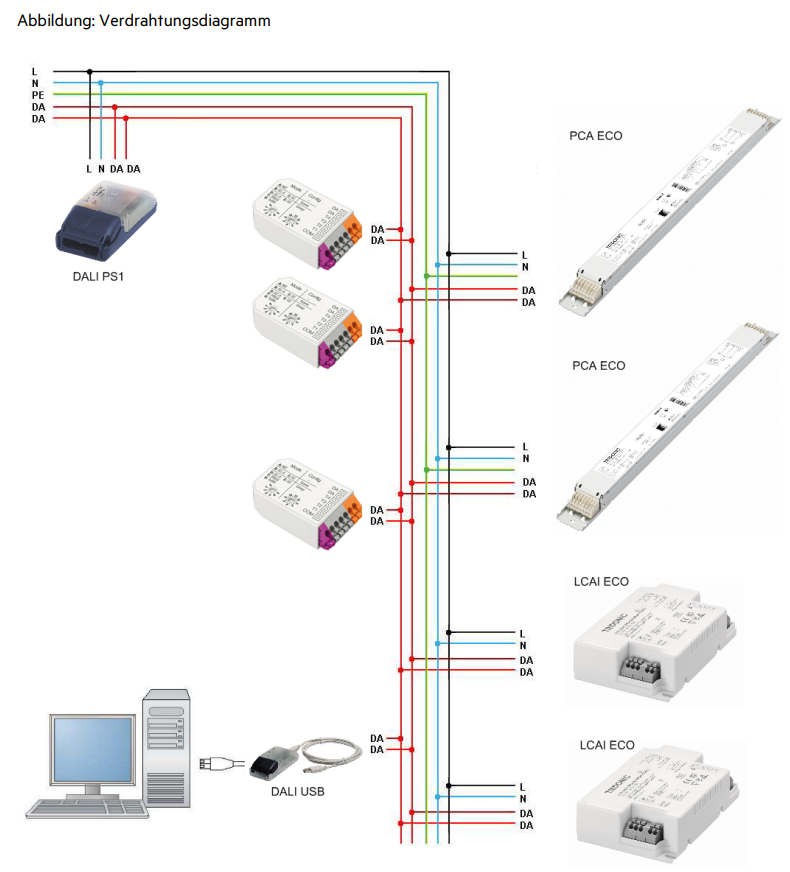

[Quelle](https://www.tridonic.com/com/de/download/technical/DALI-Handbuch_de.pdf)

---

* **Protokoll** für **lichttechnische** Betriebsgeräte
* **kein gesamtheitliches Bussystem** für Gebäudesystemtechnik
* **dezentrales** Lichtmanagement für max. 64 Teilnehmer
(Betriebsgeräte) mit frei definierbaren 16 **Gruppen** und 16 **Szenen**
* über Gateways auch in die Gebäudesystemtechnik 
  (KNX, BACnet, etc,) integrierbar


---

### Gruppen

- Mehrere Leuchtmittel werden zusammengefasst und können über eine gemeinsame Gruppen-Adresse angesprochen


[Quelle](https://www.tridonic.com/com/de/download/technical/DALI-Handbuch_de.pdf)

---

### Szenen

- Vordefinierte Einstellungen für verschiedene Gruppen und Leuchtmittel für bestimmte Situationen


[Quelle](https://www.tridonic.com/com/de/download/technical/DALI-Handbuch_de.pdf)


----

### Technische Grundlagen

* Separates Kabel mit zwei Signaleitern und Spannungsversorgung
* Spannung der Busleitung $9,5 - 22,4 \text{ V}$
* Systemstrom max. $250 \text{ mA}$ 
(zur Versorgung keiner Betriebsgeräte z.B. Steuergeräte für Schalter)
* Datenübertragungsgeschwindigkeit $1200 \text{ Baud}$
* Maximale einfache Leitungslänge $300 \text{ m}$ (bei $1.5 \text{ mm²}$)


---

### Aufbau


[Quelle](https://www.ledclusive.de/blog/anleitung-zur-dali-installation-im-privathaus-fuer-jedermann/)

---

### Merkmale von DALI

- Installation: 
  - **Versorgungs- und Steueradern** können zusammen **im selben Kabel** verlegt werden. 
  - Die **Verdrahtung** kann in Reihe, sternförmig oder in einer **gemischten Form** erfolgen.
  - Keine Polarität: Die Polarität (DA+/DA-) der DALI-Steuerleitung muss nicht beachtet werden
- **Verteilte Intelligenz**:
  - Jeder Controller arbeitet als "Master" und kontrolliert dabei die Kommunikation auf (**Multi-Master**) der Steuerleitung.
  - Gewisse **Parameter** sind dabei direkt **im DALI-Betriebsgerät** abgelegt (z.B. Szenenwerte, Gruppenadresse).


[Quelle](https://www.tridonic.com/com/de/download/technical/DALI-Handbuch_de.pdf)

---

### Technische Hintergründe


* Kodierung:  
  * [Differentieller Manchester-Code](https://de.wikipedia.org/wiki/Differentieller_Manchester-Code)
  * High Pegel (idle): $9.5  \text{ bis } 22.5 \text{ V}$
  * Low Pegel: $-6.5  \text{ bis } 6.5 \text{ V}$
* Buszugriff:   
  * Multi-Master
  * CS/MA - CA
  * Echtzeitfähig?
    * nein


[Quelle](https://infosys.beckhoff.com/index.php?content=../content/1031/tcplclib_tc3_dali/12346807435.html&id=5821349906969406832)


---

### Telegramm-Format


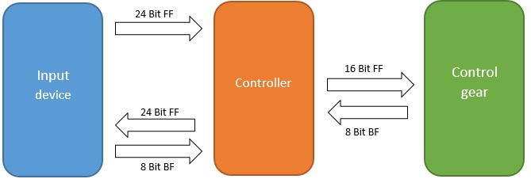


* FF: Forward Frame eines Masters
* BF: Backward Frame Antwort eines Slaves
* 16-und-24-Bit-Telegramme: Geräte zu konfigurieren, 
Parameter abzufragen oder Steuerbefehle oder Ereignisse
[Quelle](https://infosys.beckhoff.com/index.php?content=../content/1031/tcplclib_tc3_dali/12346807435.html&id=5821349906969406832)

---


[Quelle](https://www.picotech.com/library/oscilloscopes/dali-serial-protocol-decoding)

---


* `1-1-01110...`

[Quelle](https://www.picotech.com/library/oscilloscopes/dali-serial-protocol-decoding)


---

#### Stromversorgung


- Versorgt den gesamten DALI-DALI-Kreis mit **$24 \text{ V}$ Gleichstrom**
- z.B. Leuchtmittel $>5 \text{ W}$, Steuercontroller

---

#### Steuermodule

- Bieten **Eingänge für Taster** (Lichtschalter)
- Können **Logik** für die Steuerung basierend auf den Eingaben ausführen

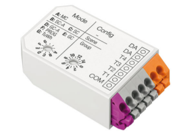

---

#### Betriebsarten von Steuermodulen


| Betriebsart |                                                                                    Beschreibung                                                                                    |
|:-----------:|:----------------------------------------------------------------------------------------------------------------------------------------------------------------------------------:|
| MC          | Einfachtaster und/oder Doppeltaster und/oder Schalter                                                                                                                              |
| SC-A        | Einfachtaster für Szenenaufruf                                                                             
| GC-A        | Einfachtaster und/oder Doppeltaster für Leuchtengruppen ein/aus/gedimmt                                                    |
| TuWh        | Doppeltaster für Intensität und Farbtemperatur von "Tunable White"                                                               |


[Quelle]([Handbuch](https://www.tridonic.com/com/de/download/technical/Manual_DALI_XC_de.pdf))


---

#### Touchpanele

- Ermöglichen **komplexere Eingaben** als einfache Taster
- **Ausgaben** möglich: z.B. aktuelle Szene mit mit Licht hinterlegen


---

#### Sensoren

- Erfassen Umweltparameter, wie **Helligkeit und Bewegungen**

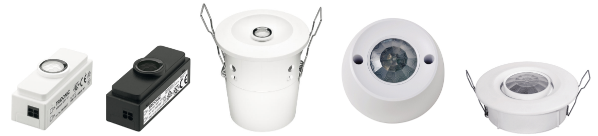


---

#### Betriebsgeräte

- Steuerung und/oder **Stromversorgung** von Leuchtmitteln (z.B. LEDs)
- Teilweise Transformatoren und Gleichrichter für $230 \text{ V | AC}$
- Mehrere Betriebsgeräte können zu **einer Gruppe zusammengefasst** werden


---


### Technischer Rahmen einer Installation

* Max. 64 DALI-Betriebsgeräte ($2^6$ Adressen)
* Max. 16 DALI-Gruppen  ($2^4$ Adressen)
* Max. 16 DALI-Szenen ($2^4$ Adressen)
* **Maximaler Strom** der Stromversorgung (DALI PS1: $200 \text{ mA}$ bzw. DALI PS2 $240 \text{ mA}$).
* Max. Leitungslänge aus **Spannungsabfall** ($2 \text{ V}$ d.h. $300 \text{ m}$ bei $1,5 \text{ mm²}$)

---

#### Stromaufnahme berechnen


- Ist die Stromversorgung stark genug für alle Betriebsmittel?
- Hierbei sind nur die Controller gemeint, die durch die DALI-Leitung versorgt werden

[Quelle](https://www.tridonic.com/com/de/download/technical/DALI-Handbuch_de.pdf)


<!--

---


##### 1. Stromaufnahme abschätzen

- Jedes Gerät im DALI-Kreis nimmt über den DALI-Kreis Strom auf (parallel)
- Die Stromaufnahme der Steuer- und Betriebsgeräte aus Datenblatt (ca. $2 \text{ mA}$).
- maximalen Strom der Stromversorgung z.B. DALI PS1 ($200 \text{ mA}$)

- Beispiel: DALI-Kreis mit 24 dimmbaren LED Treibern (LCA), 6 DALI XC
  - Gesamtstrom = Summe Stromaufnahme DALI Betriebsgeräte + Summe Stromaufnahme DALI Steuergeräte
  - Gesamtstrom = 24 x Vorschaltgeräte + 6 x DALI XC
  - Gesamtstrom = $24 x 2 \text{ mA} + 6 x 6 \text{ mA} = 84 \text{ mA}$

---

##### 2. Maximale Kabellänge berechnen

- Spannungsabfall durch Kabel darf $2 \text{ V}$ nicht überschreiten
- Berechnung des Spannungsabfalls:
  $U_v = R I =  \frac{2 \cdot l }{\gamma \cdot S}\cdot I$

  $U_v$ Spannungsabfall in V
  $I$ Strom in A
  $S$ Querschnitt in $mm^2$
  $l$ Leitungslänge in m
  $\gamma$ Elektrische Leitfähigkeit in $\frac{m}{\Omega \cdot mm }$,   bei Kupferleitungen:  $56\frac{m}{\Omega \cdot mm }$

---

- Beispiel: DALI-Kreis mit einer Leitungslänge von $300 m$ und einem Drahtquerschnitt von $1.5 mm^2$ und maximalem Strom von 250 mA

  $U_v = \frac{2 \cdot l \cdot I}{\gamma \cdot S} = \frac{2 \cdot 300 m \cdot 0.25 A}{56 \frac{m}{\Omega mm^2} \cdot 1.5 mm^2} = 1.786 V$

* Spannungsabfall über Kabel ist kleiner als $2V$

---

### Verdrahtung


- handelsübliches Installationsmaterial
- 2 Adern für DALI-Steuerkreis 

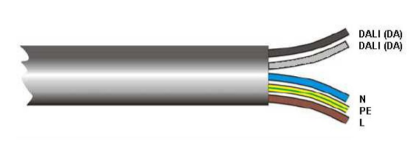

[Quelle](https://www.tridonic.com/com/de/download/technical/DALI-Handbuch_de.pdf)


---

#### Anschluss

- auf Polarität der DALI-Leitung muss nicht beachtet werden 
-  DALI-Signal ist **nicht SELV**. Es gelten die Installationsvorschriften für Niederspannung.


[Quelle](https://www.tridonic.com/com/de/download/technical/DALI-Handbuch_de.pdf)

- **Safety Extra Low Voltage**= Sicherheitskleinspannung) bezeichnet Spannungen, die aufgrund ihrer geringen Spannungshöhe und Isolierung besonderen Schutz gegen elektrischen Schlag bieten


---

### Konfiguration

* Bussysteme werden in der Regel nicht programmiert, sondern anhand von bestehenden Bausteinen einer SPS oder hersteller-spezifischer Software konfiguriert
* Jedem Gerät werden bestimmte Eigenschaftswerte zugewiesen
* Steuer-Controller:
  * Für welche Funktion ist der Schalter zuständig (Szenen, Gruppen, Dimmen)
  * Für welche Leuchtmittel und Gruppen ist der Schalter genau zuständig
* LED-Controller:
  * Zuordnung zu Szenen und Gruppen
  * Zuordnung von Leuchtwerten

-->

---

#### Software-seitige Konfiguration


Je nach Bussystem stellen verschiedene Anbieter, verschiedene Softwarelösungen bereit. 

---

##### Individualadressen und Gruppen

- jeder **DALI Teilnehmer** hat eine (von 64) **Individualadressen** 
- Mit der Individualadresse kann jedes einzelne Betriebsgerät identifiziert und angesteuert werden. 
- **Mehrkanaligen Betriebsgeräten** sind ggf. mehrere Adressen zuzuordnen (z.B. **Dimmen + Farbe** oder **Warm- + Kaltweiß**)
- Zusätzlich zu den Individualadressen bis zu **16 Gruppenadressen**

---

##### Szenen

- bis zu 16 Lichtszenen (Einstellung verschiedener Beleuchtungssituationen)
- **jedem Vorschaltgerät** kann ein **individueller Lichtwert je Szene** hinterlegt werden
- Lichtszenen **unabhängig von der Gruppenzuordnung**


[Quelle](https://www.light11.de/lightmag/lichtsteuerung/)

---


##### Farbsteuerung

- Mögliche Farbkanäle
  - RGB: **Drei Kanäle** für rote, grüne und blaue LEDs 
  - RGBW: RGB + weißen Lichtquelle (4)
  - RGBWW:  Weiß-Weiß (tunable white) für die Wärme-Steuerung des weißen Lichts (2)

- Ansteuerung:
  - DT6: Jeder **Farbkanal** hat eine **eigene DALI-Adresse**. Statt 64 können bei RGBW nur nuch 16 Leuchtmittel gesteuert werden
  - DT8: Nur eine Adresse pro Gerät


---


###  Anwendungsbeispiel Besprechungszimmer

> Besprechungszimmer für ca. 10 Personen

- 6 LED **Langfeldleuchten** und 2 LED **Downlights**.
- **je eine Gruppe** für Langfeldleuchten und Downlights
- Bedienung
  - an Tür: DALI XC (SC Modus) mit den **Szenen** „**Beleuchtung ein**" und „**Beleuchtung aus**"
  - an Fensterfront 2 DALI XC (SC und GC): Aufrufen von **vier Szenen** und das individuelle **Dimmen der beiden Leuchtengruppen**.

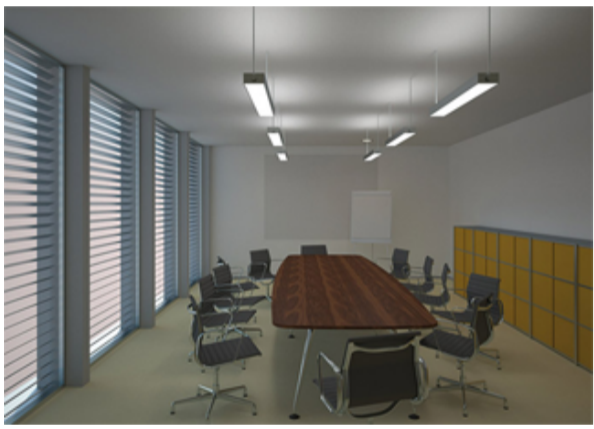

[Quelle](https://www.tridonic.com/com/de/download/technical/DALI-Handbuch_de.pdf)

---


<!--

---

#### Stückliste


| Pos.  | Stück  | Artikelbezeichnung| 
| - |- |- |
|1| 1| DALI Stromversorgung DALI PS1 / DALI PS2|
|2| 2 |DALI XC in SC Modus (Szenenkontroller) DALI XC|
|3| 1 |DALI XC in GC Modus (Gruppenkontroller) DALI XC|
|4| 6 |DALI LED Betriegsgerät für Langfeldleuchte LCAI one4all|
|5| 2 |DALI LED Betriebsgerät für LED Downlights LCAI one4all|

[Quelle](https://www.tridonic.com/com/de/download/technical/DALI-Handbuch_de.pdf)


---

#### Checkliste

| DALI Bedingung  | Im Objekt geplant / vorhanden | OK? |
| - |- |- |
|Max. 64 DALI Betriebsgeräte | 8 DALI Betriebsgeräte | |
| Max. 16 Gruppen| 2 Gruppen |
| Max. 16 Szenen | 4 Szenen |
|Strom DALI-Kreis < Nennstrom Power Supply | 34 mA | |
|Leitungslänge < 300 m (bei 1,5mm²) | ca. 20m | |
5 Adern zu jeder Leuchte  | 5 x 1,5mm² | 
|DALI LED Betriebsgerät in Leuchte |Tridonic LCAI one4all | |

[Quelle](https://www.tridonic.com/com/de/download/technical/DALI-Handbuch_de.pdf)

---

#### Gruppierung


| Komponente | Zuordnung |
| - |- |
|Downlights  |Gruppe 1 |
| Langfeldleuchten | Gruppe 2 |

- an Fensterfront DALI XC (GC):
  - individuelle **Dimmen der beiden Leuchtengruppen**.
  - 4 Taster, je zwei für jede Gruppe

[Quelle](https://www.tridonic.com/com/de/download/technical/DALI-Handbuch_de.pdf)

---


#### Szenenzuordnung

- an Tür: DALI XC (SC Modus) mit den **Szenen** „**Beleuchtung ein**" und „**Beleuchtung aus**"
- an Fensterfront 1 DALI XC (SC): 
  - Aufrufen von **vier Szenen** 
  - individuelle **Dimmen der beiden Leuchtengruppen**.

| | Bedienstelle Tür  | Bedienstelle Leinwand |G1 | G2  |
|- |- |-| - | - |
| Szene 1 |  Licht aus | Licht aus | 0 % | 0% |
| Szene 2 |  Licht 100 % | Licht 100 %  | 100% | 100% |
| Szene 3 |  nicht verdrahtet  | Präsentation | 50% | 20 %|
| Szene 4 |  nicht verdrahtet  | Besprechung | 0% | 100% |

[Quelle](https://www.tridonic.com/com/de/download/technical/DALI-Handbuch_de.pdf)

---


#### Inbetriebnahme

- Die Programmierung kann auf zwei Arten erfolgen
  - **Schalter im Programmiermodus**
  - **PC-Anbindung** mit Software

[Quelle](https://www.tridonic.com/com/de/download/technical/DALI-Handbuch_de.pdf)
---

#### Ergebnis


[Quelle](https://www.tridonic.com/com/de/download/technical/DALI-Handbuch_de.pdf)

---

#### DALI 2


- abwärtskompatibel
- Input Devices (Sensoren) kommunizieren nicht mehr direkt mit DALI-Treibern an Leuchtmitteln
- Application controller verarbeiten zuerst (Multimaster Prinzip)
- Kollisions-Erkennung

-->

---


## Ausfallsicherheit

* da Bussysteme aus mehreren Komponenten bestehen, wird das Fehlermanagement komplexer
* Single-Point-of-Failure: Ein Teil des Systems, dessen Ausfall zum Totalversagen führen kann
* Neben redundanter Auslegung kann eine Fehler-Analyse helfen resiliente Systeme zu entwerfen


---


### Einfluss-Analyse

* *was-wäre-wenn*?
* Für jede Komponente wird untersucht: was passiert, wenn diese Komponente ausfällt
* Was wäre der gewünschte Zustand des Systems? (i.d.R. festgelegt durch die Aktoren)

---

#### Beispiel: Beleuchtung in Treppenhäusern


- Licht sollte nicht ohne Bedarf brennen
- Licht kann über Taster, Bewegungsmelder oder GLT aktiviert werden
- In der GLT kann der Systemzustand überwacht werden
- im Falle eines Notfalls muss das Licht in jedem Fall brennen

---


<!-- _class: white -->

---

#### Buskomponenten 


| Komponente \ Aktoren | 1 Beleuchtung Notausgang | 2 Anzeige Gebäudeleittechnik | Wie wird 1 erreicht? | Wie wird 2 erreicht? |
|---|---|---|---|---|
| LED | AN | Defekte Lampe wird angezeigt | |  |
| Vorschaltgerät | AN | Defektes Vorschaltgerät wird angezeigt |  | |
| Stromversorgung | AN | Ausfall wird angezeigt |  | |
| Busleitung | AN | Störung wird angezeigt |  | |

---

| Komponente \ Aktoren | 1 Beleuchtung Notausgang | 2 Anzeige Gebäudeleittechnik | Wie wird 1 erreicht? | Wie wird 2 erreicht? |
|---|---|---|---|---|
| Steuercontroller | AN | Defekter Steuercontroller wird angezeigt |  | |
| Taster | AN | Defekter Taster wird angezeigt |  | |
| Bewegungsmelder | AN | Defekter Taster wird angezeigt |  | |

---


| Komponente \ Aktoren | 1 Beleuchtung Notausgang | 2 Anzeige Gebäudeleittechnik | Wie wird 1 erreicht? | Wie wird 2 erreicht? |
|---|---|---|---|---|
| LED | AN | Defekte Lampe wird angezeigt | |  |

* 1: Nur durch Redundanz möglich
* 2: Das Vorschaltgerät muss in der Lage sein den Ausfall der LED zu erkennen und an die GLT übermitteln

---

| Komponente \ Aktoren | 1 Beleuchtung Notausgang | 2 Anzeige Gebäudeleittechnik | Wie wird 1 erreicht? | Wie wird 2 erreicht? |
|---|---|---|---|---|
| Vorschaltgerät | AN | Defektes Vorschaltgerät wird angezeigt |  | |

* 1: i.d.R. Nicht möglich
* 2: Regelmäßiges ansprechen des Vorschaltgerät durch GLT. Meldung bei nicht erreichen


---

| Komponente \ Aktoren | 1 Beleuchtung Notausgang | 2 Anzeige Gebäudeleittechnik | Wie wird 1 erreicht? | Wie wird 2 erreicht? |
|---|---|---|---|---|
| Stromversorgung | AN | Ausfall wird angezeigt |  | |
* 1: i.d.R. Nicht möglich
* 2: Regelmäßiges Ansprechen des Vorschaltgerät durch GLT. Meldung bei nicht erreichen

---

| Komponente \ Aktoren | 1 Beleuchtung Notausgang | 2 Anzeige Gebäudeleittechnik | Wie wird 1 erreicht? | Wie wird 2 erreicht? |
|---|---|---|---|---|
| Busleitung | AN | Störung wird angezeigt |  | |


* 1: Bei Fehlersignal auf Busleitung schaltet das Vorschaltgerät an
* 2: Regelmäßiges Ansprechen des Gateways durch GLT. Meldung bei Problemen


---

| Komponente \ Aktoren | 1 Beleuchtung Notausgang | 2 Anzeige Gebäudeleittechnik | Wie wird 1 erreicht? | Wie wird 2 erreicht? |
|---|---|---|---|---|
| Steuercontroller | AN | Defekter Steuercontroller wird angezeigt |  | |

* 1: Bei Ausbleiben eines Steuerbefehls an Vorschaltgerät für länger als konfigurierte Zeit wird dies als Befehl zum Anschalten interpretiert 
* 2: Regelmäßiges Ansprechen des Steuercontrollers durch GLT. Meldung bei nicht erreichen


---

| Komponente \ Aktoren | 1 Beleuchtung Notausgang | 2 Anzeige Gebäudeleittechnik | Wie wird 1 erreicht? | Wie wird 2 erreicht? |
|---|---|---|---|---|
| Bewegungsmelder / Taster | AN | Vermuteter Defekt wird angezeigt |  | |

* 1: Bei Ausbleiben eines Steuerbefehls an Vorschaltgerät für länger als konfigurierte Zeit wird dies als Befehl zum Anschalten interpretiert 
* 2: Bei längerem Ausbleiben eines Steuerbefehls der Steuercontroller wird eine Warnung angezeigt


---

## Rechercheaufgabe: Gebäudebussysteme und ihre Anwendungsfälle

Jeder recherchiert ein spezifisches Gebäudebussystem und beschreibt einen praxisnahen Anwendungsfall, um ein tiefgehendes Verständnis für die Funktionsweise und Einsatzmöglichkeiten von Bussystemen in der Gebäudeautomation zu entwickeln.

--- 

### Aufgabenbeschreibung

- Wählen Sie eines der folgenden Gebäudebussysteme aus: KNX, BACnet, Modbus, M-Bus, LON, LCN, SMI, DMX, ZigBee, EnOcean, Z-Wave, WirelessHART, WirelessKNX, Wireless M-Bus, LoRaWAN.
- Alternativ können Sie ein anderes Gebäudebussystem mit Rücksprache des Dozenten wählen.
- Jedes Bussystem darf nur von einem Studierenden bearbeitet werden.
- Recherche des Bussystems: Beschreiben Sie die folgenden Aspekte des gewählten Bussystems:

--- 

### Technische Grundlagen:

- Welche Übertragungsmedien (z. B. Twisted Pair, Funk, Ethernet, Funk) werden verwendet
- Welche Baudrate, Spannungslevel, Leitungscodes oder Codierungsverfahren auf Wellen sind typisch?

### Buszugriff und Kommunikation:

- Welches Buszugriffverfahren (z. B. Master/Slave, Multi-Master, CSMA/CA) wird genutzt?
- Wie ist der Telegrammaufbau strukturiert?

---

### Hauptanwendungsbereiche:

- In welchen Bereichen der Gebäudeautomation wird das System eingesetzt (z. B. Beleuchtung, Heizung, Zählerdaten)?

### Vorteile und Einschränkungen:

- Was sind die Stärken und Schwächen des Systems im Vergleich zu anderen Bussystemen?
- Welche **Auswahlkriterien** aus der Planungsphase (Kap. 1.2) sind besonders relevant: Kosten, Offenheit, Erweiterbarkeit, Wartbarkeit, Herstellerbindung?
- Ist das System kompatibel mit den Energieeffizienzanforderungen nach **EN 15232** (z.B. Klasse A: Einzelraumregelung mit Kommunikation)?
- Nutzen Sie mindestens drei verlässliche Quellen (z. B. Herstellerseiten, Fachliteratur, wissenschaftliche Artikel). Geben Sie alle Quellen in einer Literaturliste an.

---

### Beschreibung eines Anwendungsfalls:

- Entwickeln Sie einen konkreten, praxisnahen Anwendungsfall für das gewählte Bussystem. Beispiele:
Steuerung der Beleuchtung in einem Bürogebäude (DALI).
- Überwachung der Raumtemperatur in einem Schulgebäude (KNX).
- Erfassung von Verbrauchsdaten in einem Wohnkomplex (M-Bus).

---

### Beschreibung eines Anwendungsfalls:

- Beschreiben Sie den Anwendungsfall detailliert:
  - Szenario: Welche Umgebung und Anforderungen gibt es (z. B. Büro mit 20 Arbeitsplätzen, variable Beleuchtung)?
  - Komponenten: Welche Geräte (Sensoren, Aktoren, Controller) werden eingesetzt?
  - Funktionsweise: Wie kommunizieren die Komponenten? Welche Daten werden übertragen?
  - Nutzen: Welche Vorteile bietet das Bussystem in diesem Szenario (z. B. Energieeinsparung, Flexibilität)?

---

### Präsentation der Ergebnisse:

- Erstellen Sie eine Präsentation (max. 3 Folien).
- Kurze Vorstellung des Bussystems mit Technische Details: Zusammenfassung der recherchierten Aspekte.
- Anwendungsfall: Detaillierte Beschreibung des Szenarios.
- Fazit: Bewertung der Eignung des Systems für den Anwendungsfall.
- Literaturliste: Auflistung aller verwendeten Quellen (z. B. im APA-Format).
- Bereiten Sie eine kurze mündliche Präsentation (max. 5 Minuten) vor, in der Sie Ihre Ergebnisse der Gruppe vorstellen.

---

### Abschlussfrage (Kreis schließen)

> Am Anfang des Kurses haben Sie in **Aufgabe 1_2_1** ein Raumautomations-Schema für eine Treppenhausbeleuchtung gezeichnet.

- Welches der in der Klasse präsentierten Bussysteme würden Sie für diese Anlage wählen?
- Begründen Sie Ihre Wahl mit mindestens zwei konkreten Kriterien (z.B. Baudrate, Topologie, Kosten, Norm-Kompatibilität).
- Ergänzen Sie Ihr Raumautomations-Schema aus Aufgabe 1_2_1 um die Angabe des gewählten Bussystems und des Übertragungsmediums.

---

### Hinweise

Arbeiten Sie eigenständig, um ein tiefes Verständnis zu entwickeln. Nutzen Sie Herstellerseiten (z. B. Tridonic für DALI, KNX Association für KNX) und technische Dokumentationen als Hauptquellen. Bei Fragen zur Auswahl des Bussystems oder des Anwendungsfalls wenden Sie sich frühzeitig an den Dozenten.

---

## KNX

### Lernziele

- Studierende können das Einsatzgebiet eines KNX-Systems beschreiben
- Studierenden können typische Aktoren und Sensoren eines KNX-Systems benennen

---

### 🧠 KNX Eigenschaften


- ein Feldbus zur Gebäudeautomation
- Fokus zunächst auf **Raumautomation**
- Nachfolger des Europäischen
Installationsbus (EIB)
- [Einführende Erklärung](https://www.knx.org/wAssets/docs/downloads/Marketing/Flyers/KNX-Basics/KNX-Basics_de.pdf)


[Quelle](https://www.knx.org/wAssets/docs/downloads/Marketing/Flyers/KNX-Basics/KNX-Basics_de.pdf)

--- 

### 🧠 Feldbus-Systeme zur Gebäudeautomation

- KNX **trennt** die **Gerätesteuerung** und **Stromversorgung** 
- Stromversorgung mit Wechselspannung (rot)
- Steuerungsnetz (=EIB/KNX-Bus - grün) mit $30 \text{V DC}$


[Quelle](https://upload.wikimedia.org/wikipedia/commons/thumb/3/39/EIB_Verkabelung-1.png/1920px-EIB_Verkabelung-1.png)

---

### 🧠 Sensor-Aktor-Prinzip

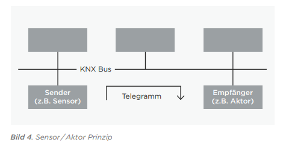

[Quelle](https://www.knx.org/wAssets/docs/downloads/Marketing/Flyers/KNX-Basics/KNX-Basics_de.pdf)

* **Sensoren erkennen Ereignisse** im Gebäude (Tastenbetätigung,
Bewegung, Über-/Unterschreitung eines Temperaturwerts etc.) und wandeln diese in
* Telegramme (Datenpakete) um
* **Aktoren** empfangen Telegramme und wandeln diese in **Aktionen** um
* Multi-Master-System: Alle Sensoren sind Master 
* [CSMA/CA](https://de.wikipedia.org/wiki/Carrier_Sense_Multiple_Access/Collision_Resolution) (für Funkübertragungen) bzw. [CSMA/CR-Prinzip](https://de.wikipedia.org/wiki/Carrier_Sense_Multiple_Access/Collision_Avoidance) (für kabelgebundene Übertragungen)

---

#### 🧠 KNX Ablauf


- findet ein **Ereignis** statt, **sendet der Sensor die Nutzinformation** (z.B. Schalter wurde geschaltet oder Windgeschwindigkeit beträgt 8km/h) 
- **alle Aktoren** hören die Busleitung ab und regieren, wenn Sie angesprochen wurden mit der **vorprogrammierten Handlung**
- Vorteil: Dezentralität - keinen Totalausfall
- Nachteil: gesteigerte Programmieraufwand. Jeder Teilnehmer muss mit einem Programmiergerät adressiert sowie mit der Applikation, den Parametern und Gruppenadressen programmiert werden. 


---

#### Sensoren und Aktoren


[Quelle](https://www.knx.org/wAssets/docs/downloads/Marketing/Flyers/KNX-Basics/KNX-Basics_de.pdf)

---

#### 🧠 Dezentralität

* bei KNX ist kein zentrales Steuergerät notwendig
* **Intelligenz** über **alle Teilnehmer** verteilt 
  (jedes Gerät hat mindestens einen Mikroprozessor)
* Ausfallsicherheit
* **Zentrale Geräte**, wie SPS möglich

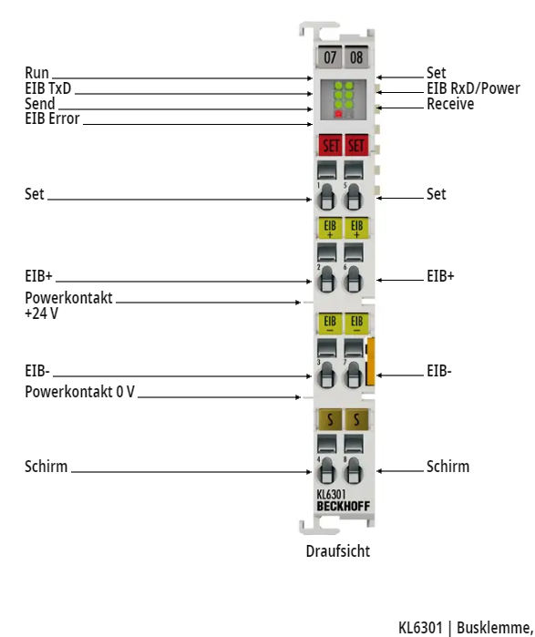


---

### Maximalgröße

- Mindestens ein Sensor und Aktor
- theoretisch mehr als 50.000 Teilnehmer möglich
- Erweiterung einer Anlage muss einer vorgeschriebenen Topologie folgen (vgl. Subnetting bei TCP/IP-Netzen)


---

### Übertragungsmedien

- KNX **Twisted Pair** (KNX TP): 
verdrillte Zweidrahtdatenleitung (Busleitung)
- KNX **Powerline** (KNX PL, "D-Lan"): 
Übertragung über das vorhandene 230 V-Netz
- KNX **Radio Frequency** (KNX RF): 
Übertragung über Funk
- KNX IP: 
Übertragung über **Ethernet**


---

#### KNX Zweidraht (TP) 

- Busleitung versorgt alle Busteilnehmer mit Daten und Betriebsspannung ($24 \text{V DC}$). 
- Die Spannungsversorgungen speisen 30 V in das System ein. 
- Busteilnehmer arbeiten bei Spannungen zwischen $21 \text{ bis }30 \text{V}$ fehlerfrei.

---

#### Telegrammaufbau - KNX-TP


- **Kontrollfeld** die **Priorität**, ob ein Telegramm wiederholt wurde
- **Adressfeld** physikalische Adresse des Senders
und Empfängers (Physikalische **Adresse**
oder **Gruppenadresse**)
- Datenfeld bis 16 Byte Nutzdaten
- Sicherungsfeld  für Paritätsprüfungen
- zufälliger Buszugriff: **CSMA/CA-Verfahren** 
(Carrier Sense Multiple Access / Collision Avoidance )

---


### Kopplung bei komplexeren Aufbauten


- häufig **hierarchische** Topologien
- **Ethernet** als leistungsfähiger **Backbone** und für komplexe (KNX IP) Geräte
- **KNX TP, KNX PL und KNX RF** für Anbindung **verteilter Sensoren und Aktoren**

---

#### 🤓 Hierarchie 

- Linie: kleinste Installationseinheit bei KNX TP mit Spannungsversorgung und 64 Busteilnehmer
- Linien sind durch Drosseln voneinader getrennt
- bis 15 Bereiche können über Bereichskoppler an
einer Bereichslinie zu einem Gesamtsystem erweitert werden

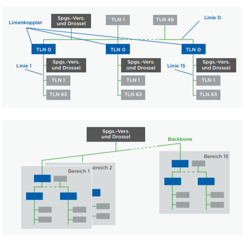


---


#### 🤓 Physikalische Adressen


- jedes Gerät hat eine Nummer ```Bereich.Linie.Gerät```

- Beispiele:
  - 1.5.0: Systemkoppler, der die fünfte PL-Linie mit der TP-Hauptlinie im ersten Bereich koppelt.
  - 2.3.20: Busteilnehmer mit der laufenden Nummer 20 in der dritten Linie des zweiten Bereichs

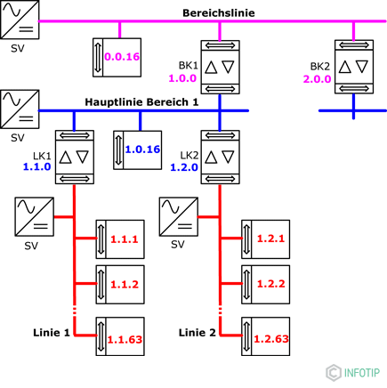


[Quelle](https://kompendium.infotip.de/knx-installationsbus.html)


---

#### 🤓 Gruppenadressen

- Aktoren und Sensoren können Gruppen zugeordnet werden
- Hierbei gibt es drei Ebenen also z. B.:
  [Keller – Abstellraum – Rauchwarnmelder – Testalarm]
  [EG – Küche – Rollladen – Auf/Ab]
  [Garage – Werkbank – Wandlicht – Status]


[Quelle](https://kompendium.infotip.de/knx-installationsbus.html)

---

### Einbau KNX im Schaltschrank


[Quelle](https://kompendium.infotip.de/knx-installationsbus.html)


---

#### Einbau Sensoren und mechanische Aktoren


- mechanische Aktoren und Sensoren werden im Feld verbaut

[Quelle](https://kompendium.infotip.de/knx-installationsbus.html)


---


#### 🧠 Konfiguration KNX


- kommerzielle, herstellerunabhängige
**Engineering Tool Software ETS®**
- erlaubt die Planung, Projektierung
und Inbetriebnahme


[Quelle](https://www.knx.org/knx-de/fuer-fachleute/software/software-vergleichen/)

---

##### 🤓 Produkte importieren

- damit angeschlossene Produkte bekannt sind 
- Katalog im **knxprod-Format** wird importiert
- knxprod-Dateien i.d.R. auf Herstellerwebsite

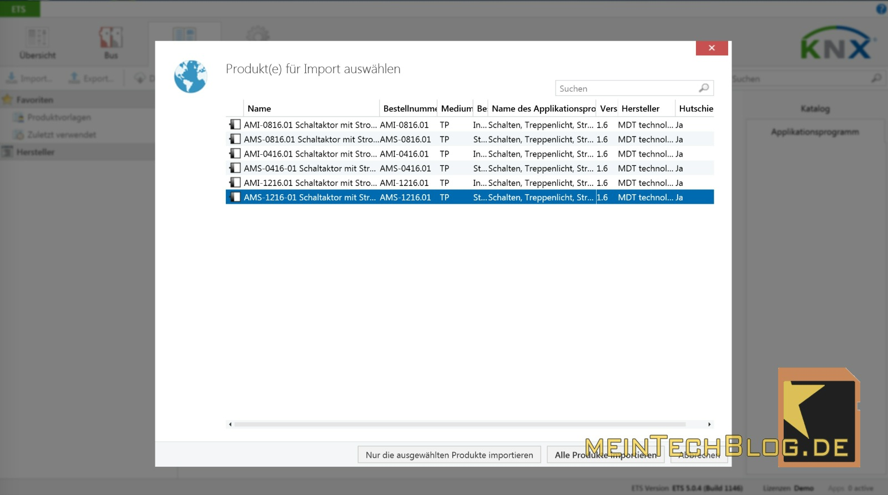

[Quelle](https://www.meintechblog.de/2015/04/knx-aktor-in-10-schritten-mit-ets5-programmieren/)

---

##### Gruppenadresse zuweisen


[Quelle](https://www.meintechblog.de/2015/04/knx-aktor-in-10-schritten-mit-ets5-programmieren/)

---

##### Werte und Funktionen zuweisen


[Quelle](https://www.meintechblog.de/2015/04/knx-aktor-in-10-schritten-mit-ets5-programmieren/)

---

#### Zukunft von KNX


- Trend zu Vernetzung auf IP-Ebene
- Datenraten nicht für Multimedia geeignet
- Gewachsenes Ökosystem mit vielen Anbietern (Netzwerkeffekte)
- Lebensdauer von Gebäudeautomatsierung eher lang
- [▶️ voltus: KNX-Grundlagen](https://www.youtube.com/playlist?list=PLcXIjZgo0R3CeV13eEeSCNRdFl54hdsY6)

---

## Building Automation and Control networks (BACnet)

---

### 🧠 BACnet

-   entwickelt durch American Society of Heating,
Refrigeration, and Air Conditioning Engineers Inc
- Fokus zunächst auf **Heizungs-, Lüftungs- und Klimatechnik** 
- Verbindung von
  - **Feldebene** - Fühler und Antriebe 
  - **Automations**- (DDC-Geräte, Controller)
  - **Managementebene** (Gebäudeleittechnik)


---

### Anwendungsgebiet BACnet

- **Protokoll** kann auf **beliebigen** Betriebssystemen und Hardware-Plattformen implementiert werden
- **standardisiert auch komplexe Transaktionen** (z.B. Alarm-Routing, Historisierung, Überwachung des Gerätestatus, Zeit- und Kalenderfunktionen, Datensicherung etc.)
- kein Plug-And-Play System wie KNX
- keine fertigen Objekte mit standardisierter Funktion

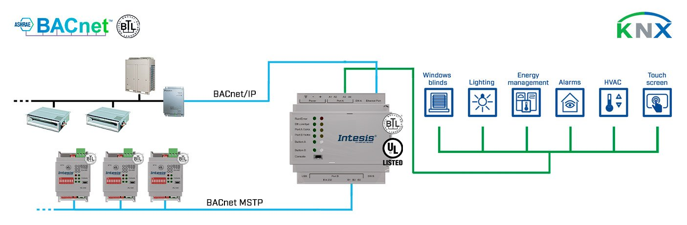

[Quelle](https://www.intesis.com/de/produkte/protocol-translator/knx-gateways/knx-tp-gateway-f%C3%BCr-bacnet-ip-ms-tp-client?ordercode=INKNXBAC1000000)

---

### Objektorientierung

- **Reale Geräte** und **konzeptuelle Objekte** 
können mittels Objekten abgebildet werden
  - Output-Objekttypen: physikalische Ausgänge wie einen 0-10V-Ausgang oder einen Prozentsatz eines Ventil-Aktors.
  - Input-Objekttypen: physischen Hardware-Eingang, der mit dem Gerät verbunden ist, z. B. ein Temperatur- oder Helligkeitssensor
  - Value-Objekttypen: virtuelle Informationen wie einen Sollwert oder einen Regelparameter darzustellen.


---

#### Objektorientierung am Beispiel binärer Eingang

Bisher: Ein Eingang  - eine Variable/Wert:

```PASCAL
bInAnwesenheitErkannt : BOOL;
bInAnwesenheitErkannt := True;

```

Mit BACnet werden Objekte [detaillierter](https://download.beckhoff.com/download/Document/certificates/beckhoff_bacnet_ip_pics_en_rev14_ver4.0.pdf) beschrieben:

```Python
bInAnwesenheitErkannt = { "Object_Identifier" : 0, 
                          "Object_Name" : "Anwesenheitssensor",
                          "Present_Value" : True,
                          "Out_of_Service " : False
                          }
```


---


#### Objekt-Typen

- Konformitätsklassen müssen gewisse Objekte bereitstellen


[Quelle]( https://www.ta.hu-berlin.de/res/co.php?id=14081)


---

#### Darstellung eines BACnet-Objects (Analog Value) in Twincat


[Quelle](https://download.beckhoff.com/download/document/automation/twincat3/TF8020_TC3_BACnet_DE.pdf)

---

#### Darstellung eines BACnet-Objects (Analog Value) als Funktionsbaustein


[Quelle](https://infosys.beckhoff.com/index.php?content=../content/1031/tcbacnet/12748477963.html&id=)

---

#### Weitere Objekt-Typen aus ISO-Norm 16484-5

```
Access Credential, Access Door, Access Point, Access Rights
Access User, Access Zone, Accumulator,  Alert Enrollment
Analog Input, Analog Output, Analog Value, Averaging
Binary Input, Binary Lighting Output, Binary Output, Binary Value
BitString Value, Calendar, Channel, CharacterString Value
Command, Credential Data Input, Date Pattern Value
Date Value, DateTime Pattern Value, DateTime Value
Device, Elevator Group, Escalator, Event Enrollment
Event Log, File, Global Group, Group, Integer Value, Large Analog Value
Life Safety Point, Life Safety Zone, Lift, Lighting Output
Load Control, Loop, Multi-state Input, Multi-state Output
Multi-state Value, Network Port, Network Security, Notification Class
Notification Forwarder, Octetstring Value, Positive Integer Value, Program
Pulse Converter, Schedule, Structured View, Time Pattern Value
Time Value, Timer, Trend Log, Trend Log Multiple
```

---

### BACnet Dienste (Services) 

- ca. 40 **Services** beschreiben, wie Geräte 
  Informationen austauschen
- fünf Bereiche
  - Objektzugriff
  - Filetransfer
  - Alarm- und Event-Funktionen
  - Remote Device Management
  - Virtual Terminal
  
* Je nach Geräteprofil sind gewisse Dienste vorgeschrieben
* Ein **Sensor** (Geräteprofil) sollte einen **Alarm** (Dienst) auslösen können
* Der Alarm könnte auf einen **Analogwert** oder dem **Mittwert eines Analogwertes** basieren

[Quelle](saia-burgess Controls 2011 - BACnet Workshop)

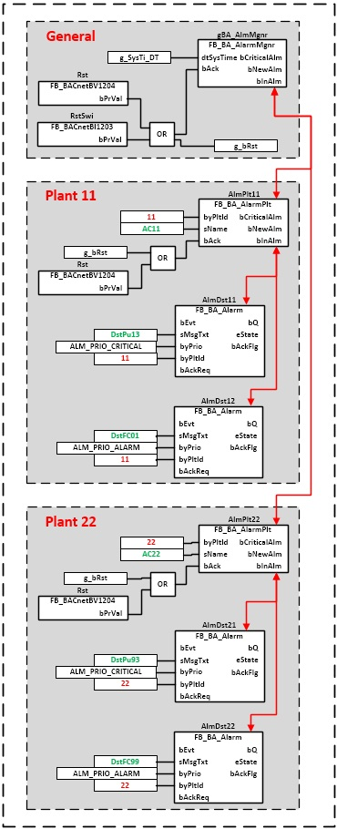

---


### "Bus"-Eigenschaften

- 22 Bit für Adressierung (ca. **4 Mio Adressen**)
- Twisted Pair (max $1200 \text{ m}$) oder Ethernet möglich
-  Master/Slave mit Token Passing
- **Server-Client Prinzip** 
  - jeder Teilnehmer kann Services 
der anderen als Client aufrufen


---

## Weitere Bussysteme im der Gebäudeautomatisierung

---

### Modbus

- De-facto-Standard für SPS in der **Automatisierung**
- Master-Salve-Architektur
- Teilweise auch in Gebäudeautomatisierung eingesetzt


[Quelle](https://vutlan.com/blog/post/modbus-tcpip-modbus-rtu-readwrite-support.html)

---

### M-Bus

- Europäischer Standard (genormt in EN 13757) für ein Kommunikationssystem zur Zählerdatenübertragung 
- Typische Anwendungen: Gaszähler, Stromzähler, Wärmezähler, Wasserzähler, Rauchmelder
- $300 \text{ bis } 9600 \text{ Baud}$
- Master-Slave-Architektur
- Sämtliche Hersteller von M-Bus-Zählern bieten den Download der Spezifikation der übertragenen M-Bus-Daten ihrer Zähler an. 

---

### Local Operating Network (LON) 

- neutralen **Informationsaustausch zwischen Anlagen und Geräten von verschiedensten Herstellern**
- Logikknoten (Nodes) in Sensoren, Aktoren und Controller
- **Dezentrales Multi-Master System** basierend auf den Aktionen der Nodes
- Programmierung über LonTool


[Quelle](https://download.beckhoff.com/download/document/Application_Notes/DK9221-0111-0038.pdf)

---

###  Local Control Network (LCN)

- proprietäres **Gebäudeautomationssystem** für Wohn- und Zweckbauten (Issendorff KG)
- **dezentral über identische LCN-Module**
- eine LCN-Programmiersoftware LCN-PRO


[Quelle](https://www.lcn.eu/lcn-bus/installation/)

---


### Standard Motor Interface (SMI)

- kein volles Gebäudebussystem
- Ergänzung als **Schnittstelle** zu
  - **Rollladen- und Sonnenschutzantriebe** 
  - **Fensterantriebe**
- Software SMI-easyMonitor


[Quelle](https://standard-motor-interface.com/)

---

#### Funktionsweise von Innen- und Außenbeschattung


- Lamellen-Nachführung (Blendschutz und Energieoptimierung)
- Verschattungs-Korrektur (Energieoptimierung)
- Witterungsautomatik (Produktschutz)
- Thermoautomatik (Energieoptimierung)
- Zeitprogramme (Automatisierung von repetitiven Aufgaben)
- Schockautomatik (Einbruchschutz)


[Quelle](https://standard-motor-interface.com/wp-content/uploads/2020/10/160224_SMI_Planungshandbuch_DE.pdf)


----

### DMX (Lichttechnik)

- **Bühnenbeleuchtung** 
- auch in der Architekturbeleuchtung
- verdrillten, geschirmten, zweiadrigen Steuerleitung **als Strang**


---

#### Teilnehmer und Adressierung

- viele Teilnehmer 
- ggf. unter Verwendung von mehreren Repeatern
- **Adressierung** erfolgt **am Betriebsgerät** (Dip-Schalter oder Software)


[Quelle](https://www.reichelt.de/it/de/dip-schalter-liegend-10-polig-nt-10-p13535.html)


---

### Auswahl funk-basierter Feldbussysteme

- häufig genutzte Frequenzbänder liegen bei 433 MHz (Babyphone, Rauchmelder), 868 MHz (Alarmanlagen) und 2,4 GHz (WLan). 
- **Frequenz** korreliert **positiv mit Übertragungsrate**
und **negativ mit Reichweite**


[Quelle](https://trendblog.euronics.de/smart-home/funkstandards-im-smart-home-teil-1-woran-wlan-und-bluetooth-kranken-50589/)

---

### ZigBee (Connectivity Standards Alliance)

- für geringe Datenmengen
- geringer Energieverbrauch
Anwendungen in Wohn- und Nichtwohngebäuden
- Sensorabstände bis $100 \text{ m}$
- Ad-hoc-Netzwerk über ZigBee-Router
- Steuerung von Audio-Video-Technik, Waschmaschinen, Kaffeeautomaten
- [evtl. Weiterentwicklung in Matter](https://matter-smarthome.de/)
---

### Bluetooth (Low Energy)

- Industriestandard für kurze Funkdistanz (WPAN)
- Smartphone-Steuerung, Audiotechnik
- Ad-hoc-Netzwerk über Bluetooth Mesh
- Verschiedene Ausprägungen (Reichweite, Energieverbrauch, etc.)

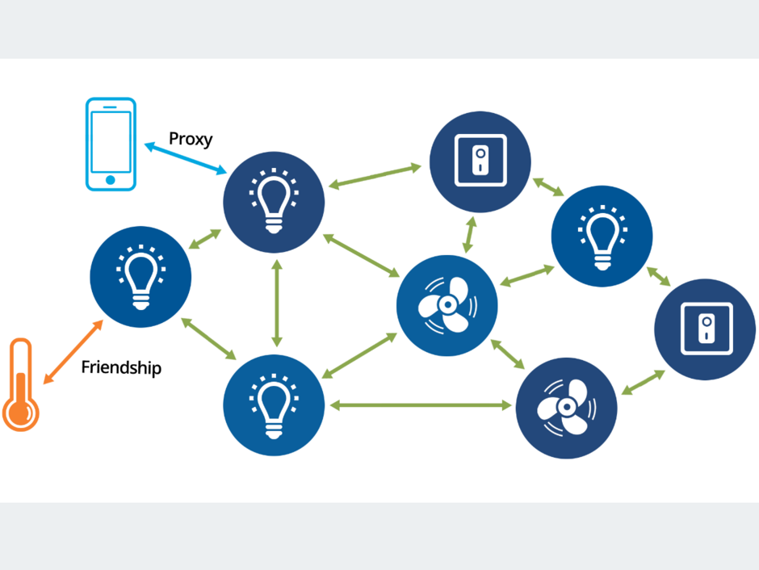

[Quelle](https://www.all-electronics.de/elektronik-entwicklung/bluetooth-mesh-lichtsteuerung-kontrolliert-smart-building-system.html)

---


### Enocean


- herstellerübergreifenden Standard mit batterieloser bidirektionaler Funktechnik
- kosten- und zeitsparende Installation
- Sensoren und Schalter (Piezoelektrizität) beziehen Energie aus Umgebung
- Sensoren für Temperatur, Helligkeit, Bewegung
- Aktoren als Schalter, Relais, Dimmer


[Quelle](https://de.wikipedia.org/wiki/Enocean)

---

### Weitere

- **Z-Wave** funkbasierter Standard für Wohngebäude
Steuerung von Heizung, Lüftung, Klimaanlagen, Beleuchtung, Sicherheitstechnik

- **WirelessHART** Kommunikation für industrielle Feldgeräte, Anwendung für große Distanzen

- **WirelessKNX** einfache Nachrüstung von KNX-Komponenten über Funk-Buskoppler

- **Wireless M-Bus** europäischer Standard für drahtlose Kommunikation zwischen Zählern für Strom, Gas, Wärme, Wasser

- **WLAN** einbindung einzelner Produkte. Hoher Energieverbrauch. 

- **Long Range Wide Area Network** (LoRaWAN) energieffizientes Senden kleiner Datenmengen über große Strecken

