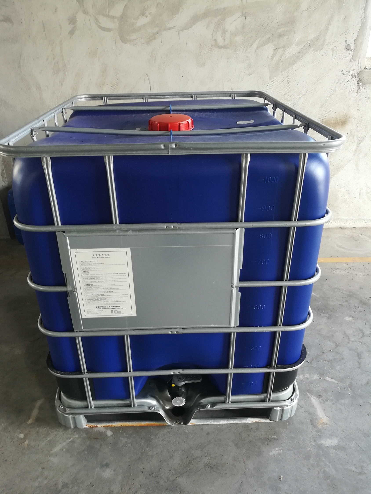
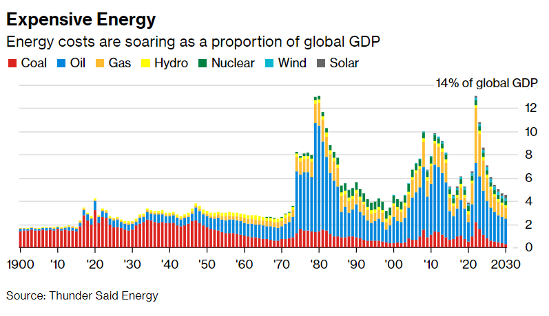
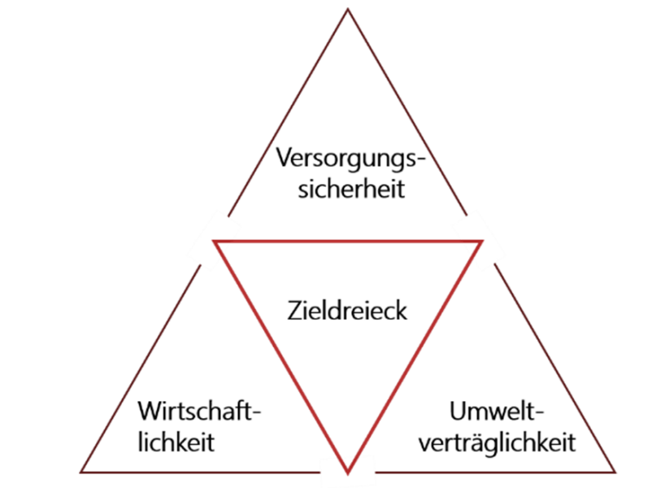
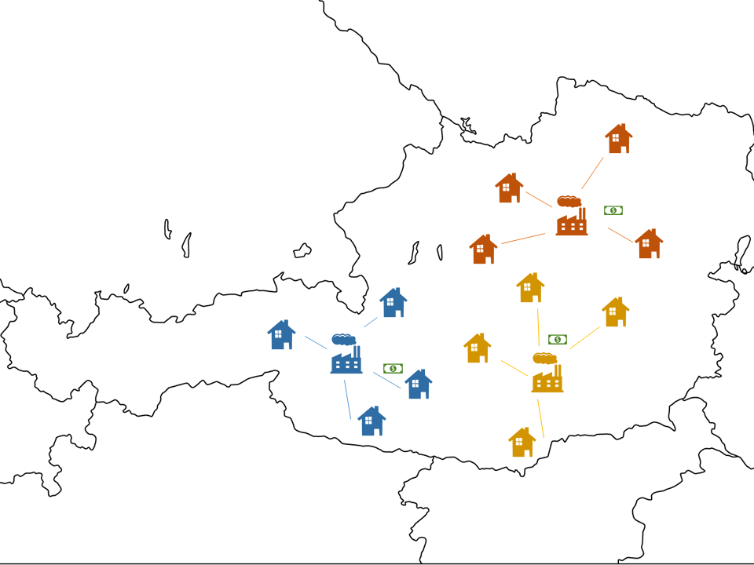
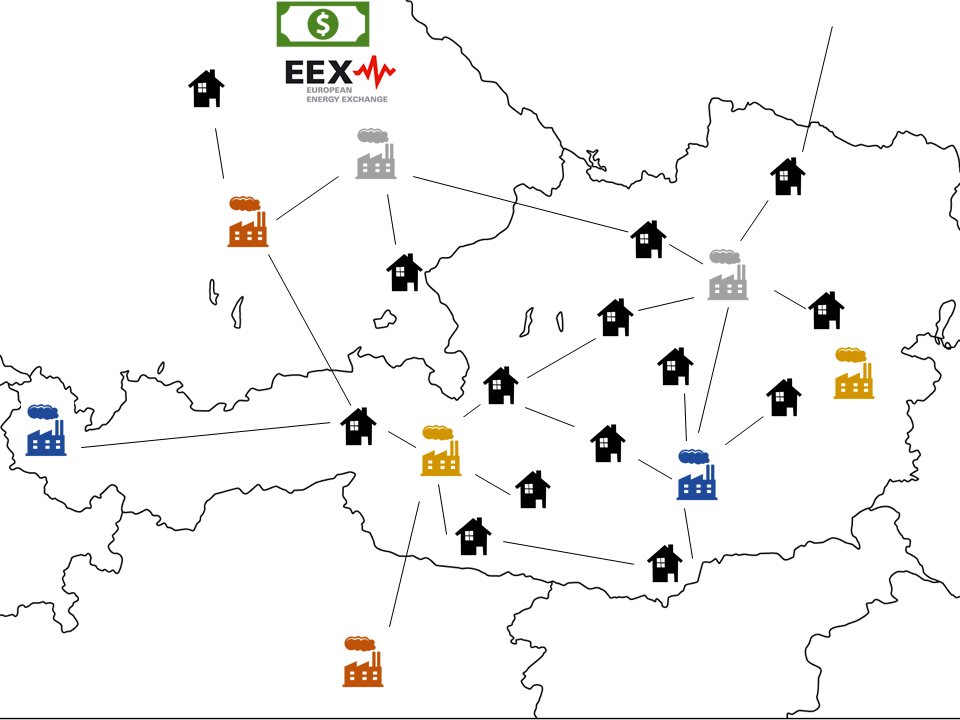
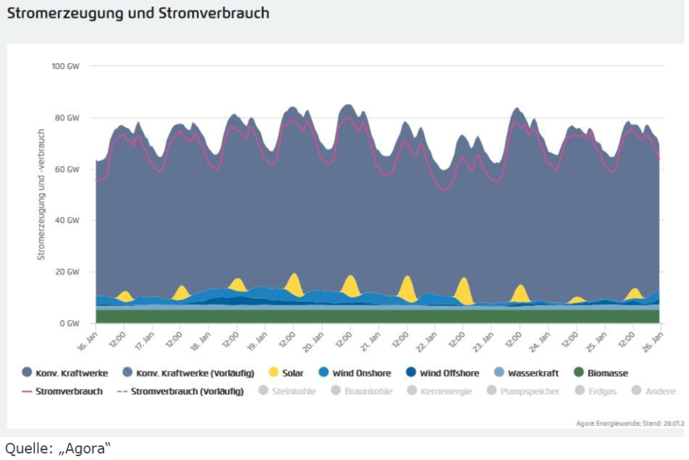
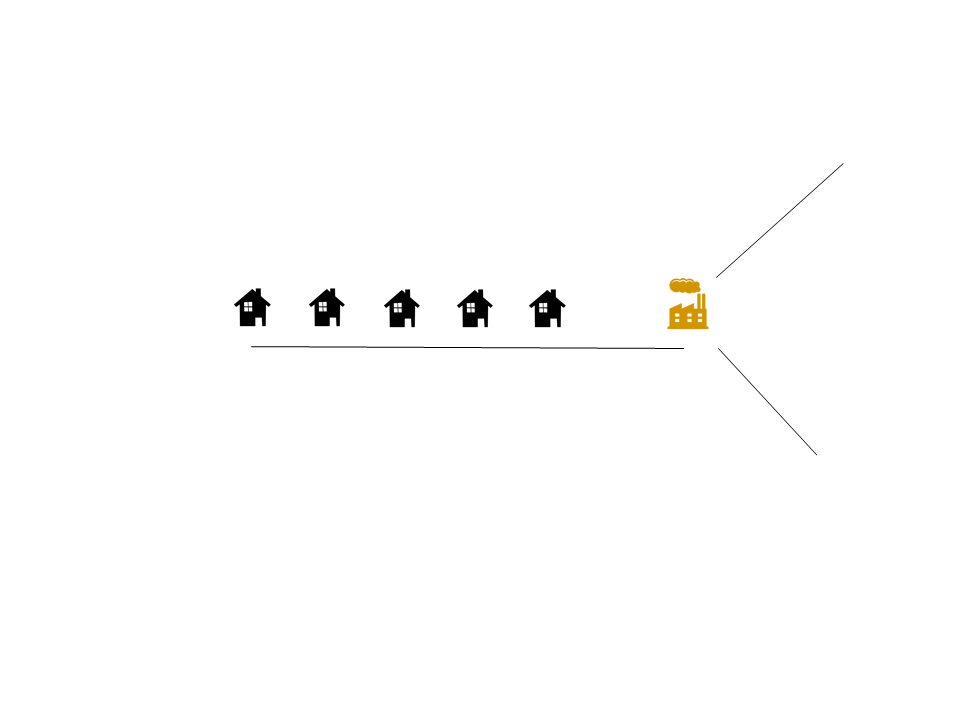
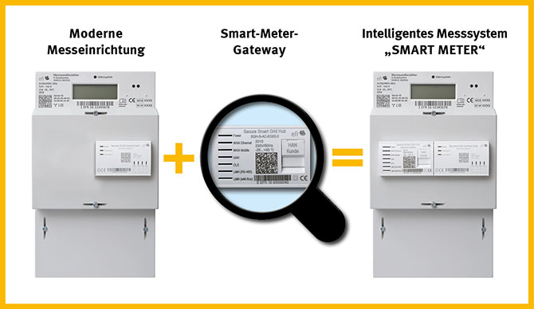

<!-- paginate: true -->

# Smart Metering

---

## Globale Aspekte der Energieversorgung

---

### Wie viele "Energie-Sklaven" benötigen wir?
> the energy slave is a unit of measurement that allows us to better understand and evaluate the consequences of our life choices. An energy slave works to produce energy 24 hours a day. He produces an average power output of 100 W 
(875 kWh/year)

[Quelle](Tourane Corbière-Nicollier & Olivier Jolliet 2001 )

---

<!-- _class: white -->

[Quelle](https://www.bpb.de/kurz-knapp/zahlen-und-fakten/globalisierung/52758/verbrauch-von-primaerenergie-pro-kopf/)

---

### 🧠 Primärenergiebedarf

> misst den gesamten Energiebedarf (eines Landes). Er umfasst den Verbrauch des Energiesektors selbst, Verluste bei der Umwandlung (z.B. von Öl oder Gas in Elektrizität) und Verteilung von Energie sowie den Endverbrauch durch die Endverbraucher. Ausgeschlossen sind Energieträger, die für nichtenergetische Zwecke verwendet werden (z.B. Erdöl, das nicht zur Verbrennung, sondern zur Herstellung von Kunststoffen verwendet wird).

[Quelle](https://ec.europa.eu/eurostat/statistics-explained/index.php?title=Glossary:Primary_energy_consumption#:~:text=Primary%20energy%20consumption%20measures%20the,final%20consumption%20by%20end%20users.)

---

<!-- _class: white -->

[Quelle](https://energyeducation.ca/encyclopedia/Total_final_consumption)

---

<!-- _class: white -->

[Quelle](https://upload.wikimedia.org/wikipedia/commons/b/b4/Energiegruppen_Bilanzbereich_AGEB.png)

---

### 🤓 Tonne of oil equivalent?

> (toe) ist eine Energieeinheit, die als die Energiemenge definiert ist, die bei der Verbrennung einer Tonne Rohöl freigesetzt wird. Sie beträgt etwa 42 Gigajoule oder 11,630 MWh

[Quelle](https://en.wikipedia.org/wiki/Tonne_of_oil_equivalent, http://www.huashuochem.com/wap_product_detail_en/id/29.html)

---

### Wie viele "Energie-Sklaven" benötigen wir?

$\text{No. of Energy Slaves}$
$= 3.7 \frac{\text{toe}}{\text{a}} \cdot 11.630 \frac{\text{MWh}}{\text{toe}} \cdot 1000\frac{\text{kWh}}{\text{MWh}} \cdot \frac{1}{875}\frac{\text{a}}{\text{kWh}}$
$= 3.7 \cdot 11.630 \cdot 1000 \cdot \frac{1}{875}$
$= 49.2$
* Jeder Europäer benötigt mehr als 50 virtuelle Energiesklaven, die Tag und Nacht arbeiten!

---

#### Wasserkocher

* $P = 3.7 \cdot \frac{11,630}{8760}\frac{kWh}{h}=4.9kW$
* als würden mehrere Wasserkocher kontinuierlich durchlaufen
* **Is it bad to have too many energy slaves / kettles?**

[Quelle](James Hoffmann)

---

### Ökonomie

* Kosten: Energieerzeugung ist teuer
  

* This forecast was from before Russia's attack on Ukraine

[Quelle](https://www.bloomberg.com/news/articles/2022-03-16/energy-costs-set-to-reach-record-13-of-global-gdp-this-year)

---

### Endenergieverbrauch nach Sektoren

[Quelle](https://www.iea.org/reports/key-world-energy-statistics-2020/final-consumption)

---

### Nachfrageseite: Endverbrauch nach Sektoren

* **Privathaushalte**: Heizen, Kochen, Kühlen, usw.
* **Verkehr**: Transport von Personen und Gütern
* **Gewerblich**: Verkauf von Waren und Dienstleistungen
* **Industrie**: Herstellung von Waren, in der Regel aus Rohstoffen.
* **Landwirtschaft**: Energieverbrauch: Düngemittel, Licht, Wärme, Maschinen

---

### Gesamt Primärenergieversorgung der Welt nach Quellen

[Quelle](https://www.iea.org/reports/key-world-energy-statistics-2020)

---

#### 🤓 Gesamt Primärenergieversorgung im Jahr ?

[Quelle](Malanima (2013))

---

> Schätzungen der Waldrodung in Mitteleuropa (Deutschland, Nordostfrankreich) anhand archäologischer Holzreste 200 v. Chr. bis 400 v. Chr. (dekadische Daten; jeder Punkt des Diagramms steht für die Intensität des Holzeinschlags).

[Quelle](###### Malanima, P. (2013). Energy consumption in the Roman world. In The Ancient Mediterranean Environment between Science and History (pp. 13-36). Brill)

---

### Energiepolitisches Zieldreieck

---

### Zusammenfassung

* Der größte Teil der Primärenergie weltweit stammt immer noch aus nicht erneuerbaren Energiequellen
* Sichere, erschwingliche Energie ist eine der wichtigsten Triebfedern der menschlichen Entwicklung
* Energie wird in allen Sektoren benötigt (Haushalt, Transport, Produktion)
* Nur ein kleiner Teil der Energie wird in elektrische umgewandelt

---

## Eine kurze Einführung in die Energiewirtschaft

---

### Energiekosten und Erlöse

[Quelle](https://kurier.at/wirtschaft/energiekosten-insgesamt-um-24-milliarden-euro-gestiegen/402181017)

---

### Stadtwerke-Welt (mit Beginn der Elektrifizierung 19 Jhd.)

* Ein Stadtwerk betreibt Netz und Stromerzeugung in seinem Netzgebiet
* Monopolstellung der Stadtwerke

---

### Europäische Energiemarktintegration

* Entwicklung eines gemeinsamen Europäischen Stromnetzes (Ausfallsicherheit)
* und Binnenmarktes
* Aus integrierten Stadtwerken (und Energiekonzernen) werden getrennte Netzbetreiber  und Energieversorgungs-unternehmen (EVU)

---

### Europäische Energiemarktintegration

* Alle Marktteilnehmer handeln Energiemengen frei miteinander
* Netz wird von neutralen Netzbetreibern verantwortet
* Handel von Strom kann bilateral oder auf der Europäischen Strombörse (EEX) stattfinden
* Netzrestriktionen werden innerhalb einzelner Länder vom Markt ignoriert
* Solange keine Netzrestriktionen an den Gren-Kuppel-Stellen bestehen haben Länder den gleichen Strompreis
* Eine ähnliche Logik gilt für den Gas-Markt

---

#### Trennung von Natürlichem Monopol (Netz) und Markt (Energie)

* Beim Stromnetz handelt es sich um ein natürliches Monopol (ebenso Gas und Eisenbahn)
  * Kein Mitbewerber kann ein Parallelnetz aufbauen, und dieses günstiger anbieten
* Idee: Netz und Energie werden getrennt behandelt
* Dies soll den Europäischen Austausch fördern und Kosten senken

[Quelle](https://www.europarl.europa.eu/factsheets/de/sheet/45/energiebinnenmarkt)

---

### Elektrische Energie aus Strom ist ein Homogenes Gut

* Eine kWh Strom kann überall im Europäischen Stromnetz eingespeist werden
* Eingespeiste und entnommene Energie können nicht nachverfolgt werden
* Das Netz wird nicht beachtet (Kupferplatte, Zonales Preissystem)

[Quelle](https://traumshop.net/shop/highlights/atomstromfilter/)

---

#### Ökostrom

* EVU, dies Ökostrom anbieten haben folgende Möglichkeiten
  * Ökostrom selbst produzieren
  * per Liefervertrag einkaufen
  * handelbare Erzeugungszertifikate erwerben

* Mengengleiche Ökostromversorgung: Ausgleich übers Jahr
* Zeitgleiche Ökostromversorgung:  Ausgleich in jeder Viertelstunde

---

### Rollen auf dem Energiemarkt (vereinfacht)

---

### Rollen auf dem Energiemarkt (vereinfacht)

* Ein Unternehmen kann gleichzeitig unterschiedliche Rollen einnehmen
* Stromanbieter: Große Erzeuger vom elektrischem Strom (Kraftwerksparks) verkaufen Energiemengen
* Stromnachfrager: Energieversorgungsunternehmen (EVU) kaufen Energiemengen
* Endverbraucher: Haushalte und Gewerbe, beziehen Strom von den Energieversorgungsunternehmen und rechen über Tarife ab (nur sehr große Firmen handeln selbst auf der Strombörse)
* Netzbetreiber: Greifen nicht in den Handel mit Strom ein

---

#### Angebot und Nachfrage

* Stromanbieter bieten zu marginalen Kosten an: Was immer es kostet eine MWh elektrischen Strom zu produzieren
  * Erneuerbare Erzeuger haben marginale Kosten von 0 €/MWh
  * Gaskraftwerke sind teuer
  * Kapitalkosten werden nicht eingepreist (sunk costs)
* Stromnachfrager sind unelastisch: EVU müssen beschaffen, was Haushalte und Gewerbe beziehen

[Quelle](marginale Kosten/Grenzkosten: Kosten die anfallen, um eine zusätzliche Einheit zu produzieren)

---

#### Merit Order Modell

[Quelle](Ökoinstitut Freiburg)

---

#### Merit Order Modell

* Die Aufreihung des Angebots wird als Merit Order bezeichnet
* In jeder Viertelstunde wird die der Einsatz der Erzeuger nach der Merit Order festgelegt
* Es muss immer genau so viel Strom abgenommen, wie eingespeist werden
* Die Nachfrage kann kurzfristig als nicht-elastisch (preis-unabhängig) angenommen werden
* Der Schnittpunkt zwischen Angebot und nachfrage bestimmt den Preis
* All abgerufenen Kraftwerke erhalten den Preis, den das letzte Kraftwerk erzielt

[Quelle](Ohne diese Regel (Pay-as-Bid) gäbe es ein Anreiz für strategisches Verhalten der Bieter )

---

#### Preis-Schwankung Intraday

[Quelle](https://energy-charts.info/charts/price_spot_market/chart.htm?l=de&c=DE&week=44&legendItems=011010000010)

---

#### Preis-Schwankung Intraday

* Je nach Last und Erzeugungssituation stellen sich unterschiedliche Preise ein
* EVU haben ein Interesse den Verbrauch ihrer Kund:innen in Richtung der günstigen Stunden zu verschieben
  * Zeit-dynamische Tarife 
  * Unterbrechbare Lasten 
* Das würde die Elastizität/Flexibilität der Nachfrage erhöhen
* EVUs müssen in teuren Stunden weniger Strom beziehen
* Geschieht dies nicht im ausreichenden Maße
  * Strompreis steigt
  * Mehr Emissionen
  * Lastabschaltungen

---

### Struktur des Stromnetz

[Quelle](https://upload.wikimedia.org/wikipedia/commons/b/b0/Stromversorgung.svg)

---

[Quelle](https://www.hochspannungsblog.at/Wissenswertes/Netzbetreiber/Uebertragungsnetz)

---

#### Übertragungsnetz

* Maschen-Topologie
* Engpässe bei starken lokalen Ungleichgewichten
  * Marktergebnis kann nicht umgesetzt werden: Redispatch
* Weitere Aufgaben der Übertragungsnetzbetreiber
  * Frequenzhaltung
  * Systemreserve

---

##### Verteilnetz

* Ring- oder Strang-Topologie
* Engpässe bei hohen Gleichzeitigkeiten
  *  Wärmepumpen
  * *"Zahnarzt-Allee"*
  🔥_🚗🚗🚗🚗🚗
  * PV-Rückspeisung 
  🔥_⚡⚡⚡⚡⚡

---

### Nachfrage: Relevanz der elektrischen Energieversorgung

[Quelle](https://www.presseportal.de/pm/43338/1208607)

---

#### Nachfrage: Zunehmende Elektrifizierung 

[Quelle](https://www.heizspiegel.de/heizkosten-pruefen/heizkosten-pro-m2-vergleich/)

---

#### Nachfrage: Emissionsvermeidung durch Elektrifizierung

[Quelle](https://de.wikipedia.org/wiki/Sektorenkopplung#/media/Datei:Prim%C3%A4renergievergleich_fossile_Energie_und_erneuerbare_Energien.png)

---

#### Angebot: Anstieg volatiler Erneuerbarer Energien

[Quelle](https://www.oekosystem-erde.de/html/energiezukunft-03.html)

---

#### 🧠 Fazit

* Strom als **"wertvollster"** Energieträger, da geringe Umwandlungsverluste
* zunehmend höherer Teil an **Energiedienstleistungen** wird aus Strom gedeckt
* **Stromangebot wird zeitlich flexibel**
  (Photovoltaik und Wind nicht immer verfügbar - Dunkelflaute)
* Nicht nur Menge des Strombezugs, sondern auch 
  dessen **Zeitpunkt ist entscheidend**
* EVU und Netzbetreiber benötigen **Daten** über Erzeugung und Verbrauch zu Planung und Optimierung
* EVU und Netzbetreiber haben **Anreize** den Verbrauch der Endverbraucher steuernd **zu beeinflussen**

---

## Smart Metering

---

### Herkömmliche Zähler

- **integrierende** Messung
- keine Messzeitreihe
- **Visuelles Ablesen** eines Momentanwerts

---

### Standardlastprofile

* auf historischen Daten basierende Annahmen über typische Verbrauchsmuster
* gemittelt (enthalten keine Lastspitzen)
* dienen der Planung (z.B. Auslegung des Netzes, Beschaffung von Strom an der Strombörse)
* zunehmend unpräzise

[Quelle](https://blog.naturstrom.de/intern/standardlastprofil/)

---

### Intelligente Zähler

- (Smart Meter) sind **Gas-, Wasser- oder Stromzähler**, die digital Daten auszeichnen, senden und ggf. auch empfangen (Busteilnehmer)

- Basisfunktionen:
  - **Messung**
  - **Datenspeicherung**
  - **Kommunikation**

---

#### Komponenten eines Smart Meters (AT)

[Quelle](Smart-Meter-Kurzanleitung)

---

### Kommunikation zwischen verschiedenen Rollen

<!-- _backgroundColor: white -->

---

#### Komponenten eines Intelligentes Messsystems (D)

* Strikte Trennung in zwei kompatible Komponenten:
* **Modernen Messeinrichtung** erfasst Energiefluss digital
* Smart Meter Gateway **Kommunikations-Schnittstelle**, welche die Zählerwerte speichern, Daten verarbeiten und mit einem Netzwerk kommuniziert (Kommunikationsmodul)

[Quelle](https://www.verbraucherzentrale.de/wissen/energie/preise-tarife-anbieterwechsel/smart-meter-die-neuen-stromzaehler-kommen-13275, Stand: 5. Februar 2021)

---

### Kommunikationsmodul

- Anbindung über diverse Bus-Systeme 
(Power-Line-Communication, Mobilfunk, M-Bus, TCP/IP, ...)
* ermöglicht **Fernauslesung**: Energieversorgungsunternehmen kann Stromverbrauch aus der Ferne ablesen
* **Privatsphäre**: Bedenken, dass auf Verhalten und Anwesenheit geschlossen werden kann

---

#### Kommunikationsmodul: Einführung neuer Stromtarife

* **Zeitvariable Tarife**: Strom kostet mehr zu Hochlastzeiten (abends, Wärmepumpen)
* **Last-variable Tarife**: Strom kostet in Abhängigkeit der bezogenen Leistung
* **Zeit-dynamische Tarife**: Strompreise können sich flexibel verändern (z.B. alle 15 Minuten)

[Quelle](https://www.awattar.at/)

---

### Gesetzliches

- **EU Richtlinie 2006**: allen Mitgliedstaaten, soweit technisch machbar, finanziell vertretbar und im Vergleich zu den potentiellen Energieeinsparungen angemessen, alle Endkunden in den Bereichen Strom, Erdgas, Fernheizung und/oder -kühlung und Warmbrauchwasser individuelle Zähler
  - tatsächlichen Energieverbrauch des Endkunden 
  - und die tatsächliche Nutzungszeit anzeigt

* mögliche Lösung: M-Bus Sensor + Display

---

##### Kundenschnittstelle (Home Area Network)

* in Österreich nicht fix definiert
* Spannung, Wirkleistung, Blindleistung aller Phasen
* häufig MBUS, aber auch andere Bussysteme
* teilweise verschlüsselt

[Quelle](Konzept für einen „Smart-Meter Kundenschnittstellen Adapter“ zur Standardisierung der Datenbereitstellung in der Kundenanlage)

---

### Stand Smart Meter Rollout Europa 2020

| Land      | Durchdringung in % | Bemerkung |
|---------------|----:|---|
| Spanien       | 100 |   |
| Irland        | 100 |   |
| Dänemark      | 100 |   |
| Finnland      | 100 |   |
| Malta         | 100 |   |
| **Italien**       |  99 | [Treiber Stromklau?](https://www.faz.net/aktuell/wirtschaft/unternehmen/smart-meter-dem-schwarzen-stromzaehler-schlaegt-die-stunde-1625653.html)  |
| Luxemburg     |  95 |   |
| **Österreich**    |  95 | [Prakmatisch](https://oesterreichsenergie.at/fileadmin/user_upload/Oesterreichs_Energie/Publikationsdatenbank/Factsheets/FactSheet_Smart_Meter.pdf)  |
| Frankreich    |  95 |   |

---

| Land      | Durchdringung in % | Bemerkung |
|---------------|----:|---|
| Griechenland  |  80 |   |
| Polen         |  80 |   |
| Rumänien      |  80 |   |
| **Deutschland** |  23 | [Overengineering](https://www.bsi.bund.de/SharedDocs/Downloads/DE/BSI/Publikationen/Broschueren/Smart-Meter-Gateway.pdf;jsessionid=7BD90C53F0BECB122DCE8CFC6411F913.internet082?__blob=publicationFile&v=2) |
| Lettland      |  23 |   |

[Quelle](https://de.statista.com/statistik/daten/studie/387142/umfrage/marktdurchdringung-von-smart-metern-in-europa-nach-laendern/)

---

### Eichrecht

- **abrechnungs-relevante** Zähler müssen 
eich-rechtlich zugelassen sein
- **Maß- und Eichgesetz** (MEG)
  - Mengenmessgeräte für Gas,
  - Mengenmessgeräte für sauberes Wasser aus Versorgungsleitungen,
  - Mengenmessgeräte für thermische Energie (Wärmezähler, Kältezähler),
  - Elektrizitätszähler
- Zähler muss bei in Verkehr bringen der Europäischen Messgeräte-Richtlinie MID entsprechen
- **Regelmäßig überprüft** (geeicht) werden

[Quelle](https://static.fernauslese.de/uploads/Fernauslese.de-Merkblatt-Eichrecht-in-Oesterreich.pdf)

---

### 🤓 Smart Meter Österreich

[Quelle](https://www.arbeiterkammer.at/beratung/konsument/Datenschutz/FAQs_zum_Smart_Meter.html#lg=1&slide=0)

---

### 🤓 Besonderheit Deutschland

 - Technische Richtlinie 03109-1 **Anforderungen an die Interoperabilität** der Kommunikationseinheit eines intelligenten Messsystems
- **Bundesamt für Sicherheit in der Informationstechni**k – BSI definierte umfassende Anforderungen, welche von der Herstellern umgesetzt werden mussten
  - z.B. Übertragung über asymmetrische Verschlüsselung und Zertifizierung
  - **Standardisierte Basisfunktionen** (Tarifanwendungsfälle) 

---

#### Smart Meter Deutschland

* soll Ökosystem zum Vernetzung verschiedenster Akteure spielen
* Zusätzlich zur Kommunikationsmodul (WAN) und Kundenschnittstellen (HAN) können noch weitere Zähler integriert werden (LMN)

[Quelle](https://www.dke.de/de/arbeitsfelder/energy/smart-meter-energiemanagement-digitalisierung-energiewende)

---

#### Tarifanwendungsfälle

[Quelle](https://www.ffe.de/attachments/article/851/FE_13549_Bericht_final_online.pdf)

---

#### Kritik an Deutschem System

* **Späte Markteinführung**
* **hohe Kosten** (>100 €/a)
* **Überreglementierung**
  * Kein Freitraum für Tarifentwicklung
* Anforderungen
  * EVU über WAN-Schnittstelle: Abrechnung auf 15 Minuten-Basis ausreichend
  * Liegenschaftsbetreiber über HAN-Schnittstelle: Mess- und Regelung in Gebäudeleittechnik erfordert höhere Auflösung (**Parallelstruktur**)

---

#### Einbauempfehlung Deutschland

[Quelle](Zentralverband der Deutschen Elektro- und Informationstechnischen Handwerke )