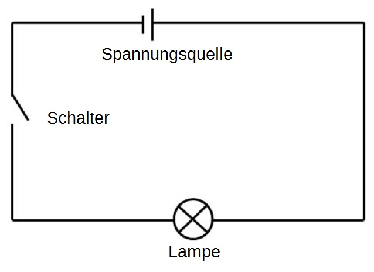
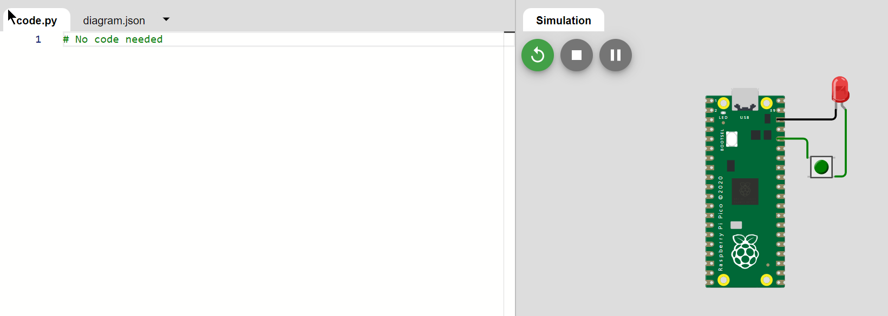
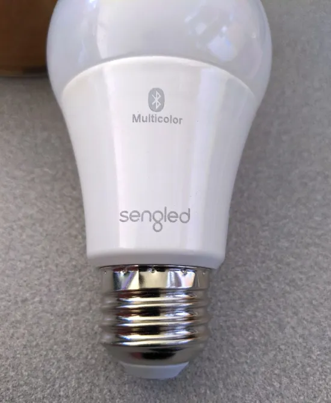
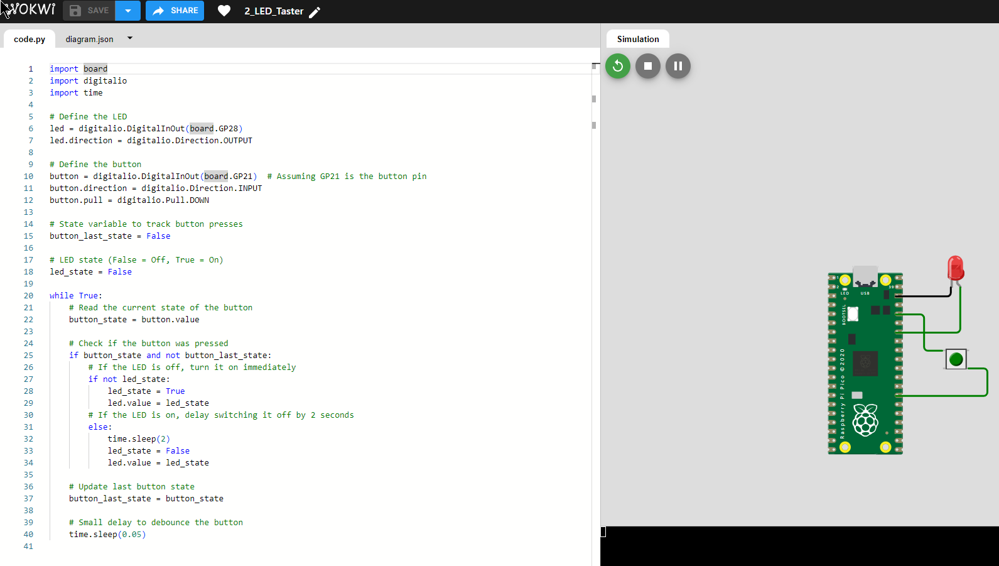
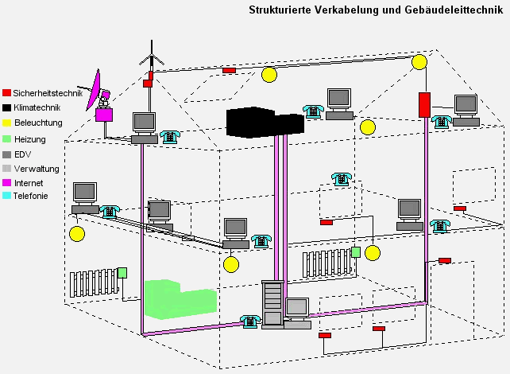

---

marp: true
theme: beams
author: Julian Huber
size: 16:9
footer: Julian Huber - Grundlagen Informationstechnologie & Datensicherheit
headingDivider: 2

# Strg+[ ] for Options

---

<!-- paginate: true -->


# **Einführung Gebäudetechnik:**  IT & Bussysteme

<!-- _class: title -->

Dr. Julian Huber
*Management Center Innsbruck*


## Beispiel Glühbirne [🔗](https://www.edn.com/teardown-cutting-into-a-multicolor-led-light-bulb/)

####

<center>


</center>

[🔗](https://upload.wikimedia.org/wikipedia/commons/b/b4/Gluehlampe_01_KMJ.png)

---

### Klassische Glühbirne

- **Energieeffizienz**: 5%
- **Lebensdauer**: 1.000 Stunden
- **Farbtemperatur**: fix z.B. 2.700 K
- **dimmbare Variante**: z.B. durch Unterspannung
- **Preis**: 1 €



---




[🔗](https://wokwi.com/projects/407558668658481153)

---

### Moderne LED-Glühbirne

#### 
<center>




</center>

---

### Moderne LED-Glühbirne

#### 
<center>


-
</center>

---

### Moderne LED-Glühbirne

- **Energieeffizienz**: 80%
- **Lebensdauer**: 25.000 Stunden
- **Farbe/temperatur**: variabel 
- **dimmbare Variante**: z.B. durch Pulsweitenmodulation
- **Preis**: 10 €

#### 

<div style="text-align: right;">
    <span style="color: orange; font-size: smaller;">
<span style="color: orange;">5. Nachhaltigkeit und Energieeffizienz</span>
</div>


---

#### Eingebettetes System

- jedes Gerät hat einen eigenen Mikrocontroller
- **Software-Code** steuert die Farbe, Helligkeit, ...

<center>


</center>

---

* Trennung von Ein- und Ausgängen
* diese werden erst durch Software verknüpft

<center>



</center>


[🔗](https://wokwi.com/projects/407556513920508929)

---

#### 🎯 Lernziele

* Konzeption von Schaltregeln als **Endliche Automaten** oder **Wahrheitstabellen**
* Anschluss von Sensoren und Aktoren an **Mikrocontroller** und **Speicherprogrammierbaren Steuerungen**
- Umsetzung in **Software-Programmen** mittels Kontrollstrukturen


---

#### 3-Kanal-LED-Controller mit Pulsweitenmodulation

<center>


</center>


[🔗](https://wokwi.com/projects/407564736674374657)


---

#### 🎯 Lernziele

* Einsatz von **Zahlensysteme** und **Bit-Operationen**
* Unterschiede zwischen **Analogen** und **Digitalen Signalen**
* Auswahl von **Ein- und Ausgabegeräten** 

---

#### Verbindung von Sensoren und Aktoren

<center>


</center>

[🔗](https://wokwi.com/projects/407563984311537665)


<div style="text-align: right;">
    <span style="color: orange; font-size: smaller;">4. Gebäudeautomation und Steuerung</span>
</div>

---


#### 🎯 Lernziele

- **Informationsübertragung mittels Bussystemen** und verschiedenen Randbedingungen z.B. Echtzeitfähigkeit, Teilnehmerzahl, Störsicherheit
- Grundkonzepte der **Steuerungs- und Regelungstechnik** z.B. PID-Regler für Konstantlichtregelung


## Vernetzung in Gebäuden

<center>


</center>


<span style="color: orange;">6. Instandhaltung und Betrieb</span>


---

#### 🎯 Lernziele


* **Netzwerkkonfiguration** für TCP/IP-Netzwerke
* **Sicherheitsaspekte** z.B. Firewall, VPN, Verschlüsselung
* **Datenspeicherung** und **Datensicherung** im Betrieb und bei Störungen


---

#### Bussysteme als Zentrales Nervensystem

<center>



</center>

[🔗](https://www.haustechnikdialog.de/SHKwissen/Showimage.aspx?ID=4653)

<div style="text-align: right;">
    <span style="color: orange; font-size: smaller;">2. Klimatisierung und Raumkomfort</span>
</div>

---


#### Bussysteme für verschiedene Gewerke

<center>

 

</center>

---

#### 🎯 DALI - Intelligente Lichtsteuerung

<center>


</center>

* **Verkabelung** und **Addressierung** von bis zu 64 Leuchten und Zusammenfassen in **Gruppen**
* Konfiguration von **Szenen** für verschiedene Anforderungen 

<div style="text-align: right;">
    <span style="color: orange; font-size: smaller;">7. Anpassung an Nutzungsänderungen
</span>
</div>

---

<center>


</center>

---

#### 🎯 KNX & BACnet - Übergreifende Gebäudeautomation

<center>

.png)

</center>

* **Einsatzgebiete** und **Topologien** verschiedener Bus-Systeme
* Planung von **Raumautomations-Funktionen** mittels **Schemata**

<div style="text-align: right;">
    <span style="color: orange; font-size: smaller;">3. Sicherheits- und Brandschutz</span>
</div>

---

### Anlagenautomation

#### 
<center>


</center>

---


#### Klassische Automatisierungstechnik

<center>


</center>

* Verdrahtung von **Aufbau von SPS-Sytemen**
* Programmierung mittels **Funktionsplänen** oder **Strukturiertem Text**

---

#### Ethernet/IP

<center>


</center>

* Grundtechnologien des **Internets**, z.B. **TCP/IP**, **JavaScript**, **HTML**
* Datenübertragung mittels **HTTP**, **MQTT**

<div style="text-align: right;">
    <span style="color: orange; font-size: smaller;">8. Komfort und Nutzerfreundlichkeit</span>

</div>


## Energiemanagement & Smart Metering

<center>

![h:400]


</center>

<div style="text-align: right;">
    <span style="color: orange; font-size: smaller;">1. Sicherstellung von Versorgung und Entsorgung</span>

</div>

---

### Energiesysteme

* **Versorgung**, Erzeugung, Speicherung, Verteilung, Verbrauch
* **Skalen**: Gebäude, Stadt, Region, Land, Welt
* **Sektoren**: Strom, Wärme, Mobilität
* **Technologien**: Erneuerbare, Speicher, Wärme, Elektrolyse, ...
* **Zielkonflikte**: Klimaneutralität, Versorgungssicherheit, Wirtschaftlichkeit

### Energiemanagement

* **Planung**: Welche Technologien, Standorte, Größen
* **Betrieb**: Welche Steuerung, Regelung, Optimierung
* **Optimierung**: Potenziale aufdecken, Kosten minimieren


---


#### Beispiel: Optimierung eines EFH mit PV und Speicher

<center>


</center>

---

##### Lasten und Ertäge

<center>


</center>

---

##### Speicherbewirtschaftung

<center>


</center>

---

#### 🎯 Dafür benötigt

* Zentrales System zur **Steuerung** und **Optimierung**
* **Smart Metering** für genaue Verbrauchsdaten und Abrechnung
* Schnittstelle oder Bus-Systeme für **Speicher-Management**  und
* externe **Datenquellen** für Wetterdaten, Strompreise, ...


---

### Semester 1: Grundlagen Informationstechnologie & Datensicherheit

####


<center>

|      | 
|-----------------------------------------------|
| 1. Rechnersysteme                                     | 
| 2. Informationsdarstellung                                | 
| 3. Compiler und Algorithmen                       | 
| 4. Programmieren                      | 
| 5. Datenspeicherung                                 |
| 6. Kommunikation                              | 
| 7. IT-Sicherheit und Datenschutz                                 |      
       

</center>

---

### Semester 2:    Bussysteme

####

<center>

|   |
-------------------------------------|
| 1. Gebäudeautomation und Planung                   |
| 2. Messkette und  Computer-Systeme   |
| 3. Steuerung- und Regelungstechnik                    |
| 4. Speicherprogrammierbare Steuerung   |
| 5. Bussysteme                          |
| 6. Smart Metering                      |

</center>


---

### Semester 2:  Labor Bussysteme

<center>


</center>


<!--
---


### Internet of Things

<center>


</center>

[🔗](https://www.itwm.fraunhofer.de/de/abteilungen/sys/energieerzeugung-und-verteilung/heizen-ki-prozess-anlagen.html)

---

### Verteiler (`Bus`)

* Anschluss von Quellen, Senken, Speichern und Konvertern
* keine Übertragung von Energie
* keine Speicherung von Energie

#### 

```Python
# create electricity bus
bus_electricity = buses.Bus(label="electricity")

# adding the buses to the energy system
energysystem.add(bus_electricity)
```

---

### Energiefluss (`Flow`)

* Energiefluss von einer Komponente zu einer anderen
* z.B. Strom, Wärme, Gas, Wasserstoff

####

```Python
bus_electricity: flows.Flow(
                    fix=data["h0"], nominal_value=1.2
                )
```
---

### Quelle (`Source`)

* Angeschossen an einem Bus
* Einspeisung
    * Fix z.B. Spitzenleistung einer PV-Anlage (10 kW)
    * Variabel z.B. Zeitreihe einer PV-Erzeugung (`data["pv"]`)
#### 

```Python	
energysystem.add(
    components.Source(
        label="pv",
        outputs={
            bus_electricity: flows.Flow(
                fix=data["pv"], nominal_value=10
            )
        },
    )
)
```

---

### Senken (`Sink`)

* Angeschossen an einem Bus
* Einspeisung
    * Fix
    * Variabel (z.B. Netzeinspeisung hat keine Restriktionen)
* Kosten (z.B. 5 ct/kWh)

#### 

```Python
energysystem.add(
    components.Sink(
        label="grid_feedout",
        inputs={bus_electricity: flows.Flow(variable_costs=-5)},
    )
)
```

---

### Speicher (`Storage`)

* Angeschossen an einem Bus
* Speicherkapazität
* Lade- und Entladeleistung
* Wirkungsgrad (Ein- und Ausgang)
* zeitabhängige Kosten
* ggf. Kosten


#### Zustandsüberwachung

---

https://github.com/jonlesage/Microgrid-EMS-Optimization/blob/master/EMS_Optimization_Formulation.pdf


https://oemof-solph.readthedocs.io/en/stable/examples/basic_example.html#module-basic_example.basic_example

-->