<!-- paginate: true -->

# 1.1 Gebäudeautomation


🎯 Lernziele

Nach dieser Einheit sind Sie in der Lage dazu

* Die Aufgaben von Gebäudeautomation-Management, Raumautomation, und Anlagenautomation abgrenzen
* Die Aufgaben auf Feld-, Automations-, und Managementebene abgrenzen

---

## Aufgaben der Gebäudeautomation

* Sicherstellung von Komfort und Sicherheit
* Energieeffizienz
* Betriebskostenoptimierung
* Produktiviätssteigerung

---

## Abgrenzung verschiedene Ebenen der Gebäudeautomation

>Struktur nach VDI 3814


[Quelle](Lauckner und Krimmling 2020)

---

## Anlagenautomation


die Regelung, Steuerung, Prozessführung und Überwachung von Technikzentralen im Gebäude, u. a. Heizungsanlagen, Anlagen der Lüftungs-, Klima- und Kältetechnik

---

## Raumautomation


dezentrale Teilprozesse, zur Aufrechterhaltung eines **lokalen** Raumklimas durch Steuerungen und Bedienung der Geräte.

---

### Schalenmodell nach VDI 3813 Blatt 1

<!-- _class: white -->


[Quelle](VDI 3813 Blatt 1)

---

#### Segment: 
* kleinste Einheit im Schalenmodell
* ein Raum kann aus mehreren Segmenten bestehen,
* die für sich selbst funktionsfähig sind


---

#### Raum: 

* ein Volumen, das von sechs Bauteilen abgeschlossen wird

#### Bereich:
* Zusammenschluss mehrerer Räume 
  * z.B. Flur mit Toiletten und einigen Büros, 
  * z.B. eine ganze Etage
  * z.B. ein Foyer

---

#### Gebäude:

* *"Gebäude sind selbständig benutzbare überdeckte bauliche Anlagen, die von Menschen betreten werden können."*


[Quelle](1BayBO Art. 2 Abs. 2 [26])

---

## Gebäudeautomation-Management


übergeordnete Prozesse, zur Überwachung und Steuerung (Gebäudeleittechnik)

[Quelle](https://link.springer.com/chapter/10.1007/978-3-319-25876-8_9)

---

## Hierarchie der Gebäudeautomation (Automatisierungspyramide)

<!-- _class: white -->


- Anlagen- und Raumautomation müssen **verknüpft** sein
    - z. B. die Anpassung der zentralen Wärmeerzeugung an den dezentralen Wärmebedarf in den Gebäudezonen
* Verknüpfung erfolgt in der **Automationsebene**  z. B. Prozessüberwachung und  Optimierung


[Quelle](Lauckner und Krimmling 2020)

---

## Fazit

* Gebäudeautomation ist ein komplexes Thema mit verschiedenen Zielfunktionen und Nutzergruppen
* Einzelne Anlagen müssen gesteuert werden
* Räume müssen der Nutzung entsprechend gesteuert werden
* Gebäudeautomation-Management ist die übergeordnete Instanz, die die Anlagen- und Raumautomation im Besten Fall verknüpft---
marp: true
theme: beams
author: Julian Huber
size: 16:9
footer: Julian Huber - Grundlagen Informationstechnologie & Datensicherheit
headingDivider: 2

---

<!-- paginate: true -->


# 1.2 Planungsabläufe

* Im  folgenden wird ein Planungsablauf für die Gebäudeautomation (vereinfacht stilisiert) vorgestellt
* Hierbei wird auf das Beispiel einer Raumautomation eingegangen

---

## Planungsabläufe für die Gebäudeautomation

<!-- _class: white -->


[Quelle](Hochschule Biberach - Nachhaltiges Planen, Bauen und Betreiben durch Einsatz von Gebäudeautomation)


---

| Leistungsphase |                      Bezeichnung                     | Gebäude (§ 34) | Innenräume (§ 34) | Technische Ausrüstung (§ 55) |
|:---------------------:|:----------------------------------------------------:|:--------------:|:-----------------:|:----------------------------:|
|           1           | Grundlagenermittlung                                 |       2 %      |        2 %        |              2 %             |
|           2           | Vorplanung                                           |       7 %      |        7 %        |              9 %             |
|           3           | Entwurfsplanung                                      |      15 %      |        15 %       |             17 %             |
|           4           | Genehmigungsplanung                                  |       3 %      |        2 %        |              2 %             |
|           5           | Ausführungsplanung                                   |      25 %      |        30 %       |             22 %             |
|           6           | Vorbereitung der Vergabe                             |      10 %      |        7 %        |              7 %             |
|           7           | Mitwirkung bei der Vergabe                           |       4 %      |        3 %        |              5 %             |
|           8           | Objektüberwachung – Bauüberwachung und Dokumentation |      32 %      |        32 %       |             35 %             |
|           9           | Objektbetreuung                                      |       2 %      |        2 %        |              1 %             |
|         Summe         |                                                      |      100 %     |       100 %       |             100 %            |

[Quelle](Leistungsbild gemäß HOAI 2013 und HOAI 2021)

---

## Grundlagenermittlung und Bedarfsplanung

* Zunächst wird z.B. während der Ausschreibungsphase ein **Lastenheft** erstellt, welches beschreibt **was** erreicht werden soll
* Häufig enthält dieses eine textuelle Beschreibung des gewünschten Endzustandes
* meist formuliert durch die Kund:in / Bauherr:in ggf. unterstützt durch einen Planungsbüro
* Je nach Projekt kann hier auch auf bestehende Normen verwiesen werden bzw. diese müssen berücksichtigt werden
  * z.B. Energieeffizienzklasse A nach [EN15232](https://assets.new.siemens.com/siemens/assets/api/uuid:ada002be-3fe1-4d03-8f8c-cafbd4ed6e96/auswahlhilfe-fur-energieeffizienz-funktionen-de.pdf)
  * d.h. Heizsystem mit Einzelraumre­gelung mit Kom­munikation und Bedarfsanforde­rung 

---

### 🤓 Österreich

- Leistungsgruppen der standardisierten Bauausschreibung
- Komponenten-basiert. D.h. es werden Komponenten(typen) beschrieben, die in der Ausschreibung verwendet werden sollen und weniger auf die Erfüllung von Funktionen eingegangen

- Leistungsgruppen
  - [LG 84 - GA-System Raumautomation](http://docplayer.org/141267828-Leistungsgruppe-lg-84-ga-system-raumautomation-ra-kennung-ht-version-012-leistungsbeschreibung-haustechnik.html)
  - [LG 85 GA-System Anlagenautomation (AA)](https://www.bmaw.gv.at/dam/jcr:082b2d59-2a63-4aff-b6fa-53d9872ea4d7/LG85%20-%20GA-System%20Anlagenautomation%20(AA).pdf)
  - [LG 86 GA-Management (GA-M)](https://www.bmaw.gv.at/dam/jcr:b480f287-0f66-40c9-9f3e-1fe925deaa39/LG86%20-%20GA-Management%20(GA-M).pdf)

---

### 🤓 Schweiz

* Stärkerer Fokus auf die Funktionen (z.B. durch Funktionstests)
*  KBOB [Empfehlung Gebäudetechnik](https://www.kbob.admin.ch/dam/kbob/de/dokumente/Publikationen/gebaeudetechnik/KBOB_Empfehlung_Geb%C3%A4udetechnik_Endfassung_2020_d.pdf.download.pdf/KBOB_Empfehlung_Geb%C3%A4udetechnik_Endfassung_2020_d.pdf) dient als Definition der Anforderung an die gebäude-technischen Installationen und Anlagen
---

## Vor- bis Genehmigungsplanung 

* Fachplaner nehmen eine formale Beschreibung der Funktionen vor
* Die konzipieren **wie** die Funktionen umgesetzt werden sollen (Pflichtenheft)
* Typisch für diese Phase ist die Erstellung von **Fließbildern** und **Schemata**
    * z.B. Stromlaufpläne, Pneumatikpläne, Hydraulikpläne, etc.
    * Raumautomations-Schema und Raumautomations-Funktionschema (VDI 3813)
    * Anlagenautomations-Schema und Anlagenautomations-Funktionschema (VDI 3814)


---

### Komponenten-Sicht durch Preplanning


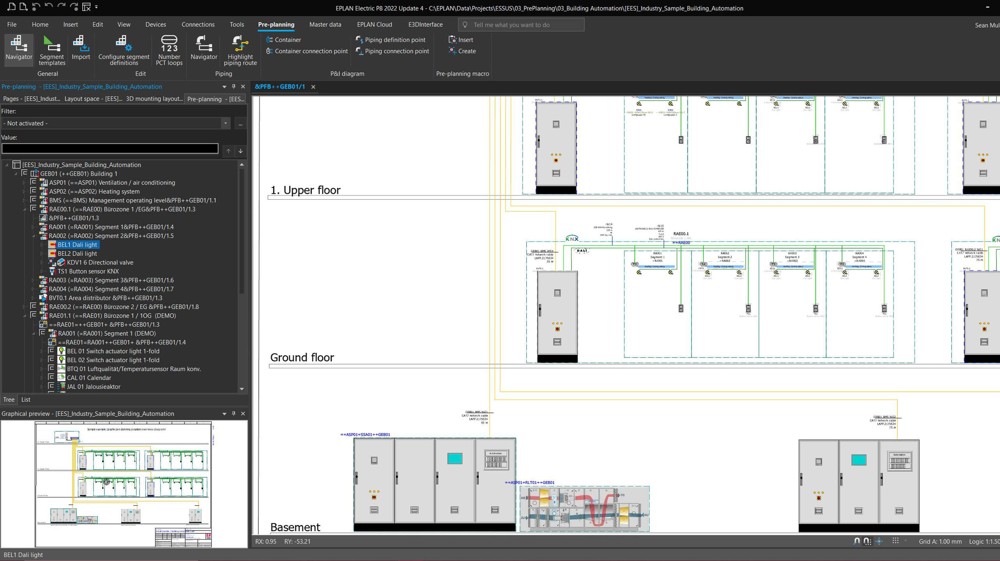


[Quelle](https://www.eplan.de/unternehmen/news/automatisiertes-engineering-in-der-gebaudeautomation/)

---

### Funktions-Sicht durch Raumautomations-Schema (VDI 3813)


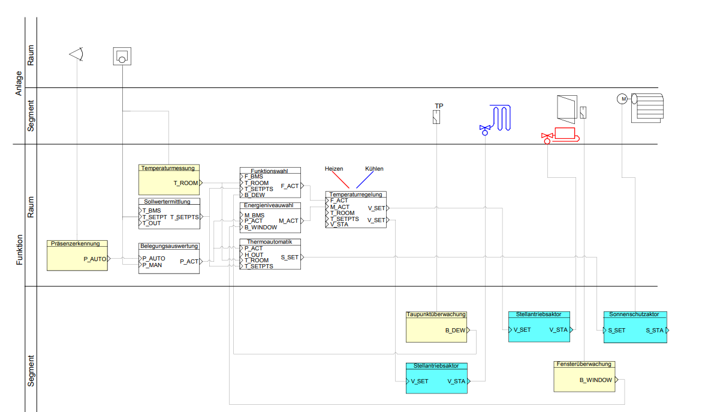


---

* Zuordnung von Sensoren, Aktoren und **Funktionen** zueinander
* und zu Raum vs. Segment (keine genaue Räumliche Positionierung)
* Blockbausteine für Funktionen: Nutzen Attribute der Sensoren, um Attribute der Aktoren zu verändern

---


#### Funktionen

```Python
def f(x):
    """this function's name is f. It takes a value x and returns a value y"""
    [...]
    y = 2*x
    return y

f(2) # Funktionsaufruf, führt die Funktion mit Argument aus und gibt Rückgabe aus
```


---


* **Eingaben**: Werte, die in die Funktion eingehen und sich abhängig vom Systemzustand ändern können
* **Parameter**: unveränderliche Werte, die einmalig konfiguriert werden (z.B. in Abhängigkeit der Raumgröße)
* **Ausgaben**: Werte, welche von der Funktion abhängig von Parametern und Eingaben zurückgegeben werden
* Viele Funktionen stehen für viele Systeme standardisiert zur Verfügung (z.B. [Loxone](https://www.loxone.com/dede/produkte/loxone-config/), [Beckhoff](https://infosys.beckhoff.com/index.php?content=../content/1031/tf8040_tc3_buildingautomation/9281637003.html&id=1985937068038063516), etc.)
* oder können selbst implementiert werden

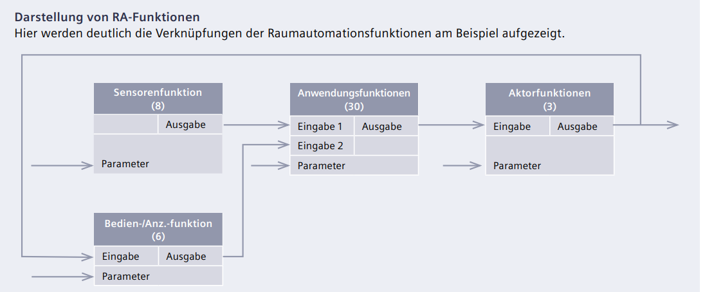

Vorsicht, das stimmt nicht ganz mit der üblichen Benennung bei Programmiersprachen überein


---

##### Sensorfunktionen

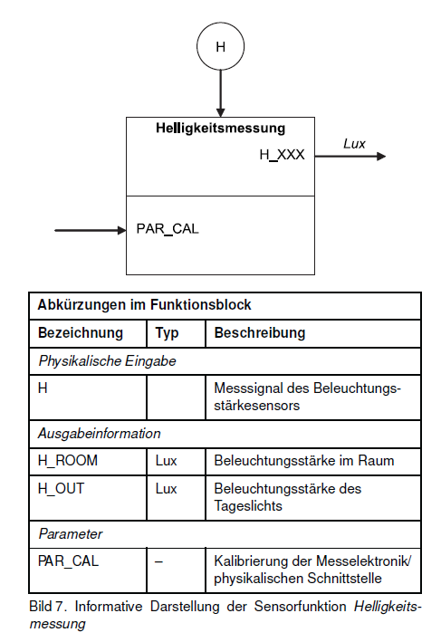

> Ziel: **Erfassen** von Zuständen

- Präsenzerkennung,
- Fensterüberwachung, 
- Taupunktüberwachung,
- Lufttemperaturmessung,
- Helligkeitsmessung,
- Luftqualitätsmessung, 
- Windgeschwindigkeit,
- Niederschlag

[Quelle](VDI 3813)

---

##### Sensorfuktionen != Sensoren / Datenpunkte

* *"künstliche"* Trennung
* erhöht Flexibilität
* Ein Datenpunkt / Sensor
  * Lufttemperaturmessung
  * Luftqualitätsmessung
  * ggf. Taupunktüberwachung

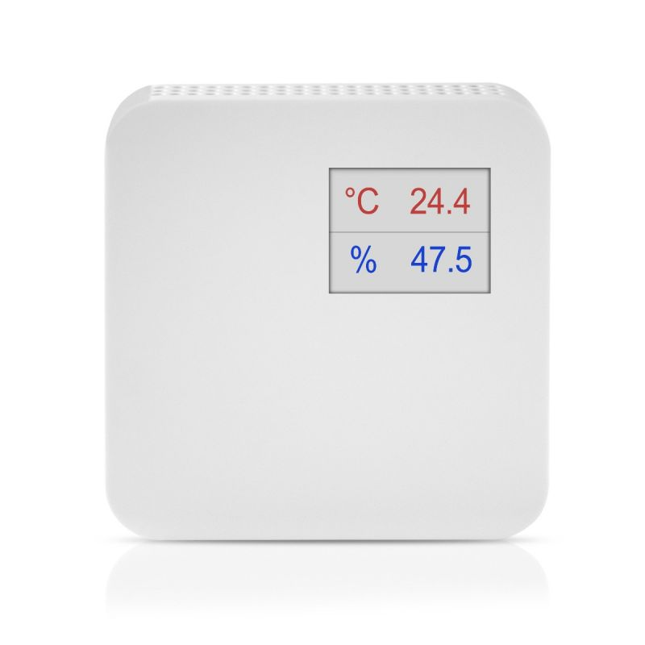

[Quelle](https://www.sensorshop24.de/raumkombifuehler-fuer-temperatur-und-feuchte-0-10v-4-20ma)

---


##### Beispiel Verschattungkorrektur


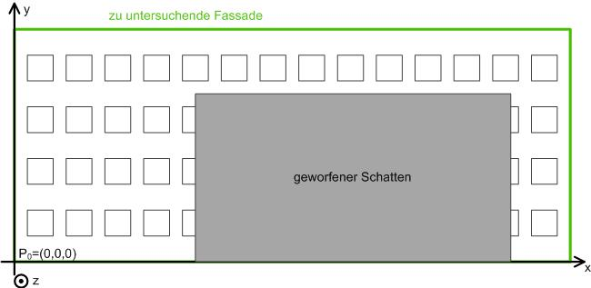


[Quelle](https://infosys.beckhoff.com/index.php?content=../content/1031/tcplclibhvac/11659363083.html&id=)

---

#### Aktorfunktionen

> Ziel: **Steuerung** von Komponenten

* binärer Schaltaktor
* Lichtaktor,
* Sonnenschutzaktor,
* Stellantriebsaktor 
  (z.B: Heizkörper)


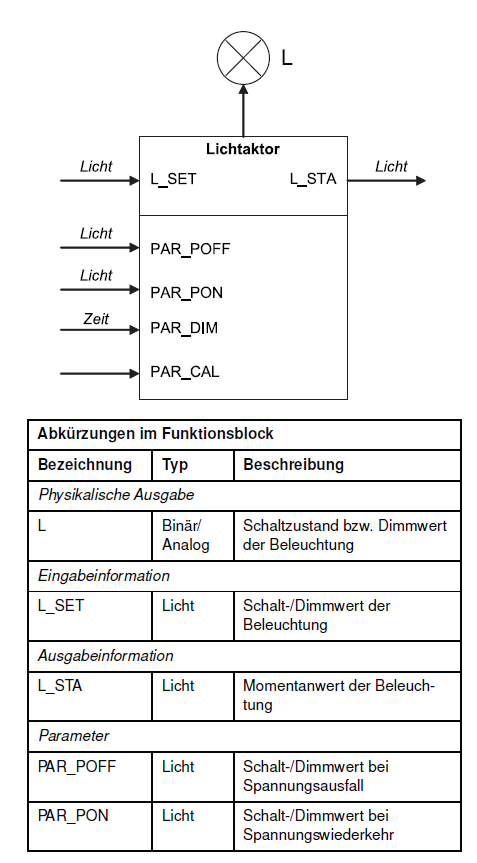

---

#### Bedien-, Anzeige und Managementfunktionen

- Bedien- und Anzeigefunktionen (**lokal**)
  - Stellantriebsaktor, Sonnenschutzstellen, Antriebstellen, Temperatursollwertstellen, Raumnutzungsart wählen, Präsenzmelden
- **Managementfunktionen**
  - Aufzeichnung, Archivierung und statistische Analyse


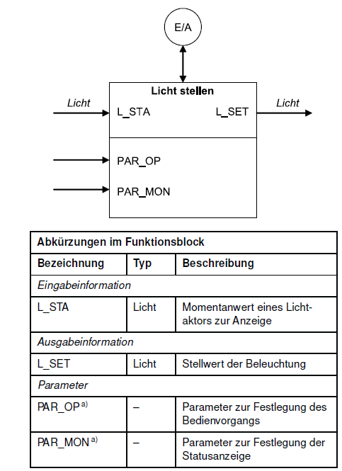

---

#### Anwendungsfunktionen 

> sind Programmabläufe die meist mehrere Aktoren und Sensoren miteinbeziehen

- **Raumklima**
    - Energieniveauwahl, Energieniveauwahl mit Startoptimierung,Sollwertermittlung, Funktionswahl, Temperaturregelung, Raum‐Zulufttemperatur‐Kaskade, Ventilatorsteuerung, Sequenzsteuerung, Stellwertbegrenzung, Luftqualitätsregelung, Nachtkühlung, Volumenstromregelung

---

#### Anwendungsfunktionen 


- **Beleuchtung**
  - Lichtschaltung, **Treppenlichtschaltung**, Automatiklicht, Tageslichtschaltung, Kostantlichtregelung, Dämmerungsschaltung 

- **Sonnenschutz**
  - Prioritätssteuerung, Dämmerungsautomatik, Sonnenautomatik, Lamellennachführung, Verschattungskorrektur, Thermoautomatik, Witterungsschutz

- **Übergreifend**
  - Belegungsauswertung, Steuerung über Raumnutzung, Zeitprogramm, Trennwandsteuerung, Thermoautomatik

---

#### Beispiel Treppenlichtschaltung

> Über die Funktion Treppenlichtschaltung können Beleuchtungseinrichtungen temporär eingeschaltet werden. Nach Ablauf der Treppenlichthaltezeit kann eine Abschaltvorwarnzeit aktiv werden, die den Nutzer z. B. durch kurzzeitige Unterbrechung(„Flackern“) über die bevorstehende Abschaltung informiert. Ein erneuter Empfang einer Eingabeinformation zum Einschalten startet die Verzögerungszeit neu. Die Funktion benötigt als Eingabeinformation das Ergebnis der Bedienfunktion Licht stellen und liefert ihrerseits die Ausgabeinformation für eine oder mehrere Aktorfunktionen Lichtaktor.


---

##### Zusammenhang zwischen verschiedenen Funktionen


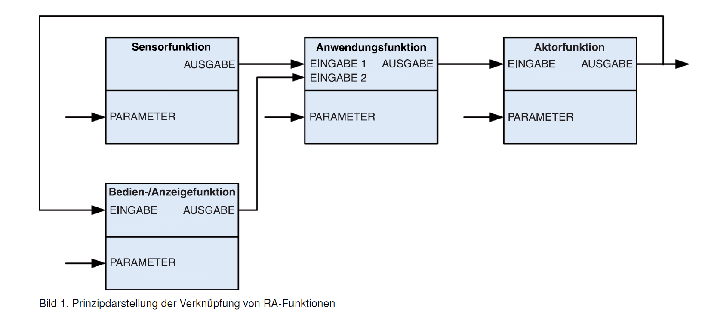


[Quelle](https://assets.new.siemens.com/siemens/assets/api/uuid:c107cd4a-cbd2-4b40-aeaa-a1face4c3dc7/planungshandbuch-gebaudeautomation-de.pdf)


---

#### Schritt Raumautomations-Schema


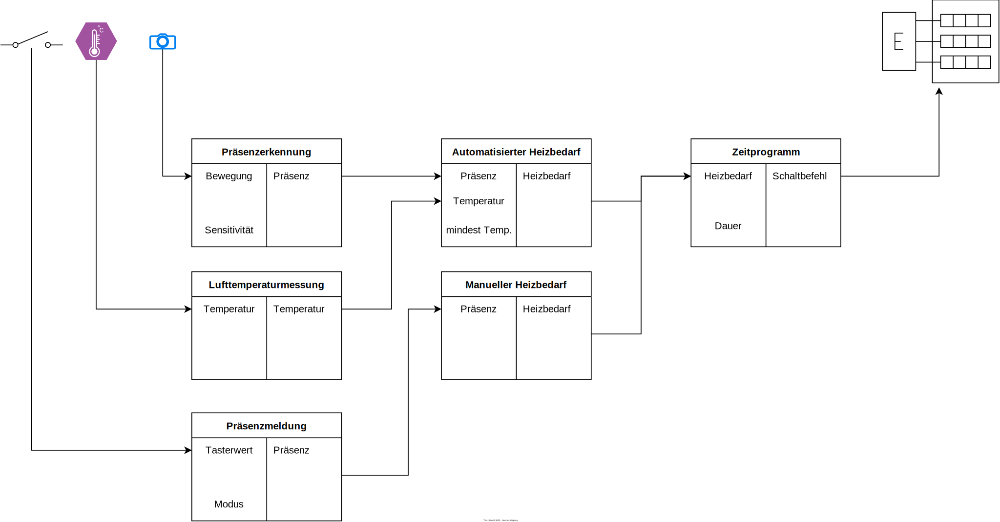


---

#### Ableitungen aus Vorplanung und Raumautomations-Schema

* Raumautomations-Schema zielt insbesondere auf die Implementierung, der gezielten Funktionalität (Funktionsbausteine werden auch in der Programmierung eingesetzt)
* Grafisches Werkzeug: Intuitive Prüfung auf Vollständigkeit möglich
* Entscheidung für Raum und Segment
  * z.b. ein vs. mehrere Bewegungsmelder pro Segment
* Für die Mengenplanung und Installationsplanung ist eine andere Darstellung hilfreicher


---

## ✍️ Aufgabe 1_2_1: Raumautomationsschema für ein Treppenhaus

- Befüllen Sie das vorliegende Raumautomations-Schema mit den entsprechenden Funktionen für die Beleuchtung eines Treppenhauses (aus den Folien zuvor)
- Alle Leuchten werden über einen Aktor für das gesamte Treppenhaus zusammengefasst
- Das Treppenhaus verbindet zwei Stockwerke, auf jedem soll ein Bedienelement für die Beleuchtung angebracht werden
- Die Anwendungsfunktion Treppenlichtschaltung soll hierüber gesteuert werden können
- zusätzlich soll die Beleuchtung auch direkt aus der Gebäudeleittechnik für den Bereich gesteuert werden können

---


---

### ✔️ Lösung

<!-- _color: black -->

??? optional-class "💡 anzeigen"
  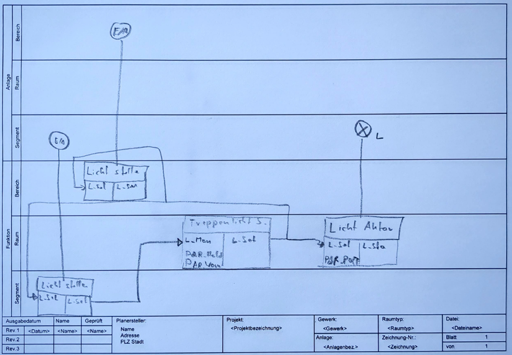

---

## Ausführung

* Entscheidung für Hardware und Software, um die Funktionen umzusetzen
* Erstellung von **Detailplänen** und **Dokumentationen**
* Installation der Hardware und Verkabelung
* Implementierung von Software
* Funktionstests


---

### Beispiel: Parametrisierung eines DALI-Systems


---

### Beispiel: Programmierung eine SPS 

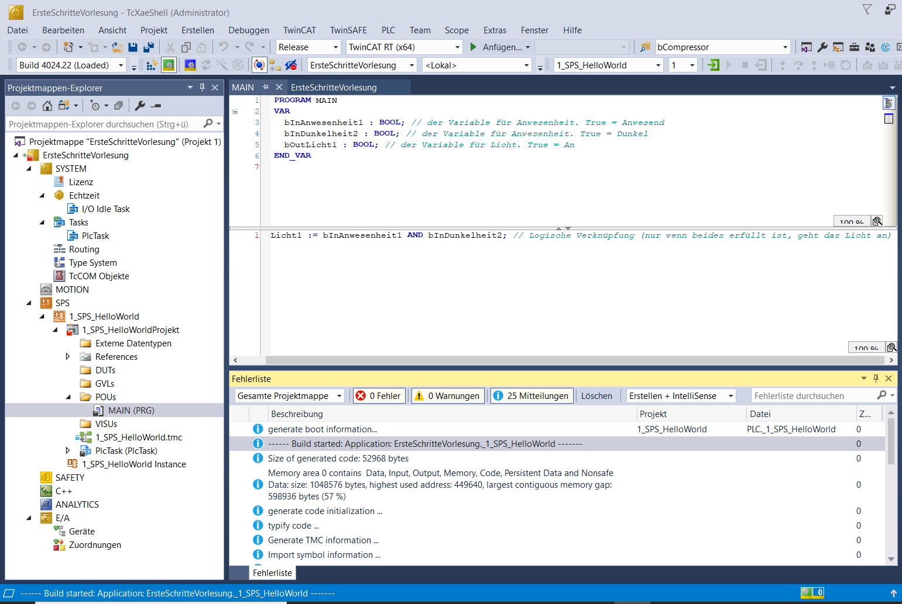


---


### Bussysteme

* i.d.R. gibt es eine Vielzahl von möglichen Bussystemen, die für die Umsetzung der Funktionen in Frage kommen
* häufig werden mehrere Bussysteme kombiniert und müssen orchestriert werden
* neben den Kosten müssen auch Anforderungen an Erweiterbarkeit und Wartbarkeit berücksichtigt werden
* Erweiterbarkeit:
    * Wie einfach ist es, neue Komponenten hinzuzufügen?
    * Wie offen  ist das System für Veränderungen?
Wartbarkeit:
      * Sind Dienstleister oder Personal verfügbar, die das System warten können?    
      * Ist davon auszugehen, dass das System in 10 Jahren noch verfügbar ist?

---

## Betriebsphase

* Softwareupdates:
    * Wie können Softwareupdates eingespielt werden?
    * Over-the-Air vs manuell?
    * Wie werden die Updates getestet?
* Funktionstests:
    * Wie kann die Funktionalität überprüft werden?
    * Wie können Fehler identifiziert werden?

---


### Automatisierungspyramide


---

### Cloud

* Zunehmende Bedeutung von Cloud-Systemen
* Insbesondere die höheren Ebenen der Automatisierungspyramide werden zunehmend in die Cloud verlagert

---

## Appendix: Ausgewählte Anwendungsfunktionen


### Funktionen für die Raumklimaregelung II

- **Startoptimierung**
Wird dem Raumtemperaturregler über ein Zeitprogramm zusätzlich zum gegenwärtigen **Energieniveau** auch das **nächste** und der zugehörige **Zeitpunkt** mitgeteilt, ist der Regler in der Lage, den optimalen Aufheizzeitpunkt des Raums anhand zusätzlicher Informationen, wie der Raum- und der Außentemperatur, so zu bestimmen, dass die gewünschte Raumtemperatur genau zu dem gewählten Zeitpunkt zur Verfügung steht (Erweiterung der Energieniveauwahl).

- **Fensterüberwachung**
Bei geöffneten Fenstern sorgt die Fensterüberwachung für eine automatische Umschaltung auf das **Energieniveau Gebäudeschutz** um Energieverschwendung zu vermeiden. Der Zustand der Fenster wird über entsprechende Kontakte eingelesen.

---

### Funktionen für die Raumklimaregelung III

- **Sollwertermittlung**
Abhängig vom Energieniveau muss ein **Raumtemperaturregler** in der Lage sein, die korrekte Sollwertvorgabe zu ermitteln. Zusätzlich kann der Sollwert bei hohen Außentemperaturen gleitend angehoben werden (**Sommerkompensation**), um zu große Unterschiede zur Raumtemperatur zu vermeiden.

- **Temperaturregelung**
Die **eigentliche Regelung der Raumtemperatur** durch Ermittlung der korrekten Stellantriebsstellung für Heizen oder Kühlen erfolgt durch die Funktion Temperaturregelung. In den meisten Fällen kommen **PI-Regler** zum Einsatz, die in der Lage sind, statische Regelabweichungen zu eliminieren.

---

### Funktionen für die Raumklimaregelung IV

- **Ventilatorsteuerung**
Luftgestützte Anlagen, z. B. Gebläsekonvektoren, verfügen über Ventilatoren zum Lufttransport. Die Luftmenge kann dabei meist mehrstufig an die erforderliche Heiz- oder Kühlleistung angepasst werden. Die **Wahl der geeigneten Ventilatorstufe** erfolgt anhand der Differenz der Ist- zur Soll-Raumlufttemperatur oder analog zu den Stellantrieben der Heiz- oder Kühlregister.

- **Luftqualitätsregelung**
Wird die Versorgung der Räume mit Frischluft über mechanische Systeme, wie Zentral- oder Fassadenlüftungsanlagen gewährleistet, wird die **Zuluftmenge** zur Einsparung elektrischer Energie für die Ventilatoren **an die Raumluftqualität angepasst**.

---

### Funktionen für die Raumklimaregelung IV


- **Nachtkühlung**
Kühle Nachtluft lässt sich zum Herunterkühlen der Raumluft nutzen, falls **Fenster oder Fassadenklappen motorisch geöffnet** werden können oder **Gebläsekonvektoren** mit Zuluftklappen vorhanden sind. Diese Funktion sollte mit Hilfe der gemessenen lokalen Raumtemperatur und der Außentemperatur raumindividuell ausgeführt werden, um eine optimale Absenkung zu erreichen.

- **Thermoautomatik**
Durch die Fenster eintretendes Sonnenlicht sorgt für einen Wärmeeintrag in den Raum, der je nach Raumtemperatur willkommen oder unwillkommen ist. Die Thermoautomatik übernimmt **in unbelegten Räumen** nun die Kontrolle über den **Sonnenschutz** zur Unterstützung von Heiz- oder Kühlvorgängen. So kann im Sommer eine Überhitzung vermieden und im Winter die Heizung durch solare Gewinne entlastet werden.


---

### Funktionen für Beleuchtung, Blendschutz und Tageslichtnutzung

- **Konstantlichtregelung**
Ein Sensor zur Erfassung der Raumhelligkeit, z. B. innerhalb eines Multisensors, sorgt für die exakte Anpassung des **Beleuchtungsniveaus** an die Arbeitsaufgabe. Hierfür erforderlich sind **dimmfähige** Aktoren (analoger Ausgang).

- **Tageslichtschaltung**
Der "kleine Bruder" der Konstantlichtregelung ist überall dort einsetzbar, wo die Beleuchtung **nur schaltbar** ausgeführt werden kann. Zur Erfassung der Helligkeit ist ebenfalls ein Sensor im Raum erforderlich. Unterschreitet das Tageslicht die erforderliche Raumhelligkeit, wird Kunstlicht automatisch in ein oder mehreren Stufen zugeschaltet und bei Zunahme des Tageslichtanteils wieder abgeschaltet (digitaler Ausgang).


---

### Funktionen für Beleuchtung etc. II


- **Automatiklicht**
In Räumen ohne ausreichende Tageslichtversorgung, z. B. in Fluren oder Sanitärräumen, lässt sich Energie sparen, indem die Beleuchtung nur temporär eingeschaltet wird. Die **Präsenzerkennung** liefert die hierfür erforderlichen Sensordaten. Eine einstellbare **Abschaltverzögerung** sorgt für Beleuchtungskomfort.


- **Sonnenautomatik**
**Außenliegende** Jalousien und bedingt auch Markisen sorgen vor allem für einen **Wärmeschutz** des Gebäudes. **Innenliegende** Jalousien, Vertikallamellen u. ä. sorgen vor allem für **Blendfreiheit** an Arbeitsplätzen. Die Sonnenautomatik sorgt nutzt Wetterdaten, damit der außenliegende Sonnenschutz eine einstellbare Position immer dann einnimmt, wenn eine bestimmte Strahlungsintensität überschritten wird. Der innen liegende Blendschutz ist i. d. R. nicht automatisiert, da das Blendungsempfinden individuell zu bewerten ist.

---

### Funktionen für Beleuchtung etc. III


- **Lamellennachführung**
Die Lamellennachführung ist eine **Weiterentwicklung der Sonnenautomatik**. Bei hoher Strahlungsintensität fährt der Sonnenschutz dazu in eine Stellung, die **zyklisch dem Sonnenstand** angepasst wird. So wird unter Aufrechterhaltung des Blendschutzes die Tageslichtversorgung maximiert. 


- **Verschattungskorrektur**
Umliegende Gebäude oder eigene Gebäudeteile sorgen auf den Fassaden für Schattenwurf, der die Blendschutzfunktion für die **im Schatten liegenden Jalousien zeitweise unnötig** macht. Die Jalousien sollten für eine bessere Tageslichtversorgung in dieser Zeit geöffnet sein. Die Verschattungskorrektur korrigiert dies in Verbindung mit der Sonnenautomatik oder der Lamellennachführung arbeitet. Die Funktion wird gelegentlich auch Jahresverschattungsdiagramm genannt.

---

### Funktionen für Beleuchtung etc. IV


- **Dämmerungsschaltung**
Außenbeleuchtung ist nur dann erforderlich, wenn es dunkel wird. Da der Zeitpunkt jahreszeitlich variiert, sorgt die Dämmerungsschaltung selbstständig für den optimalen Einschaltmoment. 

- **Witterungsschutz**
Witterungsschutzfunktionen vermeiden Schäden an der Sonnenschutzanlage. Sensoren für Temperatur, Niederschlag, Windgeschwindigkeit und -richtung stellen die erforderlichen Wetterdaten zur Verfügung, damit der Sonnenschutz rechtzeitig vor Beschädigungen eingezogen wird (ggf. auch für Fenster).
---
marp: true
theme: beams
author: Julian Huber
size: 16:9
footer: Julian Huber - Grundlagen Informationstechnologie & Datensicherheit
headingDivider: 2

---

<!-- paginate: true -->


# 2.1 Messkette	

## EVA-Prinzip

<!-- _class: white -->


* Gebäudeautomation wird durch eine Steuerungseinheit überwacht und gesteuert
* Hierzu werden Eingangs-Signale gemessen und Ausgangssignale erzeugt
* In der Steuerungseinheit werden Funktionen implementiert, die die Messsignale in Ausgangssignale umwandeln
* Steuerungseinheiten sind heute meist frei programmierbar (z.B. Speicherprogrammierbare Steuerung) oder wurden für bestimmte Funktionen vorprogrammiert (z.B. Mikrocontroller in LED-Vorschaltgeräten)

---

### Digitale Eingänge

* Digitale Eingänge können nur zwei Zustände annehmen (0:`False` oder 1:`True`)
* Die Zustände werden durch Spannungen repräsentiert
* i.d.R. gibt es Spannungsbereiche, die als `0` oder `1` interpretiert werden


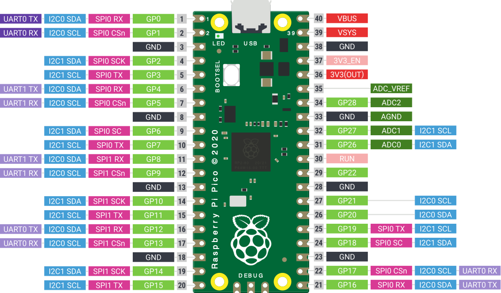


## ✍️ Aufgabe 2_1_1: Raspberry Pi Pico als Mikrocontroller

* Beim Raspberry Pi Pico handelt es sich um einen Mikrocontroller, der mittels Python programmiert werden kann
* Im folgenden wird folgende Hardware benötigt:
    * Raspberry Pi Pico (WH)
    * Breadboard
    * Taster
    * Widerstand ca. $470 \Omega$ und $10 \,\text{k}\Omega$
    * Jumperkabel
* Ziel ist es, dass der Mikrocontroller den Taster ausliest und den Zustand auf der Konsole ausgibt


---

### CircuitPython installieren

* Halten Sie den `BOOTSEL` Taster auf dem Pico gedrückt und verbinden Sie diesen über USB mit dem Rechner
* Passende Firmware [UF2-File](https://circuitpython.org/board/raspberry_pi_pico_w/) herunterladen und in den als USB-Laufwerk erkannten Pico kopieren
* Pico sollte jetzt neue Starten und die Firmware installieren
* Nach dem erneuten Verbinden sollten nun einige Programme im Pico liegen


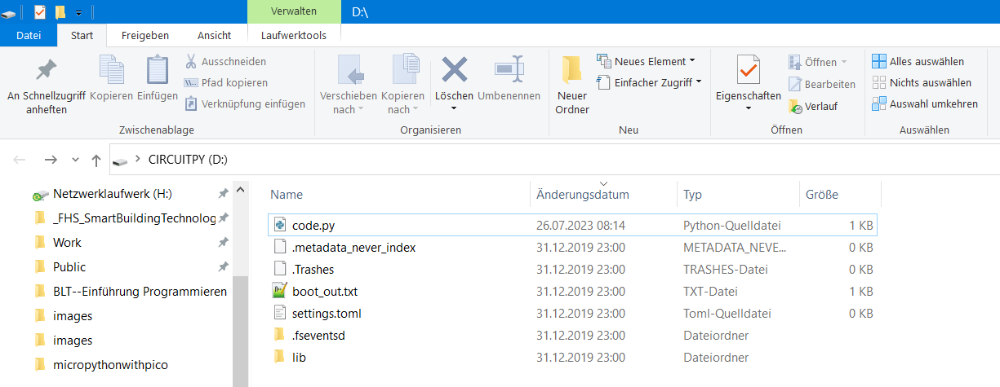


---

### Programmieren des Pico mittels CircuitPython

* Öffnen Sie im Chrome Browser die Seite des [Online Editors](https://code.circuitpython.org/) in einem Chromium-basierten Browser
* Verbinden Sie Sich mittels USB
* Wählen Sie die Schnittstelle `CircuitPython CDC Control` aus
* Öffnen Sie das Verzeichnis (USB-Laufwerk) `CIRCUITPY` und wählen Sie `USE /`
* Öffnen Sie die Datei `code.py` und fügen Sie den folgenden Inhalt ein
* Öffnen Sie die Serielle Schnittstellen, um die Ausgabe zu sehen `Serial`, übertragen Sie den Code und starten Sie den Pico neu `Save + Run`

### Alternative

https://urfdvw.github.io/circuitpython-online-ide-2/

---

### Digitaler Zwilling mit [wokwi.com](https://wokwi.com/projects/424662007489899521)

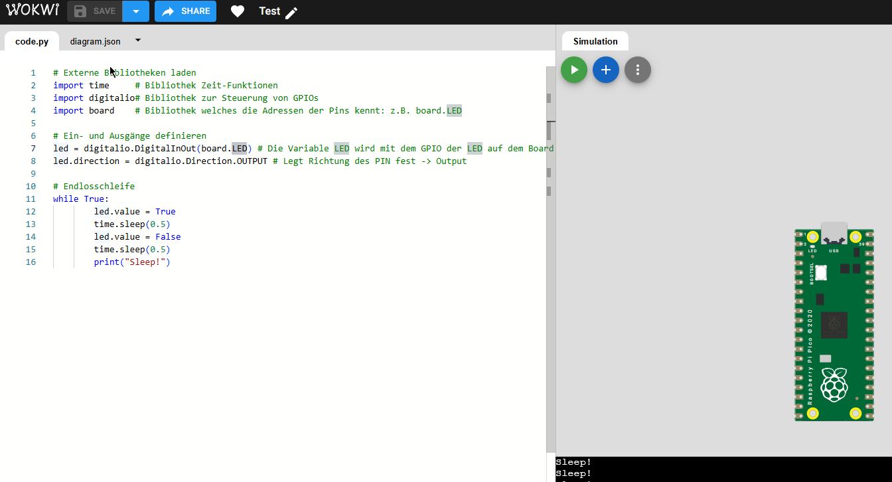

---

### Hauptprogramm `code.py`

- Dieses Programm wird automatisch ausgeführt und ist der Einsteigspunkt für alle Programme (vgl. `MAIN` bei TwinCat)
- Passen Sie das Hauptprogramm so an, dass die LED länger hell als dunkel ist
- Passen Sie die Ausgabe an indem Sie `"Sleep!"` ersetzen
```python
# Externe Bibliotheken laden
import time     # Bibliothek Zeit-Funktionen
import digitalio# Bibliothek zur Steuerung von GPIOs
import board    # Bibliothek welches die Adressen der Pins kennt: z.B. board.LED

# Ein- und Ausgänge definieren
led = digitalio.DigitalInOut(board.LED) # Die Variable LED wird mit dem GPIO der LED auf dem Board verbunden
led.direction = digitalio.Direction.OUTPUT # Legt Richtung des PIN fest -> Output

# Endlosschleife
while True:
        led.value = True
        time.sleep(0.5)
        led.value = False
        time.sleep(0.5)
        print("Sleep!")
```


---


### Pin-Übersicht


- VCC Voltage Common Connector: Spannungs- Versorgung $5$ oder $3.3 \,\text{V}$
     - Alles unter $0,8\,\text{V}$ ist low
     - alles über $1,3\,\text{V}$ ist high
- Ground: $0 \,\text{V}$
- Einige GPIOs können als Busleitungen genutzt werden: UART, SPI, I2C


[Quelle](https://www.elektronik-kompendium.de/sites/raspberry-pi/2002191.htm)

---


### Breadboards

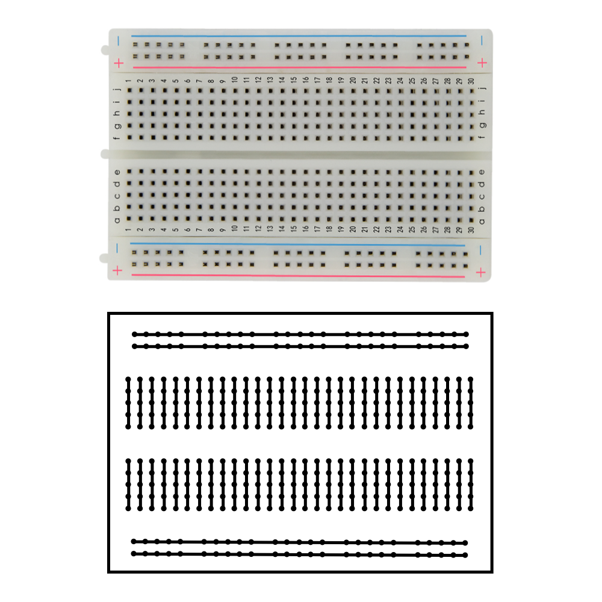
- Steckplatine für Systemtest und Prototyping
- vier Reihen für Spannungsversorgung
- weitere Raster sind längs verbunden 

[Quelle](https://www.elektronik-kompendium.de/sites/praxis/bauteil_steckbrett.htm)


--- 

###  General Purpose Input/Output

* Digitale Ein- und Ausgänge
* GPIO arbeiten von $2...16 \,\text{mA}$
* GPIOs können binär gelesen und geschaltet werden
* [Pin-Belegung](https://www.elektronik-kompendium.de/sites/raspberry-pi/2611051.htm)


---

### [✔️ Lösung](Aufgaben\2_1_1\code.py)

<!-- _color: black -->

??? optional-class "💡 anzeigen"
    ```python
    --8<-- "Aufgaben\2_1_1\code.py"
    ```

---

## ✍️ Aufgabe 2_1_2: Anschluss eines Tasters an einen Raspberry Pi Pico

<!-- _class: white -->

- Schließen Sie den Taster wie folgt an


- $R_{pullup} = 10 \,\text{k}\Omega$
- Verbinden Sie den Taster mit dem 3.3V Pin und dem `GPIO 0`
- Fügen Sie die folgenden Code- Teile an den richtigen Stellen ein und starten Sie das Programm

---

```python
import time
import board
import digitalio

button_pin = board.GP0  # Replace with the GPIO pin connected to your button

button = digitalio.DigitalInOut(button_pin)
button.direction = digitalio.Direction.INPUT
button.pull = digitalio.Pull.UP  # Use pull-up resistor; change if using pull-down

while True:
    if not button.value:  # Button is pressed (LOW)
        print("Button Pressed!")
    else:
        print("Button Released!")
    
    time.sleep(0.1)  # Add a small delay to debounce the button
```

---

#### GPIO-Eingang mit Taster/Schalter und Pullup-Widerstand

<!-- _backgroundColor: white -->
<!-- _color: grey -->


- Unbeschaltet oszillieren die GPIOs häufig unsauber zwischen den Zuständen
- Grundzustand des Eingangs bei offenem Schalter: `high`
- Durch schließen: `low`
- $4{,}7~\text{k}\Omega$ als Standardwert
- (RaspBerry Pis haben eingebaute Widerstände, die aktiviert werden können)


[Quelle1](https://www.elektronik-kompendium.de/sites/raspberry-pi/2110081.htm),[Quelle2](https://www.elektronik-kompendium.de/sites/raspberry-pi/2006051.htm)

---

#### GPIO-Eingang mit Taster/Schalter und Pulldown-Widerstand

<!-- _backgroundColor: white -->
<!-- _color: grey -->


- Grundzustand des Eingangs: `low`
- Durch schließen: `high`
-  der Regel $10~\text{k}\Omega$

---

### Zusammenfassung Schalter und Taster

- In der Praxis tendiert man dazu, GPIO-Eingänge mit einem Pullup-Widerstand mit +VCC zu verbinden und gegen Ground (GND) zu schalten
- Erfordert Negation in der Software
- Werte von $10$ bis $100~\text{k}\Omega$
- [GPIO-Eingang mit Taster/Schalter und Querwiderstand](https://www.elektronik-kompendium.de/sites/raspberry-pi/2110081.htm)
- [Mehr zu Pull-Up vs Pull-Down](https://www.elektronik-kompendium.de/sites/raspberry-pi/2006051.htm)

---

### Digitale Ausgänge

<!-- _class: white -->


* Ausgänge können mit einer Spannung beschaltet werden
* Bei einem Raspberry Pi Pico sind die Ausgänge auf $3.3 \,\text{V}$ begrenzt
* Die Ausgänge können bis zu $16 \,\text{mA}$ liefern


---

### [✔️ Lösung](Aufgaben\2_1_2\code.py)

<!-- _color: black -->

??? optional-class "💡 anzeigen"
    ```python
    --8<-- "Aufgaben\2_1_2\code.py"
    ```

---

## ✍️ Aufgabe 2_1_3: Anschluss einer LED an einen Raspberry Pi Pico

* Nun wollen wir eine LED anschließen in der Folge über den Taster schalten
* Die LED soll nach einem Druck auf den Taster ihren Zustand wechseln
* passen Sie den Code entsprechend an und nutzen Sie dazu die folgenden Code-Teile


```Python
import time
import board
import digitalio


led_pin = board.GP1      # Replace with the GPIO pin connected to your LED

# Define the LED as a digital output
led = digitalio.DigitalInOut(led_pin)
led.direction = digitalio.Direction.OUTPUT

while True:
    led.value = not led.value  # Toggle the LED state
    time.sleep(0.2)
```


[Quelle](https://www.elektronik-kompendium.de/sites/raspberry-pi/2612031.htm)

---

### Leuchtdioden


- Langes Bein: Anode

[Quelle](https://nawi-werft.de/bausteine/led-ansteuern/)


---

### Ausgang verschalten

<!-- _class: white -->


* links: LED an Masse 
    * GPIO auf high > LED an
* rechts: LED an VCC
    * GPIO auf low > LED an
* $R_v = 470 \,\Omega$

 


[Quelle](https://www.elektronik-kompendium.de/sites/raspberry-pi/2102181.htm)


---

### Ausgang verschalten

* Wählen Sie einen geeigneten GPIO
* Schließen Sie die LED in Reihe an den GPIO und einen Widerstand an und verbinden Sie die andere Seite des Widerstands mit Ground ($0\text{ V}$)


---

### [✔️ Lösung](Aufgaben\2_1_3\code.py)

<!-- _color: black -->

??? optional-class "💡 anzeigen"
    ```python
    --8<-- "Aufgaben\2_1_3\code.py"
    ```

---

#### Relais und Schütze

* Für viele Anwendungen ist die Leistung der GPIOs nicht ausreichend ($P=UI=3.3\text{ V} \cdot 4\text{ mA} = 13.2 \text{ mW}$)
* Eine höhere Spannung an den Ausgängen ist nicht möglich (Sicherheit, Energieeffizienz, Bauform)
* Relais sind elektromagnetische Schalter, die eine hohe Leistung schalten können indem sie einen Schaltkontakt öffnen oder schließen
* heute meist nicht mehr mechanisch sondern elektronisch realisiert mit Zusatzfunktionen (Stromstoßrelais, Zeitrelais, Schütze)


---

##### 🤓 Selbsthaltefunktion

* Hierbei wird durch das Schließen des Schalters ein Stromkreis geschlossen, der das Relais anzieht und somit ein andauerndes Schließen des Schalters ermöglicht
> Wenn der Taster S2 (Schließer) betätigt wird, zieht das Relais K1 an und schließt den Kontakt K1. Wenn der Taster S2 nun losgelassen wird, überbrückt ihn der Kontakt K1 und das Relais bleibt weiterhin angezogen. Durch Betätigung des Tasters S1 (Öffner) wird das Relais stromlos und fällt ab, K1 ist damit offen. Wenn S2 betätigt wird, würde wieder K1 anziehen und in die Selbsthaltung gehen.


[Quelle](https://de.wikipedia.org/wiki/Selbsthaltefunktion)

---

#### Pulsweitenmodulation

<!-- _class: white -->

* Digitale Ausgänge können nur zwei Zustände annehmen (0 /`False` oder 1 : `True`)
* Einige Verbraucher (z.B. Motoren, LEDs) kann man über PWM quasi-analog steuern (Ausgangsleistung quasi-stetig anpassen)
* Hierzu muss man Periodendauer $T$ und Duty Cycle $t$ (Impulsdauer) geeignet setzen
* Die Frequenz $f = \frac{1}{T}$ ist beim Raspberry Pi Pico standardmäßig $500 \,\text{Hz}$

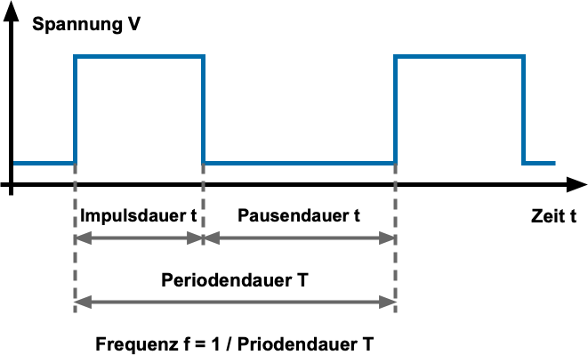 

[Quelle](https://www.elektronik-kompendium.de/sites/kom/0401111.htm)


---

## 🤓 ✍️ Aufgabe 2_1_4: Anschluss einer LED mit PWM an einen Raspberry Pi Pico

* Sorgen Sie nun dafür, dass die LED mit PWM angesteuert wird, so dass diese nach Betätigung des Tasters für $1\,\text{s}$ leuchtet und dann langsam über $5\,\text{s}$ ausgeht

---

### Beispielcode für PWM

```Python
import pwmio
import board

pwm = pwmio.PWMOut(board.GP1)  # output on LED pin with default of 500Hz

while True:
    for cycle in range(0, 65535):  # Cycles through the full PWM range from 0 to 65535
        pwm.duty_cycle = cycle  # Cycles the LED pin duty cycle through the range of values
    for cycle in range(65534, 0, -1):  # Cycles through the PWM range backwards from 65534 to 0
        pwm.duty_cycle = cycle  # Cycles the LED pin duty cycle through the range of values
```

* Die Länge des Duty-Cycles wird durch $2^{16}=65536$ Werte abgestuft
* bei `duty_cycle = 0` der Duty-Cycle bei $0 \%$ und die LED aus
* bei `duty_cycle = 65535` der Duty-Cycle  genau so lang wie die Periodendauer

[Quelle](https://docs.circuitpython.org/en/latest/shared-bindings/pwmio/index.html)

---

### [✔️ Lösung](Aufgaben\2_1_4)

<!-- _color: black -->

??? optional-class "💡 anzeigen"
    ```python
    --8<-- "Aufgaben\2_1_4\code.py"
    ```

---

### Analoge Eingänge

<!-- _class: white -->


* Sensoren liefern meist analoge Signale (z.B. Spannung, Strom, Widerstand)
* z.B. basieren viele Temperatur-Sensoren auf dem Widerstand von Metallen
* Damit ändert sich bei gleichbleibender Spannung der Strom, welcher am Eingang gemessen werden kann

---

#### Analog-Digital-Wandler

* Der Analog-Digital-Wandler (ADC) wandelt ein analoges Signal in eine digitale Zahl um
* Dabei gibt es zwei relevante Parameter
    * Auflösung: Anzahl der möglichen Werte
    * Referenzspannung: Spannungsbereich, der in die Auflösung abgebildet wird
    * z.B. 16 Bit Auflösung und $3.3 \,\text{V}$ Referenzspannung 
    $\Rightarrow$ $2^{16} = 65536$ Werte zwischen $0$ und $3.3 \,\text{V}$
* Zudem können sich Systeme in ihrer Abtastrate unterscheiden, d.h. wie oft Werte gelesen werden können (z.B. durch den Sleep-Timer im `while`-loop)

---

## ✍️ Aufgabe 2_1_5: Anschluss eines analogen Helligkeitssensors

* Verbinden Sie die `+` und `-` Leiste des Breadboards mit $3.3 \,\text{V}$ und `GND` des Raspberry Pi Pico
* Verbinden Sie den analogen Eingang `A2` mit einem Female-to-Female-Kabel
* Fügen Sie den folgenden Code ein

---

```Python
import board
import analogio
import time

# Initialisierung des ADC (Analog-Digital Converter)
ldr = analogio.AnalogIn(board.A2)

# Wiederholung
while True:
    # ADC als Dezimalzahl lesen
    read = ldr.value
    # Ausgabe in der Kommandozeile/Shell
    print("ADC:", read)
    # Warten
    time.sleep(1)
```

- Um den Wertebereich des ADC zu testen, können Sie den Eingang direkt mit `+` und `-` verbinden

---

* Verbinden Sie den Eingang zunächst mit `+`, dann mit `-` 
* Welche Werte erhalten Sie?

---

### [✔️ Lösung](Aufgaben\2_1_5\code.py)

<!-- _color: black -->


??? optional-class "💡 anzeigen"
    * Bei einer direkten Verbindung des Eingangs mit `+` oder `-` erhalten Sie die maximalen (`2**16`) bzw. minimalen Werte (nahe `0`)


---


* Schließen Sie einen Fotowiderstand als [analogen Helligkeitssensor](https://www.elektronik-kompendium.de/sites/praxis/bauteil_ky018-ldr.htm) an den Raspberry Pi Pico an
    * Links (I): +VCC z.B. 3,3 oder 5 Volt
    * Mitte: GND / Masse / 0 Volt
    * Rechts (S): Verbindungspunkt des Spannungsteilers
* Sie können den Sensor entweder auf dem Breadboard montieren oder ihn mit Male-Female-Kabeln direkt verbinden
* Verdunkeln Sie und beleuchten Sie den Sensor und beobachten Sie die Änderung des Eingangswertes
* Je mehr Licht auf den Fotowiderstand fällt, desto kleiner wird sein Widerstand. 
* Optional können Sie auch die Beleuchtungsstärke mit einem Luxmeter messen und die Werte vergleichen

---


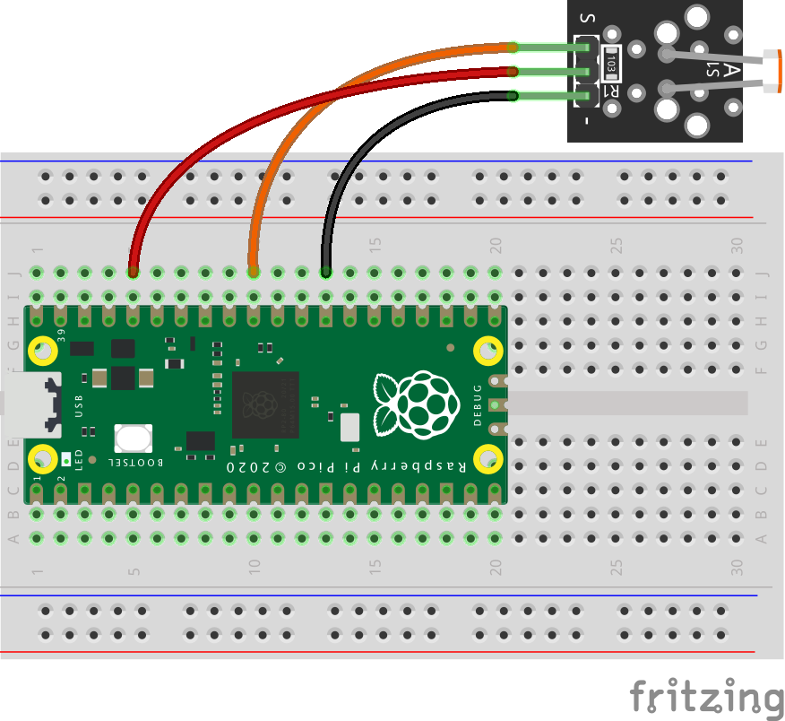


---

* Zum Testen können Sie den Analog-Eingang mit $3.3 \text{ Volt}$ und $0 \text{ Volt}$ verbinden
* Lesen Sie den Wert des Sensors aus und geben Sie diesen auf der Konsole aus
* Notieren Sie sich einige Werte (`ADC`) für verschiedene Hell-Dunkel-Verhältnisse (z.B. Zuhalten, Raumlicht, Taschenlampe) und notieren Sie die Werte


| Umgebung    | ADC | E in Lux | U in V |
|-------------|-----|----------|--------|
| Abgedunkelt |     |          | |
| Raumlicht   |     |          | |
| Taschenlampe|     |          | |


[Quelle](https://www.elektronik-kompendium.de/sites/raspberry-pi/2612221.htm)


---

#### Mapping von Eingangswert zu Spannung

* Die Spannung und der `ADC`- Wert sind linear zueinander
* Entsprechend kann jeder Wert des `ADC` über einer lineare Funktion in eine Spannung umgerechnet werden

---

| Symbol | Description |
|--------|-------------|
| $U_{max}$ | maximale Beleuchtungsstärke |
| $U_{min}$ | minimale Beleuchtungsstärke |
| $z_{max}$ | maximaler Messwert des ADC |
| $z_{min}$ | minimaler Messwert des ADC |

* Annahme: Linearer Zusammenhang
    $U = f(z) = \beta_0 + \beta_1 z$
* 1: Wie groß ist der Y-Achsenabschnitt $\beta_0$?
    * Bei welchen Wert hat $U$, wenn $z=0$?
* 2: Wie groß ist die Steigung $\beta_1$?
    * Wie groß ist die Änderung von $U$ pro Änderung von $z$?
    * $\beta_1 = \frac{{U_{max}} - U_{min}}{z_{max} - z_{min}}$


---

* Der folgende Code übernimmt dein Eingangswert und gibt einen Spannungs-Wert zwischen 3.3 und 0 zurück
* Fügen Sie die Funktion `map_lin` in den Code ein und geben Sie die Spannung auf der Konsole aus


```Python
def map_lin(z):
    U_max = 3.3
    U_min = 0
    z_max = 65535
    z_min = 0
    beta_0 = U_min
    beta_1 = (U_max - U_min) / (z_max - z_min)
    return beta_0 + beta_1 * z
```

* Wenn Sie Ihren Code schön aufgeräumt haben wollen können eine Datei `mappings.py` im gleiche Ordner wie `code.py` erstellen und die Funktion dort speichern
* Sie können diese dann mittels `from mappings import map_lin` ins `main.py` importieren und nutzen

---

#### Mapping von Eingangswert zu physikalischer Größe

* Um sinnvoller mit den Werten arbeiten zu können, ist es sinnvoller die gelesen `ADC`-Werte `read` in eine Variable mit einer sinnvollen physikalischen Einheit  zu überführen
* Im Fall dieses Sensors und Aufbaus lassen sich die Werte gut mit einer Parabel anpassen

---

* $E= f(x) = (a(x-s))^2$
    * $a =0.0015$ beschreibt die Steilheit der Parabel
    * $s = 44000$ ist der Verschiebung der Parabel auf der x-Achse
    * $x$ ist der Eingangswert

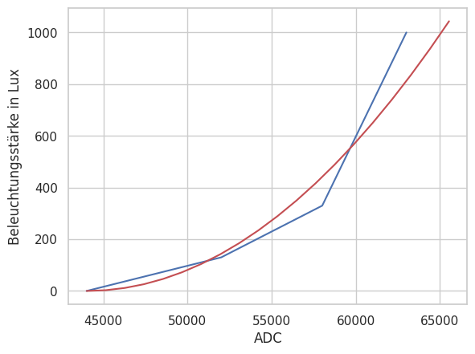

* Erstellen Sie in eine Datei `mappings.py` (im gleichen Ordner, wie die `code.py`) eine Funktion `map_quat()`, die stattdessen die oben angegeben Formel implementiert

---


##### Übliche Beleuchtungsstärken $E$

| Umfeld | $E \text{ in lux}$ |
|--------|-------------------|
| Mondlose, klare Nacht | 0,0003 |
| Nachts bei Vollmond | 0,2 |
| Beleuchtete Strassen, Plätze | 10..20 |
| Abstellräume, Lagerräume | 50 |
| Lagerräume, Toiletten, Treppen | 100 |
| Speiseräume, Werkhallen, | 200 |
| Läden, Sitzungszimmer | 300 |
| Arbeitsplätze, Schulzimmer | 500 |
| erhöhte Ansprüche | 750 |
| Elektronikmontage, Uhrenmacher | 1.000 |
| Bedeckter Himmel im Winter | 1.000.. 2.000 |
| Bedeckter Himmel im Sommer | 5.000..20.000 |
| Sonnenlicht im Winter | 10.000 |
| Sonnenlicht im Sommer | 100.000 |


---

##### Nachverarbeitung nach ADC

* Viele (teurere) Peripherie-Geräte kommen als Transmitter (Kombination aus dem Sensor selbst und einem Messumformer)
* Diese linearisieren sie spannungs-(oder Strom) Ausgabe
* Eine Umrechnung der Spannungswerte an Eingang in die Physikalische Größen muss jedoch weiterhin stattfinden
* Informationen hierzu finden sich meinst im [Datenblatt](https://shop.bb-sensors.com/out/media/Bedienungsanleitung_Helligkeitssensor_Messumformer_0555%20300x.pdf)


[Quelle](https://shop.bb-sensors.com/Messtechnik-je-Branche/Gebaeudetechnik/Helligkeitssensor-mit-Messumformer-0-10-V.html)


---

## 🤓✍️ Aufgabe 2_1_5: Mapping eines Analogen Helligkeitssensors

* Oben ist die quadratische Funktion gegeben, die die gemessenen Werte in Beleuchtungsstärke in Lux umrechnet
* Implementieren Sie diese Funktion in Python und geben Sie dann eine Nachricht mit der Beleuchtungsstärke in Lux aus
* Orientieren Sie sich dabei an folgendem Code, der ein Beispiel für ein lineares Mapping zeigt
* Evtl. müssen Sie die Werte an Ihren Sensor und Aufbau anpassen, um die Beleuchtungsstärke in Lux zu erhalten


---

* 🤓 Im besten Fall wird `map_ln` in einer eigenen Datei `mappings.py` gespeichert und kann dann mittels `import mappings` in anderen Programmen genutzt werden	

```Python
import board
import analogio
import time
from mappings import map_lin

    
# Initialisierung des ADC (Analog-Digital Converter)
ldr = analogio.AnalogIn(board.A2)

# Wiederholung
while True:
    # ADC als Dezimalzahl lesen
    read = ldr.value
    # Ausgabe in der Kommandozeile/Shell
    print("ADC:", read)
    print("E in Lux", map_lin(read))
    # Warten
    time.sleep(1)
```

---

### [✔️ Lösung](Aufgaben\2_1_5\code.py)

<!-- _color: black -->


??? optional-class "💡 anzeigen"
    ```python
    --8<-- "Aufgaben\2_1_5\code.py"
    ```

??? optional-class "💡 anzeigen"
    ```python
    --8<-- "Aufgaben\2_1_5\mappings.py"
    ```

---

## 🤓 Verwendung von Globalen Variablen

- einige Variablen sind so grundlegend, dass wir Sie nicht im Code sondern zentral verändern wollen
- Hierzu können wird Umgebungsvariablen in der `settings.toml` verändern im Verzeichnis `CIRCUITPY` ändern

```
MY_NAME = "Julian"
```
- Im Code können diese mittels `os` aufgerufen werden

```Python
#  connect to your SSID
import os

print(os.getenv('MY_NAME'))
```

* Passen Sie den Code so an, dass die zur Umwandlung benötigten Werte als Umgebungsvariablen gesetzt werden können

---

### Lösung 


<!-- _color: black -->


??? optional-class "💡 anzeigen"
    ```python
    --8<-- "Aufgaben\2_1_5\code.py"
    ```

??? optional-class "💡 anzeigen"
    ```python
    --8<-- "Aufgaben\2_1_5\mappings.py"
    ```


---

## 🤓 ✍️ Aufgabe 2_1_6: 

* Nicht bei jedem Sensor wird die gefittete Kurve perfekt passen
* passen Sie den Code so an, dass die Parameter der Kurve in der `settings.toml` hinterlegt werden können, um diese möglichst einfach anzupassen


---

### Analoge Ausgänge

<!-- _class: white -->


* Entsprechend gibt es auch analoge Ausgänge
* Diese können z.B. zur Ansteuerung von Motoren genutzt werden
* Dabei wird einer meist der Wert einer Integer-Variable im Speicher in einen Spannungswert umgewandelt---
marp: true
author: Julian Huber
size: 16:9
footer: Julian Huber - Bussysteme

# Strg+[ ] for Options

theme: beams

---

<!-- paginate: true -->


# 2.2 Steuerung

<!-- _class: title -->


---

## Ursprünge der Steuerungstechnik und Automatisierung


* **20–62** - Heron von Alexandria Automaten einer Wein und Milch spendenden Bacchus-Figur
* **1784** Webmaschinen von hölzernen Lochkarten 
* **1835** erfindet Joseph Henry das elektromechanische Relais
* **1969**  Odo J. Struger beim US-Unternehmen Allen-Bradley eine SPS (zeitgleich mit  Richard E. Morley)


---

### 🧠 Evolution zu Industrie 4.0

* **Industrie 1.0** (1784): Einsatz von mechanischen Webstühlen, die insbesondere durch **Lochkarten-Steuerungen** und später durch umlaufenden Bänder zu Webmaschinen weiterentwickelt wurden.
 
* **Industrie 2.0** (1870): erster Einsatz von Fließbändern in den USA (Schlachthöfe) unter Nutzung elektrischer Antriebe, die durch entsprechende **Schütz- und Relais-Steuerungen** geschaltet wurden.
 
* **Industrie 3.0** (1969) **Speicherprogrammierbaren Steuerungen**, Durchbruch bei der Industrieelektronik und Informationstechnik zur massenweisen Steuerung und Automatisierung der Produktion

* **Industrie 4.0** (2012) Cyber-Physikalischer Systeme mit globaler Vernetzung zur global optimierten Steuerung der international organisierten Produktion (**Internet der Dinge**). 

---

## Ablaufsteuerung

* steuert den Ablauf *ereignisdiskreter Prozesse* (Schrittkette). Beim Erreichen eines Schwellwertes einer Steuergröße (Ereignis) wir ein weiterer Prozess angestoßen.
    * z.B. Ablauf in einer Waschmaschine
    * z.B. Human Centric Lighting
    * z.B. Treppenhauslicht

---

### Beispiel Treppenlichtschaltung

> Über die Funktion Treppenlichtschaltung können Beleuchtungseinrichtungen temporär eingeschaltet werden. Nach Ablauf der Treppenlichthaltezeit kann eine Abschaltvorwarnzeit aktiv werden, die den Nutzer z. B. durch kurzzeitige Unterbrechung(„Flackern“) über die bevorstehende Abschaltung informiert. Ein erneuter Empfang einer Eingabeinformation zum Einschalten startet die Verzögerungszeit neu. Die Funktion benötigt als Eingabeinformation das Ergebnis der Bedienfunktion Licht stellen und liefert ihrerseits die Ausgabeinformation für eine oder mehrere Aktorfunktionen Lichtaktor.


---

#### Naive Lösung

```Python
import time
import board
import digitalio

PAR_HOLD = 3
PAR_WARN = 1

button_pin = board.GP0  # Replace with the GPIO pin connected to your button

button = digitalio.DigitalInOut(button_pin)
button.direction = digitalio.Direction.INPUT
button.pull = digitalio.Pull.UP  # Use pull-up resistor; change if using pull-down

led_pin = board.GP1      # Replace with the GPIO pin connected to your LED
led = digitalio.DigitalInOut(led_pin)
led.direction = digitalio.Direction.OUTPUT


while True:
    if not(button.value):  # Button is pressed (LOW)
        print("Button Pressed!")  
        led.value = True
        time.sleep(PAR_HOLD)  
        for i in range(1,5):
            led.value = False
            time.sleep(0.1)
            led.value = True
            time.sleep(0.1)
        time.sleep(PAR_WARN)
        led.value = False
```

---

#### Probleme mit der naiven Lösung

<!-- _class: white -->


* Erneutes betätigen des Taster setzt die Wartezeit nicht zurück
* Unser System hat kein Gedächtnis (über den Zustand)
* Der Ablauf sollte besser nicht nur durch einen Zeitlichen Rahmen, sondern auch durch Zustände gesteuert werden

---

```Mermaid
stateDiagram
    A : LED ein 1
    B : LED flackert
    C : LED ein 2
    E : LED aus
    [*] --> E : Systemstart
    E --> A : L_MAN
    A --> B : PAR_HOLD
    C --> E : PAR_WARN
    B --> C
```

---


### Finite State Machine (Endlicher Automat)

* In Abhängigkeit vom Systemzustand erwarten wir unterschiedliches Verhalten z.B.
    * Nach Tastendruck soll die Lampe angeschaltet werden
    * Nach Ablauf einer Wartezeit soll die Lampe ausgeschaltet werden
    * Davor gibt es ein Flackern als Warnung
    * Nach einem weiteren Tastendruck wird die Wartezeit zurückgesetzt
* Einfache Systeme lassen sich meist durch Ihre Zustände und deren Übergänge beschreiben
* Durch die Beschreibung als State-Machine können wir das Verhalten des Systems sauber trennen und die Implementierung vereinfachen

---


#### Implementierung eines Cola-Automaten

<!-- _class: white -->


* Der Automat startet im Zustand `Auswahl anfordern`
* Der Automat kann in den Zustand `Bezahlung anfordern` wechseln
* Wird die geforderte Summe erreicht, wechselt der Automat in den Zustand `Ware ausgeben`
* Ist die Ausgabe abgeschlossen, wechselt der Automat wieder in den Zustand `Auswahl anfordern`
* Wird die Bezahlung abgebrochen, wechselt der Automat in den Zustand `Rückgeld herausgeben` und dann wieder in den Zustand `Auswahl anfordern`


---

#### 🤓 (Deterministic) Finite State Machine (Endlicher Automat)

* Dieser Ansatz basiert auf der Theorie der formalen Sprachen
* Eine DFSM beschreibt ein System mit endlich vielen Zuständen beschreibt
* Eine DFSM ist ein 5-Tupel $M = (Q, \Sigma, q_0, F, \delta)$ mit
    * Endlicher Zustandsmenge $Q$
    * Endliche Eingabealphabet $\Sigma$
    * Endlicher Startzustand $q_0 \in Q$
    * Endlicher Endzustandsmenge $F \subseteq Q$
    * Übergangsfunktion $\delta: Q \times \Sigma \rightarrow Q$

---

#### 🤓 In der Theorie der formalen Sprachen

<!-- _class: white -->


* $Q = \{S_1, S_2\}$
* $\Sigma = \{0,1\}$
* $q_0 = S_1$
* $F = \{S_1\}$
* $\delta(S_1, 0) = S_2$,  $\delta(S_1, 1) = S_1$
* $\delta(S_2, 0) = S_1$,  $\delta(S_2, 1) = S_2$
* Akzeptiert (endet in $F$)
    * `1`, `11`, `01101`, `11001` 
* Akzeptiert nicht (endet nicht in $F$)
    * `0`, `10`, `10100`, `01001`
* Anwendung
    * Parser
    * [Regular Expressions](https://en.wikipedia.org/wiki/Regular_expression)

---

##### 🤓 Regular Expressions

* Eine reguläre Sprache ist eine Menge von Zeichenketten, die durch einen regulären Ausdruck beschrieben werden können
* z.B. Beider Suche nach einer Zeichenkette in einem Text
    * Alles, was `mapping` im Namen hat:
        * `.*mapping.*`
    * Alles was mit mapping beginnt und mit einer Zahl endet
        * `mapping\d+`

---

#### In der Programmierpraxis

<!-- _class: white -->


* Die Knoten stellen Systemzustände dar. Innerhalb dieser Zustände muss das Systemen nicht statisch sein (z.B. Zeit muss z.B. mitgezählt werden)
* Die gerichteten Kanten stellen Übergänge zwischen den Zuständen dar, die durch Events und Bedingungen ausgelöst werden
* Die Systemzustände können nur in festgelegten Reihenfolgen durchlaufen werden
* Ein Endzustand ist optional

---

## ✍️ Aufgabe 2_2_1: Implementierung eines Treppenhauslichts

<!-- _class: white -->


* In `code_state_machine.py` (folgende Folie) ist das auf der rechten Seite dargestellte Programm implementiert
* Beschreiben Sie verbal, was in jedem der Zustände passiert
* Berücksichtigen Sie dabei im Besonderen, warum es die beiden Zustände `LED leuchtet` und `LED flackert` gibt und diese nicht in einem zusammengefasst wurden


---

<!-- _class : white -->

```Python
import time
import board
import digitalio

PAR_HOLD = 5
PAR_WARN = 2
state = "start"

if state == "start":
    button_pin = board.GP0  # Replace with the GPIO pin connected to your button
        
    button = digitalio.DigitalInOut(button_pin)
    button.direction = digitalio.Direction.INPUT
    button.pull = digitalio.Pull.UP  # Use pull-up resistor; change if using pull-down
        
    led_pin = board.GP1      # Replace with the GPIO pin connected to your LED
    led = digitalio.DigitalInOut(led_pin)
    led.direction = digitalio.Direction.OUTPUT

    state = "LED aus"
    print("Erfolgreich gestartet")

while True:
    time.sleep(0.5)
    if state == "LED aus":
        print("State: LED aus \n  Warte auf Aktion")
        if not(button.value):  # Button is pressed (LOW)
            print("Button Pressed!")
            state = "LED an"
            led.value = True

    
    if state == "LED an":
        print("State: LED an")
        time_start = time.time()
        print("  um: ", time.time())
        state = "LED leuchtet"

    if state == "LED leuchtet":
        if not(button.value):  # Button is pressed (LOW)
            print("Button Pressed!")
            state = "LED an"

        print("LED leuchtet") 
        print(" seit: ", time.time() - time_start)
        if time.time() - time_start > PAR_HOLD:
            state = "LED flackert" 

    if state == "LED leuchtet2":
        if not(button.value):  # Button is pressed (LOW)
            print("Button Pressed!")
            state = "LED an"

        print(" seit Warnung: ", time.time() - time_warning)
        if time.time() - time_warning > PAR_WARN:
            state = "LED aus" 
            led.value = False
        
    if state == "LED flackert":
        for i in range(1,5):
            led.value = False
            time.sleep(0.1)
            led.value = True
            time.sleep(0.1)
        time_warning = time.time()
        state = "LED leuchtet2" 
        led.value = True
```


---


```Mermaid
stateDiagram
    A : Start
    C:  LED an
    D:  LED leuchtet
    E:  LED leuchtet2
    F:  LED flackert
    G : LED aus
    [*] --> A : Systemstart
    A --> C : Taster wird gedrückt
    C --> D : 
    D --> F : PAR_HOLD vergeht
    E --> G : PAR_WARN vergeht
    F --> E: 
    D --> C: Taster wird gedrückt
    E --> C: Taster wird gedrückt   
    G --> C: Taster wird gedrückt   
```

---

### [✔️ Lösung](Aufgaben\2_2_1)

<!-- _color: black -->

??? optional-class "Lösung anzeigen"
    ```python
    --8<-- "Aufgaben\2_2_1\code_state_machine.py"
    ```

---

## ✍️ Aufgabe 2_2_2: State Machine für einen Dimmschalter 

* Stellen Sie sich einen Dimmer vor, der durch Halten des Tasters die Helligkeit einer LED über die PWM steuert
* Durch ein kurzes Drücken des Tasters soll die Helligkeit auf 0% bzw. 100% gesetzt werden
* Durch einen Doppeldruck soll der Dimm-Modus gestartet werden
* in diesem wird durch Halten des Tasters die Helligkeit von 0% auf 100% hoch- bzw. heruntergefahren werden, je nach dem, wie lange der Taster gehalten wird
* Nach dem Loslassen wird die Richtung umgekehrt
* Durch einen einfachen Druck wird der Dimm-Modus und wieder in den normalen Modus gewechselt
* Zeichen Sie eine State Machine, die dieses Verhalten beschreibt
* Überlegen Sie sich dazu zunächst sinnvolle Zustände und versuchen Sie diese dann mit sinnvollen Übergängen zu verknüpfen

---

### [✔️ Lösung](Aufgaben\2_2_2)

<!-- _color: black -->

??? optional-class "💡 anzeigen"
    ```Mermaid
    stateDiagram
        A : 100%
        B : 0%
        C : aufwärts
        D : abwärts
        A --> B: kurzer Druck
        B --> A: kurzer Druck
        A --> D: langer Druck
        B --> C: langer Druck
        C --> D: loslassen
        D --> C: loslassen
    ```


---


<!-- _class: white -->


---

### [✔️ Verbesserte Lösung](Aufgaben\2_2_2)

<!-- _color: black -->

??? optional-class "💡 anzeigen"
    ```Mermaid
    stateDiagram
        A : 100%
        B : 0%
        C : aufwärts - warte auf Eingabe
        D : abwärts - warte auf Eingabe
        E : dimme abwärts
        F : dimme aufwärts
        A --> B: kurzer Druck
        B --> A: kurzer Druck
        A --> D: Doppel-Druck
        B --> C: Doppel-Druck
        D --> E: halten
        E --> C: loslassen
        C --> F: halten
        F --> D: loslassen
        D --> A: kurzer Druck
        C --> B: kurzer Druck
    ```


---

<!-- _class: white -->


---


## 🤓✍️ Aufgabe 2_2_3: Implementierung eines Dimmschalter

* Implementieren Sie einen Dimmer
* Lösung mit einer State Machine und Darstellung der State Machine gibt 5% Bonus


---

## Verknüpfungssteuerungen

* Während Ablaufsteuerungen den Ablauf eines Prozesses steuern, verknüpfen Verknüpfungssteuerungen die Eingangssignale mit den Ausgangssignalen
* Diese Trennung ist jedoch eher akademisch, da die meisten Systeme sowohl Ablauf- als auch Verknüpfungssteuerungen enthalten

---

### Beispiel: Wechselschalter

<!-- _class: white -->

* Verknüpfungssteuerungen können z.B. durch Wahreheitstabellen und Boolsche Funktionen beschrieben werden
* Später werden wir hierzu noch grafische Beschreibungen kennenlernen (Funktionsplan, Kontaktplan, ...)


---

**Wahrheitstabelle**

| Schalter 1 | Schalter 2 | Lampe |
|------------|------------|-------|
|     0      |     0      |   1   |
|     0      |     1      |   0   |
|     1      |     0      |   0   |
|     1      |     1      |   1   |

**Boolsche Funktion**
$L = (S_1 \land S_2) \lor (\lnot S_1 \land \lnot  S_2)$


---


## ✍️ Aufgabe 2_2_4: Implementierung einer vereinfachten Tageslichtschaltung


* Wir vereinfachen die Tageslichtschaltung, indem wir die Parameter für Zeit und Mindest-Beleuchtungsstärke (`PAR_SETPT`) weglassen
* Zeichen Sie zunächst eine Wahrheitstabelle für die Tageslichtschaltung
* Setzen Sie `L_MAN` zunächst im Code auf `False` 

--- 

* 🤓 schließen Sie dafür nur einen zusätzlichen Button dafür an, wenn Sie mit der restlichen Schaltung fertig sind
* Nutzen Sie einen Button, um den Anwesenheitszustand `P_ACT` zu simulieren
*H_ROOM* können Sie entweder als Beleuchtungsstärke, Spannung oder  `ADC-Wert` setzen
* `L_SET` soll das Ausgangssignal sein, das die Lampe steuert und kann zunächst auf `True` gesetzt werden. 🤓 Später können Sie diesen auch durch eine Pulsweitenmodulation setzen.

---

| `P_ACT` | `H_ROOM` `<` `PAR_SETPT` | `L_MAN` | `L_SET` |
|-------|----------------|-------|-------|
|   0   |        0       |   0   |   0   |
|   1   |        0       |   0   |   0   |
|   0   |        1       |   0   |   0   |
|   1   |        1       |   0   |   1   |
|   0   |        0       |   1   |   1   |
|   1   |        0       |   1   |   1   |
|   0   |        1       |   1   |   1   |
|   1   |        1       |   1   |   1   |

$$L_{\text{SET}} = (P_{\text{ACT}} \land (H_{\text{ROOM}} < \text{PAR}_{\text{SETPT}})) \lor  L_{\text{MAN}})$$

---

### Hinweise 

- Bauen Sie auf Aufgaben 2_1_3 und 2_1_5 auf, um die Tageslichtschaltung zu implementieren


??? optional-class "💡 anzeigen"
    ```python
    --8<-- "Aufgaben\2_1_3\code.py"
    ```
??? optional-class "💡 anzeigen"
    ```python
    --8<-- "Aufgaben\2_1_5\code.py"
    ```
??? optional-class "💡 anzeigen"
    ```python
    --8<-- "Aufgaben\2_1_5\mappings.py"
    ```

---

### [✔️ Lösung](Aufgaben\2_2_4)

<!-- _color: black -->

??? optional-class "💡 anzeigen"
    ```python
    --8<-- "Aufgaben\2_2_4\code.py"
    ```---
marp: true
author: Julian Huber
size: 16:9
footer: Julian Huber - Bussysteme

# Strg+[ ] for Options

theme: beams

---

<!-- paginate: true -->


# 2.3 Funktionen

<!-- _class: title -->


---

## Funktionale Programmierung

* Berechnung von Output aus Input wird in wieder aufrufbaren Funktionen gekapselt
* Funktion hat nur Input und Output aber keinen Speicher / Zustand 

```Python
def add(a, b):
    return a + b

add(1, 2) # 3
add(3, 4) # 7
```

---

## Steuerfunktion

$$L_{\text{SET}} = (P_{\text{ACT}} \land (H_{\text{ROOM}} < \text{PAR}_{\text{SETPT}})) \lor  L_{\text{MAN}}$$

```Python
def l_set(p_act, h_room, PAR_SETPT, l_man):
    return (p_act and (h_room<PAR_SETPT)) or l_man
```

```Python
from tageslichtschaltung import l_set
from mapping import map_quat

while True:
    l_set_value = l_set(p_act, h_room, PAR_SETPT, l_man)
```

---


## 🤓✍️ Aufgabe 2_3_1: Implementierung einer Tageslichtschaltung

* Implementieren Sie die Tageslichtschaltung in Python
* Stellen Sie zunächst sicher, dass LED, Button und Analog-Digital-Wandler korrekt angeschlossen sind
* Setzen Sie die manuelle Einstellung `l_man` dauerhaft auf `False` 
* Setzen Sie den Sollwert `PAR_SETPT` auf einen geigneten Wert
* Legen Sie die beiden Module `tageslichtschaltung.py` und `mappings.py` in den gleichen Ordner wie Ihre Hauptdatei
* 🤓 Recherchieren Sie einen geeigneten Sensor, den Sie für die Anwesenheitserkennung verwenden können

---

### Möglicher Startpunkt

```Python
import board
import analogio
import time
from mappings import map_quat
from tageslichtschaltung import l_set
import digitalio

# Initialisierung des ADC (Analog-Digital Converter)
ldr = analogio.AnalogIn(board.A2)

# Initialisierung der LED
led_pin = board.GP1      # Replace with the GPIO pin connected to your LED
led = digitalio.DigitalInOut(led_pin)
led.direction = digitalio.Direction.OUTPUT

# Initialisierung Button
button_pin = board.GP0  # Replace with the GPIO pin connected to your button
button = digitalio.DigitalInOut(button_pin)
button.direction = digitalio.Direction.INPUT
button.pull = digitalio.Pull.UP  # Use pull-up resistor; change if using pull-down


# Parameter setzen
PAR_SETPT = 100
l_man = False


# Wiederholung
while True:
    # ADC als Dezimalzahl lesen
    read = ldr.value
    # Ausgabe in der Kommandozeile/Shell
    print("ADC:", read)
    print("E in Lux", map_quat(read))

```

---

### `tageslichtschaltung.py`

```Python
def l_set(p_act, h_room, PAR_SETPT, l_man):
    return (p_act and h_room<PAR_SETPT) or l_man
```

---

### `mappings.py`

```Python
def map_lin(z):
    E_max = 1
    E_min = 0
    z_max = 65535
    z_min = 0
    beta_0 = E_min
    beta_1 = (E_max - E_min) / (z_max - z_min)
    return beta_0 + beta_1 * z

def map_quat(x):
    s = 44000
    a = 0.0015
    return ((x-s)*a) **2

```

### [✔️ Lösung](Aufgaben\2_3_1)

<!-- _color: black -->

??? optional-class "💡 anzeigen"
    ```python
    --8<-- "Aufgaben\2_3_1\code.py"
    ```

---

## ✍️ Aufgabe 2_3_2:

* Welche Teile des Codes könnte man ebenfalls in Funktionen auslagern?
* Wie schätzen Sie den Aufwand ein, wenn man nun weitere Tageslicht-Schaltungen mit anderen LEDs und Sensoren auf der gleichen Platine realisieren möchte?

### ✔️ Lösung

* Initialisierung, da die Code immer gleich ist und sich nur je nach Aufbau die Pins ändert
* Umrechnungen
* Einfacher, wenn mehr (z.B. auch die Zuweisung der Ein- und Ausgänge) in Funktionen ausgelagert wird

---

## Sichtbarkeit von Variablen

### Lokale Variablen

* Variablen, die innerhalb einer Funktion definiert werden (z.B. `s`) sind außerhalb der Funktion nicht sichtbar (*Kapselung*)
* Dies gilt für die meisten Programmiersprachen und z.B. auch für Schleifen

``` Python
def map_quat(x):
    s = 44000
    a = 0.0015
    return ((x-s)*a) **2

print(s)
# NameError Traceback (most recent call last)
# <ipython-input-11-76c4dd40fb41> in <module>
# ----> 1 print(s)

# NameError: name 's' is not defined
```

---

### Globale Variablen

- Variablen, die (bewusst) überall im Programmcode aufrufbar sind (z.B. `PAR_SETPT`) sind **globale Variablen**
- in Python werden globale Variablen in Großbuchstaben geschrieben

```Python
A_GLOBAL_VAR = 1

def my_function():
  a_local_variable = 2
  return a_local_variable

another_variable = my_function()

print(A_GLOBAL_VAR) # 1
print(a_local_variable) # Error
print(another_variable) # 2
```

---
marp: true
author: Julian Huber
size: 16:9
footer: Julian Huber - Bussysteme

# Strg+[ ] for Options

theme: beams

---

<!-- paginate: true -->


# 2.4 Objektorientierung

<!-- _class: title -->


---

## Motivation

* **Funktionen** haben wohl definierten Input und Output aber **keinen Speicher / Zustand**
* Eine **State-Machine** hat einen Zustand, aber ist **aufwendig** zu implementieren und anzupassen
* Bedarf für beides: wenn wir bei einer Messfunktionen das Signal glätten wollen, müssen wir den Zustand (letzte Messerwerte) speichern


---

## Grundkonzepte der Objektorientierung

* Programmierparadigma mit Fokus auf Objekte, deren Eigenschaften und Fähigkeiten
* z.B. Objekt der Klasse `Sensor`
  * Attribute (Eigenschaften mit Datentyp):
    * Name
    * Einheit
    * Aktueller Messerwert 
    * Liste bisheriger Messerwerte
  * Methoden (wie Funktionen):
    * Mittelwert bilden
    * Messen
    * Letzten Messwert übermitteln


---

### Klassen und Objekte

* Die Sensor-Klasse beschreibt allgemein das Verhalten jedes Sensors!
* Jeder einzelne Sensor ist ein Objekt der Klasse Sensor, bei dem die Attribute individuell ausgeprägt 

    * Beleuchtungsstärke-Sensor
    * Temperatursensor
    * ...


---


```Mermaid

classDiagram
    class Sensor{
        +string name
        +string unit
        +float measurement
        +[]float measurements
        +do_measurement()
        +calc_mean()
        +print_data()
    }
```

---

### Attribute


```python
# Definition einer Klasse
class Sensor:
    def __init__(self, name, unit):
        self.name = name
        self.unit = unit
        self.measurement = None
        self.measurements = []

# Instanziierung eines Objekts
sensor1 = Sensor("Temperatursensor", "°C")
sensor2 = Sensor("Beleuchtungsstärke", "Lux")

# Aufruf der Attribute
print(sensor1.name)
print(sensor2.name)
```

---

- Die Methode **```__init__```** wird aufgerufen, sobald ein **Objekt** einer **Klasse** instanziiert wird. Die Methode kann dafür benutzt werden, ihr Objekt auf irgendeine Weise zu initialisieren
- wichtig ist in jeder Methode als erstes Argument **```self```** zu übergeben, damit die Methode auf das Objekt zugreifen kann
- Ebenso werden Attribute mit **```self```** definiert, damit sie dem Objekt zugeordnet werden

---

### Methoden & Funktionen

* Methoden sind Funktionen, die zu einer Klasse gehören
* Funktionen sind wieder aufrufbare Code-Einheiten, denen Argumente als Parameter übergeben werden können
* Funktionen geben einen Rückgabewert aus, der weiterverarbeitet werden kann

---

```python
# Definition einer Klasse
class Sensor:
    def __init__(self, name, unit):
        self.name = name
        self.unit = unit
        self.measurement = None
        self.measurements = []
    
    def print_data(self):
        print("This " + self.name + "returns data in " + self.unit)

# Instanziierung eines Objekts
sensor1 = Sensor("Temperatursensor", "°C")

# Aufruf der Attribute
sensor1.print_data()

```

---

## ✍️ Aufgabe 2_4_1: Implementierung einer Sensor-Klasse

```Python
import board
import analogio
import time
import digitalio

# Initialisierung des ADC (Analog-Digital Converter)
ldr = analogio.AnalogIn(board.A2)

class Sensor:
    def __init__(self, name, unit):
        self.name = name
        self.unit = unit
        self.last_measurement = None
        self.measurements = []

    def do_measurement(self, ldr):
        self.last_measurement = ldr.value
        self.measurements.append(self.last_measurement)

    def print_data(self):
        print("This " + self.name + "returns data in " + self.unit)
        
beleuchtungs_sensor = Sensor("Beleuchtungsstärke", "ADC")


# Wiederholung
while True:
    
    # ADC als Dezimalzahl lesen
    beleuchtungs_sensor.do_measurement(ldr)
    print(beleuchtungs_sensor.last_measurement)    

    # Warten
    time.sleep(1)
```

---

- Passen Sie den gegeben Code so an, dass der Sensor auch über eine Methode verfügt, welche den Mittelwert der Messwerte zurückgibt
- Sie können die folgende Funktion als Ausgangspunkt verwenden
- Vergessen Sie nicht das `self`-Argument zu übergeben
- Hierdurch können sie auch die Übergabe des Parameters `list_of_measurements` vermeiden, die Sie sich im Objekt direkt auf `self.measurements` beziehen können
```Python
def bilde_mittelwert(list_of_measurements):
  """ Eine Funktion, die eine Liste von Werten übernimmt und das arithmetische Mittel zurück gibt"""

  mittelwert = sum(list_of_measurements) / len(list_of_measurements)
  return mittelwert

ergebnis = bilde_mittelwert([1,2,3])
```

---

## 🤓 ✍️ Aufgabe 2_4_2:


- Stellen Sie sicher, dass maximal die letzten 10 Messwerte gespeichert werden
- Erweitern die Methode `calc_mean` so, dass optional nur die letzten `n`  Messwerte berücksichtigt werden und `n` als Parameter übergeben werden kann 
- Integrieren Sie die `mappings.py` in Ihre Sensor-Klasse, damit diese Lux-Werte zurückgibt
- 🤓 🤓 Überlegen Sie, wie Sie dem Sensor bei der Instanziierung unterschiedliche Mapping-Funktionen übergeben können

---

### [✔️ Lösung](Aufgaben\2_4_2)

<!-- _color: black -->

??? optional-class "💡 anzeigen"
    ```python
    --8<-- "Aufgaben\2_4_2\code.py"
    ```

??? optional-class "💡 anzeigen"
    ```python
    --8<-- "Aufgaben\2_4_2\mappings.py"
    ```
??? optional-class "💡 anzeigen"
    ```python
    --8<-- "Aufgaben\2_4_2\my_classes.py"
    ```

---


## JSON-Darstellung eines Objekts

### Serialisierung von Objekten


* Zur Übertragung zwischen Systemen und Speicherung müssen Objekte unabhängig vom der Darstellung im Arbeitsspeicher gemacht werden
* Serialisierung:
  * Objekt aus dem Arbeitsspeicher wird in eine Folge von Zeichen übersetzt (letztlich eine Folge von Bits)
  * Austauschdateiformat (meist in Form einer Auszeichnungssprache)

---


### Dictionaries

* Sind die Implementierung von Hash-Tabellen in Python (ein Datentyp vergleichbar mit einer Liste)
* Anstelle einer Liste, in der Werte über eine Indexposition abgerufen werden, werden Werte über einen Schlüssel abgerufen
* Schlüssel-Wert-Paare `{<key1>:<value1>, <key2>:<value2>, <key3>:<value3}`
```python
my_dict = beleuchtungs_sensor.__dict__ 
print(my_dict)
```

--- 
```python
{'last_measurement': 43114,
 'measurements': [43130, 43034, 43066, 42666, 43370, 43114, 42426, 43114], 
 'name': 'Beleuchtungsstärke', 
 'unit': 'ADC'}
```
* Das `__dict__`-Attribut enthält alle Attribute des Objekts als Dictionary
* Auf die Werte im Dictionary kann über den Schlüssel zugegriffen werden
```python
print(my_dict["last_measurement"])
```
---

### JavaScriptObjectNotation (JSON)

- Dictionary-Objekte können in JSON-Objekte umgewandelt werden
- JSON is eine Auszeichnungssprache, die für den Datenaustausch zwischen Systemen verwendet wird
```py
import json 
with open("sample.json", "w") as outfile: 
        json.dump(my_dict, outfile)
```

```JSON
{"last_measurement": 43114, 
"measurements": [43130, 43034, 43066, 42666, 43370, 43114, 42426, 43114], 
"name": "Beleuchtungsst\u00e4rke",
 "unit": "ADC"}
```

- über eine eignete Codierung (z.B. ASCII, UTF) können auch Binärdaten übertragen werden `<stings>.encode("ascii")`
```
1111011001001110110110101100101011101000110010101110010010111110110100101100100001001110011101000100000...
```

---

## ✍️ Aufgabe 2_4_3:

- Nehmen wir an, wir möchten die Messwerte eines Sensors über ein Bussystem übertragen
- Halten Sie es für sinnvoll, das ganze Dictionary zu übertragen? Wenn nein, welche Werte würden Sie übertragen?
- Implementieren Sie eine Methode `prepare_data()`, die Ihren Vorstellungen entspricht und das bereiningte Dictionary zurückgibt und printen Sie es
- `del(my_dict["unit"])` entfernt z.B. den Eintrag `unit` aus dem Dictionary

---

### ✔️ Lösung

* Ob es sinnvoll ist das gesamte Dictionary zu übertragen, hängt von unter anderem von der Bandbreite des Bussystems ab. Ist diese begrenzt macht es ggf. Sinn nur die sich verändernden Werte zu übertragen. Wenn man alle Information aus den Nachrichten extrahieren möchte, ist es aber auch sinnvolle das ganze Dictionary zu übertragen. 
* Priorität hat die Übertragung der Messwerte und ggf. die Einheit


---

<!-- _color: black -->

??? optional-class "💡 anzeigen"
    ```python
    --8<-- "Aufgaben\2_4_2\my_classes.py"
    ```

---

## Appendix

### 🤓 Vererbung

<!-- _class: white -->

- Durch Vererbung können die **Attribute** und **Methoden** einer (Parent-)Klasse **an andere** (Child-)**Klassen weitergegeben** werden. 
- Neu implementiert werden müssen dann nur zusätzliche Datenelemente und Methoden. 
- Im UML-Klassendiagramm wird die Vererbung mit meinem im **leeren Dreieck endenden Pfeil** dargestellt.
- Dies ermöglicht eine **hierarchische Strukturierung** von Klassen z.B. um schnell verschiedene Sensor-Klassen zu erstellen


------
marp: true
author: Julian Huber
size: 16:9
footer: Julian Huber - Bussysteme

# Strg+[ ] for Options

theme: beams

---

<!-- paginate: true -->


# 3.1 Blockschaltbild

<!-- _class: title -->


---

## Blockschaltbild


* Grafische Beschreibung von Systemen in der Regelungs- und Steuerungstechnik
* Systeme werden durch Blöcke dargestellt, die durch Pfeile verbunden sind
  * z.B. Steuerungsfunktion (z.B. in Python)
  * z.B. thermodynamisches Modell eines Raums

---

* I.d.R. beschäftigen wir uns mit **dynamischen Systemen**
    * Die Ausgangsgröße hängt nicht nur  von den Eingangsgrößen ab (vgl. _Funktion_) 
    * sondern auch vom Systemzustand und damit inneren Zustandsgrößen (vgl. _Objekt_)


[Quelle](Lunze )

---

### 🤓 Dynamische Systeme

* lineare Systeme: Systemfunktion ist eine lineare Funktion
* nichtlineare Systeme: Systemfunktion ist eine nichtlineare Funktion
* zeitinvariante Systeme: Systemfunktion ist unabhängig von der Zeit
* zeitvariante Systeme: Systemfunktion ist abhängig von der Zeit

---


## Elemente eines Blockschaltbildes


* Übertragungsglieder beschreiben Systeme mit deren Eigenschaften / Funktionen
* Pfeile die Ein- und Ausgangsgrößen
* Komplexe Systeme können durch mehrere Systeme zusammengesetzt werden
* Systeme werden im Zeitbereich durch ihre Funktionsbeziehung zwischen Ausgang $y$ und Eingang $u$ unterschieden $f(u)=y$


---

### Proportionalglied (P-Glied)

* Linear und zeitinvariant
* Beschreibt Systeme mit direktem proportionaler Systemfunktion $f$ für den Zusammenhang zwischen Eingang ($u$) und Ausgang ($y$)
  * $y = f(u)=K_p \cdot u$
  * $K_p$ ... Proportionalitätsfaktor


---

#### Wirkweise eines P-Glieds

* $y = f(u)=K_p \cdot u$
* Beispiel: 
  * je höher die $\text{CO}_2$ Konzentration in einem Raum, desto schneller dreht sich ein Ventilator in einer Lüftungsanlage
  * $y$ ... Drehfrequenz der Ventilators in $\text{Hz}$
  * $u$ ... $\text{CO}_2$ Konzentration in $\text{ppm}$
  * $K_p$ ... Proportionalitätsfaktor in $\frac{\text{Hz}}{\text{ppm}}$


---


* Unabhängig vom Verlauf der Eingangsgröße $u(t)$ ist der Wert der Ausgangsgröße $y(t)$ immer proportional

---

#### 🧠 Einheits-Sprungfunktion

* Eine Funktion, die am Zeitpunkt $t=0$ von $u=0$ auf $u=1$ springt und sonst konstant bleibt
* beliebtes Werkzeug in die Regelungstechnik: Wie reagiert ein System, wenn wir eine Sprungfunktion an den Eingang legen (auch in der E-Technik!)


---

#### 🧠 Sprungantwort (Reaktion) eines P-Glieds auf eine Sprungfunktion


---

<!-- _class: white-->


* Das Symbol repräsentiert die Sprungantwort
* weitere Beispiele:
  * Entwicklung Spannungsabfall am Ohmschen Widerstand 
  beim Anlegen einer Quellenspannung
  * Antwort eines Helligkeitssensors auf Lichteinfall

[Quelle](Lunze )


---

### Totzeitglied (T-Glied)

* beschreibt die zeitliche Verzögerung, bis ein System auf das Eingangssignal (z.B. der Sprungfunktion) reagiert. 
* Nicht die Trägheit des Systems sondern eine Leerlaufzeit $T_t$. 


---


---

#### 🧠 Sprungantwort eines T-Glieds auf eine Sprungfunktion


---

## Simulation mit scilab xcos

- Installieren Sie [scilab xcos](https://www.scilab.org/download/scilab-2024.0.0)
- Xcos ist ein grafischer Editor für Blockschaltbilder
- die Funktionalität entspricht in etwa matlab simulink
- allerdings ist die Software open source und kostenlos
- Alternativ können Sie auch Matlab oder [Matlab Online](https://www.mathworks.com/products/matlab-online.html) verwenden


---

## ✍️ Aufgabe 3_1_0: Proportional mit Totzeitglied


- Öffnen Sie [P_totzeit.zcos](https://github.com/jhumci/scilab_xcos_solutions/blob/main/Bussysteme/3_1_0/P_totzeit.zcos) in [scilab xcos](https://www.scilab.org/download/scilab-2025.0.0) oder [GainDelay.slx](https://github.com/jhumci/scilab_xcos_solutions/blob/main/Bussysteme/3_1_0/GainDelay.slx) in Matlab
- Testen Sie verschiedene Werte für den P-Wert beim `PID`-Block und die Totzeit beim `Continuous fix delay`-Block
- Ersetzen Sie den `PID`-Block durch einen `GAIN_f`-Block


---

### Proportionalglied mit Verzögerung 1. Ordnung (PT1-Glied)

* beschreibt Trägheit im System oder eine Dämpfung 
* nähert sich über die Zeit einer waagrechten Linie an
  * z.B. Spannung am Kondensator
  * z.B. Temperatur im Raum nach dem Einschalten einer Fußbodenheizung
  * Beschränktes Wachstum


---

- Es gibt noch viele weitere typische Glieder 
- Mehr dazu beim Thema stetige Regler
- aus diesen lassen sich komplexe Modelle zusammenstellen lassen 
(z.B. als Blockschaltbild)

---

## Blockschaltbild einer Steuerung


* Die **Führungsgröße** ist die Größe, welche das Verhalten der Stellglieds bestimmt ($\rightarrow$ z.B. die aktuelle Beleuchtungsstärke gemessen am Lichtsensor  im Freien)
* Durch das Stellen eines **Stellglieds** (oder Stelleinrichtung bzw. Aktor) wird die Steuerstrecke beeinflusst ($\rightarrow$ Mikrocotroller steuert Spannung an LED an oder aus basierend auf einen Schwellenwert)


[Quelle](https://upload.wikimedia.org/wikipedia/commons/6/64/R_S_Block.svg)

---

## 🧠 Steuerung


* **Stellgröße** ist die Ausgangsgröße des Stellglieds ($\rightarrow$ Spannung an der LED)
* **Steuerstrecke** ist das System, das durch die Stellgröße und Störgrößen beeinflusst wird ($\rightarrow$ Helligkeit im Raum)
* Auf die Steuerstrecke wirken neben der Stellgröße aus **Störgrößen** 
($\rightarrow$ Lichteinfall von Außen, weitere nicht gesteuerte Lichtquellen im Raum)


[Quelle](https://upload.wikimedia.org/wikipedia/commons/6/64/R_S_Block.svg)


---

### Stellglied

* ist nun kein standardisiertes Glied,
 sondern hat eine spezielle Funktion die sich aus Hard- und Software ergibt
* diese beinhaltet Steuerungslogik
* und physikalische Umsetzung
* zeitliche Reaktion meist nicht unmittelbar, sondern verzögert 
(z.B. Rechenzeit als Totzeit)

```Python
def l_set(p_act, h_room, PAR_SETPT, l_man):
    return (p_act and h_room<PAR_SETPT) or l_man
```

---

### Steuerstrecke

* beschreibt die echte Welt
* häufig in vereinfachten Modellen
* zeitliche Reaktion meist nicht unmittelbar (z.B. PT1-Glied)

```Python
def beleuchtungsstraerke_raum_lux(lichtabgabe_led, lichteinfall_aussen, wand_farbe):
  # Größe des Raumes
  # Größe der Fenster
  # Reflexion der Wände
  <...>
  return beleuchtungsstraerke_raum_lux
```

```Python
def raumtemperatur(heizleistung_in_w, aussen_temp_in_c):
  # Temperatur im Zeitpunkt zuvor
  # Trägheit der Temperaturänderung
  # Größe des Raumes
  # Isolation der Raumes
  <...>
  return raum_temp_in_c
```


---

## ✍️ Aufgabe 3_1_1: Wassertank ohne Steuerung

- Bauen Sie das folgende Modell aus `CONST`, `INTEGRAL_m`, `CSCOPE` und `CLOCK_c` nach
- Modellieren Sie einen 100 l fassenden Wassertank, der zu Begin mit 10 l gefüllt ist und in den 5 l pro Minute einfließen


---

### ✔️ Lösung

<!-- _color: black -->

??? optional-class "💡 anzeigen"
    [Link Scilab](https://github.com/jhumci/scilab_xcos_solutions/blob/main/Bussysteme/3_1_1/Wassertank.zcos)
    [Link Matlab](https://github.com/jhumci/scilab_xcos_solutions/blob/main/Bussysteme/3_1_1/Wassertank.slx)

---

## ✍️ Aufgabe 3_1_2: Einfache Tageslichtschaltung


- passen Sie den Threshold in `Dynamic` in [3_1_2_Tageslichtschaltung.zcos](https://github.com/jhumci/scilab_xcos_solutions/blob/main/Bussysteme/3_1_2/3_1_2_Tageslichtschaltung.zcos), bzw [Tageslichtschaltung.slx](https://github.com/jhumci/scilab_xcos_solutions/blob/main/Bussysteme/3_1_2/Tageslichtschaltung.slx) so an, dass die LED bei einer Helligkeit unter 220 Lux angeht
- Überlegen sie auch, ob die Richtung der Schaltung so stimmt un passen Sie diese bei Bedarf an


---

### ✔️ Lösung

<!-- _color: black -->

??? optional-class "💡 anzeigen"
    [Link](https://github.com/jhumci/scilab_xcos_solutions/blob/main/Bussysteme/3_1_2/3_1_2_Tageslichtschaltung.zcos)

---


## Zwei-Punkt Regelung

- Vorteile
  - einfach zu verstehen
  - und zu implementieren

```Python
regelabweichung = soll_lux - ist_lux 

zweipunkt_regler(regelabweichung):
  if regelabweichung > 0:
    licht = True
  else:
    licht = False
  return licht
```

[Quelle](Vorsicht: Wir greifen hier zum Thema Regelung vor, setzen den Regler aber in einer Steuerung ohne Regelkreis ein!)

---


### Probleme Zwei-Punkt Regelung

* Nachteile bei zeitlich wenig trägen Systemen
  * Regler schaltet ständig zwischen den Ausgangswerten
  * kritisch insbesondere bei mechanische Belastung
  * z.B. Motor wird ständig an und aus geschaltet

---


## Hysterese

- bewirkt eine Schalttoleranz ober- und unterhalb des Sollwerts


---

```Python
def zweipunkt_hysterese(ist_lux, on_level, off_level, letzter_zustand):
    if ist_lux > off_level:
      licht = False
    elif ist_lux < on_level:
      licht = True
    else:
      licht = letzter_zustand

    return licht
```

```Python
class zweipunkt_hysterese():

    def __init__(self, on_level, off_level):
        self.on_level = on_level
        self.off_level = off_level
        self.letzter_zustand = False

    def calc_output(self, ist_lux):
        if ist_lux > self.off_level:
            self.letzter_zustand = False
        elif ist_lux < self.on_level:
            self.letzter_zustand = True
        return self.letzter_zustand

```


[Quelle](https://www.wikiwand.com/de/Methode_der_harmonischen_Balance#Media/Datei:Zweipunktkennlinie.png)


---


[Quelle](https://www.youtube.com/watch?v=nC5ZPEPtH9w)

---

### Drei-Punkt Regelung

* vermeidet ständiges Umschalten
* sinnvoll bei Neutralstellung z.B. Motoren

  ```Python
  drei_punk_regler(abstand):
    if abstand > 6:
      fahre = "vorwärts"
    elif abstand < 4:
      fahre = "rückwärts"
    else:
      fahre = "nicht"
    return fahre

  bewegung = drei_punk_regler(abstand)
  ```


---

## ✍️ Aufgabe 3_1_3: Einfache Tageslichtschaltung

- Ersetzen Sie den Schalter `Dynamic` mit einem Hystereseschalter `HYSTERESIS` bzw. `Relay` in Simulink
- Überlegen sie auch, ob die Richtung der Schaltung so stimmt un passen Sie diese bei Bedarf an


---

### ✔️ Lösung

<!-- _color: black -->

??? optional-class "💡 anzeigen"
    [Link Scilab](https://github.com/jhumci/scilab_xcos_solutions/blob/main/Bussysteme/3_1_3/3_1_3_Tageslichtschaltung_Hysterese.zcos)
    [Link Matlab](https://github.com/jhumci/scilab_xcos_solutions/blob/main/Bussysteme/3_1_2/Tageslichtschaltung_2.slx)---
marp: true
author: Julian Huber
size: 16:9
footer: Julian Huber - Bussysteme

# Strg+[ ] for Options

theme: beams

---

<!-- paginate: true -->


# 3.2 Regelkreise

<!-- _class: title -->


---

## Beispiel Konstantlicht-Regelung

> regelt die Raumbeleuchtung oder Teile davon bei Belegung automatisch so, dass eine eingestellte Mindestbeleuchtungsstärke nicht unterschritten wird

* Im Gegensatz zur Tageslichtschaltung, soll es aber auch nicht unnötig hell sein, wenn es draußen schon hell ist


---

### Konstantlicht-Regelung

* Lichtstärke kann (quasi) stetig gesteuert werden (z.B. über Dimmer oder Pulsweitenmodulation)


---

## ✍️ Aufgabe 3_2_1: Konstantlicht-Regelung

* Laden Sie die Datei [Konstantlicht_nur_p.zcos](https://github.com/jhumci/scilab_xcos_solutions/blob/main/Bussysteme/3_2_1/Konstantlicht_nur_p.zcos) und passen Sie den P-Parameter in `PID`-Baustein an und beobachten Sie die Reaktion des Systems
* Welche Komponenten werden durch welche Bausteine dargestellt?


---

### ✔️ Lösung

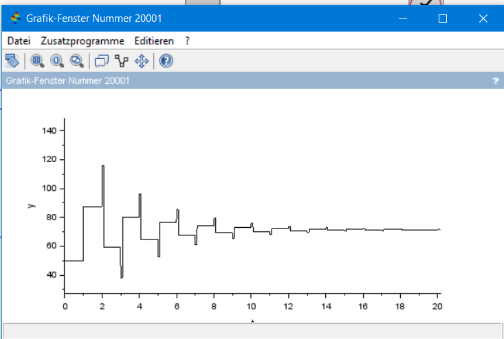

* Bleibende Regelabweichung. Die 100 Lux werden nie erreicht
* Schwingen des Systems
* Sprunghaftes Verhalten (wegen Delay)

---

## Proportional-Regler

* Reaktion der Stellgröße bzw. Steuerungsgröße 
$u(t)=K_P \cdot e(t)$
* multipliziert die Regelabweichung $e_t$ mit dem Verstärkungsfaktor $K_P$ und gibt das Ergebnis aus
* je dunkler $y_m$ im Verhältnis zur Führungsgröße ($w$), desto heller die Beleuchtung ($u$)


---

* Reaktion der Stellgröße:
* $u(t)=K_P \cdot e(t)$

```Python
def p-regler(e, k_p):
  ausgang = e * k_p
  return ausgang
```


---

## ✍️ Aufgabe 3_2_2: Regelung der $\text{CO}_2$-Konzentration

- Ziel ist der Entwurf eines Reglers zur Steuerung einer Belüftungsanlage auf Basis der Schadstoffkonzentration im Raum in ppm 
- Zeichnen Sie den Verlauf der Stellgrößen (Drehzahl der Anlage) für folgende zwei Regler:
  - stetiger Proportionalregler: $u(t) = \frac{2}{\text{min} \cdot \text{ppm}} e(t)$ 
  - Regelung nach Logik nächste Seite.

---

### ✔️ Lösung


```Python
def regler (e, letzte_drehzahl):
  if e == 1000:
    drehzahl = letzte_drehzahl
  else:
    if e > 1000:
      drehzahl = e
    else:
      drehzahl = 0
  return drehzahl
    
```

---

### ✔️ Lösung


---

### Zusammenfassung P-Regler


* P-Glied, welches als Regler eingesetzt wird
* Zeitverhalten: reagiert **unverzögert** 
* bleibende Regelabweichung bei Systemen mit Ausgleich (Regelstrecken welche sich nicht proportional verhalten)

---

## ✍️ Aufgabe 3_2_3: Wassertank mit PID-Regler

- Entfernen Sie den I und D-Anteil des PID-Reglers in [demo_watertank.zcos](https://github.com/jhumci/scilab_xcos_solutions/blob/main/Bussysteme/3_2_3/demo_watertank.zcos) bzw. [Wassertank_pid.slx](https://github.com/jhumci/scilab_xcos_solutions/blob/main/Bussysteme/3_2_3/Wassertank_pid.slx) und beobachten Sie die Reaktion des Systems
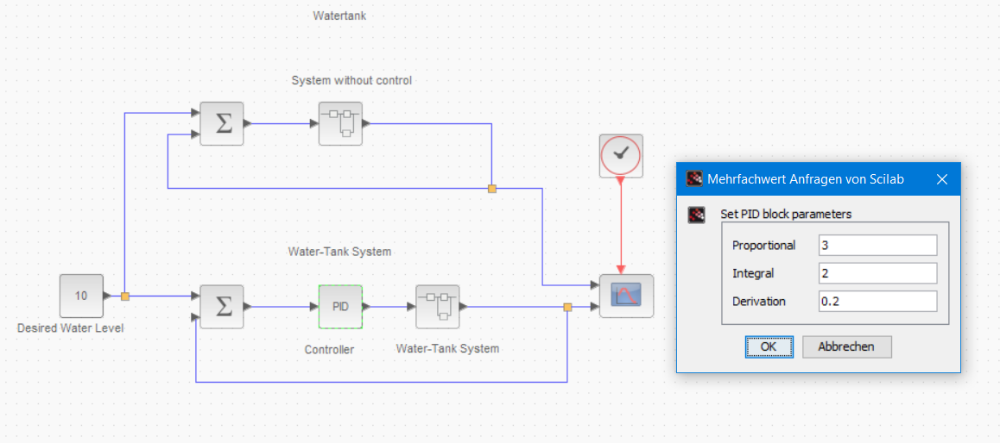


---

## 🧠 Integral-Regler


* Antwort $u(t)$ auf Sprung unmittelbar, jedoch nicht sofort mit voller Stärke
* Je länger ($t$) die Regelabweichung besteht und umso größer sie ist, desto stärker die Antwort
* $u(t)=\frac{1}{T_n}\int_0^te(\tau)d\tau$

[Quelle](Abbildung rechts ist Reaktion auf Sprungfunktion )

---


* $u(t)=\frac{1}{T_n}\int_0^te(\tau)d\tau$
* $u(t)=K_I \cdot \int_0^te(\tau)d\tau$
* $T_n$ ... Nachstellzeit bestimmt den Gradienten des Anstieges von $u$ 
* *summiert* die Regelabweichung über die Zeit auf
* **Regelabweichungen** werden auch bei Strecken mit Ausgleich vollständig **eliminiert**, dafür **langsamer**

---


---

## Proportional-Integral-Regler


* Sprungantwort: $u(t)=K_Pe(t) + K_I \cdot \int_0^te(\tau)d\tau$
* PI-Regler **Kombination** aus P- und I-Regler
* schnelle Reaktion (wie P-Regler)
* exakte Ausregelung ohne eine bleibende Regelabweichung (wie I-Regler) 

---

## 🧠 Proportional-Differenzial-Regler


* Sprungantwort: $u(t)=K_Pe(t)+K_d \frac{de(t)}{dt}=K_Pe(t)+T_v \frac{de(t)}{dt}$
* kombiniert P-Regler mit Differenzial-Anteil
* der D-Anteil bewertet die Änderung einer Regelabweichung (differenziert) und berechnet so deren **Änderungsgeschwindigkeit**
* reagiert schon auf *"Ankündigungen"* von Veränderungen 
* **sehr schnell**, doch bleibende **Regelabweichung**
* Unruhe im Regelkreis wird verstärkt, wenn Sensorsignal verrauscht 


---


---

## ✍️ Aufgabe 3_2_4: Reaktion D-Regler

✍️ Wie sieht die Reaktion aus?


---
marp: true
author: Julian Huber
size: 16:9
footer: Julian Huber - Bussysteme

# Strg+[ ] for Options

theme: beams

---

<!-- paginate: true -->


# 3.3 Regelverhalten

<!-- _class: title -->


---

## 🧠 PID-Regler


- **universellste** der klassischen Regler
-  Der PID-geregelte Kreis ist genau und sehr schnell, deshalb wird er bevorzugt in den **meisten Anwendungen** eingesetzt
* $u(t)=K_P \cdot e(t) + \frac{1}{T_N}\int_0^te(\tau)d\tau + T_v \frac{de(t)}{dt}$

---

### Umformung mit Vorhalt- und Nachstellzeit für PID-Regler:
- Neben der Darstellung mit Vorhalte- und  Nachhaltezeit findet sich auch häufig eine Darstellung mit Faktoren ($K$):
- $u(t)=K_P \cdot e(t) + \frac{1}{T_N}\int_0^te(\tau)d\tau + T_v \frac{de(t)}{dt}$

- $u(t)=K_P \cdot e(t) + K_I\int_0^te(\tau)d\tau + K_d \frac{de(t)}{dt}$

- $u(t)=K_P \cdot [e(t) + \frac{K_I}{K_P}\int_0^te(\tau)d\tau + \frac{K_D}{K_P} \frac{de(t)}{dt}]$


---

### Diskrete Implementierung als [Python-Klasse](https://colab.research.google.com/drive/1O8G7-Fn4ul-Wgq0B6-iOtqbzagVuC1Vz?usp=sharing)

```Python
class PIDRegler:
    def __init__(self, kp, ki, kd, dt):
        """
        Diskreter PID-Regler ohne Begrenzung
        :param kp: Proportionalbeiwert
        :param ki: Integralbeiwert
        :param kd: Differentialbeiwert
        :param dt: Abtastzeit
        """
        self.kp = kp
        self.ki = ki
        self.kd = kd
        self.dt = dt

        self.integral = 0
        self.last_error = 0

    def reset(self):
        """Setzt internen Zustand zurück."""
        self.integral = 0
        self.last_error = 0

    def update(self, setpoint, measurement):
        """
        Berechnet den PID-Reglerausgang
        :param setpoint: Sollwert
        :param measurement: Istwert
        :return: Steuersignal
        """
        error = setpoint - measurement

        # Integralanteil
        self.integral += error * self.dt

        # Differentialanteil
        derivative = (error - self.last_error) / self.dt

        # PID-Ausgabe
        output = self.kp * error + self.ki * self.integral + self.kd * derivative

        # Fehler für nächsten Schritt speichern
        self.last_error = error

        return output
```

---

## Systeme ohne zeitliche Verzögerung


* alle Systeme reagieren unmittelbar auf Veränderungen der Eingänge
* z.B. wird die Lichtstärke der Lampe ($u_r$) erhöht, erhöht sich die Helligkeit im Raum ($y$)


---

## Systeme mit zeitlicher Verzögerung


* z.B. mit Erhöhung des Durchfluss durch die Heizung ($u_r$) erwärmt sich der Raum nur langsam ($y$). Das Thermometer gibt die gemessene Temperatur ($y_m$) nur mit Verzögerung weiter

---

### Bestimmung des dynamischen Verhaltens


* Ziel der Regelungstechnik ist es ein erwünschtes Verhalten 
der Regelgröße $y$ zu erhalten
* Mathematische Beschreibung und Analyse
* Simulationsprogramme: z.B. [Matlab Simulink](https://de.mathworks.com/solutions/control-systems.html) oder [Scilab Xcos](https://www.scilab.org/scilab/features)

[Quelle](https://www.samsongroup.com/document/l102de.pdf)


---


### Fazit

* Zeitverhalten von Regelkreisen wird durch alle Komponenten (Zeitverhalten) und die Einstellung des Reglers (gewählte Parameter) beeinflusst
* komplexere Regelkreise müssen als Gesamtheit betrachtet werden
  * Beobachtung am echten System
  * Modellierung durch Vereinfachung (Regelungstechnik)
  * Kalibrierung am realen System

---

## 🌡️ Aufgabe 1: Reaktion von PID und PT1 auf Einheitssprung

Ziehen Sie die Elemente `Step` und `PID`, `Trasfer Fcn` und `Scope` in den Arbeitsbereich und verbinden Sie diese sinnvoll.

- `Step`: Einheitssprung mit Amplitude 1 und Zeit 1
- `PID`: PID-Regler mit `P=1`, `I=0`, `D=0`
- `Transfer Fcn`: PT1-Glied mit Nummerator `[1]` und Denominator `[5, 1]`
- `Scope` mit zwei Eingängen

Passen die Parameter an und beobachten Sie die Reaktion des Systems.

---

### 🤓 Die Transferfunktion des PT1-Gliedes ist:

  $$
  G(s) = \frac{1}{5s + 1}.
  $$

Eine Transferfunktion ist eine mathematische Beschreibung eines Systems im Frequenzbereich. Für uns ist jetzt die Form wichtig, die wir in Simulink verwenden können. Die Übertragungsfunktion eines PT1-Gliedes ist:
$$
G(s) = \frac{1}{\tau s + 1} = \frac{\text{Ausgangsgröße im Frequenzbereich}}{\text{Eingangsgröße im Frequenzbereich}}
$$

wobei wir $\tau$ als Zeitkonstante bezeichnen. Diese Zeitkonstante beschreibt, wie schnell das System auf eine Änderung reagiert. In unserem Fall ist $\tau = 5$ Sekunden. Zu diesem Zeitpunkt hat das System 63% der Endantwort erreicht. Nach 5 Zeitkonstanten ($t=5\tau$) hat das System 99% der Endantwort erreicht.


---

## 🌡️ Aufgabe 2: Heizkurve einer Heizung (ohne Regelung)


---

### Situation

In einem ausgekühlten Gebäude wird die Raumtemperatur durch eine einfache **Heizkurve** gesteuert. Es gibt **keine Rückkopplung**, sondern nur eine fest definierte Beziehung zwischen der **Außentemperatur** und der **Vorlauftemperatur** der Heizung. Wir nehmen an dies passiert im Stellglied verzögert mittels PT1-Glied ($\tau=60 \text{ min}$). Die Vorlauftemperatur beeinflusst wiederum die **Raumtemperatur** in der Steuerstrecke, ebenfalls mit trägem Verhalten verzögert mittels PT1-Glied ($\tau=120 \text{ min}$ und eine proportionale Verstärkung von $0.35$).

---

### Die Zusammenhänge sind wie folgt:

Die [Heizkurve](https://de.wikipedia.org/wiki/Heizkurve) berechnet die Vorlauftemperatur $T_{\text{VL}}$ aus der Außentemperatur $T_{\text{außen}}$:

$$
T_{\text{VL}} = a \cdot (T_{\text{außen}}) + b
$$

mit:

- $a = -1{,}5$ (Steigung der Heizkurve)  
- $b = 60$ (Basisaufschlag)

Die **Raumtemperatur** $T_{\text{Raum}}$ reagiert auf die Vorlauftemperatur mit einem **PT1-Verhalten**: Für die Simulation im Matlab verwenden wir die Übertragungsfunktion:

$$
G(s) = \frac{1}{\tau s + 1}, \quad \tau = 120\ \text{min}
$$

---

### 🧩 Aufgabe 2a: Blockschaltbild zeichnen

Zeichnen Sie ein Blockschaltbild der Steuerkette mit folgenden Blöcken:

- Außentemperatur (Eingangsgröße)  
- Heizkurve (Stellglied)  
- Vorlauftemperatur (Stellgröße)  
- Raum (Steuerstrecke)  
- Raumtemperatur (zu steuernde Größe)  

> **Hinweis:** Es handelt sich um eine *Steuerung*, d. h. **keine Rückführung** der Raumtemperatur!

---

### 🛠️ Aufgabe 2b: Umsetzung in Simulink

Erstellen Sie in MATLAB Simulink ein Modell der oben beschriebenen Steuerstrecke:

- Außentemperatur als **Step-Block** mit einem Sprunghaften Abfall nach 1000 Minuten von 10 auf -5°C.  
- Heizkurve als **einfache Rechenvorschrift** (Gain- und Summierblöcke).  
- Die Stellglied und Raumdynamik als **Transfer Fcn** mit:  
  $$
  G(s) = \frac{1}{\tau s + 1}
  $$
- Der Raum mit einem zusätzlichen Gain-Glied von $0.35$ (Verstärkung).


---

### 🔍 Beobachtung

- Visualisieren Sie die Raumtemperatur, Vorlauftemperatur und Außentemperatur im **Scope**.
- Wie entwickelt sich die Raumtemperatur über der Zeit?  
- Was passiert, wenn die Außentemperatur plötzlich sinkt?  
- Wie gut funktioniert die Steuerung?


---

## 🔁 Aufgabe 3: Temperaturregelung eines Raumes mit P-Regler

### Situation

Der Raum soll nun auf eine gewünschte Temperatur geregelt werden. Die **Regelgröße** ist die **Raumtemperatur** $T(t)$, die durch das Heizsystem geregelt wird.
Das gesamte Heizsystem wird nun als $PID$-Regler abgebildet. An dessen Eingang wird der Unterschied zwischen **Soll- und Ist-Temperatur** erfasst. Die Raum verhält sich, wie bisher (PT1 + Gain). Wir können die Raumtemperatur exakt und unmittelbar messen. 


---

## 🧩 Aufgabe 2a: Blockschaltbild

Zeichnen Sie ein **Blockschaltbild** des Regelkreises. Die folgenden Elemente sollen enthalten sein:

- Soll-Temperatur (Führungsgröße)
- Temperatur-Differenz (Regelabweichung $e(t)$)
- Heizsystem (Regler)  
- Regelstrecke (Raum als PT1-Glied)
- Ist-Temperatur (Regelgröße)


---

## 🛠️ Aufgabe 2b: Umsetzung in Simulink

Erstellen Sie in **MATLAB Simulink** ein Modell des beschriebenen Regelkreises:

- Verwenden Sie einen **Step-Block** für die Solltemperatur (z. B. Sprung  von $15$ auf $20^\circ \text{C}$ bei $t = 300$ min).  
- Implementieren Sie den **PID-Regler** zunächt mit einem $K_p = 3$ und ohne I und D-Anteil.  
- Simulationsdauer: **1000 Sekunden**  
- Beobachten Sie die Entwicklung der Führungsgröße, Regelabweichung und Ist-Temperatur im **Scope**.

---

## 🔍 Beobachtungen

- Wird die Soll-Temperatur erreicht?
- Wie verändert sich die Regelung, wenn Sie $K_p$ erhöhen oder verkleinern?
- Passen Sie auch die Größen $T_n$ ($1/$ `I`) und $T_v$ (`D`) an.
- Was müsste man ändern, um die Regelabweichung vollständig zu eliminieren?
- Testen Sie die `Tune`-Funktion von Simulink. Was passiert?


---

## Regelverlauf der verschiedenen Reglertypen im Zeitverlauf


* Reaktion auf Sprungfunktion im einfachen Regelkreis
* Deutlich wird die bleibende Regelabweichung des P-Reglers
* Das schnelle Verhalten der Regler mit D-Anteil


[Quelle](https://rn-wissen.de/wiki/index.php/Regelungstechnik)


---

## Kriterien zur Beurteilung eines Regelkreises


* Führungsverhalten bei Anregung mit Sprungfunktion:
* **Ausregelzeit** $t_\epsilon$: gibt den Zeitpunkt an, ab dem die Regelabweichung kleiner als eine vorgegebene Schranke $±\epsilon$ ist.
* Maximale **Überschwingweite** $e_{max}$: gibt den Betrag der maximalen Regelabweichung an, die nach dem erstmaligen Erreichen des Sollwertes  auftritt


[Quelle](https://srv.ifr.ing.tu-bs.de/static/files/lehre/vorlesungen/gdr/Skript_GdR.pdf)


---

### Regelfläche

- **Regelfläche**: Die Fläche zwischen Führungsgröße und Ist-Wert kann als Maß definiert werden. 
* Besonders sinnvoll ist die Beurteilung mittels der Regelfläche allerdings nur, wenn kein Überschwingen auftritt
* Alternativ z.B. Absolutwert des Integrals der Regelfläche


[Quelle](https://srv.ifr.ing.tu-bs.de/static/files/lehre/vorlesungen/gdr/Skript_GdR.pdf)

---

### Praktische Überlegungen

- Um eine gewünschtes Regelverhalten zu erreichen, muss ein geeigneter Regler mit den passenden Faktoren (z.B. Verstärkungsfaktor $K_P$) ausgewählt werden. 
- Hier lässt sich entweder ein **Modell der Regelstrecke** bilden. In der Praxis werden Regelkreise häufig durch **Ausprobieren** von Regler-Einstellungen eines PID-Regler kalibriert.

---


### 🤓 Praktische Überlegungen PID-Regler


[Quelle](https://de.wikipedia.org/wiki/Faustformelverfahren_(Automatisierungstechnik))

---


## ✍️ Aufgabe 3_3_1: Auswahl Reglerverhalten

- Welchen Reglerverlauf wünschen Sie sich für folgende Anwendungen
  - **Startoptimierung** der Raumtemperatur 
(unter Energieffizienzgesichtspunkten)
  - **Konstantlichtregelung** 
(Beleuchtung aus Komfortgesichtspunkten)
  - **Bewegungssteuerung** eines Laufroboters


[Quelle](https://de.wikipedia.org/wiki/Faustformelverfahren_(Automatisierungstechnik))

---

### Lösung

- Welchen Reglerverlauf wünschen Sie sich für folgende Anwendungen
- **Startoptimierung** der Raumtemperatur 
(unter Energieffizinzgesichtspunkten)
  * Langsam kein Überschwingen
- **Konstantlichtregelung** 
(Beleuchtung aus Komfortgesichtspunkten)
  * Langsam kein Überschwingen
- **Bewegungssteuerung** eines Laufroboters
  * Schnell, minimales Überschwingen


[Quelle](https://de.wikipedia.org/wiki/Faustformelverfahren_(Automatisierungstechnik))


---

## Beispiele

### Hardware PID-Regler


[Quelle](https://www.reichelt.at/at/de/pid-regler-quantrol-lc100-5--55-c-quan-lc100-d-24-p147710.html?PROVID=2807)


---

### Software Baustein PID-Regler


* Eingänge
  * `rW`: Sollwert
  * `rX`: Istwert
* Eingangsparameter
  * `rKp`: Proportionalfaktor Verstärkung
  * `tTi`: Integrierzeit [s]
  * `tTv`: Vorhaltezeit [s]
* Ausgänge
  * `rY`: Stellgröße
  * `rXW`: Regelabweichung


[Quelle](https://infosys.beckhoff.com/index.php?content=../content/1031/tf8000_tc3_hvac/4685059723.html&id=)

---

## Methode von Ziegler und Nichols

- **heuristisches** Verfahren zur Bestimmung von Reglerparametern
- nur für existierenden **stabile Anlagen** geeignet
- oder bei denen instabiles Verhalten keine Schäden verursachen kann

---

  

* Eigenschaft Regelstrecke und P-Regler
* dynamischen Eigenschaften hängen stark vom Verstärkungsfaktor ($K_P$ - im Bild $K_R$) des Gesamtsystems ab.
* Ab bestimmtem $K_P^{krit}$ beginnt die Regelgröße zu schwingen (Stabilitätsgrenze)


[Quelle](http://www.chemgapedia.de/vsengine/vlu/vsc/de/ch/7/tc/regelung/grundlagen/regelung_grundlagen.vlu/Page/vsc/de/ch/7/tc/regelung/grundlagen/regparam/regparam.vscml.html)

---

### Umformung mit Vorhalt- und Nachstellzeit für PID-Regler:
- Neben der Darstellung mit Vorhalte- und  Nachhaltezeit findet sich auch häufig eine Darstellung mit Faktoren ($K$):
- $u(t)=K_P \cdot e(t) + \frac{1}{T_N}\int_0^te(\tau)d\tau + T_v \frac{de(t)}{dt}$

- $u(t)=K_P \cdot e(t) + K_I\int_0^te(\tau)d\tau + K_d \frac{de(t)}{dt}$

- $u(t)=K_P \cdot [e(t) + \frac{K_I}{K_P}\int_0^te(\tau)d\tau + \frac{K_D}{K_P} \frac{de(t)}{dt}]$


---


### Vorgehen Methode von Ziegler und Nichols (I)

- **Voreinstellung** des Reglers als reiner P-Regler: 
  - $K_I=0$, $K_D=0$ 
  - bzw. $T_v=0$, $T_n=∞$

- $u(t)=K_P \cdot e(t) + K_I\int_0^te(\tau)d\tau + K_D \frac{de(t)}{dt}$
- $u(t)=K_P \cdot [e(t) + \frac{1}{T_N}\int_0^te(\tau)d\tau + T_v \frac{de(t)}{dt}]$


---

### Methode von Ziegler und Nichols (II)


* **Erhöhung von $K_P$** (beginnend mit kleinen Werten von $K_P$ ) bis zur **Stabilitätsgrenze** (die Regelgröße $x$ beginnt gleichmaßig mit konstanter Amplitude zu schwingen)
* **Ablesen von $K_P^{krit}$**
Messung der beobachtbaren Periodendauer $T^{krit}$
* **Berechnung der Reglerparameter** ($K_P$, $T_n$, $T_v$) entsprechend den folgenden Regeln:


[Quelle](Ziegler, John G., and Nathaniel B. Nichols. "Optimum settings for automatic controllers." trans. ASME 64.11 (1942))

---

### Einstellregeln nach Ziegler und Nichols (III)

 | | $K_P$         | $T_n$                | $T_v$              |                
|------------|-------------------|-----------------|-----------------|
| P-Regler   | $K_P = K_P^{krit} \cdot 0,5$  |              |             |
| PI-Regler  | $K_P$=$K_P^{krit} \cdot 0,45$ | $T_n=0,85 \cdot T^{krit}$ |              |
| PID-Regler | $K_P$=$K_P^{krit} \cdot 0,6$  | $T_n=0,5 \cdot T^{krit}$  | $T_v=0,12 \cdot T^{krit}$ |


---

## ✍️ Aufgabe 3_3_2:


- Finden Sie gtue Werte für den Regler für die folgenden Anwendungen nach der Methode von Ziegler und Nichols: [Colab](https://colab.research.google.com/drive/1NHJB1KzMxQen6Ehki6Cs0nEQDZiuFb8t?usp=sharing)

---

## 🤓 ✍️ Aufgabe 3_3_2:

- Finden Sie gtue Werte für den Regler für das folgende [System](https://github.com/jhumci/scilab_xcos_solutions/blob/main/Bussysteme/3_3_3/PT1-Glied.zcos) nach der Methode von Ziegler und Nichols

---

### ✔️ Lösung

<!-- _color: black -->

??? optional-class "💡 anzeigen"
    [Link](https://github.com/jhumci/scilab_xcos_solutions/blob/main/Bussysteme/3_3_3/PT1-Glied_Loesung.zcos)---
marp: true
author: Julian Huber
size: 16:9
footer: Julian Huber - Bussysteme

# Strg+[ ] for Options

theme: beams

---

<!-- paginate: true -->


# 4.1 Speicherprogrammierbare Steuerung (SPS)

<!-- _class: title -->


---

## Schalter vs. Taster

<!-- _class: white -->

* Ein Schalter behält seine Stellung nach dem Betätigen bei.
   
* Ein Taster springt in die Ausgangslage  
  

---

### Wahrheitstabelle

- Annahme: Schalter mit zwei Zuständen

  | S1 | S2 | H1 |
  |---|---|---|
  | 0 | 0 | 1 |
  | 0 | 1 | 0 |
  | 1 | 0 | 0 |
  | 1 | 1 | 1 |

- $H1 = \lnot (S1 \oplus S2)$


---

### Zustandsdiagramm einer Wechselschaltung


<!-- _class: white -->



---

```
stateDiagram-v2
    s1: Licht aus - Schalter 1 = off, Schalter = 2 off
    s2: Licht an - Schalter 1 = on, Schalter 2 = off
    s3: Licht an - Schalter 1 = off, Schalter 2 = on
    s4: Licht aus - Schalter 1 = on, Schalter 2 = on


    s1--> s2: Schalter 1 = on
    s2--> s1: Schalter 1 = off

    s1--> s3: Schalter 2 = on
    s3--> s1: Schalter 2 = off

    s4--> s3: Schalter 1 = off 
    s3--> s4: Schalter 1 = on 

    s2 --> s4: Schalter 2 = on
    s4 --> s2: Schalter 2 = off
```

[Quelle](https://mermaid.live/)


---

### Lösung "Industrie 2.0"


* S1, S2: Schalter mit zwei Zuständen
* H1: Glühlampe

---

#### Wechselschaltung im Gebäude


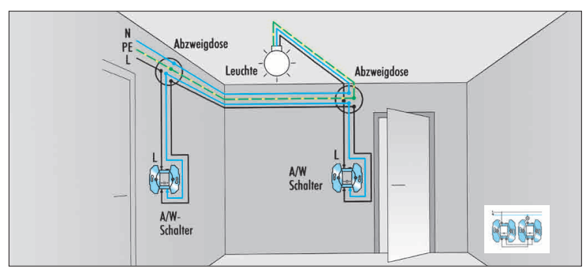


[Quelle](https://cdn-reichelt.de/documents/datenblatt/TIPP/Elektroinstallation(Kopp).pdf)

---


#### Direkte verbindungsprogrammierte Steuerung

* Steuerung auf Basis des Stomkreises (z.B. Wechselschaltung bei Lichtschalter)
* Überall liegt die hohe (ggf. **gefährliche**) **Spannung** an
* **Verdrahtungsaufwand** (z.B. Kreuzschaltung für mehr als 2 Schalter)
* die **Fehlersuche** sehr mühselig
* Bestimmte sicherheitsrelevante Funktionen (z. B. Not-Aus)

---


### Lösung "Industrie 2.1"

* Entkopplung von Steuerstrom und Laststromkreis durch Relais oder Schütz
* Steuerstromkreis hat i.d.R. niedrigere Spannung


---

### Verbindungsprogrammierte Steuerung mit logischen Komponenten


* In diesem Fall wird ein Stromstoßschalter verbaut: Bei jeder Betätigung eines der Taster (S) wird der Zustand von K1 gewechselt
* Zwei oder mehrere Schalter S können parallel geschaltet werden
* Verringertet Verdrahtungsaufwand, erhöhte Wartbarkeit

---

- `A1`-`A2`: Schließen des Steuerkreises löst eine Sprungfunktion in der Spannung und Strom aus (Flanke)
*  `1`-`2` wird geschlossen

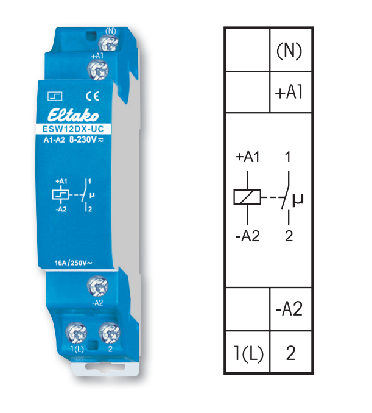

[Quelle 1](https://de.wikipedia.org/wiki/Liste_der_Schaltzeichen_(Elektrik/Elektronik))[,2]( https://www.eltako.com/fileadmin/downloads/de/Gesamtkatalog/Eltako_Gesamtkatalog_Kap11_low_res.pdf)

---

- `A1`-`A2`: Schließen des Steuerkreises löst eine Sprungfunktion in der Spannung und Strom aus (Flanke)
*- `1`-`2` wird geschlossen

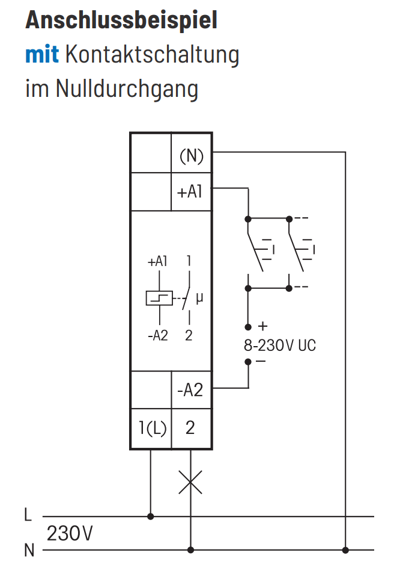

[Quelle 1](https://de.wikipedia.org/wiki/Liste_der_Schaltzeichen_(Elektrik/Elektronik))[,2]( https://www.eltako.com/fileadmin/downloads/de/Gesamtkatalog/Eltako_Gesamtkatalog_Kap11_low_res.pdf)


---

#### Stromstoßschalter


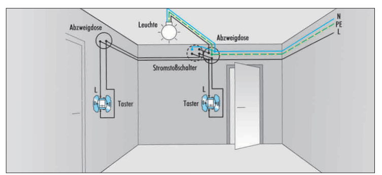


[Quelle](https://cdn-reichelt.de/documents/datenblatt/TIPP/Elektroinstallation(Kopp).pdf)


---

### Lösung Industrie 3.0


* Logikbausteine werden durch Computer mit Ein- (`bIn1`) und Ausgängen (`bOut1`) ersetzt
* Computer erfasst, ob an Eingängen eine Spannung anliegt
* Computer setzt Spannung auf Ausgänge
```Python
def taster(s1,s2,status_lampe):
  if (s1 or s1):
    return not(status_lampe)
  else:
    return status_lampe
    
bOut1 = stromstossschalter(s1,s2,status_lampe)
```

---

#### Aufbau SPS - Loxone Mini Server


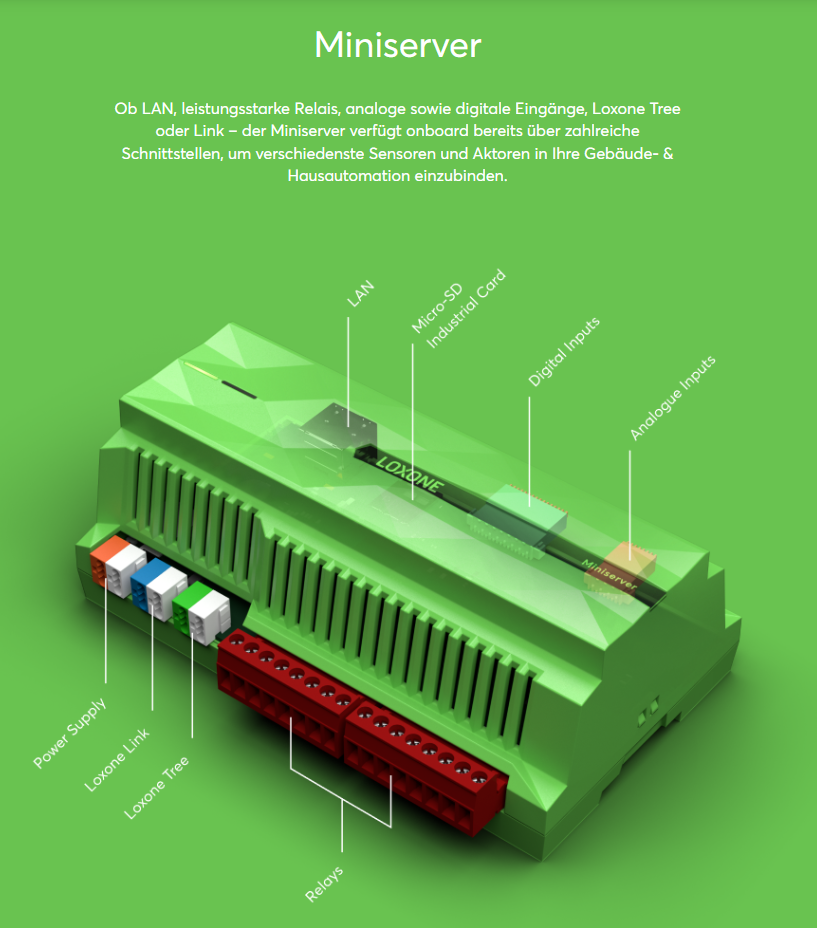


[Quelle](https://www.loxone.com/dede/produkte/gebaeude-und-hausautomation-miniserver/)

---

#### Aufbau SPS - Siemens Logo


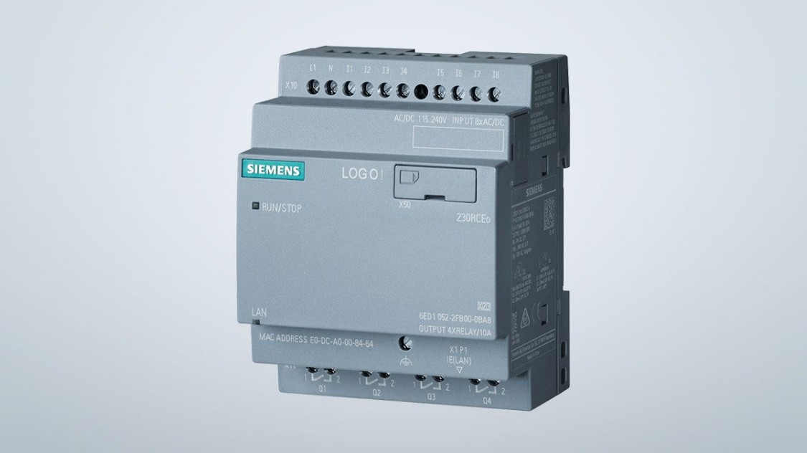


---

## Aufbau SPS - am Beispiel Beckhoff 


---

### Aufbau einer SPS


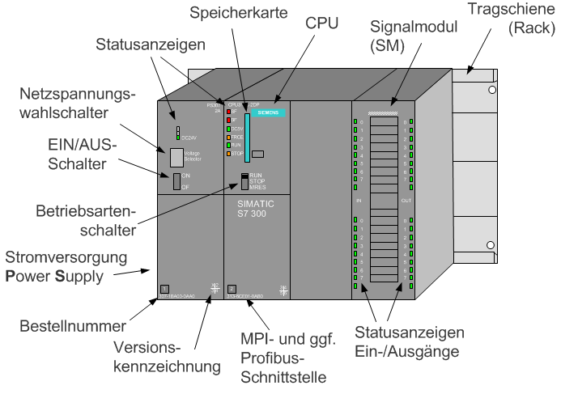


[Quelle](https://www.xplore-dna.net/mod/page/view.php?id=294)

- Anbringung meist an Hutschiene (**modular**)
- Rechen- und Speichereinheit oft Anbindung an Bus-System 
- Ein oder mehrere Signalmodule
  - Empfang Sensordaten (**Eingänge**)
  - Versand Steuerbefehle (**Ausgänge**)

---

### Aufbau SPS


- Eingang / Ausgang: Schaltende Verbindungen zwischen 0 und 24V 
- Stromversorgung
  - Powerkontakt 24V (L+): SPS arbeitet wegen Bauraum und Sicherheit mit 24V Gleichstrom
  - Powerkontakt 0V (L-): Masse als 0 Potential für die Schaltung definiert
  - Powerkontakt PE: Schutzleiter mit Potential-Erde, 0V sollte auf PE gelegt werden
- Ausgänge `+` und `-` zur weiterverteilung


---

#### Industrie 3.0 Zentrale SPS -Speicherprogrammierbare Steuerung


* die  Steuerungsfunktionen sind als **Programme** in einem Speicher enthalten
    * **Flexibilität**: Einfacher Austausch von Programmen
    * Mehrere Funktionen **auf einem Gerät**
    * Geringer **Platzbedarf**, Höhere Zuverlässigkeit, Geringere Kosten
    * **Vernetzung** mit anderen Systemen, Fernwartung
    * **Fehlerdiagnose**


[Quelle](https://www.xplore-dna.net/mod/page/view.php?id=294)

<!--

---

### Abgrenzung von SPS und Bussystemen

* ⚠️ Die folgende Darstellung vereinfacht und stilisiert 
* in der Praxis sind Mischformen üblich

---

#### SPS als zentrales System


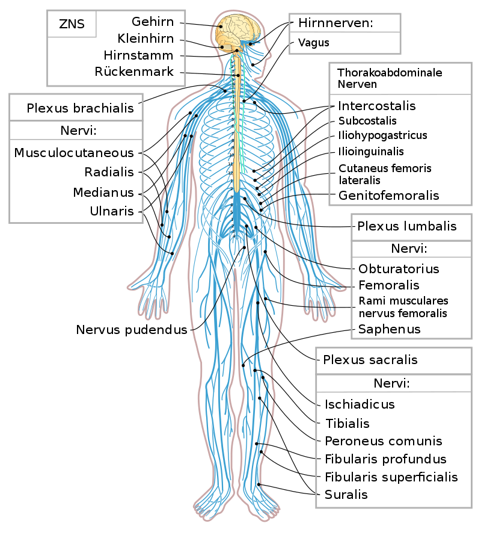

* SPS als Single Point of Failure
* häufig sternförmige Verkabelung
* Ein- und Ausgänge der SPS sind digital (nur zwei Zustände) oder analog

[Quelle](https://de.wikipedia.org/wiki/Nervensystem#)

---

### Dezentrales System

* Viele Mikrocontroller übernehmen die Steuerungsaufgaben
* kein Single Point of Failure
* andere Topologien als Sternform möglich
* Übermittlung von Seriellen Telegrammen auf der Busleitung


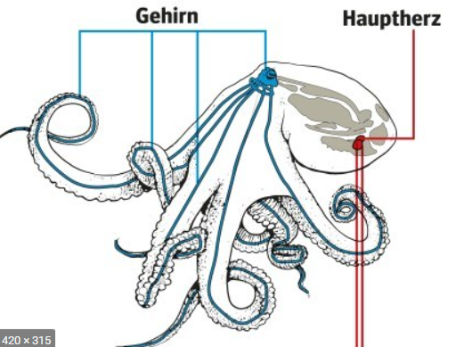

[Quelle](https://quizizz.com/admin/quiz/605a064f172bf7001b1ea35d/tintenfische)

---

#### Steuerung mit Bus-System


* Zentrale SPS wird durch mehrere **dezentrale Contoller** ersetzt
* Diese kommunizieren über Telegramme in einem standardtisierten Protokoll miteinander 
* Anstelle von binären Schaltinformationen werden Bitfolgen übertragen
* Mischformen sind möglich!

---

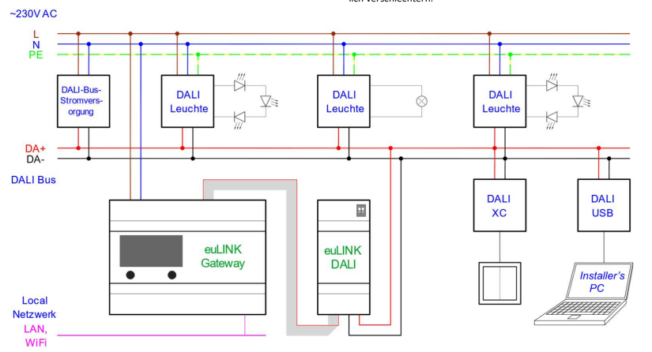


---

-->

---

## Speicherprogrammierbare Steuerung (SPS)


### Messkette: Elektronische Sicht der Steuerung

* **Sensoren** wandeln den Zustand eines Prozesses in ein elektrisches Signal um
* Die Steuerung und Regelung erfolgt elektronisch oder digital oder in einem rechnergestützten Gerät (**Steuerungseinheit**)
* Aktoren werden zur Beeinflussung von Systemen eingesetzt

<!-- _class: white -->


[Quelle](https://mermaid.live/edit#pako:eNp1UMtqw0AM_BWj0wZsQpo-wIeAwZdCQqGGFtrtQXhle4m9a2QtpYT8Tf-kP9ZNg6GlRCdpNBpJc4DaG4Icmt6_1x2yJNtH7ZIY1qxeK3KT57ckyzaxvlJPxJN8ffKeeBExa9aqWJbZMzrTz9C1qoQCcXDtRNZ1ZOXcuFHlsvjLvf2veKeKvXhezEesV6q0rRWMQ8m9G4NcXjPPXD7ht9hDkJMapDAQD2hNtOFwktAgHQ2kIY-poQZDLxq0O0YqBvHVh6shFw6UQhgNCpUWW8YB8gb7KaJkbPxhd7b2x-EURnQv3s-c4zdLjX9a)

---

#### Steuerungseinheit: Aufbau einer SPS


[Quelle](https://www.xplore-dna.net/mod/page/view.php?id=294)

- Anbringung meist an Hutschiene (**modular**)
- Rechen- und Speichereinheit oft Anbindung an Bus-System 
- Ein oder mehrere Signalmodule
  - Empfang Sensordaten (**Eingänge**)
  - Versand Steuerbefehle (**Ausgänge**)

---

#### Aufbau SPS


---

#### Digitale Ein- und Ausgänge

* kennt nur zwei Zustände (`True`/`False`)
* Abgebildet über Spannungslevel oder Stromstärke

<!-- _class: white -->


[Quelle](https://mermaid.live/edit#pako:eNp1UMtqw0AM_BWj0wZsQpo-wIeAwZdCQqGGFtrtQXhle4m9a2QtpYT8Tf-kP9ZNg6GlRCdpNBpJc4DaG4Icmt6_1x2yJNtH7ZIY1qxeK3KT57ckyzaxvlJPxJN8ffKeeBExa9aqWJbZMzrTz9C1qoQCcXDtRNZ1ZOXcuFHlsvjLvf2veKeKvXhezEesV6q0rRWMQ8m9G4NcXjPPXD7ht9hDkJMapDAQD2hNtOFwktAgHQ2kIY-poQZDLxq0O0YqBvHVh6shFw6UQhgNCpUWW8YB8gb7KaJkbPxhd7b2x-EURnQv3s-c4zdLjX9a)

---

### Adressierung 


[Quelle](https://www.xplore-dna.net/mod/page/view.php?id=294)

* Digitale Ein- und Ausgänge schalten und erfassen Spannungen bis 24V (i.d.R.)
* Jeder digitale Ein- und Ausgang wird durch ein Bit repräsentiert (`True`: 24V, `False`: 0V)
* **Eingänge** werden mit **E** bzw. **I** (Input) bezeichnet (```E0.1```)
* **Ausgänge** mit **A** bzw. **O/Q** (Output) ```A0.2```

---


#### Symbolische Adressierung

- Zur besseren Verständlichkeit sollten bei der Programmierung sinnvolle Variablennamen eingeführt werden, da diese leichter zu interpretieren sind als z.B.```Q0.1```.


- z.B. für ein Automatiklicht
  - **```bInAnwesenheit```** Für Wert des digitalen Sensors für Anwesenheit an ```E0.0```
  - **```bInDunkelheit```** Für Wert des digitalen Sensors für Dunkelheit an ```E0.1```
  - **```bOutLicht```** Für digitalen Schalter für Licht an ```A0.1```
  * Das **```b```** steht für einen **binären** (digitalen) Ein- oder Ausgang
  * Das **```In```** / **```Out```** für Ein- oder Ausgänge

---


## Digitale Ein- und Ausgänge

<!-- _class: white -->


[Quelle](https://mermaid.live/edit#pako:eNp1UMtqw0AM_BWj0wZsQpo-wIeAwZdCQqGGFtrtQXhle4m9a2QtpYT8Tf-kP9ZNg6GlRCdpNBpJc4DaG4Icmt6_1x2yJNtH7ZIY1qxeK3KT57ckyzaxvlJPxJN8ffKeeBExa9aqWJbZMzrTz9C1qoQCcXDtRNZ1ZOXcuFHlsvjLvf2veKeKvXhezEesV6q0rRWMQ8m9G4NcXjPPXD7ht9hDkJMapDAQD2hNtOFwktAgHQ2kIY-poQZDLxq0O0YqBvHVh6shFw6UQhgNCpUWW8YB8gb7KaJkbPxhd7b2x-EURnQv3s-c4zdLjX9a)

---

### Digitaler Eingang

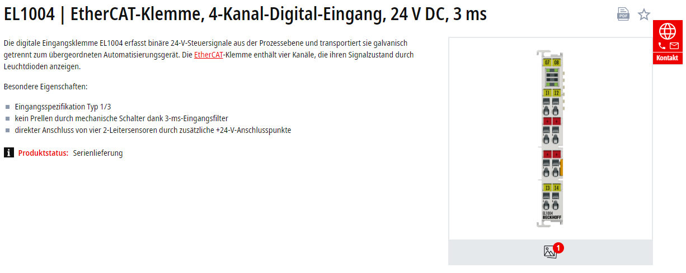

- Kennt nur Signal oder kein Signal (**Boolean**)
  - z.B. **Taster**
  - z.B. **Fensterkontakt**


---

## EVA-Prinzip
<!-- _class: white -->


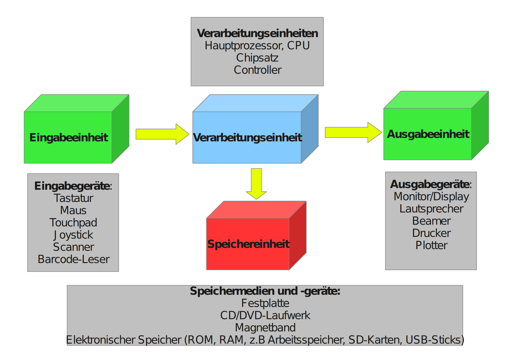


[Quelle](https://upload.wikimedia.org/wikipedia/commons/f/f2/EVA-Prinzip.svg)

---

### Zyklische Verarbeitung

<!-- class: white -->


* Das EVA-Prinzip wird in regelmäßigen Zyklen durchlaufen
  * Einlesen der Eingänge
  * Durchführen der Verarbeitung
  * Ausgabe der Ausgänge
* Typische Zykluszeiten liegen zwischen einer und zehn Millisekunden

---

### Verarbeitungseinheit - CPU


[Quelle](Beckhoff Automation)

---

## Analoge Ein- und Ausgänge


[Quelle](https://mermaid.live/edit#pako:eNp1UMtqw0AM_BWj0wZsQpo-wIeAwZdCQqGGFtrtQXhle4m9a2QtpYT8Tf-kP9ZNg6GlRCdpNBpJc4DaG4Icmt6_1x2yJNtH7ZIY1qxeK3KT57ckyzaxvlJPxJN8ffKeeBExa9aqWJbZMzrTz9C1qoQCcXDtRNZ1ZOXcuFHlsvjLvf2veKeKvXhezEesV6q0rRWMQ8m9G4NcXjPPXD7ht9hDkJMapDAQD2hNtOFwktAgHQ2kIY-poQZDLxq0O0YqBvHVh6shFw6UQhgNCpUWW8YB8gb7KaJkbPxhd7b2x-EURnQv3s-c4zdLjX9a)

---

### Analog-Digital Wandler

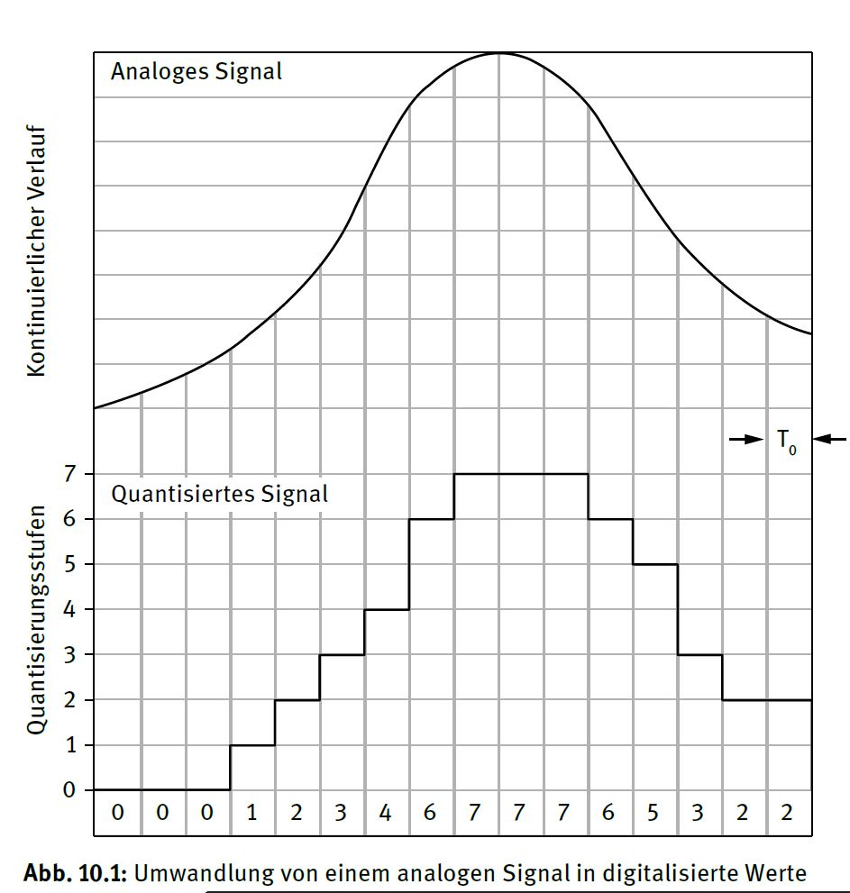


* **Vorsicht**: Auch analoge Signale werden beim Eingang in die Verarbeitungseinheit digitalisiert
* Die Auflösung analoger Ein- und Ausgänge wird in Bit angegeben


---

### Analoger Eingang

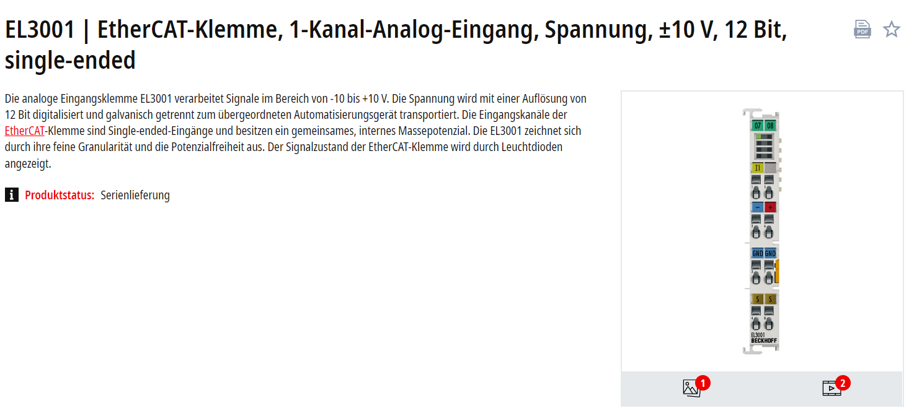

* bei vielen Anwendungsfällen sind stetige Werte von Interesse:
* z.B. Temperatur, Helligkeit, etc.

---

#### Passive Analoge Signale


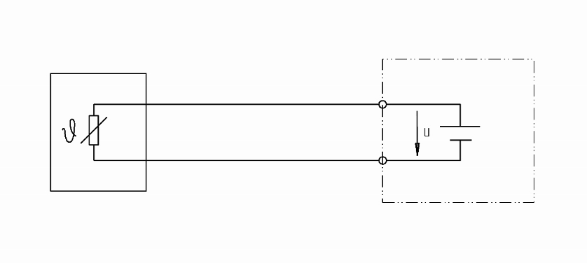


* Nutzen Temperaturabhängigkeit eines Widerstands
* und Ohmsches Gesetz: $U=RI$
* Bei gleicher angelegter Spannung, wird temperaturabhängig ein anderer Strom gemessen


[Quelle](https://blog.wika.de/know-how/pt100-in-2-3-oder-4-leiter-schaltung/)

---

##### z.B. PT-Widerstände

* Platin hat ein relativ lineares Verhalten

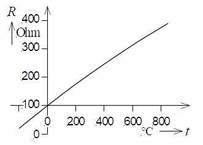

* $U = 24 \text{V}$
* $I_m=0.16 \text{A}$
* $R=\frac{U}{I_m}=150 \Omega$
* $T \approx 100 \text{°C}$
* Sollten wir den PT-Widerstand direkt mit $24 \text{V}$ beaufschlagen?

Kennlinie eines Pt100 (100 $\Omega$ bei 0 °C)

---

### Einsatzgebiete von Verstärkern


[Quelle](https://mermaid.live/edit#pako:eNp1UMtqw0AM_BWj0wZsQpo-wIeAwZdCQqGGFtrtQXhle4m9a2QtpYT8Tf-kP9ZNg6GlRCdpNBpJc4DaG4Icmt6_1x2yJNtH7ZIY1qxeK3KT57ckyzaxvlJPxJN8ffKeeBExa9aqWJbZMzrTz9C1qoQCcXDtRNZ1ZOXcuFHlsvjLvf2veKeKvXhezEesV6q0rRWMQ8m9G4NcXjPPXD7ht9hDkJMapDAQD2hNtOFwktAgHQ2kIY-poQZDLxq0O0YqBvHVh6shFw6UQhgNCpUWW8YB8gb7KaJkbPxhd7b2x-EURnQv3s-c4zdLjX9a)

* Linearisierung des Signals
* Anpassung des Signals auf definierten Ausgangsbereich 
(z.B. 0 .. 20mA, 0 .. 10V)
* Extra Kosten
* Sensorspezifisch 

---

### Aktive Sensoren

* Integriert Sensor und Verstärker
* Sensor wird mit Spannung versorgt (i.d.R. 24V/DC)
* Sensor übersetzt physikalische Größe in ein Ausgangssignal $E$
* Skalierung häufig linear oder sogar proportional
  * $U(E_v)=E_0 + K_p \cdot E_v$
  * $U(E_v)=\frac{10 V}{100.000 Lux} \cdot E_v$


---

#### Anschluss aktiver Sensoren

* Spannungsversorgung über `GND`und `24 V`
* Ausgang `LUX` wird mit analogem Eingang der SPS verbunden
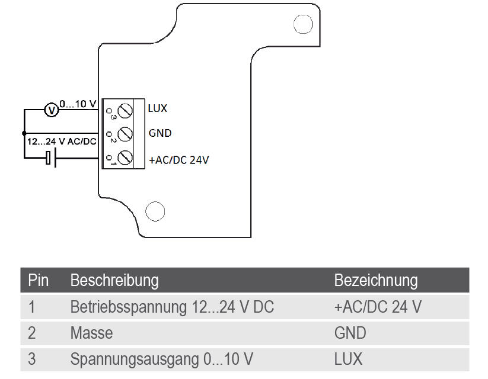


---

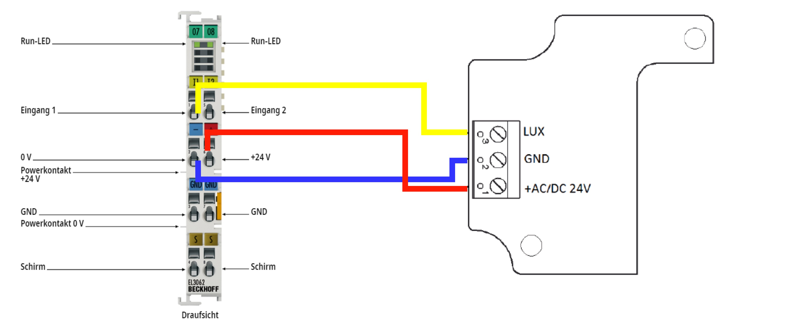


---

### Auswahl Analoger Eingänge

* Spannungssignal: z.B. $0...10$ bzw. $-10...10$ V
  * günstig
  * leicht zu messen (z.B. mit Multimeter)
* Stromschnittstelle: z.B. 4...20 mA
  * auch bei langen Leitungen
  * unanfälliger gegen Störungen
  * Erkennen von Drahtbruch (0 A)
* PT-Eingänge: 
  Spezielle Eingänge zum Anschluss von PT-Widerständen

[Quelle](https://www.beckhoff.com/de-at/produkte/i-o/ethercat-klemmen/el3xxx-analog-eingang/)

---

#### 🤓 Anzahl der Leiter

- Es gibt Sensoren mit 2, 3, 4 Leitern
- Zunehmende Messgenauigkeit (Einfluss des Leiterwiderstands kann herausgerechnet werden)


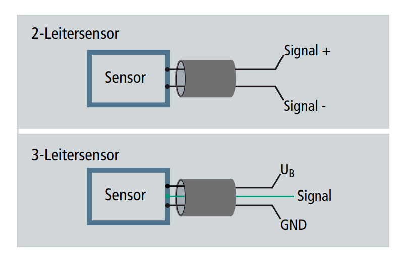


---

#### 🤓 Single-Ended vs. Differential


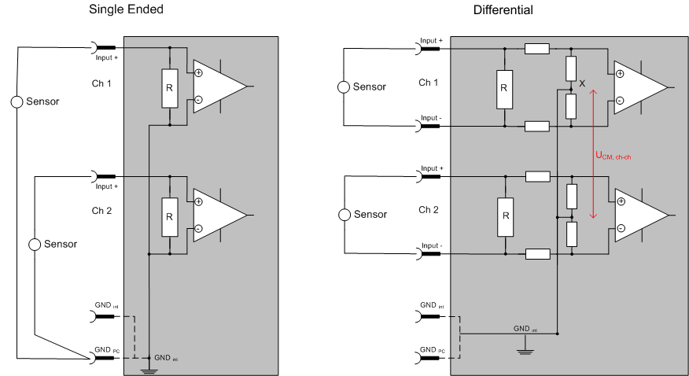


* Single-Ended: alle Sensoren liegen auf dem gleichen V- Potential (nur ein Kabel zurück)
* Differential: jeder Sensor hat sein eigenes V- Potential (weniger Störanfällig)

[Bildquelle](https://infosys.beckhoff.com/index.php?content=../content/1031/ep3356/1668832651.html&id=)

---

#### Signalformen


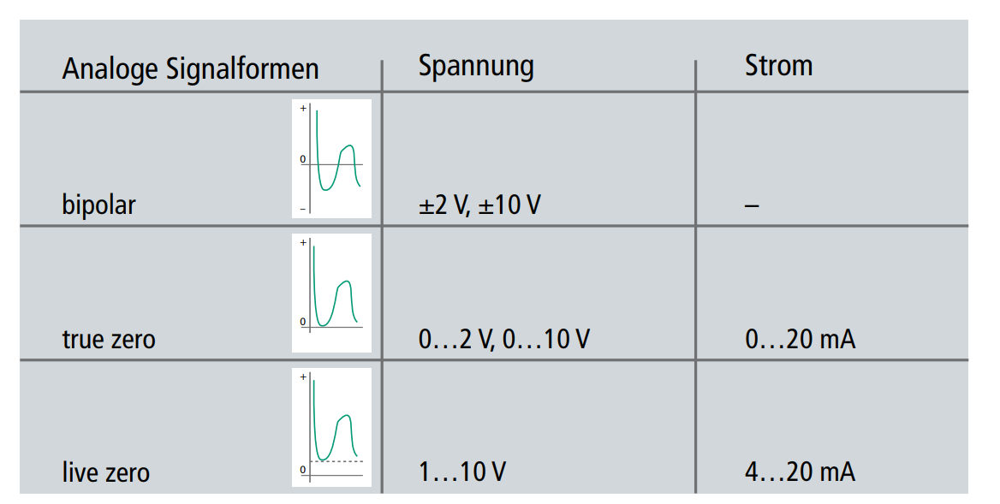


* live zero lässt Kabelbruch erkennen

[Bildquelle](https://download.beckhoff.com/download/document/Application_Notes/DK9221-1111-0059.pdf)


---

#### Analog-Digital-Wandlung


---

#### Analog-Digital-Wandlung


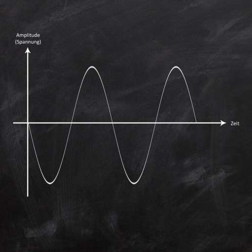

* Signalform:
  * Spannung
  * bipolar
* SPS kann nur diskrete Werte darstellen
  * Wie hoch ist die Zykluszeit der SPS?
  * Wie viel Bit stehen zur Speicherung eines Wertes zu Verfügung?

[Quelle](https://chrishoermann.at/analog-digital-wandlung-digital-analog-wandlung/)

---

#### Abtastung (Sample rate)

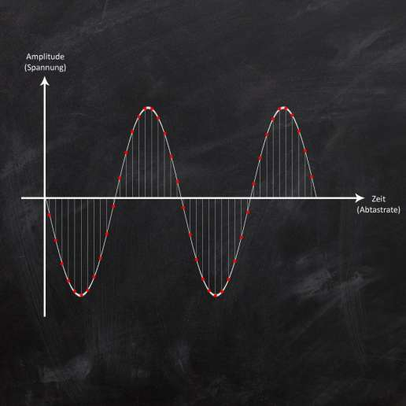

* i.d.R. Zykluszeit der SPS
* ein Wert pro Zyklus z.B. 10 ms


| T in ms | Beleuchtungsstärke in Lux |
|---|---|
| 0 | 0| 
| 10 | 50000 |  

[Quelle](https://chrishoermann.at/analog-digital-wandlung-digital-analog-wandlung/)

---

#### Digitalisierung (resolution)

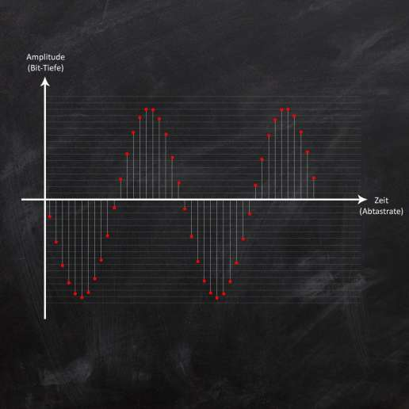

[Quelle](https://chrishoermann.at/analog-digital-wandlung-digital-analog-wandlung/)

* Wie viele Spannungswerte kann der Eingang unterscheiden (resolution)
* Angabe auf der Klemme: 12 Bit verteilt auf $-0-..10$ V
* $2^{12} = 4096$ Zustände


---


| T in ms | Beleuchtungsstärke in Lux am Sensor | Spannung in V nach Verstärker | Eingangswert als Integer am A/D-Wandler | Beleuchtungsstärke in Lux in der Steuerungseinheit |
|---|---|---|---|---|
| 0 | 0 | 0 | 0 | 0 |
| 10 | 50000 | 5 |2047 | 50000 |


[Quelle](https://mermaid.live/edit#pako:eNp1UMtqw0AM_BWj0wZsQpo-wIeAwZdCQqGGFtrtQXhle4m9a2QtpYT8Tf-kP9ZNg6GlRCdpNBpJc4DaG4Icmt6_1x2yJNtH7ZIY1qxeK3KT57ckyzaxvlJPxJN8ffKeeBExa9aqWJbZMzrTz9C1qoQCcXDtRNZ1ZOXcuFHlsvjLvf2veKeKvXhezEesV6q0rRWMQ8m9G4NcXjPPXD7ht9hDkJMapDAQD2hNtOFwktAgHQ2kIY-poQZDLxq0O0YqBvHVh6shFw6UQhgNCpUWW8YB8gb7KaJkbPxhd7b2x-EURnQv3s-c4zdLjX9a)

---


####  Digitalsignal

* Nach der Umwandlung im Speicher der SPS

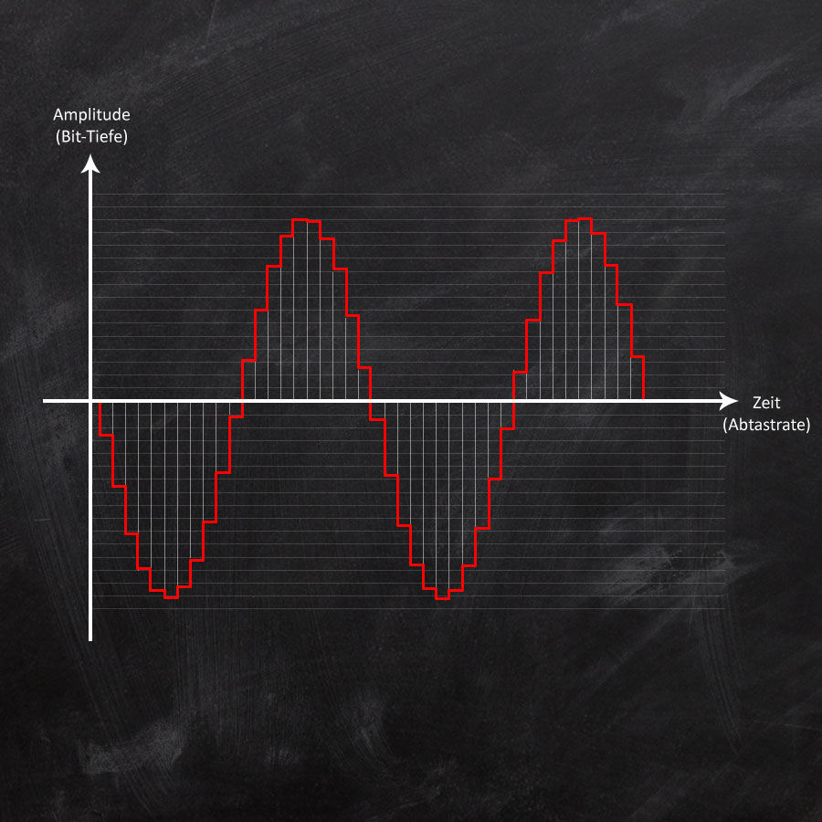
[Quelle](https://chrishoermann.at/analog-digital-wandlung-digital-analog-wandlung/)


| T in ms | Beleuchtungsstärke in Lux | 
|---|---|
| 0 | 0 | 
| 10 | 50000 |


---

## ✍️ Aufgabe 4_1_1: Anbindung eines Helligkeitssensors

- Ein Helligkeitssensor bildet die gemessenen Helligkeitswerte über ein analoges Signal $0...10 \text{ V}$ ab
- Die Eingangsschnittstelle verfügt über eine Auflösung von 12 Bit
  - Wie viele diskrete Helligkeitsstufen gibt es?
  - Was ist der kleinste Spannungsunterschied, der unterschieden werden kann?


---

###  ✔️ Lösung

* $2^{12}=4096$ diskrete Helligkeitsstufen
* $\Delta U_{min}=\frac{U_{max}-U_{min}}{n}=\frac{10-0 \text{ V}}{4096}=2.44 \text{ mV}$

---

### Analoger Eingang


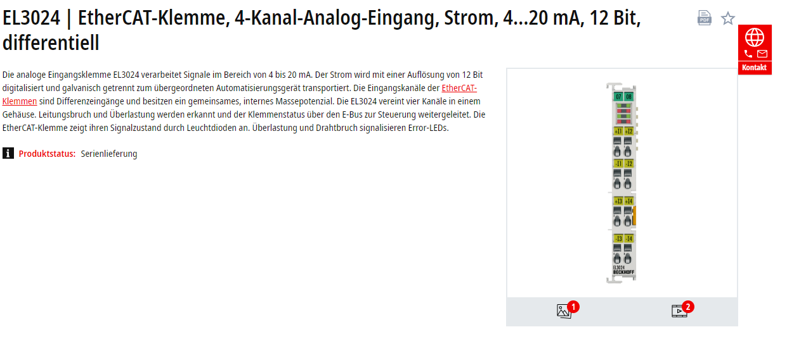


- Signal ist eine Stromstärke (**4...20mA**)
- Signal wird in **12 Bit** digitalisiert
- z.B. **Lichtsensor**


---

### Beispiele für analoge und digitale Signale


|         | Eingang          | Ausgang         |
|---------|------------------|-----------------|
| Digital | Taster, ...           | Kontrollleuchte, ... |
| Analog  | Temperaturfühler, ... | Elektromotor, ...   |


---

## ✍️ Aufgabe 4_1_2:


- In einer Lüftungsanlage soll ein Drucksensor (Druckbereich 0-10 bar) mit einem verbaut werden (siehe nöchste Folie)
- Wichtig ist hierbei, dass ein Drahtbruch sofort erkannt wird
  * Welches Sensorsignal wählen Sie?
  * Welche Klemme wählen Sie (wählen Sie eine von der Beckhoff Website)?
  * Was ist die kleinste Druckdifferenz, die Sie an der SPS erfassen können?
  * Zeichen Sie, wie sie den Sensor anschließen würden

[Quelle](https://www.sensorshop24.de/productpdf/download/file/id/1009/name/Drucktransmitter_G14%2522_oder_G12%2522_f%25C3%25BCr_%25C3%259Cber-_und_Unterdruck_mit_Normstecker_%25280%25E2%2580%259110V4%25E2%2580%259120mA%2529.pdf/)

---


---

### Übersicht Klemmen

[Link](https://www.beckhoff.com/de-at/produkte/i-o/ethercat-klemmen/el3xxx-analog-eingang/)


---

### ✔️ Lösung

* mit einem Stromsignal (4...20mA) kann ein Drahtbruch sicher erkannt werden
* Entsprechende Klemme z.B. EL3021 | EtherCAT-Klemme, 1-Kanal-Analog-Eingang, Strom, 4…20 mA, 12 Bit, differentiell
  * Single-Ended wäre ebenfalls möglich
  * mehre Eingänge wäre ebenfalls möglich

---


* kleinster möglicher Druckunterschied
* 12 Bit sind $2^{12}=4096$ mögliche Zustände
* Der Messbereich liegt zwischen 0-10 bar
* $\Delta P_{min}=\frac{P_{max}-P_{min}}{n}=\frac{10-0 bar}{4096}=2.44 \text{ mbar}$


---

#### EL3051 

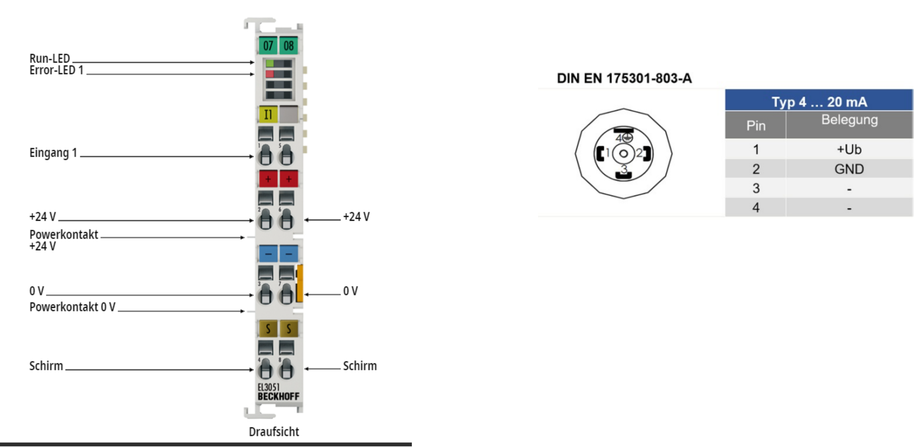

---

#### Lösung EL3051 - single-ended

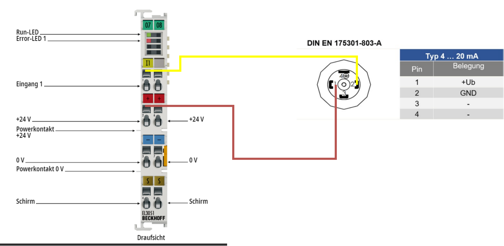

---

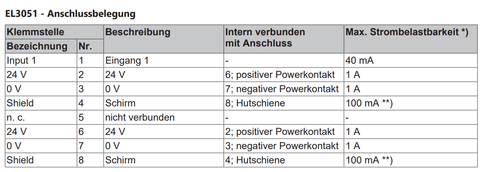

[Quelle](https://download.beckhoff.com/download/Document/io/ethercat-terminals/el30xxde.pdf)

---


#### Lösung EL3021 - differentiell

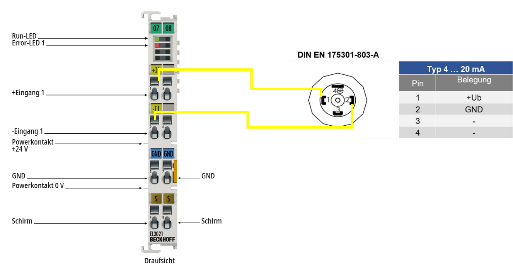

---


[Quelle](https://download.beckhoff.com/download/Document/io/ethercat-terminals/el30xxde.pdf)

---

### Ausgänge


* Für Digitale und Analoge Ausgänge gelten sie selben Prinzipien


---
marp: true
author: Julian Huber
size: 16:9
footer: Julian Huber - Bussysteme

# Strg+[ ] for Options

theme: beams

---

<!-- paginate: true -->


# 4.2 SPS-Sprachen nach IEC 61131-3


<!-- _class: title -->


---

## Allgemeiner Aufbau eines SPS-Projekts

- Die Folgenden Inhalte orientieren sich an der Software Twincat 3 von Beckhoff
- Die Inhalte sind aber auch auf andere SPS-Programmiersysteme übertragbar
- Da die Twincat 3 Software tief ins System eingreift, wird **nicht empfohlen diese auf den privaten oder Arbeits-Rechnern zu installieren**
- Die Software ist aber auf den Rechnern im Labor installiert
- Als Alternative, kann die Software [OpenPLC Editor]() empfohlen werden

---

### Projektstruktur

- Ein Projekt besteht aus einem oder mehreren Programmen, welche in einer ` POU` (Program Organization Unit) zusammengefasst werden


<!-- _class: white -->


---

#### Am Beispiel TwinCat

* **Entwicklungsumgebung** der Firma Beckhoff Automation für SPS Steuerungslogiken
* Kann auf der Steuerung oder anderem PC ausgeführt werden
* Links sieht man die Gesamtübersicht über das Projekt (**Projektexplorer**)
* Twincat bietet ein Fester für die Variablendeklaration (rechts oben) und ein Fester für den sonstigen Code an (rechts unten)


---

#### Programmablauf in Verarbeitungseinheit


* Nach dem EVA-Prinzip überwacht die SPS in regelmäßigen Abständen (**Zykluszeit**) die Werte der Eingänge und führt das
* **Hauptprogramm** ```(.../POUs/MAIN (PRG))``` aus 

---

#### Hauptprogramm (Main-Program)

* Entsprechend der `code.py` bei Circuit Python gibt es eine `MAIN`-Programm
* Währen wir im `code.py` einen `while`-Loop erstellen mussten, wir der Inhalt der `MAIN` immer wieder automatisch in der **Zykluszeit** der SPS ausgeführt

---


- Das Hauptprogramm wird in einer **Entwicklungsumgebung** geschrieben
- Hierzu kommen **verschiedene Programmiersprachen** zum Einsatz
- Nach Prüfung und Fehlerbeseitigung erstellt der **Compiler** dann den Programmcode, der **auf die Steuerung geladen** werden kann.
- liegt dann auf dem Speicher der SPS und kann verändert werden


---

### Programmiersprachen für SPS

- fünf Programmiersprachen (nach IEC 61131)
  * **Strukturierter Text**, ST (engl. Structured Text, ST) ähnlich [Pascal](https://de.wikipedia.org/wiki/Pascal_(Programmiersprache))
  * Anweisungsliste, AWL (engl. Instruction List, IL)
  * **Kontaktplan**, KOP (engl. Ladder Diagram, LD)
  * **Funktionsbausteinsprache**, FBS oder FUP genannt (engl. Function Block Diagram, FBD)
  * Ablaufsprache, AS (engl. Sequential Function Chart, SFC)

---

### Programm

- **[Programm](https://infosys.beckhoff.com/index.php?content=../content/1031/tc3_plc_intro/2530274187.html&id=)** liefert bei der Ausführung einen oder mehrere Werte und speichert diese in Variablen 
- Alle **Werte bleiben** nach einer Ausführung des Programms bis zur nächsten Ausführung erhalten
- z.B. der Status der Lampe im Hauptprogramm bis zur Ausführung des nächsten Zyklus


---

## ✍️ Aufgabe 4_2_1: Automatik Licht

> Anwendungsfall:  Eine smarte Lichtsteuerung soll eine Leuchte immer anschalten, wenn es dunkel ist und eine Anwesenheit erkannt wird

- Für unsere smarte Lichtsteuerung könnte das für eine Programmierung mittels **Strukturiertem Text** wie folgt aussehen, wenn wir statt analogen digitale Eingänge verwenden:

```SPS
PROGRAM MAIN // Main Programm wird definiert

VAR // Variablen werden deklariert
  bInAnwesenheit1 : BOOL; // der Variable für Anwesenheit. True = Anwesend
  bInDunkelheit2 : BOOL; // der Variable für Anwesenheit. True = Dunkel
  bOutLicht1 : BOOL; // der Variable für Licht. True = An
END_VAR

bOutLicht1 := bInAnwesenheit1 AND bInDunkelheit2; // Logische Verknüpfung (nur wenn beides erfüllt ist, geht das Licht an)
```

* Welche Unterschiede zu Python fallen Ihnen auf?

---


---

### ✔️ Lösung

```SPS
PROGRAM MAIN // Main Programm wird definiert

VAR // Variablen werden deklariert
  bInAnwesenheit1 : BOOL; // der Variable für Anwesenheit. True = Anwesend
  bInDunkelheit2 : BOOL; // der Variable für Anwesenheit. True = Dunkel
  bOutLicht1 : BOOL; // der Variable für Licht. True = An
END_VAR

bOutLicht1 := bInAnwesenheit1 AND bInDunkelheit2; // Logische Verknüpfung (nur wenn beides erfüllt ist, geht das Licht an)
```
* Kommentare mit  **```//```** eingeführt
* Zeilen werden mit **```;```** abgeschlossen
* Variablen und Ihr Typ müssen **deklariert** werden 
(Name und Datentyp werden festgelegt): ```<Variablenname>:<Typ>```
* Der Wert der Variable wird über **```:=```** gesetzt:
```<Variablenname>:=<Variablenwert>```

---

#### Wichtige Datentypen

- `BOOL`: Boolean
- `INT`: Integer (nur positiv)
  - z.B. Bit-Werte der Eingangsklemmen
- `UNIT`: Unsigned  Integer (nur positiv)
- `REAL`: Gleitkommazahl
  - z.B. Interne Darstellung der physikalischen Gößen
- [weitere](https://infosys.beckhoff.com/index.php?content=../content/1031/tc3_plc_intro/2529388939.html&id=)


---

## IF-Anweisungen 

- IF-Anweisung kann man eine Bedingung **abprüfen** und **abhängig** von dieser Bedingung ein Anweisungen **ausführen**

```
IF <Boolescher_Ausdruck1> THEN
  <IF_Anweisungen>
{ELSIF <Boolescher_Ausdruck2> THEN
  <ELSIF_Anweisungen1>
.
.
ELSIF <Boolescher_Ausdruck n> THEN
  <ELSIF_Anweisungen n-1>
ELSE
  <ELSE_Anweisungen>}
END_IF;
```

###### Ausdrücke in den ```{}``` sind optional

---

### Beispiel


```PASCAL
IF temp<17 THEN 
heizung_an := TRUE;
ELSE 
heizung_an := FALSE;
END_IF;
```

* Keine Einrückungen wie bei Python erforderlich

---

## ✍️ Aufgabe 4_2_2: Wechselschaltung


* Wie können wir dafür sorgen, dass das Licht den Zustand wechselt, wenn einer der beiden Schalter betätigt wird?

---

### ✔️ Lösung

```PASCAL
IF (bInS1 OR bInS2) THEN
  bOut1 = not(bOut1)
else:
  bOut1 = bOut1
```

---

## Funktionsbausteine

* **[Funktionsbaustein](https://infosys.beckhoff.com/index.php?content=../content/1031/tc3_plc_intro/2530279563.html&id=)** **liefert einen oder mehrere Werte**. 
* Die Werte der Ausgabevariablen und der internen Variablen bleiben bis zur nächsten Ausführung erhalten (lokalen Variablen werden nicht gelöscht)
* Vergleichbar eine Klasse, mit einer Methode, die immer wieder aufgerufen wird
* **Vorsicht**: bei mehrmaligem Aufruf mit denselben Eingabevariablen werden so nicht unbedingt dieselben Ausgabewerte geliefert vgl. Hysterese)


---

#### Funktionsbaustein

* Zunächst wird eine Blaupause (Klasse) erstellt, sie beschreibt, welche Ein-, Ausgaben, und Zwischenwerte ein Funktionsbaustein enthält (Variablen) und welche Berechnungen diese ausführt
* Im Hauptprogramm (`MAIN`) können eine oder mehrere Objekte des Bausteins instanziiert werden (als Variable deklariert werden)
* Auch bei der Arbeit mit Funktionsbausteinen gilt das EVA-Prinzip


### Warum gibt es beides - Funktionen und Funktionsbausteine?

- z.B. Anwendung von Funktionsbaustein für verschiedene Räume
- nach 100 Bewegungen soll gelüftet werden
- würde mit Funktion eine globale Variable pro Raum benötigen


---

## ✍️ Aufgabe 4_2_3: Funktionsbaustein Counter

* Schreiben Sie eine Klasse für einen Funktionsbaustein, der eine Zählervariable um eins erhöht und den aktuellen Wert zurückgibt
* Zudem soll der Zähler zurückgesetzt werden können

```Python
class Counter:
  def __init__(self):
    self.count = 0
```
    
---

### ✔️ Lösung

```Python
class Counter:
  def __init__(self):
    self.count = 0

  def increment(self):
    self.count =  self.count + 1
    return self.count

  def reset(self):
    self.count = 0
    return self.count

c = Counter()
c.increment()
c.increment()
print(c.increment())
```

---

### Verwendung von Programm-Organisationseinheiten

* **Programme**
  * Direkte Verbindung zu Ein- und Ausgabeeinheiten
  * **Grundgerüst** ist das Hauptprogramm `MAIN`, welches zyklisch ausgeführt wird und angibt welche Funktionen und Funktionsbausteine aufgerufen werden
* **Funktion** 
  * **Wiederverwendbare** Elemente
  * Es gibt viele Standardfunktionen
  * ohne internen Speicher
* **Funktionsbausteine**
  * **Komplexer** as Funktionen
  * Können Variablen erhalten
  * z.B. Zähler

---

## Strukturierter Text

---

### Anweisungen

- Wie in anderen höheren Programmiersprachen gibt es **Anweisungen** die den Text **strukturieren** 

- **Zuweisung**: Auf der linken Seite einer Zuweisung **```:=```** steht ein Operand (Variable, Adresse), dem der Wert des Ausdrucks auf der rechten Seite zugewiesen wird:

```
Var1 := Var2 * 10;
```

---

### Aufruf von Funktionen und Funktionsblöcken

- Aufruf eines Funktionsblocks: Aufruf durch Namen der Funktion oder Instanz des Funktionsblocks und in Klammer die gewünschten Werte der Parameter
  
- hier wird die Funktion ```FIND``` aufgerufen, um ```STR2``` in ```STR1``` zu finden
-  Die übergebenen Parameter sind beide Zeichenketten / Strings
- Funktionen haben einen fixen Rückgabetyp (z.B. die Position als INT)


---

### Globale und lokale Variablen

- Wichtiges Prinzip in der Programmierung
- Verhindert unbeabsichtigte Eingriffe
- Nur **globale Variablen** sind von **überall** sichtbar
- **lokale Variablen**, können z.B. **innerhalb** eines Programms oder Funkion definiert werden und sind nur darin sichtbar
- Alle Variablen sind zunächst nur innerhalb der jeweiligen POU sichtbar

---

### Arrays - Datenfelder (Listen gleichen Datentyps)

```
/ Deklaration
VAR
    aCounter : ARRAY[0..9] OF INT;
END_VAR

//Deklaration mit Initialisierung:

aCounter : ARRAY[0..9] OF INT := [0, 10, 20, 30, 40, 50, 60, 70, 80, 90];

//Datenzugriff 1:

//Der lokalen Variablen wird der Wert 20 zugewiesen.

nLocalVariable := aCounter[2];
```

---

### Weitere Anweisungen

* `Return` wird genutzt, um einen Baustein zu verlassen
* `EXIT`-Anweisung wenn diese in einer FOR-, WHILE- oder REPEAT-Schleife vorkommt, dann wird die innerste Schleife beendet, ungeachtet der Abbruchbedingung.
* **Aufruf einer Fuktion**: Analog zu Python werden der Funktionsname genannt und in Klammern die Attribute übergeben (z.B. ```SQRT(IN := 9)```)


---

## Funktionsplan

### 🎯 Lernziele

Nach dieser Einheit sind Sie in der Lage dazu
- einfache binäre Funktionspläne lesen und aufbauen
- einfache Bausteine (Vergleiche, Mathematische Operatoren) interpretieren
- die Wirkweise von Zeitbausteinen skizzieren und diese passenden Anwendungsfällen zuzuordnen

---


### (Binärer) Funktionsplan (FUP)

* Grafische Programmiersprache, nach **EVA**-Prinzip (links nach rechts)
* Jeder Baustein ist ein **Funktionsbaustein** (Funktionsblock)
* **Bausteine** mit Symbolen z.B.
  * ```&``` für *logisches und* ($\land$)
  * ```>=1``` für *logisches oder* ($\lor$)

* **Links** gehen die **Eingänge** in die Bausteine.  **Ergebnisse** werden **rechts** weitergegeben.
* **Variablen** die **gesetzt** werden stehen **über** den Bausteinen (vgl. Spule bei Kontaktplan, hier ```A0.1```) 


[Quelle](https://www.sps-lehrgang.de/zusammengesetzte-verknuepfungen/)


---

#### Negieren von Ein- und Ausgängen

* Bei binären Ein- und Ausgängen kann der Wert durch einen **Kreis negiert** werden
* ``` TRUE``` wird zu ``` FALSE```
* ``` FALSE``` wird zu ``` TRUE```


[Quelle](https://www.sps-lehrgang.de/zusammengesetzte-verknuepfungen/)

---

## ✍️ Aufgabe 4_2_4: Binärer Funktionsplan

  ```
  E0.1 = TRUE
  E0.2 = TRUE
  ```

- Was ist ```A0.1``` ?

---

### ✔️ Lösung 

* `E0.1` wird negiert
* `E0.2` wird negiert
* `not(E0.1) and not(E0.2) = False` wird negiert
* Ausgang des `&`-Bausteins wird negiert
* `A0.1 = True` 

--- 


[Quelle](https://www.sps-lehrgang.de/zusammengesetzte-verknuepfungen/)

---


---

### Zeitbausteine

* Ein guter **Bewegungsmelder** würde nicht sofort erlöschen, wenn keine Bewegung mehr registriert wird, sondern für ein **Nachleuchten der Lampen** sorgen (Nachlauf)
* Die könnte über das Zählen der Zyklus-Zeiten gesteuert werden, hierzu müssten aber alle Zyklen auf jeder Steuerung gleich lang sein
* Stattdessen können **spezielle Bausteine**, wie z.B. TOF (Timer off), Ausschaltverzögerung eingesetzt werden.

---

#### TOF: Ausschaltverzögerung (Timer Off)

> verlängert Signal nach Wechsel auf Off (False)

- ```IN```  binärer Eingang
- ```PT```  Gesetzte Ausschaltverzögerung
- ```Q```   binärer Ausgang mit Impuls
- ```ET```  Vergangene Zeit seit Erkennen des Ende des Eingangsignals 


[Quelle](https://www.xplore-dna.net/mod/page/view.php?id=168)

---


## ✍️ Aufgabe 4_2_5 Erweiterung um Nachlauf von einer Sekunde

<!-- _class: white -->


---

### ✔️ Lösung


---

#### Impulsbildung

> wandelt positive Flanke in Impuls mit fixer Länge

- ```IN```  binärer Eingang
- ```PT```  Gesetzte Impulslänge
- ```Q```   binärer Ausgang mit Impuls
- ```ET```  Vergangene Zeit seit Impulsstart (Elapsed Time)


[Quelle](https://www.xplore-dna.net/mod/page/view.php?id=166)

---

#### TON: Einschaltverzögerung

> verzögerte Aktivierung, sofern Mindestdauer erreicht

- ```IN```  binärer Eingang
- ```PT```  Gesetzte Einschaltverzögerung
- ```Q```   binärer Ausgang mit Impuls
- ```ET```  Vergangene Zeit seit Erkennen des Eingangsignals 


[Quelle](https://www.xplore-dna.net/mod/page/view.php?id=167)

---

#### TONR: Zeitakkumulator

> Gibt aufsummierte Zeit sobald Mindestwert erreicht

- ```ET```  Zeit bis zur Ausgabe
- ```PT```  Maximalzeit bis Ausgabe
- ```IN```  binärer Start-Eingang
- ```R```  binärer Reset-Eingang
- ```Q```   binärer Ausgang zeigt wann ```PT``` erreicht


[Quelle](https://www.xplore-dna.net/mod/page/view.php?id=168)


---

## ✍️ Aufgabe 2_4_6: Zeitbausteine

- Zeichnen Sie das Ausgangssignal 
  - einer Ausschaltverzögerung TOF mit ```PT = 2s```
  - eines Impulsgenerators TP mit ```PT = 0.5s```


---

### ✔️ Lösung


---

### Zähler

> Zählt Flanken (Änderungen `False` auf `True`)

- ```CU```  binärer Eingang an dem die Flanken  gezählt werden (Count Up)
- ```R```  Reset-Eingang um Zähler zurückzusetzen
- ```PV```   Oberer Grenzwert
- ```CV```  Ausgang der hoch zählt (Counter Value)
- ```Q```  Zählerstatus im Vergleich mit ```PV```  


---

### Weitere Bausteine

---

#### Trigger-Bausteine

- Erkennen steigende oder fallende Flanken
- `F_TRIG` für fallende Flanken
- `R_TRIG` für steigende (rising) Flanken


---


- Anstelle von zurücksetzen der Taster (Bild)
- Szenenwechsel wird nur bei Aktivierung eines Tasters aktiviert


---

#### Speicherbausteine

>Zuweisungen bleiben i.d.R. nur solange bestehen
wie die Eingänge auf den vorherigen Block wirken.


<!-- class: white --->
---


- Zuweisungen bleiben i.d.R. nur solange wie die Eingänge auf den vorherigen Block wirken.
- Speicherglieder und Flipflops **erhalten den Wert**, auch wenn die Setz-Bedingung nicht mehr gegeben ist.

- **Ausgang setzen im FUP**
  - Hier wird der Wert von ```A0.1``` gesetzt (S für set)


---

#### SR-Flipflop


* der Ausgang ```Q``` wird abhängig vom Signalzustand der Eingänge ```S```(et) und ```R```(eset) **dauerhaft** gesetzt
* Wenn der Signalzustand am Eingang ```S=1``` und am Eingang ```R=0```ist, wird ```Q=1``` gesetzt. 
* ```S=0``` und am Eingang ```R=1```ist, wird auf ```Q=0``` zurück gesetzt. 
* bei SR-Flipfops **dominiert** Eingang **```S```** den Eingang **```R```**. Bei ```1``` an beiden Eingängen wird der Operanden auf "1" gesetzt

| S | R | Q |
|---|---|---|
| 0 | 0 | Q |
| 1 | 0 | 1 |
| 0 | 1 | 0 |
| 1 | 1 | 1 |


[Quelle](https://www.xplore-dna.net/mod/page/view.php?id=173)

---


#### RS-Flipflop


- Der Eingang **```R``` dominiert** den Eingang ```S```. Bei einem Signalzustand ```1``` an beiden Eingängen wird der Signalzustand des angegebenen Operanden auf "0" zurückgesetzt.

| S | R | Q |
|---|---|---|
| 0 | 0 | Q |
| 1 | 0 | 1 |
| 0 | 1 | 0 |
| 1 | 1 | **0** |


[Quelle](https://www.xplore-dna.net/mod/page/view.php?id=1038)


---

#### Speicherbausteine und Variablen

- Ist das Programm in der Lage interne Variablen zu speichern, kann der Einsatz von Speicherbausteinen durch Zuweisungen ersetzt werden


---


## Zusammenfassung und Ausblick

* komplexe neuartige Probleme lassen sich häufig am besten über strukturierten Text lösen
* für viele bestehende Anwendungsfälle stehen in verschiedenen Softwarelösungen bereits Funktionen und Funktionsblöcke bereit

---

### Automatiklicht


- `bSwi`: Eine steigende Flanke an diesem Eingang schaltet den Baustein und das Licht wechselweise ein und aus.
- `bOn`: Eine steigende Flanke an diesem Eingang schaltet den Baustein und das Licht gezielt ein.
- `bOff`: Eine steigende Flanke an diesem Eingang schaltet das Licht und die Gesamtfunktion des Bausteins aus.

- `fOut`: Steuerausgang für Lichtaktoren (0…100 %).


[Quelle](https://infosys.beckhoff.com/index.php?content=../content/1031/tf8040_tc3_buildingautomation/9255011851.html&id=7218420269355608175)


---

### PID-Regler


- `fSetpointValue`: Sollwert der Regelgröße
- `fActualValue`: Istwert der Regelgröße

* `fOut`: Ausgang des PID-Glieds

* Was fehlt noch?
  * `fKp`: Reglerbeiwert
  * `tTn`: Nachstellzeit
  * `tTv`: Vorhaltzeit
  * in `stParams`


[Quelle](https://infosys.beckhoff.com/index.php?content=../content/1031/tf4100_tc3_controller_toolbox/245435787.html&id=)

---
marp: true
author: Julian Huber
size: 16:9
footer: Julian Huber - Bussysteme

# Strg+[ ] for Options

class: inver

theme: lemon

---

<!-- paginate: true -->


# 🤓 Appendix: 4.3 Twincat

---


## Installation Twincat und Erstes Projekt

### 🎯 Lernziele
Nach dieser Einheit sind Sie in der Lage dazu
- eine Testinstanz von TwinCat 3 auf ihrem Rechner auszuführen
- ein einfaches Hallo World Programm mit Strukturiertem Text schreiben und ausführen

---

### Installation Twincat und Erstes Projekt

- [Download](https://www.beckhoff.com/de-at/support/downloadfinder/software-und-tools/) und Installation von TwinCat
- [Handbuch](https://download.beckhoff.com/download/document/automation/twincat3/TC3_Installation_DE.pdf)
- [Quelle](https://www.youtube.com/watch?v=GOFUsWc61Hk) und gutes Video zum nachmachen
- Problemlösung, wenn Code nicht ausführbar
  - [AdsError: 4132 + "HyperV" Problem](https://www.sps-forum.de/threads/twincat-3-4024-10-visual-studio-2019-xar-adserror-4132-hyperv-problem.101584/)
  - `win8settick.bat` im TwinCat Ordner als Admin ausführen


---

### Was ist TwinCat

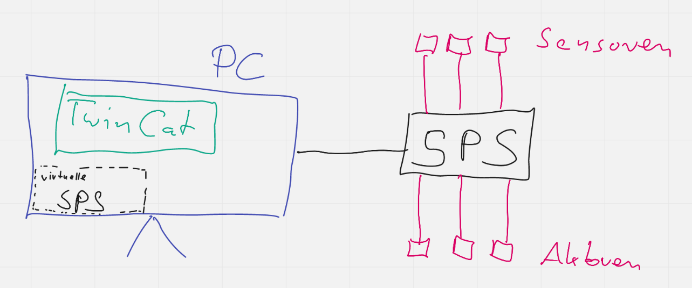

- Software für SPS Entwicklungen und Bertrieb
- **Entwicklungsumgebung**: Programm zum Entwickeln von Programmen
- **Laufzeitumgebung**: Überwachnung von kompilierten Programmen 
  - Code wird auf SPS geladen und dort ausgeführt
  - Alternativ kann zum Testen eine **virutelle SPS** auf dem Entwicklungs-PC gestartet werden

---

## Ausführen des Programms

- TwinCat wird in der Regel auf einem PC gestartet
- Teilweise sind auch kleine PCs direkt auf die Hutschiene mit der SPS installiert

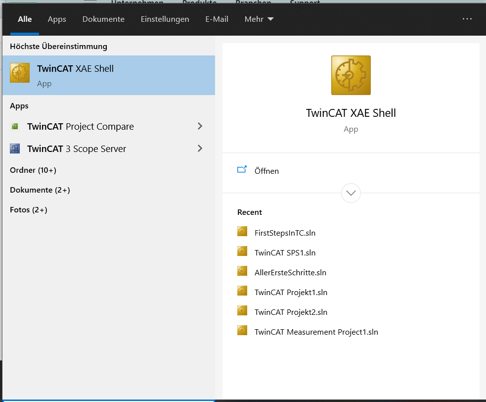


---

### Entwicklungsumgebung

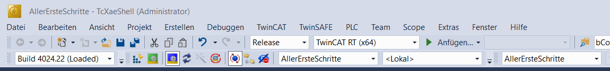


- Zunächst startet TwiNCat im Entwicklungsmodus
- Erkennbar am blauen Zahnrad

---

### Anlegen eines neuen Projektes


- Neues Projekt anlegen
- kein SPS-Projekt

---


### Anlegen eines neuen SPS-Projektes


- Innerhalb des Projektes wird ein neues SPS-Projekt angelegt
- Rechtsklick auf SPS (Neues Element hinzufügen)
- Nutzen der Vorlage (Standard PLC Project)

---

### Öffnen des Main Programms

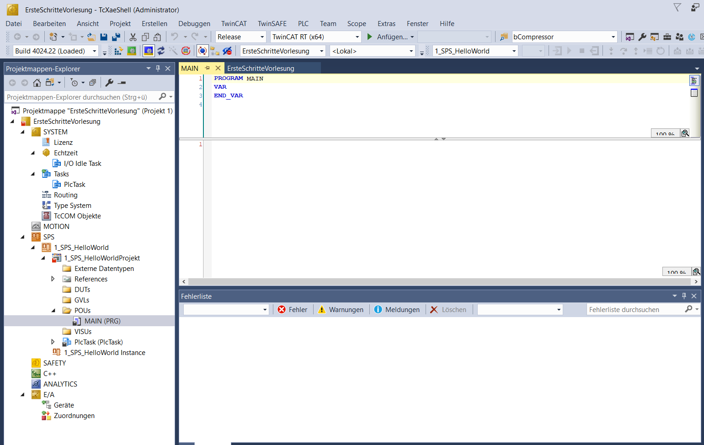

- Relevant ist das MAIN-Programm unter `/POU/` 
- Dieses besteht aus einem Variablen (oben)
- und einem Code-Editor (mitte)

---

### Variablen Deklarieren


- Variablen können in Tabellen- und Textueller Ansicht angezeigt werden (rechts oben)


---

### Wichtige Datentypen

- `BOOL`: Boolean
- `INT`: Integer (nur positiv)
  - z.B. Bit-Werte der Eingangsklemmen
- `UNIT`: Unsigned  Integer (nur positiv)
- `REAL`: Gleitkommazahl
  - z.B. Interne Darstellung der physikalischen Gößen
- [weitere](https://infosys.beckhoff.com/index.php?content=../content/1031/tc3_plc_intro/2529388939.html&id=)


---

### Zyklische Ausführung


* SPS hat eine feste Zykluszeit
* In dieser wir das Main-Programm wiederholt ausgeführt
* Variablenzustände werden erhalten

---

### Zyklische Ausführung

* Ablauf
  * Eingänge werden gelesen
  * Main-Programm wird ausgeführt
  * Ausgänge werden geschrieben
* Änderungen nach dem Einlesen, werden erst im nächsten Zyklus erfasst

---

## ✍️ Aufgabe 4_3_1: Blinker

Schreiben Sie ein Main Programm, das den Zustand einer LED alle 100 Zyklen wechselt.

Tipps:
  - `LedStatus := NOT(LedStatus)` zum wechseln (toggeln)
  - Variable, die die Zyklen zählt
  - `IF`-Anweisung


---

### Aufgabe

- Programmieren Sie einen einfachen Bewegungsmelder basierend auf drei Variablen:
	- ```bInAnwesenheit1 : BOOL;``` // der Variable für Anwesenheit. True = Anwesend
	- ```bInDunkelheit2 : BOOL;``` // der Variable für Anwesenheit. True = Dunkel
	- ```bOutLicht1 : BOOL```; // der Variable für Licht. True = An

---

### Lösung

Wir möchten einen Bewegungsmelder implementieren, 
welcher nur bei Dunkelheit und Bewegung ein Licht anschaltet.

Hierzu definieren wir die Variablen als:
```
PROGRAM MAIN        // Beschreibung an welcher Stelle die Variablen gültig sein sollen
VAR                 // Beginn der Variablen Deklaration
  bInAnwesenheit1 : BOOL; // der Variable für Anwesenheit. True = Anwesend
  bInDunkelheit2 : BOOL; // der Variable für Anwesenheit. True = Dunkel
  bOutLicht1 : BOOL; // der Variable für Licht. True = An
END_VAR
```


---

### Implementieren der Steuerungslogik

- Das Licht soll nur angehen, wenn ```bInAnwesenheit1``` und ```bInDunkelheit2``` auf ```True``` stehen.
- Standardmäßig ist das Main-Programm Strukturierter Text. 
Dies kann aber geändert werden.

* Lösung
  ```
  bOutLicht1 := bInAnwesenheit1 AND bInDunkelheit2; 
  // Logische Verknüpfung (nur wenn beides erfüllt ist, geht das Licht an)
  ```` 

---

### Befüllen des Main Programmes


- fertiges Programm, welches in jedem Zyklus ausgeführt wird

---

### Kompilieren

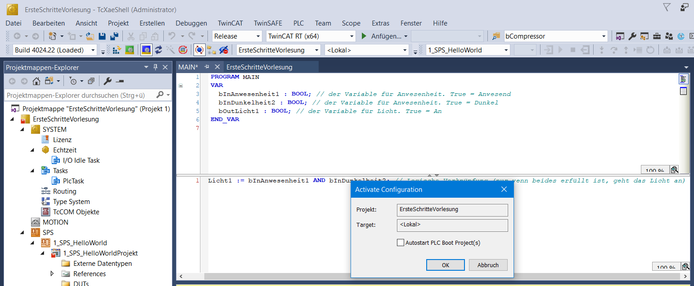

- Zum Ausführen muss der Code kompiliert werden
- Hierzu dient das Symbol mit der kleinen blauen Treppe

---

## Testlizenz


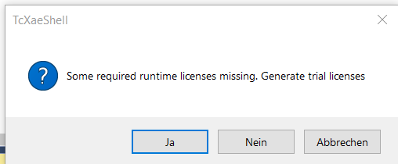

- Die Testlizenz läuft 7 Tage und kann immer wieder erneuert werden
- Im Produktivbetrieb wäre regelmäßiges Erneuern sehr störend

---

### Testlizenz aktivieren und SPS auswählen

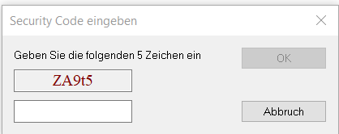


---

### TwinCat startet im Laufzeitmodus


- Nun kann der Code grundlegend ausgeführt werden
- Erkennbar am grünen Zahnrad unten rechts

---

### Auf SPS einloggen und Programm in Speicher laden

- Als nächstes loggen wir uns auf eine SPS ein, um den Code dorthin zu übertragen 
- In unserem Fall ist das die virtuelle SPS auf unserem Rechner
- Meldung, das Programm bisher noch nicht besteht
  


---

### Werte in SPS schreiben

- Um nun Werte zu setzen (die nicht von außen vorgegeben sind), 
gibt es folgendes Vorgehen
  - "Vorbereiteten Wert" eingeben
  - "Wert schreiben", um den Wert zu setzen
  
 
---


### Zyklus-Schritt umsetzen

- Damit die Änderung auf im Ergebnis wirksam wird, 
können wir manuell einen Zyklusschritt durchführen (blauer Kreispfeil)
- Hierdurch wird das Main-Programm einmal mit
den neuen Werten ausgeführt
- alternativ kann die SPS auch im Echtzeitbetrieb betrieben werden (grüner Pfeil)


---

### Ausloggen

- Nach Beendigung können wir uns wieder ausloggen
- und in den Entwicklungsmodus zurückkehren
  

---

## ✍️ 4_3_1Aufgabe 4_3_2: Bewegungsmelder FUP

> Erstellen Sie für die gleiche Logik ein Funktionsbausteinplan

- Legen Sie ein neues SPS-Projekt an (Rechtsklick)
- Löschen Sie das MAIN-Programm
- Erstellen Sie in neues POU MAIN als Funktionsbausteinsprache (FUP)


---

### Variablendeklaration

- Übernehmen Sie die Variablendeklaration
- Ziehen Sie einen Baustein aus der Toolbox in das FUP-Feld


---

### Bausteine 

- Wählen sie den Typ des Bausteins (```...```)
- Benennen Sie den Baustein mit ```AND``` wird dies automatisch erkannt
- Wählen Sie die Variablen als Eingänge
- Fügen Sie eine Zuweisung am Ausgang an und vergeben Sie die Variable
- Im Gegensatz zu Funktionen (z.B. `AND`) werden Funktionsblöcke als Variablen mit eigenem Namen instanziiert

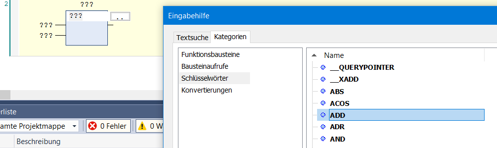

---

### Lösung

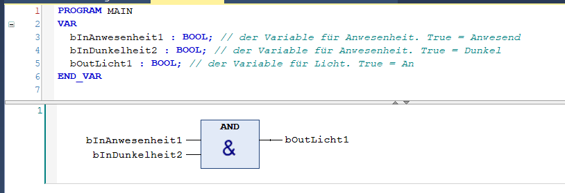


---


## Problemlösung, wenn SPS nicht ausführbar

- [AdsError: 4132 + "HyperV" Problem](https://www.sps-forum.de/threads/twincat-3-4024-10-visual-studio-2019-xar-adserror-4132-hyperv-problem.101584/)
- win8settick.bat im TwinCat Ordner als Admin ausführen


---

### Zusammenfassung TwinCat - Entwicklung

- Oberste Ebene ist das **Projekt** (ErsteSchritteVorlesung)
- Darunter gibt es **SPS**-Projekte (1_SPS_HelloWorld)
- In **POUs** liegen die Programme
- Daneben Visualisierungen (VISUs) und andere Funktionn


---

### Zusammenfassung TwinCat - Ausführung
    

- Es muss das richtige **Zielsystem** ausgewählt werden
- Ansonsten wird der Code **Lokal** auf dem aktuellen Rechner ausgeführt
- Ist ein Zielsystem mit Klemmen verbunden, so werden diese unter **E/A** angezeigt


---

### ePC Verbinden

- Wird lokal auf einem PC entwickelt, und möchte man den Code auf der SPS ausführen, muss man den PC und den embeddedPC der SPS mit einem Netzwerkkabel verbinden
- Schritte aus [Video](https://www.youtube.com/watch?v=LJUcyWCAH_Y&list=PL2LjUivoqcmUNF4wfaZdWQEZm9ptpIFuw&index=11)
  - TwinCat im Configmodus starten
  - verbinden digitale und analoge Welt
  - Dropdown <Local> / Zielsystem wählen
  - Suchen im Netzwerk: Suchen (Ethernet) / Broadcastsuche
  - ePC auswählen (MAC1-Addresse, letzte & Zeichen)

---

### Klemmen Scannen

- Schritte:
  - TwinCat im Configmodus starten
  - Menüpunkt E/A / Scannen - Nach Boxen (Klemmen) suchen - Free Run aktivieren
  - Klemmen mit Typ werden angezeigt
  - Funktion: Zeige Online-Daten aktivieren (Blaue Kugel mit roten Pfeilen)
  - Channel / Input / Öffnen
  - Datentyp der Varialben überprüfen


---

### Verbindung von Hardwaresignalen zu Variablen

- Passende Variablen in Main anlegen
- Deklarieren ob Eingangs oder Ausgangs-Variable (```AT%I*```vs ```AT%Q*```)

```
PROGRAM MAIN
VAR
  bInTaster AT%I*: BOOL;
  bInTaster AT%Q*: BOOL;  
END_VAR
```

- Button: Konfiguration Aktivieren
- Klemme und Channel auswählen
  - Reiter Variable 
  - Verknüpft mit auswählen
- Konfiguration aktivieren


---


## ✍️ Aufgabe 4_3_3: Funktion Lineare Transformation

- An einen Analog-Eingang (z.B. 0...10 V) mit einer Auflösung von 12 Bit ($2^{12}=4096$ mögliche Zustände) ist ein Drucksensor mit Messbereich von 0...10 bar angeschlossen
- Durch eine Funktion sollten die vom Eingang gemessenen Integer-Werte in einen Druck in bar umgerechnet werden

---

### Lösung: `FUN_LinearTransformation`

```
FUNCTION FUN_LinearTransformation : REAL // Funktionsname und Typ der Rückgabe
VAR_INPUT
	value_to_transform : INT;	// Wert der Transformiert werden soll
	min_eingang : REAL;	// Untere Grenze der Eingabe (z.B. 0)
	min_ausgang : REAL; // Untere Grenze der Ausgabe (z.B. 0 bar)
	max_eingang : REAL; // Obere Grenze der Eingabe (z.B. 2**12)
	max_ausgang : REAL;	// Obere Grenze der Ausgabe (z.B. 10 bar)
END_VAR
VAR
	steigung : REAL;  // Steigung als Zwischenvariable
END_VAR
```

```
steigung := (max_ausgang-min_ausgang)/(max_eingang-min_eingang); // Berechnung der Steigung der Geraden, Wird jedes mal neu berechnet

FUN_LinearTransformation := value_to_transform * steigung + min_ausgang; // Anwendungs der linearen Transformation
```

---

### Lösung: `MAIN`

```
PROGRAM MAIN
VAR
	aInPressure : INT;		// Eingangswert von Analogem Eingang
	pressure_bar : REAL;	// Umgerechneter Wert in physikalische Größe z.B. bar
END_VAR
```

```
pressure_bar := FUN_LinearTransformation(value_to_transform := aInPressure, min_eingang := 0, min_ausgang := 0, max_eingang := 4096, max_ausgang := 10);
```


---


---

## Operatoren nach Bindungsstärke


| Operation                        | Symbol                         | Bindungsstärke     |
|----------------------------------|--------------------------------|--------------------|
| Einklammern                      | `(<Ausdruck>)`            | Stärkste Bindung   |
| Funktionsaufruf                  | `<Funktionsname>(Parameterliste)` |                    |
| Potenzieren                      | `EXPT`                           |                    |
| Negieren        | `-`                           |                    |
|  Komplementbildung       |  `NOT`                          |                    |
| Multiplizieren   | `*`                         |                    |
|  Dividieren  | `/`      |                    |
|   Modulo |`MOD`                        |                    |
| Addieren             | `+`                             |                    |

---

| Operation                        | Symbol                         | Bindungsstärke     |
|----------------------------------|--------------------------------|--------------------|
|  Subtrahieren            | `-`                            |                    |
| Vergleiche                       | `<`,`>`,`<=`,`>=`                      |                    |
| Gleichheit Ungleichheit          | `=`                           |                    |
| Gleichheit Ungleichheit          | `<>`                           |                    |
| Bool AND                         | `AND`                            |                    |
| Bool XOR                         | `XOR`                            |                    |
| Bool OR                          | `OR`                             | Schwächste Bindung |

[Quelle](https://infosys.beckhoff.com/index.php?content=../content/1031/tcplccontrol/html/tcplcctrl_languages%20st.htm&id=5754912264349492758)

---


## ✍️ 4_3_4 Aufgabe: Auswertung von Ausdrücken

Werten Sie die folgenden Ausdrücke aus

```
foo := (3+2) EXPT 2;    (* *) 
ba := 3 + 2 EXPT 2;     (* *) 
blub := foo + 3         (* *)
result := blub > 10    (* *)
```


---

### Lösung

```
foo := (3+2) EXPT 2;    (* 25 *) 
ba := 3 + 2 EXPT 2;     (* 7 *) 
blub := foo + 3;         (* 28 *)
result := blub > 10;     (* TRUE *)
```

---


### Zusammenfassungen Anweisungen

| Anweisungsart                                             | Beispiel                                                                                                   |
|-----------------------------------------------------------|------------------------------------------------------------------------------------------------------------|
| Zuweisung                                                 | ```A:=B; CV := CV + 1; C:=SIN(X);```                                                                             |
| Aufruf eines Funktionsblocks | ```CMD_TMR(IN := %IX5, PT := 300);A:=CMD_TMR.Q;```                                                               |
| RETURN                                                    | ```RETURN;```                                                                                                    |
| IF                                                        | ```IF D<0.0  THEN C:=A; ELSIF D=0.0  THEN C:=B; ELSE C:=D; END_IF;```                                 |
| CASE                                                      | ```CASE INT1 OF 1: BOOL1 := TRUE; 2: BOOL2 := TRUE; ELSE  BOOL1 := FALSE;  BOOL2 := FALSE; END_CASE;```          |
| FOR                                                       | ```FOR J:=101; FOR I:=1 TO 100 BY 2 DO     IF ARR[I] = 70        THEN J:=I;        EXIT;     END_IF; END_FOR;``` |
| WHILE                                                     | ```WHILE J<= 100 AND ARR[J] <> 70 DO     J:=J+2; END_WHILE;```                                                   |
| REPEAT                                                    | ```REPEAT J:=J+2; UNTIL J= 101 OR ARR[J] = 70 END_REPEAT;```                                                     |
| EXIT                                                      | ```EXIT;```                                                                                      |
| Leere Anweisung                                           | ```;```     

<!--

---

## ✍️ 4_3_5: Aufgabe Heizungsanlage

Im Falle eines Appartmenthauses haben Sie es mit einer sehr störrischen Heizungsanlage zu kämpfen. Fällt diese aus, so startet sie häufig erst nach einigen Anlaufversuchen. Um über die nächsten Wochen zu kommen, bis eine neue Heizung installiert werden kann, programmieren Sie eine Notlösung:


---

Den Heizungsstatus können Sie über die Boolesche Variable ```aInHeatingStatus``` auslesen.
. Die Heizungsanlage kann mit der Funktion ```START_HEATING_SYSTEM()``` neu gestartet. Die Funktion hat keine Parameter, gibt aber den Wert ```TRUE``` zurück, wenn der Startversuch erfolgreich war. Wenn dies nach 20 Versuchen nicht funktionieren sollte, wird es Zeit die Techniker:in zu informieren, damit diese sich dem Problem vor Ort annimmt. Hierzu wurde die Funktion ```NOTIFY_TECHNICIAN()``` bereitgestellt. Wenn es besonders kalt ist (5°C) ist das Problem besonders kritisch: anstelle des Techniker:innen, sollen in diesem Fall alle Mitarbeitenden informiert werden (```NOTIFY_ALL()```). Die Umgebungstemperatur können Sie mit der Variable ```aInTempOutside``` abrufen.

---

Schreiben Sie ein Steuerungsprogramm als Strukturierten Text, welches in jedem Zyklus die Status der Heizungsanlage überwacht, diese bei Bedarf neu startet und ggf. die Techniker:innen und anderen Mitarbeiter:innen informiert.  Nutzen Sie dazu Schleifen und IF-Anweisungen. Gehen Sie von einer sehr langsamen Zykluszeit der Steuerung aus (ca. 5 Minute). Ein Startversuch hingegen dauert nur 2 Sekunden.


---

### Hinweise:

```
// Abfrage des Status zu Beginn jedes Zyklus
IF aInHeatingStatus = False THEN
  <...>
```

```
// Mehrfacher Versuch des Starts
FOR Versuch:=1 TO 20 BY 1 DO
  <...>

END_FOR;
```

```
// Aufruf der Startfunktion und gleichzeitiges Speichern der Rückgabe
aInHeatingStatus := START_HEATING_SYSTEM()
```

---

### Lösung

In jedem Zyklus fragen wird zu Beginn den Status der Anlage ab und werden nur aktiv, wenn diese nicht läuft

```
// Abfrage des Status zu Beginn jedes Zyklus
IF aInHeatingStatus = False THEN
  <...>
```

---


Dann führen wir 20 Startversuche auf.

Dazu rufen wir die Funktion ```START_HEATING_SYSTEM```in der For-Schleife auf.

```
FOR Versuch:=1 TO 20 BY 1 DO          (* Versuch es 20 mal *)

START_HEATING_SYSTEM(); (* Rufe die Funktion zum Starten auf*)

END_FOR;
```


---

### Lösung

Da wir die Versuche stoppen können, wenn die Heizung erfolgreich gestartet ist, wollen wir das Ergebnis des Startversuches in einer neuen Variable ```aInHeatingStatus``` speichern.

```
FOR Versuch:=1 TO 20 BY 1 DO          (* Versuch es 20 mal *)

aInHeatingStatus := START_HEATING_SYSTEM(); (* Rufe die Funktion zum Starten auf*)

END_FOR;
```

---

### Lösung

Dazu überprüfen wir in jedem Schleifendurchlauf, ob das Starten geklappt hat. Wenn es geklappt hat, dann können wir die For-Schleife mit der Anweisung ```EXIT```verlasse, ohne sie 20 mal zu durchlaufen.

```
FOR Versuch:=1 TO 20 BY 1 DO          (* Versuch es 20 mal *)

aInHeatingStatus :=START_HEATING_SYSTEM();        (* Rufe die Funktion zum Starten auf und speichere ob es erfolgreich war *)

IF aInHeatingStatus THEN                       (* Wenn es erfolgreich war *)
EXIT;                                 (* Verlasse die for-Schleife *)
END_IF;

END_FOR;
```

---

### Lösung

Wenn wir beim 20. Versuch angelangt sind, und die Schleife immer noch nicht wegen Erfolgs verlassen haben, wird es Zeit den Techniker zu informieren. 
Die Funktion zur Information ```NOTIFY_TECHNICIAN``` wird ausgelöst, wenn wir den 20. Durchlauf erreichen. Das Prüfen wir über eine IF-Anweisung.
Hier rufen wir eine Funktion ohne Rückgabe auf. Deswegen steht kein neuer Variablename links der Funktion.


```
FOR Versuch:=1 TO 20 BY 1 DO          (* Versuch es 20 mal *)

aInHeatingStatus:=START_HEATING_SYSTEM();        (* Rufe die Funktion zum Starten auf und speichere ob es erfolgreich war *)

IF aInHeatingStatus THEN                       (* Wenn es erfolgreich war *)
EXIT;                                 (* Verlasse die for-Schleife *)
END_IF;

IF Versuch = 20 THEN                 (* Beim 20. Versuch*)
NOTIFY_TECHNICIAN();                    (* Benachrichtige die Techniker:in *)
END_IF;

END_FOR;
```

---

### Lösung

Um alle zu informieren, müssen wir zusätzlich die Außentemperatur überprüfen. Hierzu können eine zweite If-Abfrage mit etwas komplizierterem Booleschen Ausdruck 

```
FOR Versuch:=1 TO 20 BY 1 DO          (* Versuch es 20 mal *)

aInHeatingStatus:=START_HEATING_SYSTEM();        (* Rufe die Funktion zum Starten auf und speichere ob es erfolgreich war *)

IF aInHeatingStatus THEN                       (* Wenn es erfolgreich war *)
EXIT;                                 (* Verlasse die for-Schleife *)
END_IF;

IF Versuch = 20 THEN                  (* Beim 20. Versuch*)
NOTIFY_ALL();                           (* Benachrichtige alle *)
END_IF;

IF Versuch = 20 AND TEMP_OUTSIDE<5 THEN
NOTIFY_TECHNICIAN();                    (* Benachrichtige die Techniker:in *)
END_IF;


END_FOR;
```

---


Alternativ lassen sich auch zwei If-Anweisungen schachteln

```
FOR Versuch:=1 TO 20 BY 1 DO          (* Versuch es 20 mal *)

aInHeatingStatus:=START_HEATING_SYSTEM();        (* Rufe die Funktion zum Starten auf und speichere ob es erfolgreich war *)

IF aInHeatingStatus THEN                       (* Wenn es erfolgreich war *)
EXIT;                                 (* Verlasse die for-Schleife *)
END_IF;

IF Versuch = 20 THEN                  (* Beim 20. Versuch *)
  NOTIFY_TECHNICIAN();                  (*  Benachrichtige die Techniker:in *)

  IF TEMP_OUTSIDE<5 THEN              (* und kalter Witterung*)
    NOTIFY_ALL();                       (* Benachrichtige all *)
  END_IF;

END_IF;

END_FOR;
```

---


Gehen wir davon aus, dass der die Techniker:in sowohl auf der Liste in ```NOTIFY_TECHNICIAN```als auch in ```NOTIFY_ALL``` steht, wäre es schön, wenn er/sie nur einmal informiert wird.  Hierzu können wir die `ELSIF`Anweisung nutzen.

```
FOR Versuch:=1 TO 20 BY 1 DO          (* Versuch es 20 mal *)

aInHeatingStatus:=START_HEATING_SYSTEM();        (* Rufe die Funktion zum Starten auf und speichere ob es erfolgreich war *)

IF aInHeatingStatus THEN                       (* Wenn es erfolgreich war *)
EXIT;                                 (* Verlasse die for-Schleife *)
END_IF;

IF Versuch = 20 AND TEMP_OUTSIDE<5 THEN          (* Beim 20. Versuch und kalter Witterung*)
NOTIFY_ALL();                            (* Benachrichtige all *)

ELSIF Versuch = 20 THEN                (* Beim 20. Versuch *)
NOTIFY_TECHNICIAN();                     (*  Benachrichtige die Techniker:in *)

END_IF;


END_FOR;
```

---


- Ergänzen des äußeren `FOR`-Loops, damit der Code nur ausgeführt wird, wenn die Analge nicht läuft:

```
IF aInHeatingStatus = False THEN

FOR Versuch:=1 TO 20 BY 1 DO          (* Versuch es 20 mal *)

aInHeatingStatus:=START_HEATING_SYSTEM();        (* Rufe die Funktion zum Starten auf und speichere ob es erfolgreich war *)

IF aInHeatingStatus THEN                       (* Wenn es erfolgreich war *)
EXIT;                                 (* Verlasse die for-Schleife *)
END_IF;

IF Versuch = 20 AND TEMP_OUTSIDE<5 THEN          (* Beim 20. Versuch und kalter Witterung*)
NOTIFY_ALL();                            (* Benachrichtige all *)

ELSIF Versuch = 20 THEN                (* Beim 20. Versuch *)
NOTIFY_TECHNICIAN();                     (*  Benachrichtige die Techniker:in *)

END_IF;


END_FOR;

END_IF;
```

-->---
marp: true
author: Julian Huber
size: 16:9
footer: Julian Huber - Bussysteme

# Strg+[ ] for Options

theme: beams

---

<!-- paginate: true -->


# 5.1 Signalisierung und Leitungscodes


<!-- _class: title -->

--- 

## Unterschiede SPS und Bussysteme


 


[Quelle](https://webuser.hs-furtwangen.de/~hoenig/2016/Wiki/ac_08/0_Inhalt/01_U-Han/6feldbus.pdf)


---

### Feldbus

* Bei einer konventionellen SPS sind alle Komponenten sternförmig verbunden (analoges oder digitale Signale werden übertragen)
* Beim Bus ein Datenkabel (Buskabel) 
  * Zentraler Aufbau mit SPS und steckbaren Schnittstellenkarten (**Master**) möglich


[Quelle](https://www.xplore-dna.net/pluginfile.php/623/mod_resource/content/2/Einf%C3%BChrung%20Feldbussysteme.pdf)

---

### Vielfalt an Bussystemen

<!-- _class: white -->
 

* Spezielle Anwendungsfälle in **Gebäuden**
  * DALI, KNX, ...
* Geschwindigkeit und Zuverlässigkeit
  * CAN-Bus in **Fahrzeugen**
* **Funk** Reichweite und Energiebedarf
  * LoRaWAN, Bluetooth Low Energy 


---


### Unterscheidungsmerkmale von Bussystemen

* **Telegramminhalt**: welche Information
* **Topologie**: Verkabelung
* **Teilnehmerhierarchie**: Master, Slave, ...
* **Adressierung**: Wie erreicht man Komponenten?
* **Buszugriffsverfahren**: Wer sendet wann?
* **Signalisierung**: Wie werden Telegramme übertragen?
* **Übertragungsmedium**: z.B: Kabel oder Funk


[Quelle](https://www.wachendorff-prozesstechnik.de/produktgruppen/gateways-und-protokollwandler/informationen/busprotokolle-besser-verstehen/?type=98)

---

### Unterscheidungsmerkmale von Bussystemen


- **Telegramminhalt**: welche Information
- **Topologie**: Verkabelung
- **Teilnehmerhierarchie**: Master, Slave, ...
- **Adressierung**: Wie erreicht man Komponenten
- **Buszugriffsverfahren**: Wer sendet wann?
- **Signalisierung**: Wie werden Telegramme übertragen
- **Übertragungsmedium**: z.B: Kabel oder Funk

---

## Bitübertragungsschicht /  Signalisierung von Telegrammen


- Wireless über **Wellen**
  - Frequenzmodulation
  - Amplitudenmodulation
- **Kabelgebundene** Kodierung
  - Über Spannungslevel


---


### Informationsgehalt von Telegrammen


* Steuerfeld: Priorität der Nachricht
* Quelladresse: Absender (vgl. MAC-Adresse)
* Zieladresse: Empfänger (vgl. MAC-Adresse)
* Routing Zähler: Zählt wie oft über Koppler gesendet (verhindert Irrläufer)
* Nutzinformation: Eigentlich Information (z.B. Messwerte eines Sensor)
* Sicherungs-Feld: Wurden die Daten richtig übertragen (vgl. Hash)

---

## Symbolrate und Bitrate


* Anzahl der übertragenen Symbole pro Zeiteinheit
* In der Abbildung rechts gibt es ein Symbolalphabet ${\displaystyle d_{i}\in \{-1,1\}}.$
* Die Bitrate ist die Anzahl der übertragenen Bits pro Zeiteinheit (bei einem Bit pro Symbol entspricht die Bitrate der Symbolrate)
* $1 \text{ Baud} = 1 \frac{\text{Symbol}}{\text{s}}$ 
* Beispiele
  * CAN-Bus: $5 \text{ bis } 500.000 \text{ Baud}$
  * DMX: $500.000 \text{ Baud}$
  * DALI-Bus: $1.200 \text{ Baud}$

---

## ✍️ Aufgabe 5_1_1: Symbolrate

- Wie groß ist jeweils die Symbolrate und die Bitrate?


---

### ✔️ Lösung


* In beiden Fällen ändert sich die Spannung zehn mal pro Sekunde $\text{Symbolrate} = 10 \text{ Baud}$
* Links: Es gibt zwei Spannungen, jedes Symbol codiert ein Bit $\text{Bitrate} = 10 \frac{\text{Bit}}{\text{s}}$
* Rechts: Es gibt vier Spannungen, jedes Symbol codiert zwei Bit $\text{Bitrate} = 20 \frac{\text{Bit}}{\text{s}}$


---

## Leitungscodes

* Wie wird die Symbolrate ausgenutzt?
* z.B. Non-Return-to-Zero High Level
  * Hohes Spannungslevel codiert `1`
  * in jedem Schritt wird ein Bit übertragen
  * dazwischen gibt es keine zurückfallen auf eine neutrale Spannung
  * Baud-Rate entspricht Bit-Rate
  * $1 \text{ Baud} \cdot \frac{\text{Bit}}{\text{Signal}}= 1 \frac{\text{Bit}}{\text{s}}$ 


---

### Weitere Leitungscodes


---

## ✍️ Aufgabe 5_1_2: Leitungscodes


- Erklären Sie verbal, wie die Leitungscodes funktionieren
  - Non-Return-to-Zero Low Level
  - Non-Return-to-Zero Inverted
  - Return-to-Zero
- Welche Vor- und Nachteile haben die verschiedenen Leitungscodes?

---

### ✔️ Lösung


* Non-Return-to-Zero Low Level: eine `1` wird durch eine niedrige Spannung codiert
* Non-Return-to-Zero Inverted: Bei jedem Auftreten einer `1` wird die Spannung invertiert
* Return-to-Zero: eine `1` wird durch eine hohe Spannung codiert, nach jedem Bit wird auf eine neutrale Spannung zurückgekehrt (halbiert die Bitrate bei gleicher Baud-Rate)

---

## Übermittlung der Taktrate

* Signal ohne Taktrate (z.B. Non-Return-to-Zero Low Level): 

* Ohne gemeinsame Uhr nur schwer zu entschlüsseln
* Lösungen:
  * Einsatz einer Return-to-Zero-Code Kodierung
  * Pausen mit definierter Länge mit definiertem Rhythmus z.B. bei RS-232
  * Separate Leitung für Takt z.B. bei I²C-Bus

---

### Synchrone Datenübertragung


* Neben der Datenleitung `SDA` (Serial Data) gibt es eine Taktleitung `SCL` (Serial Clock), mit welcher der Master vorgibt, wann `SDA` gelesen wird (z.B.`I²C`-Bus)
* Taktleitung benötigt zusätzliche Leitung
* Bei langen Leitungen kann es zu Phasenverschiebungen kommen. D.h. bis die Spannung auf der Datenleitung, welche vom Busteilnehmer gesendet wurde, ankommt, ist der Takt beim Master (System Clock) schon weitergezogen

[Quelle](http://fmh-studios.de/theorie/informationstechnik/i2c-bus/#_)


---

### Asynchrone Datenübertragung

* Jeder Busteilnehmer verfügt über eine eigene Taktquelle (`Sample/Serial/System Clock`), die deutlich schneller taktet als die Datenübertragung
* Die zählt, wie lange die Spannung auf der Leitung gleich bleibt
* Durch die Übertragung eines Start- und Stop-Bits wird die Taktquelle des Senders und Empfängers synchronisiert (z.B. [RS-232](https://de.wikipedia.org/wiki/RS-232)) 


---

## Serielle und Parallele Busse


* Mit mehreren parallelen Leitungen können ebenfalls mehr Symbole bei gleicher Baud-Rate übertragen werden
* Kaum Einsatz in Feldbussen (welche Geräte *im Feld* verbinden), häufig jedoch in Computern ([PCI](https://de.wikipedia.org/wiki/Peripheral_Component_Interconnect), [ATA](https://de.wikipedia.org/wiki/ATA/ATAPI))

---

## Übertragungsarten


* Simplex: Eine Richtung
* Half-Duplex: Beide Richtungen, aber nicht gleichzeitig
* Full-Duplex: Beide Richtungen gleichzeitig

[Quelle](https://www.black-box.de/de-de/page/25078/Information/Technische-Ressourcen/black-box-erklaert/Glasfaserkabel/Simplex-versus-Duplex-Glasfaser-Patchkabel)

---

## Differentiale Busse

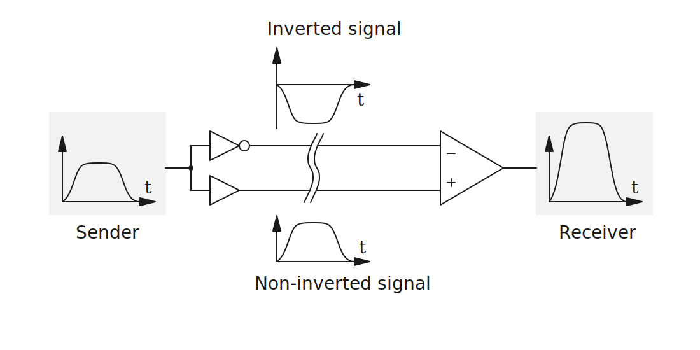

---

## Beispiel: Universal Serial Bus (USB  1.1 und 2.0) 


* Leitungen sind über Schirmung gegen Störungen abgesichert
* Zwei Drähte für Spannungspotentiale
* Zwei Drähte für Daten (Werte immer gegenläufig - half duplex)
* Kein Draht für Takt (spezielle [NRZ-S](https://de.wikipedia.org/wiki/Non_Return_to_Zero) Kodierung mit Bit Stuffing)
* $480 \text{ Baud}$
[Quelle](https://commons.wikimedia.org/wiki/File:USB_3.0_Kabel_und_Stecker.png)


---

#### 🤓 NRZ-S: Bitwechsel bei Null

Bei jeder `0` im Datenbit findet ein Wechsel statt
```
# Beispiel 1:	
Datenbits (logisch):	                  1 1 1 1 1 1 1 1
phys. Leitung bei Ausgangszustand „1“:	  1 1 1 1 1 1 1 1
phys. Leitung bei Ausgangszustand „0“:	  0 0 0 0 0 0 0 0
```

```
# Beispiel 2:	
Datenbits (logisch):	                  0 0 0 0 0 0 0 0
phys. Leitung bei Ausgangszustand „1“:	  0 1 0 1 0 1 0 1
phys. Leitung bei Ausgangszustand „0“:	  1 0 1 0 1 0 1 0
```

```
# Beispiel 3:	
Datenbits (logisch):	                1 1 1 1 1 0 1 0 1 0 1 1 0 0 0 1
phys. Leitung bei Ausgangszustand „1“:	1 1 1 1 1 0 0 1 1 0 0 0 1 0 1 1
phys. Leitung bei Ausgangszustand „0“:	0 0 0 0 0 1 1 0 0 1 1 1 0 1 0 0
```
---
marp: true
author: Julian Huber
size: 16:9
footer: Julian Huber - Bussysteme

# Strg+[ ] for Options

theme: beams

---

<!-- paginate: true -->


# 5.2 Buszugriffsverfahren


<!-- _class: title -->

---

<style>
img[alt~="center"] {
  display: block;
  margin: 0 auto;
}
</style>

<!-- paginate: true -->


### 🎯 Lernziele

Nach dieser Einheit sind Sie in der Lage dazu
* das Vorgehen von Client-Server, Token, Summenrahmenprokoll- und CS-MA- Buszugriffsverfahren zu beschreiben
* deren Vor- und Nachteile zu benennen
* Laufzeiten von Nachrichten auf Buskabeln zu berechnen


---


[Quelle](http://fmh-studios.de/theorie/informationstechnik/i2c-bus/#img1)

---

## Herausforderung

<!-- _class: white -->

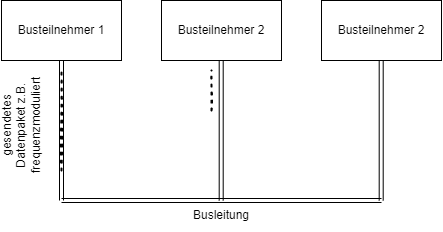

* Senden mehre Busteilnehmer zeitgleich, so überlagern sich die Spannungs-Pegel auf der Busleitung bzw. die Wellen
* Inhalt der Telegramme kann nicht mehr entziffert werden
* Im OSI-Modell Aufgabe der Sicherungs- und Vermittlungsschicht (Schicht 2&3)

---

## Client/Server (Master/Slave-Verfahren)

* Zentrale Bussteuereinheit (**Master**, ggf. SPS) stellt Verbindung zu den passiven Teilnehmern (Slaves) her (**Kommunikationssteuerung**)
* **Slaves** antworten auf eine Datenanforderung des Masters unmittelbar
* **Polling** (zyklische Abfrage)
  * Master mit aktivem Buszugriff geben die Ein-/Ausgabedaten an die Slaves
  * einfaches Protokoll
  * **garantierte Buszugriffszeiten** (d.h. es ist vorhersagbar, wie lange es dauert bis Information ausgetauscht werden kann)

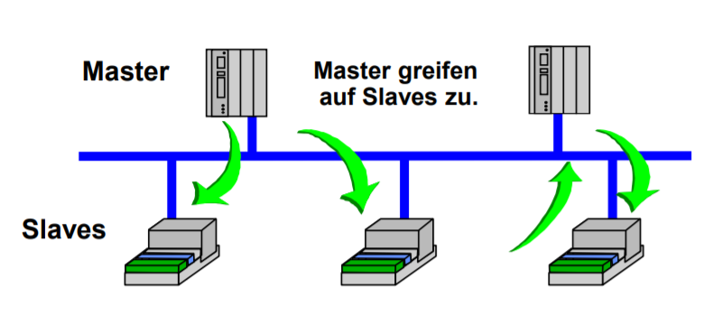


[Quelle](https://www.xplore-dna.net/pluginfile.php/623/mod_resource/content/2/Einf%C3%BChrung%20Feldbussysteme.pdf)

---

## ✍️ Aufgabe 5_2_1: Worst Case beim Polling

* Eine zentrale SPS fragt als Master zyklisch alle Werte von Sensoren auf einer Busleitung ab und sendet Befehle
* insgesamt 255 Slaves, davon 
  * 1 Taster Türöffner
  * 1 Motor Türöffner 
* Wie lange dauert es im schlimmsten Fall bis die Tür reagiert?

---

### Annahmen

* maximale Busleitungslänge: $200 \text{ m}$
* Telegrammlänge: $2$ Byte
  * `[Adresse].[Nachricht]`
* Zykluszeit des Masters und Slaves vernachlässigbar (Antworten unmittelbar)
* Baud-Rate $9.600 \text{ Baud}$ 
* [Manchester-Code](https://en.wikipedia.org/wiki/Manchester_code)
* Zykluszeit je Master + Slave: vernachlässigbar
* Signal-Laufzeit Fortpflanzung des Signals im Leiter mit Lichtgeschwindigkeit wird ebenfalls vernachlässigt

---

### ✔️ Lösung

* Abrufen eines Slaves:
  * Übertragungszeit (wie lange belegt das Signal die Leitung):
    * 1 Bit pro 2 Baud: $4.800 \frac{\text{ Bit}}{\text{s}}$
    * In eine Richtung: $\frac{16 \text{ Bit}}{4800 \text{ Bit}}\text{s}=3.3 \text{ ms}$
* Abrufen aller Salves ($\text{Bus-Zykluszeit}$):
  * Slaves antworten, nachdem Sie die Nachricht erhalten haben
  * Zeit pro Slave: $6.6\text{ ms}$
  * Wenn Befehl direkt weitergeleitet wird, aber die Teilnehmer logisch maximal auseinander: $6.6 \text{ ms} \cdot 254 = 1.68 \text{ s}$ 
* **Langsam, aber:** es ist garantiert, dass es nicht länger dauert (Echtzeitfähiges System)!

---

### Einfluss der Bus-Zykluszeit auf Komfort

Kopieren Sie den folgenden Code in: https://jsfiddle.net/

```JS
<!DOCTYPE html>
<html>
<head>
  <title>Toggle Background Color with Time Delay</title>
  <script>
    var color = "white";
    function changeBackground() {
      var time = document.getElementById("timeInput").value;
      setTimeout(function() {
        if (color === "white") {
          color = "red";
        } else {
          color = "white";
        }
        document.body.style.backgroundColor = color;
      }, time);
    }
  </script>
</head>
<body>
  <input type="text" id="timeInput" placeholder="Enter time in ms">
  <button onclick="changeBackground()">Change Background</button>
</body>
</html>
```

---

#### Wahrnehmbare Verzögerung ab $60 \text{ ms}$

- ab $60 \text{ ms}$ nehmen Nutzer:innen eine Verzögerung war
- Diese führt zu einem negativen Nutzererleben
- Häufig kann innerhalb dieser Zeit keine Rückmeldung der geschalteten Aktoren erfolgen


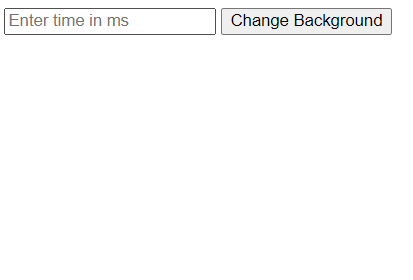


---

<!-- _class: white-->

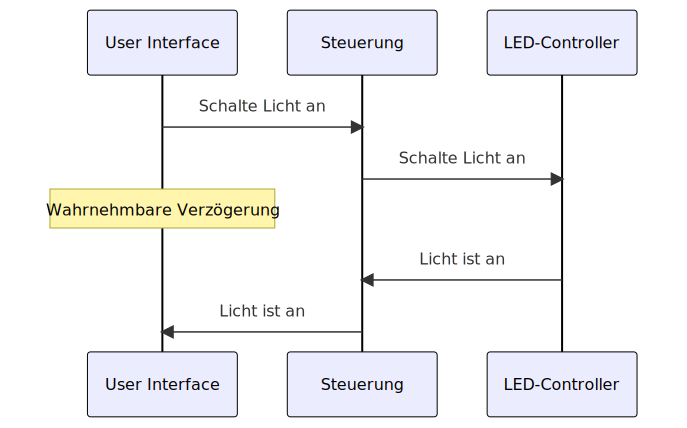

---

<!-- _class: white-->

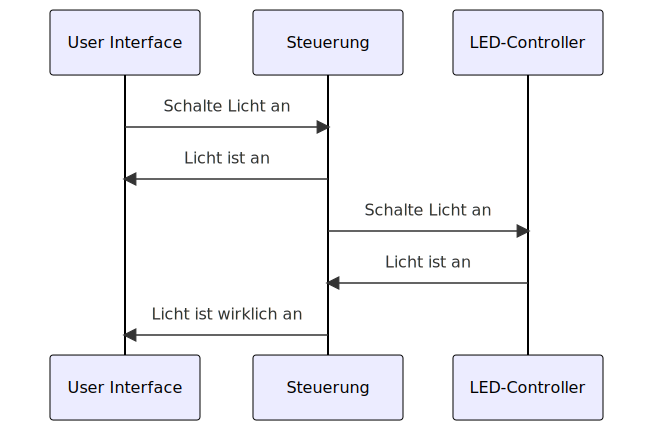


---

<!-- >
```
sequenceDiagram
    User Interface->>Steuerung: Schalte Licht an
    Steuerung->>LED-Controller: Schalte Licht an
    Note over User Interface: Wahrnehmbare Verzögerung
    LED-Controller->>Steuerung: Licht ist an
    Steuerung->>User Interface: Licht ist an
```

```
sequenceDiagram
    User Interface->>Steuerung: Schalte Licht an
    Steuerung->>User Interface: Licht ist an
    Steuerung->>LED-Controller: Schalte Licht an
    LED-Controller->>Steuerung: Licht ist an
    Steuerung->>User Interface: Licht ist wirklich an

```


---
-->


---

## 🎯 Aufgaben von Buszugriffsverfahren

Buszugriffsverfahren regeln, wie Teilnehmer auf ein gemeinsames Übertragungsmedium zugreifen. Ihre Hauptaufgaben sind:

1. **Vermeidung oder Handhabung von Kollisionen**: Sicherstellen, dass Datenübertragungen nicht durch gleichzeitiges Senden gestört werden.
2. **Echtzeitfähigkeit**: Garantieren, dass Daten innerhalb einer definierten Zeit übertragen werden (wichtig für zeitkritische Anwendungen).


---

### 🛡️ Vermeidung von Kollisionen

Kollisionen entstehen, wenn mehrere Teilnehmer gleichzeitig senden. Es gibt zwei Ansätze:

- **Deterministische Verfahren**: Verhindern Kollisionen durch festgelegte Zugriffsregeln (z. B. Polling, Token-Systeme).
- **Zufällige Verfahren**: Lassen Kollisionen zu, erkennen und beheben sie (z. B. CSMA/CD).


---

### ⏱️ Echtzeitfähigkeit

**Echtzeitfähigkeit** bedeutet, dass Daten innerhalb einer garantierten Zeitspanne übertragen werden. 

- **Deterministische Verfahren** (z. B. Polling, Token-Systeme):
  - Langsamer, aber maximale Übertragungszeit berechenbar.
  - Geeignet für zeitkritische Anwendungen (z. B. Steuerungssysteme).
- **Zufällige Verfahren** (z. B. CSMA/CD):
  - Keine garantierte maximale Zeit, da Kollisionen Verzögerungen verursachen.
  - Nicht echtzeitfähig.


---


**Vergleich**:
- Polling: Berechenbare, aber längere Übertragungszeiten.
- CSMA/CD (z.B. Ethernet): Schnell bei niedriger Auslastung, unzuverlässig bei hoher Auslastung.

[Quelle](Schnell & Wiedemann 2019)


---

### 🧠 Deterministische Buszugriffsverfahren

Deterministische Verfahren garantieren einen geregelten Zugriff auf den Bus. Beispiele:

1. **Master-Slave-Verfahren**: Ein Master steuert alle Slaves, keine Kollisionen.
2. **Polling**: Der Master fragt Slaves zyklisch ab (langsam, aber berechenbar).
3. **Token-Systeme**: Nur der Teilnehmer mit dem „Token“ darf senden.

- **Vorteile**:
  - Keine Kollisionen.
  - Garantierte Zugriffszeiten.
- **Nachteile**:
  - Oft langsamer als zufällige Verfahren.


---

### Token-Systeme

>Als Token, Zugstab, Signalstab, Streckenstab oder Knüppel bezeichnet man im Eisen- und Straßenbahnwesen ein Objekt, dessen **Besitz zum Befahren** eines eingleisigen Streckenabschnitts **berechtigt**.

- z.B. Innsbrucker Mittelgebirgsbahn

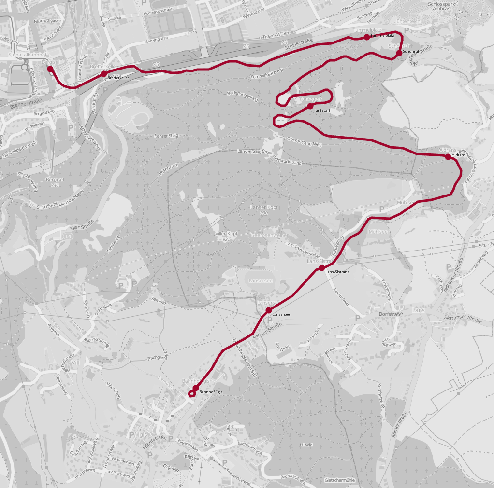

[Quelle](Wiki)

---


[Quelle](Wiki)

---

#### Token Ring (Logischer Ring)


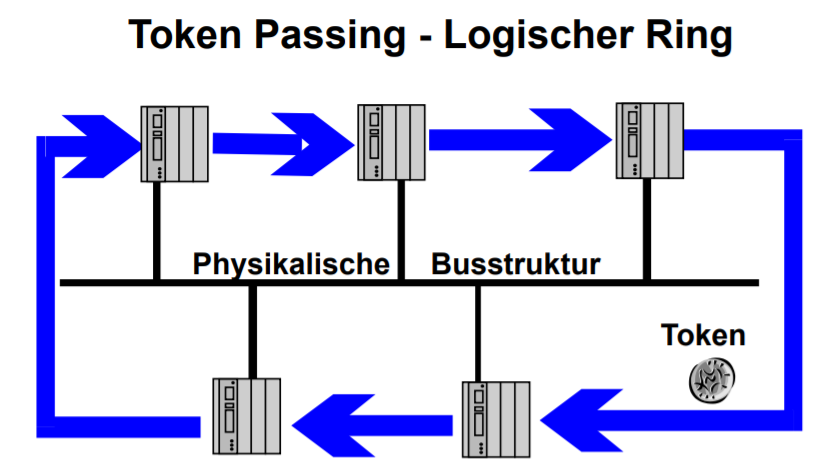

- Ermöglich**Multi-Master-Betrieb** 
- **Vorsicht:** Logischer Ablauf muss nicht der verbauten Topologie entsprechen

[Quelle](https://www.xplore-dna.net/pluginfile.php/623/mod_resource/content/2/Einf%C3%BChrung%20Feldbussysteme.pdf)

---

Ein **Token** ist ein digitales Berechtigungszeichen, das den Zugriff auf den Bus erlaubt. Nur der Teilnehmer mit dem Token darf senden.

**Funktionsweise**:
- Das Token wird zwischen Teilnehmern weitergegeben (logischer Ring).
- Nach einer festgelegten Zeit gibt der Sender das Token frei.
- Kombination mit Master-Slave möglich (Token-Passing).

**Vorteile**:
- Garantierte Zugriffszeiten.
- Einfache Umsetzung.

---


### 📡 Summenrahmenprotokoll

Beim **Summenrahmenprotokoll** sendet ein Master alle Daten in einem einzigen Rahmen an alle Slaves. Der Rahmen enthält Eingangs- und Ausgangsdaten für alle Teilnehmer.

**Vorteile**:
- Sehr effiziente Busauslastung.
- Garantierte Zugriffszeiten (deterministisch).
- Ideal für Echtzeitanwendungen.


[Quelle](https://www.xplore-dna.net/pluginfile.php/623/mod_resource/content/2/Einf%C3%BChrung%20Feldbussysteme.pdf)

---

#### Summenrahmenprotokoll Beispiel EtherCat


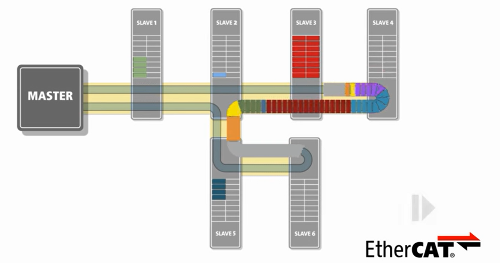


- Nutzt Ethernet-Hardware, aber mit Summenrahmenprotokoll.


[Quelle](https://www.youtube.com/watch?v=z2OagcHG-UU)


---


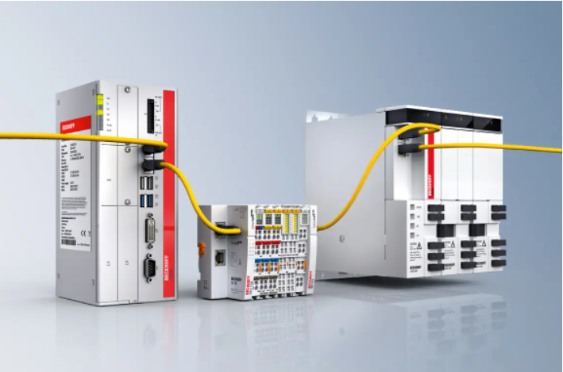


* Ein- und Ausgangsklemmen werden über Ethercat angesprochen
* Hardware wie Ethernet, jedoch mit Summenrahmenprotokoll

[Quelle](https://www.beckhoff.com/de-de/produkte/i-o/ethercat/)

---

### 🔄 Zusammenfassung deterministischer Verfahren

- **Merkmal**: Der Sender ist vor Sendebeginn eindeutig bestimmt.
- **Zuteilung**:
  - **Zentral**: Durch eine Leitstation (Master-Slave).
  - **Dezentral**: Durch mehrere Steuereinheiten (Token-Bus, Token-Ring).
- **Anwendung**: Sicherheitskritische Systeme, Echtzeitanwendungen.


[Quelle](Schnell & Wiedemann 2019)

---

#### Prioritäten bei Deterministischen Verfahren

- Manche Nachrichten haben höhere Priorität (z. B. Notfallmeldungen).
- **Umsetzung**:
  - **Prioritätsfelder**: Telegramme enthalten ein Feld, das die Priorität angibt (z. B. eine Brandmeldung).
  - **Polling**: Der Master fragt hochpriorisierte Geräte zuerst ab.
- **Token-Systeme**: Geräte mit höherer Priorität erhalten das Token schneller.

---

## 🎲 Zufällige Buszugriffsverfahren

Zufällige Verfahren erlauben Teilnehmern, bei Bedarf (z. B. Tasterbetätigung) auf den Bus zuzugreifen. Beispiele: CSMA/CD, CSMA/CA.

**Funktionsweise**:
- Teilnehmer prüfen, ob der Bus frei ist (**Carrier Sense**, CS).
- Bei Belegung wird der Zugriff verzögert (**Multiple Access**, MA).

**Nachteil**:
- Kollisionen möglich, keine garantierte Übertragungszeit (nicht echtzeitfähig).


---

### 🧠 Carrier Sense Multiple Access (CSMA)

**CSMA**:
- Teilnehmer prüfen, ob der Bus frei ist, bevor sie senden.
- Bei belegtem Bus wird der Zugriff auf einen späteren Zeitpunkt verschoben.
- Keine Garantie, dass der Bus beim nächsten Versuch frei ist.
- **CSMA/CD** (Collision Detection): Kollisionen werden erkannt und aufgelöst.
- **CSMA/CA** (Collision Avoidance): Kollisionen werden durch Prioritäten vermieden (Nachrichten mit Prio)

**Nachteil**: Keine Echtzeitfähigkeit.


---

#### 🧠 Bus-Kollision

* Zwei **Sender** beginnen etwa **gleichzeitig** mit der Sendung 
* Sendungen kollidieren und zerstören sich gegenseitig (**Überlagerung** der Wellen)
* Wird erkannt, wenn der Empfänger die übertragenen Daten auf Fehler überprüft (**Prüfsumme** vgl. Kapitel 5.3)
* Voraussetzung: Sender empfangen ihre eigenen Signale während der Sendung. 
* ist es zur Kollision gekommen und die Übertragung wird sofort eingestellt. (**Collision Detection**, CSMA/CD)


---

#### Kollisionserkennung 

* **a:** Sendebeginn zum Zeitpunkt $t$ , 
* **b:** Kollision zum Zeitpunkt $t+t_s$ 
mit $t_s$ Signallaufzeit, 
* **c:** Zustand zum Zeitpunkt $t + t_S + \Delta t$, 
* **d:** Zustand zum Zeitpunkt $t + 2 t_s$


---

##### Kollisionserkennung 

* der Sender $n$ erkennt die Kollision nach $t+t_s$
* Sender $1$ erst zum Zeitpunkt $t+ 2 t_s$. 
* Pakete die kürzer sind als $t + 2 t_s$ werden nicht immer durch die Kollisionserkennung erkannt


---

#### Auflösen einer Bus-Kollision

* Nach der Kollisionserkennung überträgt der Sender ein kurzes Störsignal (**jam**), mit dem er alle anderen Teilnehmer über die erkannte Kollision informiert (Broadcast). 
* Alle sende-willigen Teilnehmer stellen dann ihre Sendung für eine **zufällige Zeitdauer**, die einem ganzzahligen Vielfachen der maximalen doppelten Signallaufzeit entspricht, zurück und versuchen dann **erneut** den Zugriff.


[Quelle](Schnell & Wiedemann 2019)

---

####  Zeitverhalten

- Bei niedriger Busauslastung: Schnelle Übertragung.
- Bei hoher Busauslastung: Häufige Kollisionen, starke Verzögerungen.
- Beispiel: Ethernet (CSMA/CD) zeigt bei hoher Last unvorhersehbare Verzögerungen.


[Quelle](Schnell & Wiedemann 2019)

---

#### Prioritäten bei CSMA/CA

- Geräte mit höherer Priorität erhalten schnelleren Zugriff auf den Bus.
- **Umsetzung**:
  - **Prioritätsfelder**: Telegramme enthalten ein Feld, das die Priorität angibt (z. B. eine Brandmeldung).
  - **Arbitration**: Bei gleichzeitigem Zugriff entscheidet ein Schiedsverfahren, welches Gerät senden darf. Geräte mit höherer Priorität senden dominante Bits, andere warten.
  - **Kürzere Wartezeiten**: Hochpriorisierte Geräte versuchen früher erneut, auf den Bus zuzugreifen.

---

- **Beispiel: CAN-Bus**:
  - Jede Nachricht hat eine eindeutige ID, die die Priorität angibt (niedrigere ID = höhere Priorität).
  - Während der Arbitration gewinnt die Nachricht mit der niedrigsten ID, da sie dominante Bits (`0`) sendet, während andere Geräte mit recessiven Bits (`1`) zurücktreten.
  - Anwendung: In der Automobiltechnik haben Airbag-Signale Vorrang vor Komfortfunktionen.

---

## ✍️ Aufgabe 5_2_2: Buszugriffsverfahren für ein Brandmeldesystem

**Szenario**:
Ein Bussystem steuert ein Brandmeldesystem in einem Gebäude. Das System umfasst Rauchmelder, Alarme und Notbeleuchtung. Im Falle eines Brandes müssen die Rauchmelder sofort einen Alarm auslösen, und die Notbeleuchtung muss auf `leuchtend` geschaltet werden. Ein defekter Schalter sendet dauerhaft das Telegramm `0010001|0`, sobald er die Chance dazu hat, was andere Geräte blockieren könnte. Im Telegramm `0010001|0` steht das erste Bit für die Priorität (`1` = hoch, `0` = niedrig).


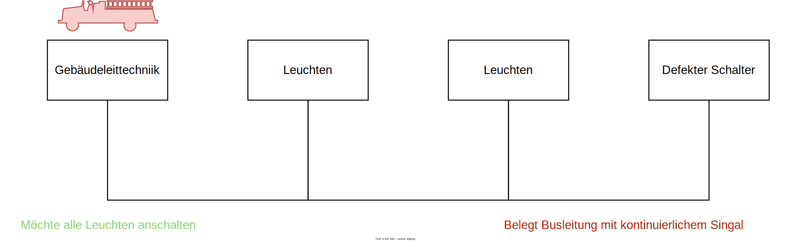

---

**Fragen**:

1. Welches Buszugriffsverfahren gewährleistet, dass Rauchmelder-Alarme Vorrang haben und trotz des defekten Geräts zuverlässig ausgelöst werden?

---

## ✔️ Lösung: Aufgabe 5_2_2

**Empfohlenes Verfahren**: **Master-Slave-Verfahren**
- **Deterministisch**: Der Master steuert alle Geräte (Slaves), wodurch Kollisionen verhindert werden.
- Das Prioritätsfeld wird in diesem Verfahren nicht benötigt, da der Master die Kontrolle hat.

---

- **Ablauf**:
1. Der Master fragt zyklisch alle Rauchmelder ab, erkennt einen Brand und sendet einen Befehl an Alarme und Notbeleuchtung (`leuchtend`).
Im besten Fall ist noch folgendes implementiert:
  1. Der defekte Schalter wird als fehlerhaft erkannt (z. B. durch unplausible Dauermeldungen).
  2. Der Master ignoriert den defekten Melder und priorisiert die Aktivierung der Alarme und Beleuchtung.

---

**Alternative**: **Token-System mit Prioritäten**
- Ein Token-System, bei dem Geräte mit Notfallmeldungen (z. B. Rauchmelder) das Token bevorzugt erhalten.
- **Vorteil**: Dezentraler Ansatz, geeignet für größere Systeme.
- **Nachteil**: Komplexere Implementierung als Master-Slave.

**Warum keine zufälligen Verfahren (z. B. CSMA/CD)?**:
- Der defekte Rauchmelder könnte den Bus durch dauerhaftes Senden blockieren, was zu unvorhersehbaren Verzögerungen führt.
- Kollisionen verhindern eine garantierte Übertragungszeit, was in einem Brandmeldesystem inakzeptabel ist.
- Evlt. CSMA/CA mit Prioritäten, aber auch hier besteht das Risiko, dass der defekte Melder den Bus blockiert oder zumindest verzögert.

**Beispiel aus der Praxis**:
- Systeme wie **KNX** oder **BACnet** verwenden deterministische Verfahren (z. B. Master-Slave oder Token-Passing), um sicherheitskritische Anwendungen wie Brandmeldungen zuverlässig zu steuern.

---

## 📚 Glossar

- **Echtzeitfähigkeit**: Garantie, dass Daten innerhalb einer definierten Zeit übertragen werden.
- **CSMA/CD**: Carrier Sense Multiple Access with Collision Detection – zufälliges Verfahren mit Kollisionserkennung.
- **Token-System**: Deterministisches Verfahren, bei dem ein Token die Sendeberechtigung vergibt.
- **Summenrahmenprotokoll**: Effiziente Datenübertragung durch einen Master in einem einzigen Rahmen.
- **Master-Slave**: Deterministisches Verfahren, bei dem ein Master die Slaves steuert.---
marp: true
author: Julian Huber
size: 16:9
footer: Julian Huber - Bussysteme

# Strg+[ ] for Options

theme: beams

---

<!-- paginate: true -->

# 5.3 Übertragungssicherheit

<!-- _class: title -->

---

## 🎯 Lernziele

Nach dieser Einheit können Sie:

- Verschiedene Fehlertypen bei der Datenübertragung unterscheiden.
- Maßnahmen zur Erkennung und Korrektur von Übertragungsfehlern erklären.
- Den Hamming-Abstand von Codes berechnen und dessen Bedeutung verstehen.

---

## 🧠 Aufbau von Datenpaketen


Datenpakete (auch „Telegramme“) enthalten Informationen, die über ein Bussystem übertragen werden. Der Aufbau variiert je nach System, umfasst jedoch typischerweise:

- **Steuerfeld**: Definiert die Priorität der Nachricht.
- **Quelladresse**: Identifiziert den Absender (ähnlich einer MAC-Adresse).
- **Zieladresse**: Gibt den Empfänger an.
- **Routing-Zähler**: Zählt, wie oft die Nachricht über Koppler weitergeleitet wurde.
- **Nutzinformation**: Die eigentlichen Daten, z. B. Messwerte eines Sensors.
- **Sicherungsfeld**: Prüft, ob die Daten korrekt übertragen wurden (z. B. Prüfsumme).


---

## 🛡️ Datensicherung

Daten können durch Störungen verloren gehen oder verfälscht werden. Beispiel:

```
Gesendet:    010000010000001110000000
Empfangen 1: 010000110000001110000000  (1 Bitfehler)
Empfangen 2: 01000010000001110000000   (2 Bitfehler)
```

---

## 🛡️ Datensicherung

### Ursachen für Fehler:
- Elektromagnetische Störungen.
- Probleme mit der Taktung.
- Defekte Hardware.

### Maßnahmen zur Datensicherung
- **OSI-Schicht 1 (Physikalische Schicht)**: Abgeschirmte Kabel, Glasfaserkabel oder potentialfreie Übertragung reduzieren Störungen.
- **OSI-Schicht 2 (Sicherungsschicht)**: Überwachung der Daten auf Fehler und Korrekturmaßnahmen.

---

## 🧠 Fehlerarten

Wir betrachten **bitorientierte Codes**, bei denen jede Bitkombination gültig ist. Fehler sind nicht direkt erkennbar, da keine Bitfolge „verboten“ ist. Es gibt drei Haupttypen von Fehlern:

- **Offensichtlicher Fehler**
- **Nicht erkennbarer Fehler**
- **Erkennbarer Fehler**


---

## 📏 Fehlermaße

Die **Bitfehlerrate** ($p$) gibt an, wie häufig Fehler auftreten:

$$p = \frac{\text{Anzahl fehlerhafter Bits}}{\text{Gesamtzahl gesendeter Bits}}$$

- **Ungünstigster Fall**: $p = 0.5$ (jedes zweite Bit ist fehlerhaft, Nachricht unbrauchbar).
- **Extremfall**: $p = 1$ (alle Bits invertiert, z. B. `001` → `110`).
- **Realistischer Wert**: $p = 10^{-4}$ (1 von 10.000 Bits ist fehlerhaft).

---

## 🔍 Fehlererkennung durch Codierung

Die Art der Codierung beeinflusst, ob Fehler erkannt werden können. Beispiel mit einem nicht-bitorientierten Code (Deutsche Sprache):

- **Offensichtlicher Fehler**: `Gxbäude` → erkennbar, korrigierbar zu `Gebäude`.
- **Nicht erkennbarer Fehler**: `Mein` → `Dein` (beides gültige Wörter).
- **Erkennbarer Fehler**: `Tein` → ungültiges Wort.

---

**Beispiel für einen einfachen binären Code**:
- `00`: Schalter **ein**
- `11`: Schalter **aus**
- `01`, `10`: Ungültig

Ein Ein-Bit-Fehler (z. B. `00` → `01`) führt zu einem ungültigen Codewort und ist erkennbar.


---

## 📏 Hamming-Abstand

Der **Hamming-Abstand** misst, wie viele Positionen sich zwischen zwei gleich langen Codewörtern unterscheiden. Der Hamming-Abstand eines Codes ist der **kleinste** Abstand zwischen zwei gültigen Codewörtern.

**Beispiele**:
- Code `{00, 11}`: Hamming-Abstand = 2.
- Code `{00, 01, 10, 11}`: Hamming-Abstand = 1.
- Code `{'Haus', 'Baum', 'Tier'}`: Hamming-Abstand = 2.

**Regel**: Ein Code mit Hamming-Abstand $h$ kann bis zu $h-1$ Bitfehler erkennen.

---

## 🛠️ Fehlererkennung mit Hamming-Abstand

**Beispiel-Code**: `{0001, 0110, 1000}`

- Kleinster Hamming-Abstand: 2 (z. B. `1000` und `0001` unterscheiden sich an 2 Positionen).
- **Fazit**: Der Code kann **1-Bit-Fehler** erkennen, da ein Fehler kein anderes gültiges Codewort erzeugt (z. B. `0001` → `0011` ist ungültig).
- **Problem**: Ein **2-Bit-Fehler** kann unbemerkt bleiben (z. B. `0001` → `1000`).

**Regel für Fehlerkorrektur**:
- Um $t$ Fehler zu korrigieren, muss der Hamming-Abstand mindestens $h=2 t + 1$ betragen.

---

## ✍️ Aufgabe 5_3_1: Drehschalter

Ein Drehschalter hat vier Einstellungen, die als binäre Codes übertragen werden: `00`, `01`, `10`, `11`. Der Hamming-Abstand beträgt 1, sodass ein Ein-Bit-Fehler ein anderes gültiges Codewort erzeugt (z. B. `00` → `01`).

**Aufgabe**: Entwickeln Sie einen binären Code mit Hamming-Abstand ≥ 3, der:
- Fehler erkennt **und** korrigiert.
- Nur Einfachfehler (max. 1 Bitfehler) berücksichtigt.

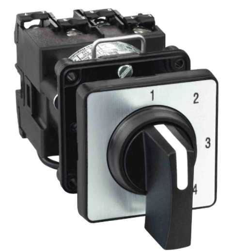

[Quelle](https://at.rs-online.com/web/p/nockenschalter/2212822)

---

## ✔️ Lösung: Drehschalter

Ein Code mit Hamming-Abstand ≥ 3 ermöglicht die Korrektur von Einfachfehlern. Beispielcode für vier Einstellungen:

- `11000000`: Stellung 1
- `00110000`: Stellung 2
- `00001100`: Stellung 3
- `00000011`: Stellung 4

**Hamming-Abstand**: Mindestens 3 (z. B. `11000000` und `00110000` unterscheiden sich an 3 Positionen).

**Fehlerkorrektur**:
- Empfangen: `10000000` → am nächsten zu `11000000` (1 Bit Unterschied) → korrigiert.
- Empfangen: `11100000` → am nächsten zu `11000000` (2 Bits Unterschied) → nicht korrigierbar.

---

## 🔢 Paritätsbit (Even-Bit) zur Fehlererkennung

Ein **Paritätsbit** wird hinzugefügt, um die Anzahl der `1`-Bits in einer Nachricht gerade (oder ungerade) zu machen. Beispiel:

- Gesendet: `0010` (2 in Binär, 1 `1`-Bit → ungerade).
- Paritätsbit (gerade Parität): `1` (macht die Gesamtzahl der `1`-Bits gerade).
- Übertragen: `00101`.

**Fehlererkennung**:
- Empfangen: `00111` → 3 `1`-Bits (ungerade) → Fehler erkannt.
- Empfangen: `10101` → 4 `1`-Bits (gerade) → kein Fehler erkannt (2-Bit-Fehler bleibt unbemerkt).

**Einschränkung**: Nur ungerade Anzahlen an Fehlern werden erkannt.


---

## 🧱 Blocksicherung

- Die Blocksicherung erweitert das Paritätsbit-Konzept auf eine Matrix aus Datenbits. Für jede Zeile und Spalte wird ein Paritätsbit berechnet.
- Anstelle nur nach allen X-Bits eine Paritätsbit einzufügen wird auch ein spaltenweises Paritätsbit (im Beispielsweise P als Even-Bit) eingefügt.


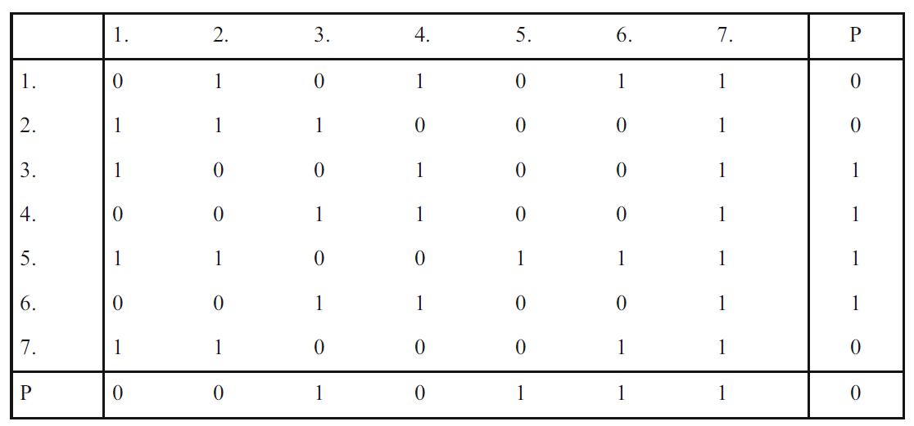


[Quelle](Gerhard Schnell & Bernhard Wiedemann )

---


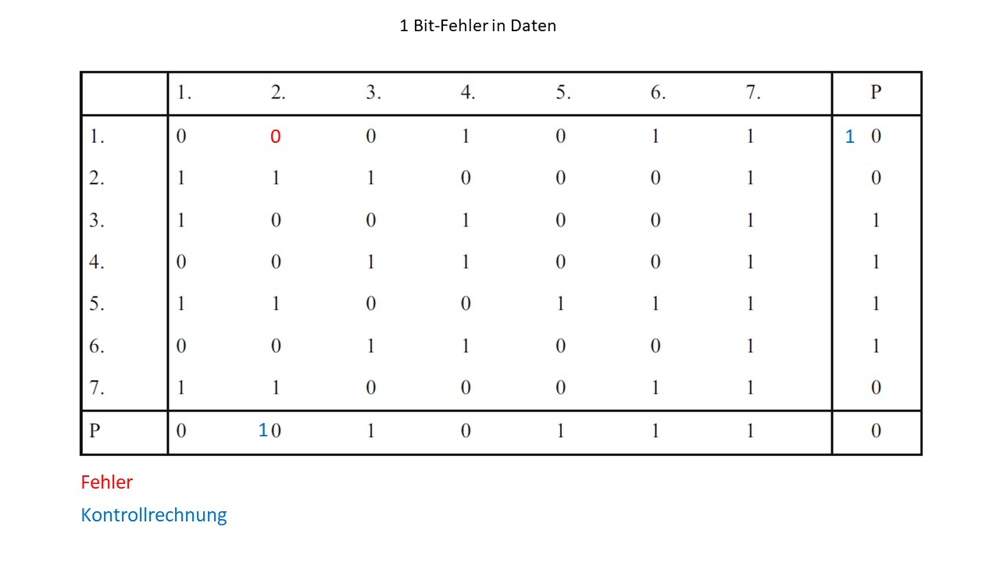

* Ein Ein-Bit-Fehler in der Matrix wird erkannt und kann korrigiert werden.

---

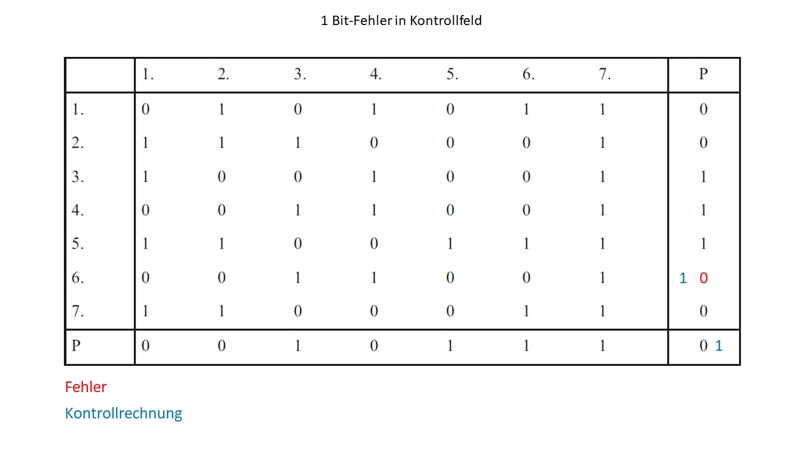

* Ein Ein-Bit-Fehler im Kontrollfeld wird erkannt und kann korrigiert werden.

---

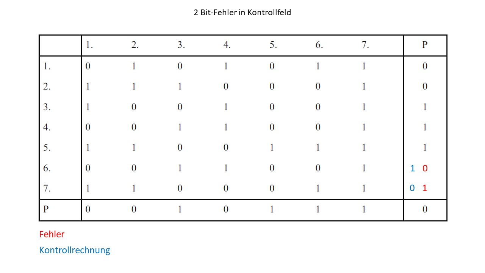

* Ein Zwei-Bit-Fehler im Kontrollfeld wird erkannt, aber nicht korrigiert.


---

## 📚 Glossar

- **Bitfehlerrate**: Anteil fehlerhafter Bits an allen gesendeten Bits.
- **Hamming-Abstand**: Anzahl der Positionen, an denen sich zwei Codewörter unterscheiden.
- **Paritätsbit bzw. Even-Bit**: Zusätzliches Bit, das die Anzahl der `1`-Bits in einer Nachricht gerade oder ungerade macht.
- **Blocksicherung**: Methode zur Fehlererkennung und -korrektur durch Hinzufügen von Paritätsbits für Zeilen und Spalten eines Datenblocks.

---

## 📽️ Weiterführende Ressource

[▶️ 3Blue1Brown: A discovery-oriented introduction to error correction code](https://www.youtube.com/watch?v=X8jsijhllIA)---
marp: true
author: Julian Huber
size: 16:9
footer: Julian Huber - Bussysteme

# Strg+[ ] for Options

theme: beams

---

<!-- paginate: true -->


# 5.4 Bussysteme in der Gebäudeautomation


<!-- _class: title -->

<style>
img[alt~="center"] {
  display: block;
  margin: 0 auto;
}
</style>


---

## Digital Addressable Lighting Interface (DALI) 


### 🎯 Lernziele

Nach dieser Einheit sind Sie in der Lage dazu
- Komponenten zum Aufbau eines DALI-Systems auswählen
- die Grundlagen von Szenen und Gruppensteuerung beschreiben
- geeigneten Leitungsdurchmesser/Länge einer DALI-Installation bestimmen


---

### DALI Grund-Komponenten

* **Stromversorgung** (DALI PS1) - Alternativ über Klemme oder Netzteil
* **Steuerkontroller** (links): Mikrocontoller mit Buszugriff mit Tastern oder anderen Schnittstellen verbunden
* **LED oder Leuchten-Treiber** (rechts): Mikrocontoller und Versorger der Leuchtmittel mit Energie
* DALI-USB: Schnittstelle zur Programmierung ggf. ersetzt durch SPS zur Steuerung des Bussystems


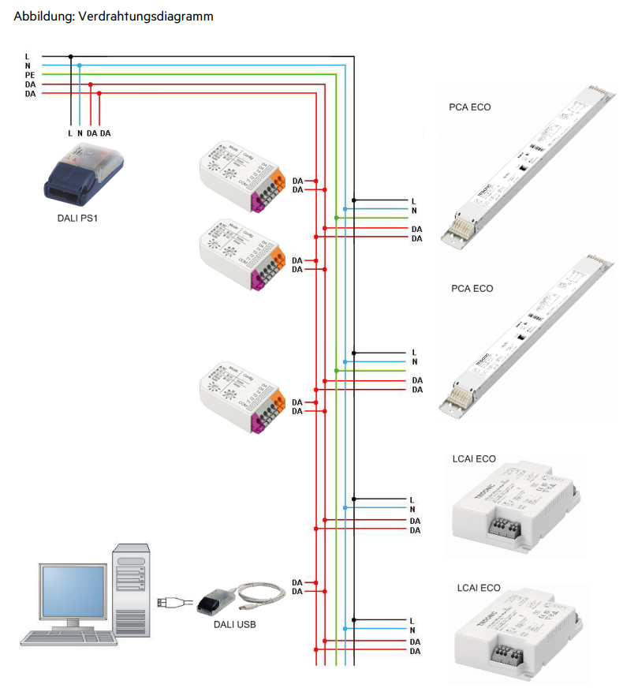

[Quelle](https://www.tridonic.com/com/de/download/technical/DALI-Handbuch_de.pdf)

---

* **Protokoll** für **lichttechnische** Betriebsgeräte
* **kein gesamtheitliches Bussystem** für Gebäudesystemtechnik
* **dezentrales** Lichtmanagement für max. 64 Teilnehmer
(Betriebsgeräte) mit frei definierbaren 16 **Gruppen** und 16 **Szenen**
* über Gateways auch in die Gebäudesystemtechnik 
  (KNX, BACnet, etc,) integrierbar


---

### Gruppen

- Mehrere Leuchtmittel werden zusammengefasst und können über eine gemeinsame Gruppen-Adresse angesprochen

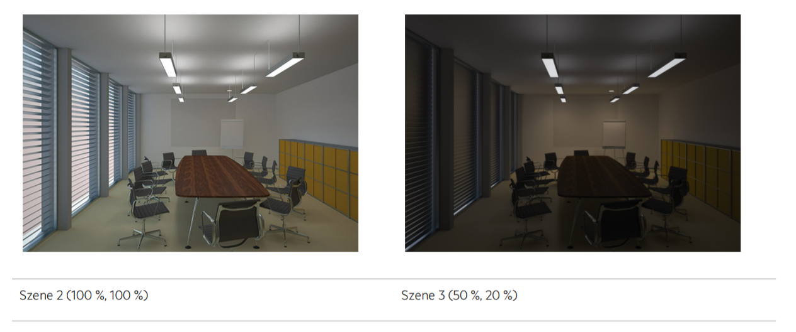

[Quelle](https://www.tridonic.com/com/de/download/technical/DALI-Handbuch_de.pdf)

---

### Szenen

- Vordefinierte Einstellungen für verschiedene Gruppen und Leuchtmittel für bestimmte Situationen


[Quelle](https://www.tridonic.com/com/de/download/technical/DALI-Handbuch_de.pdf)


----

### Technische Grundlagen

* Separates Kabel mit zwei Signaleitern und Spannungsversorgung
* Spannung der Busleitung $9,5 - 22,4 \text{ V}$
* Systemstrom max. $250 \text{ mA}$ 
(zur Versorgung keiner Betriebsgeräte z.B. Steuergeräte für Schalter)
* Datenübertragungsgeschwindigkeit $1200 \text{ Baud}$
* Maximale einfache Leitungslänge $300 \text{ m}$ (bei $1.5 \text{ mm²}$)


---

### Aufbau


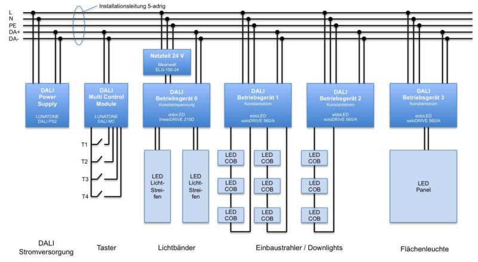


[Quelle](https://www.ledclusive.de/blog/anleitung-zur-dali-installation-im-privathaus-fuer-jedermann/)

---

### Merkmale von DALI

- Installation: 
  - **Versorgungs- und Steueradern** können zusammen **im selben Kabel** verlegt werden. 
  - Die **Verdrahtung** kann in Reihe, sternförmig oder in einer **gemischten Form** erfolgen.
  - Keine Polarität: Die Polarität (DA+/DA-) der DALI-Steuerleitung muss nicht beachtet werden
- **Verteilte Intelligenz**:
  - Jeder Controller arbeitet als "Master" und kontrolliert dabei die Kommunikation auf (**Multi-Master**) der Steuerleitung.
  - Gewisse **Parameter** sind dabei direkt **im DALI-Betriebsgerät** abgelegt (z.B. Szenenwerte, Gruppenadresse).


[Quelle](https://www.tridonic.com/com/de/download/technical/DALI-Handbuch_de.pdf)

---

### Technische Hintergründe


* Kodierung:  
  * [Differentieller Manchester-Code](https://de.wikipedia.org/wiki/Differentieller_Manchester-Code)
  * High Pegel (idle): $9.5  \text{ bis } 22.5 \text{ V}$
  * Low Pegel: $-6.5  \text{ bis } 6.5 \text{ V}$
* Buszugriff:   
  * Multi-Master
  * CS/MA - CA
  * Echtzeitfähig?
    * nein


[Quelle](https://infosys.beckhoff.com/index.php?content=../content/1031/tcplclib_tc3_dali/12346807435.html&id=5821349906969406832)


---

### Telegramm-Format


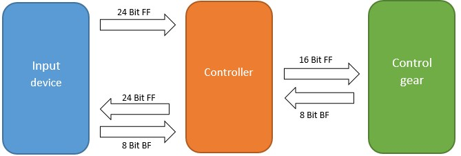


* FF: Forward Frame eines Masters
* BF: Backward Frame Antwort eines Slaves
* 16-und-24-Bit-Telegramme: Geräte zu konfigurieren, 
Parameter abzufragen oder Steuerbefehle oder Ereignisse
[Quelle](https://infosys.beckhoff.com/index.php?content=../content/1031/tcplclib_tc3_dali/12346807435.html&id=5821349906969406832)

---


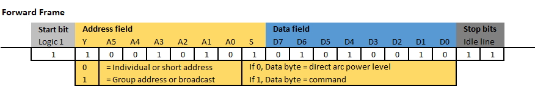


[Quelle](https://www.picotech.com/library/oscilloscopes/dali-serial-protocol-decoding)

---


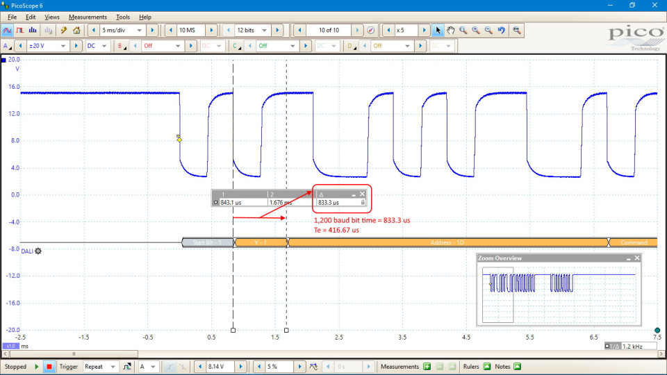


* `1-1-01110...`

[Quelle](https://www.picotech.com/library/oscilloscopes/dali-serial-protocol-decoding)


---

#### Stromversorgung

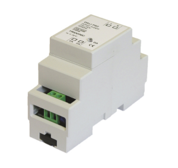

- Versorgt den gesamten DALI-DALI-Kreis mit **$24 \text{ V}$ Gleichstrom**
- z.B. Leuchtmittel $>5 \text{ W}$, Steuercontroller

---

#### Steuermodule

- Bieten **Eingänge für Taster** (Lichtschalter)
- Können **Logik** für die Steuerung basierend auf den Eingaben ausführen

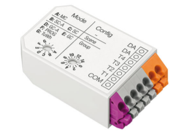

---

#### Betriebsarten von Steuermodulen


| Betriebsart |                                                                                    Beschreibung                                                                                    |
|:-----------:|:----------------------------------------------------------------------------------------------------------------------------------------------------------------------------------:|
| MC          | Einfachtaster und/oder Doppeltaster und/oder Schalter                                                                                                                              |
| SC-A        | Einfachtaster für Szenenaufruf                                                                             
| GC-A        | Einfachtaster und/oder Doppeltaster für Leuchtengruppen ein/aus/gedimmt                                                    |
| TuWh        | Doppeltaster für Intensität und Farbtemperatur von "Tunable White"                                                               |


[Quelle]([Handbuch](https://www.tridonic.com/com/de/download/technical/Manual_DALI_XC_de.pdf))


---

#### Touchpanele

- Ermöglichen **komplexere Eingaben** als einfache Taster
- **Ausgaben** möglich: z.B. aktuelle Szene mit mit Licht hinterlegen

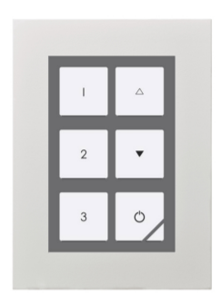


---

#### Sensoren

- Erfassen Umweltparameter, wie **Helligkeit und Bewegungen**

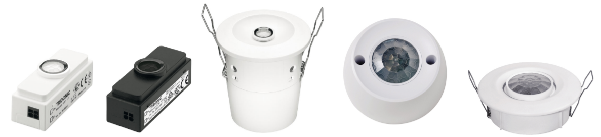


---

#### Betriebsgeräte

- Steuerung und/oder **Stromversorgung** von Leuchtmitteln (z.B. LEDs)
- Teilweise Transformatoren und Gleichrichter für $230 \text{ V | AC}$
- Mehrere Betriebsgeräte können zu **einer Gruppe zusammengefasst** werden


---


### Technischer Rahmen einer Installation

* Max. 64 DALI-Betriebsgeräte ($2^6$ Adressen)
* Max. 16 DALI-Gruppen  ($2^4$ Adressen)
* Max. 16 DALI-Szenen ($2^4$ Adressen)
* **Maximaler Strom** der Stromversorgung (DALI PS1: $200 \text{ mA}$ bzw. DALI PS2 $240 \text{ mA}$).
* Max. Leitungslänge aus **Spannungsabfall** ($2 \text{ V}$ d.h. $300 \text{ m}$ bei $1,5 \text{ mm²}$)

---

#### Stromaufnahme berechnen


- Ist die Stromversorgung stark genug für alle Betriebsmittel?
- Hierbei sind nur die Controller gemeint, die durch die DALI-Leitung versorgt werden

[Quelle](https://www.tridonic.com/com/de/download/technical/DALI-Handbuch_de.pdf)


<!--

---


##### 1. Stromaufnahme abschätzen

- Jedes Gerät im DALI-Kreis nimmt über den DALI-Kreis Strom auf (parallel)
- Die Stromaufnahme der Steuer- und Betriebsgeräte aus Datenblatt (ca. $2 \text{ mA}$).
- maximalen Strom der Stromversorgung z.B. DALI PS1 ($200 \text{ mA}$)

- Beispiel: DALI-Kreis mit 24 dimmbaren LED Treibern (LCA), 6 DALI XC
  - Gesamtstrom = Summe Stromaufnahme DALI Betriebsgeräte + Summe Stromaufnahme DALI Steuergeräte
  - Gesamtstrom = 24 x Vorschaltgeräte + 6 x DALI XC
  - Gesamtstrom = $24 x 2 \text{ mA} + 6 x 6 \text{ mA} = 84 \text{ mA}$

---

##### 2. Maximale Kabellänge berechnen

- Spannungsabfall durch Kabel darf $2 \text{ V}$ nicht überschreiten
- Berechnung des Spannungsabfalls:
  $U_v = R I =  \frac{2 \cdot l }{\gamma \cdot S}\cdot I$

  $U_v$ Spannungsabfall in V
  $I$ Strom in A
  $S$ Querschnitt in $mm^2$
  $l$ Leitungslänge in m
  $\gamma$ Elektrische Leitfähigkeit in $\frac{m}{\Omega \cdot mm }$,   bei Kupferleitungen:  $56\frac{m}{\Omega \cdot mm }$

---

- Beispiel: DALI-Kreis mit einer Leitungslänge von $300 m$ und einem Drahtquerschnitt von $1.5 mm^2$ und maximalem Strom von 250 mA

  $U_v = \frac{2 \cdot l \cdot I}{\gamma \cdot S} = \frac{2 \cdot 300 m \cdot 0.25 A}{56 \frac{m}{\Omega mm^2} \cdot 1.5 mm^2} = 1.786 V$

* Spannungsabfall über Kabel ist kleiner als $2V$

---

### Verdrahtung


- handelsübliches Installationsmaterial
- 2 Adern für DALI-Steuerkreis 

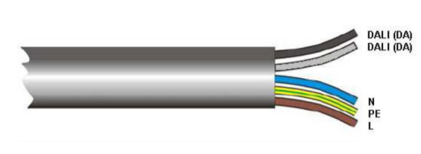

[Quelle](https://www.tridonic.com/com/de/download/technical/DALI-Handbuch_de.pdf)


---

#### Anschluss

- auf Polarität der DALI-Leitung muss nicht beachtet werden 
-  DALI-Signal ist **nicht SELV**. Es gelten die Installationsvorschriften für Niederspannung.


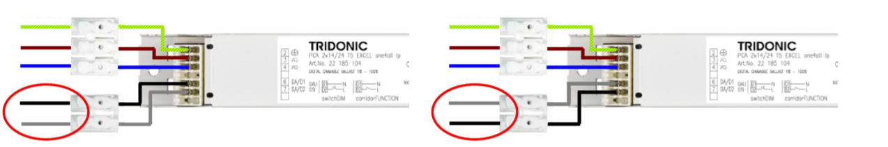

[Quelle](https://www.tridonic.com/com/de/download/technical/DALI-Handbuch_de.pdf)

- **Safety Extra Low Voltage**= Sicherheitskleinspannung) bezeichnet Spannungen, die aufgrund ihrer geringen Spannungshöhe und Isolierung besonderen Schutz gegen elektrischen Schlag bieten


---

### Konfiguration

* Bussysteme werden in der Regel nicht programmiert, sondern anhand von bestehenden Bausteinen einer SPS oder hersteller-spezifischer Software konfiguriert
* Jedem Gerät werden bestimmte Eigenschaftswerte zugewiesen
* Steuer-Controller:
  * Für welche Funktion ist der Schalter zuständig (Szenen, Gruppen, Dimmen)
  * Für welche Leuchtmittel und Gruppen ist der Schalter genau zuständig
* LED-Controller:
  * Zuordnung zu Szenen und Gruppen
  * Zuordnung von Leuchtwerten

-->

---

#### Software-seitige Konfiguration


Je nach Bussystem stellen verschiedene Anbieter, verschiedene Softwarelösungen bereit. 

---

##### Individualadressen und Gruppen

- jeder **DALI Teilnehmer** hat eine (von 64) **Individualadressen** 
- Mit der Individualadresse kann jedes einzelne Betriebsgerät identifiziert und angesteuert werden. 
- **Mehrkanaligen Betriebsgeräten** sind ggf. mehrere Adressen zuzuordnen (z.B. **Dimmen + Farbe** oder **Warm- + Kaltweiß**)
- Zusätzlich zu den Individualadressen bis zu **16 Gruppenadressen**

---

##### Szenen

- bis zu 16 Lichtszenen (Einstellung verschiedener Beleuchtungssituationen)
- **jedem Vorschaltgerät** kann ein **individueller Lichtwert je Szene** hinterlegt werden
- Lichtszenen **unabhängig von der Gruppenzuordnung**

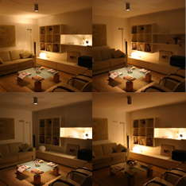

[Quelle](https://www.light11.de/lightmag/lichtsteuerung/)

---


##### Farbsteuerung

- Mögliche Farbkanäle
  - RGB: **Drei Kanäle** für rote, grüne und blaue LEDs 
  - RGBW: RGB + weißen Lichtquelle (4)
  - RGBWW:  Weiß-Weiß (tunable white) für die Wärme-Steuerung des weißen Lichts (2)

- Ansteuerung:
  - DT6: Jeder **Farbkanal** hat eine **eigene DALI-Adresse**. Statt 64 können bei RGBW nur nuch 16 Leuchtmittel gesteuert werden
  - DT8: Nur eine Adresse pro Gerät


---


###  Anwendungsbeispiel Besprechungszimmer

> Besprechungszimmer für ca. 10 Personen

- 6 LED **Langfeldleuchten** und 2 LED **Downlights**.
- **je eine Gruppe** für Langfeldleuchten und Downlights
- Bedienung
  - an Tür: DALI XC (SC Modus) mit den **Szenen** „**Beleuchtung ein**" und „**Beleuchtung aus**"
  - an Fensterfront 2 DALI XC (SC und GC): Aufrufen von **vier Szenen** und das individuelle **Dimmen der beiden Leuchtengruppen**.


[Quelle](https://www.tridonic.com/com/de/download/technical/DALI-Handbuch_de.pdf)

---

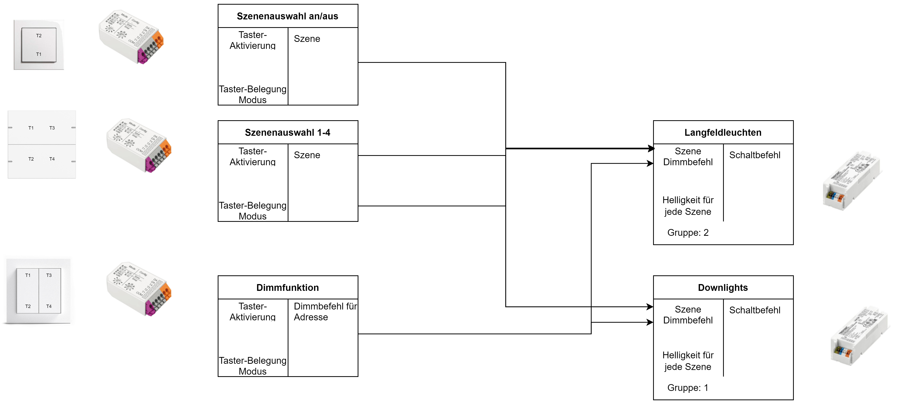

<!--

---

#### Stückliste

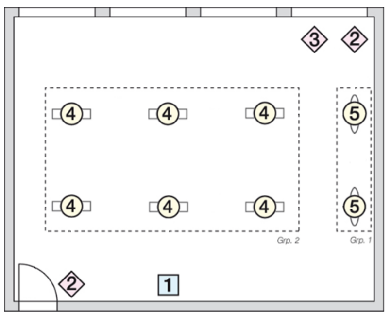


| Pos.  | Stück  | Artikelbezeichnung| 
| - |- |- |
|1| 1| DALI Stromversorgung DALI PS1 / DALI PS2|
|2| 2 |DALI XC in SC Modus (Szenenkontroller) DALI XC|
|3| 1 |DALI XC in GC Modus (Gruppenkontroller) DALI XC|
|4| 6 |DALI LED Betriegsgerät für Langfeldleuchte LCAI one4all|
|5| 2 |DALI LED Betriebsgerät für LED Downlights LCAI one4all|

[Quelle](https://www.tridonic.com/com/de/download/technical/DALI-Handbuch_de.pdf)


---

#### Checkliste

| DALI Bedingung  | Im Objekt geplant / vorhanden | OK? |
| - |- |- |
|Max. 64 DALI Betriebsgeräte | 8 DALI Betriebsgeräte | |
| Max. 16 Gruppen| 2 Gruppen |
| Max. 16 Szenen | 4 Szenen |
|Strom DALI-Kreis < Nennstrom Power Supply | 34 mA | |
|Leitungslänge < 300 m (bei 1,5mm²) | ca. 20m | |
5 Adern zu jeder Leuchte  | 5 x 1,5mm² | 
|DALI LED Betriebsgerät in Leuchte |Tridonic LCAI one4all | |

[Quelle](https://www.tridonic.com/com/de/download/technical/DALI-Handbuch_de.pdf)

---

#### Gruppierung

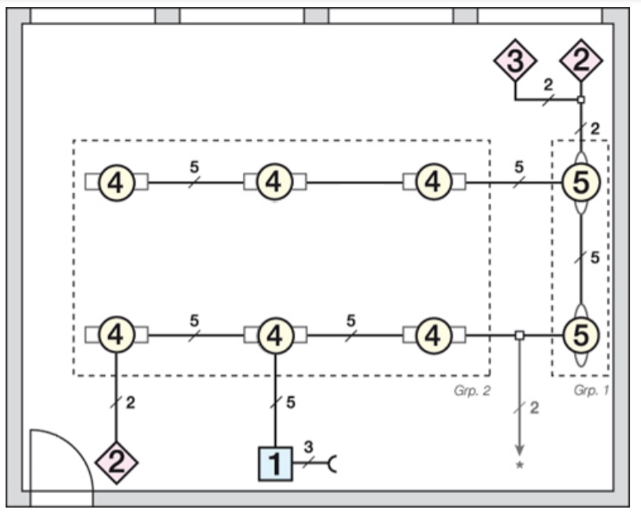


| Komponente | Zuordnung |
| - |- |
|Downlights  |Gruppe 1 |
| Langfeldleuchten | Gruppe 2 |

- an Fensterfront DALI XC (GC):
  - individuelle **Dimmen der beiden Leuchtengruppen**.
  - 4 Taster, je zwei für jede Gruppe

[Quelle](https://www.tridonic.com/com/de/download/technical/DALI-Handbuch_de.pdf)

---


#### Szenenzuordnung

- an Tür: DALI XC (SC Modus) mit den **Szenen** „**Beleuchtung ein**" und „**Beleuchtung aus**"
- an Fensterfront 1 DALI XC (SC): 
  - Aufrufen von **vier Szenen** 
  - individuelle **Dimmen der beiden Leuchtengruppen**.

| | Bedienstelle Tür  | Bedienstelle Leinwand |G1 | G2  |
|- |- |-| - | - |
| Szene 1 |  Licht aus | Licht aus | 0 % | 0% |
| Szene 2 |  Licht 100 % | Licht 100 %  | 100% | 100% |
| Szene 3 |  nicht verdrahtet  | Präsentation | 50% | 20 %|
| Szene 4 |  nicht verdrahtet  | Besprechung | 0% | 100% |

[Quelle](https://www.tridonic.com/com/de/download/technical/DALI-Handbuch_de.pdf)

---


#### Inbetriebnahme

- Die Programmierung kann auf zwei Arten erfolgen
  - **Schalter im Programmiermodus**
  - **PC-Anbindung** mit Software

[Quelle](https://www.tridonic.com/com/de/download/technical/DALI-Handbuch_de.pdf)
---

#### Ergebnis


[Quelle](https://www.tridonic.com/com/de/download/technical/DALI-Handbuch_de.pdf)

---

#### DALI 2

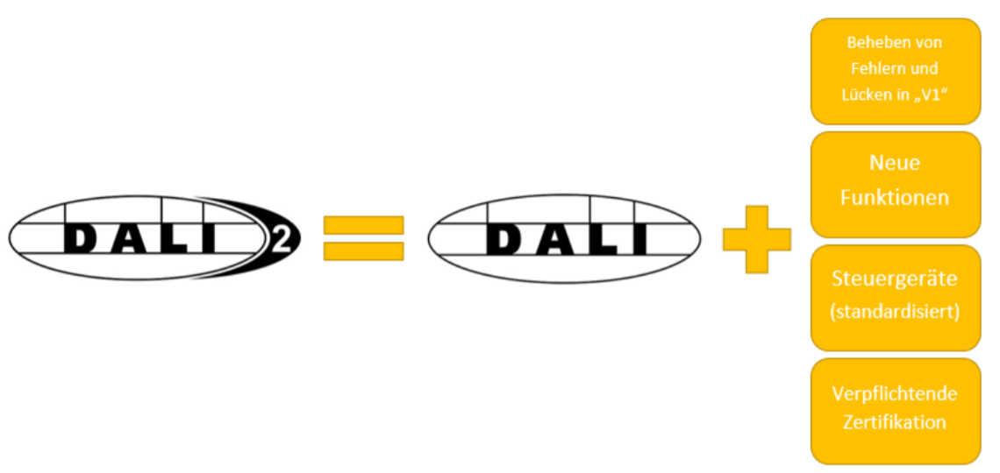

- abwärtskompatibel
- Input Devices (Sensoren) kommunizieren nicht mehr direkt mit DALI-Treibern an Leuchtmitteln
- Application controller verarbeiten zuerst (Multimaster Prinzip)
- Kollisions-Erkennung

-->

---


## Ausfallsicherheit

* da Bussysteme aus mehreren Komponenten bestehen, wird das Fehlermanagement komplexer
* Single-Point-of-Failure: Ein Teil des Systems, dessen Ausfall zum Totalversagen führen kann
* Neben redundanter Auslegung kann eine Fehler-Analyse helfen resiliente Systeme zu entwerfen


---


### Einfluss-Analyse

* *was-wäre-wenn*?
* Für jede Komponente wird untersucht: was passiert, wenn diese Komponente ausfällt
* Was wäre der gewünschte Zustand des Systems? (i.d.R. festgelegt durch die Aktoren)

---

#### Beispiel: Beleuchtung in Treppenhäusern

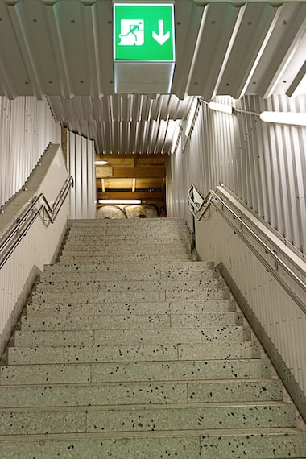

- Licht sollte nicht ohne Bedarf brennen
- Licht kann über Taster, Bewegungsmelder oder GLT aktiviert werden
- In der GLT kann der Systemzustand überwacht werden
- im Falle eines Notfalls muss das Licht in jedem Fall brennen

---


<!-- _class: white -->

---

#### Buskomponenten 


| Komponente \ Aktoren | 1 Beleuchtung Notausgang | 2 Anzeige Gebäudeleittechnik | Wie wird 1 erreicht? | Wie wird 2 erreicht? |
|---|---|---|---|---|
| LED | AN | Defekte Lampe wird angezeigt | |  |
| Vorschaltgerät | AN | Defektes Vorschaltgerät wird angezeigt |  | |
| Stromversorgung | AN | Ausfall wird angezeigt |  | |
| Busleitung | AN | Störung wird angezeigt |  | |

---

| Komponente \ Aktoren | 1 Beleuchtung Notausgang | 2 Anzeige Gebäudeleittechnik | Wie wird 1 erreicht? | Wie wird 2 erreicht? |
|---|---|---|---|---|
| Steuercontroller | AN | Defekter Steuercontroller wird angezeigt |  | |
| Taster | AN | Defekter Taster wird angezeigt |  | |
| Bewegungsmelder | AN | Defekter Taster wird angezeigt |  | |

---


| Komponente \ Aktoren | 1 Beleuchtung Notausgang | 2 Anzeige Gebäudeleittechnik | Wie wird 1 erreicht? | Wie wird 2 erreicht? |
|---|---|---|---|---|
| LED | AN | Defekte Lampe wird angezeigt | |  |

* 1: Nur durch Redundanz möglich
* 2: Das Vorschaltgerät muss in der Lage sein den Ausfall der LED zu erkennen und an die GLT übermitteln

---

| Komponente \ Aktoren | 1 Beleuchtung Notausgang | 2 Anzeige Gebäudeleittechnik | Wie wird 1 erreicht? | Wie wird 2 erreicht? |
|---|---|---|---|---|
| Vorschaltgerät | AN | Defektes Vorschaltgerät wird angezeigt |  | |

* 1: i.d.R. Nicht möglich
* 2: Regelmäßiges ansprechen des Vorschaltgerät durch GLT. Meldung bei nicht erreichen


---

| Komponente \ Aktoren | 1 Beleuchtung Notausgang | 2 Anzeige Gebäudeleittechnik | Wie wird 1 erreicht? | Wie wird 2 erreicht? |
|---|---|---|---|---|
| Stromversorgung | AN | Ausfall wird angezeigt |  | |
* 1: i.d.R. Nicht möglich
* 2: Regelmäßiges Ansprechen des Vorschaltgerät durch GLT. Meldung bei nicht erreichen

---

| Komponente \ Aktoren | 1 Beleuchtung Notausgang | 2 Anzeige Gebäudeleittechnik | Wie wird 1 erreicht? | Wie wird 2 erreicht? |
|---|---|---|---|---|
| Busleitung | AN | Störung wird angezeigt |  | |


* 1: Bei Fehlersignal auf Busleitung schaltet das Vorschaltgerät an
* 2: Regelmäßiges Ansprechen des Gateways durch GLT. Meldung bei Problemen


---

| Komponente \ Aktoren | 1 Beleuchtung Notausgang | 2 Anzeige Gebäudeleittechnik | Wie wird 1 erreicht? | Wie wird 2 erreicht? |
|---|---|---|---|---|
| Steuercontroller | AN | Defekter Steuercontroller wird angezeigt |  | |

* 1: Bei Ausbleiben eines Steuerbefehls an Vorschaltgerät für länger als konfigurierte Zeit wird dies als Befehl zum Anschalten interpretiert 
* 2: Regelmäßiges Ansprechen des Steuercontrollers durch GLT. Meldung bei nicht erreichen


---

| Komponente \ Aktoren | 1 Beleuchtung Notausgang | 2 Anzeige Gebäudeleittechnik | Wie wird 1 erreicht? | Wie wird 2 erreicht? |
|---|---|---|---|---|
| Bewegungsmelder / Taster | AN | Vermuteter Defekt wird angezeigt |  | |

* 1: Bei Ausbleiben eines Steuerbefehls an Vorschaltgerät für länger als konfigurierte Zeit wird dies als Befehl zum Anschalten interpretiert 
* 2: Bei längerem Ausbleiben eines Steuerbefehls der Steuercontroller wird eine Warnung angezeigt


---

## Rechercheaufgabe: Gebäudebussysteme und ihre Anwendungsfälle

Jeder recherchiert ein spezifisches Gebäudebussystem und beschreibt einen praxisnahen Anwendungsfall, um ein tiefgehendes Verständnis für die Funktionsweise und Einsatzmöglichkeiten von Bussystemen in der Gebäudeautomation zu entwickeln.

--- 

### Aufgabenbeschreibung

- Wählen Sie eines der folgenden Gebäudebussysteme aus: KNX, BACnet, Modbus, M-Bus, LON, LCN, SMI, DMX, ZigBee, EnOcean, Z-Wave, WirelessHART, WirelessKNX, Wireless M-Bus, LoRaWAN.
- Alternativ können Sie ein anderes Gebäudebussystem mit Rücksprache des Dozenten wählen.
- Jedes Bussystem darf nur von einem Studierenden bearbeitet werden.
- Recherche des Bussystems: Beschreiben Sie die folgenden Aspekte des gewählten Bussystems:

--- 

### Technische Grundlagen:

- Welche Übertragungsmedien (z. B. Twisted Pair, Funk, Ethernet, Funk) werden verwendet
- Welche Baudrate, Spannungslevel, Leitungscodes oder Codierungsverfahren auf Wellen sind typisch?

### Buszugriff und Kommunikation:

- Welches Buszugriffverfahren (z. B. Master/Slave, Multi-Master, CSMA/CA) wird genutzt?
- Wie ist der Telegrammaufbau strukturiert?

---

### Hauptanwendungsbereiche:

- In welchen Bereichen der Gebäudeautomation wird das System eingesetzt (z. B. Beleuchtung, Heizung, Zählerdaten)?

### Vorteile und Einschränkungen:

- Was sind die Stärken und Schwächen des Systems im  - Vergleich zu anderen Bussystemen?
- Nutzen Sie mindestens drei verlässliche Quellen (z. B. Herstellerseiten, Fachliteratur, wissenschaftliche Artikel). Geben Sie alle Quellen in einer Literaturliste an.

---

### Beschreibung eines Anwendungsfalls:

- Entwickeln Sie einen konkreten, praxisnahen Anwendungsfall für das gewählte Bussystem. Beispiele:
Steuerung der Beleuchtung in einem Bürogebäude (DALI).
- Überwachung der Raumtemperatur in einem Schulgebäude (KNX).
- Erfassung von Verbrauchsdaten in einem Wohnkomplex (M-Bus).

---

### Beschreibung eines Anwendungsfalls:

- Beschreiben Sie den Anwendungsfall detailliert:
  - Szenario: Welche Umgebung und Anforderungen gibt es (z. B. Büro mit 20 Arbeitsplätzen, variable Beleuchtung)?
  - Komponenten: Welche Geräte (Sensoren, Aktoren, Controller) werden eingesetzt?
  - Funktionsweise: Wie kommunizieren die Komponenten? Welche Daten werden übertragen?
  - Nutzen: Welche Vorteile bietet das Bussystem in diesem Szenario (z. B. Energieeinsparung, Flexibilität)?

---

### Präsentation der Ergebnisse:

- Erstellen Sie eine Präsentation (max. 3 Folien).
- Kurze Vorstellung des Bussystems mit Technische Details: Zusammenfassung der recherchierten Aspekte.
- Anwendungsfall: Detaillierte Beschreibung des Szenarios.
- Fazit: Bewertung der Eignung des Systems für den Anwendungsfall.
- Literaturliste: Auflistung aller verwendeten Quellen (z. B. im APA-Format).
- Bereiten Sie eine kurze mündliche Präsentation (max. 5 Minuten) vor, in der Sie Ihre Ergebnisse der Gruppe vorstellen.

---

### Hinweise

Arbeiten Sie eigenständig, um ein tiefes Verständnis zu entwickeln. Nutzen Sie Herstellerseiten (z. B. Tridonic für DALI, KNX Association für KNX) und technische Dokumentationen als Hauptquellen. Bei Fragen zur Auswahl des Bussystems oder des Anwendungsfalls wenden Sie sich frühzeitig an den Dozenten.

---

## KNX

### Lernziele

- Studierende können das Einsatzgebiet eines KNX-Systems beschreiben
- Studierenden können typische Aktoren und Sensoren eines KNX-Systems benennen

---

### 🧠 KNX Eigenschaften


- ein Feldbus zur Gebäudeautomation
- Fokus zunächst auf **Raumautomation**
- Nachfolger des Europäischen
Installationsbus (EIB)
- [Einführende Erklärung](https://www.knx.org/wAssets/docs/downloads/Marketing/Flyers/KNX-Basics/KNX-Basics_de.pdf)

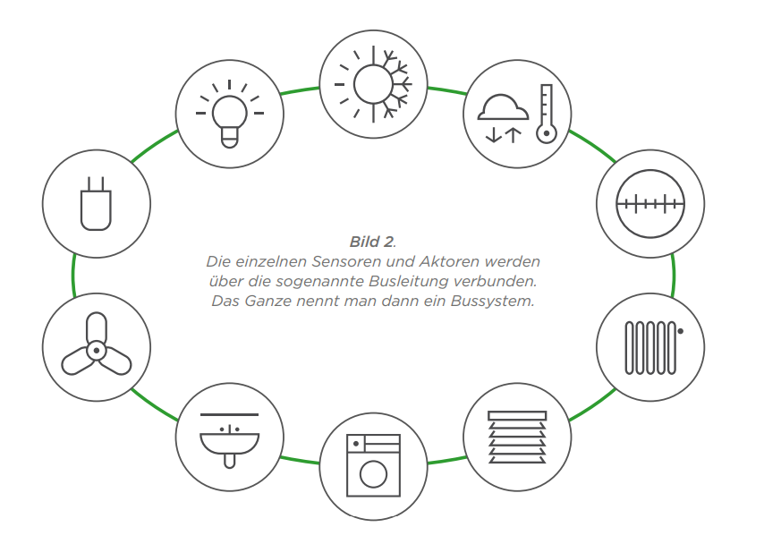


[Quelle](https://www.knx.org/wAssets/docs/downloads/Marketing/Flyers/KNX-Basics/KNX-Basics_de.pdf)

--- 

### 🧠 Feldbus-Systeme zur Gebäudeautomation

- KNX **trennt** die **Gerätesteuerung** und **Stromversorgung** 
- Stromversorgung mit Wechselspannung (rot)
- Steuerungsnetz (=EIB/KNX-Bus - grün) mit $30 \text{V DC}$

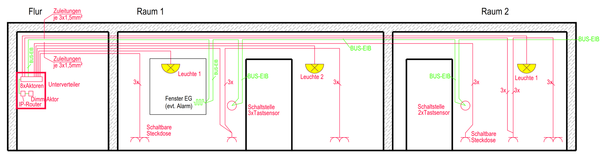

[Quelle](https://upload.wikimedia.org/wikipedia/commons/thumb/3/39/EIB_Verkabelung-1.png/1920px-EIB_Verkabelung-1.png)

---

### 🧠 Sensor-Aktor-Prinzip

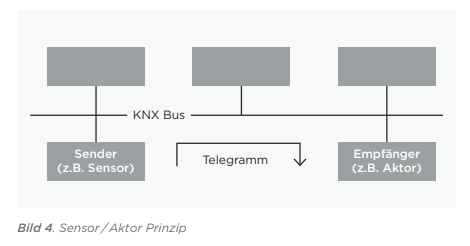

[Quelle](https://www.knx.org/wAssets/docs/downloads/Marketing/Flyers/KNX-Basics/KNX-Basics_de.pdf)

* **Sensoren erkennen Ereignisse** im Gebäude (Tastenbetätigung,
Bewegung, Über-/Unterschreitung eines Temperaturwerts etc.) und wandeln diese in
* Telegramme (Datenpakete) um
* **Aktoren** empfangen Telegramme und wandeln diese in **Aktionen** um
* Multi-Master-System: Alle Sensoren sind Master 
* [CSMA/CA](https://de.wikipedia.org/wiki/Carrier_Sense_Multiple_Access/Collision_Resolution) (für Funkübertragungen) bzw. [CSMA/CR-Prinzip](https://de.wikipedia.org/wiki/Carrier_Sense_Multiple_Access/Collision_Avoidance) (für kabelgebundene Übertragungen)

---

#### 🧠 KNX Ablauf


- findet ein **Ereignis** statt, **sendet der Sensor die Nutzinformation** (z.B. Schalter wurde geschaltet oder Windgeschwindigkeit beträgt 8km/h) 
- **alle Aktoren** hören die Busleitung ab und regieren, wenn Sie angesprochen wurden mit der **vorprogrammierten Handlung**
- Vorteil: Dezentralität - keinen Totalausfall
- Nachteil: gesteigerte Programmieraufwand. Jeder Teilnehmer muss mit einem Programmiergerät adressiert sowie mit der Applikation, den Parametern und Gruppenadressen programmiert werden. 


---

#### Sensoren und Aktoren

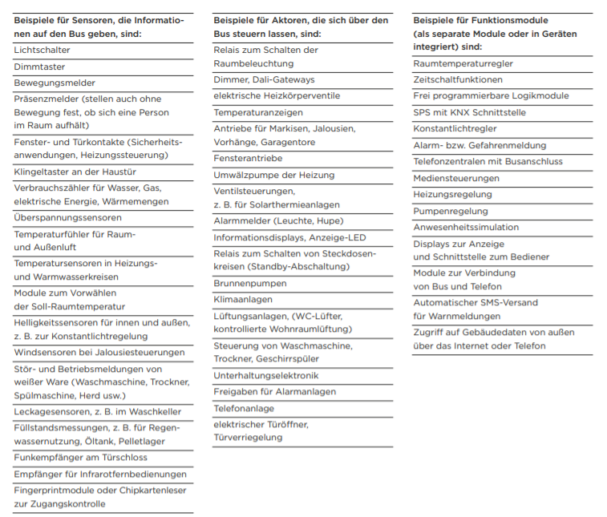

[Quelle](https://www.knx.org/wAssets/docs/downloads/Marketing/Flyers/KNX-Basics/KNX-Basics_de.pdf)

---

#### 🧠 Dezentralität

* bei KNX ist kein zentrales Steuergerät notwendig
* **Intelligenz** über **alle Teilnehmer** verteilt 
  (jedes Gerät hat mindestens einen Mikroprozessor)
* Ausfallsicherheit
* **Zentrale Geräte**, wie SPS möglich

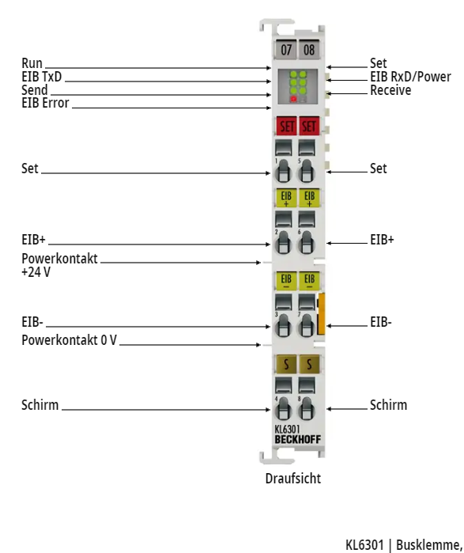


---

### Maximalgröße

- Mindestens ein Sensor und Aktor
- theoretisch mehr als 50.000 Teilnehmer möglich
- Erweiterung einer Anlage muss einer vorgeschriebenen Topologie folgen (vgl. Subnetting bei TCP/IP-Netzen)


---

### Übertragungsmedien

- KNX **Twisted Pair** (KNX TP): 
verdrillte Zweidrahtdatenleitung (Busleitung)
- KNX **Powerline** (KNX PL, "D-Lan"): 
Übertragung über das vorhandene 230 V-Netz
- KNX **Radio Frequency** (KNX RF): 
Übertragung über Funk
- KNX IP: 
Übertragung über **Ethernet**


---

#### KNX Zweidraht (TP) 

- Busleitung versorgt alle Busteilnehmer mit Daten und Betriebsspannung ($24 \text{V DC}$). 
- Die Spannungsversorgungen speisen 30 V in das System ein. 
- Busteilnehmer arbeiten bei Spannungen zwischen $21 \text{ bis }30 \text{V}$ fehlerfrei.

---

#### Telegrammaufbau - KNX-TP

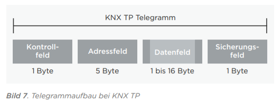

- **Kontrollfeld** die **Priorität**, ob ein Telegramm wiederholt wurde
- **Adressfeld** physikalische Adresse des Senders
und Empfängers (Physikalische **Adresse**
oder **Gruppenadresse**)
- Datenfeld bis 16 Byte Nutzdaten
- Sicherungsfeld  für Paritätsprüfungen
- zufälliger Buszugriff: **CSMA/CA-Verfahren** 
(Carrier Sense Multiple Access / Collision Avoidance )

---


### Kopplung bei komplexeren Aufbauten

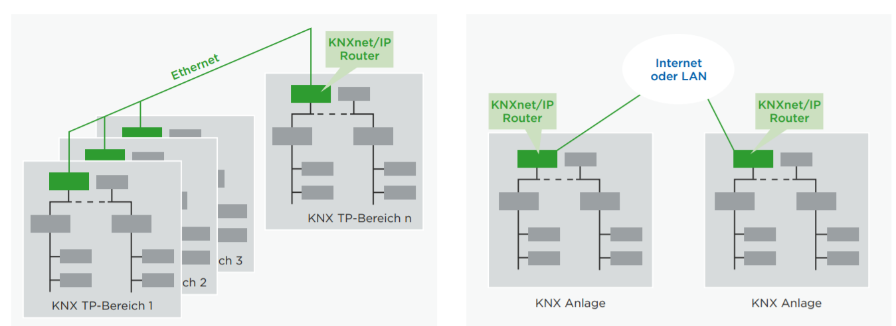

- häufig **hierarchische** Topologien
- **Ethernet** als leistungsfähiger **Backbone** und für komplexe (KNX IP) Geräte
- **KNX TP, KNX PL und KNX RF** für Anbindung **verteilter Sensoren und Aktoren**

---

#### 🤓 Hierarchie 

- Linie: kleinste Installationseinheit bei KNX TP mit Spannungsversorgung und 64 Busteilnehmer
- Linien sind durch Drosseln voneinader getrennt
- bis 15 Bereiche können über Bereichskoppler an
einer Bereichslinie zu einem Gesamtsystem erweitert werden


---


#### 🤓 Physikalische Adressen


- jedes Gerät hat eine Nummer ```Bereich.Linie.Gerät```

- Beispiele:
  - 1.5.0: Systemkoppler, der die fünfte PL-Linie mit der TP-Hauptlinie im ersten Bereich koppelt.
  - 2.3.20: Busteilnehmer mit der laufenden Nummer 20 in der dritten Linie des zweiten Bereichs


[Quelle](https://kompendium.infotip.de/knx-installationsbus.html)


---

#### 🤓 Gruppenadressen

- Aktoren und Sensoren können Gruppen zugeordnet werden
- Hierbei gibt es drei Ebenen also z. B.:
  [Keller – Abstellraum – Rauchwarnmelder – Testalarm]
  [EG – Küche – Rollladen – Auf/Ab]
  [Garage – Werkbank – Wandlicht – Status]


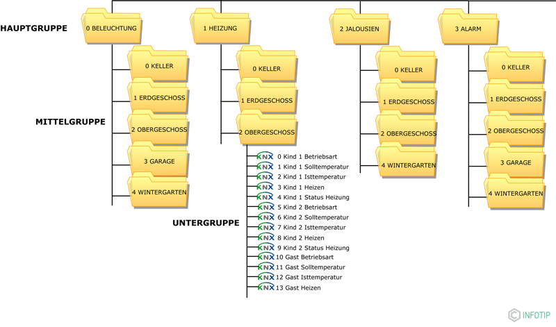

[Quelle](https://kompendium.infotip.de/knx-installationsbus.html)

---

### Einbau KNX im Schaltschrank

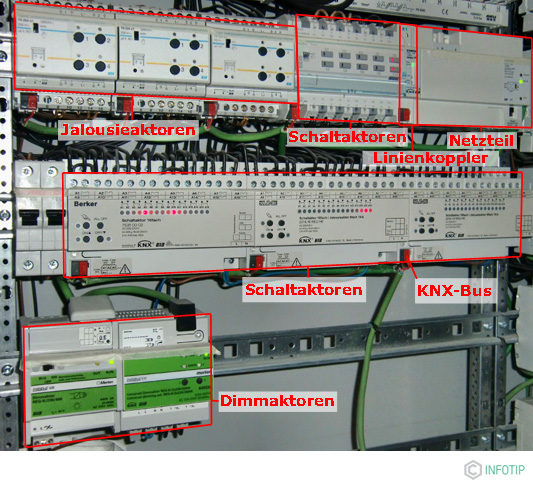


[Quelle](https://kompendium.infotip.de/knx-installationsbus.html)


---

#### Einbau Sensoren und mechanische Aktoren


- mechanische Aktoren und Sensoren werden im Feld verbaut

[Quelle](https://kompendium.infotip.de/knx-installationsbus.html)


---


#### 🧠 Konfiguration KNX


- kommerzielle, herstellerunabhängige
**Engineering Tool Software ETS®**
- erlaubt die Planung, Projektierung
und Inbetriebnahme


[Quelle](https://www.knx.org/knx-de/fuer-fachleute/software/software-vergleichen/)

---

##### 🤓 Produkte importieren

- damit angeschlossene Produkte bekannt sind 
- Katalog im **knxprod-Format** wird importiert
- knxprod-Dateien i.d.R. auf Herstellerwebsite

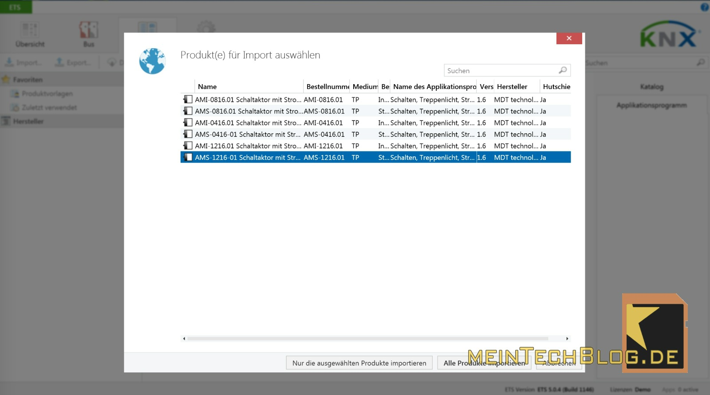

[Quelle](https://www.meintechblog.de/2015/04/knx-aktor-in-10-schritten-mit-ets5-programmieren/)

---

##### Gruppenadresse zuweisen

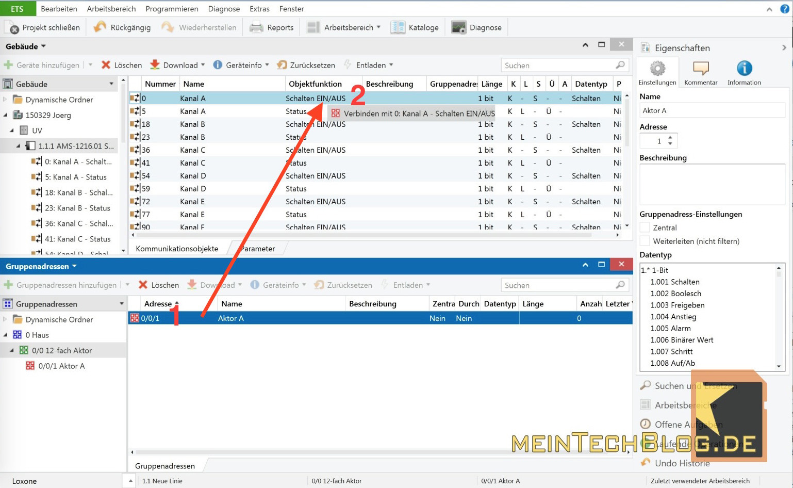

[Quelle](https://www.meintechblog.de/2015/04/knx-aktor-in-10-schritten-mit-ets5-programmieren/)

---

##### Werte und Funktionen zuweisen

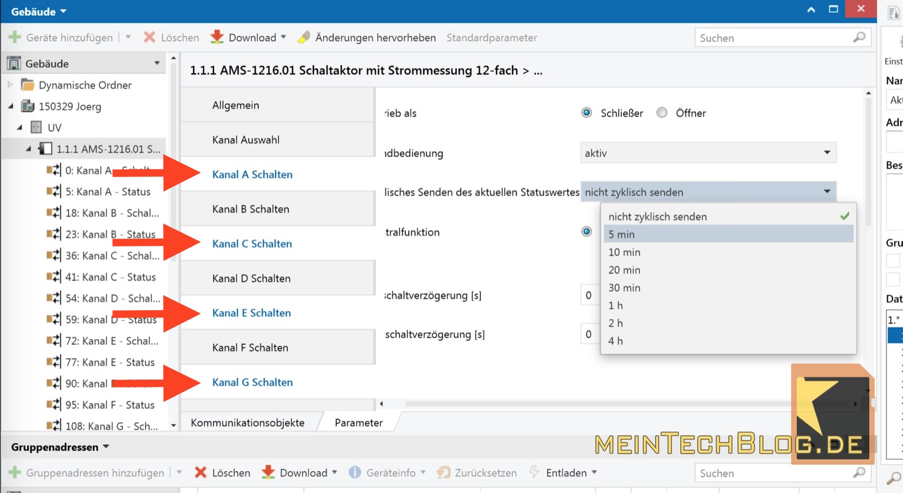

[Quelle](https://www.meintechblog.de/2015/04/knx-aktor-in-10-schritten-mit-ets5-programmieren/)

---

#### Zukunft von KNX


- Trend zu Vernetzung auf IP-Ebene
- Datenraten nicht für Multimedia geeignet
- Gewachsenes Ökosystem mit vielen Anbietern (Netzwerkeffekte)
- Lebensdauer von Gebäudeautomatsierung eher lang
- [▶️ voltus: KNX-Grundlagen](https://www.youtube.com/playlist?list=PLcXIjZgo0R3CeV13eEeSCNRdFl54hdsY6)

---

## Building Automation and Control networks (BACnet)

---

### 🧠 BACnet

-   entwickelt durch American Society of Heating,
Refrigeration, and Air Conditioning Engineers Inc
- Fokus zunächst auf **Heizungs-, Lüftungs- und Klimatechnik** 
- Verbindung von
  - **Feldebene** - Fühler und Antriebe 
  - **Automations**- (DDC-Geräte, Controller)
  - **Managementebene** (Gebäudeleittechnik)

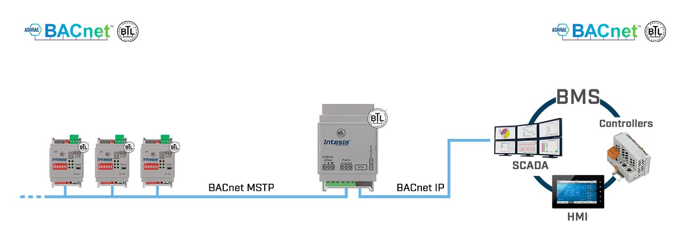


---

### Anwendungsgebiet BACnet

- **Protokoll** kann auf **beliebigen** Betriebssystemen und Hardware-Plattformen implementiert werden
- **standardisiert auch komplexe Transaktionen** (z.B. Alarm-Routing, Historisierung, Überwachung des Gerätestatus, Zeit- und Kalenderfunktionen, Datensicherung etc.)
- kein Plug-And-Play System wie KNX
- keine fertigen Objekte mit standardisierter Funktion

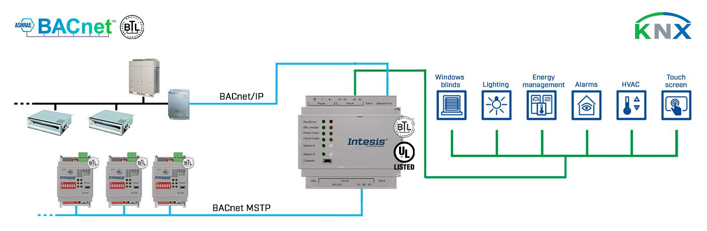

[Quelle](https://www.intesis.com/de/produkte/protocol-translator/knx-gateways/knx-tp-gateway-f%C3%BCr-bacnet-ip-ms-tp-client?ordercode=INKNXBAC1000000)

---

### Objektorientierung

- **Reale Geräte** und **konzeptuelle Objekte** 
können mittels Objekten abgebildet werden
  - Output-Objekttypen: physikalische Ausgänge wie einen 0-10V-Ausgang oder einen Prozentsatz eines Ventil-Aktors.
  - Input-Objekttypen: physischen Hardware-Eingang, der mit dem Gerät verbunden ist, z. B. ein Temperatur- oder Helligkeitssensor
  - Value-Objekttypen: virtuelle Informationen wie einen Sollwert oder einen Regelparameter darzustellen.


---

#### Objektorientierung am Beispiel binärer Eingang

Bisher: Ein Eingang  - eine Variable/Wert:

```PASCAL
bInAnwesenheitErkannt : BOOL;
bInAnwesenheitErkannt := True;

```

Mit BACnet werden Objekte [detaillierter](https://download.beckhoff.com/download/Document/certificates/beckhoff_bacnet_ip_pics_en_rev14_ver4.0.pdf) beschrieben:

```Python
bInAnwesenheitErkannt = { "Object_Identifier" : 0, 
                          "Object_Name" : "Anwesenheitssensor",
                          "Present_Value" : True,
                          "Out_of_Service " : False
                          }
```


---


#### Objekt-Typen

- Konformitätsklassen müssen gewisse Objekte bereitstellen

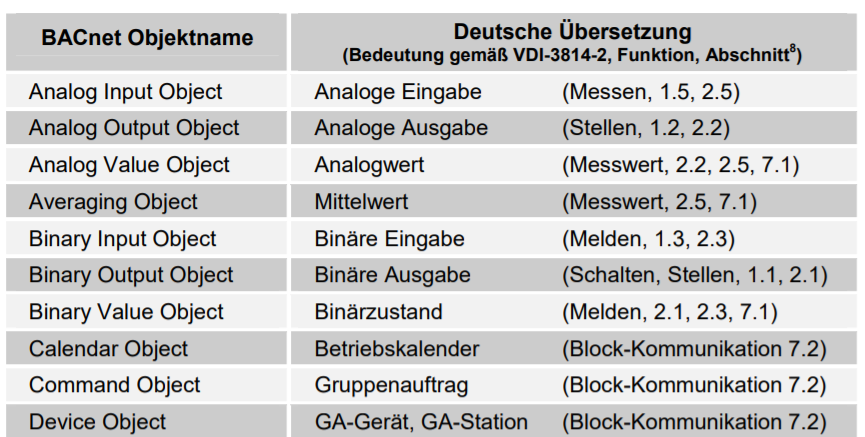

[Quelle]( https://www.ta.hu-berlin.de/res/co.php?id=14081)


---

#### Darstellung eines BACnet-Objects (Analog Value) in Twincat

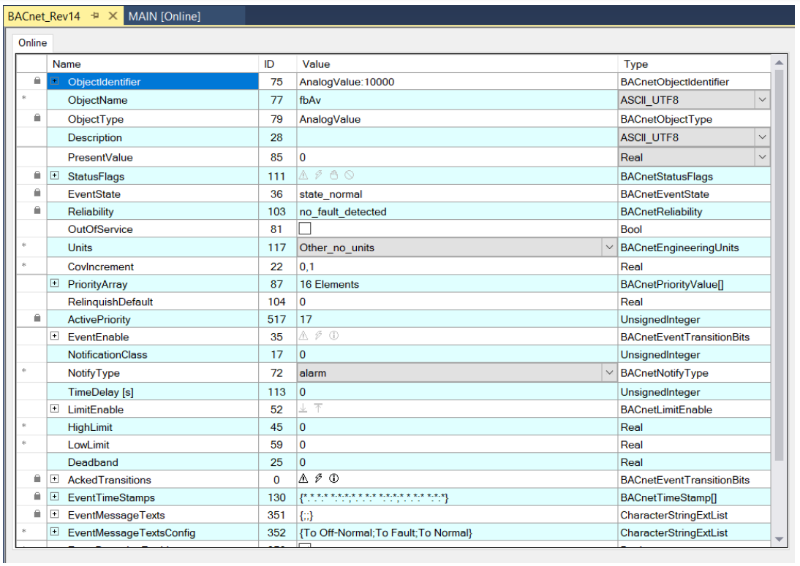

[Quelle](https://download.beckhoff.com/download/document/automation/twincat3/TF8020_TC3_BACnet_DE.pdf)

---

#### Darstellung eines BACnet-Objects (Analog Value) als Funktionsbaustein

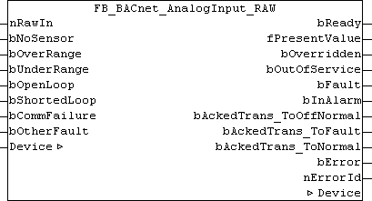

[Quelle](https://infosys.beckhoff.com/index.php?content=../content/1031/tcbacnet/12748477963.html&id=)

---

#### Weitere Objekt-Typen aus ISO-Norm 16484-5

```
Access Credential, Access Door, Access Point, Access Rights
Access User, Access Zone, Accumulator,  Alert Enrollment
Analog Input, Analog Output, Analog Value, Averaging
Binary Input, Binary Lighting Output, Binary Output, Binary Value
BitString Value, Calendar, Channel, CharacterString Value
Command, Credential Data Input, Date Pattern Value
Date Value, DateTime Pattern Value, DateTime Value
Device, Elevator Group, Escalator, Event Enrollment
Event Log, File, Global Group, Group, Integer Value, Large Analog Value
Life Safety Point, Life Safety Zone, Lift, Lighting Output
Load Control, Loop, Multi-state Input, Multi-state Output
Multi-state Value, Network Port, Network Security, Notification Class
Notification Forwarder, Octetstring Value, Positive Integer Value, Program
Pulse Converter, Schedule, Structured View, Time Pattern Value
Time Value, Timer, Trend Log, Trend Log Multiple
```

---

### BACnet Dienste (Services) 

- ca. 40 **Services** beschreiben, wie Geräte 
  Informationen austauschen
- fünf Bereiche
  - Objektzugriff
  - Filetransfer
  - Alarm- und Event-Funktionen
  - Remote Device Management
  - Virtual Terminal
  
* Je nach Geräteprofil sind gewisse Dienste vorgeschrieben
* Ein **Sensor** (Geräteprofil) sollte einen **Alarm** (Dienst) auslösen können
* Der Alarm könnte auf einen **Analogwert** oder dem **Mittwert eines Analogwertes** basieren

[Quelle](saia-burgess Controls 2011 - BACnet Workshop)


---


### "Bus"-Eigenschaften

- 22 Bit für Adressierung (ca. **4 Mio Adressen**)
- Twisted Pair (max $1200 \text{ m}$) oder Ethernet möglich
-  Master/Slave mit Token Passing
- **Server-Client Prinzip** 
  - jeder Teilnehmer kann Services 
der anderen als Client aufrufen


---

## Weitere Bussysteme im der Gebäudeautomatisierung

---

### Modbus

- De-facto-Standard für SPS in der **Automatisierung**
- Master-Salve-Architektur
- Teilweise auch in Gebäudeautomatisierung eingesetzt


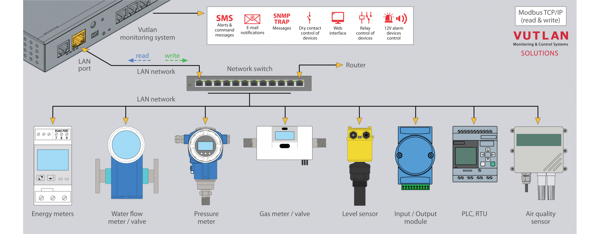

[Quelle](https://vutlan.com/blog/post/modbus-tcpip-modbus-rtu-readwrite-support.html)

---

### M-Bus

- Europäischer Standard (genormt in EN 13757) für ein Kommunikationssystem zur Zählerdatenübertragung 
- Typische Anwendungen: Gaszähler, Stromzähler, Wärmezähler, Wasserzähler, Rauchmelder
- $300 \text{ bis } 9600 \text{ Baud}$
- Master-Slave-Architektur
- Sämtliche Hersteller von M-Bus-Zählern bieten den Download der Spezifikation der übertragenen M-Bus-Daten ihrer Zähler an. 

---

### Local Operating Network (LON) 

- neutralen **Informationsaustausch zwischen Anlagen und Geräten von verschiedensten Herstellern**
- Logikknoten (Nodes) in Sensoren, Aktoren und Controller
- **Dezentrales Multi-Master System** basierend auf den Aktionen der Nodes
- Programmierung über LonTool

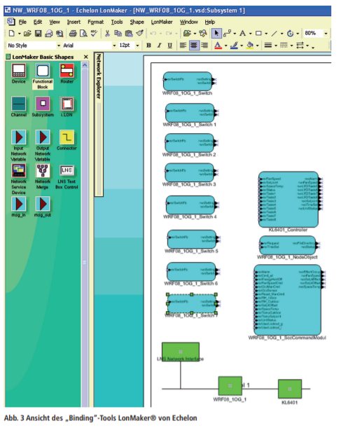


[Quelle](https://download.beckhoff.com/download/document/Application_Notes/DK9221-0111-0038.pdf)

---

###  Local Control Network (LCN)

- proprietäres **Gebäudeautomationssystem** für Wohn- und Zweckbauten (Issendorff KG)
- **dezentral über identische LCN-Module**
- eine LCN-Programmiersoftware LCN-PRO


[Quelle](https://www.lcn.eu/lcn-bus/installation/)

---


### Standard Motor Interface (SMI)

- kein volles Gebäudebussystem
- Ergänzung als **Schnittstelle** zu
  - **Rollladen- und Sonnenschutzantriebe** 
  - **Fensterantriebe**
- Software SMI-easyMonitor

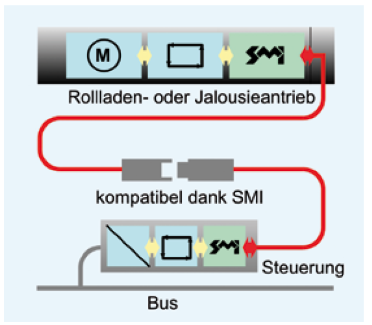

[Quelle](https://standard-motor-interface.com/)

---

#### Funktionsweise von Innen- und Außenbeschattung

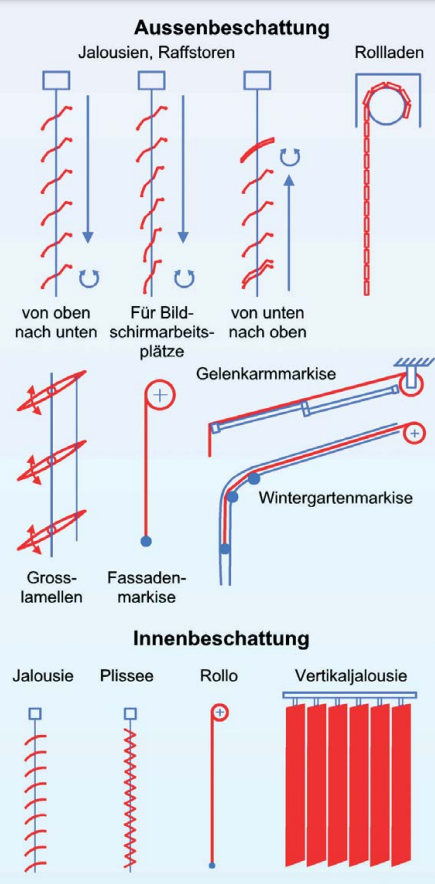

- Lamellen-Nachführung (Blendschutz und Energieoptimierung)
- Verschattungs-Korrektur (Energieoptimierung)
- Witterungsautomatik (Produktschutz)
- Thermoautomatik (Energieoptimierung)
- Zeitprogramme (Automatisierung von repetitiven Aufgaben)
- Schockautomatik (Einbruchschutz)


[Quelle](https://standard-motor-interface.com/wp-content/uploads/2020/10/160224_SMI_Planungshandbuch_DE.pdf)


----

### DMX (Lichttechnik)

- **Bühnenbeleuchtung** 
- auch in der Architekturbeleuchtung
- verdrillten, geschirmten, zweiadrigen Steuerleitung **als Strang**


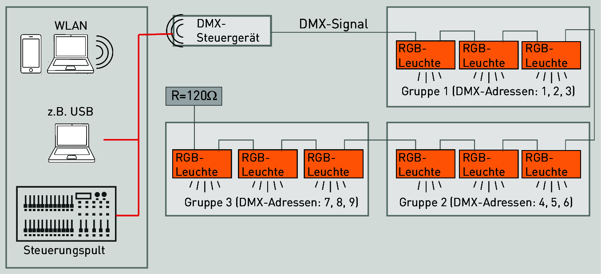

---

#### Teilnehmer und Adressierung

- viele Teilnehmer 
- ggf. unter Verwendung von mehreren Repeatern
- **Adressierung** erfolgt **am Betriebsgerät** (Dip-Schalter oder Software)

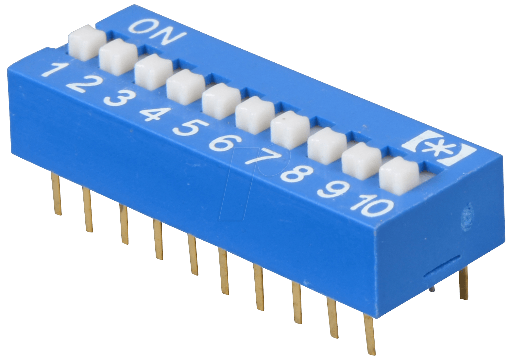

[Quelle](https://www.reichelt.de/it/de/dip-schalter-liegend-10-polig-nt-10-p13535.html)


---

### Auswahl funk-basierter Feldbussysteme

- häufig genutzte Frequenzbänder liegen bei 433 MHz (Babyphone, Rauchmelder), 868 MHz (Alarmanlagen) und 2,4 GHz (WLan). 
- **Frequenz** korreliert **positiv mit Übertragungsrate**
und **negativ mit Reichweite**


[Quelle](https://trendblog.euronics.de/smart-home/funkstandards-im-smart-home-teil-1-woran-wlan-und-bluetooth-kranken-50589/)

---

### ZigBee (Connectivity Standards Alliance)

- für geringe Datenmengen
- geringer Energieverbrauch
Anwendungen in Wohn- und Nichtwohngebäuden
- Sensorabstände bis $100 \text{ m}$
- Ad-hoc-Netzwerk über ZigBee-Router
- Steuerung von Audio-Video-Technik, Waschmaschinen, Kaffeeautomaten
- [evtl. Weiterentwicklung in Matter](https://matter-smarthome.de/)
---

### Bluetooth (Low Energy)

- Industriestandard für kurze Funkdistanz (WPAN)
- Smartphone-Steuerung, Audiotechnik
- Ad-hoc-Netzwerk über Bluetooth Mesh
- Verschiedene Ausprägungen (Reichweite, Energieverbrauch, etc.)

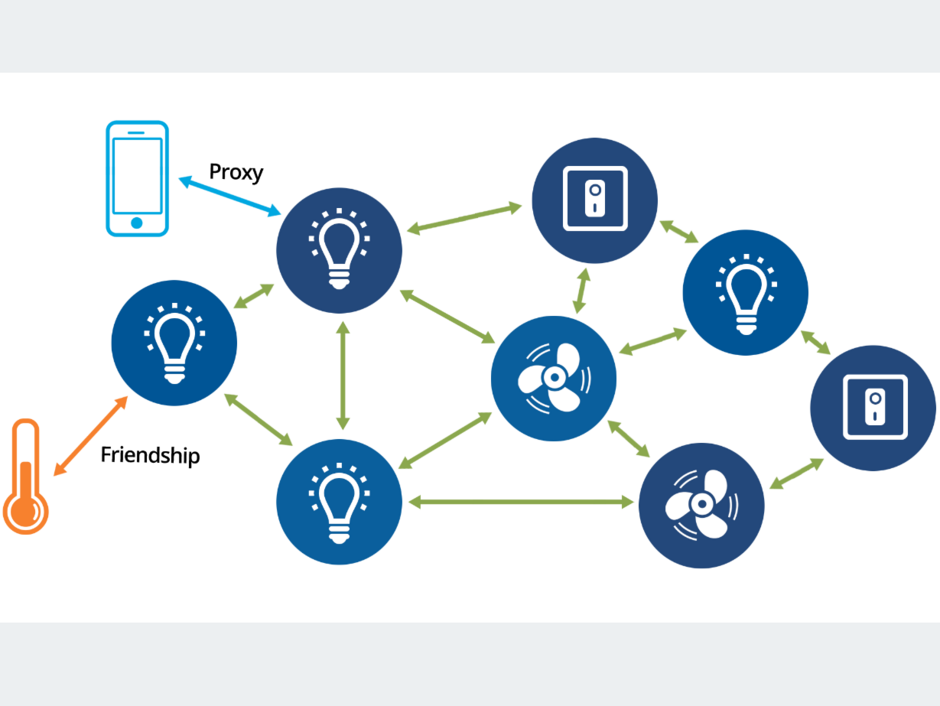

[Quelle](https://www.all-electronics.de/elektronik-entwicklung/bluetooth-mesh-lichtsteuerung-kontrolliert-smart-building-system.html)

---


### Enocean


- herstellerübergreifenden Standard mit batterieloser bidirektionaler Funktechnik
- kosten- und zeitsparende Installation
- Sensoren und Schalter (Piezoelektrizität) beziehen Energie aus Umgebung
- Sensoren für Temperatur, Helligkeit, Bewegung
- Aktoren als Schalter, Relais, Dimmer


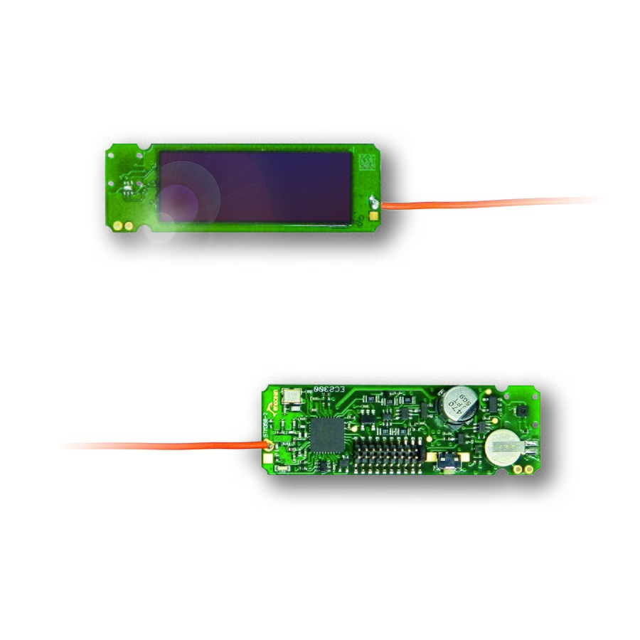

[Quelle](https://de.wikipedia.org/wiki/Enocean)

---

### Weitere

- **Z-Wave** funkbasierter Standard für Wohngebäude
Steuerung von Heizung, Lüftung, Klimaanlagen, Beleuchtung, Sicherheitstechnik

- **WirelessHART** Kommunikation für industrielle Feldgeräte, Anwendung für große Distanzen

- **WirelessKNX** einfache Nachrüstung von KNX-Komponenten über Funk-Buskoppler

- **Wireless M-Bus** europäischer Standard für drahtlose Kommunikation zwischen Zählern für Strom, Gas, Wärme, Wasser

- **WLAN** einbindung einzelner Produkte. Hoher Energieverbrauch. 

- **Long Range Wide Area Network** (LoRaWAN) energieffizientes Senden kleiner Datenmengen über große Strecken

---
marp: true
author: Julian Huber
size: 16:9
footer: Julian Huber - Bussysteme

# Strg+[ ] for Options

theme: beams

---

<!-- paginate: true -->

<!-- _class: title -->


# Smart Metering

---

## Globale Aspekte der Energieversorgung


---

### Wie viele "Energie-Sklaven" benötigen wir?
> the energy slave is a unit of measurement that allows us to better understand and evaluate the consequences of our life choices. An energy slave works to produce energy 24 hours a day. He produces an average power output of 100 W 
(875 kWh/year)


[Quelle](Tourane Corbière-Nicollier & Olivier Jolliet 2001 )


---

<!-- _class: white -->


[Quelle](https://www.bpb.de/kurz-knapp/zahlen-und-fakten/globalisierung/52758/verbrauch-von-primaerenergie-pro-kopf/)


---

### 🧠 Primärenergiebedarf


> misst den gesamten Energiebedarf (eines Landes). Er umfasst den Verbrauch des Energiesektors selbst, Verluste bei der Umwandlung (z.B. von Öl oder Gas in Elektrizität) und Verteilung von Energie sowie den Endverbrauch durch die Endverbraucher. Ausgeschlossen sind Energieträger, die für nichtenergetische Zwecke verwendet werden (z.B. Erdöl, das nicht zur Verbrennung, sondern zur Herstellung von Kunststoffen verwendet wird).


[Quelle](https://ec.europa.eu/eurostat/statistics-explained/index.php?title=Glossary:Primary_energy_consumption#:~:text=Primary%20energy%20consumption%20measures%20the,final%20consumption%20by%20end%20users.)


---

<!-- _class: white -->


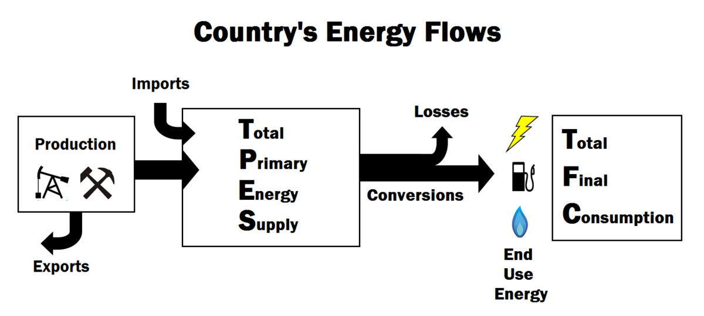

[Quelle](https://energyeducation.ca/encyclopedia/Total_final_consumption)

---

<!-- _class: white -->


[Quelle](https://upload.wikimedia.org/wikipedia/commons/b/b4/Energiegruppen_Bilanzbereich_AGEB.png)

---

### 🤓 Tonne of oil equivalent?

> (toe) ist eine Energieeinheit, die als die Energiemenge definiert ist, die bei der Verbrennung einer Tonne Rohöl freigesetzt wird. Sie beträgt etwa 42 Gigajoule oder 11,630 MWh


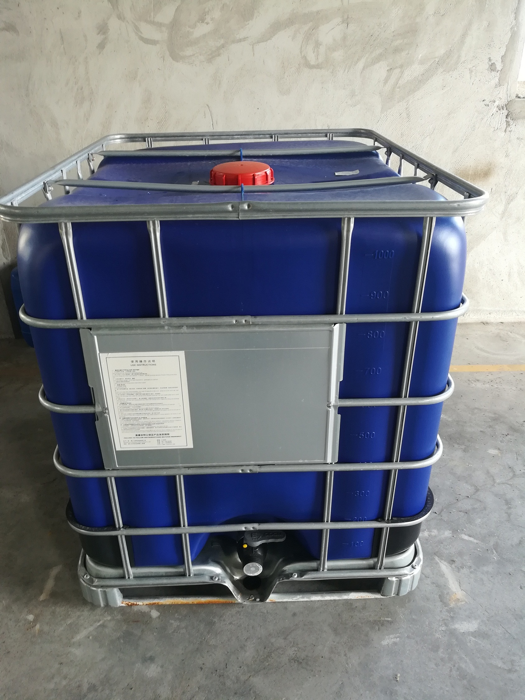


[Quelle](https://en.wikipedia.org/wiki/Tonne_of_oil_equivalent, http://www.huashuochem.com/wap_product_detail_en/id/29.html)

---


### Wie viele "Energie-Sklaven" benötigen wir?

$\text{No. of Energy Slaves}$
$= 3.7 \frac{\text{toe}}{\text{a}} \cdot 11.630 \frac{\text{MWh}}{\text{toe}} \cdot 1000\frac{\text{kWh}}{\text{MWh}} \cdot \frac{1}{875}\frac{\text{a}}{\text{kWh}}$
$= 3.7 \cdot 11.630 \cdot 1000 \cdot \frac{1}{875}$
$= 49.2$
* Jeder Europäer benötigt mehr als 50 virtuelle Energiesklaven, die Tag und Nacht arbeiten!


---

#### Wasserkocher


* $P = 3.7 \cdot \frac{11,630}{8760}\frac{\text{kWh}}{\text{h}}=4.9 \text{kW}$
* als würden mehrere Wasserkocher kontinuierlich durchlaufen
* **Is it bad to have too many energy slaves / kettles?**


[Quelle](James Hoffmann)

---

### Ökonomie

* Kosten: Energieerzeugung ist teuer
  


[Quelle](https://www.bloomberg.com/news/articles/2022-03-16/energy-costs-set-to-reach-record-13-of-global-gdp-this-year)


---

### Endenergieverbrauch nach Sektoren


[Quelle](https://www.iea.org/reports/key-world-energy-statistics-2020/final-consumption)

---

### Nachfrageseite: Endverbrauch nach Sektoren

* **Privathaushalte**: Heizen, Kochen, Kühlen, usw.
* **Verkehr**: Transport von Personen und Gütern
* **Gewerblich**: Verkauf von Waren und Dienstleistungen
* **Industrie**: Herstellung von Waren, in der Regel aus Rohstoffen.
* **Landwirtschaft**: Energieverbrauch: Düngemittel, Licht, Wärme, Maschinen

---

### Gesamt Primärenergieversorgung der Welt nach Quellen


[Quelle](https://www.iea.org/reports/key-world-energy-statistics-2020)

---

#### 🤓 Gesamt Primärenergieversorgung im Jahr ?


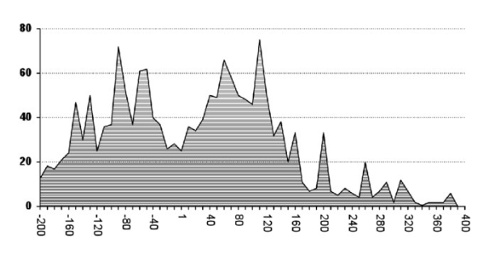

[Quelle](Malanima (2013))

---


> Schätzungen der Waldrodung in Mitteleuropa (Deutschland, Nordostfrankreich) anhand archäologischer Holzreste 200 v. Chr. bis 400 v. Chr. (dekadische Daten; jeder Punkt des Diagramms steht für die Intensität des Holzeinschlags).

[Quelle](###### Malanima, P. (2013). Energy consumption in the Roman world. In The Ancient Mediterranean Environment between Science and History (pp. 13-36). Brill)


---

### Energiepolitisches Zieldreieck

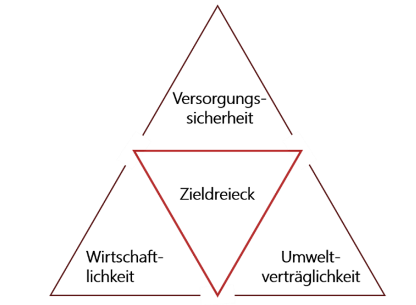

---

### Zusammenfassung

* Der größte Teil der Primärenergie weltweit stammt immer noch aus nicht erneuerbaren Energiequellen
* Sichere, erschwingliche Energie ist eine der wichtigsten Triebfedern der menschlichen Entwicklung
* Energie wird in allen Sektoren benötigt (Haushalt, Transport, Produktion)
* Nur ein kleiner Teil der Energie wird in elektrische umgewandelt

---

## Eine kurze Einführung in die Energiewirtschaft

---

### Energiekosten und Erlöse


[Quelle](https://kurier.at/wirtschaft/energiekosten-insgesamt-um-24-milliarden-euro-gestiegen/402181017)


---

### Stadtwerke-Welt (mit Beginn der Elektrifizierung 19 Jhd.)

* Ein Stadtwerk betreibt Netz und Stromerzeugung in seinem Netzgebiet
* Monopolstellung der Stadtwerke

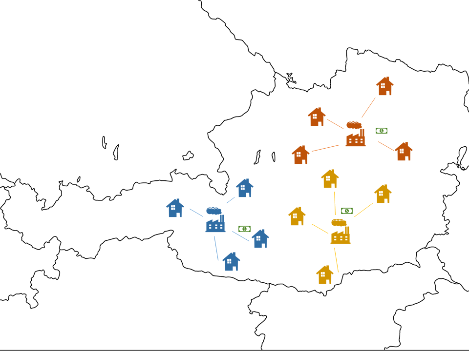

---

### Europäische Energiemarktintegration


* Entwicklung eines gemeinsamen Europäischen Stromnetzes (Ausfallsicherheit)
* und Binnenmarktes
* Aus integrierten Stadtwerken (und Energiekonzernen) werden getrennte Netzbetreiber  und Energieversorgungs-unternehmen (EVU)

---

### Europäische Energiemarktintegration

* Alle Marktteilnehmer handeln Energiemengen frei miteinander
* Netz wird von neutralen Netzbetreibern verantwortet
* Handel von Strom kann bilateral oder auf der Europäischen Strombörse (EEX) stattfinden
* Netzrestriktionen werden innerhalb einzelner Länder vom Markt ignoriert
* Solange keine Netzrestriktionen an den Gren-Kuppel-Stellen bestehen haben Länder den gleichen Strompreis
* Eine ähnliche Logik gilt für den Gas-Markt

---

#### Trennung von Natürlichem Monopol (Netz) und Markt (Energie)

* Beim Stromnetz handelt es sich um ein natürliches Monopol (ebenso Gas und Eisenbahn)
  * Kein Mitbewerber kann ein Parallelnetz aufbauen, und dieses günstiger anbieten
* Idee: Netz und Energie werden getrennt behandelt
* Dies soll den Europäischen Austausch fördern und Kosten senken

[Quelle](https://www.europarl.europa.eu/factsheets/de/sheet/45/energiebinnenmarkt)


---

### Elektrische Energie aus Strom ist ein homogenes Gut

* Eine kWh Strom kann überall im Europäischen Stromnetz eingespeist werden
* Eingespeiste und entnommene Energie können nicht nachverfolgt werden
* Das Netz wird nicht beachtet (Kupferplatte, Zonales Preissystem)


[Quelle](https://traumshop.net/shop/highlights/atomstromfilter/)

---

#### Ökostrom


* EVU, dies Ökostrom anbieten haben folgende Möglichkeiten
  * Ökostrom selbst produzieren
  * per Liefervertrag einkaufen
  * handelbare Erzeugungszertifikate erwerben

* Mengengleiche Ökostromversorgung: Ausgleich übers Jahr
* Zeitgleiche Ökostromversorgung:  Ausgleich in jeder Viertelstunde

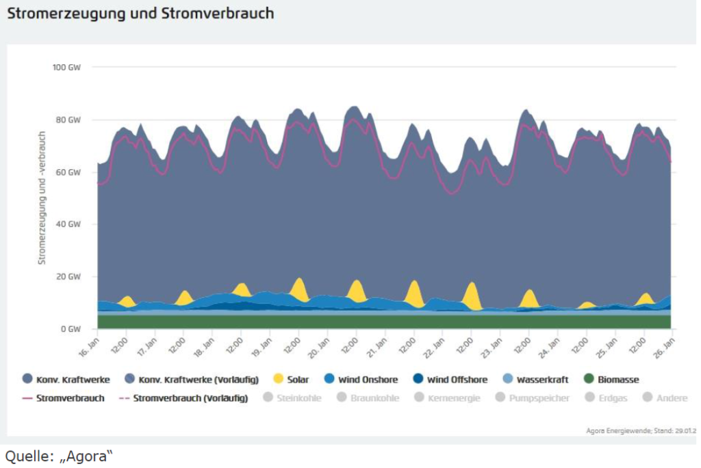


---

### Rollen auf dem Energiemarkt (vereinfacht)

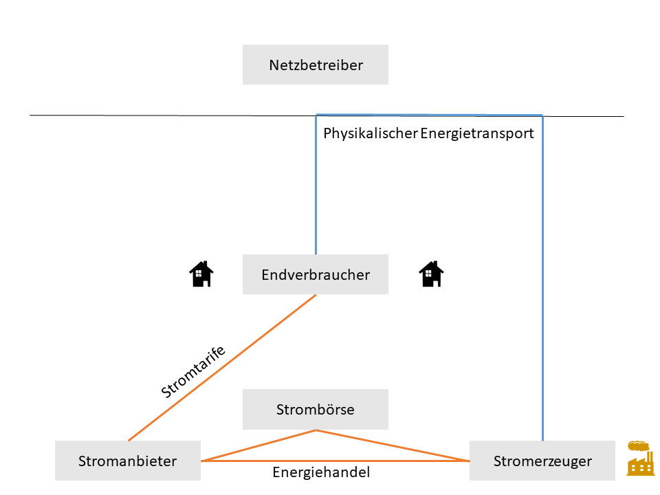

---

### Rollen auf dem Energiemarkt (vereinfacht)

* Ein Unternehmen kann gleichzeitig unterschiedliche Rollen einnehmen
* __Stromanbieter__: Große Erzeuger vom elektrischem Strom (Kraftwerksparks) verkaufen Energiemengen
* ist auch __Stromnachfrager__: Energieversorgungsunternehmen (EVU) kaufen Energiemengen
* __Endverbraucher__: Haushalte und Gewerbe, beziehen Strom von den Energieversorgungsunternehmen und rechen über Tarife ab (nur sehr große Firmen handeln selbst auf der Strombörse)
* Netzbetreiber: Greifen nicht in den Handel mit Strom ein


---

#### Angebot und Nachfrage

* Stromanbieter bieten zu marginalen Kosten an: Was immer es kostet eine MWh elektrischen Strom zu produzieren
  * Erneuerbare Erzeuger haben marginale Kosten von 0 €/MWh
  * Gaskraftwerke sind teuer
  * Kapitalkosten werden nicht eingepreist (sunk costs)
* Stromnachfrager sind unelastisch: EVU müssen beschaffen, was Haushalte und Gewerbe beziehen


[Quelle](marginale Kosten/Grenzkosten: Kosten die anfallen, um eine zusätzliche Einheit zu produzieren)

---


#### Merit Order Modell


[Quelle](Ökoinstitut Freiburg)

---

#### Merit Order Modell

* Die Aufreihung des Angebots wird als Merit Order bezeichnet
* In jeder Viertelstunde wird die der Einsatz der Erzeuger nach der Merit Order festgelegt
* Es muss immer genau so viel Strom abgenommen, wie eingespeist werden
* Die Nachfrage kann kurzfristig als nicht-elastisch (preis-unabhängig) angenommen werden
* Der Schnittpunkt zwischen Angebot und nachfrage bestimmt den Preis
* All abgerufenen Kraftwerke erhalten den Preis, den das letzte Kraftwerk erzielt

[Quelle](Ohne diese Regel (Pay-as-Bid) gäbe es ein Anreiz für strategisches Verhalten der Bieter )

---

#### Preis-Schwankung Intraday


[Quelle](https://energy-charts.info/charts/price_spot_market/chart.htm?l=de&c=DE&week=44&legendItems=011010000010)

---

#### Preis-Schwankung Intraday

* Je nach Last und Erzeugungssituation stellen sich unterschiedliche Preise ein
* EVU haben ein Interesse den Verbrauch ihrer Kund:innen in Richtung der günstigen Stunden zu verschieben
  * Zeit-dynamische Tarife 
  * Unterbrechbare Lasten 
* Das würde die Elastizität/Flexibilität der Nachfrage erhöhen
* EVUs müssen in teuren Stunden weniger Strom beziehen
* Geschieht dies nicht im ausreichenden Maße
  * Strompreis steigt
  * Mehr Emissionen
  * Lastabschaltungen

---

### Struktur des Stromnetz

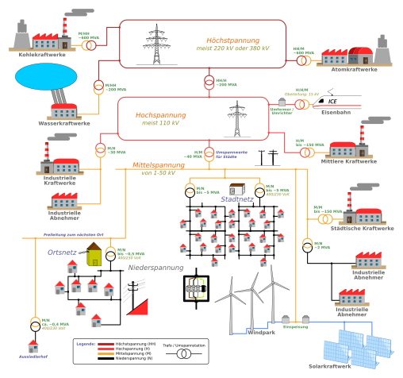

[Quelle](https://upload.wikimedia.org/wikipedia/commons/b/b0/Stromversorgung.svg)

---

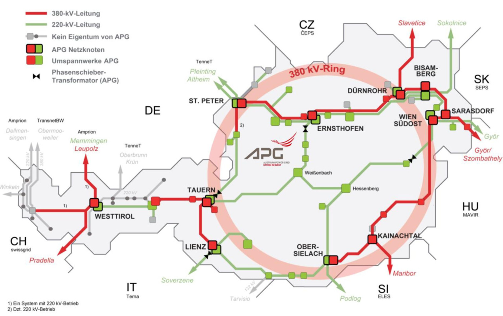

[Quelle](https://www.hochspannungsblog.at/Wissenswertes/Netzbetreiber/Uebertragungsnetz)

---


#### Übertragungsnetz

* Maschen-Topologie
* Engpässe bei starken lokalen Ungleichgewichten
  * Marktergebnis kann nicht umgesetzt werden: Redispatch
* Weitere Aufgaben der Übertragungsnetzbetreiber
  * Frequenzhaltung
  * Systemreserve


---

##### Verteilnetz

* Ring- oder Strang-Topologie
* Engpässe bei hohen Gleichzeitigkeiten
  *  Wärmepumpen
  * *"Zahnarzt-Allee"*
  🔥_🚗🚗🚗🚗🚗
  * PV-Rückspeisung 
  🔥_⚡⚡⚡⚡⚡


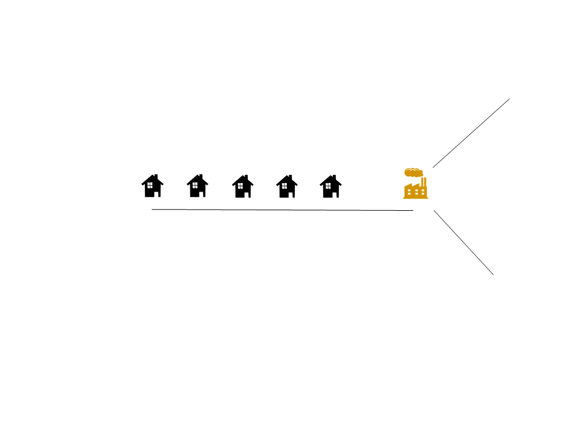

---

### Nachfrage: Relevanz der elektrischen Energieversorgung

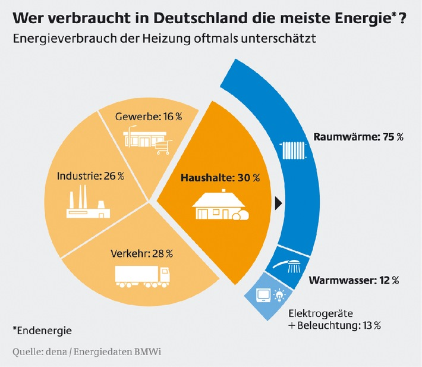

[Quelle](https://www.presseportal.de/pm/43338/1208607)

---

#### Nachfrage: Zunehmende Elektrifizierung 


[Quelle](https://www.heizspiegel.de/heizkosten-pruefen/heizkosten-pro-m2-vergleich/)

---

#### Nachfrage: Emissionsvermeidung durch Elektrifizierung

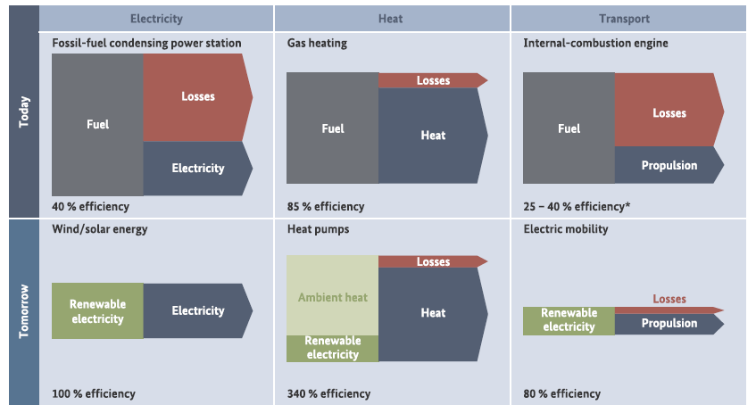

[Quelle](https://de.wikipedia.org/wiki/Sektorenkopplung#/media/Datei:Prim%C3%A4renergievergleich_fossile_Energie_und_erneuerbare_Energien.png)

---

#### Angebot: Anstieg volatiler Erneuerbarer Energien


[Quelle](https://www.oekosystem-erde.de/html/energiezukunft-03.html)

---

#### 🧠 Fazit

* Strom als **"wertvollster"** Energieträger, da geringe Umwandlungsverluste
* zunehmend höherer Teil an **Energiedienstleistungen** wird aus Strom gedeckt
* **Stromangebot wird zeitlich flexibel**
  (Photovoltaik und Wind nicht immer verfügbar - Dunkelflaute)
* Nicht nur Menge des Strombezugs, sondern auch 
  dessen **Zeitpunkt ist entscheidend**
* EVU und Netzbetreiber benötigen **Daten** über Erzeugung und Verbrauch zu Planung und Optimierung
* EVU und Netzbetreiber haben **Anreize** den Verbrauch der Endverbraucher steuernd **zu beeinflussen**

---

## Smart Metering

---

### Herkömmliche Zähler

- **integrierende** Messung
- keine Messzeitreihe
- **Visuelles Ablesen** eines Momentanwerts


---

### Standardlastprofile


* auf historischen Daten basierende Annahmen über typische Verbrauchsmuster
* gemittelt (enthalten keine Lastspitzen)
* dienen der Planung (z.B. Auslegung des Netzes, Beschaffung von Strom an der Strombörse)
* zunehmend unpräzise

[Quelle](https://blog.naturstrom.de/intern/standardlastprofil/)

---

### Intelligente Zähler

- (Smart Meter) sind **Gas-, Wasser- oder Stromzähler**, die digital Daten auszeichnen, senden und ggf. auch empfangen (Busteilnehmer)

- Basisfunktionen:
  - **Messung**
  - **Datenspeicherung**
  - **Kommunikation**


---

#### Komponenten eines Smart Meters (AT)


[Quelle](Smart-Meter-Kurzanleitung)

---

### Kommunikation zwischen verschiedenen Rollen

<!-- _backgroundColor: white -->


---


#### Komponenten eines Intelligentes Messsystems (D)

* Strikte Trennung in zwei kompatible Komponenten:
* **Modernen Messeinrichtung** erfasst Energiefluss digital
* Smart Meter Gateway **Kommunikations-Schnittstelle**, welche die Zählerwerte speichern, Daten verarbeiten und mit einem Netzwerk kommuniziert (Kommunikationsmodul)


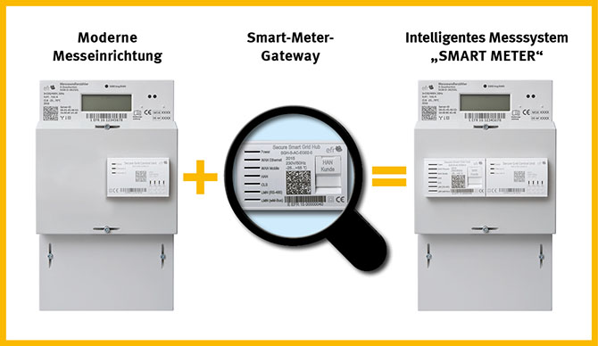


[Quelle](https://www.verbraucherzentrale.de/wissen/energie/preise-tarife-anbieterwechsel/smart-meter-die-neuen-stromzaehler-kommen-13275, Stand: 5. Februar 2021)


---

### Kommunikationsmodul

- Anbindung über diverse Bus-Systeme 
(Power-Line-Communication, Mobilfunk, M-Bus, TCP/IP, ...)
* ermöglicht **Fernauslesung**: Energieversorgungsunternehmen kann Stromverbrauch aus der Ferne ablesen
* **Privatsphäre**: Bedenken, dass auf Verhalten und Anwesenheit geschlossen werden kann

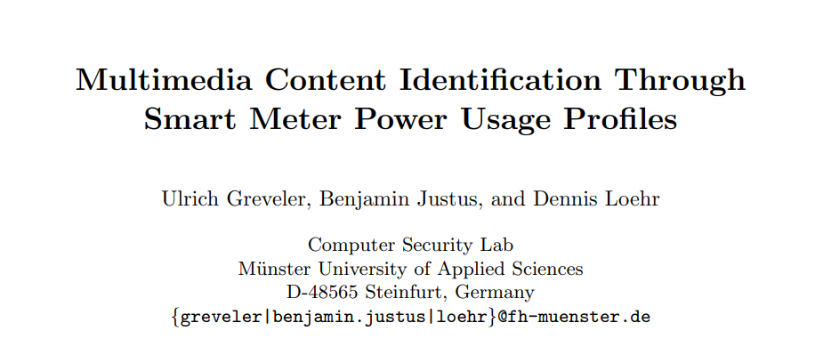

---

#### Kommunikationsmodul: Einführung neuer Stromtarife

* **Zeitvariable Tarife**: Strom kostet mehr zu Hochlastzeiten (abends, Wärmepumpen)
* **Last-variable Tarife**: Strom kostet in Abhängigkeit der bezogenen Leistung
* **Zeit-dynamische Tarife**: Strompreise können sich flexibel verändern (z.B. alle 15 Minuten)


[Quelle](https://www.awattar.at/)


---

### Gesetzliches

- **EU Richtlinie 2006**: allen Mitgliedstaaten, soweit technisch machbar, finanziell vertretbar und im Vergleich zu den potentiellen Energieeinsparungen angemessen, alle Endkunden in den Bereichen Strom, Erdgas, Fernheizung und/oder -kühlung und Warmbrauchwasser individuelle Zähler
  - tatsächlichen Energieverbrauch des Endkunden 
  - und die tatsächliche Nutzungszeit anzeigt

* mögliche Lösung: M-Bus Sensor + Display

---

##### Kundenschnittstelle (Home Area Network)

* in Österreich nicht fix definiert
* Spannung, Wirkleistung, Blindleistung aller Phasen
* häufig MBUS, aber auch andere Bussysteme
* teilweise verschlüsselt


[Quelle](Konzept für einen „Smart-Meter Kundenschnittstellen Adapter“ zur Standardisierung der Datenbereitstellung in der Kundenanlage)

---

### Stand Smart Meter Rollout Europa 2020

| Land      | Durchdringung in % | Bemerkung |
|---------------|----:|---|
| Spanien       | 100 |   |
| Irland        | 100 |   |
| Dänemark      | 100 |   |
| Finnland      | 100 |   |
| Malta         | 100 |   |
| **Italien**       |  99 | [Treiber Stromklau?](https://www.faz.net/aktuell/wirtschaft/unternehmen/smart-meter-dem-schwarzen-stromzaehler-schlaegt-die-stunde-1625653.html)  |
| Luxemburg     |  95 |   |
| **Österreich**    |  95 | [Prakmatisch](https://oesterreichsenergie.at/fileadmin/user_upload/Oesterreichs_Energie/Publikationsdatenbank/Factsheets/FactSheet_Smart_Meter.pdf)  |
| Frankreich    |  95 |   |


---

| Land      | Durchdringung in % | Bemerkung |
|---------------|----:|---|
| Griechenland  |  80 |   |
| Polen         |  80 |   |
| Rumänien      |  80 |   |
| **Deutschland** |  23 | [Overengineering](https://www.bsi.bund.de/SharedDocs/Downloads/DE/BSI/Publikationen/Broschueren/Smart-Meter-Gateway.pdf;jsessionid=7BD90C53F0BECB122DCE8CFC6411F913.internet082?__blob=publicationFile&v=2) |
| Lettland      |  23 |   |


[Quelle](https://de.statista.com/statistik/daten/studie/387142/umfrage/marktdurchdringung-von-smart-metern-in-europa-nach-laendern/)

---


### Eichrecht

- **abrechnungs-relevante** Zähler müssen 
eich-rechtlich zugelassen sein
- **Maß- und Eichgesetz** (MEG)
  - Mengenmessgeräte für Gas,
  - Mengenmessgeräte für sauberes Wasser aus Versorgungsleitungen,
  - Mengenmessgeräte für thermische Energie (Wärmezähler, Kältezähler),
  - Elektrizitätszähler
- Zähler muss bei in Verkehr bringen der Europäischen Messgeräte-Richtlinie MID entsprechen
- **Regelmäßig überprüft** (geeicht) werden

[Quelle](https://static.fernauslese.de/uploads/Fernauslese.de-Merkblatt-Eichrecht-in-Oesterreich.pdf)


---

### 🤓 Smart Meter Österreich

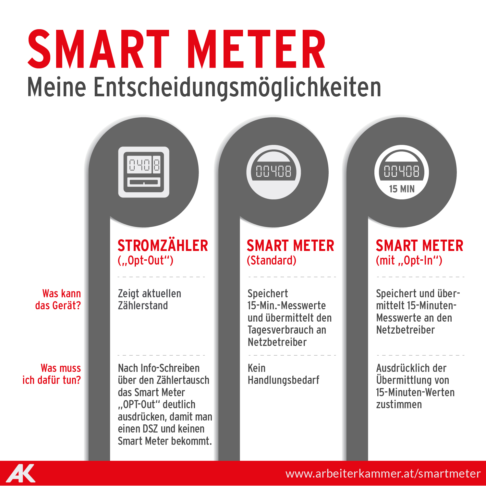

[Quelle](https://www.arbeiterkammer.at/beratung/konsument/Datenschutz/FAQs_zum_Smart_Meter.html#lg=1&slide=0)


---

### 🤓 Besonderheit Deutschland

 - Technische Richtlinie 03109-1 **Anforderungen an die Interoperabilität** der Kommunikationseinheit eines intelligenten Messsystems
- **Bundesamt für Sicherheit in der Informationstechni**k – BSI definierte umfassende Anforderungen, welche von der Herstellern umgesetzt werden mussten
  - z.B. Übertragung über asymmetrische Verschlüsselung und Zertifizierung
  - **Standardisierte Basisfunktionen** (Tarifanwendungsfälle) 

---

#### Smart Meter Deutschland

* soll Ökosystem zum Vernetzung verschiedenster Akteure spielen
* Zusätzlich zur Kommunikationsmodul (WAN) und Kundenschnittstellen (HAN) können noch weitere Zähler integriert werden (LMN)
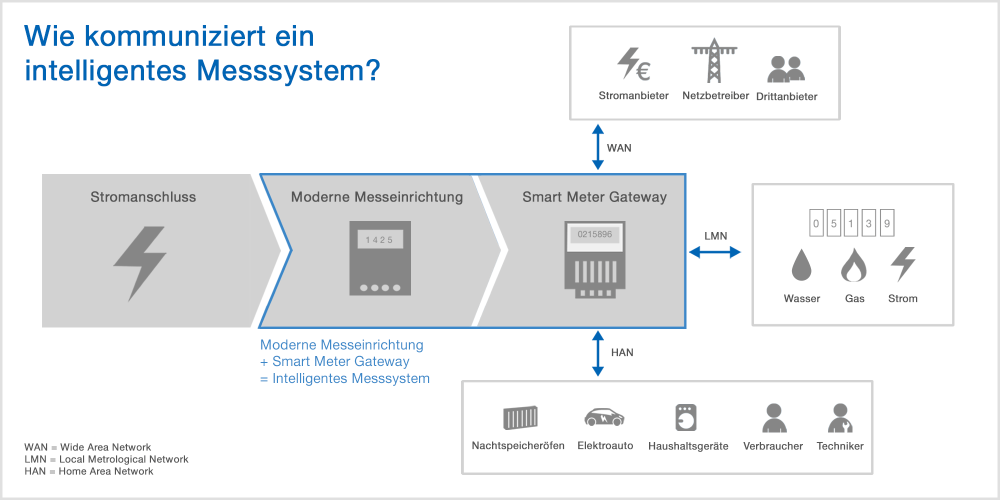


[Quelle](https://www.dke.de/de/arbeitsfelder/energy/smart-meter-energiemanagement-digitalisierung-energiewende)

---


#### Tarifanwendungsfälle


[Quelle](https://www.ffe.de/attachments/article/851/FE_13549_Bericht_final_online.pdf)

---

#### Kritik an Deutschem System

* **Späte Markteinführung**
* **hohe Kosten** (>100 €/a)
* **Überreglementierung**
  * Kein Freitraum für Tarifentwicklung
* Anforderungen
  * EVU über WAN-Schnittstelle: Abrechnung auf 15 Minuten-Basis ausreichend
  * Liegenschaftsbetreiber über HAN-Schnittstelle: Mess- und Regelung in Gebäudeleittechnik erfordert höhere Auflösung (**Parallelstruktur**)

---

#### Einbauempfehlung Deutschland

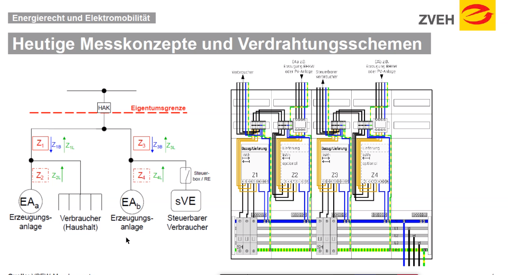

Quelle: Zentralverband der Deutschen Elektro- und Informationstechnischen Handwerke---
marp: true
author: Julian Huber
size: 16:9
footer: Julian Huber - Bussysteme

# Strg+[ ] for Options

theme: beams

---

<!-- paginate: true -->


# Labor: Bussysteme & Elektrotechnik

<!-- _class: title -->

Julian Huber & Michael Renzler 

---

## Labore

### Grundlegendes

- Bewertung anhand Laborbericht nach Vorgaben des *Academic Walkthrough*
-  Abweichungen werden von der Lehrveranstaltungsleitung bekannt gegeben
- Vollständige Anwesenheitspflicht

---

### Ziele des Labors

- Hinterfragen der Theorie
- Entwickeln von Lösungen
- Selbsthilfe beim Umgang mit neuen Themen
- Anfertigen einer Technischen / Wissenschaftlichen Dokumentation (**Laborbericht**)
- **Spaß!**

---

### Gruppen und Planung

- Pro Laborgruppe (1, 2, 3) können weitere Gruppen (z.B. Zweier-Teams gebildet werden)
- Diese geben auch gemeinsam den Bericht ab
- Das Bussystem-Labor findet in im SBT-Labor *4C-313* statt
- Das Elektrotechnik-Labor findet in der Andreas-Hofer-Str. 4. im *MCI VI* statt
- Die Passagen des *Academic Walkthrough* zum Labor und die Labor-Unterlagen sind **vor** dem ersten Labortermin zu lesen


---

## Sicherheit


### Sicherheitsregeln für Arbeiten unter Spannung

- Freischalten (ab 50 V AC bzw. 120 V DC),
- gegen Wiedereinschalten sichern 
- Spannungsfreiheit feststellen,
- Erden und Kurzschließen:
    - a) Hochspannungsanlagen jedenfalls,
    - b) in Kleinspannungs- oder Niederspannungsanlagen, wenn die Gefahr besteht, dass die Anlage unter Spannung gesetzt wird
- benachbarte, unter Spannung stehende Teile abdecken oder abschranken.

###### https://www.ris.bka.gv.at/GeltendeFassung.wxe?Abfrage=Bundesnormen&Gesetzesnummer=20007682


---

## Sicherheit

### Stromunfälle

1. In allen Elektro-Technik-Laboren gibt es **Not-Aus-Schalter**, diese sind in Notfällen zu betätigen.
2. Ist eine Person im Stromkreis oder besteht die Gefahr, dass eine **Person im Stromkreis** sein könnte, ist darauf zu achten, diese Person nicht zu berühren, sondern **mittels nichtleitender Hilfsmittel** aus dem Stromkreis zu befördern ist (Decke, Besen et cetera).
3. Wird ein Not-Aus-Schalter betätigt, ist dies unbedingt und unverzüglich einer Lektorin oder einem Lektor beziehungsweise einer Tutorin oder einem Tutor zu **melden**. Auf keinen Fall darf der **Not-Aus-Schalter selbst wieder entsichert** werden.


---

## Sicherheit

### Erste Hilfe

1. Ruhe bewahren und überlegt handeln.
2. Auf die eigene Sicherheit achten.
3. Die Rettung von Personen ist wichtiger als die Bergung von Sachgütern.
4. Betreuerin oder Betreuer informieren.
5. Gegebenenfalls ist eine Schockbekämpfung durchzuführen.

- Nummer Rettung: **144**

- Bei hohen Spannungen auch ohne Auffälligkeiten zur Beobachtung ins Krankenhaus!


---

## Bussysteme

### Themen

- SPS-Programmierung mit Strukturiertem Text
- SPS-Programmierung mit Funktionsbausteinen
- Datenübertragung in die Cloud mittels MQTT
- Lichtsteuerung mit DALI

- Nützlich
    - [SPS Einführung](https://www.youtube.com/watch?v=GOFUsWc61Hk&list=PL2LjUivoqcmUNF4wfaZdWQEZm9ptpIFuw)
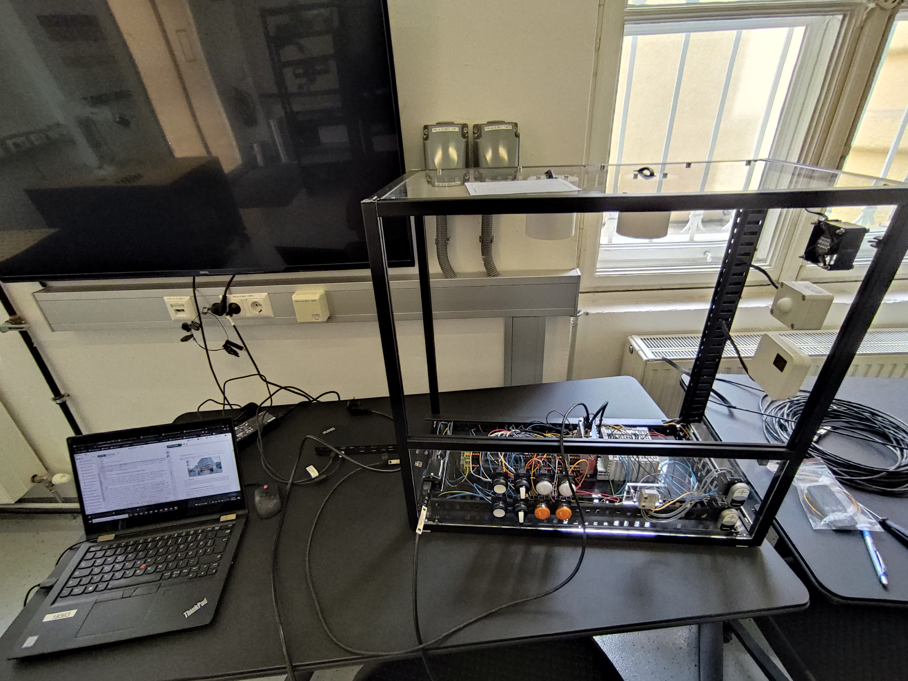

---

## Elektrotechnik


### Themen

- Gleichstrom
- Kondensator und Spule
- Wechselstrom

- Nützlich
    - [Multimeter schützen](https://www.youtube.com/watch?v=KOTmfqc9nzU)
    - [Einführung Oszilloskop](https://www.youtube.com/watch?v=lI-zZ85lKco)
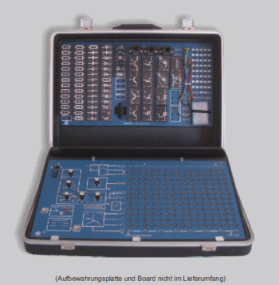
---

marp: true
theme: beams
author: Julian Huber
size: 16:9
footer: Julian Huber - Grundlagen Informationstechnologie & Datensicherheit
headingDivider: 2

# Strg+[ ] for Options

---

<!-- paginate: true -->


# **Einführung Gebäudetechnik:**  IT & Bussysteme

<!-- _class: title -->

Dr. Julian Huber
*Management Center Innsbruck*


## Beispiel Glühbirne [🔗](https://www.edn.com/teardown-cutting-into-a-multicolor-led-light-bulb/)

####

<center>


</center>

[🔗](https://upload.wikimedia.org/wikipedia/commons/b/b4/Gluehlampe_01_KMJ.png)

---

### Klassische Glühbirne

- **Energieeffizienz**: 5%
- **Lebensdauer**: 1.000 Stunden
- **Farbtemperatur**: fix z.B. 2.700 K
- **dimmbare Variante**: z.B. durch Unterspannung
- **Preis**: 1 €

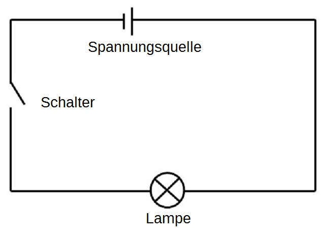

---

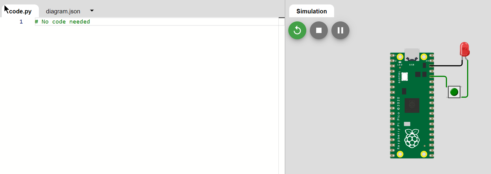


[🔗](https://wokwi.com/projects/407558668658481153)

---

### Moderne LED-Glühbirne

#### 
<center>


</center>

---

### Moderne LED-Glühbirne

#### 
<center>

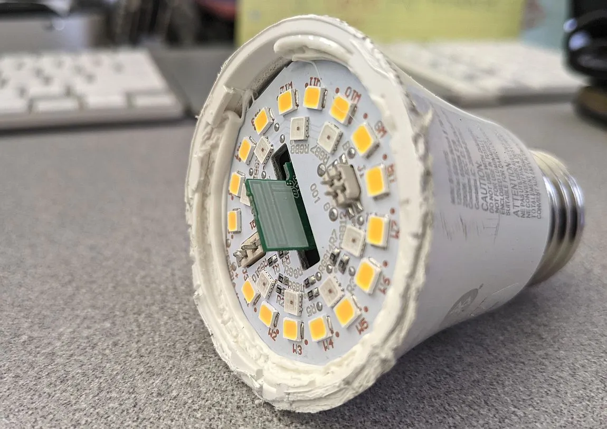
-
</center>

---

### Moderne LED-Glühbirne

- **Energieeffizienz**: 80%
- **Lebensdauer**: 25.000 Stunden
- **Farbe/temperatur**: variabel 
- **dimmbare Variante**: z.B. durch Pulsweitenmodulation
- **Preis**: 10 €

#### 

<div style="text-align: right;">
    <span style="color: orange; font-size: smaller;">
<span style="color: orange;">5. Nachhaltigkeit und Energieeffizienz</span>
</div>


---

#### Eingebettetes System

- jedes Gerät hat einen eigenen Mikrocontroller
- **Software-Code** steuert die Farbe, Helligkeit, ...

<center>

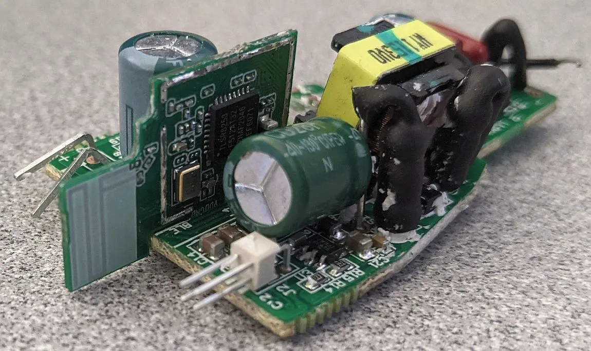

</center>

---

* Trennung von Ein- und Ausgängen
* diese werden erst durch Software verknüpft

<center>

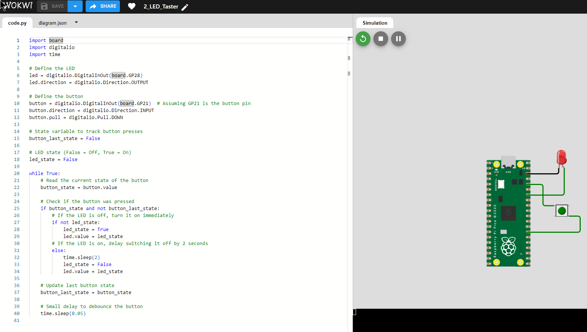

</center>


[🔗](https://wokwi.com/projects/407556513920508929)

---

#### 🎯 Lernziele

* Konzeption von Schaltregeln als **Endliche Automaten** oder **Wahrheitstabellen**
* Anschluss von Sensoren und Aktoren an **Mikrocontroller** und **Speicherprogrammierbaren Steuerungen**
- Umsetzung in **Software-Programmen** mittels Kontrollstrukturen


---

#### 3-Kanal-LED-Controller mit Pulsweitenmodulation

<center>

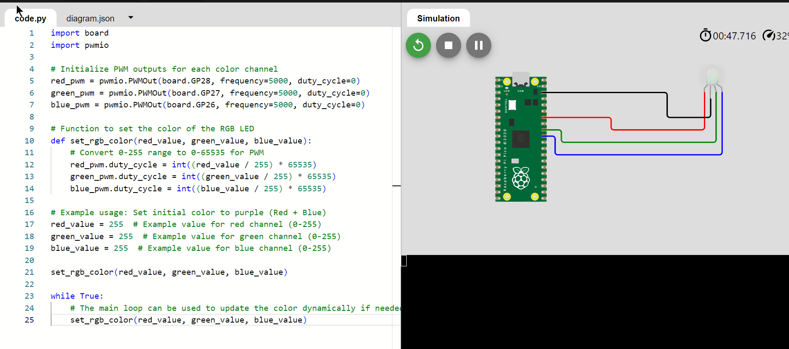

</center>


[🔗](https://wokwi.com/projects/407564736674374657)


---

#### 🎯 Lernziele

* Einsatz von **Zahlensysteme** und **Bit-Operationen**
* Unterschiede zwischen **Analogen** und **Digitalen Signalen**
* Auswahl von **Ein- und Ausgabegeräten** 

---

#### Verbindung von Sensoren und Aktoren

<center>


</center>

[🔗](https://wokwi.com/projects/407563984311537665)


<div style="text-align: right;">
    <span style="color: orange; font-size: smaller;">4. Gebäudeautomation und Steuerung</span>
</div>

---


#### 🎯 Lernziele

- **Informationsübertragung mittels Bussystemen** und verschiedenen Randbedingungen z.B. Echtzeitfähigkeit, Teilnehmerzahl, Störsicherheit
- Grundkonzepte der **Steuerungs- und Regelungstechnik** z.B. PID-Regler für Konstantlichtregelung


## Vernetzung in Gebäuden

<center>


</center>


<span style="color: orange;">6. Instandhaltung und Betrieb</span>


---

#### 🎯 Lernziele


* **Netzwerkkonfiguration** für TCP/IP-Netzwerke
* **Sicherheitsaspekte** z.B. Firewall, VPN, Verschlüsselung
* **Datenspeicherung** und **Datensicherung** im Betrieb und bei Störungen


---

#### Bussysteme als Zentrales Nervensystem

<center>

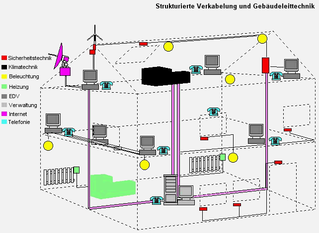

</center>

[🔗](https://www.haustechnikdialog.de/SHKwissen/Showimage.aspx?ID=4653)

<div style="text-align: right;">
    <span style="color: orange; font-size: smaller;">2. Klimatisierung und Raumkomfort</span>
</div>

---


#### Bussysteme für verschiedene Gewerke

<center>

 

</center>

---

#### 🎯 DALI - Intelligente Lichtsteuerung

<center>


</center>

* **Verkabelung** und **Addressierung** von bis zu 64 Leuchten und Zusammenfassen in **Gruppen**
* Konfiguration von **Szenen** für verschiedene Anforderungen 

<div style="text-align: right;">
    <span style="color: orange; font-size: smaller;">7. Anpassung an Nutzungsänderungen
</span>
</div>

---

<center>


</center>

---

#### 🎯 KNX & BACnet - Übergreifende Gebäudeautomation

<center>

.png)

</center>

* **Einsatzgebiete** und **Topologien** verschiedener Bus-Systeme
* Planung von **Raumautomations-Funktionen** mittels **Schemata**

<div style="text-align: right;">
    <span style="color: orange; font-size: smaller;">3. Sicherheits- und Brandschutz</span>
</div>

---

### Anlagenautomation

#### 
<center>


</center>

---


#### Klassische Automatisierungstechnik

<center>

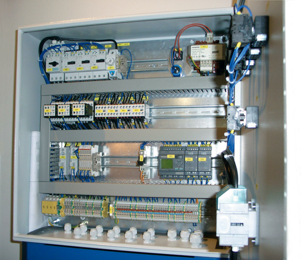

</center>

* Verdrahtung von **Aufbau von SPS-Sytemen**
* Programmierung mittels **Funktionsplänen** oder **Strukturiertem Text**

---

#### Ethernet/IP

<center>


</center>

* Grundtechnologien des **Internets**, z.B. **TCP/IP**, **JavaScript**, **HTML**
* Datenübertragung mittels **HTTP**, **MQTT**

<div style="text-align: right;">
    <span style="color: orange; font-size: smaller;">8. Komfort und Nutzerfreundlichkeit</span>

</div>


## Energiemanagement & Smart Metering

<center>

![h:400]
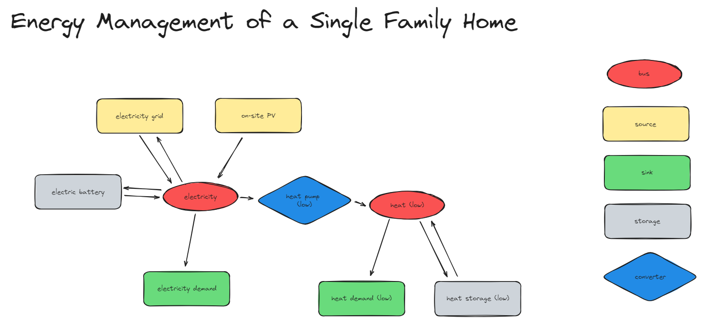

</center>

<div style="text-align: right;">
    <span style="color: orange; font-size: smaller;">1. Sicherstellung von Versorgung und Entsorgung</span>

</div>

---

### Energiesysteme

* **Versorgung**, Erzeugung, Speicherung, Verteilung, Verbrauch
* **Skalen**: Gebäude, Stadt, Region, Land, Welt
* **Sektoren**: Strom, Wärme, Mobilität
* **Technologien**: Erneuerbare, Speicher, Wärme, Elektrolyse, ...
* **Zielkonflikte**: Klimaneutralität, Versorgungssicherheit, Wirtschaftlichkeit

### Energiemanagement

* **Planung**: Welche Technologien, Standorte, Größen
* **Betrieb**: Welche Steuerung, Regelung, Optimierung
* **Optimierung**: Potenziale aufdecken, Kosten minimieren


---


#### Beispiel: Optimierung eines EFH mit PV und Speicher

<center>

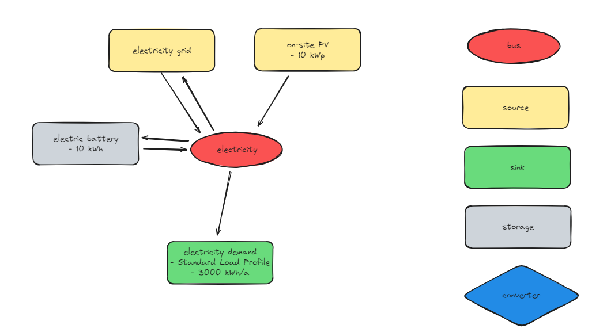

</center>

---

##### Lasten und Ertäge

<center>

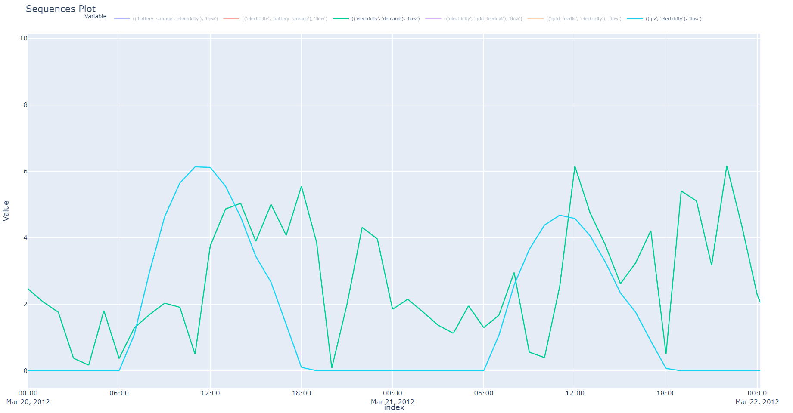

</center>

---

##### Speicherbewirtschaftung

<center>

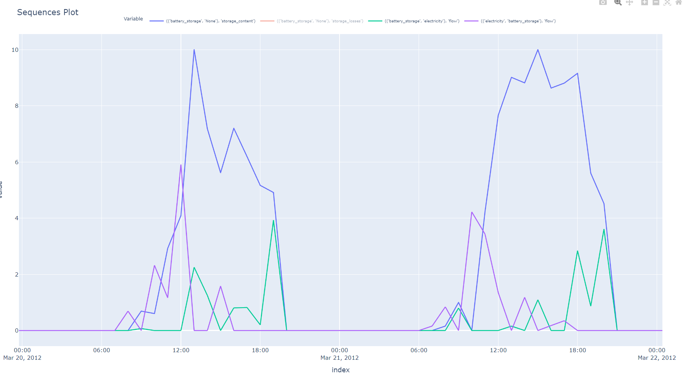

</center>

---

#### 🎯 Dafür benötigt

* Zentrales System zur **Steuerung** und **Optimierung**
* **Smart Metering** für genaue Verbrauchsdaten und Abrechnung
* Schnittstelle oder Bus-Systeme für **Speicher-Management**  und
* externe **Datenquellen** für Wetterdaten, Strompreise, ...


---

### Semester 1: Grundlagen Informationstechnologie & Datensicherheit

####


<center>

|      | 
|-----------------------------------------------|
| 1. Rechnersysteme                                     | 
| 2. Informationsdarstellung                                | 
| 3. Compiler und Algorithmen                       | 
| 4. Programmieren                      | 
| 5. Datenspeicherung                                 |
| 6. Kommunikation                              | 
| 7. IT-Sicherheit und Datenschutz                                 |      
       

</center>

---

### Semester 2:    Bussysteme

####

<center>

|   |
-------------------------------------|
| 1. Gebäudeautomation und Planung                   |
| 2. Messkette und  Computer-Systeme   |
| 3. Steuerung- und Regelungstechnik                    |
| 4. Speicherprogrammierbare Steuerung   |
| 5. Bussysteme                          |
| 6. Smart Metering                      |

</center>


---

### Semester 2:  Labor Bussysteme

<center>


</center>


<!--
---


### Internet of Things

<center>

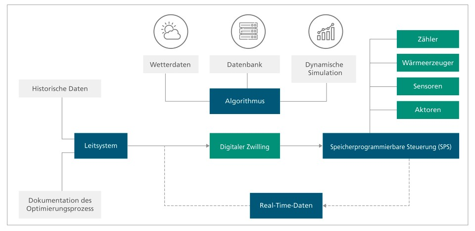

</center>

[🔗](https://www.itwm.fraunhofer.de/de/abteilungen/sys/energieerzeugung-und-verteilung/heizen-ki-prozess-anlagen.html)

---

### Verteiler (`Bus`)

* Anschluss von Quellen, Senken, Speichern und Konvertern
* keine Übertragung von Energie
* keine Speicherung von Energie

#### 

```Python
# create electricity bus
bus_electricity = buses.Bus(label="electricity")

# adding the buses to the energy system
energysystem.add(bus_electricity)
```

---

### Energiefluss (`Flow`)

* Energiefluss von einer Komponente zu einer anderen
* z.B. Strom, Wärme, Gas, Wasserstoff

####

```Python
bus_electricity: flows.Flow(
                    fix=data["h0"], nominal_value=1.2
                )
```
---

### Quelle (`Source`)

* Angeschossen an einem Bus
* Einspeisung
    * Fix z.B. Spitzenleistung einer PV-Anlage (10 kW)
    * Variabel z.B. Zeitreihe einer PV-Erzeugung (`data["pv"]`)
#### 

```Python	
energysystem.add(
    components.Source(
        label="pv",
        outputs={
            bus_electricity: flows.Flow(
                fix=data["pv"], nominal_value=10
            )
        },
    )
)
```

---

### Senken (`Sink`)

* Angeschossen an einem Bus
* Einspeisung
    * Fix
    * Variabel (z.B. Netzeinspeisung hat keine Restriktionen)
* Kosten (z.B. 5 ct/kWh)

#### 

```Python
energysystem.add(
    components.Sink(
        label="grid_feedout",
        inputs={bus_electricity: flows.Flow(variable_costs=-5)},
    )
)
```

---

### Speicher (`Storage`)

* Angeschossen an einem Bus
* Speicherkapazität
* Lade- und Entladeleistung
* Wirkungsgrad (Ein- und Ausgang)
* zeitabhängige Kosten
* ggf. Kosten


#### Zustandsüberwachung

---

https://github.com/jonlesage/Microgrid-EMS-Optimization/blob/master/EMS_Optimization_Formulation.pdf


https://oemof-solph.readthedocs.io/en/stable/examples/basic_example.html#module-basic_example.basic_example

-->---

marp: true
theme: beams
author: Julian Huber
size: 16:9
footer: Julian Huber - Grundlagen Informationstechnologie & Datensicherheit
headingDivider: 2
# Strg+[ ] for Options

---


<!-- paginate: true -->


# Bussysteme


## 0 Organisatorisches

* Alle Unterlagen finden sich unter dem Link auf Sakai und werden bei Bedarf aktualisiert
* Zudem werden `pdf`-Versionen der Präsentationen und der Skripte bereitgestellt (Fehler in diesen werden während des Semesters nicht korrigiert)
* Die Vorlesung hat einen hohen Praxisanteil, auch die Klausur fokussiert sich auf die Anwendung des Wissens
* Während des Semesters gibt es keine Pflichtabgaben, jedoch wird die Mitarbeit in den Übungen und die Vorbereitung auf die Klausur empfohlen
* Das Labor baut auf den Inhalten der Vorlesung auf


## Leistungsbewertung

* Schriftliche Klausur (100%)
* Bei geringer Teilnehmer:innen-Zahl ist im Falle einer Nachklausur auch ein mündlicher Prüfungsmodus möglich.
* Labor undabhängig mittels Laborbericht


## Hardware-Empfehlung

* Für jede zweier-Gruppe wird die notwendige Hardware gestellt und für dauert des Semesters ausgeliehen
* Wer sich dennoch eigene Hardware zulegen möchte, dem wird folgendes empfohlen:
  * Raspberry Pi Pico (optional WH)
  * Breadboard
  * KY-018 - Fotowiderstand 
  * Optional: Sensoren und Aktoren
    * Widerstände $10\,k\Omega$ und $470\,k\Omega$
    * LEDs
    * Taster
    * Jumperkabel
---
marp: true
author: Julian Huber
size: 16:9
footer: Julian Huber - ecture Title

# Strg+[ ] for Options

---

# Topic 1 - Content
---

## Quicklinks

- [Google Colabs]()
- [Sakai Aufgaben]()


---

## 0 Organisatorisches---
marp: true
author: Julian Huber
size: 16:9
footer: Julian Huber - Lecture Title

theme: mci_marp
# Strg+[ ] for Options

---

# Topic 1

---

## Quicklinks

- [Google Colabs]()
- [Sakai Aufgaben]()


---

## 0 Organisatorisches---
marp: true
author: Julian Huber
size: 16:9
footer: Julian Huber - Lecture Title

# Strg+[ ] for Options

---

# Topic 1 - Task

---

## Quicklinks

- [Google Colabs]()
- [Sakai Aufgaben]()

---

### Third Level

---

#### Fourth Level

---

## 0 Organisatorisches